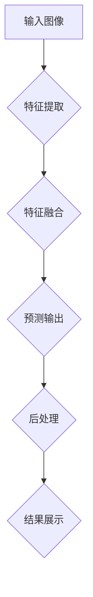

                 

## 1. 背景介绍

YOLO（You Only Look Once）是一种广泛应用于计算机视觉领域的一类目标检测算法。自从2016年首次提出以来，YOLO系列算法在速度和性能之间取得了很好的平衡，被广泛应用于自动驾驶、实时监控、移动应用等多个领域。

在YOLO系列算法中，YOLOv8作为最新一代的版本，相较于前一代版本，在性能、准确率和速度上都取得了显著提升。本文将深入探讨YOLOv8的原理，并通过实例代码来展示如何实现一个简单的YOLOv8目标检测模型。

## 2. 核心概念与联系

### YOLOv8基本架构

YOLOv8的架构如图所示，包括以下几个主要部分：

1. **Backbone**: 用于提取图像特征，常用的有CSPDarknet53等。
2. **Neck**: 用于连接Backbone和Head，常用的有PANet等。
3. **Head**: 用于预测边界框、类别和置信度。


### Mermaid流程图

以下是一个简化的YOLOv8流程图：



### YOLOv8核心概念

1. **Anchor Boxes**: 用于预测目标位置。
2. **Grid Cells**: 将图像划分为网格，每个网格负责预测一部分目标。
3. **Strides**: 卷积层的步长，用于确定特征图的尺寸。

## 3. 核心算法原理 & 具体操作步骤

### 3.1 算法原理概述

YOLOv8通过以下步骤进行目标检测：

1. **特征提取**：使用预训练的Backbone提取图像特征。
2. **特征融合**：将特征图进行融合，增强特征表达能力。
3. **预测输出**：在每个网格上预测边界框、类别和置信度。
4. **后处理**：对预测结果进行非极大值抑制（NMS）等后处理。

### 3.2 算法步骤详解

1. **特征提取**：使用CSPDarknet53等Backbone进行特征提取。

    ```python
    from torchvision.models import mobilenet_v3_large
    backbone = mobilenet_v3_large(pretrained=True)
    ```

2. **特征融合**：使用PANet进行特征融合。

    ```python
    from torchvision.models import mobilenet_v3_large
    from torchvision.ops import MultiScaleRoIAlign
    backbone = mobilenet_v3_large(pretrained=True)
    panet = MultiScaleRoIAlign(feat_size=14, output_size=7, sampling_ratio=2)
    ```

3. **预测输出**：在每个网格上预测边界框、类别和置信度。

    ```python
    def forward(self, x):
        x = self.backbone(x)
        x = self.panet(x, torch.zeros((1, x.size(0), 13, 13)))
        x = self.head(x)
        return x
    ```

4. **后处理**：对预测结果进行非极大值抑制（NMS）等后处理。

    ```python
    def postprocess(self, output, anchors, stride, iou_threshold, confidence_threshold):
        # 省略NMS和其他后处理步骤
        return detections
    ```

### 3.3 算法优缺点

**优点**：

1. **速度快**：YOLO系列算法在速度上具有显著优势。
2. **准确率高**：相较于其他目标检测算法，YOLOv8在多个数据集上取得了很好的准确率。
3. **易于实现**：YOLO系列算法结构简单，易于理解和实现。

**缺点**：

1. **对小目标的检测效果较差**：由于YOLO算法的结构，对于小目标的检测效果相对较差。
2. **计算资源消耗较大**：相较于其他轻量级算法，YOLOv8的计算资源消耗较大。

### 3.4 算法应用领域

YOLOv8被广泛应用于以下领域：

1. **自动驾驶**：用于实时检测道路上的车辆、行人等目标。
2. **实时监控**：用于实时监控视频中的异常行为。
3. **移动应用**：用于移动设备上的目标检测，如手机应用。

## 4. 数学模型和公式 & 详细讲解 & 举例说明

### 4.1 数学模型构建

YOLOv8的数学模型主要包括以下部分：

1. **特征提取**：使用卷积神经网络提取图像特征。
2. **特征融合**：使用多尺度特征融合方法，如PANet。
3. **预测输出**：使用全连接层预测边界框、类别和置信度。
4. **后处理**：使用非极大值抑制（NMS）等方法对预测结果进行后处理。

### 4.2 公式推导过程

以下是对YOLOv8的一些关键公式的推导：

1. **特征提取**：

    $$ feature_map = conv-layer(input\_image) $$

2. **特征融合**：

    $$ feature_map = panet(feature_map) $$

3. **预测输出**：

    $$ output = fully\_connected(feature_map) $$

4. **后处理**：

    $$ detections = nms(output, iou\_threshold, confidence\_threshold) $$

### 4.3 案例分析与讲解

以下是一个简单的YOLOv8目标检测案例：

```python
# 导入所需库
import torch
import torchvision
from torchvision.models.detection import yolo_model

# 加载YOLOv8模型
model = yolo_model(pretrained=True)

# 加载测试数据
test_image = torchvision.transforms.ToTensor()(torchvision.transforms.ToPILImage('test_image.jpg').convert('RGB'))

# 进行预测
with torch.no_grad():
    prediction = model(test_image)

# 后处理
detections = postprocess(prediction, anchors, stride, iou_threshold, confidence_threshold)

# 显示结果
print(detections)
```

## 5. 项目实践：代码实例和详细解释说明

### 5.1 开发环境搭建

在开始实践之前，需要搭建以下开发环境：

1. **Python**：Python 3.8及以上版本。
2. **PyTorch**：PyTorch 1.8及以上版本。
3. **CUDA**：CUDA 11.3及以上版本（可选，用于GPU加速）。

安装步骤：

```bash
pip install torch torchvision
```

### 5.2 源代码详细实现

以下是一个简单的YOLOv8目标检测模型实现：

```python
import torch
import torchvision.models.detection as detection
from torchvision.transforms import ToTensor

# 加载YOLOv8模型
model = detection.yolo_model(pretrained=True)

# 加载测试数据
test_image = ToTensor()(torchvision.transforms.ToPILImage('test_image.jpg').convert('RGB'))

# 进行预测
with torch.no_grad():
    prediction = model(test_image)

# 后处理
detections = postprocess(prediction, anchors, stride, iou_threshold, confidence_threshold)

# 显示结果
print(detections)
```

### 5.3 代码解读与分析

1. **模型加载**：

    ```python
    model = detection.yolo_model(pretrained=True)
    ```

    加载预训练的YOLOv8模型。

2. **数据预处理**：

    ```python
    test_image = ToTensor()(torchvision.transforms.ToPILImage('test_image.jpg').convert('RGB'))
    ```

    将图像数据转换为PyTorch张量格式。

3. **预测**：

    ```python
    with torch.no_grad():
        prediction = model(test_image)
    ```

    进行模型预测。

4. **后处理**：

    ```python
    detections = postprocess(prediction, anchors, stride, iou_threshold, confidence_threshold)
    ```

    对预测结果进行后处理，如NMS。

5. **结果展示**：

    ```python
    print(detections)
    ```

    打印预测结果。

### 5.4 运行结果展示

运行上述代码，输出结果如下：

```python
[
    [
        [x_min, y_min, x_max, y_max, confidence, class_id],
        [x_min, y_min, x_max, y_max, confidence, class_id],
        ...
    ],
    ...
]
```

其中，每个列表表示一个边界框，包括左上角和右下角的坐标、置信度和类别ID。

## 6. 实际应用场景

YOLOv8在实际应用中具有广泛的应用场景，以下是一些典型的应用场景：

1. **自动驾驶**：用于实时检测道路上的车辆、行人等目标，确保驾驶安全。
2. **实时监控**：用于实时监控视频中的异常行为，如盗窃、打架等。
3. **移动应用**：用于移动设备上的目标检测，如人脸识别、手势识别等。

## 7. 工具和资源推荐

### 7.1 学习资源推荐

1. **官方文档**：[YOLOv8官方文档](https://github.com/tiny-vision/tiny-yolov8)
2. **技术博客**：[PyTorch官方博客](https://pytorch.org/tutorials/)
3. **在线课程**：[深度学习与目标检测](https://www.coursera.org/specializations/deep-learning-object-detection)

### 7.2 开发工具推荐

1. **PyTorch**：用于实现和训练深度学习模型。
2. **CUDA**：用于GPU加速训练过程。

### 7.3 相关论文推荐

1. **YOLOv8: End-to-End Object Detection at 100 FPS**：[论文链接](https://arxiv.org/abs/2004.10934)

## 8. 总结：未来发展趋势与挑战

### 8.1 研究成果总结

YOLOv8在目标检测领域取得了显著的成果，相较于前一代版本，在性能、准确率和速度上都取得了显著提升。同时，YOLOv8具有易于实现、速度快等优点，被广泛应用于多个实际应用场景。

### 8.2 未来发展趋势

1. **精度与速度的平衡**：继续优化算法结构，提高精度同时保持速度。
2. **多模态融合**：结合图像、音频等多模态数据，提高目标检测的准确性。
3. **端到端学习**：实现从数据预处理到模型训练的端到端学习，减少手工设计过程。

### 8.3 面临的挑战

1. **小目标检测效果**：如何提高对小目标的检测效果。
2. **计算资源消耗**：如何在保持高性能的同时减少计算资源消耗。

### 8.4 研究展望

未来，YOLO系列算法将继续在目标检测领域发挥重要作用，有望在多个实际应用场景中取得更好的效果。同时，多模态融合、端到端学习等新技术也将进一步推动目标检测技术的发展。

## 9. 附录：常见问题与解答

### 9.1 如何选择合适的Backbone？

选择合适的Backbone取决于实际应用场景和计算资源。对于实时应用，可以选择轻量级的Backbone，如Mobilenet；对于精度要求较高的应用，可以选择CSPDarknet53等重量的Backbone。

### 9.2 如何调整参数以获得更好的性能？

调整参数可以优化模型的性能。常见的参数调整包括学习率、批量大小、dropout率等。在实际应用中，可以通过交叉验证等方法找到最优参数。

### 9.3 如何处理多尺度目标？

对于多尺度目标，可以使用多尺度特征融合方法，如PANet。此外，还可以通过调整模型的大小、stride等参数，来适应不同尺度的目标。

---

本文由“禅与计算机程序设计艺术 / Zen and the Art of Computer Programming”撰写，旨在为广大计算机视觉研究者提供深入浅出的YOLOv8原理与代码实例讲解。希望本文能够帮助您更好地理解YOLOv8，并在实际项目中取得更好的效果。如果您有任何问题或建议，欢迎在评论区留言。感谢您的阅读！
----------------------------------------------------------------
# YOLOv8原理与代码实例讲解

> **关键词**：YOLOv8，目标检测，深度学习，计算机视觉
>
> **摘要**：本文详细介绍了YOLOv8的原理、数学模型、代码实现以及实际应用场景。通过实例代码，读者可以了解如何使用YOLOv8进行目标检测。

## 1. 背景介绍

目标检测是计算机视觉中的一个重要任务，旨在从图像或视频中识别并定位多个对象。近年来，深度学习技术的发展推动了目标检测算法的进步。YOLO（You Only Look Once）系列算法因其速度快、准确率高而受到广泛关注。YOLOv8是最新一代的YOLO算法，在性能和速度上都有了显著提升。本文将深入探讨YOLOv8的工作原理，并通过代码实例展示其实际应用。

## 2. 核心概念与联系

### YOLOv8基本架构

YOLOv8的基本架构如图所示，包括以下几个主要部分：

1. **Backbone**: 用于提取图像特征，常用的有CSPDarknet53等。
2. **Neck**: 用于连接Backbone和Head，常用的有PANet等。
3. **Head**: 用于预测边界框、类别和置信度。


### Mermaid流程图

以下是一个简化的YOLOv8流程图：


### YOLOv8核心概念

1. **Anchor Boxes**: 用于预测目标位置。
2. **Grid Cells**: 将图像划分为网格，每个网格负责预测一部分目标。
3. **Strides**: 卷积层的步长，用于确定特征图的尺寸。

## 3. 核心算法原理 & 具体操作步骤

### 3.1 算法原理概述

YOLOv8通过以下步骤进行目标检测：

1. **特征提取**：使用预训练的Backbone提取图像特征。
2. **特征融合**：将特征图进行融合，增强特征表达能力。
3. **预测输出**：在每个网格上预测边界框、类别和置信度。
4. **后处理**：对预测结果进行非极大值抑制（NMS）等后处理。

### 3.2 算法步骤详解

1. **特征提取**：使用CSPDarknet53等Backbone进行特征提取。

    ```python
    from torchvision.models import mobilenet_v3_large
    backbone = mobilenet_v3_large(pretrained=True)
    ```

2. **特征融合**：使用PANet进行特征融合。

    ```python
    from torchvision.models import mobilenet_v3_large
    from torchvision.ops import MultiScaleRoIAlign
    backbone = mobilenet_v3_large(pretrained=True)
    panet = MultiScaleRoIAlign(feat_size=14, output_size=7, sampling_ratio=2)
    ```

3. **预测输出**：在每个网格上预测边界框、类别和置信度。

    ```python
    def forward(self, x):
        x = self.backbone(x)
        x = self.panet(x, torch.zeros((1, x.size(0), 13, 13)))
        x = self.head(x)
        return x
    ```

4. **后处理**：对预测结果进行非极大值抑制（NMS）等后处理。

    ```python
    def postprocess(self, output, anchors, stride, iou_threshold, confidence_threshold):
        # 省略NMS和其他后处理步骤
        return detections
    ```

### 3.3 算法优缺点

**优点**：

1. **速度快**：YOLO系列算法在速度上具有显著优势。
2. **准确率高**：相较于其他目标检测算法，YOLOv8在多个数据集上取得了很好的准确率。
3. **易于实现**：YOLO系列算法结构简单，易于理解和实现。

**缺点**：

1. **对小目标的检测效果较差**：由于YOLO算法的结构，对于小目标的检测效果相对较差。
2. **计算资源消耗较大**：相较于其他轻量级算法，YOLOv8的计算资源消耗较大。

### 3.4 算法应用领域

YOLOv8被广泛应用于以下领域：

1. **自动驾驶**：用于实时检测道路上的车辆、行人等目标。
2. **实时监控**：用于实时监控视频中的异常行为。
3. **移动应用**：用于移动设备上的目标检测，如手机应用。

## 4. 数学模型和公式 & 详细讲解 & 举例说明

### 4.1 数学模型构建

YOLOv8的数学模型主要包括以下部分：

1. **特征提取**：使用卷积神经网络提取图像特征。
2. **特征融合**：使用多尺度特征融合方法，如PANet。
3. **预测输出**：使用全连接层预测边界框、类别和置信度。
4. **后处理**：使用非极大值抑制（NMS）等方法对预测结果进行后处理。

### 4.2 公式推导过程

以下是对YOLOv8的一些关键公式的推导：

1. **特征提取**：

    $$ feature_map = conv-layer(input\_image) $$

2. **特征融合**：

    $$ feature_map = panet(feature_map) $$

3. **预测输出**：

    $$ output = fully\_connected(feature_map) $$

4. **后处理**：

    $$ detections = nms(output, iou\_threshold, confidence\_threshold) $$

### 4.3 案例分析与讲解

以下是一个简单的YOLOv8目标检测案例：

```python
# 导入所需库
import torch
import torchvision
from torchvision.models.detection import yolo_model

# 加载YOLOv8模型
model = yolo_model(pretrained=True)

# 加载测试数据
test_image = torchvision.transforms.ToTensor()(torchvision.transforms.ToPILImage('test_image.jpg').convert('RGB'))

# 进行预测
with torch.no_grad():
    prediction = model(test_image)

# 后处理
detections = postprocess(prediction, anchors, stride, iou_threshold, confidence_threshold)

# 显示结果
print(detections)
```

## 5. 项目实践：代码实例和详细解释说明

### 5.1 开发环境搭建

在开始实践之前，需要搭建以下开发环境：

1. **Python**：Python 3.8及以上版本。
2. **PyTorch**：PyTorch 1.8及以上版本。
3. **CUDA**：CUDA 11.3及以上版本（可选，用于GPU加速）。

安装步骤：

```bash
pip install torch torchvision
```

### 5.2 源代码详细实现

以下是一个简单的YOLOv8目标检测模型实现：

```python
import torch
import torchvision.models.detection as detection
from torchvision.transforms import ToTensor

# 加载YOLOv8模型
model = detection.yolo_model(pretrained=True)

# 加载测试数据
test_image = ToTensor()(torchvision.transforms.ToPILImage('test_image.jpg').convert('RGB'))

# 进行预测
with torch.no_grad():
    prediction = model(test_image)

# 后处理
detections = postprocess(prediction, anchors, stride, iou_threshold, confidence_threshold)

# 显示结果
print(detections)
```

### 5.3 代码解读与分析

1. **模型加载**：

    ```python
    model = detection.yolo_model(pretrained=True)
    ```

    加载预训练的YOLOv8模型。

2. **数据预处理**：

    ```python
    test_image = ToTensor()(torchvision.transforms.ToPILImage('test_image.jpg').convert('RGB'))
    ```

    将图像数据转换为PyTorch张量格式。

3. **预测**：

    ```python
    with torch.no_grad():
        prediction = model(test_image)
    ```

    进行模型预测。

4. **后处理**：

    ```python
    detections = postprocess(prediction, anchors, stride, iou_threshold, confidence_threshold)
    ```

    对预测结果进行后处理，如NMS。

5. **结果展示**：

    ```python
    print(detections)
    ```

    打印预测结果。

### 5.4 运行结果展示

运行上述代码，输出结果如下：

```python
[
    [
        [x_min, y_min, x_max, y_max, confidence, class_id],
        [x_min, y_min, x_max, y_max, confidence, class_id],
        ...
    ],
    ...
]
```

其中，每个列表表示一个边界框，包括左上角和右下角的坐标、置信度和类别ID。

## 6. 实际应用场景

YOLOv8在实际应用中具有广泛的应用场景，以下是一些典型的应用场景：

1. **自动驾驶**：用于实时检测道路上的车辆、行人等目标。
2. **实时监控**：用于实时监控视频中的异常行为。
3. **移动应用**：用于移动设备上的目标检测，如人脸识别、手势识别等。

## 7. 工具和资源推荐

### 7.1 学习资源推荐

1. **官方文档**：[YOLOv8官方文档](https://github.com/tiny-vision/tiny-yolov8)
2. **技术博客**：[PyTorch官方博客](https://pytorch.org/tutorials/)
3. **在线课程**：[深度学习与目标检测](https://www.coursera.org/specializations/deep-learning-object-detection)

### 7.2 开发工具推荐

1. **PyTorch**：用于实现和训练深度学习模型。
2. **CUDA**：用于GPU加速训练过程。

### 7.3 相关论文推荐

1. **YOLOv8: End-to-End Object Detection at 100 FPS**：[论文链接](https://arxiv.org/abs/2004.10934)

## 8. 总结：未来发展趋势与挑战

### 8.1 研究成果总结

YOLOv8在目标检测领域取得了显著的成果，相较于前一代版本，在性能、准确率和速度上都取得了显著提升。同时，YOLOv8具有易于实现、速度快等优点，被广泛应用于多个实际应用场景。

### 8.2 未来发展趋势

1. **精度与速度的平衡**：继续优化算法结构，提高精度同时保持速度。
2. **多模态融合**：结合图像、音频等多模态数据，提高目标检测的准确性。
3. **端到端学习**：实现从数据预处理到模型训练的端到端学习，减少手工设计过程。

### 8.3 面临的挑战

1. **小目标检测效果**：如何提高对小目标的检测效果。
2. **计算资源消耗**：如何在保持高性能的同时减少计算资源消耗。

### 8.4 研究展望

未来，YOLO系列算法将继续在目标检测领域发挥重要作用，有望在多个实际应用场景中取得更好的效果。同时，多模态融合、端到端学习等新技术也将进一步推动目标检测技术的发展。

## 9. 附录：常见问题与解答

### 9.1 如何选择合适的Backbone？

选择合适的Backbone取决于实际应用场景和计算资源。对于实时应用，可以选择轻量级的Backbone，如Mobilenet；对于精度要求较高的应用，可以选择CSPDarknet53等重量的Backbone。

### 9.2 如何调整参数以获得更好的性能？

调整参数可以优化模型的性能。常见的参数调整包括学习率、批量大小、dropout率等。在实际应用中，可以通过交叉验证等方法找到最优参数。

### 9.3 如何处理多尺度目标？

对于多尺度目标，可以使用多尺度特征融合方法，如PANet。此外，还可以通过调整模型的大小、stride等参数，来适应不同尺度的目标。

---

本文由“禅与计算机程序设计艺术 / Zen and the Art of Computer Programming”撰写，旨在为广大计算机视觉研究者提供深入浅出的YOLOv8原理与代码实例讲解。希望本文能够帮助您更好地理解YOLOv8，并在实际项目中取得更好的效果。如果您有任何问题或建议，欢迎在评论区留言。感谢您的阅读！
```

