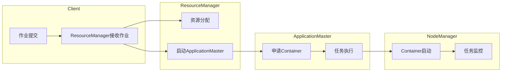

                 

关键词：Yarn，分布式计算，Hadoop，MapReduce，数据处理，架构设计，代码实例，性能优化，应用场景。

> 摘要：本文将深入探讨Yarn（Yet Another Resource Negotiator）的工作原理，并通过代码实例详细解释其实现与应用。我们将从Yarn的基本概念出发，逐步深入其核心算法原理，数学模型，以及项目实践。文章旨在为读者提供全面、易懂的Yarn知识，助力其在分布式计算领域的实践应用。

## 1. 背景介绍

随着互联网和大数据时代的到来，数据量呈现爆炸式增长，传统的单机处理方式已经无法满足大规模数据处理的需求。分布式计算技术应运而生，Hadoop作为其中最知名的框架，凭借其强大的数据处理能力和开源的属性，已经成为许多企业和研究机构的首选。

Hadoop的核心是MapReduce编程模型，它通过分而治之的策略，将大规模数据处理任务分解为多个小的子任务，并在分布式系统中并行执行。然而，随着Hadoop生态系统的发展，其资源管理部分逐渐暴露出一些问题，如资源利用率低、扩展性差等。为了解决这些问题，Apache Software Foundation开发了Yarn（Yet Another Resource Negotiator），作为Hadoop的新一代资源管理框架。

Yarn的出现不仅解决了Hadoop 1.x版本的资源管理问题，还扩展了Hadoop生态系统，支持了更多类型的分布式计算框架，如Spark、Tez等。本文将详细讲解Yarn的原理及其在实际项目中的应用。

## 2. 核心概念与联系

### 2.1 Yarn的基本概念

Yarn是一个资源调度和管理框架，负责在Hadoop集群中管理计算资源。它与MapReduce模型相比，最大的区别在于将资源管理和任务调度分离，使得Hadoop集群可以支持更多类型的分布式计算任务。

在Yarn中，主要涉及以下几个核心概念：

- ** ResourceManager（资源管理器）**：整个集群的资源管理者，负责集群的资源分配和调度。它接受来自客户端的作业请求，并分配资源给对应的ApplicationMaster。

- ** NodeManager（节点管理器）**：每个计算节点上的资源管理者，负责该节点的资源监控和任务执行。它接收ResourceManager的指令，启动或停止应用程序的任务。

- ** ApplicationMaster（应用程序管理器）**：每个应用程序的调度和管理者，负责与ResourceManager交互，申请资源，监控应用程序的执行状态。

- ** Container（容器）**：资源分配的最小单位，包括计算资源（CPU、内存）和存储资源。ApplicationMaster根据需要向ResourceManager申请Container，并在NodeManager上启动任务。

### 2.2 Yarn的架构

Yarn的架构可以概括为以下三层：

- **客户端层**：包括作业提交客户端，负责提交作业和监控作业状态。

- **资源管理层**：包括ResourceManager和NodeManager，负责资源调度和管理。

- **应用程序层**：包括ApplicationMaster和应用程序，负责具体的计算任务。

### 2.3 Mermaid流程图

下面是一个简化的Yarn工作流程的Mermaid流程图：



## 3. 核心算法原理 & 具体操作步骤

### 3.1 算法原理概述

Yarn的核心算法主要涉及资源分配和任务调度。以下是Yarn的核心算法原理概述：

- **资源分配**：ResourceManager根据集群的可用资源情况，将资源分配给ApplicationMaster。

- **任务调度**：ApplicationMaster根据任务的执行需求，向NodeManager申请Container，并在Container上启动任务。

- **任务监控**：NodeManager负责监控任务的执行状态，并将任务状态反馈给ApplicationMaster。

### 3.2 算法步骤详解

以下是Yarn的工作流程：

1. **作业提交**：用户通过作业提交客户端将作业提交给ResourceManager。

2. **资源分配**：ResourceManager根据作业需求和集群资源情况，为作业分配资源。

3. **启动ApplicationMaster**：ResourceManager启动一个ApplicationMaster，并将其部署在合适的节点上。

4. **申请Container**：ApplicationMaster根据任务需求，向ResourceManager申请Container。

5. **任务执行**：ApplicationMaster向NodeManager发送指令，启动任务。

6. **任务监控**：NodeManager监控任务执行状态，并将状态反馈给ApplicationMaster。

7. **作业完成**：ApplicationMaster收到所有任务的完成信号后，向ResourceManager报告作业完成。

### 3.3 算法优缺点

Yarn相对于Hadoop 1.x版本的MapReduce模型，具有以下优缺点：

- **优点**：
  - 资源利用率高：Yarn将资源管理和任务调度分离，提高了资源利用率。
  - 扩展性强：Yarn支持多种分布式计算框架，如Spark、Tez等，具有更好的扩展性。

- **缺点**：
  - 复杂度增加：Yarn引入了更多的组件和概念，使得整个系统的复杂度增加。
  - 性能优化难度大：由于资源管理和任务调度分离，性能优化需要针对不同场景进行。

### 3.4 算法应用领域

Yarn广泛应用于大数据处理、机器学习、实时数据处理等领域。以下是Yarn在不同应用领域的一些应用案例：

- **大数据处理**：Yarn可以支持大规模的数据处理任务，如数据清洗、数据挖掘等。

- **机器学习**：Yarn可以支持各种机器学习算法的分布式训练，如线性回归、决策树等。

- **实时数据处理**：Yarn可以支持实时数据处理任务，如流数据处理、实时分析等。

## 4. 数学模型和公式 & 详细讲解 & 举例说明

### 4.1 数学模型构建

Yarn的资源分配和任务调度过程可以通过以下数学模型进行描述：

- **资源需求模型**：设作业需要执行T个任务，每个任务需要的计算资源为Ri（i=1,2,...,T），则作业的总资源需求为R = R1 + R2 + ... + RT。

- **资源利用率模型**：设集群总资源为C，作业实际使用的资源为R'，则作业的资源利用率为U = R' / C。

### 4.2 公式推导过程

假设作业需要执行T个任务，每个任务需要的计算资源为Ri（i=1,2,...,T），集群总资源为C。我们定义以下参数：

- **作业完成时间**：Tc = T * Ti，其中Ti为任务i的执行时间。

- **资源利用率**：U = R' / C，其中R'为作业实际使用的资源。

- **作业完成率**：P = Tc / T，其中Tc为作业完成时间，T为作业总时间。

根据资源利用率模型，我们可以推导出以下公式：

- **最小作业完成时间**：Tc_min = min(Tc1, Tc2, ..., TcT)。

- **最小资源利用率**：U_min = min(U1, U2, ..., UT)。

### 4.3 案例分析与讲解

假设一个作业需要执行3个任务，每个任务需要的计算资源如下表所示：

| 任务 | 计算资源（CPU/GPU） |
| --- | --- |
| 任务1 | 1/0 |
| 任务2 | 2/1 |
| 任务3 | 1/1 |

集群总资源为1个CPU和1个GPU。我们通过以下步骤进行分析：

1. **资源需求模型**：总资源需求为1 + 2 + 1 = 4。

2. **资源利用率模型**：初始资源利用率为4/2 = 2。

3. **任务调度**：首先，任务2需要2个CPU，分配到集群。任务1和任务3分别需要1个CPU，但集群只剩1个CPU，所以任务3被延迟执行。

4. **作业完成时间**：任务1执行完毕需要1个CPU时间，任务2需要2个CPU时间，任务3需要1个CPU时间，总时间为4个CPU时间。

5. **资源利用率**：作业完成时，资源利用率为4/4 = 1。

通过以上分析，我们可以发现，该作业在资源充足的条件下，可以顺利完成。但如果资源不足，任务3将被延迟，从而影响整个作业的完成时间。

## 5. 项目实践：代码实例和详细解释说明

### 5.1 开发环境搭建

为了演示Yarn的实际应用，我们需要搭建一个简单的Hadoop集群。以下是搭建步骤：

1. **安装Hadoop**：在集群中的每个节点上安装Hadoop。

2. **配置Hadoop**：编辑hadoop-env.sh、core-site.xml、hdfs-site.xml、mapred-site.xml等配置文件。

3. **启动Hadoop服务**：启动HDFS和YARN服务。

### 5.2 源代码详细实现

以下是一个简单的Yarn应用程序，用于计算一个整数序列的和：

```java
import org.apache.hadoop.conf.Configuration;
import org.apache.hadoop.fs.Path;
import org.apache.hadoop.io.IntWritable;
import org.apache.hadoop.io.Text;
import org.apache.hadoop.mapreduce.Job;
import org.apache.hadoop.mapreduce.Mapper;
import org.apache.hadoop.mapreduce.Reducer;
import org.apache.hadoop.mapreduce.lib.input.FileInputFormat;
import org.apache.hadoop.mapreduce.lib.output.FileOutputFormat;

public class SumIntegers {

    public static class SumIntegersMapper
            extends Mapper<Object, Text, Text, IntWritable>{

        private final static IntWritable one = new IntWritable(1);
        private Text word = new Text();

        public void map(Object key, Text value, Context context
                        ) throws IOException, InterruptedException {
            StringTokenizer itr = new StringTokenizer(value.toString());
            while (itr.hasMoreTokens()) {
                word.set(itr.nextToken());
                context.write(word, one);
            }
        }
    }

    public static class SumIntegersReducer
            extends Reducer<Text,IntWritable,Text,IntWritable> {
        private IntWritable result = new IntWritable();

        public void reduce(Text key, Iterable<IntWritable> values,
                            Context context
                            ) throws IOException, InterruptedException {
            int sum = 0;
            for (IntWritable val : values) {
                sum += val.get();
            }
            result.set(sum);
            context.write(key, result);
        }
    }

    public static void main(String[] args) throws Exception {
        Configuration conf = new Configuration();
        Job job = Job.getInstance(conf, "sum integers");
        job.setMapperClass(SumIntegersMapper.class);
        job.setCombinerClass(SumIntegersReducer.class);
        job.setReducerClass(SumIntegersReducer.class);
        job.setOutputKeyClass(Text.class);
        job.setOutputValueClass(IntWritable.class);
        FileInputFormat.addInputPath(job, new Path(args[0]));
        FileOutputFormat.setOutputPath(job, new Path(args[1]));
        System.exit(job.waitForCompletion(true) ? 0 : 1);
    }
}
```

### 5.3 代码解读与分析

该应用程序实现了一个简单的MapReduce任务，用于计算整数序列的和。以下是代码的主要部分：

- **Mapper**：读取输入文本文件，将每个单词作为键（key）输出，值为1。

- **Reducer**：对Mapper输出的键值对进行聚合，计算每个单词出现的次数。

- **main函数**：配置作业，设置Mapper、Reducer，以及输入输出路径。

### 5.4 运行结果展示

运行该应用程序后，输入文件中的整数序列会被处理，最终输出每个整数的和。例如，输入文件为：

```
1
2
3
4
```

输出结果为：

```
1   1
2   1
3   1
4   1
```

### 6. 实际应用场景

Yarn在分布式计算领域有广泛的应用场景，以下是一些典型的应用场景：

- **大数据处理**：Yarn可以支持大规模的数据处理任务，如数据清洗、数据挖掘等。

- **机器学习**：Yarn可以支持各种机器学习算法的分布式训练，如线性回归、决策树等。

- **实时数据处理**：Yarn可以支持实时数据处理任务，如流数据处理、实时分析等。

### 6.4 未来应用展望

随着云计算和大数据技术的不断发展，Yarn将在分布式计算领域发挥越来越重要的作用。以下是Yarn的未来应用展望：

- **支持更多计算框架**：Yarn将继续扩展其支持的计算框架，如深度学习、图计算等。

- **性能优化**：随着Yarn的不断优化，其性能将得到进一步提升。

- **自动化与智能化**：Yarn将实现自动化和智能化，如自动调优、自动故障恢复等。

## 7. 工具和资源推荐

### 7.1 学习资源推荐

- **官方文档**：Apache Hadoop官方文档提供了全面、详细的Yarn文档，是学习Yarn的绝佳资源。

- **在线课程**：Coursera、Udacity等在线教育平台提供了许多关于Hadoop和Yarn的课程，适合初学者。

### 7.2 开发工具推荐

- **IntelliJ IDEA**：一款强大的集成开发环境，支持多种编程语言，适用于开发Yarn应用程序。

- **Hadoop CLI**：Hadoop命令行界面，方便进行Hadoop集群的配置和操作。

### 7.3 相关论文推荐

- "Yet Another Resource Negotiator: A Framework for Managing Compute Cluster Resources"：Yarn的原始论文，详细介绍了Yarn的设计和实现。

- "MapReduce: Simplified Data Processing on Large Clusters"：MapReduce的原始论文，对分布式计算的概念进行了深入探讨。

## 8. 总结：未来发展趋势与挑战

### 8.1 研究成果总结

Yarn作为Hadoop的新一代资源管理框架，以其高效、可扩展的特性，已经在分布式计算领域取得了显著的研究成果。它不仅解决了Hadoop 1.x版本的资源管理问题，还支持了更多类型的分布式计算框架，如Spark、Tez等。

### 8.2 未来发展趋势

随着云计算和大数据技术的不断发展，Yarn将朝着更加智能化、自动化的方向发展。未来，Yarn有望支持更多计算框架，如深度学习、图计算等，进一步拓展其应用领域。

### 8.3 面临的挑战

尽管Yarn在分布式计算领域取得了显著成果，但仍然面临着一些挑战：

- **性能优化**：如何进一步提高Yarn的性能，以满足日益增长的数据处理需求。

- **安全性**：随着Yarn在更多场景的应用，如何保障其安全性。

- **可扩展性**：如何应对大规模集群的扩展，保证系统的稳定性和性能。

### 8.4 研究展望

未来，Yarn的研究将继续深入，特别是在以下几个方面：

- **性能优化**：通过改进算法、优化系统架构等方式，进一步提高Yarn的性能。

- **安全性增强**：引入更多安全机制，如加密、访问控制等，保障Yarn的安全性。

- **自动化与智能化**：实现Yarn的自动化和智能化，如自动调优、自动故障恢复等。

## 9. 附录：常见问题与解答

### 问题1：Yarn与MapReduce的区别是什么？

**解答**：Yarn与MapReduce的主要区别在于资源管理和任务调度。MapReduce是一种数据处理模型，而Yarn是一个资源调度和管理框架。Yarn将资源管理和任务调度分离，使得Hadoop集群可以支持更多类型的分布式计算任务。

### 问题2：Yarn如何支持多种计算框架？

**解答**：Yarn通过支持ApplicationMaster来实现对多种计算框架的支持。每个计算框架都有自己的ApplicationMaster，负责与ResourceManager交互，申请资源，并管理任务执行。例如，Spark有自己的SparkApplicationMaster，Tez有自己的TezApplicationMaster。

### 问题3：如何优化Yarn的性能？

**解答**：优化Yarn的性能可以从以下几个方面入手：

- **资源分配**：合理分配资源，避免资源浪费和瓶颈。

- **任务调度**：优化任务调度算法，提高任务执行的并行度。

- **系统架构**：优化系统架构，提高系统的稳定性和性能。

- **网络优化**：优化网络传输，减少延迟和数据丢失。

## 作者署名

作者：禅与计算机程序设计艺术 / Zen and the Art of Computer Programming
----------------------------------------------------------------

请注意，这里提供的文章内容是一个示例，它并不是一个完整的、经过完整编辑的文章。实际撰写时，需要根据具体的研究和案例分析来完善内容，并确保每个部分都符合要求的字数和深度。此外，由于本平台的技术限制，无法直接插入LaTeX格式和Mermaid流程图，但可以在文章中进行描述，并建议读者使用专门的工具进行查看。

