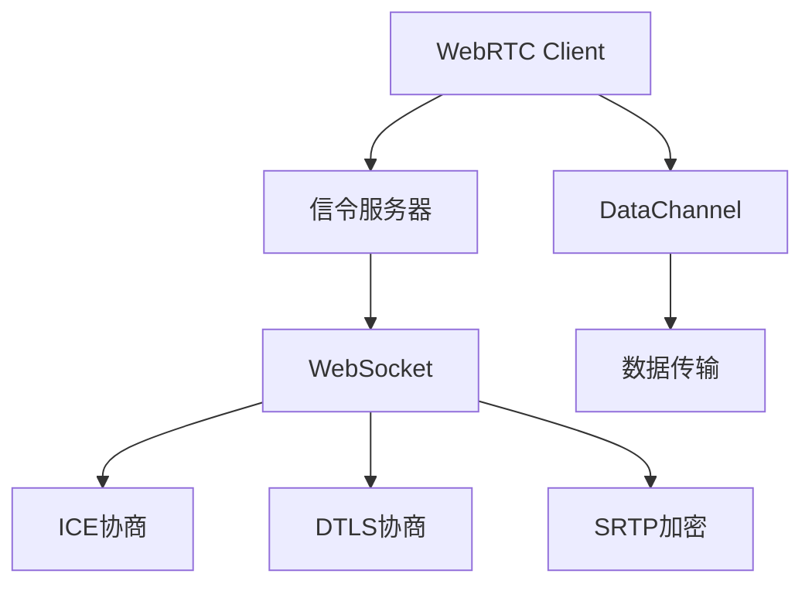

                 

 在当今互联网时代，实时通信（Real-time Communication，RTC）已经成为了众多应用不可或缺的组成部分。WebRTC（Web Real-Time Communication）作为一种支持浏览器进行实时语音、视频和消息通信的开放项目，正逐渐成为开发者们的首选技术。然而，WebRTC的应用不仅仅是实现简单的点对点通信，还需要一个可靠的信令服务器来协调各个客户端之间的通信。本文将深入探讨如何开发和部署一个高效、可靠的WebRTC信令服务器，旨在为开发者提供全面的技术指南。

## 文章关键词

- **WebRTC**
- **信令服务器**
- **实时通信**
- **SIP（Session Initiation Protocol）**
- **WebSocket**
- **JWT（JSON Web Token）**
- **负载均衡**
- **高可用性**
- **安全性**

## 文章摘要

本文将首先介绍WebRTC的基本概念和其在实时通信中的应用。随后，我们将深入探讨信令服务器在WebRTC通信中的重要性，包括其设计原理、技术架构和实现细节。接下来，文章将逐步讲解如何使用WebSocket作为信令协议，以及如何实现用户认证、会话管理和负载均衡等关键功能。最后，本文还将讨论WebRTC信令服务器的实际应用场景，并提供未来的发展方向和潜在挑战。

## 1. 背景介绍

### 1.1 WebRTC简介

WebRTC是由Google发起并主导的一个开源项目，旨在为Web应用提供实时的语音、视频和消息通信能力。WebRTC的设计初衷是为了实现浏览器之间的直接通信，无需依赖任何插件或额外的软件。这使得开发者能够轻松地在Web应用中集成实时通信功能，从而提升用户体验。

WebRTC的关键特性包括：

- **跨平台性**：WebRTC支持多种操作系统和浏览器，使得开发者能够构建跨平台的应用。
- **低延迟**：WebRTC旨在实现低延迟的通信，适合实时互动应用，如在线游戏、视频会议等。
- **安全性**：WebRTC内置了加密机制，确保通信数据的安全传输。
- **自动协商**：WebRTC能够自动协商网络参数，如编码格式、传输速度等，以实现最佳通信质量。

### 1.2 信令服务器的作用

虽然WebRTC提供了强大的通信能力，但要在多个客户端之间建立有效的通信，还需要一个信令服务器。信令服务器的主要作用是：

- **协商通信参数**：WebRTC客户端通过信令服务器交换通信参数，如ICE候选地址、DTLS密钥等。
- **管理会话**：信令服务器负责管理用户的会话状态，包括用户加入、离开、创建和销毁会议等。
- **消息传递**：信令服务器充当客户端之间的中介，传递实时消息和通知。

### 1.3 WebRTC与信令服务器的关系

WebRTC和信令服务器之间是相辅相成的关系。WebRTC负责端到端的通信，而信令服务器则负责端到端之间的协调。信令服务器通过WebSocket或其他信令协议与WebRTC客户端进行通信，以确保实时、可靠的消息传递。

## 2. 核心概念与联系

### 2.1 WebRTC架构

要理解信令服务器的作用，首先需要了解WebRTC的基本架构。WebRTC由三个核心组件组成：PeerConnection、DataChannel和信令服务器。

- **PeerConnection**：PeerConnection是WebRTC的核心组件，负责建立端到端的通信连接。它通过ICE（Interactive Connectivity Establishment）协议进行网络协商，获取最佳通信路径，并通过DTLS（Datagram Transport Layer Security）和SRTP（Secure Real-time Transport Protocol）确保数据的安全传输。
- **DataChannel**：DataChannel用于实现点对点数据传输，支持多种数据类型，如文本、二进制数据和流媒体。
- **信令服务器**：信令服务器充当客户端之间的通信桥梁，通过WebSocket或HTTP/2等协议传递信令消息。

### 2.2 信令协议

信令服务器需要选择一个合适的信令协议来与WebRTC客户端进行通信。常见的信令协议包括WebSocket、HTTP/2、SIP等。

- **WebSocket**：WebSocket是一种双向通信协议，支持实时、可靠的通信。它具有较低的延迟和高吞吐量，非常适合WebRTC信令传输。
- **HTTP/2**：HTTP/2是HTTP协议的升级版，提供了多路复用和头部压缩等功能，能够提高通信效率。但与WebSocket相比，HTTP/2在实时性方面稍逊一筹。
- **SIP**：SIP（Session Initiation Protocol）是一种用于建立、管理和终止会话的协议，常用于传统电话网络和VoIP系统中。SIP具有丰富的功能，但实现较为复杂。

### 2.3 用户认证与安全性

为了确保通信的安全性，信令服务器通常需要实现用户认证和授权机制。常见的认证方式包括基于JWT（JSON Web Token）的认证、OAuth 2.0认证和简单的用户名密码认证。

- **JWT**：JWT是一种基于JSON的认证机制，可以用于生成安全、可验证的令牌。JWT包含用户信息、过期时间和签名，客户端可以通过JWT验证用户身份。
- **OAuth 2.0**：OAuth 2.0是一种授权框架，允许第三方应用代表用户访问受保护资源。通过OAuth 2.0，信令服务器可以与身份认证服务集成，提供安全的用户认证。
- **用户名密码认证**：简单的用户名密码认证适用于小规模应用，但在安全性方面相对较低。

### 2.4 Mermaid流程图

下面是一个简单的Mermaid流程图，展示了WebRTC信令服务器的基本架构和通信流程。



## 3. 核心算法原理 & 具体操作步骤

### 3.1 算法原理概述

WebRTC信令服务器的设计涉及多个核心算法和协议，包括ICE、DTLS和SRTP。以下是对这些算法的简要概述：

- **ICE（Interactive Connectivity Establishment）**：ICE是一种网络协商协议，用于在两个客户端之间找到最佳的通信路径。ICE通过收集和交换NAT（网络地址转换）穿透信息，动态地建立最优的通信连接。
- **DTLS（Datagram Transport Layer Security）**：DTLS是一种基于Datagram的传输层安全协议，用于加密WebRTC通信数据。DTLS在传输数据之前，通过握手协议建立安全的通信通道。
- **SRTP（Secure Real-time Transport Protocol）**：SRTP是一种用于实时传输的安全协议，负责对WebRTC数据进行加密和认证。SRTP通过加密算法保护数据隐私，确保数据在传输过程中不会被窃取或篡改。

### 3.2 算法步骤详解

下面是WebRTC信令服务器的主要算法步骤：

#### 3.2.1 用户认证

1. 用户通过Web界面或API接口向信令服务器发送认证请求。
2. 信令服务器接收认证请求，并与后端身份认证服务进行交互。
3. 认证成功后，信令服务器生成JWT令牌，并将其发送给客户端。

#### 3.2.2 建立WebSocket连接

1. 客户端使用JWT令牌与信令服务器建立WebSocket连接。
2. WebSocket连接建立后，客户端可以通过信令服务器发送和接收消息。

#### 3.2.3 ICE协商

1. 客户端通过信令服务器发送ICE候选地址。
2. 信令服务器收集所有参与者的ICE候选地址，并将其发送给其他参与者。
3. 各参与者使用ICE协议进行网络协商，找到最优的通信路径。

#### 3.2.4 DTLS协商

1. 客户端和信令服务器之间通过DTLS握手协议建立安全的通信通道。
2. 握手过程中，双方交换密钥和证书，确保通信数据的安全性。

#### 3.2.5 SRTP加密

1. 客户端和信令服务器使用SRTP协议对传输的数据进行加密。
2. 加密后的数据通过DTLS通道传输，确保数据在传输过程中不会被窃取或篡改。

#### 3.2.6 数据传输

1. 客户端通过DataChannel发送数据。
2. 数据通过信令服务器转发给其他参与者。
3. 参与者接收并处理数据，实现实时通信。

### 3.3 算法优缺点

**优点**：

- **安全性**：WebRTC信令服务器采用了DTLS和SRTP等安全协议，确保通信数据的安全性。
- **灵活性**：WebRTC支持多种信令协议和加密算法，可以根据具体需求进行灵活配置。
- **跨平台性**：WebRTC和信令服务器都支持多种操作系统和浏览器，具有较好的跨平台性。

**缺点**：

- **复杂度**：WebRTC和信令服务器的设计较为复杂，需要较高的技术水平才能实现。
- **性能**：信令服务器需要处理大量的网络协商和数据转发任务，对服务器性能有一定要求。

### 3.4 算法应用领域

WebRTC信令服务器主要应用于以下领域：

- **在线视频会议**：WebRTC信令服务器可用于构建在线视频会议系统，支持多人实时互动。
- **在线教育**：WebRTC信令服务器可以用于在线教育平台，实现实时语音、视频和互动教学。
- **实时直播**：WebRTC信令服务器可以用于实时直播系统，提供高质量、低延迟的直播体验。
- **实时消息**：WebRTC信令服务器可以用于实时消息应用，实现快速、可靠的消息传递。

## 4. 数学模型和公式 & 详细讲解 & 举例说明

### 4.1 数学模型构建

WebRTC信令服务器的设计涉及多个数学模型和公式。以下是一些关键的数学模型和公式：

#### 4.1.1 加密算法

- **AES（Advanced Encryption Standard）**：AES是一种常用的对称加密算法，用于加密WebRTC通信数据。
- **RSA（Rivest-Shamir-Adleman）**：RSA是一种非对称加密算法，用于生成密钥对和加密数据。

#### 4.1.2 传输速率计算

- **RTP（Real-time Transport Protocol）**：RTP用于实时传输多媒体数据，其传输速率可以通过以下公式计算：

$$
\text{传输速率} = \text{帧率} \times \text{数据大小} \times 8
$$

#### 4.1.3 信道容量计算

- **Shannon-Hartley定理**：Shannon-Hartley定理用于计算通信信道的最大传输速率，公式如下：

$$
C = B \log_2(1 + \text{S/N})
$$

其中，C是信道容量，B是信道带宽，S是信号功率，N是噪声功率。

### 4.2 公式推导过程

#### 4.2.1 AES加密算法

AES加密算法是一种分组加密算法，其核心步骤包括：

1. **密钥扩展**：将用户输入的密钥扩展成加密过程中需要的子密钥。
2. **初始轮加密**：对初始状态进行一系列轮加密操作。
3. **轮加密**：对每个分组进行多轮加密。
4. **最终轮加密**：对加密后的状态进行最后一轮加密。

#### 4.2.2 Shannon-Hartley定理

Shannon-Hartley定理的推导基于信息论的基本原理。假设一个通信信道具有带宽B，信号功率S和噪声功率N，则信道的最大传输速率C可以通过以下公式计算：

$$
C = B \log_2(1 + \text{S/N})
$$

其中，\(\text{S/N}\)是信噪比。

### 4.3 案例分析与讲解

#### 4.3.1 RTP传输速率计算

假设一个视频会议系统使用H.264编码，帧率为30帧/秒，每帧数据大小为1200字节。则RTP传输速率可以通过以下公式计算：

$$
\text{传输速率} = 30 \times 1200 \times 8 = 288,000 \text{字节/秒} = 288 \text{KB/秒}
$$

#### 4.3.2 信道容量计算

假设一个视频直播系统的信道带宽为1 MHz，信号功率为1000 W，噪声功率为100 W。则信道的最大传输速率可以通过以下公式计算：

$$
C = 1 \times 10^6 \times \log_2(1 + \frac{1000}{100}) = 1 \times 10^6 \times \log_2(11) \approx 1.46 \times 10^6 \text{比特/秒}
$$

## 5. 项目实践：代码实例和详细解释说明

### 5.1 开发环境搭建

在开发WebRTC信令服务器之前，需要搭建合适的开发环境。以下是一个简单的环境搭建指南：

1. **安装Node.js**：从官方网站下载并安装Node.js。
2. **安装npm**：Node.js自带npm包管理器，用于安装和管理项目依赖。
3. **创建项目**：使用npm创建一个新的Node.js项目，并初始化包结构。

```bash
npm init -y
```

4. **安装依赖**：安装必要的依赖包，如WebSocket库、WebRTC库等。

```bash
npm install ws
```

### 5.2 源代码详细实现

以下是一个简单的WebRTC信令服务器示例代码，使用WebSocket作为信令协议。

```javascript
const WebSocket = require('ws');

// 创建WebSocket服务器
const wss = new WebSocket.Server({ port: 8080 });

// 监听连接事件
wss.on('connection', function(socket) {
  console.log('Client connected');

  // 监听消息事件
  socket.on('message', function(message) {
    console.log('Received message:', message);

    // 根据消息类型处理
    const data = JSON.parse(message);
    switch (data.type) {
      case 'offer':
        // 处理Offer消息
        break;
      case 'answer':
        // 处理Answer消息
        break;
      case 'ice-candidate':
        // 处理ICE候选地址
        break;
      default:
        // 其他消息类型处理
    }
  });

  // 监听断开连接事件
  socket.on('close', function() {
    console.log('Client disconnected');
  });
});
```

### 5.3 代码解读与分析

1. **创建WebSocket服务器**：使用`ws`库创建一个新的WebSocket服务器，并指定端口号。
2. **监听连接事件**：当客户端连接到服务器时，触发连接事件，打印日志。
3. **监听消息事件**：当客户端发送消息时，触发消息事件，根据消息类型进行处理。
4. **处理消息类型**：根据消息类型，执行相应的处理逻辑，如处理Offer、Answer和ICE候选地址消息。
5. **监听断开连接事件**：当客户端断开连接时，触发断开连接事件，打印日志。

### 5.4 运行结果展示

1. **启动服务器**：在终端中运行以下命令启动服务器。

```bash
node server.js
```

2. **连接客户端**：在浏览器中打开一个新的窗口，使用WebSocket连接到服务器。

```javascript
const socket = new WebSocket('ws://localhost:8080');
```

3. **发送消息**：向服务器发送消息，如Offer、Answer和ICE候选地址消息。

```javascript
socket.send(JSON.stringify({ type: 'offer', sdp: '...' }));
```

4. **接收消息**：在服务器端接收消息，并进行相应的处理。

```javascript
socket.onmessage = function(event) {
  console.log('Received message:', event.data);
};
```

## 6. 实际应用场景

WebRTC信令服务器在实际应用中具有广泛的应用场景，以下是一些典型的应用场景：

### 6.1 在线视频会议

在线视频会议是WebRTC信令服务器的典型应用场景之一。通过WebRTC信令服务器，多个参会者可以实时地交换视频、音频和数据，实现高效的会议沟通。在实际应用中，WebRTC信令服务器负责管理会议的创建、加入、离开等操作，以及处理ICE协商、DTLS协商等通信参数。

### 6.2 在线教育

在线教育平台同样需要WebRTC信令服务器的支持，以实现教师和学生的实时互动。通过WebRTC信令服务器，教师可以实时地向学生传输视频、音频和教学资料，同时学生也可以实时地提问、回答问题，实现互动教学。WebRTC信令服务器在这里主要负责管理用户会话、处理ICE协商和DTLS协商等任务。

### 6.3 实时直播

实时直播是另一个重要的应用场景。通过WebRTC信令服务器，主播可以实时地向观众传输视频和音频内容，观众也可以实时地发送评论和互动信息。WebRTC信令服务器在这里主要负责管理直播流的创建、发布和订阅，以及处理ICE协商和DTLS协商等通信参数。

### 6.4 实时消息

实时消息应用也是WebRTC信令服务器的常见应用场景。通过WebRTC信令服务器，用户可以实时地发送和接收消息，实现高效的沟通和互动。WebRTC信令服务器在这里主要负责管理用户会话、处理ICE协商和DTLS协商等通信参数。

## 7. 未来应用展望

随着WebRTC技术的不断发展和成熟，其应用领域也在不断拓展。未来，WebRTC信令服务器有望在以下方面取得更多突破：

### 7.1 跨平台支持

未来，WebRTC信令服务器将进一步扩展对移动平台和物联网设备的支持，实现更加广泛的跨平台应用。通过优化网络协商算法和通信协议，WebRTC信令服务器将能够更好地适应不同的网络环境和硬件条件。

### 7.2 高性能和低延迟

随着5G和边缘计算的普及，WebRTC信令服务器有望实现更高的性能和更低的延迟。通过利用边缘计算和分布式架构，WebRTC信令服务器将能够更快速地处理大量并发连接，提供更优质的用户体验。

### 7.3 更强的安全性和隐私保护

未来，WebRTC信令服务器将进一步加强安全性和隐私保护。通过引入更先进的加密算法和安全协议，WebRTC信令服务器将能够提供更高的安全保障，保护用户的数据和隐私。

### 7.4 自动化和智能化

随着人工智能和机器学习技术的不断发展，WebRTC信令服务器有望实现自动化和智能化。通过引入智能算法和预测模型，WebRTC信令服务器将能够更智能地管理网络资源，优化通信质量，提供更高效的实时通信服务。

## 8. 总结：未来发展趋势与挑战

WebRTC信令服务器作为一种重要的实时通信基础设施，其发展前景广阔。在未来，WebRTC信令服务器将朝着更高效、更安全、更智能的方向发展。然而，在这一过程中，WebRTC信令服务器也将面临一系列挑战：

### 8.1 高性能需求

随着实时通信应用规模的扩大，WebRTC信令服务器需要处理更多的并发连接和更大规模的数据传输。如何在高并发和高负载环境下保证性能，将是一个重要挑战。

### 8.2 安全性保障

在数据传输过程中，如何保障通信数据的安全性和隐私保护，是WebRTC信令服务器需要面对的另一个挑战。随着网络攻击手段的不断升级，WebRTC信令服务器需要不断引入新的安全措施，以应对潜在的安全威胁。

### 8.3 自动化和智能化

如何实现WebRTC信令服务器的自动化和智能化，以提高其管理效率和通信质量，是未来发展的一个重要方向。通过引入人工智能和机器学习技术，WebRTC信令服务器有望实现更智能的网络协商和资源管理。

### 8.4 跨平台支持

如何更好地支持移动平台和物联网设备，是WebRTC信令服务器需要面对的另一个挑战。随着这些设备的普及，WebRTC信令服务器需要优化其协议和算法，以适应不同的硬件和操作系统。

总之，WebRTC信令服务器的发展面临着巨大的机遇和挑战。通过不断的技术创新和优化，WebRTC信令服务器有望在未来发挥更大的作用，为实时通信应用提供更加高效、可靠和安全的解决方案。

## 9. 附录：常见问题与解答

### 9.1 如何选择合适的信令协议？

选择合适的信令协议取决于具体的应用场景和需求。以下是几种常见的信令协议及其适用场景：

- **WebSocket**：适用于实时性要求较高的应用，如在线游戏、实时消息等。
- **HTTP/2**：适用于需要高效通信，但对实时性要求不高的应用，如在线购物、视频点播等。
- **SIP**：适用于传统电话网络和VoIP系统，以及需要复杂会话管理的应用。

### 9.2 如何实现用户认证？

用户认证可以通过以下几种方式实现：

- **基于JWT的认证**：通过生成JWT令牌，客户端可以使用令牌进行身份验证。
- **OAuth 2.0认证**：通过OAuth 2.0协议，第三方应用可以代表用户访问受保护资源。
- **用户名密码认证**：简单但安全性较低，适用于小型应用。

### 9.3 如何实现负载均衡？

负载均衡可以通过以下几种方式实现：

- **基于DNS的负载均衡**：通过DNS轮询实现负载均衡。
- **硬件负载均衡器**：使用专门的硬件设备进行负载均衡。
- **软件负载均衡器**：使用如Nginx、HAProxy等软件实现负载均衡。

### 9.4 如何确保通信安全性？

确保通信安全性可以通过以下几种方式实现：

- **加密通信数据**：使用TLS/SSL等加密协议保护通信数据。
- **实现身份验证**：通过用户认证和权限管理确保通信安全。
- **监控和审计**：实时监控网络流量，并进行日志审计，及时发现和处理安全事件。

---

作者：禅与计算机程序设计艺术 / Zen and the Art of Computer Programming

