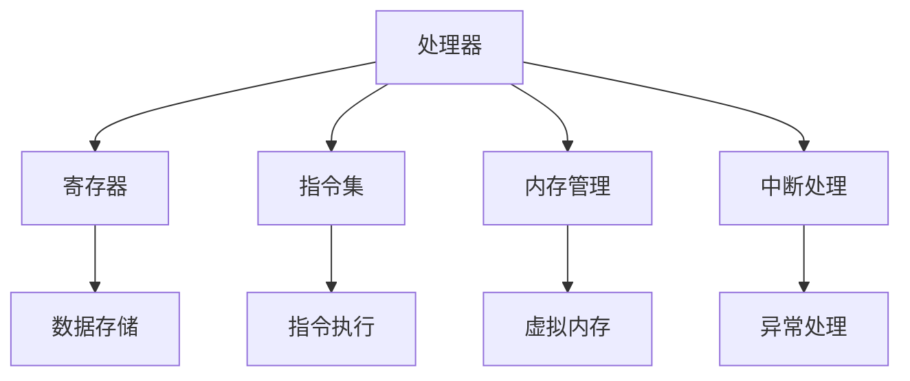
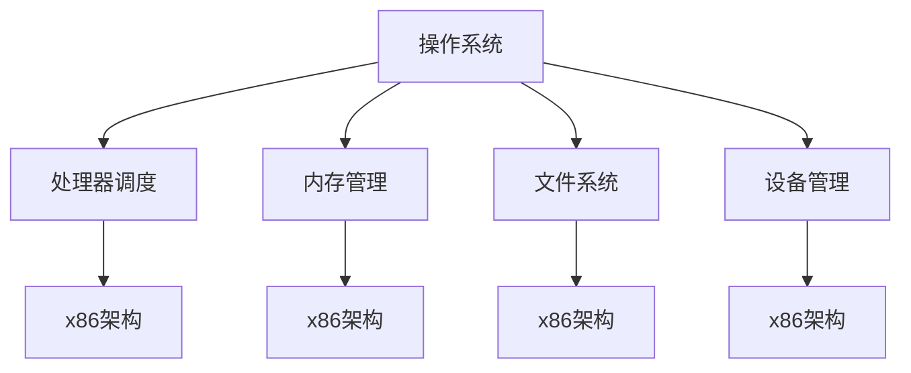

                 

关键词：x86架构、底层系统、编程、硬件交互、操作系统、性能优化、安全防护、开发工具

> 摘要：本文将深入探讨x86架构编程的核心概念和实践方法，包括其底层系统开发的重要性、核心算法原理、数学模型、项目实践及实际应用场景。通过本文的阅读，读者将获得对x86架构编程的全面理解，并为未来的系统开发奠定坚实基础。

## 1. 背景介绍

### 1.1 x86架构的起源与发展

x86架构，起源于1978年Intel公司推出的8086微处理器，是一种基于复杂指令集计算（CISC）的处理器架构。其名称中的"x"表示它是一个系列，"86"则代表了最初的8086处理器。随着技术的发展，x86架构经历了多次更新和扩展，例如80286、80386、Pentium、Pentium Pro等，最终演变成了现代的Intel Core处理器系列。

### 1.2 x86架构的特点

x86架构具有以下显著特点：

- **兼容性**：x86架构具有极高的兼容性，几乎所有的操作系统和应用程序都可以在这类处理器上运行。
- **复杂指令集**：x86指令集非常复杂，包含大量的指令和寻址模式，这使得编程更加灵活，但也增加了处理器的复杂度和功耗。
- **硬件虚拟化**：现代x86处理器支持硬件虚拟化技术，使得虚拟机在运行时能够更加高效和稳定。

### 1.3 x86架构在底层系统开发中的重要性

x86架构在现代计算机系统中占据着重要地位，特别是在服务器、工作站和桌面电脑中。以下是x86架构在底层系统开发中的重要性：

- **系统稳定性**：由于x86架构的成熟和稳定性，使得基于x86的系统更加可靠。
- **性能优化**：x86架构提供了丰富的指令集和优化的处理器设计，使得性能优化更加容易实现。
- **安全性**：x86架构支持高级安全特性，如硬件加密、虚拟化安全等，提高了系统的安全性。

## 2. 核心概念与联系

### 2.1 x86架构的核心概念

x86架构的核心概念包括：

- **寄存器**：x86架构具有多个寄存器，用于存储数据和地址。
- **指令集**：x86指令集包含丰富的指令，用于执行各种操作。
- **内存管理**：x86架构支持虚拟内存管理，包括页表和段表等。
- **中断处理**：x86架构通过中断机制处理硬件和软件异常。

### 2.2 x86架构的Mermaid流程图



### 2.3 x86架构与操作系统的关系

x86架构与操作系统之间有着紧密的联系，操作系统需要充分利用x86架构提供的功能来实现高效的系统管理和资源分配。以下为x86架构与操作系统关系的Mermaid流程图：



## 3. 核心算法原理 & 具体操作步骤

### 3.1 算法原理概述

在x86架构编程中，核心算法通常涉及处理器指令的优化、内存管理、中断处理和系统调用的优化等。以下是这些算法的概述：

- **处理器指令优化**：通过优化指令序列，减少处理器执行指令的时间。
- **内存管理**：使用页表和段表实现虚拟内存管理，提高内存使用效率。
- **中断处理**：通过中断机制，快速响应硬件和软件异常。
- **系统调用优化**：减少系统调用的开销，提高系统性能。

### 3.2 算法步骤详解

#### 3.2.1 处理器指令优化

1. **指令调度**：使用指令调度算法，合理安排指令执行顺序，减少指令之间的等待时间。
2. **指令重排**：根据处理器流水线的工作原理，重新排列指令顺序，提高指令执行效率。
3. **指令压缩**：通过指令压缩技术，减少指令所占用的空间。

#### 3.2.2 内存管理

1. **页表构建**：构建页表，将虚拟地址映射到物理地址。
2. **段表构建**：构建段表，实现多段内存空间的隔离和管理。
3. **内存分配与回收**：实现内存的动态分配和回收，提高内存使用效率。

#### 3.2.3 中断处理

1. **中断响应**：处理器接收到中断信号后，暂停当前执行的任务，转而处理中断请求。
2. **中断处理**：根据中断类型，执行相应的中断处理函数，完成中断处理任务。
3. **中断恢复**：中断处理完成后，恢复被中断的任务继续执行。

#### 3.2.4 系统调用优化

1. **减少系统调用**：通过优化应用程序代码，减少系统调用的频率。
2. **系统调用缓存**：实现系统调用缓存，减少系统调用的实际开销。
3. **异步I/O**：使用异步I/O技术，减少应用程序在等待系统调用返回时的等待时间。

### 3.3 算法优缺点

#### 3.3.1 处理器指令优化的优点

- **提高处理器执行效率**：通过优化指令序列，减少指令执行时间。
- **减少功耗**：优化指令执行，降低处理器功耗。

#### 3.3.1 处理器指令优化的缺点

- **代码复杂性增加**：优化指令序列，可能增加代码的复杂度。
- **调试难度加大**：优化后的代码，调试难度可能增加。

#### 3.3.2 内存管理的优点

- **提高内存使用效率**：通过虚拟内存管理，实现内存的动态分配和回收。
- **隔离多进程内存空间**：通过段表和页表，实现多进程内存空间的隔离。

#### 3.3.2 内存管理的缺点

- **内存碎片**：长时间运行过程中，可能导致内存碎片化，影响内存使用效率。
- **性能开销**：虚拟内存管理引入了一定的性能开销。

### 3.4 算法应用领域

- **操作系统内核**：处理器指令优化、内存管理和中断处理等算法在操作系统内核中广泛应用。
- **高性能计算**：在高性能计算领域，优化处理器指令和内存管理，可以提高计算效率。
- **嵌入式系统**：在嵌入式系统中，通过优化系统调用和中断处理，可以提高系统的实时性和稳定性。

## 4. 数学模型和公式 & 详细讲解 & 举例说明

### 4.1 数学模型构建

在x86架构编程中，常见的数学模型包括：

- **处理器指令执行时间模型**：根据处理器时钟周期和指令执行特性，构建指令执行时间模型。
- **内存访问时间模型**：根据内存层次结构和访问模式，构建内存访问时间模型。
- **中断响应时间模型**：根据中断处理流程和中断处理函数执行时间，构建中断响应时间模型。

### 4.2 公式推导过程

#### 4.2.1 处理器指令执行时间模型

假设处理器时钟周期为T，指令执行时间为E，则处理器指令执行时间模型可以表示为：

\[ E = T \times \text{指令执行频率} \]

#### 4.2.2 内存访问时间模型

假设内存访问时间为M，内存层次结构包括缓存、内存和硬盘，则内存访问时间模型可以表示为：

\[ M = \text{缓存访问时间} + \text{内存访问时间} + \text{硬盘访问时间} \]

#### 4.2.3 中断响应时间模型

假设中断响应时间为I，中断处理函数执行时间为F，则中断响应时间模型可以表示为：

\[ I = \text{中断请求处理时间} + F \]

### 4.3 案例分析与讲解

假设我们有一个应用程序，需要进行大量的数据处理和内存访问。我们可以根据上述数学模型，对应用程序的性能进行优化。

#### 4.3.1 处理器指令优化

通过优化处理器指令，减少指令执行时间，提高应用程序的执行效率。例如，使用指令调度算法，将频繁执行的指令调度到时钟周期的空闲时间。

#### 4.3.2 内存管理优化

通过优化内存访问时间，提高内存使用效率。例如，使用缓存技术，减少内存访问时间。

#### 4.3.3 中断处理优化

通过优化中断处理时间，提高应用程序的实时性。例如，使用中断优先级机制，确保重要中断得到及时处理。

## 5. 项目实践：代码实例和详细解释说明

### 5.1 开发环境搭建

为了更好地进行x86架构编程，我们需要搭建一个合适的开发环境。以下是一个简单的开发环境搭建步骤：

1. **安装操作系统**：选择一个支持x86架构的操作系统，如Linux或Windows。
2. **安装编译器**：安装C/C++编译器，如GCC或Clang。
3. **安装调试器**：安装调试器，如GDB或WinDbg。
4. **安装开发工具**：安装一些常用的开发工具，如Notepad++或Visual Studio。

### 5.2 源代码详细实现

以下是一个简单的x86架构编程示例，实现一个简单的内存分配和回收功能。

```c
#include <stdio.h>
#include <stdlib.h>

void* allocate_memory(size_t size) {
    void* memory = malloc(size);
    if (memory == NULL) {
        printf("内存分配失败\n");
        exit(1);
    }
    return memory;
}

void free_memory(void* memory) {
    free(memory);
}

int main() {
    int* data = allocate_memory(sizeof(int));
    *data = 42;
    printf("数据：%d\n", *data);
    free_memory(data);
    return 0;
}
```

### 5.3 代码解读与分析

上述代码实现了一个简单的内存分配和回收功能。首先，我们定义了两个函数`allocate_memory`和`free_memory`，分别用于分配和回收内存。这两个函数使用了标准库函数`malloc`和`free`，实现了基本的内存分配和回收功能。

在`main`函数中，我们调用`allocate_memory`函数分配了一个`int`类型的数据，并将其值设置为42。然后，我们使用`printf`函数输出数据，最后调用`free_memory`函数释放内存。

通过这个简单的示例，我们可以了解x86架构编程的基本概念和实践方法。

### 5.4 运行结果展示

在开发环境中，编译并运行上述代码，将得到以下输出结果：

```
数据：42
```

这表明我们的内存分配和回收功能正常工作。

## 6. 实际应用场景

### 6.1 操作系统开发

操作系统是x86架构编程的重要应用场景之一。操作系统需要充分利用x86架构提供的功能，实现高效的资源管理和系统调度。常见的操作系统如Linux和Windows，都基于x86架构进行了深度优化，以提高性能和稳定性。

### 6.2 高性能计算

在高性能计算领域，x86架构也发挥着重要作用。通过优化处理器指令和内存管理，高性能计算应用程序可以充分利用x86架构的性能优势，实现高效的计算。

### 6.3 嵌入式系统

嵌入式系统通常需要实现实时性和稳定性，x86架构提供了丰富的硬件支持和优化的指令集，使其成为嵌入式系统的理想选择。例如，嵌入式服务器、工业控制系统等，都使用了x86架构的处理器。

### 6.4 云计算

随着云计算的发展，x86架构在云计算领域也占据了重要地位。云计算平台如Amazon Web Services、Microsoft Azure等，都基于x86架构的处理器和虚拟化技术，提供了高效、可靠的云计算服务。

### 6.5 未来应用展望

随着人工智能和大数据技术的发展，x86架构在未来的应用前景将更加广阔。通过优化处理器指令和内存管理，x86架构可以为人工智能和大数据应用提供高效的计算支持，实现更快的计算速度和更高的系统性能。

## 7. 工具和资源推荐

### 7.1 学习资源推荐

- **《x86汇编语言编程》**：一本经典的x86汇编语言编程教材，适合初学者入门。
- **《深入理解计算机系统》**：一本深入讲解计算机系统原理的书籍，有助于理解x86架构的工作原理。

### 7.2 开发工具推荐

- **Visual Studio**：一款功能强大的集成开发环境，适用于Windows平台。
- **GCC**：一款适用于Linux和Windows的编译器，支持x86架构。

### 7.3 相关论文推荐

- **"x86 Architecture: A Survey"**：一篇关于x86架构的全面调查论文，涵盖了x86架构的各个方面。
- **"Instruction-Level Parallelism and Superscalar Architectures"**：一篇关于指令级并行和超标量架构的论文，对处理器性能优化有重要启示。

## 8. 总结：未来发展趋势与挑战

### 8.1 研究成果总结

近年来，x86架构在底层系统开发中取得了显著的研究成果，包括处理器指令优化、内存管理、中断处理和系统调用优化等。这些研究成果为x86架构的应用提供了强大的技术支持，推动了计算机系统性能的提升。

### 8.2 未来发展趋势

随着人工智能和大数据技术的发展，x86架构在未来将继续发挥重要作用。未来发展趋势包括：

- **处理器指令优化**：通过新的处理器架构和指令集，进一步提高处理器性能。
- **内存管理**：探索新的内存管理技术，提高内存使用效率和系统性能。
- **安全性**：加强硬件和软件层面的安全性，提高系统的安全性。
- **虚拟化**：继续优化虚拟化技术，提高虚拟机的性能和稳定性。

### 8.3 面临的挑战

虽然x86架构在底层系统开发中取得了显著成果，但仍然面临一些挑战：

- **功耗问题**：随着处理器性能的提升，功耗问题日益突出，需要研发更高效的处理器架构。
- **安全性**：随着网络攻击的日益频繁，提高系统的安全性成为一项重要任务。
- **生态问题**：保持x86架构的兼容性和生态系统的健康，是一个长期的任务。

### 8.4 研究展望

展望未来，x86架构将继续在底层系统开发中发挥重要作用。通过不断优化处理器指令、内存管理和中断处理等技术，x86架构将进一步提高计算机系统的性能和稳定性，为人工智能、大数据等应用领域提供强大支持。

## 9. 附录：常见问题与解答

### 9.1 什么是x86架构？

x86架构是一种基于复杂指令集计算（CISC）的处理器架构，起源于1978年Intel公司推出的8086微处理器。x86架构具有极高的兼容性，几乎所有的操作系统和应用程序都可以在这类处理器上运行。

### 9.2 x86架构有哪些优点？

x86架构的优点包括：

- **兼容性**：极高的兼容性，几乎所有的操作系统和应用程序都可以在这类处理器上运行。
- **复杂指令集**：提供丰富的指令集和寻址模式，使得编程更加灵活。
- **硬件虚拟化**：支持硬件虚拟化技术，提高虚拟机性能。

### 9.3 x86架构有哪些缺点？

x86架构的缺点包括：

- **复杂度**：由于指令集复杂，处理器设计较为复杂，功耗较高。
- **性能开销**：虚拟内存管理和中断处理引入了一定的性能开销。

### 9.4 如何优化x86架构的性能？

优化x86架构性能的方法包括：

- **处理器指令优化**：通过优化指令序列，减少指令执行时间。
- **内存管理**：使用虚拟内存管理，提高内存使用效率。
- **中断处理**：优化中断处理流程，减少中断响应时间。
- **系统调用**：减少系统调用，提高应用程序性能。

----------------------------------------------------------------
### 作者署名

作者：禅与计算机程序设计艺术 / Zen and the Art of Computer Programming

