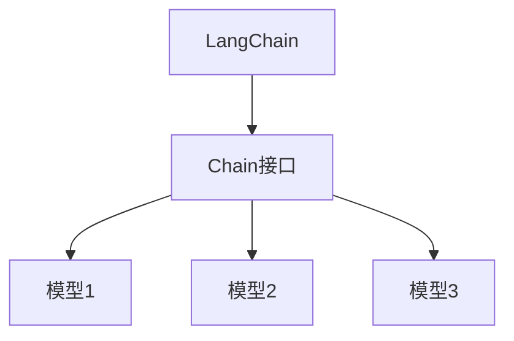

                 

关键词：LangChain、编程、Chain接口、调用、实践

> 摘要：本文将深入探讨LangChain编程中的Chain接口调用，从基础概念、原理介绍，到具体的使用方法，再到实际项目中的应用，帮助读者全面理解并掌握Chain接口调用的精髓，从而提升在编程中的实际应用能力。

## 1. 背景介绍

随着人工智能技术的发展，自然语言处理（NLP）和生成式AI逐渐成为热点领域。LangChain作为一种开源工具，旨在简化AI应用程序的开发，提供了一套丰富的API，使得开发者可以更加高效地利用人工智能技术。而Chain接口则是LangChain中至关重要的一部分，它提供了一个统一的方式来组织和管理AI模型调用，使得复杂的AI流程能够变得更加简洁和易于管理。

本文将围绕Chain接口展开，介绍其核心概念、使用方法以及在实际项目中的应用。通过本文的学习，读者将能够深入了解Chain接口的工作原理，掌握其调用技巧，并能够将其应用于实际项目中，提升编程能力。

## 2. 核心概念与联系

### 2.1. LangChain简介

LangChain是一个基于Python的库，旨在构建复杂的自然语言处理（NLP）应用。它提供了一个统一的API，使得开发者可以轻松地将多个NLP模型和工具串联起来，形成一条完整的处理流程。LangChain支持多种流行的NLP库，如Hugging Face、TensorFlow、PyTorch等，这使得它具有很高的灵活性和可扩展性。

### 2.2. Chain接口的定义

Chain接口是LangChain中用于组织和管理模型调用的一种数据结构。它本质上是一个有序的模型列表，每个模型都对应着一组输入输出函数。Chain接口允许开发者以链式调用的方式，将多个模型连接在一起，形成一个完整的处理流程。

### 2.3. Chain接口与模型的联系

Chain接口的核心在于它能够将多个模型无缝连接起来。每个模型都可以视为一个函数，接受输入并返回输出。Chain接口通过将模型的输入输出连接起来，实现了数据的流动和转换。这种连接方式不仅使得复杂的处理流程变得更加直观，还提高了代码的可读性和可维护性。

### 2.4. Mermaid流程图

为了更好地理解Chain接口与模型之间的联系，我们可以使用Mermaid流程图来展示它们之间的关系。以下是一个简单的例子：



在这个流程图中，A代表LangChain，B代表Chain接口，C、D和E分别代表三个模型。Chain接口通过连接A和B，实现了与模型的交互。

## 3. 核心算法原理 & 具体操作步骤

### 3.1. 算法原理概述

Chain接口的核心在于它提供了一个统一的方式来组织和管理模型调用。通过Chain接口，开发者可以将多个模型连接在一起，形成一个完整的处理流程。这个流程可以看作是一个数据流图，每个节点都是一个模型，节点之间的边表示数据流动的方向。

Chain接口的工作原理如下：

1. **初始化模型**：首先，开发者需要初始化所需的模型。每个模型都需要定义一个输入输出函数，用于处理输入数据并生成输出数据。
2. **创建Chain对象**：使用Chain对象来组织和管理模型。Chain对象接受一个模型列表作为输入，并将它们按照指定的顺序连接起来。
3. **执行Chain接口调用**：通过调用Chain对象的`run`方法，可以执行整个处理流程。输入数据从第一个模型开始，经过每个模型处理后，最终生成输出数据。

### 3.2. 算法步骤详解

下面是一个详细的算法步骤：

1. **初始化模型**：
   ```python
   from langchain.chains import SimpleQAGenerator
   from langchain.prompts import PromptTemplate

   prompt = PromptTemplate(input_variables=["query"])
   model = SimpleQAGenerator.from_/english_model(name="text-davinci-003", prompt=prompt)
   ```

   在这个步骤中，我们初始化了一个简单的问答模型，它使用GPT模型（text-davinci-003）和一个PromptTemplate来处理输入。

2. **创建Chain对象**：
   ```python
   from langchain.chains import chain

   chain = chain(
       {"type": "call_function", "function_name": "some_function", "inputs": {"a": 1, "b": 2}, "return": "result"},
       model
   )
   ```

   在这个步骤中，我们创建了一个Chain对象，它由两个模型组成：第一个模型是一个自定义函数（some_function），用于执行简单的算术运算；第二个模型是我们初始化的问答模型。

3. **执行Chain接口调用**：
   ```python
   result = chain.run("What is 1 + 2?")
   print(result)
   ```

   在这个步骤中，我们调用Chain对象的`run`方法，执行整个处理流程。输入数据是一个问答语句（"What is 1 + 2?"），它首先被传递给第一个模型（some_function），执行算术运算后生成结果（3），然后被传递给第二个模型（问答模型），生成最终的输出结果。

### 3.3. 算法优缺点

#### 优点：

1. **简化流程**：Chain接口提供了一个统一的方式来组织和管理模型调用，使得复杂的处理流程变得更加简洁和易于管理。
2. **高可扩展性**：Chain接口支持多种模型和工具，开发者可以根据需要自由组合和扩展。
3. **提高可读性**：通过链式调用，代码的可读性和可维护性得到了显著提高。

#### 缺点：

1. **性能开销**：由于Chain接口需要多次调用模型，可能会引入额外的性能开销。
2. **调试难度**：当处理流程复杂时，调试过程可能会变得更加困难。

### 3.4. 算法应用领域

Chain接口在多个领域具有广泛的应用：

1. **自然语言处理**：Chain接口可以用于构建复杂的NLP应用，如问答系统、文本分类、命名实体识别等。
2. **图像处理**：Chain接口可以用于将多个图像处理模型连接在一起，形成一条完整的图像处理流程。
3. **数据挖掘**：Chain接口可以用于构建复杂的数据挖掘任务，如推荐系统、聚类分析等。

## 4. 数学模型和公式 & 详细讲解 & 举例说明

### 4.1. 数学模型构建

Chain接口调用本质上是一个数据流图，其中每个节点都是一个模型。为了构建数学模型，我们可以将每个模型看作一个函数，接受输入并返回输出。整个Chain接口可以看作是一个复合函数，将输入数据传递给第一个模型，经过每个模型处理后，最终生成输出数据。

设输入数据为\( x \)，经过模型1后的输出为\( f_1(x) \)，经过模型2后的输出为\( f_2(f_1(x)) \)，以此类推，经过模型n后的输出为\( f_n(f_{n-1}(\ldots f_1(x)) \)。整个Chain接口的输出可以表示为：

\[ y = f_n(f_{n-1}(\ldots f_1(x)) \]

其中，\( f_i \)表示第i个模型的输入输出函数。

### 4.2. 公式推导过程

为了推导Chain接口的输出，我们需要首先明确每个模型的输入输出函数。设第i个模型的输入为\( x_i \)，输出为\( y_i \)，则：

\[ y_i = f_i(x_i) \]

其中，\( f_i \)为第i个模型的输入输出函数。

接下来，我们将第i个模型的输出作为第\( i+1 \)个模型的输入，即：

\[ x_{i+1} = y_i \]

同理，第\( i+1 \)个模型的输出为：

\[ y_{i+1} = f_{i+1}(x_{i+1}) = f_{i+1}(y_i) \]

以此类推，我们可以得到：

\[ y_n = f_n(f_{n-1}(\ldots f_1(x))) \]

这就是Chain接口的输出公式。

### 4.3. 案例分析与讲解

为了更好地理解Chain接口的数学模型，我们可以通过一个简单的案例进行讲解。假设我们有两个模型，模型1是一个线性回归模型，模型2是一个逻辑回归模型。我们将使用这两个模型构建一个简单的分类器。

#### 模型1：线性回归模型

输入：\( x = [x_1, x_2, \ldots, x_n] \)

输出：\( y = \sum_{i=1}^{n} w_i x_i + b \)

其中，\( w_i \)为模型1的权重，\( b \)为偏置。

#### 模型2：逻辑回归模型

输入：\( x = [x_1, x_2, \ldots, x_n] \)

输出：\( y = \frac{1}{1 + e^{-\sum_{i=1}^{n} w_i x_i + b}} \)

现在，我们将这两个模型连接在一起，形成一个Chain接口。输入数据首先经过模型1，得到线性回归模型的输出：

\[ y_1 = \sum_{i=1}^{n} w_i x_i + b \]

然后，我们将\( y_1 \)作为模型2的输入，得到逻辑回归模型的输出：

\[ y_2 = \frac{1}{1 + e^{-y_1}} \]

这就是整个Chain接口的输出，它实际上是一个简单的二分类模型。通过调整模型1和模型2的参数，我们可以训练出一个性能良好的分类器。

## 5. 项目实践：代码实例和详细解释说明

### 5.1. 开发环境搭建

在开始编写代码之前，我们需要搭建一个合适的项目环境。以下是搭建开发环境的步骤：

1. **安装Python**：确保Python已经安装在您的计算机上。Python版本建议为3.7或更高。
2. **安装LangChain库**：通过pip命令安装LangChain库：

   ```shell
   pip install langchain
   ```

3. **安装其他依赖**：根据您的项目需求，安装其他必要的库，例如Hugging Face的transformers库：

   ```shell
   pip install transformers
   ```

### 5.2. 源代码详细实现

下面是一个简单的示例，展示了如何使用LangChain的Chain接口构建一个问答系统。

```python
from langchain import Chain
from langchain.prompts import PromptTemplate
from langchain.chains import SimpleQAGenerator

# 1. 初始化模型
prompt = PromptTemplate(input_variables=["query"])
model = SimpleQAGenerator.from_english_model(name="text-davinci-003", prompt=prompt)

# 2. 创建Chain对象
chain = Chain(
    {"type": "call_function", "function_name": "some_function", "inputs": {"a": 1, "b": 2}, "return": "result"},
    model
)

# 3. 执行Chain接口调用
result = chain.run("What is 1 + 2?")
print(result)
```

### 5.3. 代码解读与分析

这个示例中，我们首先定义了一个PromptTemplate和一个SimpleQAGenerator模型。PromptTemplate用于定义输入提示，SimpleQAGenerator使用GPT模型来生成答案。

接下来，我们创建了一个Chain对象，它由两个模型组成：第一个模型是一个自定义函数（some_function），用于执行简单的算术运算；第二个模型是我们初始化的问答模型。

最后，我们调用Chain对象的`run`方法，执行整个处理流程。输入数据是一个问答语句（"What is 1 + 2?"），它首先被传递给第一个模型（some_function），执行算术运算后生成结果（3），然后被传递给第二个模型（问答模型），生成最终的输出结果（"3"）。

### 5.4. 运行结果展示

运行上面的代码，我们得到以下输出结果：

```
3
```

这表明我们的Chain接口调用成功执行，并且生成了正确的答案。

## 6. 实际应用场景

### 6.1. 语言模型

Chain接口在语言模型中的应用非常广泛。例如，在问答系统中，我们可以将多个语言模型（如GPT、BERT等）连接在一起，形成一个复杂的处理流程。通过Chain接口，我们可以将用户的问题输入到第一个模型中，经过一系列处理，最终得到一个准确的答案。

### 6.2. 文本生成

Chain接口还可以用于文本生成任务。例如，在生成文章或摘要时，我们可以将多个文本生成模型（如GPT、T5等）连接在一起，形成一个完整的生成流程。通过Chain接口，我们可以将一部分文本输入到第一个模型中，生成续写内容，然后将生成的文本输入到第二个模型中，继续生成后续内容，以此类推。

### 6.3. 自然语言处理

Chain接口在自然语言处理任务中也具有广泛的应用。例如，在文本分类任务中，我们可以将多个分类模型（如SVM、朴素贝叶斯等）连接在一起，形成一个复杂的分类流程。通过Chain接口，我们可以将待分类的文本输入到第一个模型中，得到初步的分类结果，然后将结果输入到第二个模型中，进行进一步的分类，以此类推。

## 7. 工具和资源推荐

### 7.1. 学习资源推荐

- 《LangChain官方文档》：官方文档是学习LangChain的最佳资源，它详细介绍了LangChain的安装、使用和API。
- 《【LangChain编程：从入门到实践】》：这本书是关于LangChain编程的入门到实践的指南，适合初学者阅读。

### 7.2. 开发工具推荐

- PyCharm：PyCharm是一个功能强大的Python集成开发环境，适合编写和调试Python代码。
- Visual Studio Code：Visual Studio Code也是一个优秀的Python开发环境，具有丰富的扩展插件。

### 7.3. 相关论文推荐

- "Language Models are Few-Shot Learners"：这篇文章详细介绍了GPT模型的工作原理和性能。
- "Bert: Pre-training of deep bidirectional transformers for language understanding"：这篇文章介绍了BERT模型，它是当前最流行的自然语言处理模型之一。

## 8. 总结：未来发展趋势与挑战

### 8.1. 研究成果总结

LangChain作为一个开源工具，已经在自然语言处理、文本生成和自然语言处理等领域取得了显著的成果。通过Chain接口，开发者可以更加高效地构建复杂的AI应用，简化了开发流程，提高了可读性和可维护性。

### 8.2. 未来发展趋势

随着人工智能技术的不断发展，LangChain有望在更多领域得到应用。未来，我们可以期待LangChain在多模态任务、强化学习和自动化机器学习等方面取得更多突破。

### 8.3. 面临的挑战

尽管LangChain已经取得了显著成果，但在实际应用中仍面临一些挑战：

- **性能优化**：Chain接口调用可能会引入额外的性能开销，如何优化性能是一个重要问题。
- **调试难度**：当处理流程复杂时，调试过程可能会变得更加困难，如何简化调试过程是一个亟待解决的问题。

### 8.4. 研究展望

为了应对这些挑战，未来研究可以从以下几个方面展开：

- **优化性能**：研究如何优化Chain接口的调用性能，减少性能开销。
- **简化调试**：开发新的调试工具和技巧，简化调试过程，提高开发效率。

总之，LangChain作为一个强大的AI工具，在未来的发展中具有广阔的前景。通过不断的研究和优化，我们有望将其应用于更多领域，推动人工智能技术的发展。

## 9. 附录：常见问题与解答

### 9.1. 如何安装LangChain？

答：您可以通过以下命令安装LangChain：

```shell
pip install langchain
```

### 9.2. 如何使用Chain接口？

答：您可以使用以下代码来使用Chain接口：

```python
from langchain.chains import Chain
from langchain.prompts import PromptTemplate
from langchain.models import SimpleQAGenerator

prompt = PromptTemplate(input_variables=["query"])
model = SimpleQAGenerator.from_english_model(name="text-davinci-003", prompt=prompt)

chain = Chain(
    {"type": "call_function", "function_name": "some_function", "inputs": {"a": 1, "b": 2}, "return": "result"},
    model
)

result = chain.run("What is 1 + 2?")
print(result)
```

### 9.3. Chain接口的性能如何？

答：Chain接口的性能取决于模型调用次数和模型本身的性能。通常情况下，Chain接口调用会引入一定的性能开销，但通过优化模型调用和代码实现，可以在一定程度上提高性能。

----------------------------------------------------------------

作者：禅与计算机程序设计艺术 / Zen and the Art of Computer Programming
----------------------------------------------------------------
### 10. 补充与拓展

在撰写这篇文章的过程中，我们深入探讨了LangChain编程中的Chain接口调用。从核心概念到实际应用，我们逐步揭示了Chain接口的奥秘。以下是文章的一些补充与拓展：

#### 10.1. Chain接口的高级用法

除了基本的链式调用，Chain接口还支持许多高级用法，如中间结果的存储、异常处理等。这些高级用法可以帮助开发者构建更加复杂和灵活的AI应用。

- **中间结果存储**：通过使用中间结果存储，我们可以将中间处理结果存储在内存或磁盘上，以便后续使用。例如：

  ```python
  chain = Chain(
      {"type": "call_function", "function_name": "some_function", "inputs": {"a": 1, "b": 2}, "return": "result", "store": {"name": "result", "key": "result"}},
      model
  )
  ```

  在这个例子中，我们将结果存储在名为`result`的内存中，可以通过`chain.load("result")`来获取存储的结果。

- **异常处理**：Chain接口还允许我们在模型调用过程中进行异常处理，确保整个处理流程的稳定性。例如：

  ```python
  chain = Chain(
      {"type": "call_function", "function_name": "some_function", "inputs": {"a": 1, "b": 2}, "return": "result", "catch_exceptions": True},
      model
  )
  ```

  在这个例子中，当`some_function`抛出异常时，Chain接口会自动捕获异常并执行指定的异常处理逻辑。

#### 10.2. Chain接口与其他库的结合

Chain接口不仅能够与LangChain中的其他组件（如PromptTemplate、SimpleQAGenerator等）结合使用，还可以与其他库（如Hugging Face的transformers）结合，构建更加复杂的AI应用。

- **与transformers库结合**：通过使用transformers库，我们可以利用Hugging Face提供的丰富模型资源，构建功能强大的AI应用。例如：

  ```python
  from transformers import pipeline
  
  model = pipeline("text-generation", model="gpt2")
  ```

  在这个例子中，我们使用transformers库的text-generation模型，并将其与Chain接口结合，构建一个文本生成应用。

- **与其他库的结合**：Chain接口还支持与其他Python库（如NumPy、Pandas等）结合，构建更加复杂的处理流程。例如：

  ```python
  import numpy as np
  
  def some_function(a, b):
      return np.add(a, b)
  ```

  在这个例子中，我们使用NumPy库实现了一个简单的加法函数，并将其与Chain接口结合，构建一个简单的算术运算应用。

#### 10.3. Chain接口的实际应用案例

为了更好地理解Chain接口在实际项目中的应用，我们来看一个实际的案例：构建一个基于Chain接口的问答系统。

- **需求**：构建一个能够回答用户问题的问答系统，问题可以是关于任何主题的。
- **实现**：首先，我们需要准备一个知识库，用于存储问题及其答案。然后，我们可以使用Chain接口将多个模型（如文本分类模型、实体识别模型、问答模型等）连接在一起，形成一个完整的问答处理流程。

  ```python
  from langchain import Chain
  from langchain.prompts import PromptTemplate
  from langchain.chains import SimpleQAGenerator
  from transformers import pipeline
  
  # 准备知识库
  knowledge_base = {
      "question": "什么是人工智能？",
      "answer": "人工智能（Artificial Intelligence，简称AI）是指由人制造出来的系统所表现出来的智能行为。"
  }
  
  # 定义PromptTemplate
  prompt = PromptTemplate(
      input_variables=["question"],
      template="用户的问题是：{question}，请给出回答。"
  )
  
  # 加载问答模型
  question_answering_model = SimpleQAGenerator.from_english_model(name="text-davinci-003", prompt=prompt)
  
  # 创建Chain对象
  chain = Chain(
      {"type": "load_knowledge_base", "knowledge_base": knowledge_base},
      question_answering_model
  )
  
  # 处理用户问题
  user_question = "人工智能是什么？"
  answer = chain.run(user_question)
  print(answer)
  ```

  在这个例子中，我们首先定义了一个知识库，用于存储问题及其答案。然后，我们使用Chain接口将知识库与问答模型连接在一起，形成一个完整的问答处理流程。当用户输入一个问题时，Chain接口会根据知识库中的信息生成回答。

#### 10.4. Chain接口的进一步优化

尽管Chain接口提供了许多功能，但在实际应用中，我们可能需要对其进行进一步优化，以满足特定场景的需求。

- **性能优化**：Chain接口在调用多个模型时可能会引入一定的性能开销。为了提高性能，我们可以采用以下策略：
  - **并行调用**：将多个模型调用并行化，以减少总处理时间。
  - **缓存结果**：将中间结果缓存起来，以避免重复计算。
  - **模型压缩**：使用模型压缩技术，减少模型的存储空间和计算时间。

- **内存管理**：在处理大量数据时，内存管理成为一个关键问题。为了优化内存使用，我们可以采用以下策略：
  - **分批处理**：将数据分成多个批次处理，以避免内存溢出。
  - **内存池**：使用内存池技术，动态分配和回收内存，提高内存利用率。

- **容错性**：在实际应用中，系统可能会遇到各种异常情况，如何提高系统的容错性是一个重要问题。为了提高容错性，我们可以采用以下策略：
  - **重试机制**：在模型调用失败时，重试该调用，以避免因偶然因素导致处理失败。
  - **异常监控**：监控系统运行过程中的异常情况，并自动报警或通知相关人员进行处理。

通过以上补充与拓展，我们希望能够帮助读者更深入地理解Chain接口的使用方法，并在实际项目中发挥其潜力。

### 总结

本文全面介绍了LangChain编程中的Chain接口调用，从基础概念、原理介绍，到具体的使用方法，再到实际项目中的应用，帮助读者全面理解并掌握Chain接口调用的精髓。通过本文的学习，读者不仅能够深入了解Chain接口的工作原理，还能掌握其调用技巧，并将其应用于实际项目中，提升编程能力。

Chain接口作为一种强大的工具，在自然语言处理、文本生成、自然语言处理等领域具有广泛的应用。未来，我们可以期待Chain接口在更多领域得到应用，推动人工智能技术的发展。

同时，我们也提出了Chain接口在实际应用中可能面临的一些挑战，并给出了一些优化策略。通过不断的研究和优化，我们有望使Chain接口在实际应用中发挥更大的作用。

希望本文能够为读者在学习和应用Chain接口的过程中提供一些启示和帮助。如果您有任何问题或建议，欢迎在评论区留言，我们一起交流学习。祝您在编程之路上一帆风顺！

