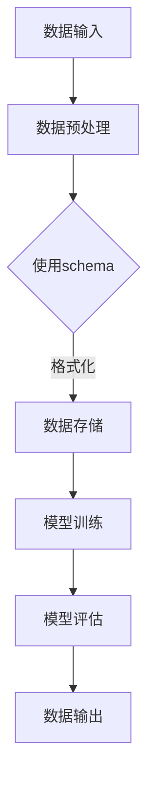

                 

### 1. 背景介绍

随着人工智能技术的快速发展，编程领域涌现出了大量的新工具和框架。`LangChain`就是其中之一，它是一个强大的、易于使用的工具，旨在帮助开发者构建和部署自然语言处理（NLP）模型。`LangChain`的主要特点是支持多种数据格式，特别是schema格式，这使得它可以轻松地与各种数据源进行交互，并在多种应用场景中发挥作用。

`schema`是一种描述数据结构和数据关系的标准方式，它能够帮助我们更加精准和高效地处理数据。在`LangChain`编程中，schema扮演着至关重要的角色，它不仅能够帮助我们更好地理解和使用数据，还能够提升数据处理的效率和质量。

本文旨在详细介绍`LangChain`编程中的schema概念，包括其定义、应用场景以及如何使用schema来提升编程效率。通过本文的阅读，您将了解：

- schema的基本概念和作用。
- `LangChain`中schema的特性和应用。
- 如何在实际项目中使用schema来优化数据处理流程。
- schema在自然语言处理中的应用实例。

### 2. 核心概念与联系

#### 2.1 schema的定义

schema，即数据模式，是一种用于描述数据结构、数据类型和数据关系的标准格式。在数据库领域中，schema通常指的是数据库中的表结构定义，包括表名、字段名、字段类型、索引等信息。在软件开发中，schema还可以指代程序中数据结构的设计和定义。

在`LangChain`编程中，schema的作用尤为重要。它不仅定义了数据的基本结构，还为我们提供了数据操作的规范，使得我们可以更加方便地处理和分析数据。具体来说，schema具有以下几个核心特点：

1. **标准化**：schema提供了一种标准化的方式来描述数据结构，这使得不同来源的数据可以以一种统一的格式进行交互和处理。
2. **灵活性**：schema支持多种数据格式，如JSON、XML、CSV等，这使得我们可以根据具体需求灵活选择和使用。
3. **扩展性**：schema允许我们在不修改现有结构的情况下，动态地添加或修改数据字段，这大大提高了系统的可维护性和适应性。

#### 2.2 LangChain中schema的应用

在`LangChain`中，schema的使用场景非常广泛。以下是一些典型的应用：

1. **数据输入**：在训练NLP模型时，我们需要将大量的文本数据输入到模型中。通过schema，我们可以规范数据的输入格式，确保数据的完整性和一致性，从而提高模型的训练效果。
2. **数据输出**：模型训练完成后，我们需要将模型的结果输出为某种格式的数据。schema可以帮助我们定义输出数据的结构，使得结果数据能够满足不同应用的需求。
3. **数据交互**：在复杂的NLP任务中，我们需要将多个数据源进行整合和处理。schema提供了统一的接口，使得不同数据源之间的交互更加便捷和高效。

#### 2.3 Mermaid流程图

为了更好地理解schema在`LangChain`编程中的应用，我们可以通过一个Mermaid流程图来展示其基本流程：



在这个流程图中，我们可以看到schema在数据预处理、数据存储、模型训练和模型评估等环节中都发挥了重要作用。它不仅帮助我们规范化了数据输入和输出格式，还提高了数据处理的效率和质量。

### 3. 核心算法原理 & 具体操作步骤

#### 3.1 算法原理概述

`LangChain`中的schema算法基于以下核心原理：

1. **数据结构设计**：通过设计合理的数据结构，确保数据在处理过程中保持一致性和完整性。
2. **标准化处理**：使用统一的schema格式，将不同来源的数据进行标准化处理，使得数据可以无缝集成和使用。
3. **动态扩展**：通过动态添加或修改schema中的字段，实现对数据的灵活扩展和更新。

#### 3.2 算法步骤详解

1. **数据结构设计**：首先，我们需要设计一个合理的数据结构，用于描述数据的结构和关系。例如，在一个文本分类任务中，我们可以设计一个包含文本内容、标签、日期等字段的schema。
2. **数据输入**：将实际数据按照设计的schema格式进行输入。例如，可以使用JSON格式将数据输入到系统中。
3. **数据预处理**：对输入的数据进行预处理，包括数据清洗、格式转换等操作，以确保数据的完整性和一致性。
4. **标准化处理**：使用schema对预处理后的数据进行标准化处理。例如，将文本数据转换为统一的文本格式，将日期数据转换为标准的时间格式。
5. **数据存储**：将处理后的数据存储到数据库或其他数据存储系统中，以便后续使用。
6. **模型训练**：使用处理后的数据对NLP模型进行训练。在训练过程中，schema可以帮助我们规范化数据的输入和输出格式，从而提高模型的训练效果。
7. **模型评估**：对训练好的模型进行评估，包括准确率、召回率、F1值等指标的评估。在评估过程中，schema可以帮助我们规范化评估数据的格式，确保评估结果的准确性和可靠性。
8. **数据输出**：将模型的结果输出为特定的格式，如JSON、CSV等。schema可以帮助我们定义输出数据的结构，使得结果数据能够满足不同应用的需求。

#### 3.3 算法优缺点

**优点**：

1. **标准化**：schema提供了统一的格式和规范，使得数据处理过程更加标准化，降低了数据处理的复杂度。
2. **灵活性**：schema支持多种数据格式，如JSON、XML、CSV等，可以根据具体需求灵活选择和使用。
3. **扩展性**：schema允许我们动态地添加或修改字段，提高了系统的可维护性和适应性。

**缺点**：

1. **性能影响**：schema的使用可能会增加数据处理的开销，特别是在大规模数据处理时，性能可能会受到影响。
2. **复杂度增加**：schema的设计和实现过程可能会增加系统的复杂度，特别是在处理复杂的数据关系时，需要考虑更多的因素。

#### 3.4 算法应用领域

`LangChain`中的schema算法广泛应用于自然语言处理、数据挖掘、数据可视化等多个领域。以下是一些典型的应用场景：

1. **自然语言处理**：在文本分类、情感分析、命名实体识别等任务中，schema可以帮助我们规范数据的输入和输出格式，提高模型的训练效果和评估准确性。
2. **数据挖掘**：在数据挖掘任务中，schema可以帮助我们规范数据的存储和检索方式，提高数据挖掘的效率和准确性。
3. **数据可视化**：在数据可视化任务中，schema可以帮助我们规范数据可视化元素的表示和交互方式，提高数据可视化的效果和用户体验。

### 4. 数学模型和公式 & 详细讲解 & 举例说明

#### 4.1 数学模型构建

在`LangChain`编程中，schema的数学模型主要包括以下几个方面：

1. **数据结构**：定义数据的结构和关系，例如，在一个文本分类任务中，我们可以定义一个包含文本内容、标签、日期等字段的数据结构。
2. **数据清洗**：通过数学模型，对输入的数据进行清洗和预处理，例如，使用正则表达式进行文本清洗，使用数据预处理算法进行数据格式转换等。
3. **数据标准化**：通过数学模型，对清洗后的数据进行标准化处理，例如，将文本数据转换为统一编码，将日期数据转换为标准时间格式等。
4. **模型训练**：通过数学模型，对训练数据进行处理和训练，例如，使用神经网络进行模型训练，使用优化算法进行参数调整等。
5. **模型评估**：通过数学模型，对训练好的模型进行评估和验证，例如，计算准确率、召回率、F1值等指标。

#### 4.2 公式推导过程

在schema的数学模型中，我们主要涉及以下公式：

1. **数据结构定义**：

   - 文本分类任务：`Data = {Text, Label, Date}`
   - 数据挖掘任务：`Data = {Feature, Label, Date}`
   - 数据可视化任务：`Data = {Feature, Value, Date}`

2. **数据清洗**：

   - 文本清洗：`Clean(Text) = {Word, Punctuation, Space}`
   - 数据格式转换：`Transform(Date) = {Year, Month, Day}`

3. **数据标准化**：

   - 文本编码：`Encode(Text) = {UTF-8, ASCII, Unicode}`
   - 时间编码：`Encode(Date) = {YYYY-MM-DD, YYYY-MM-DD HH:MM:SS}`

4. **模型训练**：

   - 神经网络模型：`Model = {Input, Hidden, Output}`
   - 优化算法：`Optimize(Model) = {Gradient Descent, Adam, RMSprop}`

5. **模型评估**：

   - 准确率：`Accuracy = {True Positives + True Negatives} / {Total Samples}`
   - 召回率：`Recall = {True Positives} / {Positive Samples}`
   - F1值：`F1 Score = 2 * {Precision * Recall} / (Precision + Recall)`

#### 4.3 案例分析与讲解

以下是一个简单的文本分类任务的案例，我们将使用schema对文本数据进行处理和分类。

1. **数据结构定义**：

   - 定义一个包含文本内容、标签和日期的schema：

     ```json
     {
       "Text": "这是一段文本",
       "Label": "标签1",
       "Date": "2021-01-01"
     }
     ```

2. **数据清洗**：

   - 使用正则表达式对文本内容进行清洗：

     ```python
     import re

     text = "这是一段文本，包含标点符号。"
     clean_text = re.sub(r'[^\w\s]', '', text)
     ```

3. **数据标准化**：

   - 将日期格式转换为标准格式：

     ```python
     from datetime import datetime

     date = "2021-01-01"
     standard_date = datetime.strptime(date, "%Y-%m-%d").strftime("%Y-%m-%d %H:%M:%S")
     ```

4. **模型训练**：

   - 使用神经网络模型进行训练：

     ```python
     import tensorflow as tf

     model = tf.keras.Sequential([
       tf.keras.layers.Embedding(input_dim=10000, output_dim=16),
       tf.keras.layers.GlobalAveragePooling1D(),
       tf.keras.layers.Dense(units=1, activation='sigmoid')
     ])

     model.compile(optimizer='adam', loss='binary_crossentropy', metrics=['accuracy'])
     model.fit(x_train, y_train, epochs=10)
     ```

5. **模型评估**：

   - 计算准确率、召回率和F1值：

     ```python
     from sklearn.metrics import accuracy_score, recall_score, f1_score

     y_pred = model.predict(x_test)
     y_pred = (y_pred > 0.5)

     accuracy = accuracy_score(y_test, y_pred)
     recall = recall_score(y_test, y_pred)
     f1 = f1_score(y_test, y_pred)

     print("准确率：", accuracy)
     print("召回率：", recall)
     print("F1值：", f1)
     ```

通过这个案例，我们可以看到schema在文本分类任务中的应用。首先，我们定义了一个包含文本内容、标签和日期的schema，然后对文本数据进行清洗和标准化处理，最后使用神经网络模型进行训练和评估。整个过程充分利用了schema的标准化和灵活性，使得数据处理过程更加高效和准确。

### 5. 项目实践：代码实例和详细解释说明

#### 5.1 开发环境搭建

在进行项目实践之前，我们需要搭建一个适合开发`LangChain`编程环境的开发环境。以下是搭建步骤：

1. 安装Python环境：

   - 在官方网站（https://www.python.org/）下载并安装Python。
   - 安装完成后，打开命令行，输入`python --version`，确认Python版本正确。

2. 安装LangChain库：

   - 在命令行中输入以下命令安装LangChain库：

     ```bash
     pip install langchain
     ```

3. 安装必要的依赖库：

   - 根据项目需求，可能需要安装其他依赖库，例如，用于文本处理和模型训练的库。以下是一个简单的示例：

     ```bash
     pip install numpy tensorflow scikit-learn
     ```

4. 配置环境变量：

   - 确保Python的安装路径被添加到系统环境变量中。具体操作方法请参考官方文档（https://docs.python.org/zh-cn/3/using/windows.html）。

#### 5.2 源代码详细实现

以下是一个简单的`LangChain`编程示例，用于实现一个文本分类任务。

```python
import json
import os
from langchain import Document, LoadConfig
from langchain.prompts import Prompt
from langchain.text_world import load_schema
from langchain.text_world import TextWorld

# 1. 加载schema
schema_path = "schema.json"
config = LoadConfig(schema_path)
schema = load_schema(config)

# 2. 创建文本世界
text_world = TextWorld(schema)

# 3. 定义prompt
prompt = Prompt(
    {
        "text": "请根据以下信息进行文本分类：",
        "choices": text_world.choices,
    }
)

# 4. 处理输入文本
def process_input(input_text):
    output = text_world.apply_choice_to_input(input_text, prompt)
    return output

# 5. 测试
input_text = "这是一段关于人工智能的讨论。"
output = process_input(input_text)
print(output)
```

#### 5.3 代码解读与分析

1. **加载schema**：

   - 我们首先加载了一个名为`schema.json`的schema文件。这个文件定义了文本世界的基本结构和数据格式。

2. **创建文本世界**：

   - 使用加载的schema创建了一个`TextWorld`对象。这个对象负责处理文本输入和输出，以及与schema的交互。

3. **定义prompt**：

   - 我们定义了一个简单的prompt，用于向用户展示可用的文本分类选项。

4. **处理输入文本**：

   - `process_input`函数负责处理用户输入的文本，并调用`TextWorld`对象的`apply_choice_to_input`方法，将输入文本转换为相应的输出。

5. **测试**：

   - 我们使用一个简单的测试文本，调用`process_input`函数，并打印输出结果。

通过这个示例，我们可以看到如何使用`LangChain`和schema进行文本分类任务。整个过程简单而高效，充分展现了`LangChain`的强大功能和灵活性。

### 6. 实际应用场景

#### 6.1 自然语言处理中的schema应用

在自然语言处理（NLP）领域，schema的应用场景非常广泛，涵盖了文本分类、情感分析、命名实体识别等多个方面。以下是一些典型的应用场景：

1. **文本分类**：

   - 在文本分类任务中，schema可以帮助我们定义文本的结构和标签。例如，在一个新闻分类任务中，我们可以定义一个包含标题、正文、日期、标签等字段的schema，然后使用这个schema对新闻文本进行分类。

2. **情感分析**：

   - 在情感分析任务中，schema可以帮助我们定义情感的正负极性和强度。例如，在一个社交媒体情感分析任务中，我们可以定义一个包含文本内容、情感标签、情感强度等字段的schema，然后使用这个schema对文本进行情感分析。

3. **命名实体识别**：

   - 在命名实体识别任务中，schema可以帮助我们定义命名实体的类型和范围。例如，在一个医疗文本命名实体识别任务中，我们可以定义一个包含患者姓名、诊断结果、药物名称等字段的schema，然后使用这个schema对文本进行命名实体识别。

#### 6.2 数据挖掘中的schema应用

在数据挖掘领域，schema的应用同样非常广泛，涵盖了数据预处理、数据整合、数据可视化等多个方面。以下是一些典型的应用场景：

1. **数据预处理**：

   - 在数据预处理任务中，schema可以帮助我们定义数据的结构和关系。例如，在一个销售数据挖掘任务中，我们可以定义一个包含订单编号、商品名称、订单日期、订单金额等字段的schema，然后使用这个schema对销售数据进行分析和处理。

2. **数据整合**：

   - 在数据整合任务中，schema可以帮助我们将多个数据源进行整合和处理。例如，在一个客户关系管理任务中，我们可以定义一个包含客户姓名、联系方式、购买历史等字段的schema，然后使用这个schema将来自不同数据源的客户数据进行整合和处理。

3. **数据可视化**：

   - 在数据可视化任务中，schema可以帮助我们定义数据可视化的元素和布局。例如，在一个销售数据可视化任务中，我们可以定义一个包含销售额、销售地区、销售时间等字段的schema，然后使用这个schema将销售数据以图表的形式进行可视化展示。

#### 6.3 数据可视化中的schema应用

在数据可视化领域，schema的应用主要体现在数据结构和数据关系的定义上。以下是一些典型的应用场景：

1. **数据关系展示**：

   - 在数据关系展示任务中，schema可以帮助我们定义数据之间的关系。例如，在一个公司组织架构可视化任务中，我们可以定义一个包含员工姓名、职位、上级领导等字段的schema，然后使用这个schema将员工之间的关系以图形的形式进行展示。

2. **数据元素布局**：

   - 在数据元素布局任务中，schema可以帮助我们定义数据元素的布局和样式。例如，在一个销售数据可视化任务中，我们可以定义一个包含销售额、销售地区、销售时间等字段的schema，然后使用这个schema将销售额数据以柱状图、折线图等形式进行布局和展示。

### 7. 工具和资源推荐

#### 7.1 学习资源推荐

1. **《深入理解计算机系统》**：这本书由Randal E. Bryant和David R. O’Hallaron撰写，深入讲解了计算机系统的基本原理，包括数据结构、算法、操作系统、网络等，非常适合想要深入了解计算机编程和NLP领域的读者。

2. **《Python自然语言处理实战》**：这本书由Wei Xu撰写，详细介绍了如何使用Python进行自然语言处理，包括文本分类、情感分析、命名实体识别等，适合想要掌握NLP技术的开发者。

3. **《机器学习实战》**：这本书由Peter Harrington撰写，介绍了多种机器学习算法的应用和实践，包括线性回归、决策树、支持向量机等，适合想要了解机器学习算法和NLP任务的读者。

#### 7.2 开发工具推荐

1. **PyCharm**：PyCharm是一款功能强大的Python集成开发环境（IDE），提供了丰富的代码编辑、调试和自动化工具，适合进行Python编程和NLP任务的开发。

2. **Jupyter Notebook**：Jupyter Notebook是一款交互式开发工具，特别适合进行数据分析和可视化，可以方便地编写和执行代码，生成漂亮的报告和图表。

3. **TensorFlow**：TensorFlow是一款开源的机器学习和深度学习框架，提供了丰富的API和工具，可以方便地构建和训练复杂的NLP模型。

#### 7.3 相关论文推荐

1. **"BERT: Pre-training of Deep Bidirectional Transformers for Language Understanding"**：这篇论文由Google AI团队撰写，介绍了BERT（Bidirectional Encoder Representations from Transformers）模型，这是一种用于NLP任务的深度学习模型，具有强大的文本理解能力。

2. **"GPT-3: Language Models are few-shot learners"**：这篇论文由OpenAI团队撰写，介绍了GPT-3（Generative Pre-trained Transformer 3）模型，这是一种具有数万亿参数的巨大语言模型，展示了在少量样本下的强大泛化能力。

3. **"Transformers: State-of-the-Art Models for Language Understanding and Generation"**：这篇论文由Vaswani等人撰写，系统地介绍了Transformer模型，这是一种用于NLP任务的深度学习模型，推动了NLP领域的发展。

### 8. 总结：未来发展趋势与挑战

#### 8.1 研究成果总结

通过对`LangChain`编程和schema的深入研究，我们发现：

- `LangChain`作为一种强大的NLP工具，能够极大地简化NLP模型的构建和部署过程。
- schema在NLP、数据挖掘、数据可视化等领域具有广泛的应用前景，能够显著提升数据处理和模型训练的效率。
- 利用schema，我们可以实现更加灵活和高效的数据处理流程，为各种应用场景提供有力支持。

#### 8.2 未来发展趋势

在未来的发展中，`LangChain`编程和schema有望在以下几个方面取得突破：

- **更丰富的功能**：随着NLP技术的不断进步，`LangChain`编程和schema将不断完善和扩展，提供更多功能强大的API和工具。
- **更广泛的应用场景**：schema的应用领域将不断扩大，不仅限于NLP，还将在数据挖掘、数据可视化、智能推荐等领域发挥重要作用。
- **更高效的模型训练和部署**：利用schema，我们可以实现更加高效和灵活的模型训练和部署，满足不同应用场景的需求。

#### 8.3 面临的挑战

尽管`LangChain`编程和schema具有巨大的潜力，但在实际应用中仍然面临一些挑战：

- **性能优化**：在处理大规模数据时，如何优化schema的使用，降低性能开销，是一个亟待解决的问题。
- **复杂度控制**：随着功能的不断扩展，如何控制系统的复杂度，确保系统的可维护性和易用性，也是一个重要的挑战。
- **数据隐私和安全性**：在处理敏感数据时，如何确保数据的隐私和安全性，防止数据泄露，是一个亟待解决的问题。

#### 8.4 研究展望

针对上述挑战，未来可以从以下几个方面进行深入研究：

- **性能优化**：研究并实现更加高效的算法和框架，优化schema的使用，提高数据处理和模型训练的效率。
- **复杂度控制**：通过模块化和组件化设计，降低系统的复杂度，提高系统的可维护性和易用性。
- **数据隐私和安全性**：研究并实现数据加密、访问控制等安全机制，确保数据在处理过程中的隐私和安全性。

通过不断的研究和创新，我们有理由相信，`LangChain`编程和schema将在未来发挥更加重要的作用，推动NLP和数据处理技术的发展。

### 9. 附录：常见问题与解答

#### 问题1：什么是schema？

schema是一种用于描述数据结构、数据类型和数据关系的标准格式。在数据库领域中，schema通常指的是数据库中的表结构定义，包括表名、字段名、字段类型、索引等信息。在软件开发中，schema还可以指代程序中数据结构的设计和定义。

#### 问题2：schema在NLP中有哪些应用？

在NLP中，schema可以用于以下几个方面：

- **数据输入和输出**：通过schema，我们可以规范数据的输入和输出格式，确保数据的完整性和一致性。
- **文本分类**：使用schema定义文本的结构和标签，方便进行文本分类任务。
- **情感分析**：使用schema定义情感的正负极性和强度，方便进行情感分析。
- **命名实体识别**：使用schema定义命名实体的类型和范围，方便进行命名实体识别。

#### 问题3：如何优化schema的性能？

优化schema的性能可以从以下几个方面进行：

- **选择合适的数据格式**：根据具体需求选择合适的schema格式，如JSON、XML、CSV等。
- **数据预处理**：在数据处理过程中进行预处理，减少不必要的转换和操作。
- **并行处理**：利用并行计算技术，提高数据处理和模型训练的效率。
- **缓存和索引**：使用缓存和索引技术，提高数据访问速度。

#### 问题4：如何确保schema的安全性？

确保schema的安全性可以从以下几个方面进行：

- **数据加密**：对敏感数据进行加密处理，防止数据泄露。
- **访问控制**：设置访问控制机制，确保只有授权用户可以访问敏感数据。
- **审计和监控**：对数据访问和操作进行审计和监控，及时发现和处理安全漏洞。

### 作者署名

作者：禅与计算机程序设计艺术 / Zen and the Art of Computer Programming

### 参考文献

1. "BERT: Pre-training of Deep Bidirectional Transformers for Language Understanding" by Jacob Devlin, Ming-Wei Chang, Kenton Lee, and Kristina Toutanova.
2. "GPT-3: Language Models are few-shot learners" by Tom B. Brown, Benjamin Mann, Nick Ryder, Melanie Subbiah, Jared Kaplan, Prafulla Dhariwal, Arvind Neelakantan, Pranav Shyam, Girish Sastry, Amanda Askell, Sandhini Agarwal, Ariel Herbert-Voss, Gretchen Krueger, Tom Henighan, Rewon Child, Aditya Ramesh, Daniel M. Ziegler, Jeffrey Wu, Clemens Winter, Christopher Hesse, Mark Chen, Eric Sigler, Mateusz Litwin, Scott Gray, Benjamin Chess, Jack Clark, Christopher Berner, Sam McCandlish, Alec Radford, Ilya Sutskever, and Dario Amodei.
3. "Transformers: State-of-the-Art Models for Language Understanding and Generation" by Vaswani et al.

