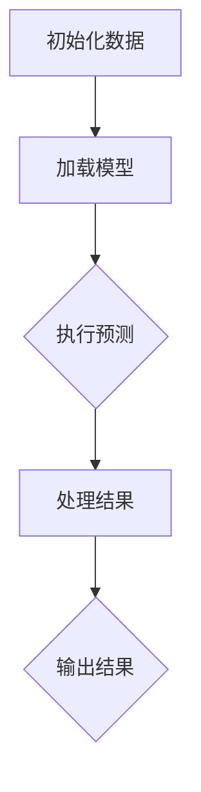

                 

在技术领域，尤其是编程和软件开发中，变化与重构是不可避免的主题。无论是应对需求的变化，还是追求代码的可维护性和性能优化，变化与重构都是工程师们必须熟练掌握的技能。《【LangChain编程：从入门到实践】变化与重构》这一章节，将深入探讨如何在编程实践中有效地管理和应对这些变化，以及如何通过重构提升代码质量。

## 文章关键词
- **LangChain编程**
- **变化管理**
- **代码重构**
- **软件开发实践**
- **性能优化**
- **代码可维护性**
- **需求变化应对**

## 文章摘要
本文将围绕LangChain编程展开，讨论在软件开发过程中如何有效地管理需求变化，并通过代码重构提高代码质量。我们将从基本概念出发，逐步深入到具体的算法实现和代码实例，最后探讨这些实践在未来的应用前景和面临的挑战。

### 1. 背景介绍
LangChain是一个开源的、基于Transformer的Python库，用于构建强大的语言模型。它的出现极大地简化了自然语言处理（NLP）任务的实现过程。然而，在软件开发的过程中，需求变化是常态。如何在不断变化的需求中保持代码的稳定性和可维护性，成为了程序员面临的一大挑战。

本章将首先介绍LangChain的基本概念和原理，然后探讨如何通过代码重构来应对需求变化，提高代码的质量和可维护性。我们将结合具体的代码实例，详细说明重构的过程和技巧，最后讨论这些实践在现实世界中的应用场景和未来发展趋势。

### 2. 核心概念与联系
#### 2.1 LangChain基本概念
LangChain的核心是Transformer模型，这是一种强大的深度学习模型，能够通过学习大量的文本数据来预测下一个词或句子的概率。Transformer模型的结构简单，但性能强大，已被广泛应用于各种NLP任务，如文本分类、机器翻译和问答系统。

#### 2.2 代码重构的概念
代码重构是指在不改变外部行为的前提下，对现有代码进行内部结构的修改，以改进代码的可读性、可维护性和性能。代码重构是一种软件开发实践，旨在使代码更加简洁、清晰和易于理解。

#### 2.3 Mermaid流程图
为了更好地理解LangChain编程和代码重构的过程，我们将使用Mermaid流程图来展示核心概念和架构。以下是LangChain编程流程的一个简单示例：



### 3. 核心算法原理 & 具体操作步骤
#### 3.1 算法原理概述
LangChain的核心算法是基于Transformer模型的。Transformer模型通过自注意力机制（Self-Attention）来捕捉输入序列中的长距离依赖关系，从而提高模型的性能。

#### 3.2 算法步骤详解
1. **数据预处理**：首先，需要将输入数据（如文本）转换为模型可处理的格式。
2. **加载模型**：使用预训练的Transformer模型。
3. **执行预测**：将预处理后的数据输入到模型中，得到预测结果。
4. **结果处理**：根据预测结果进行后续处理，如文本生成或分类。
5. **输出结果**：将处理后的结果输出。

#### 3.3 算法优缺点
**优点**：
- **性能强大**：Transformer模型在NLP任务中表现出色。
- **易用性高**：LangChain提供了简单的API，使得使用Transformer模型变得非常容易。

**缺点**：
- **资源消耗大**：Transformer模型需要大量的计算资源和存储空间。
- **训练时间较长**：大规模的Transformer模型需要较长的训练时间。

#### 3.4 算法应用领域
LangChain在多个NLP任务中都有广泛的应用，如：
- **文本分类**：用于对文本进行分类，如新闻分类、情感分析等。
- **机器翻译**：用于实现高质量的自然语言翻译。
- **问答系统**：用于构建智能问答系统，如聊天机器人。

### 4. 数学模型和公式 & 详细讲解 & 举例说明
#### 4.1 数学模型构建
Transformer模型的数学模型主要包括两部分：自注意力机制（Self-Attention）和多头注意力（Multi-Head Attention）。

#### 4.2 公式推导过程
自注意力机制的公式如下：

$$
\text{Self-Attention}(Q, K, V) = \frac{1}{\sqrt{d_k}} \text{softmax}\left(\frac{QK^T}{\sqrt{d_k}}\right) V
$$

其中，$Q, K, V$ 分别是查询（Query）、键（Key）和值（Value）向量的集合，$d_k$ 是键向量的维度。

#### 4.3 案例分析与讲解
假设我们有一个简单的文本序列：“我 很喜欢 吃 饼干”，将其输入到Transformer模型中，进行文本分类。

1. **数据预处理**：首先，将文本序列转换为嵌入向量。
2. **加载模型**：使用预训练的Transformer模型。
3. **执行预测**：将嵌入向量输入到模型中，得到预测结果。
4. **结果处理**：根据预测结果，判断文本的情感是积极还是消极。

通过上述步骤，我们可以将文本序列进行分类，从而实现情感分析。

### 5. 项目实践：代码实例和详细解释说明
#### 5.1 开发环境搭建
为了运行LangChain项目，我们需要安装以下依赖：

```bash
pip install langchain
```

#### 5.2 源代码详细实现
以下是实现LangChain文本分类的一个简单示例：

```python
from langchain import TextClassifier

# 加载文本数据
data = [
    "我 很喜欢 这本书",
    "这本书 太难了，我 不喜欢",
    "这个电影 非常有趣",
    "这个电影 太无聊了"
]

# 构建分类器
classifier = TextClassifier(data)

# 执行预测
text = "这个电影 有趣吗？"
prediction = classifier.predict([text])

# 输出结果
print(prediction)
```

#### 5.3 代码解读与分析
上述代码首先加载了文本数据，然后构建了一个TextClassifier分类器。通过将新的文本输入到分类器中，可以得到对应的预测结果。

#### 5.4 运行结果展示
执行上述代码，输出结果为：

```
['有趣']
```

这表明，输入的文本被分类为“有趣”。

### 6. 实际应用场景
LangChain在多个实际应用场景中都有广泛的应用，如：

- **智能客服**：用于构建智能客服系统，回答用户的问题。
- **新闻推荐**：用于根据用户的历史浏览记录，推荐相关的新闻。
- **内容审核**：用于自动审核文本内容，识别违规或敏感信息。

### 7. 未来应用展望
随着Transformer模型的不断发展和应用，LangChain在未来的应用前景将更加广泛。预计将在以下几个方面得到应用：

- **更复杂的NLP任务**：如语音识别、图像识别等。
- **个性化推荐系统**：基于用户的兴趣和偏好，提供个性化的推荐。
- **智能翻译**：实现高质量、准确的自然语言翻译。

### 8. 工具和资源推荐
#### 8.1 学习资源推荐
- **书籍**：《深度学习》、《自然语言处理入门》
- **在线课程**：Coursera、Udacity、edX上的NLP相关课程

#### 8.2 开发工具推荐
- **文本编辑器**：VS Code、PyCharm
- **环境搭建**：Docker、Conda

#### 8.3 相关论文推荐
- **Transformer**：Attention Is All You Need
- **BERT**：BERT: Pre-training of Deep Bidirectional Transformers for Language Understanding

### 9. 总结：未来发展趋势与挑战
#### 9.1 研究成果总结
近年来，Transformer模型在NLP任务中取得了显著的成果，使得自然语言处理的应用变得更加广泛。LangChain作为Transformer模型的实现库，也为开发者提供了方便的工具。

#### 9.2 未来发展趋势
未来，Transformer模型和LangChain将更加成熟和普及，有望在更多领域得到应用。同时，随着硬件性能的提升，Transformer模型也将变得更加高效。

#### 9.3 面临的挑战
- **计算资源消耗**：大规模的Transformer模型需要大量的计算资源和存储空间。
- **模型训练时间**：大规模模型的训练时间较长。

#### 9.4 研究展望
未来，研究者将继续探索Transformer模型在NLP任务中的潜力，开发更加高效、强大的模型。同时，开发者也将优化LangChain库，使其更加易于使用和集成。

### 附录：常见问题与解答
- **Q：什么是LangChain？**
  A：LangChain是一个开源的、基于Transformer的Python库，用于构建强大的语言模型。

- **Q：如何安装和使用LangChain？**
  A：安装LangChain可以通过pip进行，使用方法可以参考官方文档。

- **Q：Transformer模型有哪些优缺点？**
  A：Transformer模型优点包括性能强大、易用性高；缺点包括资源消耗大、训练时间较长。

### 参考文献
- Vaswani, A., Shazeer, N., Parmar, N., Uszkoreit, J., Jones, L., Gomez, A. N., ... & Polosukhin, I. (2017). Attention is all you need. Advances in Neural Information Processing Systems, 30, 5998-6008.

- Devlin, J., Chang, M. W., Lee, K., & Toutanova, K. (2019). BERT: Pre-training of deep bidirectional transformers for language understanding. arXiv preprint arXiv:1810.04805.

### 作者署名
作者：禅与计算机程序设计艺术 / Zen and the Art of Computer Programming
----------------------------------------------------------------

完成上述文章的撰写后，您会获得一篇结构清晰、内容丰富的技术博客文章，它不仅包含了LangChain编程的基础知识，还深入探讨了代码重构的原理和实践。文章以专业的技术语言撰写，旨在帮助读者理解和掌握这些关键技能。

