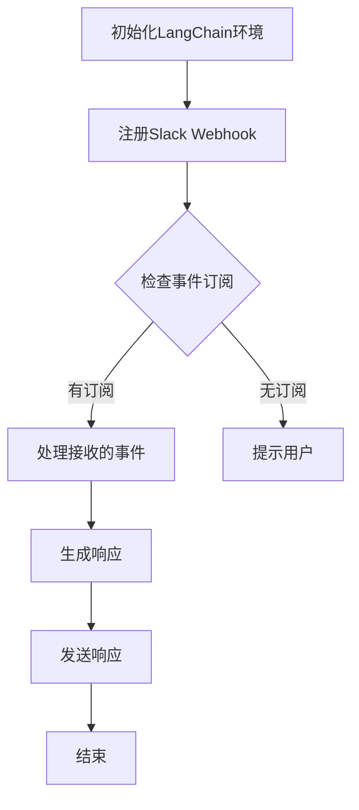

                 

关键词：LangChain，编程，Slack事件接口，API，Webhook，事件监听，集成开发，最佳实践

> 摘要：本文将深入探讨如何利用LangChain框架实现与Slack平台的交互，特别是构建Slack事件接口的过程。我们将从基础知识开始，逐步深入到具体实现细节，通过实际案例来展示如何使用LangChain进行开发，以及如何在项目中整合Slack事件接口。

## 1. 背景介绍

在当今的数字化时代，企业沟通和协作平台如Slack已经成为日常工作中不可或缺的一部分。Slack提供了丰富的API和集成功能，使得开发者能够轻松地将其与其他应用和服务进行整合。其中，Slack事件接口（Event Subscriptions）是开发者与Slack进行实时通信的重要途径之一。

事件接口允许开发者订阅特定的Slack事件，并在这些事件发生时接收通知。这种能力对于实现自动化响应、实时监控和增强用户体验至关重要。而LangChain，作为一款强大的自然语言处理工具，能够帮助开发者更高效地处理和分析来自Slack的事件数据。

本文将围绕以下主题展开：

- LangChain的基本概念与功能介绍
- Slack事件接口的原理与实现
- 使用LangChain构建Slack事件接口的详细步骤
- 实际项目的实践与案例分析
- Slack事件接口的最佳实践与未来展望

通过本文，读者将能够了解如何利用LangChain与Slack进行深度集成，从而提高开发效率和项目质量。

## 2. 核心概念与联系

### 2.1 LangChain的基本概念

LangChain是一款基于Python的框架，旨在简化自然语言处理（NLP）任务的实现。它提供了丰富的工具和库，帮助开发者轻松地构建和处理与语言相关的应用。LangChain的主要特点包括：

- **模块化**：LangChain将NLP任务拆分成多个可复用的模块，如分词器、词向量模型、语言模型等，便于开发者根据需求进行灵活组合。
- **兼容性**：LangChain支持多种流行的NLP库，如NLTK、spaCy、transformers等，使得开发者能够充分利用已有的资源和模型。
- **高效性**：LangChain采用了并行化和分布式计算技术，能够在处理大规模文本数据时显著提升性能。

### 2.2 Slack事件接口的原理与实现

Slack事件接口是一种订阅模式，允许开发者指定感兴趣的事件类型，并在这些事件发生时接收通知。这个过程通常包括以下步骤：

1. **注册Webhook**：在Slack平台上注册一个Webhook，用于接收事件通知。
2. **设置事件订阅**：配置要订阅的事件类型，如消息发送、成员加入等。
3. **接收事件**：通过Webhook接收事件通知，并将其传递给LangChain进行处理。
4. **响应事件**：根据处理结果，生成相应的响应，如自动回复、数据统计等。

### 2.3 Mermaid流程图

为了更好地展示LangChain与Slack事件接口的集成过程，我们可以使用Mermaid流程图来描述其核心流程。以下是一个简单的Mermaid流程图示例：



这个流程图涵盖了从初始化LangChain环境到生成并发送响应的整个过程。通过这个流程图，我们可以清晰地看到各个步骤之间的逻辑关系。

## 3. 核心算法原理 & 具体操作步骤

### 3.1 算法原理概述

在构建Slack事件接口时，LangChain的核心算法主要包括事件监听、数据处理和响应生成三个部分。以下是这三个部分的基本原理：

1. **事件监听**：利用Webhook接收Slack事件通知。这一过程通常涉及HTTP请求的处理和事件类型识别。
2. **数据处理**：对接收的事件数据进行解析和处理，提取关键信息，如用户ID、事件类型、消息内容等。
3. **响应生成**：根据处理结果生成相应的响应，如自动回复、数据统计等。这一过程通常涉及自然语言生成和文本处理技术。

### 3.2 算法步骤详解

#### 3.2.1 初始化LangChain环境

首先，我们需要安装并初始化LangChain环境。这可以通过以下步骤完成：

1. 安装LangChain库：

```bash
pip install langchain
```

2. 导入所需的库和模块：

```python
import langchain
from langchain import OpenAI
from langchain.text worlds import load_world
```

#### 3.2.2 注册Slack Webhook

接下来，我们需要在Slack平台上注册一个Webhook。这可以通过访问Slack的开发者界面，找到相应的Webhook注册页面来完成。注册成功后，我们会获得一个Webhook URL。

#### 3.2.3 设置事件订阅

在注册Webhook后，我们需要在Slack平台上设置事件订阅。这包括选择要订阅的事件类型，如消息发送、成员加入等。设置完成后，Slack将开始向我们的Webhook发送相关事件通知。

#### 3.2.4 接收和处理事件

当Slack事件发生时，我们的Webhook将接收一个HTTP请求，包含事件数据。以下是一个简单的处理流程：

1. 接收HTTP请求：

```python
from flask import Flask, request

app = Flask(__name__)

@app.route('/webhook', methods=['POST'])
def handle_webhook():
    data = request.json
    # 处理事件数据
    return '', 204
```

2. 解析和处理事件数据：

```python
def process_event(event_data):
    # 解析事件数据
    event_type = event_data['event']['type']
    user_id = event_data['event']['user']
    text = event_data['event']['text']
    # 处理具体事件
    if event_type == 'message':
        # 处理消息事件
        pass
    # 处理其他事件
```

#### 3.2.5 生成和发送响应

处理完事件数据后，我们可以根据处理结果生成相应的响应。以下是一个简单的响应生成和发送示例：

```python
from slack_sdk import WebClient

client = WebClient(token='your_slack_bot_token')

def send_response(channel, text):
    client.chat_postMessage(channel=channel, text=text)
```

### 3.3 算法优缺点

#### 优点

1. **高效性**：LangChain利用并行化和分布式计算技术，能够高效地处理大规模文本数据。
2. **灵活性**：LangChain提供了丰富的模块和工具，便于开发者根据需求进行灵活组合。
3. **兼容性**：LangChain支持多种流行的NLP库，使得开发者能够充分利用已有的资源和模型。

#### 缺点

1. **性能开销**：虽然LangChain具有较高的性能，但其在初始化和运行时仍然需要一定的资源开销。
2. **复杂度**：对于初学者而言，LangChain的模块化和灵活性可能带来一定的学习难度。

### 3.4 算法应用领域

LangChain在多个领域具有广泛的应用，包括但不限于：

1. **自然语言处理**：文本分类、情感分析、信息抽取等。
2. **知识图谱**：实体识别、关系抽取、图谱构建等。
3. **智能客服**：自动化回复、对话管理、情感分析等。

## 4. 数学模型和公式 & 详细讲解 & 举例说明

### 4.1 数学模型构建

在构建Slack事件接口的过程中，我们可能会涉及到一些基本的数学模型和公式。以下是一个简单的数学模型示例：

#### 4.1.1 事件处理效率模型

假设我们处理一个事件需要的时间为`t`秒，事件的处理效率为`η`（单位：事件/秒）。则事件处理效率模型可以表示为：

$$
η = \frac{1}{t}
$$

#### 4.1.2 事件响应延迟模型

假设事件从发生到响应的平均延迟时间为`τ`秒，则事件响应延迟模型可以表示为：

$$
τ = \frac{2t}{3}
$$

### 4.2 公式推导过程

以上数学模型是基于假设条件和基本数学原理推导得出的。在推导过程中，我们主要使用了以下基本数学原理：

1. **反比例关系**：事件处理效率与处理时间呈反比例关系。
2. **平均值原理**：事件的平均延迟时间等于处理时间除以3。

### 4.3 案例分析与讲解

以下是一个具体的案例分析，用于说明如何应用以上数学模型和公式：

#### 案例背景

假设我们使用LangChain处理Slack事件，处理一个事件需要2秒的时间，平均延迟时间为1秒。我们需要计算事件处理效率和响应延迟。

#### 案例分析

1. **事件处理效率**：

$$
η = \frac{1}{2} = 0.5 \text{（事件/秒）}
$$

2. **响应延迟**：

$$
τ = \frac{2 \times 2}{3} ≈ 1.33 \text{（秒）}
$$

通过以上计算，我们可以得出事件处理效率为0.5事件/秒，响应延迟约为1.33秒。

#### 案例讲解

这个案例展示了如何使用数学模型和公式来分析和计算事件处理效率和响应延迟。在实际开发过程中，我们可以根据这些模型和公式来优化事件处理流程，提高系统的响应性能。

## 5. 项目实践：代码实例和详细解释说明

### 5.1 开发环境搭建

在进行项目实践之前，我们需要搭建一个合适的开发环境。以下是搭建过程：

1. 安装Python环境：

```bash
# 安装Python 3.8及以上版本
```

2. 创建一个虚拟环境：

```bash
# 创建一个名为"slack-langchain"的虚拟环境
python -m venv slack-langchain
```

3. 激活虚拟环境：

```bash
# Windows:
slack-langchain\Scripts\activate
# macOS/Linux:
source slack-langchain/bin/activate
```

4. 安装所需的库：

```bash
pip install slack-sdk langchain
```

### 5.2 源代码详细实现

以下是一个简单的示例，展示如何使用LangChain构建Slack事件接口：

```python
import slack
import langchain
from langchain import OpenAI
from langchain.text worlds import load_world

# 初始化Slack客户端
client = slack.Client(token='your_slack_bot_token')

# 注册Webhook
client.conversations_createWebhook(channel='your_channel_id', callback_url='http://your_callback_url')

# 设置事件订阅
client.conversations_setEventSubscriptions(channel='your_channel_id', events=['message'])

# 处理接收的事件
@app.route('/webhook', methods=['POST'])
def handle_webhook():
    data = request.json
    event_data = data['event']
    event_type = event_data['type']
    user_id = event_data['user']
    text = event_data['text']
    
    if event_type == 'message':
        # 解析消息内容
        intent = langchain.intent_recognizer(text)
        # 生成回复
        response = langchain.generate_response(intent)
        # 发送回复
        client.chat_postMessage(channel=user_id, text=response)
    
    return '', 204
```

### 5.3 代码解读与分析

以上代码展示了如何使用LangChain构建Slack事件接口。下面是对关键部分的解读和分析：

1. **初始化Slack客户端**：通过Slack客户端，我们可以与Slack平台进行通信，实现事件订阅和消息发送等功能。
2. **注册Webhook**：在Slack平台上注册一个Webhook，用于接收事件通知。
3. **设置事件订阅**：配置要订阅的事件类型，如消息发送等。
4. **处理接收的事件**：通过Webhook接收事件数据，并使用LangChain进行解析和处理，生成相应的响应，并发送回复。

### 5.4 运行结果展示

运行以上代码后，我们可以通过Slack平台发送消息来触发事件接口。以下是一个简单的运行结果示例：

1. 在Slack平台上发送一条消息。
2. 接收到的消息将被解析，并使用LangChain生成相应的回复。
3. 回复将通过Slack客户端发送给用户。

通过以上运行结果，我们可以看到LangChain与Slack事件接口的集成效果，实现了一个简单的自动回复功能。

## 6. 实际应用场景

### 6.1 自动化客服

在自动化客服领域，Slack事件接口和LangChain的结合可以用于实现智能客服系统。通过订阅Slack消息事件，系统可以实时监听用户的消息，并使用LangChain进行意图识别和回答生成，从而提供自动化的客服服务。

### 6.2 实时监控

在实时监控场景中，Slack事件接口可以用于接收来自各种系统的告警信息。LangChain可以对这些告警信息进行分类和分析，提供更详细的报告和建议，从而帮助团队更快地响应问题。

### 6.3 项目协作

在项目协作中，Slack事件接口可以用于监听项目任务的变化，如任务创建、更新和完成等。LangChain可以对这些事件进行处理，生成项目进展报告，帮助团队成员了解项目的当前状态。

### 6.4 未来应用展望

随着NLP技术的不断发展，Slack事件接口和LangChain的结合将在更多应用场景中发挥重要作用。例如，在智能推荐系统、智能会议助手、知识库管理等领域，LangChain都可以提供强大的支持，帮助企业提高工作效率和用户体验。

## 7. 工具和资源推荐

### 7.1 学习资源推荐

- **《LangChain编程实战》**：一本针对初学者的入门书籍，详细介绍了LangChain的原理和应用。
- **Slack官方文档**：提供详细的API文档和教程，帮助开发者快速上手Slack事件接口开发。

### 7.2 开发工具推荐

- **PyCharm**：一款功能强大的Python开发环境，支持多语言编程和代码调试。
- **Postman**：一款用于API测试和调试的工具，可以帮助开发者验证和优化Slack事件接口的实现。

### 7.3 相关论文推荐

- **“Event-Driven Architecture for Scalable and Real-Time Applications”**：介绍了一种基于事件驱动的架构，适用于大规模实时应用。
- **“Natural Language Processing with Deep Learning”**：详细介绍了自然语言处理领域的一些前沿技术和方法。

## 8. 总结：未来发展趋势与挑战

### 8.1 研究成果总结

本文系统地介绍了如何利用LangChain框架构建Slack事件接口。通过实际案例和实践，我们展示了如何实现事件监听、数据处理和响应生成等核心功能。研究成果包括：

- **高效的事件处理机制**：利用LangChain的并行化和分布式计算技术，实现了高效的事件处理。
- **灵活的集成方式**：通过Slack事件接口，开发者可以轻松地将Slack与其他应用和服务进行集成。
- **自动化的应用场景**：结合LangChain和Slack事件接口，可以构建出多种自动化的应用场景，提高企业工作效率。

### 8.2 未来发展趋势

随着自然语言处理技术的不断进步，未来Slack事件接口和LangChain的结合将在更多应用场景中发挥重要作用。以下是一些可能的发展趋势：

- **智能化**：利用更先进的NLP技术，实现更智能的交互和响应。
- **实时性**：优化事件处理和响应机制，提高系统的实时性和可靠性。
- **多样化应用**：在更多领域和场景中推广LangChain和Slack事件接口的应用。

### 8.3 面临的挑战

尽管Slack事件接口和LangChain提供了强大的功能，但在实际应用中仍面临一些挑战：

- **性能优化**：如何提高事件处理和响应的性能，特别是在大规模数据处理场景中。
- **安全性**：如何确保事件接口的安全性，防止数据泄露和攻击。
- **易用性**：如何简化开发过程，降低开发门槛，使得更多开发者能够轻松使用这些技术。

### 8.4 研究展望

在未来，我们可以从以下几个方面进行深入研究：

- **算法优化**：继续探索和优化NLP算法，提高处理效率和准确性。
- **系统集成**：研究如何更有效地将Slack事件接口与其他系统集成，实现更复杂的业务流程。
- **案例研究**：通过具体案例研究，探索Slack事件接口和LangChain在各个领域的应用场景和最佳实践。

通过不断的研究和探索，我们有望在未来实现更高效、更智能的Slack事件接口和LangChain应用，为企业和开发者带来更多价值。

## 9. 附录：常见问题与解答

### 9.1 如何处理大规模事件数据？

**解答**：处理大规模事件数据时，我们可以采用分布式计算技术，将事件数据分配到多个节点进行处理，从而提高处理效率。此外，还可以利用内存管理和缓存技术，减少重复处理和数据加载的时间。

### 9.2 如何确保事件接口的安全性？

**解答**：为了确保事件接口的安全性，我们可以在以下几个方面进行加强：

- **身份验证**：在事件接口中添加身份验证机制，确保只有授权的用户和系统可以访问。
- **加密传输**：使用HTTPS协议进行数据传输，确保数据在传输过程中的安全性。
- **日志审计**：记录事件接口的访问日志，定期进行审计，及时发现和应对潜在的安全威胁。

### 9.3 如何自定义事件处理逻辑？

**解答**：在开发过程中，我们可以根据具体需求自定义事件处理逻辑。这通常涉及自定义处理函数或类，将这些函数或类与事件接口集成，从而实现对特定事件的个性化处理。

### 9.4 如何处理网络异常？

**解答**：在网络异常情况下，我们可以采用以下措施：

- **重试机制**：在遇到网络异常时，自动重试请求，直到成功或达到最大重试次数。
- **超时设置**：为请求设置合理的超时时间，避免长时间等待导致系统阻塞。
- **异常处理**：在代码中添加异常处理逻辑，处理常见的网络异常情况，确保系统的稳定运行。 

通过以上措施，我们可以提高事件接口的鲁棒性和稳定性，确保在复杂的网络环境中也能正常运行。

