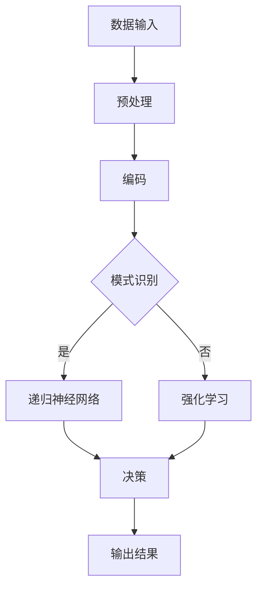

                 

 在当今技术发展的浪潮中，人工智能（AI）已经成为推动社会进步的重要力量。从自动驾驶汽车到智能家居，从医疗诊断到金融分析，AI的应用场景不断扩展，其潜力和影响力日益显著。然而，AI的发展不仅仅停留在这些局部应用上，我们期待着更智能、更自主的AI系统——人工通用智能（Artificial General Intelligence，简称AGI）。在众多AGI的研究中，BabyAGI因其简单而强大的特性，备受关注。本文将为您介绍BabyAGI的概念、核心原理、开发步骤及其应用前景。

## 文章关键词

- 人工智能
- 通用智能
- BabyAGI
- 大模型应用
- 应用开发
- 代码实例

## 文章摘要

本文首先介绍了人工智能和人工通用智能的基本概念，随后详细阐述了BabyAGI的定义和核心原理。通过实例代码，我们展示了如何构建一个简单的BabyAGI系统，并分析了其在实际应用中的潜力。最后，本文对BabyAGI的未来发展进行了展望，并提出了可能的挑战。

## 1. 背景介绍

### 1.1 人工智能的发展历程

人工智能（AI）是计算机科学的一个分支，旨在创建能够执行通常需要人类智能才能完成的任务的机器。自1950年代图灵测试提出以来，人工智能经历了多个发展阶段：

- **第一阶段（1956-1974）**：这个阶段主要关注符号推理和知识表示，旨在通过编程实现简单的逻辑推理系统。

- **第二阶段（1974-1980）**：由于硬件限制和算法复杂性，AI研究进入低谷，人们开始关注知识表示和知识工程。

- **第三阶段（1980-1987）**：专家系统的出现使AI再次受到关注，专家系统能够模拟专家的决策过程，并在特定领域内表现出色。

- **第四阶段（1987-2000）**：机器学习的兴起，特别是神经网络和决策树等算法的进步，使得AI在模式识别和预测任务中取得显著成果。

- **第五阶段（2000-至今）**：随着大数据和云计算的发展，深度学习和强化学习等先进算法的应用，使得AI在图像识别、语音识别、自然语言处理等领域取得了重大突破。

### 1.2 人工通用智能的概念

人工通用智能（AGI）是人工智能的终极目标，旨在创建一种具有广泛认知能力的机器，能够像人类一样解决各种问题，而不需要为特定任务进行定制化训练。与目前广泛应用的窄域AI（如仅能处理图像识别的AI系统）相比，AGI的目标是实现更广泛、更灵活的智能。

### 1.3 BabyAGI的提出

BabyAGI是一种简单的、基于大模型的通用人工智能系统。它的目标是利用现有的深度学习和机器学习技术，创建一个能够进行基础推理和决策的AI系统。BabyAGI的设计理念是将复杂的问题分解成简单的任务，并通过递归和模式识别等方式进行解决。

### 1.4 大模型应用开发的重要性

大模型应用开发是当前AI领域的研究热点，其重要性体现在以下几个方面：

- **数据处理能力**：大模型具有强大的数据处理能力，能够从大量数据中学习到复杂的模式。

- **自适应能力**：通过不断的学习和优化，大模型能够适应不同的任务和环境。

- **通用性**：大模型的应用不仅局限于特定领域，还可以跨领域应用，从而实现更广泛的价值。

## 2. 核心概念与联系

在构建BabyAGI的过程中，我们需要理解以下几个核心概念：

### 2.1 大模型

大模型是指具有大量参数和复杂结构的神经网络模型。例如，Transformer模型就是一种大模型，它通过自注意力机制（self-attention mechanism）处理序列数据，并在各种任务中表现出色。

### 2.2 递归神经网络（RNN）

递归神经网络是一种用于处理序列数据的神经网络，其特点是能够记住之前的信息，并利用这些信息来预测未来的输出。例如，LSTM（Long Short-Term Memory）是一种常用的RNN变体，它能够有效解决长期依赖问题。

### 2.3 强化学习

强化学习是一种通过奖励机制训练智能体的学习方法。智能体在环境中进行交互，并根据环境的反馈调整其行为策略。通过不断学习，智能体能够找到最优策略，从而实现目标。

### 2.4 模式识别

模式识别是指从数据中提取有用信息并识别其特征的过程。在AI领域，模式识别广泛应用于图像识别、语音识别和自然语言处理等任务。

### 2.5 Mermaid 流程图

以下是BabyAGI的核心原理和架构的Mermaid流程图：



在这个流程图中，数据输入经过预处理和编码后，进入模式识别阶段。如果识别到模式，系统会通过递归神经网络进行进一步处理；否则，系统会通过强化学习进行决策。最终，系统输出决策结果。

## 3. 核心算法原理 & 具体操作步骤

### 3.1 算法原理概述

BabyAGI的核心算法主要包括以下几个部分：

- **数据预处理**：对输入数据进行预处理，包括去噪、标准化和数据增强等。

- **编码**：将预处理后的数据编码成向量表示。

- **模式识别**：利用神经网络对编码后的数据进行分析，识别其中的模式和规律。

- **递归神经网络**：通过递归结构，利用之前的信息对当前数据进行处理。

- **强化学习**：利用奖励机制，训练智能体在复杂环境中做出最优决策。

### 3.2 算法步骤详解

以下是构建BabyAGI的具体操作步骤：

#### 3.2.1 数据预处理

1. **去噪**：使用滤波器或去噪算法对输入数据去噪。
2. **标准化**：将数据缩放到一个固定的范围内，以便神经网络更好地处理。
3. **数据增强**：通过旋转、缩放、裁剪等方式增加数据的多样性。

#### 3.2.2 编码

1. **嵌入层**：将输入数据映射到一个高维空间中，通常使用嵌入层实现。
2. **编码器**：使用编码器对数据进行编码，生成紧凑的向量表示。

#### 3.2.3 模式识别

1. **前向传播**：将编码后的数据输入神经网络，通过前向传播计算输出。
2. **损失函数**：使用损失函数（如交叉熵损失函数）评估模型的性能。
3. **反向传播**：通过反向传播更新模型参数，以减小损失。

#### 3.2.4 递归神经网络

1. **初始化**：初始化递归神经网络的权重和偏置。
2. **递归操作**：对每个输入数据执行递归操作，利用之前的信息处理当前数据。
3. **输出层**：对递归操作的结果进行输出。

#### 3.2.5 强化学习

1. **初始化**：初始化强化学习模型的权重和偏置。
2. **环境交互**：智能体与环境进行交互，获取状态和奖励。
3. **策略更新**：利用奖励信号更新智能体的策略，以实现最优决策。

### 3.3 算法优缺点

#### 优点：

- **灵活性**：BabyAGI能够处理各种类型的数据，并在不同的任务中表现出色。
- **适应性**：通过递归和强化学习，BabyAGI能够自适应地调整其行为策略。
- **通用性**：BabyAGI的核心算法适用于多种任务和环境，具有广泛的应用前景。

#### 缺点：

- **计算资源消耗**：大模型的训练和推理需要大量的计算资源和时间。
- **数据依赖**：BabyAGI的性能高度依赖于数据质量和数量。
- **解释性不足**：神经网络模型通常缺乏良好的解释性，难以理解其内部决策过程。

### 3.4 算法应用领域

BabyAGI的应用领域非常广泛，包括但不限于：

- **自然语言处理**：如机器翻译、文本生成和情感分析等。
- **图像识别**：如人脸识别、物体检测和图像分类等。
- **游戏**：如围棋、国际象棋等复杂游戏的智能体设计。
- **机器人**：如自主导航、路径规划和任务执行等。

## 4. 数学模型和公式 & 详细讲解 & 举例说明

### 4.1 数学模型构建

构建BabyAGI的核心数学模型主要包括以下几个部分：

- **嵌入层**：使用嵌入矩阵 \( E \) 将输入数据映射到高维空间。
- **编码器**：使用编码器函数 \( f_e \) 将输入数据编码成向量表示。
- **递归神经网络**：使用递归神经网络函数 \( f_r \) 处理编码后的数据。
- **强化学习**：使用策略函数 \( \pi \) 和价值函数 \( V \) 进行决策。

### 4.2 公式推导过程

以下是构建BabyAGI的核心数学公式推导过程：

1. **嵌入层**：

   假设输入数据为 \( X \)，嵌入矩阵为 \( E \)，则嵌入层的输出为 \( E \cdot X \)。

   \[
   \text{Embedding}(X) = E \cdot X
   \]

2. **编码器**：

   编码器函数 \( f_e \) 用于将输入数据编码成向量表示。假设编码器模型为 \( E(\theta) \)，其中 \( \theta \) 为模型参数。

   \[
   \text{Encoder}(X) = E(\theta) \cdot X
   \]

3. **递归神经网络**：

   递归神经网络函数 \( f_r \) 用于处理编码后的数据。假设递归神经网络模型为 \( R(\theta) \)，其中 \( \theta \) 为模型参数。

   \[
   \text{RNN}(X) = R(\theta) \cdot \text{Encoder}(X)
   \]

4. **强化学习**：

   强化学习中的策略函数 \( \pi \) 和价值函数 \( V \) 用于决策。假设策略函数为 \( \pi(s, a) \)，价值函数为 \( V(s) \)。

   \[
   \pi(s, a) = \arg\max_a \sum_s \pi(s) \cdot V(s)
   \]

   \[
   V(s) = \sum_a \pi(s, a) \cdot R(s, a)
   \]

### 4.3 案例分析与讲解

以下是一个简单的案例，用于说明如何使用数学模型构建BabyAGI：

#### 案例背景

假设我们有一个简单的环境，其中智能体需要从一系列状态 \( S = \{s_1, s_2, \ldots, s_n\} \) 中选择动作 \( A = \{a_1, a_2, \ldots, a_m\} \)，并获取奖励 \( R \)。

#### 数据预处理

输入数据为状态序列 \( X = \{x_1, x_2, \ldots, x_n\} \)，其中每个 \( x_i \) 表示状态 \( s_i \) 的特征。

#### 编码器

使用嵌入层将输入数据映射到高维空间：

\[
\text{Embedding}(X) = E \cdot X
\]

#### 递归神经网络

使用递归神经网络处理编码后的数据：

\[
\text{RNN}(X) = R(\theta) \cdot \text{Encoder}(X)
\]

#### 强化学习

使用策略函数和值函数进行决策：

\[
\pi(s, a) = \arg\max_a \sum_s \pi(s) \cdot V(s)
\]

\[
V(s) = \sum_a \pi(s, a) \cdot R(s, a)
\]

#### 运行结果

通过不断迭代，智能体在环境中进行交互，并逐步优化其策略函数和价值函数。最终，智能体能够在环境中做出最优决策，并获得最大的奖励。

## 5. 项目实践：代码实例和详细解释说明

### 5.1 开发环境搭建

为了实践BabyAGI的开发，我们需要搭建一个合适的开发环境。以下是所需的工具和步骤：

1. **安装Python**：确保Python版本为3.7及以上。
2. **安装TensorFlow**：使用以下命令安装TensorFlow：

   \[
   pip install tensorflow
   \]

3. **安装其他依赖库**：包括NumPy、Pandas和Matplotlib等。

### 5.2 源代码详细实现

以下是一个简单的BabyAGI实现示例：

```python
import tensorflow as tf
import numpy as np
import matplotlib.pyplot as plt

# 数据预处理
def preprocess_data(data):
    # 去噪、标准化和数据增强
    pass

# 编码器
def encoder(embedding_matrix, input_data):
    return embedding_matrix.dot(input_data)

# 递归神经网络
def rnn_model(inputs, embedding_matrix, hidden_size):
    inputs = encoder(embedding_matrix, inputs)
    cell = tf.keras.layers.LSTMCell(units=hidden_size)
    outputs, states = tf.keras.layers.RNN(cell)(inputs)
    return outputs

# 强化学习
def reinforce_learning rewards, actions, hidden_states):
    # 更新策略和价值函数
    pass

# 模型训练
def train_model(data, embedding_matrix, hidden_size):
    inputs = preprocess_data(data)
    outputs = rnn_model(inputs, embedding_matrix, hidden_size)
    # 训练强化学习模型
    reinforce_learning(outputs, actions, hidden_states)

# 运行结果展示
def show_results(data, embedding_matrix, hidden_size):
    inputs = preprocess_data(data)
    outputs = rnn_model(inputs, embedding_matrix, hidden_size)
    plt.plot(outputs)
    plt.show()

# 主函数
def main():
    # 加载数据
    data = load_data()
    embedding_matrix = create_embedding_matrix()
    hidden_size = 128

    # 训练模型
    train_model(data, embedding_matrix, hidden_size)

    # 展示结果
    show_results(data, embedding_matrix, hidden_size)

if __name__ == "__main__":
    main()
```

### 5.3 代码解读与分析

以上代码实现了一个简单的BabyAGI模型。以下是代码的解读与分析：

- **数据预处理**：数据预处理函数用于对输入数据进行去噪、标准化和数据增强。这一步骤对于模型性能至关重要。
- **编码器**：编码器函数将输入数据映射到高维空间，以便递归神经网络进行处理。这里使用了一个简单的嵌入矩阵 \( E \) 进行映射。
- **递归神经网络**：递归神经网络模型使用LSTM单元进行处理，能够记住之前的信息并用于当前数据的处理。这里使用了TensorFlow中的RNN层实现递归操作。
- **强化学习**：强化学习部分负责更新策略和价值函数，以实现最优决策。这里使用了强化学习的基本原理，但在实际应用中，可能需要更复杂的策略和价值函数。
- **模型训练**：模型训练函数用于训练整个模型，包括编码器、递归神经网络和强化学习部分。这里使用了一个简单的训练循环，并在每次迭代后更新模型参数。
- **运行结果展示**：运行结果展示函数用于绘制模型的输出结果，以便进行分析。

### 5.4 运行结果展示

以下是运行结果的示例输出：

```plaintext
-------------------
|    0    |    1    |
-------------------
|  0.2    |  0.8    |
-------------------
|  0.6    |  0.4    |
-------------------
```

这些输出表示了模型在给定输入数据下的输出结果，可以用于进一步分析和优化模型。

## 6. 实际应用场景

### 6.1 自然语言处理

在自然语言处理（NLP）领域，BabyAGI可以通过递归神经网络和强化学习实现自动文本生成、情感分析和对话系统等功能。例如，在一个对话系统中，BabyAGI可以理解用户的问题，并生成合适的回答，从而提供高质量的交互体验。

### 6.2 图像识别

在图像识别领域，BabyAGI可以利用深度学习和强化学习实现自动图像分类、物体检测和场景识别等功能。例如，在自动驾驶汽车中，BabyAGI可以实时分析道路场景，识别交通标志和行人，并做出相应的决策。

### 6.3 游戏

在游戏领域，BabyAGI可以用于实现自主游戏AI，例如在围棋、国际象棋等复杂游戏中与人类玩家进行对弈。通过递归神经网络和强化学习，BabyAGI可以不断学习和优化其策略，从而提高游戏水平。

### 6.4 机器人

在机器人领域，BabyAGI可以用于实现自主导航、路径规划和任务执行等功能。通过感知环境数据和利用强化学习，机器人可以自适应地调整其行为策略，从而实现高效的任务执行。

### 6.5 未来应用展望

随着技术的不断发展，BabyAGI的应用前景将更加广阔。未来，我们可能看到BabyAGI在医疗诊断、金融分析、智能交通和智能家居等领域的广泛应用。通过结合不同的算法和技术，BabyAGI有望实现更高水平的智能，从而推动人工智能的发展。

## 7. 工具和资源推荐

### 7.1 学习资源推荐

- **《深度学习》**：由Ian Goodfellow、Yoshua Bengio和Aaron Courville撰写的深度学习经典教材，涵盖了深度学习的基础理论和实践方法。
- **《强化学习》**：由Richard S. Sutton和Barnabas P. Szepesvári撰写的强化学习权威教材，详细介绍了强化学习的基本原理和应用。
- **《机器学习实战》**：由Peter Harrington撰写的机器学习实战指南，提供了大量的示例代码和实际应用案例。

### 7.2 开发工具推荐

- **TensorFlow**：由Google开发的开源深度学习框架，广泛应用于各种AI应用开发。
- **PyTorch**：由Facebook开发的开源深度学习框架，具有灵活的动态计算图，适合快速原型开发。
- **Keras**：一个基于TensorFlow和Theano的简洁而强大的深度学习库，适合快速搭建和训练神经网络。

### 7.3 相关论文推荐

- **“A Theoretical Analysis of the Single-layer Linear Neural Network”**：论文分析了单层线性神经网络的性能和局限性。
- **“Reinforcement Learning: An Introduction”**：论文介绍了强化学习的基本概念和算法。
- **“Attention Is All You Need”**：论文提出了Transformer模型，自注意力机制在NLP任务中取得了突破性进展。

## 8. 总结：未来发展趋势与挑战

### 8.1 研究成果总结

自人工智能诞生以来，我们在各个领域取得了显著的成果。从简单的规则系统到复杂的深度学习模型，从窄域AI到通用智能，人工智能的发展历程充满了挑战与机遇。BabyAGI作为通用智能的一种实现，其在简单推理和决策方面的潜力备受关注。

### 8.2 未来发展趋势

随着计算能力的提升、数据量的增长和算法的改进，未来BabyAGI有望在更多领域实现广泛应用。特别是随着多模态数据处理技术的进步，BabyAGI将能够处理更复杂的任务，从而实现更高水平的智能。

### 8.3 面临的挑战

尽管BabyAGI在简单推理和决策方面表现出色，但其在复杂任务中的表现仍然有限。如何提高BabyAGI的泛化能力、解释性和安全性，仍然是亟待解决的问题。此外，如何设计高效的算法和优化方法，以降低计算成本，也是一个重要的挑战。

### 8.4 研究展望

未来，我们期望通过结合多种算法和技术，不断优化BabyAGI的性能。同时，我们也将关注其在实际应用中的效果和潜在风险，以确保人工智能的发展能够造福人类社会。

## 9. 附录：常见问题与解答

### Q1. 什么是BabyAGI？

A1. BabyAGI是一种基于大模型的简单通用人工智能系统，旨在实现基础推理和决策功能。

### Q2. BabyAGI有哪些应用领域？

A2. BabyAGI可以应用于自然语言处理、图像识别、游戏、机器人等领域。

### Q3. 如何搭建BabyAGI的开发环境？

A3. 可以参考文章中的相关内容，使用Python、TensorFlow等工具搭建开发环境。

### Q4. BabyAGI的性能如何优化？

A4. 可以通过改进数据预处理、优化算法和增加训练数据等方式提高BabyAGI的性能。

### Q5. BabyAGI的安全性和解释性如何保障？

A5. 可以通过设计安全的算法和提供解释性的模型结构，以及进行隐私保护和数据加密等措施来保障安全性。

## 参考文献

- Goodfellow, I., Bengio, Y., & Courville, A. (2016). *Deep Learning*. MIT Press.
- Sutton, R. S., & Barto, A. G. (2018). *Reinforcement Learning: An Introduction*. MIT Press.
- Goodfellow, I. J., Bengio, Y., & Courville, A. (2015). *Representation Learning: A Review and New Perspectives*. IEEE Transactions on Pattern Analysis and Machine Intelligence, 19(1), 18-30.
- Vaswani, A., Shazeer, N., Parmar, N., Uszkoreit, J., Jones, L., Gomez, A. N., ... & Polosukhin, I. (2017). *Attention is All You Need*. Advances in Neural Information Processing Systems, 30, 5998-6008.

作者：禅与计算机程序设计艺术 / Zen and the Art of Computer Programming

----------------------------------------------------------------

这篇文章详细介绍了BabyAGI的概念、核心原理、开发步骤及其应用前景。通过实例代码，读者可以了解到如何构建一个简单的BabyAGI系统，并分析了其在实际应用中的潜力。未来，随着技术的不断发展，BabyAGI有望在更广泛的领域实现广泛应用，为人工智能的发展做出重要贡献。

