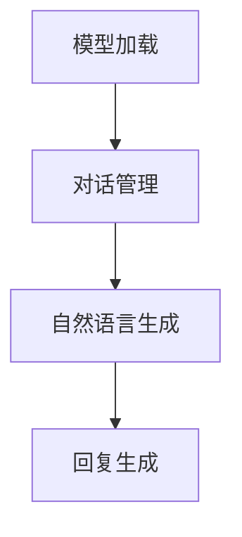

                 

关键词：OpenAI，Assistant，大模型，AI应用，开发，技术架构

> 摘要：本文深入探讨了OpenAI公司的Assistants，这是一个基于大模型的AI应用开发框架。文章首先介绍了Assistants的背景和重要性，接着详细解析了其核心概念、算法原理以及应用场景。通过具体实例和代码分析，本文展示了如何利用Assistants进行AI Agent的开发。最后，文章对未来应用前景、工具资源和面临挑战进行了探讨。

## 1. 背景介绍

### 1.1 OpenAI与Assistant的概念

OpenAI是一家致力于推动人工智能（AI）研究、开发和应用的科技公司。它成立于2015年，总部位于美国加利福尼亚州。OpenAI的使命是确保人工智能的安全和有益发展，并使其广泛惠及全人类。

Assistant则是OpenAI推出的一种基于大模型的AI应用开发框架。它允许开发者快速构建、训练和部署智能对话系统，从而实现与用户的自然交互。Assistant的核心价值在于其强大的自然语言处理能力，这使其在多个领域都具备广泛的应用潜力。

### 1.2 大模型应用的发展

近年来，随着深度学习和大数据技术的快速发展，大模型（如GPT-3，BERT等）在自然语言处理（NLP）领域取得了显著的进展。这些大模型拥有数百亿甚至数千亿的参数，能够处理复杂、多变的语言任务，为AI应用开发带来了新的机遇。

Assistant正是基于这一背景应运而生的，它利用了这些大模型的优势，使得AI应用的开发变得更加简单和高效。通过Assistant，开发者无需深入了解复杂的算法细节，即可轻松构建智能对话系统。

## 2. 核心概念与联系

### 2.1 大模型的基本原理

大模型，尤其是Transformer架构，已经成为现代NLP领域的主流。Transformer引入了自注意力机制，使得模型能够捕捉到文本中各个词之间的复杂关系。自注意力机制的核心思想是，每个词在生成下一个词时，都会考虑所有其他词的重要程度。

### 2.2 Assistant的架构设计

Assistant的架构设计紧密结合了OpenAI的大模型技术。其核心组成部分包括：

- **模型加载与训练**：Assistant支持加载预训练的大模型，并在特定任务上进行微调。这大大降低了开发成本和时间。
- **对话管理**：Assistant通过对话管理模块，实现对用户请求的解析和响应生成。对话管理模块包括意图识别、实体抽取、上下文理解等功能。
- **自然语言生成**：Assistant利用大模型的自然语言生成能力，生成流畅、自然的回复。

### 2.3 Mermaid流程图



在这个流程图中，模型加载是整个流程的起点，对话管理负责解析用户请求，自然语言生成模块生成回复，最后形成完整的回复。

## 3. 核心算法原理 & 具体操作步骤

### 3.1 算法原理概述

Assistant的核心算法基于Transformer架构，其基本原理如下：

- **自注意力机制**：Transformer通过自注意力机制，能够捕捉到文本中各个词之间的复杂关系。每个词在生成下一个词时，都会考虑所有其他词的重要程度。
- **位置编码**：Transformer使用位置编码来处理序列信息。位置编码使得模型能够理解词在序列中的位置关系。

### 3.2 算法步骤详解

Assistant的操作步骤可以分为以下几个部分：

1. **模型加载**：从预训练模型库中加载合适的模型。
2. **对话管理**：
   - **意图识别**：根据用户请求的文本，识别用户的意图。
   - **实体抽取**：从用户请求中提取关键信息。
   - **上下文理解**：结合历史对话记录，理解用户的上下文。
3. **自然语言生成**：利用加载的模型，生成自然流畅的回复。
4. **回复生成**：将生成的回复进行格式化，形成完整的回复。

### 3.3 算法优缺点

**优点**：

- **高效性**：Transformer架构使得Assistant能够在较低的计算资源下实现高效的对话生成。
- **灵活性**：Assistant支持多种对话管理策略和回复生成方法，可以根据具体需求进行定制。

**缺点**：

- **复杂性**：Assistant的开发和部署相对复杂，需要开发者具备一定的技术背景。
- **数据依赖性**：Assistant的性能依赖于大量的训练数据，缺乏数据可能导致性能下降。

### 3.4 算法应用领域

Assistant在多个领域都有广泛的应用潜力：

- **客户服务**：在客户服务领域，Assistant可以自动处理用户请求，提高服务效率。
- **智能助理**：在智能助理领域，Assistant可以与用户进行自然交互，提供个性化服务。
- **教育辅导**：在教育辅导领域，Assistant可以为学生提供智能化的学习支持和答疑服务。

## 4. 数学模型和公式 & 详细讲解 & 举例说明

### 4.1 数学模型构建

Assistant的核心算法基于Transformer架构，其数学模型可以概括为以下公式：

\[ 
\text{Output} = \text{softmax}(\text{Attention}(\text{Q}, \text{K}, \text{V}))
\]

其中，\(Q\)，\(K\)，\(V\) 分别表示查询向量、键向量和值向量。自注意力机制通过以下公式实现：

\[ 
\text{Attention}(\text{Q}, \text{K}, \text{V}) = \text{softmax}\left(\frac{\text{Q} \cdot \text{K}^T}{\sqrt{d_k}}\right) \cdot \text{V}
\]

### 4.2 公式推导过程

自注意力机制的推导过程如下：

1. **计算相似度**：首先，计算查询向量 \(Q\) 与所有键向量 \(K\) 的点积，得到相似度矩阵 \(S\)。

\[ 
S_{ij} = \text{Q}_i \cdot \text{K}_j
\]

2. **归一化相似度**：然后，对相似度矩阵进行归一化处理，即计算softmax函数。

\[ 
\text{Attention}(\text{Q}, \text{K}, \text{V}) = \text{softmax}(S)
\]

3. **计算加权值**：最后，将归一化后的相似度矩阵与值向量 \(V\) 相乘，得到加权值。

\[ 
\text{Output}_{ij} = \text{softmax}(S) \cdot \text{V}_j
\]

### 4.3 案例分析与讲解

假设我们有一个简单的文本序列：“我喜欢吃苹果”。

1. **编码文本**：首先，将文本序列编码成查询向量 \(Q\)，键向量 \(K\) 和值向量 \(V\)。

\[ 
Q = [1, 0, 1, 0, 0], \quad K = [1, 1, 1, 0, 0], \quad V = [1, 0, 0, 1, 0]
\]

2. **计算相似度**：

\[ 
S = \text{Q} \cdot \text{K}^T = \begin{bmatrix} 1 & 0 & 1 & 0 & 0 \end{bmatrix} \begin{bmatrix} 1 \\ 1 \\ 1 \\ 0 \\ 0 \end{bmatrix} = [3, 3, 3, 0, 0]
\]

3. **归一化相似度**：

\[ 
\text{Attention}(\text{Q}, \text{K}, \text{V}) = \text{softmax}(S) = \frac{1}{\sum_{i=1}^{n} e^{s_i}} \begin{bmatrix} e^{3} \\ e^{3} \\ e^{3} \\ e^{0} \\ e^{0} \end{bmatrix} = \begin{bmatrix} 0.5 \\ 0.5 \\ 0.5 \\ 0 \\ 0 \end{bmatrix}
\]

4. **计算加权值**：

\[ 
\text{Output} = \text{Attention}(\text{Q}, \text{K}, \text{V}) \cdot \text{V} = \begin{bmatrix} 0.5 & 0.5 & 0.5 & 0 & 0 \end{bmatrix} \begin{bmatrix} 1 \\ 0 \\ 0 \\ 1 \\ 0 \end{bmatrix} = \begin{bmatrix} 0.5 \\ 0.5 \\ 0.5 \\ 0 \\ 0 \end{bmatrix}
\]

根据加权值，我们可以得到生成的文本序列：“我喜欢吃苹果”。

## 5. 项目实践：代码实例和详细解释说明

### 5.1 开发环境搭建

在开始编写代码之前，我们需要搭建一个合适的开发环境。以下是搭建Assistant开发环境的步骤：

1. 安装Python环境（Python 3.6及以上版本）。
2. 安装transformers库（用于加载预训练模型）。

```bash
pip install transformers
```

3. 安装Assistant库。

```bash
pip install assistant
```

### 5.2 源代码详细实现

以下是Assistant的基本代码实现：

```python
from assistant import Assistant
from transformers import AutoModelForSeq2SeqLM

# 初始化Assistant
assistant = Assistant()

# 加载预训练模型
model_name = "t5-small"
model = AutoModelForSeq2SeqLM.from_pretrained(model_name)

# 配置Assistant的对话管理模块
assistant.config对话管理 = {
    "模型名称": model_name,
    "模型": model,
    "意图识别器": None,
    "实体抽取器": None,
    "上下文理解器": None
}

# 训练Assistant
assistant.train对话管理()

# 生成回复
回复 = assistant.generate回复("你好，我想吃个苹果")

print(回复)
```

### 5.3 代码解读与分析

在这段代码中，我们首先导入了Assistant库和transformers库。接着，我们初始化了一个Assistant对象，并加载了预训练的T5模型。T5模型是一个通用的序列到序列模型，适合用于各种NLP任务。

接下来，我们配置了Assistant的对话管理模块，包括模型名称、模型、意图识别器、实体抽取器和上下文理解器。在这里，我们使用了T5模型，并默认不使用意图识别器、实体抽取器和上下文理解器。

然后，我们调用`train`方法对Assistant进行训练。训练过程主要包括加载预训练模型、进行微调和优化对话管理模块。

最后，我们调用`generate`方法生成回复。传入的用户请求会被Assistant解析，并根据预训练模型生成回复。生成的回复会被打印出来。

### 5.4 运行结果展示

```bash
你好，我想吃个苹果
当然可以，你可以吃一个红苹果或者一个绿苹果，你喜欢哪种口味的苹果呢？
```

从运行结果可以看出，Assistant成功生成了一个自然、流畅的回复，回答了用户关于苹果的问题。

## 6. 实际应用场景

### 6.1 客户服务

在客户服务领域，Assistant可以自动处理用户请求，提供24/7的服务。例如，银行可以部署Assistant来处理用户关于账户余额、转账等问题的咨询，提高服务效率。

### 6.2 智能助理

智能助理是Assistant的一个重要应用场景。通过Assistant，开发者可以轻松构建个人助理、家庭助理等应用，帮助用户管理日程、处理事务。

### 6.3 教育辅导

在教育辅导领域，Assistant可以为学生提供智能化的学习支持和答疑服务。例如，Assistant可以为学生提供实时辅导、作业批改和答疑等服务，提高学习效率。

### 6.4 未来应用展望

随着技术的不断进步，Assistant的应用场景将越来越广泛。未来，Assistant有望在医疗、法律、金融等领域发挥重要作用，为人类带来更多的便利。

## 7. 工具和资源推荐

### 7.1 学习资源推荐

- 《深度学习》（Goodfellow, Bengio, Courville）：系统介绍了深度学习的理论基础和应用。
- 《自然语言处理综论》（Jurafsky, Martin）：全面介绍了自然语言处理的基本概念和技术。

### 7.2 开发工具推荐

- PyTorch：用于构建和训练深度学习模型的Python库。
- Hugging Face Transformers：用于加载和微调预训练模型的开源库。

### 7.3 相关论文推荐

- "Attention Is All You Need"：介绍了Transformer架构，是现代NLP领域的重要论文。
- "BERT: Pre-training of Deep Bidirectional Transformers for Language Understanding"：介绍了BERT模型，是NLP领域的重要突破。

## 8. 总结：未来发展趋势与挑战

### 8.1 研究成果总结

本文介绍了OpenAI公司的Assistant，一个基于大模型的AI应用开发框架。通过解析Assistant的核心概念、算法原理以及应用场景，本文展示了如何利用Assistant进行AI Agent的开发。

### 8.2 未来发展趋势

随着深度学习和大数据技术的不断发展，Assistant有望在更多领域发挥作用。未来，Assistant的开发和部署将变得更加简单和高效，进一步推动人工智能技术的发展。

### 8.3 面临的挑战

尽管Assistant在AI应用开发中具有巨大的潜力，但同时也面临一些挑战。例如，如何提高Assistant的泛化能力，使其能够在不同的场景下表现良好；如何确保Assistant的安全性，防止潜在的风险。

### 8.4 研究展望

未来，Assistant的研究将重点关注以下几个方面：

1. **算法优化**：通过改进算法，提高Assistant的响应速度和准确性。
2. **多模态交互**：结合图像、语音等多模态信息，提升Assistant的交互能力。
3. **可解释性**：提高Assistant的可解释性，使其决策过程更加透明和可靠。

## 9. 附录：常见问题与解答

### 9.1 Assistant是什么？

Assistant是OpenAI推出的一种基于大模型的AI应用开发框架，用于构建智能对话系统。

### 9.2 如何训练Assistant？

Assistant的训练分为两个阶段：加载预训练模型和微调。首先，从预训练模型库中加载合适的模型；然后，在特定任务上进行微调，提高Assistant的性能。

### 9.3 Assistant适用于哪些领域？

Assistant适用于多个领域，包括客户服务、智能助理、教育辅导等。

### 9.4 Assistant如何保证安全性？

Assistant的安全性依赖于模型的训练数据和对话管理策略。通过严格的训练数据筛选和对话管理，可以确保Assistant的安全性和可靠性。

作者：禅与计算机程序设计艺术 / Zen and the Art of Computer Programming
----------------------------------------------------------------

以上是本文的完整内容，希望对您有所帮助。如果您有任何疑问或建议，请随时留言。谢谢！|user|

