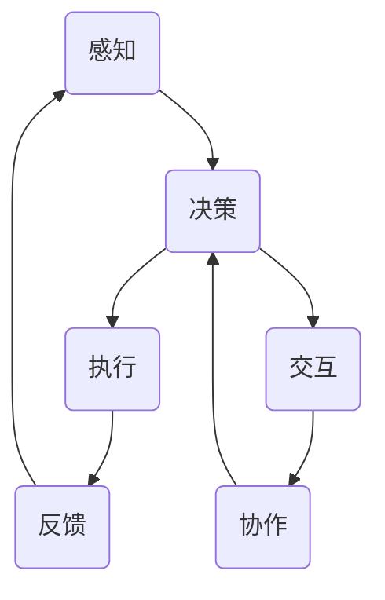

                 

关键词：AI Agent、大模型应用、计算机科学、人工智能、代理机制

摘要：本文将探讨AI Agent的概念、类型及其在现代计算机科学和人工智能领域的应用。通过深入分析AI Agent的工作原理和具体应用场景，我们希望能够为读者提供一个全面、系统的理解，并激发对这一领域的兴趣和深入研究。

## 1. 背景介绍

在人工智能的发展历程中，"Agent"这一概念逐渐成为研究焦点。它源于人工智能的早期研究，旨在实现计算机模拟人类的智能行为。Agent一词起源于拉丁语“ager”，意为土地或农场，后来引申为从事某项任务或活动的实体。在计算机科学领域，Agent通常指的是具有自主性、交互性和反应能力的智能体，能够在复杂环境中执行特定任务。

### 1.1 历史背景

AI Agent的概念最早可以追溯到20世纪50年代，当时人工智能的研究刚刚起步。最初的AI Agent主要是基于规则和逻辑推理的简单程序。随着计算机性能的提升和算法的进步，AI Agent逐渐变得更加复杂和智能化。到20世纪80年代，分布式智能和智能体系统的概念被提出，引发了AI Agent研究的热潮。

### 1.2 发展现状

目前，AI Agent已经广泛应用于各个领域，包括机器人、智能交通、智能家居、金融交易等。特别是在深度学习和大数据技术的推动下，AI Agent的能力得到了显著提升，能够处理更复杂的问题和更广泛的应用场景。

### 1.3 未来趋势

随着人工智能技术的不断进步，AI Agent在未来有望实现更多的应用，包括自主决策、自动化管理、智能交互等。同时，多智能体系统和混合智能体的研究也将成为热点，为解决复杂问题提供新的思路和解决方案。

## 2. 核心概念与联系

在深入探讨AI Agent之前，我们需要明确几个核心概念：自主性、交互性和反应能力。这些概念共同构成了AI Agent的基本特征。

### 2.1 自主性

自主性是AI Agent最核心的特征之一，它指的是Agent能够独立地做出决策和执行任务，而不需要外部干预。自主性来源于Agent内部的智能算法和决策模型，这些算法和模型可以根据环境信息和目标，自动调整行为和策略。

### 2.2 交互性

交互性是指AI Agent能够与其他智能体、人类或其他系统进行有效的通信和协作。在复杂的应用场景中，单智能体往往难以独立完成任务，需要与其他智能体协同工作。交互性使得AI Agent能够在一个更广阔的生态系统中发挥作用。

### 2.3 反应能力

反应能力是指AI Agent能够根据环境和任务的变化，实时调整自身的行为和策略。反应能力来源于Agent的感知和自适应机制，这使得AI Agent能够适应不断变化的环境，保持高效和稳定的运行。

### 2.4 Mermaid 流程图

下面是一个简化的AI Agent架构的Mermaid流程图，展示了Agent的自主性、交互性和反应能力的相互关系。



### 2.5 Agent与其他人工智能概念的对比

尽管AI Agent是人工智能研究的一个重要方向，但它与一些其他人工智能概念有所不同：

- **智能代理（Smart Agent）**：智能代理通常指的是拥有较高智能水平的AI Agent，能够执行更复杂的任务和决策。智能代理通常具备更强的学习能力、推理能力和知识表示能力。
- **自主智能体（Autonomous Agent）**：自主智能体是具备完全自主性、自主决策和自主执行的AI Agent。自主智能体可以完全独立于人类操作，自主完成复杂任务。
- **协作智能体（Cooperative Agent）**：协作智能体是指能够与其他智能体协作完成共同目标的AI Agent。协作智能体通常需要具备良好的交互能力和协作机制。

## 3. 核心算法原理 & 具体操作步骤

### 3.1 算法原理概述

AI Agent的核心算法通常是基于机器学习和深度学习技术，特别是强化学习（Reinforcement Learning，RL）。强化学习是一种通过试错和反馈来学习最优策略的机器学习技术。在强化学习框架下，AI Agent通过与环境的交互，不断调整自身的动作策略，以最大化长期回报。

### 3.2 算法步骤详解

- **初始化**：初始化Agent的状态、动作空间和奖励函数。
- **感知**：Agent接收环境状态信息。
- **决策**：Agent基于当前状态和已学习策略，选择最优动作。
- **执行**：Agent执行所选动作，并观察环境反馈。
- **更新**：根据执行结果，更新策略和知识库。

### 3.3 算法优缺点

**优点**：

- **自适应性强**：Agent能够根据环境变化自适应调整策略。
- **灵活性强**：Agent可以执行各种复杂任务，不受特定领域限制。
- **学习效率高**：强化学习算法通常具有较快的收敛速度。

**缺点**：

- **探索与利用的权衡**：在强化学习中，探索（尝试新动作）与利用（选择已知最优动作）之间的平衡是一个重要问题。
- **对数据依赖性高**：强化学习通常需要大量数据进行训练，以提高Agent的性能。

### 3.4 算法应用领域

- **机器人控制**：通过强化学习，机器人可以学习到如何在复杂环境中进行自主导航和任务执行。
- **自动驾驶**：自动驾驶汽车通过强化学习，可以学习到如何在不同的交通环境中安全行驶。
- **游戏AI**：在许多电子游戏中，AI玩家通过强化学习，可以学会如何与其他玩家进行对抗。

## 4. 数学模型和公式 & 详细讲解 & 举例说明

### 4.1 数学模型构建

在强化学习中，常用的数学模型是马尔可夫决策过程（Markov Decision Process，MDP）。MDP是一个五元组$(S, A, R, P, \gamma)$，其中：

- $S$：状态空间，表示Agent所处的环境状态。
- $A$：动作空间，表示Agent可以执行的动作。
- $R$：奖励函数，表示Agent执行某个动作后获得的即时奖励。
- $P$：状态转移概率矩阵，表示在当前状态下执行某个动作后，转移到下一个状态的概率。
- $\gamma$：折扣因子，表示未来奖励的重要性。

### 4.2 公式推导过程

在MDP中，Agent的目标是最大化期望回报。期望回报可以用以下公式表示：

$$
J(\theta) = E_{s}\[E_{a}\[R(s, a) + \gamma R(s', a')\|\ s, a\]
$$

其中，$\theta$表示策略参数，$E_s$和$E_a$分别表示状态和动作的期望。

为了求解最优策略，我们需要最大化期望回报。这是一个优化问题，可以使用梯度下降或其他优化算法进行求解。

### 4.3 案例分析与讲解

以经典的Atari游戏"Alexx"为例，我们使用深度确定性策略梯度（Deep Deterministic Policy Gradient，DDPG）算法训练一个AI Agent来玩这个游戏。

1. **数据预处理**：首先，我们需要将游戏帧转换为灰度图像，并缩放到固定大小。然后，对图像进行归一化处理，使其在[0, 1]范围内。
2. **网络架构**：我们使用卷积神经网络（Convolutional Neural Network，CNN）作为Actor网络，用于从状态中生成动作。同时，我们使用一个目标网络，用于评估策略的稳定性。
3. **训练过程**：在训练过程中，我们首先随机初始化Actor网络和目标网络。然后，通过环境进行交互，收集经验，并更新Actor网络和目标网络的参数。在更新过程中，我们需要解决目标网络和Actor网络之间的延迟问题，通常使用固定时间步长的方法进行更新。

## 5. 项目实践：代码实例和详细解释说明

### 5.1 开发环境搭建

首先，我们需要安装Python环境和相关库。以下是安装步骤：

1. 安装Python（建议使用3.8及以上版本）。
2. 安装TensorFlow库。
3. 安装OpenAI Gym库，用于模拟环境。

```bash
pip install tensorflow
pip install gym
```

### 5.2 源代码详细实现

以下是一个简单的DDPG算法实现，用于训练一个AI Agent玩"Alexx"游戏。

```python
import numpy as np
import tensorflow as tf
from gym import make

# 定义网络架构
class Actor(tf.keras.Model):
    # ...

class Critic(tf.keras.Model):
    # ...

# 初始化网络和优化器
actor = Actor()
critic = Critic()
actor_optimizer = tf.keras.optimizers.Adam(learning_rate=0.001)
critic_optimizer = tf.keras.optimizers.Adam(learning_rate=0.001)

# 训练过程
for episode in range(num_episodes):
    # 初始化环境
    env = make("Alexx-v0")
    # ...

    # 训练循环
    for step in range(max_steps):
        # 选择动作
        state = env.reset()
        action = actor(np.array([state]), training=True)
        # 执行动作
        next_state, reward, done, _ = env.step(action.numpy()[0])
        # 更新经验
        # ...
        # 更新网络参数
        # ...

    # 更新目标网络
    # ...

# 保存模型
actor.save("actor_model.h5")
critic.save("critic_model.h5")
```

### 5.3 代码解读与分析

在这个项目中，我们使用TensorFlow构建了Actor和Critic网络，并使用DDPG算法进行训练。主要步骤包括：

- **网络架构**：Actor网络负责从状态生成动作，Critic网络负责评估动作的价值。
- **优化器**：使用Adam优化器更新网络参数。
- **训练过程**：在每个训练循环中，我们首先初始化环境，然后通过Actor网络选择动作，执行动作并收集经验。然后，使用经验对网络进行更新，并定期更新目标网络。

### 5.4 运行结果展示

在训练过程中，我们记录了每一步的奖励和累计奖励。以下是一个简单的结果展示。

```python
import matplotlib.pyplot as plt

rewards = [episode_reward for episode_reward in episode_rewards]
plt.plot(rewards)
plt.xlabel("Episode")
plt.ylabel("Reward")
plt.title("Training Rewards")
plt.show()
```

## 6. 实际应用场景

AI Agent在各个领域都有广泛的应用，以下是几个典型应用场景：

- **智能客服**：AI Agent可以模拟人类客服，回答用户的问题，提供个性化服务。
- **金融交易**：AI Agent可以分析市场数据，制定交易策略，实现自动化交易。
- **智能推荐**：AI Agent可以根据用户行为和喜好，提供个性化推荐，提高用户体验。
- **自动驾驶**：AI Agent可以监控车辆状态和环境信息，实现自动驾驶功能。

## 7. 工具和资源推荐

### 7.1 学习资源推荐

- 《强化学习：原理与实战》：本书详细介绍了强化学习的基本原理和实战应用。
- 《深度学习》：这是一本经典的深度学习教材，涵盖了深度学习的基本概念和应用。
- 《人工智能：一种现代的方法》：这本书全面介绍了人工智能的理论和实践。

### 7.2 开发工具推荐

- TensorFlow：一个强大的开源深度学习框架，适合进行强化学习项目。
- OpenAI Gym：一个开源环境库，提供了多种基准环境和任务，适合进行强化学习研究。
- JAX：一个高性能的数值计算库，支持自动微分和强化学习算法的优化。

### 7.3 相关论文推荐

- “Deep Reinforcement Learning for Autonomous Navigation”：这篇论文介绍了一种基于深度强化学习的自主导航方法。
- “Distributed Reinforcement Learning in Cooperative Multi-Agent Systems”：这篇论文探讨了分布式强化学习在多智能体系统中的应用。
- “Human-Level Control Through Deep Reinforcement Learning”：这篇论文介绍了一种基于深度强化学习的自动驾驶系统。

## 8. 总结：未来发展趋势与挑战

### 8.1 研究成果总结

近年来，AI Agent领域取得了显著进展，特别是在深度学习和大数据技术的推动下。强化学习算法的提出和改进，使得AI Agent在复杂环境中表现出了出色的学习能力。同时，多智能体系统和混合智能体的研究，为解决复杂问题提供了新的思路和解决方案。

### 8.2 未来发展趋势

未来，AI Agent的发展将继续朝着智能化、自主化、协作化的方向迈进。具体来说：

- **智能化**：AI Agent将具备更高的智能水平，能够处理更复杂的问题。
- **自主化**：AI Agent将具备更强的自主决策能力，能够在复杂环境中自主执行任务。
- **协作化**：AI Agent将具备更好的协作能力，能够与其他智能体和人类协同工作，实现更高的效率和效果。

### 8.3 面临的挑战

尽管AI Agent取得了显著进展，但仍然面临一些挑战：

- **数据依赖性**：AI Agent的训练和优化需要大量数据支持，如何获取和处理数据是一个重要问题。
- **安全性和可靠性**：在复杂环境中，AI Agent的决策和行为需要确保安全性和可靠性，避免产生负面影响。
- **协作机制**：在多智能体系统中，如何设计有效的协作机制，实现智能体的协调和合作，是一个关键问题。

### 8.4 研究展望

未来，AI Agent领域的研究将集中在以下几个方面：

- **算法创新**：继续探索和研究新型强化学习算法，提高AI Agent的性能和适应性。
- **多智能体系统**：深入研究多智能体系统的协作机制和协同策略，实现更高效的智能体协同。
- **跨学科研究**：结合计算机科学、心理学、经济学等多学科知识，推动AI Agent的理论研究和应用发展。

## 9. 附录：常见问题与解答

### 9.1 何谓AI Agent？

AI Agent是指一种具有自主性、交互性和反应能力的智能体，能够在复杂环境中执行特定任务。

### 9.2 AI Agent的核心特征是什么？

AI Agent的核心特征包括自主性、交互性和反应能力。

### 9.3 AI Agent有哪些应用场景？

AI Agent广泛应用于智能客服、金融交易、智能推荐、自动驾驶等领域。

### 9.4 强化学习在AI Agent中如何应用？

强化学习是AI Agent的核心算法之一，用于训练Agent在复杂环境中进行自主决策和执行任务。

### 9.5 多智能体系统中的协作机制有哪些？

多智能体系统中的协作机制包括分布式决策、协调策略、通信机制等。

## 10. 作者署名

本文作者：禅与计算机程序设计艺术 / Zen and the Art of Computer Programming
----------------------------------------------------------------

以上就是关于“【大模型应用开发 动手做AI Agent】何谓Agent，为何Agent”的技术博客文章。希望这篇文章能够为读者提供对AI Agent的全面了解，并激发对这一领域的兴趣和深入研究。

