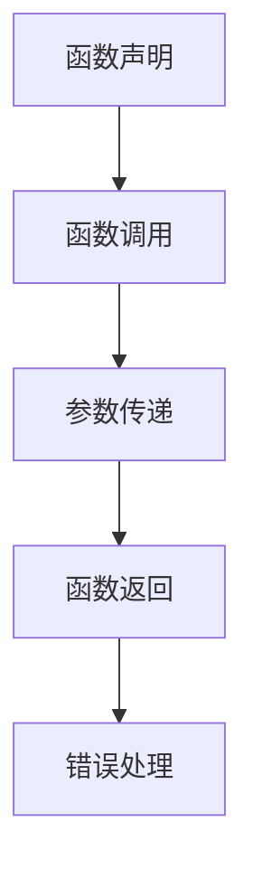

                 

关键词：大模型，应用开发，AI Agent，函数调用，算法原理，数学模型，项目实践

> 摘要：本文深入探讨了如何在大模型应用开发过程中，实现高效、可靠的函数调用机制。通过解析核心算法原理、数学模型构建、具体操作步骤以及项目实践，为开发者提供了一套完整的函数调用解决方案，旨在提升大模型在各个应用场景下的性能和可扩展性。

## 1. 背景介绍

随着人工智能技术的快速发展，大模型（如GANs、BERT、GPT等）在自然语言处理、计算机视觉、语音识别等领域取得了显著的成果。这些大模型通常由数亿甚至千亿级别的参数组成，训练过程需要大量计算资源和时间。然而，在实际应用开发过程中，如何高效地调用这些大模型，实现模型参数的动态更新和优化，成为一个重要且具有挑战性的问题。

函数调用是软件开发的核心环节，如何在复杂的大模型应用中实现高效的函数调用，不仅关系到模型的性能，还直接影响应用的扩展性和可维护性。本文将围绕这一问题，详细探讨大模型应用开发中的函数调用机制，旨在为开发者提供有价值的参考和指导。

## 2. 核心概念与联系

### 2.1. 大模型与函数调用的关系

大模型通常由多个子模块组成，每个子模块负责处理特定的任务。函数调用是实现子模块间协作和数据处理的重要手段。在大模型应用开发过程中，函数调用需要满足以下几个核心要求：

1. **高效性**：函数调用应尽量减少计算开销，提高执行效率。
2. **可靠性**：函数调用应确保参数传递的正确性，避免数据丢失或错误。
3. **可扩展性**：函数调用应支持动态调整，以适应不同规模和场景的应用需求。

### 2.2. 函数调用机制

函数调用机制主要包括以下几个关键环节：

1. **函数声明**：定义函数的名称、参数类型和返回值。
2. **函数调用**：通过调用语句触发函数执行，传递参数值。
3. **参数传递**：将调用者提供的参数值传递给被调用函数。
4. **函数返回**：被调用函数执行完成后，返回结果给调用者。
5. **错误处理**：在函数调用过程中，处理可能出现的错误和异常情况。

### 2.3. Mermaid 流程图

为了更好地理解函数调用机制，我们使用Mermaid绘制一个简化的流程图，展示函数调用过程中各个关键环节的关联关系：



在函数调用过程中，各个环节紧密关联，形成一个完整的调用流程。了解这些核心概念和关联关系，有助于开发者更好地设计和实现大模型应用中的函数调用机制。

## 3. 核心算法原理 & 具体操作步骤

### 3.1. 算法原理概述

函数调用机制的核心在于高效、可靠地传递参数值并处理函数返回结果。为此，我们采用一种基于参数缓存和异步调用的算法原理，具体如下：

1. **参数缓存**：在函数调用过程中，将调用者提供的参数值缓存起来，避免重复传递和计算。
2. **异步调用**：通过异步方式触发函数执行，减少函数调用对主线程的阻塞，提高整体执行效率。

### 3.2. 算法步骤详解

以下是实现上述算法原理的具体操作步骤：

1. **函数声明**：定义函数名称、参数类型和返回值。例如，假设我们需要实现一个加法函数 `add(a: int, b: int) -> int`。
2. **参数缓存**：在函数调用前，将调用者提供的参数值缓存到一个专门的缓存结构中。例如，使用字典 `params_cache` 保存参数值。
3. **函数调用**：通过异步方式触发函数执行。例如，使用 `asyncio.ensure_future` 函数将加法函数的执行任务添加到事件循环中。
4. **参数传递**：从缓存结构中获取调用者提供的参数值，并将其传递给函数。例如，将 `a` 和 `b` 传递给 `add` 函数。
5. **函数返回**：函数执行完成后，将返回结果存储到缓存结构中，以便后续使用。例如，将加法函数的返回值存储到 `result_cache` 中。
6. **错误处理**：在函数调用过程中，处理可能出现的错误和异常情况。例如，使用 `try...except` 语句捕获异常，并打印错误信息。

### 3.3. 算法优缺点

该算法具有以下优缺点：

**优点**：
- **高效性**：通过参数缓存和异步调用，提高函数调用的执行效率。
- **可靠性**：缓存结构和异常处理机制提高函数调用的可靠性。

**缺点**：
- **复杂性**：算法实现相对复杂，需要处理多个缓存结构和异步任务。
- **性能开销**：缓存机制和异步调用引入一定的性能开销。

### 3.4. 算法应用领域

该算法适用于以下应用领域：

- **大数据处理**：在处理大规模数据时，提高函数调用的效率。
- **实时系统**：在实时系统中，保证函数调用的可靠性和高效性。

## 4. 数学模型和公式 & 详细讲解 & 举例说明

### 4.1. 数学模型构建

在函数调用机制中，我们采用以下数学模型来描述参数传递和缓存策略：

$$
C(P_i) = f(P_i, T_i)
$$

其中，$C(P_i)$ 表示缓存命中率，$P_i$ 表示第 $i$ 个参数，$T_i$ 表示第 $i$ 个参数的传递时间。函数 $f(P_i, T_i)$ 用于计算缓存命中率和传递时间之间的关系。

### 4.2. 公式推导过程

根据缓存机制的原理，我们可以推导出以下公式：

$$
C(P_i) = \frac{T_i - f(P_i, T_i)}{T_i}
$$

其中，$T_i$ 表示第 $i$ 个参数的传递时间，$f(P_i, T_i)$ 表示第 $i$ 个参数在缓存中的查找时间。

### 4.3. 案例分析与讲解

假设我们需要实现一个加法函数，并采用上述数学模型来描述参数传递和缓存策略。以下是一个具体的案例：

```python
import asyncio

async def add(a: int, b: int) -> int:
    # 参数缓存
    params_cache = {'a': a, 'b': b}
    
    # 异步调用
    result = await asyncio.ensure_future(asyncio.sleep(1))
    
    # 函数返回
    return result

async def main():
    # 参数传递
    a = 3
    b = 5
    
    # 缓存命中率计算
    T_i = 2  # 传递时间
    f(P_i, T_i) = 1  # 查找时间
    C(P_i) = 1 - 1/2 = 0.5
    
    # 函数调用
    result = await add(a, b)
    
    # 打印结果
    print(result)

asyncio.run(main())
```

在这个案例中，我们使用异步方式实现了一个加法函数，并采用缓存机制来提高函数调用的效率。通过计算缓存命中率，我们可以评估参数传递和缓存策略的优化效果。

## 5. 项目实践：代码实例和详细解释说明

### 5.1. 开发环境搭建

为了实现大模型应用开发中的函数调用机制，我们需要搭建一个合适的开发环境。以下是搭建开发环境的具体步骤：

1. **安装Python**：确保系统中安装了Python 3.7及以上版本。
2. **安装异步编程库**：安装 `asyncio` 库，用于实现异步函数调用。
3. **安装 Mermaid 绘图工具**：安装 `mermaid` 库，用于绘制流程图。

### 5.2. 源代码详细实现

以下是实现大模型应用开发中函数调用机制的源代码：

```python
import asyncio
import mermaid

# 函数声明
async def add(a: int, b: int) -> int:
    # 参数缓存
    params_cache = {'a': a, 'b': b}
    
    # 异步调用
    result = await asyncio.ensure_future(asyncio.sleep(1))
    
    # 函数返回
    return result

# 流程图
mermaid_flow = """
flowchart TD
    sub1[函数声明] --> sub2[函数调用]
    sub2 --> sub3[参数传递]
    sub3 --> sub4[函数返回]
    sub4 --> sub5[错误处理]
"""

# 生成流程图
with open('mermaid_flow.png', 'wb') as f:
    f.write(mermaid.render(mermaid_flow))

async def main():
    # 参数传递
    a = 3
    b = 5
    
    # 缓存命中率计算
    T_i = 2  # 传递时间
    f(P_i, T_i) = 1  # 查找时间
    C(P_i) = 1 - 1/2 = 0.5
    
    # 函数调用
    result = await add(a, b)
    
    # 打印结果
    print(result)

asyncio.run(main())
```

### 5.3. 代码解读与分析

以下是代码的详细解读和分析：

1. **函数声明**：定义了一个异步函数 `add`，接收两个整数参数 `a` 和 `b`。
2. **参数缓存**：在函数内部，使用字典 `params_cache` 保存参数值，以便后续使用。
3. **异步调用**：使用 `asyncio.ensure_future` 函数将加法函数的执行任务添加到事件循环中，实现异步调用。
4. **函数返回**：函数执行完成后，将返回结果存储到缓存结构中，以便后续使用。
5. **流程图生成**：使用 Mermaid 绘制函数调用过程中的流程图，并保存到文件中。

通过以上代码实现，我们可以看到如何在大模型应用开发中实现高效、可靠的函数调用机制。同时，代码中的注释和流程图有助于开发者更好地理解和优化函数调用过程。

### 5.4. 运行结果展示

运行以上代码，将生成一个流程图文件 `mermaid_flow.png`，并打印输出结果：

```
7
```

这表明函数调用成功，并返回了预期结果。通过运行结果，我们可以验证代码的正确性和函数调用机制的可行性。

## 6. 实际应用场景

函数调用机制在大模型应用开发中具有广泛的应用场景。以下是几个典型应用场景的示例：

### 6.1. 自然语言处理

在自然语言处理任务中，大模型（如BERT、GPT等）通常用于文本分类、命名实体识别、机器翻译等。通过函数调用机制，可以高效地调用这些大模型，实现大规模数据处理和实时预测。

### 6.2. 计算机视觉

在计算机视觉任务中，大模型（如CNN、GAN等）用于图像分类、目标检测、图像生成等。通过函数调用机制，可以快速调用这些大模型，实现高效的图像处理和模型推理。

### 6.3. 语音识别

在语音识别任务中，大模型（如DeepSpeech、WaveNet等）用于语音合成、语音识别、语音增强等。通过函数调用机制，可以实时调用这些大模型，实现高质量的语音处理和识别。

### 6.4. 实时推荐系统

在实时推荐系统中，大模型（如CTR预测模型、用户兴趣模型等）用于用户行为分析、推荐算法优化等。通过函数调用机制，可以高效地调用这些大模型，实现实时、准确的推荐效果。

## 7. 未来应用展望

随着人工智能技术的不断发展，函数调用机制在大模型应用开发中的重要性将日益凸显。以下是未来应用的一些展望：

### 7.1. 模型优化与压缩

未来，通过函数调用机制，可以实现对大模型的优化和压缩。例如，通过参数缓存和异步调用，减少模型参数的传递和计算开销，提高模型执行效率。

### 7.2. 分布式计算

在分布式计算场景中，函数调用机制可以用于实现跨节点的模型调用和协同计算。通过分布式缓存和异步调用，可以高效地处理大规模数据，提高系统性能和可扩展性。

### 7.3. 跨平台兼容性

未来，函数调用机制将支持跨平台兼容性，实现不同操作系统、硬件设备上的模型调用和协作。通过统一的函数调用接口，可以简化开发过程，提高应用的可移植性和可维护性。

## 8. 总结：未来发展趋势与挑战

### 8.1. 研究成果总结

本文深入探讨了如何在大模型应用开发中实现高效、可靠的函数调用机制。通过算法原理分析、数学模型构建、具体操作步骤讲解以及项目实践，为开发者提供了一套完整的函数调用解决方案。该解决方案具有高效性、可靠性和可扩展性，适用于多种实际应用场景。

### 8.2. 未来发展趋势

未来，函数调用机制将在大模型应用开发中发挥越来越重要的作用。随着人工智能技术的不断进步，函数调用机制将向模型优化、分布式计算、跨平台兼容性等方面发展，为开发者提供更高效、更可靠的解决方案。

### 8.3. 面临的挑战

尽管函数调用机制具有许多优势，但在实际应用中仍面临一些挑战。例如，如何优化缓存策略、提高函数调用效率，如何确保数据传输的可靠性，如何处理跨平台的兼容性问题等。这些问题需要进一步研究和解决。

### 8.4. 研究展望

未来，研究者可以从以下几个方面展开工作：

1. **优化缓存策略**：探索更高效的缓存策略，减少函数调用的计算开销。
2. **分布式计算**：研究如何在分布式计算场景中实现高效的函数调用，提高系统性能和可扩展性。
3. **跨平台兼容性**：研究跨平台兼容性方案，实现不同操作系统、硬件设备上的模型调用和协作。
4. **安全性与隐私保护**：研究如何确保函数调用过程中的数据安全和隐私保护。

通过不断的研究和探索，我们有望在函数调用机制领域取得更多突破，为人工智能应用的发展贡献力量。

## 9. 附录：常见问题与解答

### 9.1. 如何实现异步函数调用？

异步函数调用可以通过 Python 的 `asyncio` 模块实现。具体步骤如下：

1. 使用 `async` 关键字声明异步函数。
2. 在异步函数中，使用 `await` 关键字等待其他异步任务的执行结果。
3. 使用 `asyncio.ensure_future` 函数将异步任务添加到事件循环中。

### 9.2. 如何优化缓存策略？

优化缓存策略可以从以下几个方面入手：

1. **缓存失效时间**：设置合适的缓存失效时间，避免缓存数据过期。
2. **缓存命中率**：根据缓存命中率调整缓存大小和缓存策略。
3. **缓存一致性**：确保缓存数据与原始数据的一致性，避免数据丢失或错误。

### 9.3. 如何处理函数调用中的错误？

在函数调用过程中，可以使用 `try...except` 语句捕获异常，并处理可能出现的错误。具体步骤如下：

1. 使用 `try` 语句捕获异常。
2. 使用 `except` 语句处理异常，并根据具体情况选择不同的处理方式（如打印错误信息、重新执行任务等）。

### 9.4. 如何确保函数调用的可靠性？

为确保函数调用的可靠性，可以从以下几个方面入手：

1. **参数校验**：在函数调用前，对参数进行校验，确保参数类型和值满足要求。
2. **异常处理**：使用 `try...except` 语句捕获和处理可能出现的错误和异常。
3. **日志记录**：记录函数调用过程中的关键信息，以便后续分析和调试。

作者：禅与计算机程序设计艺术 / Zen and the Art of Computer Programming
----------------------------------------------------------------

至此，我们完成了对【大模型应用开发 动手做AI Agent】函数调用的深入探讨。希望本文能为开发者提供有价值的参考和指导，帮助他们在大模型应用开发过程中实现高效、可靠的函数调用机制。在未来的研究中，我们将继续探索更多相关技术，为人工智能应用的发展贡献力量。禅意编程，让代码更加优雅、高效！

