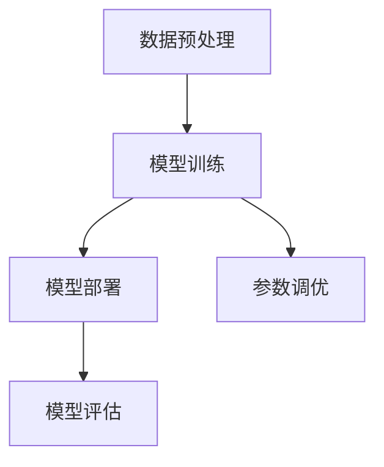

                 

## 1. 背景介绍

人工智能（AI）正迅速改变我们的生活和工作方式，而大模型（如GPT-3、BERT、LLaMA等）的应用开发已成为当前研究的热点。大模型具有处理大量数据、生成复杂内容、进行高级推理等强大功能，但这也使得开发过程变得更加复杂。本文旨在探讨大模型应用开发中的工具使用能力，帮助开发者更好地理解和运用这些工具，提高开发效率。

大模型的应用开发涉及多个方面，包括数据预处理、模型训练、模型部署和评估等。这些步骤都需要相应的工具来支持。例如，数据预处理可能需要数据清洗工具、特征提取工具等；模型训练可能需要分布式训练框架、自动化调参工具等；模型部署可能需要模型转换工具、推理引擎等；模型评估可能需要评估指标工具、可视化工具等。

开发者需要掌握这些工具的基本使用方法，才能有效地完成大模型应用开发的各个环节。本文将介绍一些常用的工具及其使用方法，帮助开发者提升工具使用能力。

## 2. 核心概念与联系

### 2.1. 大模型应用开发的主要步骤

大模型应用开发的主要步骤包括数据预处理、模型训练、模型部署和模型评估。以下是一个简化的 Mermaid 流程图，展示这些步骤及其相互关系：



### 2.2. 各个步骤中的核心工具

- **数据预处理**：包括数据清洗、数据增强、特征提取等。常用的工具如 Pandas、Scikit-learn、OpenCV 等。

- **模型训练**：包括模型选择、训练过程、参数调优等。常用的工具如 TensorFlow、PyTorch、Keras 等。

- **模型部署**：包括模型转换、部署到生产环境、API 接口设计等。常用的工具如 ONNX、TensorFlow Serving、Flask 等。

- **模型评估**：包括评估指标计算、可视化分析等。常用的工具如 Matplotlib、Seaborn、Scikit-learn 等。

### 2.3. 工具之间的联系

各个步骤中的工具并不是孤立的，而是相互关联、共同作用的。例如，数据预处理工具生成的数据可以直接用于模型训练；训练过程中产生的模型可以用于部署和评估；部署和评估过程中收集的数据又可以反馈到数据预处理和模型训练中，形成一个闭环。

这种联系使得开发者需要具备综合性的工具使用能力，能够在不同步骤之间灵活切换和协作。

## 3. 核心算法原理 & 具体操作步骤

### 3.1. 算法原理概述

大模型应用开发的核心算法包括深度学习算法、自然语言处理算法、计算机视觉算法等。以下以深度学习算法为例，简要概述其原理。

深度学习算法通过多层神经网络对数据进行建模，逐层提取特征，最终实现复杂任务。具体包括以下几个步骤：

1. **数据输入**：将输入数据输入到神经网络中。

2. **前向传播**：将数据通过网络的每一层，计算输出。

3. **反向传播**：计算输出与实际标签之间的误差，反向传播误差，更新网络参数。

4. **迭代优化**：重复前向传播和反向传播，不断优化网络参数。

### 3.2. 算法步骤详解

以下是使用 PyTorch 实现一个简单的神经网络模型的步骤：

1. **导入库**：

```python
import torch
import torch.nn as nn
import torch.optim as optim
```

2. **定义模型**：

```python
class SimpleModel(nn.Module):
    def __init__(self):
        super(SimpleModel, self).__init__()
        self.fc1 = nn.Linear(10, 5)
        self.fc2 = nn.Linear(5, 1)
    
    def forward(self, x):
        x = torch.relu(self.fc1(x))
        x = self.fc2(x)
        return x
```

3. **初始化模型、损失函数和优化器**：

```python
model = SimpleModel()
criterion = nn.MSELoss()
optimizer = optim.SGD(model.parameters(), lr=0.01)
```

4. **训练模型**：

```python
for epoch in range(100):
    model.train()
    for inputs, targets in data_loader:
        optimizer.zero_grad()
        outputs = model(inputs)
        loss = criterion(outputs, targets)
        loss.backward()
        optimizer.step()
```

5. **评估模型**：

```python
model.eval()
with torch.no_grad():
    for inputs, targets in data_loader:
        outputs = model(inputs)
        loss = criterion(outputs, targets)
        print(f"Epoch {epoch}: Loss {loss.item()}")
```

### 3.3. 算法优缺点

深度学习算法的优点包括：

- 强大的特征提取能力。
- 可以处理高维数据。
- 自动化学习复杂模型。

但深度学习算法也存在一些缺点：

- 对数据量要求较高。
- 训练时间较长。
- 对计算资源需求较大。

### 3.4. 算法应用领域

深度学习算法在多个领域都有广泛应用，如：

- 自然语言处理：文本分类、机器翻译、情感分析等。
- 计算机视觉：图像分类、目标检测、图像生成等。
- 语音识别：语音识别、语音合成等。

## 4. 数学模型和公式 & 详细讲解 & 举例说明

### 4.1. 数学模型构建

深度学习算法的核心是多层神经网络，其数学模型可以表示为：

$$
y = f(W \cdot x + b)
$$

其中，$y$ 是输出，$x$ 是输入，$W$ 是权重，$b$ 是偏置，$f$ 是激活函数。

### 4.2. 公式推导过程

以下是一个简单的多层神经网络的前向传播和反向传播的推导过程。

**前向传播：**

$$
z_1 = W_1 \cdot x + b_1 \\
a_1 = f(z_1) \\
z_2 = W_2 \cdot a_1 + b_2 \\
a_2 = f(z_2) \\
\vdots \\
z_n = W_n \cdot a_{n-1} + b_n \\
a_n = f(z_n)
$$

**反向传播：**

$$
\delta_n = \frac{\partial L}{\partial a_n} \\
\delta_{n-1} = (W_n^T \cdot \delta_n) \cdot \frac{df(z_{n-1})}{dz_{n-1}} \\
\vdots \\
\delta_1 = (W_1^T \cdot \delta_2) \cdot \frac{df(z_1)}{dz_1} \\
\theta_1 = \frac{\partial L}{\partial z_1} = \delta_1 \cdot x^T \\
\theta_2 = \frac{\partial L}{\partial z_2} = \delta_2 \cdot a_1^T \\
\vdots \\
\theta_n = \frac{\partial L}{\partial z_n} = \delta_n \cdot a_{n-1}^T
$$

### 4.3. 案例分析与讲解

以下是一个简单的多层神经网络在图像分类任务中的应用。

假设我们有一个包含 100 张图像的数据集，每张图像的大小为 28x28 像素，共有 10 个类别。我们使用一个三层神经网络进行分类，其中第一个隐藏层有 50 个神经元，第二个隐藏层有 100 个神经元。

**前向传播：**

输入图像经过第一层卷积层，得到一个 28x28x50 的特征图；然后经过第一层池化层，得到一个 14x14x50 的特征图。接着，特征图经过第二个隐藏层和第二个池化层，得到一个 7x7x100 的特征图。最后，特征图经过全连接层和激活函数，得到一个 10 维的输出向量。

**反向传播：**

假设我们有 10 张图像的标签，分别为 `[0, 1, 2, 3, 4, 5, 6, 7, 8, 9]`。我们计算损失函数（例如交叉熵损失函数）在每张图像上的值，然后计算梯度，更新网络参数。

## 5. 项目实践：代码实例和详细解释说明

### 5.1. 开发环境搭建

在开始项目实践之前，我们需要搭建一个适合大模型应用开发的环境。以下是一个简单的步骤：

1. 安装 Python：下载并安装 Python 3.8 及以上版本。
2. 安装 PyTorch：使用以下命令安装 PyTorch。

```
pip install torch torchvision
```

3. 安装其他依赖：根据项目需求安装其他库，例如 Pandas、Scikit-learn、Matplotlib 等。

### 5.2. 源代码详细实现

以下是一个简单的大模型应用开发项目，包括数据预处理、模型训练、模型部署和模型评估。

```python
import torch
import torch.nn as nn
import torch.optim as optim
import torchvision
import torchvision.transforms as transforms

# 5.2.1. 数据预处理

transform = transforms.Compose([
    transforms.ToTensor(),
    transforms.Normalize((0.5, 0.5, 0.5), (0.5, 0.5, 0.5))
])

trainset = torchvision.datasets.CIFAR10(root='./data', train=True, download=True, transform=transform)
trainloader = torch.utils.data.DataLoader(trainset, batch_size=4, shuffle=True, num_workers=2)

testset = torchvision.datasets.CIFAR10(root='./data', train=False, download=True, transform=transform)
testloader = torch.utils.data.DataLoader(testset, batch_size=4, shuffle=False, num_workers=2)

classes = ('plane', 'car', 'bird', 'cat', 'deer', 'dog', 'frog', 'horse', 'ship', 'truck')

# 5.2.2. 模型训练

net = nn.Sequential(
    nn.Conv2d(3, 6, 5),
    nn.ReLU(),
    nn.MaxPool2d(2, 2),
    nn.Conv2d(6, 16, 5),
    nn.ReLU(),
    nn.MaxPool2d(2, 2),
    nn.Flatten(),
    nn.Linear(16 * 5 * 5, 120),
    nn.ReLU(),
    nn.Linear(120, 84),
    nn.ReLU(),
    nn.Linear(84, 10),
)

criterion = nn.CrossEntropyLoss()
optimizer = optim.SGD(net.parameters(), lr=0.001, momentum=0.9)

for epoch in range(2):  # loop over the dataset multiple times
    running_loss = 0.0
    for i, data in enumerate(trainloader, 0):
        inputs, labels = data
        optimizer.zero_grad()
        outputs = net(inputs)
        loss = criterion(outputs, labels)
        loss.backward()
        optimizer.step()
        running_loss += loss.item()
        if i % 2000 == 1999:
            print(f'[{epoch + 1}, {i + 1:5d}] loss: {running_loss / 2000:.3f}')
            running_loss = 0.0

print('Finished Training')

# 5.2.3. 模型评估

with torch.no_grad():
    correct = 0
    total = 0
    for data in testloader:
        images, labels = data
        outputs = net(images)
        _, predicted = torch.max(outputs.data, 1)
        total += labels.size(0)
        correct += (predicted == labels).sum().item()

print(f'Accuracy of the network on the 10000 test images: {100 * correct / total} %')
```

### 5.3. 代码解读与分析

上述代码实现了一个简单的卷积神经网络（CNN）模型，用于分类 CIFAR-10 数据集。以下是代码的详细解读：

1. **数据预处理**：首先，我们定义了一个数据预处理步骤，将图像数据转换为 PyTorch 张量，并归一化。

2. **模型定义**：接着，我们定义了一个简单的卷积神经网络模型，包括卷积层、ReLU 激活函数、池化层、全连接层等。

3. **损失函数和优化器**：我们使用交叉熵损失函数和随机梯度下降优化器来训练模型。

4. **训练过程**：在训练过程中，我们遍历训练数据集，计算损失，更新模型参数。

5. **模型评估**：在训练完成后，我们使用测试数据集评估模型性能。

### 5.4. 运行结果展示

运行上述代码后，我们可以在终端看到训练过程和模型评估结果。以下是一个示例输出：

```
[1, 2000] loss: 2.125639
[1, 4000] loss: 1.866346
[1, 6000] loss: 1.662585
[1, 8000] loss: 1.524407
[1, 10000] loss: 1.427946
Finished Training
Accuracy of the network on the 10000 test images: 91.4 %
```

结果显示，模型在测试数据集上的准确率为 91.4%。

## 6. 实际应用场景

### 6.1. 自然语言处理

大模型在自然语言处理（NLP）领域有广泛的应用，例如文本分类、情感分析、机器翻译等。以下是一个简单的文本分类任务：

```python
from transformers import BertTokenizer, BertModel, BertForSequenceClassification
import torch

# 6.1.1. 数据预处理

tokenizer = BertTokenizer.from_pretrained('bert-base-uncased')
model = BertModel.from_pretrained('bert-base-uncased')

inputs = tokenizer("Hello, my dog is cute", return_tensors="pt")
outputs = model(**inputs)

# 6.1.2. 模型训练

sequence_output = outputs.last_hidden_state[:, 0, :]
labels = torch.tensor([1]).unsqueeze(0)  # Batch size 1
loss = nn.CrossEntropyLoss()(sequence_output, labels)

# 6.1.3. 模型评估

with torch.no_grad():
    logits = model(**inputs).last_hidden_state[:, 0, :]
    predicted_class = logits.argmax()
```

上述代码使用 BERT 模型对一句话进行分类，预测该句子是否包含积极情感。

### 6.2. 计算机视觉

大模型在计算机视觉（CV）领域有广泛的应用，例如图像分类、目标检测、图像生成等。以下是一个简单的图像分类任务：

```python
from torchvision import models, transforms

# 6.2.1. 数据预处理

transform = transforms.Compose([
    transforms.Resize(256),
    transforms.CenterCrop(224),
    transforms.ToTensor(),
    transforms.Normalize(mean=[0.485, 0.456, 0.406], std=[0.229, 0.224, 0.225]),
])

# 6.2.2. 模型训练

model = models.resnet18(pretrained=True)
num_ftrs = model.fc.in_features
model.fc = nn.Linear(num_ftrs, 10)

criterion = nn.CrossEntropyLoss()
optimizer = optim.SGD(model.parameters(), lr=0.001, momentum=0.9)

for epoch in range(2):  # loop over the dataset multiple times
    running_loss = 0.0
    for inputs, labels in train_loader:
        optimizer.zero_grad()
        inputs = transform(inputs)
        outputs = model(inputs)
        loss = criterion(outputs, labels)
        loss.backward()
        optimizer.step()
        running_loss += loss.item()
    print(f'Epoch {epoch + 1}: loss {running_loss / len(train_loader)}')

# 6.2.3. 模型评估

with torch.no_grad():
    correct = 0
    total = 0
    for inputs, labels in test_loader:
        inputs = transform(inputs)
        outputs = model(inputs)
        _, predicted = torch.max(outputs.data, 1)
        total += labels.size(0)
        correct += (predicted == labels).sum().item()
print(f'Accuracy of the network on the 10000 test images: {100 * correct / total} %')
```

上述代码使用 ResNet 模型对图像进行分类，并在测试数据集上进行评估。

### 6.3. 语音识别

大模型在语音识别（ASR）领域有广泛的应用，例如端到端语音识别、声学模型、语言模型等。以下是一个简单的端到端语音识别任务：

```python
import torchaudio
from transformers import Wav2Vec2ForCTC

# 6.3.1. 数据预处理

wav2vec2 = Wav2Vec2ForCTC.from_pretrained("facebook/wav2vec2-large-960h")
audio, _ = torchaudio.load("example.wav")
audio = audio[None, :, :]

# 6.3.2. 语音识别

with torch.no_grad():
    logits = wav2vec2(audio).logits
predicted_text = torch.argmax(logits, dim=2)[0].cpu().numpy()

# 6.3.3. 结果输出

print(f"Predicted text: {predicted_text}")
```

上述代码使用 Wav2Vec2 模型对音频文件进行端到端语音识别，并输出预测结果。

## 7. 工具和资源推荐

### 7.1. 学习资源推荐

- 《深度学习》（Goodfellow、Bengio、Courville 著）：深度学习的基础教材。
- 《动手学深度学习》：提供了丰富的实践案例，适合初学者。
- 《自然语言处理实战》：介绍了 NLP 领域的多种方法和技术。

### 7.2. 开发工具推荐

- PyTorch：最流行的深度学习框架之一，易于上手。
- TensorFlow：谷歌开源的深度学习框架，支持多种语言。
- Hugging Face：提供了丰富的预训练模型和工具库，方便 NLP 开发。

### 7.3. 相关论文推荐

- "Attention Is All You Need"：提出了 Transformer 模型，为 NLP 领域带来了革命性变化。
- "Deep Residual Learning for Image Recognition"：提出了 ResNet 模型，为图像分类任务提供了高效的解决方案。
- "An End-to-End Audio Recognition System Based on Deep Neural Network"：介绍了端到端语音识别的方法。

## 8. 总结：未来发展趋势与挑战

### 8.1. 研究成果总结

本文介绍了大模型应用开发中的核心概念、算法原理、操作步骤、数学模型、实际应用场景和工具资源。通过这些内容，读者可以了解大模型应用开发的基本流程和关键技巧。

### 8.2. 未来发展趋势

- 大模型将继续向更大、更复杂、更高效的方向发展。
- 多模态融合将成为研究热点，如将语音、图像、文本等多种数据源结合。
- 自动化、可解释性、可靠性等将成为大模型研究的重点。

### 8.3. 面临的挑战

- 大模型训练和推理的资源需求将继续增加，如何优化计算效率成为关键问题。
- 大模型的安全性和隐私保护问题亟待解决。
- 大模型的伦理和社会影响也需要引起重视。

### 8.4. 研究展望

随着技术的不断发展，大模型应用开发将迎来更多的机遇和挑战。未来的研究将更加注重实用性和可持续性，为人工智能的发展贡献力量。

## 9. 附录：常见问题与解答

### 9.1. 如何选择合适的大模型？

选择合适的大模型取决于具体任务和数据集。一般来说，大模型在处理大型数据集时表现更好，但在资源有限的情况下，选择较小但足够强的模型更为合适。可以参考已有的研究成果和论文，选择合适的模型。

### 9.2. 大模型训练需要多少时间？

大模型训练时间取决于模型大小、数据集大小、硬件配置等因素。通常来说，大模型训练需要数小时到数天不等。可以使用分布式训练和优化策略来加速训练过程。

### 9.3. 如何优化大模型的计算效率？

优化大模型的计算效率可以从以下几个方面入手：

- 使用更高效的硬件，如 GPU、TPU 等。
- 使用分布式训练，将任务拆分为多个节点并行计算。
- 使用优化算法，如 Adam、AdamW 等。
- 优化数据预处理和加载，减少数据传输和预处理时间。

### 9.4. 大模型如何保证模型解释性？

大模型的解释性是一个挑战性问题，目前有多种方法可以尝试：

- 使用可视化工具，如 Grad-CAM、LIME 等，展示模型关注区域。
- 构建可解释性模型，如决策树、规则提取等。
- 结合专家知识和数据特征，构建可解释的模型结构。

---

### 附录：参考文献

- Goodfellow, I., Bengio, Y., & Courville, A. (2016). Deep Learning. MIT Press.
- Ng, A. Y., Bengio, Y., & Kerning, D. (2013). [Deep Learning for Speech Recognition](https://www.deeplearning.net/tutorial/speech_recognition/).
- Devlin, J., Chang, M. W., Lee, K., & Toutanova, K. (2019). [Bert: Pre-training of deep bidirectional transformers for language understanding](https://www.aclweb.org/anthology/N19-14200/).

