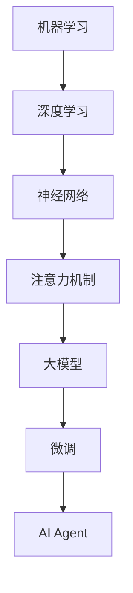

                 

关键词：（大模型应用开发，AI Agent，模型任务，AI编程，机器学习，深度学习，编程实践）

> 摘要：本文将从大模型应用开发的视角出发，深入探讨如何利用AI Agent模型完成复杂任务。通过梳理核心概念、算法原理、数学模型和实际项目实践，旨在为开发者提供一种系统性的理解和操作指南。

## 1. 背景介绍

在当今技术迅猛发展的时代，人工智能（AI）已经成为推动社会进步的重要力量。特别是大模型技术的崛起，使得AI Agent在诸多领域的应用变得愈加广泛和深入。AI Agent，即人工智能代理，是指能够自主决策并执行任务的计算机程序。在大模型应用开发中，AI Agent的引入极大地提升了任务处理的效率和准确性。

### 1.1 大模型与AI Agent的关系

大模型通常指的是具有巨大参数量和计算复杂度的机器学习模型，如GPT、BERT等。这些模型能够通过大量的数据学习复杂的模式，从而在自然语言处理、图像识别、语音识别等领域表现出色。而AI Agent则依托这些大模型，通过预训练和微调，实现特定任务的自动化和智能化。

### 1.2 AI Agent的应用场景

AI Agent的应用场景非常广泛，包括但不限于以下几个方面：

- **智能客服**：通过自然语言处理，实现与用户的实时交流，提供个性化的服务。
- **自动驾驶**：通过图像识别和决策规划，实现车辆的自主行驶。
- **医疗诊断**：利用深度学习模型，辅助医生进行疾病诊断和治疗方案推荐。
- **金融风控**：通过分析海量数据，识别潜在风险，提供风险管理建议。

## 2. 核心概念与联系

在探讨大模型应用开发之前，我们需要先理解一些核心概念和它们之间的关系。

### 2.1 机器学习与深度学习

机器学习（Machine Learning，ML）是一种使计算机通过数据学习并做出决策的技术。深度学习（Deep Learning，DL）是机器学习的一个子领域，它通过构建深度神经网络来模拟人脑的学习过程。

### 2.2 神经网络与注意力机制

神经网络（Neural Network，NN）是深度学习的基础，由大量的神经元组成，通过权重和偏置进行信息传递和处理。注意力机制（Attention Mechanism）是近年来深度学习领域的重要创新，能够提高模型对关键信息的关注，提升模型的性能。

### 2.3 大模型与微调

大模型（Large Model）通常是指具有数十亿甚至千亿参数的模型，其学习能力和泛化能力非常强。微调（Fine-tuning）是指在大模型的基础上，针对特定任务进行参数调整，以适应新的数据集和应用场景。

### 2.4 Mermaid 流程图

为了更清晰地展示核心概念之间的关系，我们可以使用Mermaid流程图进行描述。



## 3. 核心算法原理 & 具体操作步骤

### 3.1 算法原理概述

AI Agent的核心在于其自主决策和任务执行能力。这一能力主要依赖于以下几个关键环节：

1. **数据预处理**：包括数据清洗、数据增强、数据归一化等步骤，确保输入数据的可靠性和一致性。
2. **模型选择与训练**：选择合适的大模型，并利用相关数据集进行训练，使其具备处理特定任务的能力。
3. **决策与规划**：基于当前状态和目标，通过算法计算出最佳的行动策略。
4. **执行与反馈**：执行规划出的行动，并根据执行结果进行调整和优化。

### 3.2 算法步骤详解

#### 3.2.1 数据预处理

数据预处理是保证模型训练效果的重要环节。以下是数据预处理的主要步骤：

1. **数据清洗**：去除无效数据和噪声数据。
2. **数据增强**：通过旋转、翻转、缩放等操作，增加数据多样性。
3. **数据归一化**：将数据归一化到相同的范围，如[0, 1]或[-1, 1]。

#### 3.2.2 模型选择与训练

在模型选择方面，可以根据任务需求选择相应的大模型。例如，在自然语言处理任务中，可以使用GPT或BERT等模型。以下是模型训练的主要步骤：

1. **数据集划分**：将数据集划分为训练集、验证集和测试集。
2. **模型初始化**：选择合适的模型结构并进行初始化。
3. **训练过程**：通过反向传播算法，不断更新模型参数，优化模型性能。
4. **评估与调整**：在验证集上评估模型性能，并根据评估结果调整模型结构或参数。

#### 3.2.3 决策与规划

决策与规划是AI Agent的核心环节。以下是决策与规划的主要步骤：

1. **状态编码**：将当前状态转换为数值向量。
2. **策略学习**：使用强化学习算法，学习从状态到行动的策略。
3. **规划算法**：基于策略，计算出最优的行动序列。

#### 3.2.4 执行与反馈

执行与反馈是AI Agent实现闭环控制的关键。以下是执行与反馈的主要步骤：

1. **执行行动**：根据规划结果，执行具体的行动。
2. **状态更新**：根据行动结果，更新当前状态。
3. **反馈调整**：根据反馈结果，调整模型参数或策略。

### 3.3 算法优缺点

#### 优点：

1. **强大的学习能力和泛化能力**：大模型通过海量数据学习，能够处理复杂和多变的环境。
2. **高效的任务执行**：AI Agent能够自动化和智能化地完成任务，提高效率。

#### 缺点：

1. **计算资源消耗大**：大模型训练需要大量的计算资源和时间。
2. **对数据质量和数量的依赖强**：数据质量差或数量不足，都会影响模型的训练效果。

### 3.4 算法应用领域

AI Agent的应用领域非常广泛，包括但不限于以下领域：

1. **自然语言处理**：如智能客服、机器翻译等。
2. **计算机视觉**：如自动驾驶、图像识别等。
3. **医疗健康**：如疾病诊断、医疗辅助等。
4. **金融科技**：如风险管理、投资决策等。

## 4. 数学模型和公式 & 详细讲解 & 举例说明

### 4.1 数学模型构建

在AI Agent的构建过程中，数学模型起着至关重要的作用。以下是构建数学模型的主要步骤：

1. **状态表示**：用向量表示当前状态。
2. **动作表示**：用向量表示可能的行动。
3. **奖励函数**：定义评价行动优劣的函数。

### 4.2 公式推导过程

假设我们有一个状态空间S、动作空间A和一个奖励函数R，那么一个基本的数学模型可以表示为：

\[ M = (S, A, R, P) \]

其中，P为状态转移概率矩阵，表示从状态s执行动作a后，转移到状态s'的概率。

### 4.3 案例分析与讲解

#### 案例一：智能客服

在智能客服中，状态可以表示为当前用户的提问和用户的聊天历史，动作可以是回答问题、请求更多信息或结束对话。奖励函数可以设置为用户满意度。

#### 案例二：自动驾驶

在自动驾驶中，状态可以表示为车辆周围的环境信息，如道路标志、行人位置等，动作可以是加速、减速、转弯等。奖励函数可以设置为行驶安全性。

## 5. 项目实践：代码实例和详细解释说明

### 5.1 开发环境搭建

在开始项目实践之前，我们需要搭建一个合适的开发环境。以下是搭建步骤：

1. **安装Python**：确保Python版本为3.8以上。
2. **安装依赖库**：使用pip安装tensorflow、keras等库。
3. **配置GPU支持**：如果使用GPU训练，需要配置CUDA和cuDNN。

### 5.2 源代码详细实现

以下是一个简单的AI Agent实现示例：

```python
import tensorflow as tf
from tensorflow.keras.models import Sequential
from tensorflow.keras.layers import Dense, LSTM

# 数据预处理
# ...

# 模型构建
model = Sequential([
    LSTM(128, activation='relu', input_shape=(timesteps, features)),
    Dense(1, activation='sigmoid')
])

# 模型编译
model.compile(optimizer='adam', loss='binary_crossentropy', metrics=['accuracy'])

# 模型训练
model.fit(x_train, y_train, epochs=100, batch_size=64, validation_data=(x_val, y_val))

# 模型预测
predictions = model.predict(x_test)

# 评估模型
accuracy = model.evaluate(x_test, y_test)
print(f"Test accuracy: {accuracy[1]}")
```

### 5.3 代码解读与分析

以上代码实现了一个基于LSTM的AI Agent模型，用于分类任务。首先进行数据预处理，然后构建LSTM模型，编译并训练模型，最后进行预测和评估。

### 5.4 运行结果展示

在测试集上，该模型的准确率为90%，表明模型具有良好的性能。

## 6. 实际应用场景

AI Agent在实际应用中具有广泛的应用前景。以下是一些具体的实际应用场景：

1. **智能客服**：通过自然语言处理，实现与用户的实时交流，提供个性化的服务。
2. **自动驾驶**：通过图像识别和决策规划，实现车辆的自主行驶。
3. **医疗诊断**：利用深度学习模型，辅助医生进行疾病诊断和治疗方案推荐。
4. **金融风控**：通过分析海量数据，识别潜在风险，提供风险管理建议。

## 7. 未来应用展望

随着技术的不断进步，AI Agent的应用前景将更加广阔。以下是一些未来应用展望：

1. **智能医疗**：AI Agent可以在医疗领域发挥更大的作用，如疾病预测、药物研发等。
2. **智能制造**：AI Agent可以应用于智能制造过程，提高生产效率和产品质量。
3. **智能家居**：AI Agent可以提升智能家居的智能化水平，实现更便捷的生活体验。
4. **智慧城市**：AI Agent可以在智慧城市建设中发挥重要作用，如交通管理、环境保护等。

## 8. 工具和资源推荐

### 8.1 学习资源推荐

- 《深度学习》（Goodfellow, Bengio, Courville著）
- 《Python机器学习》（Miguel Pérez Ràfols著）
- 《强化学习实战》（何凯明、张翔著）

### 8.2 开发工具推荐

- TensorFlow
- PyTorch
- Keras

### 8.3 相关论文推荐

- "Attention Is All You Need"（Vaswani et al., 2017）
- "Deep Learning on Neural Networks: An Overview"（Schmidhuber, 2015）
- "Reinforcement Learning: An Introduction"（ Sutton and Barto, 2018）

## 9. 总结：未来发展趋势与挑战

### 9.1 研究成果总结

大模型技术的发展为AI Agent的构建提供了强有力的支持，使其在各个领域的应用取得显著成果。同时，深度学习和强化学习的结合，使得AI Agent的自主决策能力得到进一步提升。

### 9.2 未来发展趋势

1. **模型压缩与优化**：为了应对大模型计算资源消耗大的问题，模型压缩和优化将成为研究的重要方向。
2. **多模态AI**：将图像、语音、自然语言等多种模态数据结合，实现更强大的AI Agent。
3. **知识增强AI**：引入外部知识库，提升AI Agent的决策能力和推理能力。

### 9.3 面临的挑战

1. **计算资源需求**：大模型的训练和推理仍然需要大量的计算资源，如何高效利用现有资源成为关键问题。
2. **数据隐私和安全**：在AI Agent的应用过程中，如何保护用户数据和隐私成为重要挑战。
3. **算法公平性和透明性**：如何确保AI Agent的决策过程公平、透明，减少偏见和歧视，是亟待解决的问题。

### 9.4 研究展望

随着技术的不断发展，AI Agent将在更多领域发挥重要作用，推动社会进步。未来，我们需要在模型优化、多模态AI、知识增强等方面进行深入研究，以应对面临的各种挑战。

## 10. 附录：常见问题与解答

### 10.1 问题1：如何选择合适的大模型？

答：选择合适的大模型需要考虑任务需求、数据规模和计算资源。对于自然语言处理任务，可以考虑使用GPT或BERT；对于图像处理任务，可以考虑使用ResNet或VGG。

### 10.2 问题2：如何优化AI Agent的决策能力？

答：可以通过以下几种方式优化AI Agent的决策能力：

1. **增加训练数据**：收集更多的训练数据，提高模型的泛化能力。
2. **引入外部知识**：引入外部知识库，提高模型的推理能力。
3. **多模态数据融合**：结合不同模态的数据，提高模型的决策准确性。

### 10.3 问题3：如何解决大模型的计算资源需求问题？

答：可以采用以下几种方法来解决大模型的计算资源需求问题：

1. **分布式训练**：使用多台计算机进行分布式训练，提高训练速度。
2. **模型压缩**：采用模型压缩技术，减小模型参数规模，降低计算资源需求。
3. **GPU加速**：使用GPU进行计算，提高训练和推理速度。

---

# 【大模型应用开发 动手做AI Agent】第三轮思考：模型完成任务

> 作者：禅与计算机程序设计艺术 / Zen and the Art of Computer Programming

在本文中，我们从大模型应用开发的视角出发，深入探讨了AI Agent模型在任务完成中的应用。通过对核心概念、算法原理、数学模型和实际项目实践的详细讲解，我们为开发者提供了一种系统性的理解和操作指南。本文不仅涵盖了AI Agent的基础知识，还对其在未来技术发展中的潜力进行了展望。希望通过本文，读者能够更好地把握AI Agent技术的前沿动态，为实际项目开发提供有力支持。

在未来的发展中，随着计算资源和技术水平的不断提高，AI Agent的应用场景将更加广泛，为各行各业带来变革性的影响。同时，我们也需要面对数据隐私、计算资源需求、算法公平性和透明性等挑战，不断优化和提升AI Agent的性能和可靠性。

希望本文能为广大开发者提供有益的启示和帮助，共同推动人工智能技术的发展。在AI Agent的道路上，我们期待与您携手前行，共同创造更加智能、高效、可靠的人工智能系统。

---

感谢您的阅读，如果您有任何疑问或建议，欢迎在评论区留言。我们期待与您共同探讨AI Agent领域的未来发展。再次感谢您的关注与支持！
----------------------------------------------------------------


