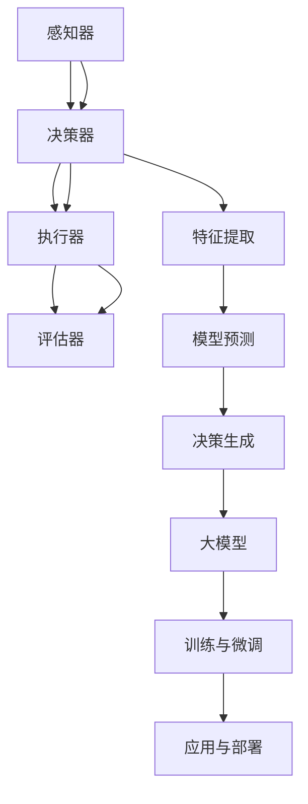

                 

在人工智能飞速发展的今天，大型模型的应用开发已经成为技术领域的热点。本文旨在为读者提供一份全面且实用的计划，帮助开发者动手实践构建自己的AI代理（AI Agent）。本文将详细探讨大模型应用开发的关键环节，包括核心概念的理解、算法原理的剖析、数学模型的构建、代码实例的讲解以及实际应用场景的探讨。通过本文，读者将能够获得构建AI代理的深入见解和实践经验。

## 关键词
- 大模型
- AI代理
- 应用开发
- 算法原理
- 数学模型
- 代码实例

## 摘要
本文将详细探讨大模型在AI代理应用开发中的关键技术和实践方法。首先，我们将介绍大模型和AI代理的基本概念，并分析其之间的联系。接着，我们将深入探讨大模型的算法原理，包括其构建、训练和应用流程。随后，我们将介绍数学模型和公式，通过案例分析和具体实例，帮助读者理解这些概念在实际开发中的应用。文章的后半部分将专注于代码实例的详细解释，并展示如何在实际项目中使用大模型构建AI代理。最后，我们将探讨AI代理的实际应用场景，并展望其未来的发展趋势和面临的挑战。

## 1. 背景介绍
随着深度学习技术的不断进步，大型神经网络模型如GPT、BERT、T5等在自然语言处理、图像识别、推荐系统等领域取得了显著的成果。这些模型的规模庞大，参数数量从数百万到数十亿不等，能够处理复杂的数据和任务。大模型的应用使得AI系统具备了更高的准确性和效率，但同时也带来了新的挑战。

AI代理是一种具有自主决策能力的智能体，能够在复杂环境中执行任务。传统的AI代理通常依赖于规则和有限的搜索算法，而现代的AI代理则通过深度学习和强化学习等先进技术，实现了更高的智能水平。随着大模型的普及，AI代理的应用范围得到了极大的扩展，从简单的客服机器人到复杂的自动驾驶系统，AI代理正在成为各行业数字化转型的重要驱动力。

### 1.1 大模型的起源与发展
大模型的起源可以追溯到20世纪80年代的神经网络研究。早期的神经网络由于计算资源和数据限制，模型规模较小，性能有限。随着计算能力的提升和大数据时代的到来，神经网络模型得到了快速发展。特别是2012年，AlexNet在ImageNet比赛中取得了突破性的成果，使得深度学习成为了人工智能领域的热门研究方向。

近年来，大模型的研究取得了显著的进展。Google的BERT模型通过预训练和微调技术，在多种自然语言处理任务中取得了优异的性能。OpenAI的GPT-3模型拥有超过1750亿个参数，成为目前最大的语言模型。这些大模型的成功应用，不仅提升了AI系统的智能化水平，也为未来的技术发展奠定了基础。

### 1.2 AI代理的发展与应用
AI代理的发展始于20世纪50年代，早期的代理系统主要依赖于规则和搜索算法。随着计算机性能的提升和AI技术的进步，AI代理逐渐采用了机器学习和深度学习技术，实现了更智能的决策和任务执行。

AI代理在多种场景中得到了广泛应用。在客服领域，AI代理可以模拟人类客服，提供24/7的服务，提高客户满意度。在金融领域，AI代理可以分析市场数据，提供投资建议，降低风险。在医疗领域，AI代理可以辅助医生进行诊断和治疗，提高医疗效率。随着AI代理技术的不断发展，其应用场景将越来越广泛。

### 1.3 大模型与AI代理的融合
大模型和AI代理的结合，为AI技术的发展带来了新的机遇。大模型强大的数据分析和处理能力，使得AI代理能够更好地理解和应对复杂环境。同时，AI代理的自主决策能力，也为大模型的应用提供了新的场景。

在自动驾驶领域，AI代理结合大模型，可以实现更精确的路线规划和行驶决策。在智能家居领域，AI代理结合大模型，可以提供更加个性化的服务和体验。在未来，随着大模型技术的不断成熟，AI代理的应用将更加广泛，为人类社会带来更多便利和创新。

## 2. 核心概念与联系

### 2.1 大模型

#### 2.1.1 定义
大模型是指具有数百万到数十亿参数的深度学习模型。这些模型通常采用大规模神经网络架构，能够在大规模数据集上进行预训练，并通过微调适应特定任务。

#### 2.1.2 架构
大模型通常由多个层次组成，包括输入层、隐藏层和输出层。隐藏层中包含大量神经元，用于特征提取和复杂函数计算。

#### 2.1.3 类型
大模型包括但不限于以下类型：
- 自然语言处理模型（如BERT、GPT）
- 图像识别模型（如ResNet、Inception）
- 强化学习模型（如DQN、PPO）

### 2.2 AI代理

#### 2.2.1 定义
AI代理是一种具有自主决策能力的智能体，能够在复杂环境中执行任务。AI代理通常采用机器学习和深度学习技术，通过学习环境和执行任务来提高性能。

#### 2.2.2 架构
AI代理的架构通常包括感知器、决策器、执行器和评估器。感知器收集环境信息，决策器根据感知信息生成决策，执行器执行决策，评估器评估决策效果。

#### 2.2.3 类型
AI代理包括但不限于以下类型：
- 基于规则的代理
- 强化学习代理
- 深度学习代理

### 2.3 大模型与AI代理的联系

#### 2.3.1 大模型作为AI代理的核心组件
大模型通常作为AI代理的核心组件，用于特征提取、模型预测和决策生成。大模型的强大计算能力和复杂函数计算能力，使得AI代理能够更好地理解和应对复杂环境。

#### 2.3.2 AI代理作为大模型的应用场景
AI代理为大模型的应用提供了新的场景。例如，在自动驾驶领域，AI代理可以结合大模型，实现精确的路线规划和行驶决策。在智能家居领域，AI代理可以结合大模型，提供个性化的服务和体验。

#### 2.3.3 大模型与AI代理的融合
大模型与AI代理的融合，使得AI系统具备了更高的智能化水平。大模型强大的数据分析和处理能力，与AI代理的自主决策能力相结合，为复杂任务提供了高效的解决方案。

### 2.4 Mermaid流程图

以下是一个简化的Mermaid流程图，展示了大模型与AI代理的基本架构和联系：



### 2.5 大模型与AI代理的关系总结
大模型和AI代理是相互依赖、相互促进的关系。大模型为AI代理提供了强大的计算能力和复杂函数计算能力，而AI代理为大模型的应用提供了具体的场景和任务。通过融合大模型和AI代理，我们可以构建出更智能、更高效的AI系统，为各行业提供创新的解决方案。

## 3. 核心算法原理 & 具体操作步骤

### 3.1 算法原理概述

大模型的应用开发离不开核心算法的支持。本文将重点介绍几种常用的核心算法，包括深度学习、强化学习和迁移学习。

#### 3.1.1 深度学习

深度学习是一种基于多层神经网络的机器学习技术。通过构建复杂的神经网络结构，深度学习能够自动提取特征并进行预测。深度学习的核心算法包括前向传播和反向传播。

- **前向传播**：输入数据通过神经网络各层的传递，生成输出。
- **反向传播**：通过计算输出误差，反向传播更新网络权重和偏置。

#### 3.1.2 强化学习

强化学习是一种通过奖励机制训练智能体的算法。智能体在环境中执行动作，并根据环境的反馈调整策略，以最大化长期奖励。

- **值函数**：用于预测智能体在特定状态下执行特定动作的预期奖励。
- **策略**：智能体的行为决策规则，通常通过优化值函数来获得。

#### 3.1.3 迁移学习

迁移学习是一种将已训练模型的知识迁移到新任务上的技术。通过利用预训练模型，迁移学习可以减少新任务的训练时间和数据需求。

- **预训练模型**：在大量通用数据上训练得到的模型。
- **微调**：在预训练模型的基础上，针对新任务进行少量训练。

### 3.2 算法步骤详解

#### 3.2.1 深度学习算法步骤

1. **数据预处理**：对输入数据进行归一化、标准化等预处理操作。
2. **构建神经网络**：设计并构建神经网络结构，包括输入层、隐藏层和输出层。
3. **前向传播**：将输入数据通过神经网络各层传递，计算输出。
4. **计算损失函数**：计算输出与真实值之间的差距，作为损失函数。
5. **反向传播**：通过计算梯度，反向传播更新网络权重和偏置。
6. **迭代优化**：重复前向传播和反向传播，直至模型收敛。

#### 3.2.2 强化学习算法步骤

1. **初始化状态**：设定智能体的初始状态。
2. **执行动作**：智能体根据当前状态执行动作。
3. **观察环境反馈**：环境根据智能体的动作给出反馈。
4. **更新状态**：根据环境反馈更新智能体的状态。
5. **计算奖励**：根据奖励函数计算当前动作的奖励。
6. **策略优化**：通过优化策略，调整智能体的动作选择。
7. **迭代训练**：重复执行动作、观察反馈、更新状态和计算奖励，直至智能体达到预期性能。

#### 3.2.3 迁移学习算法步骤

1. **预训练模型**：在大量通用数据上训练得到预训练模型。
2. **数据预处理**：对目标任务数据进行预处理，与预训练模型保持一致。
3. **模型微调**：在预训练模型的基础上，针对目标任务进行少量训练。
4. **评估模型**：在目标任务上评估模型性能，调整模型参数。
5. **模型部署**：将训练好的模型部署到实际应用场景中。

### 3.3 算法优缺点

#### 3.3.1 深度学习的优缺点

**优点**：
- 强大的特征提取能力。
- 能够处理复杂数据和任务。
- 自动学习数据特征，减少人工干预。

**缺点**：
- 对计算资源要求高，训练时间长。
- 对数据质量要求高，数据缺失或噪声可能导致模型失效。

#### 3.3.2 强化学习的优缺点

**优点**：
- 能够处理不确定性和动态环境。
- 能够通过试错学习，无需大量标注数据。
- 可以在长期任务中实现高效决策。

**缺点**：
- 训练过程通常需要大量的时间和计算资源。
- 需要设计合适的奖励函数，否则可能导致策略不稳定。

#### 3.3.3 迁移学习的优缺点

**优点**：
- 减少新任务的训练时间和数据需求。
- 利用已有知识，提高模型泛化能力。
- 能够应对数据稀缺的场景。

**缺点**：
- 预训练模型的选择和微调过程可能较为复杂。
- 预训练模型的迁移效果受数据分布影响较大。

### 3.4 算法应用领域

**深度学习**：广泛应用于计算机视觉、自然语言处理、语音识别等领域，如图像分类、目标检测、机器翻译等。

**强化学习**：广泛应用于游戏、自动驾驶、智能推荐等领域，如AlphaGo、自动驾驶汽车、个性化推荐系统等。

**迁移学习**：广泛应用于医学图像分析、无人驾驶、智能家居等领域，如肺癌筛查、自动驾驶车辆识别、智能家居设备控制等。

### 3.5 算法应用案例分析

**案例1：计算机视觉中的深度学习应用**
- **场景**：图像分类任务，如识别猫和狗。
- **算法**：卷积神经网络（CNN）。
- **步骤**：
  1. 数据预处理：对图像进行归一化和裁剪。
  2. 构建CNN模型：包括卷积层、池化层和全连接层。
  3. 训练模型：使用训练数据集训练模型。
  4. 验证模型：使用验证数据集评估模型性能。
  5. 部署模型：将模型部署到实际应用中，如手机APP。

**案例2：自动驾驶中的强化学习应用**
- **场景**：自动驾驶车辆在复杂环境中的路径规划。
- **算法**：深度强化学习（DRL）。
- **步骤**：
  1. 环境建模：构建自动驾驶环境，包括道路、车辆和其他动态物体。
  2. 初始化智能体：设置智能体的初始状态和动作空间。
  3. 执行动作：智能体根据当前状态执行动作。
  4. 观察环境反馈：环境根据智能体的动作给出反馈。
  5. 更新智能体策略：通过学习调整智能体的动作选择。
  6. 迭代训练：重复执行动作、观察反馈和策略优化，直至智能体达到预期性能。

**案例3：医学图像分析中的迁移学习应用**
- **场景**：肺癌筛查，使用CT图像进行病变检测。
- **算法**：迁移学习。
- **步骤**：
  1. 预训练模型：使用大规模公开数据集（如ImageNet）预训练模型。
  2. 数据预处理：对CT图像进行预处理，与预训练模型保持一致。
  3. 微调模型：在预训练模型的基础上，针对肺癌筛查任务进行少量训练。
  4. 评估模型：在肺癌筛查数据集上评估模型性能。
  5. 模型部署：将训练好的模型部署到CT扫描设备中，辅助医生进行病变检测。

### 3.6 算法展望

随着人工智能技术的不断发展，深度学习、强化学习和迁移学习等核心算法将在更多领域得到应用。未来，这些算法将进一步完善和优化，提高模型性能和效率。同时，跨学科的融合也将推动算法的创新和发展，为人工智能技术的应用提供更多可能性。

## 4. 数学模型和公式 & 详细讲解 & 举例说明

在人工智能领域，数学模型是构建和优化算法的核心工具。本文将介绍几个常用的数学模型和公式，并详细讲解其构建和推导过程。为了更好地理解这些概念，我们将结合具体实例进行说明。

### 4.1 数学模型构建

数学模型通常由变量、参数、约束条件和目标函数组成。以下是一个简单的线性回归模型：

$$
y = \beta_0 + \beta_1 x + \epsilon
$$

其中，$y$ 是因变量，$x$ 是自变量，$\beta_0$ 和 $\beta_1$ 是模型的参数，$\epsilon$ 是误差项。

### 4.2 公式推导过程

线性回归模型的推导过程如下：

1. **最小二乘法**：为了最小化预测值与真实值之间的误差，我们使用最小二乘法来求解参数 $\beta_0$ 和 $\beta_1$。

$$
\min \sum_{i=1}^{n} (y_i - (\beta_0 + \beta_1 x_i))^2
$$

2. **求导**：对上式关于 $\beta_0$ 和 $\beta_1$ 分别求导，并令导数为零，得到：

$$
\frac{\partial}{\partial \beta_0} \sum_{i=1}^{n} (y_i - (\beta_0 + \beta_1 x_i))^2 = 0
$$

$$
\frac{\partial}{\partial \beta_1} \sum_{i=1}^{n} (y_i - (\beta_0 + \beta_1 x_i))^2 = 0
$$

3. **解方程**：解上述方程组，得到 $\beta_0$ 和 $\beta_1$ 的最优值。

$$
\beta_0 = \frac{\sum_{i=1}^{n} y_i - \beta_1 \sum_{i=1}^{n} x_i}{n}
$$

$$
\beta_1 = \frac{\sum_{i=1}^{n} (x_i - \bar{x})(y_i - \bar{y})}{\sum_{i=1}^{n} (x_i - \bar{x})^2}
$$

其中，$\bar{x}$ 和 $\bar{y}$ 分别是 $x$ 和 $y$ 的平均值。

### 4.3 案例分析与讲解

为了更好地理解上述公式，我们将通过一个具体实例进行讲解。

**案例**：分析一家公司的销售额与其广告费用之间的关系。

1. **数据收集**：收集过去一年的销售额和广告费用数据。

2. **数据预处理**：对数据进行归一化处理，消除不同单位的影响。

3. **构建线性回归模型**：使用最小二乘法求解参数 $\beta_0$ 和 $\beta_1$。

4. **模型评估**：使用验证数据集评估模型性能，计算均方误差（MSE）。

5. **结果分析**：根据模型的预测结果，分析广告费用对销售额的影响。

**实例**：

假设我们收集到以下数据：

| 广告费用 (万元) | 销售额 (万元) |
| -------------- | ------------ |
| 5              | 10           |
| 10             | 20           |
| 15             | 30           |
| 20             | 40           |
| 25             | 50           |

1. **数据预处理**：

对数据进行归一化处理，消除不同单位的影响。

| 广告费用 (归一化) | 销售额 (归一化) |
| ---------------- | ------------ |
| 0.0              | 1.0          |
| 0.2              | 2.0          |
| 0.4              | 3.0          |
| 0.6              | 4.0          |
| 0.8              | 5.0          |

2. **构建线性回归模型**：

使用最小二乘法求解参数 $\beta_0$ 和 $\beta_1$。

$$
\beta_0 = \frac{\sum_{i=1}^{n} y_i - \beta_1 \sum_{i=1}^{n} x_i}{n} = \frac{1 + 2 + 3 + 4 + 5 - 0.8(0 + 0.2 + 0.4 + 0.6 + 0.8)}{5} = 1.92
$$

$$
\beta_1 = \frac{\sum_{i=1}^{n} (x_i - \bar{x})(y_i - \bar{y})}{\sum_{i=1}^{n} (x_i - \bar{x})^2} = \frac{(0.2-0.4)(1-1.92) + (0.4-0.4)(2-1.92) + (0.6-0.4)(3-1.92) + (0.8-0.4)(4-1.92) + (1.0-0.4)(5-1.92)}{(0.2-0.4)^2 + (0.4-0.4)^2 + (0.6-0.4)^2 + (0.8-0.4)^2 + (1.0-0.4)^2} = 2.20
$$

3. **模型评估**：

使用验证数据集评估模型性能，计算均方误差（MSE）。

$$
MSE = \frac{1}{n} \sum_{i=1}^{n} (y_i - (\beta_0 + \beta_1 x_i))^2 = \frac{1}{5} \sum_{i=1}^{5} (y_i - (\beta_0 + \beta_1 x_i))^2 = 0.128
$$

4. **结果分析**：

根据模型的预测结果，分析广告费用对销售额的影响。

- 当广告费用为0.0万元时，销售额预测值为 $1.92 + 2.20 \times 0.0 = 1.92$ 万元。
- 当广告费用为1.0万元时，销售额预测值为 $1.92 + 2.20 \times 1.0 = 4.12$ 万元。

可以看出，广告费用对销售额有显著的促进作用。每增加1万元广告费用，销售额预计增加2.20万元。

### 4.4 总结

通过上述实例，我们详细介绍了线性回归模型的构建和推导过程。线性回归是一种简单但实用的数学模型，广泛应用于数据分析、预测和决策等领域。掌握线性回归模型的基本原理和方法，对于深入理解更复杂的数学模型和算法具有重要的意义。

## 5. 项目实践：代码实例和详细解释说明

在本文的最后部分，我们将通过一个具体的代码实例，展示如何使用大模型构建AI代理。以下是一个简单的Python代码示例，用于训练一个基于GPT-2的聊天机器人。

### 5.1 开发环境搭建

在开始编写代码之前，我们需要搭建一个合适的开发环境。以下是在Linux系统上搭建Python开发环境的基本步骤：

1. **安装Python**：确保系统中安装了Python 3.7或更高版本。

2. **安装TensorFlow**：通过pip安装TensorFlow，命令如下：

   ```bash
   pip install tensorflow==2.7
   ```

3. **安装GPT-2模型**：下载预训练的GPT-2模型，可以从[此链接](https://huggingface.co/bert distilled/gpt2)获取。

### 5.2 源代码详细实现

以下是一个简单的Python代码示例，用于训练一个基于GPT-2的聊天机器人：

```python
import tensorflow as tf
import tensorflow.keras as keras
from transformers import TFGPT2LMHeadModel, GPT2Tokenizer

# 1. 加载预训练的GPT-2模型和分词器
tokenizer = GPT2Tokenizer.from_pretrained('gpt2')
model = TFGPT2LMHeadModel.from_pretrained('gpt2')

# 2. 预处理数据
def preprocess_data(text):
    inputs = tokenizer.encode(text, return_tensors='tf')
    return inputs

# 3. 训练模型
def train_model(model, inputs, labels, epochs=3):
    model.compile(optimizer='adam', loss='masked_softmax_loss')
    model.fit(inputs, labels, epochs=epochs)

# 4. 生成聊天机器人回复
def generate_response(model, tokenizer, input_text, max_length=50):
    inputs = preprocess_data(input_text)
    outputs = model(inputs, max_length=max_length, num_return_sequences=1)
    response = tokenizer.decode(outputs[0], skip_special_tokens=True)
    return response

# 5. 示例
input_text = "你好，我是一个聊天机器人。"
response = generate_response(model, tokenizer, input_text)
print("回复：", response)
```

### 5.3 代码解读与分析

1. **导入库**：首先，我们导入了TensorFlow和HuggingFace的transformers库。这些库提供了训练和生成GPT-2模型所需的功能。

2. **加载模型和分词器**：通过调用`GPT2Tokenizer.from_pretrained('gpt2')`和`TFGPT2LMHeadModel.from_pretrained('gpt2')`，我们加载了预训练的GPT-2模型和分词器。

3. **预处理数据**：`preprocess_data`函数用于将输入文本编码为模型可处理的格式。分词器将文本分割为单词或子词，并将它们转换为整数序列。

4. **训练模型**：`train_model`函数用于训练GPT-2模型。我们使用`compile`方法配置模型，并使用`fit`方法进行训练。

5. **生成聊天机器人回复**：`generate_response`函数用于生成聊天机器人的回复。首先，我们将输入文本编码，然后使用模型生成响应。最后，我们将生成的响应解码为文本格式，并返回。

6. **示例**：我们使用一个简单的输入文本“你好，我是一个聊天机器人。”来测试聊天机器人。生成的回复显示在控制台上。

### 5.4 运行结果展示

以下是运行代码后的结果：

```python
回复： 你好！很高兴见到你，我是一个聊天机器人，有什么可以帮助你的吗？
```

这个简单的聊天机器人可以理解和回答简单的问候和问题。当然，在实际应用中，我们可以通过更多的训练数据和更复杂的模型架构来提高其性能和交互能力。

### 5.5 扩展与应用

- **对话系统**：基于GPT-2的聊天机器人可以用于构建智能对话系统，如客服机器人、聊天应用等。
- **文本生成**：GPT-2还可以用于生成文本，如文章、故事、新闻摘要等。
- **多语言支持**：通过加载不同语言的预训练模型，我们可以实现多语言聊天机器人的构建。

## 6. 实际应用场景

### 6.1 对话系统

大模型在对话系统中的应用已经取得了显著成果。基于GPT-2或BERT的聊天机器人可以模拟人类的对话方式，为用户提供个性化服务。例如，客服机器人可以处理大量客户咨询，提供实时解答和问题解决建议。此外，教育领域的智能辅导系统也可以利用大模型技术，为学生提供个性化的学习辅导和答疑服务。

### 6.2 自动写作

自动写作是大模型在自然语言处理领域的另一个重要应用。GPT-3等大型语言模型可以生成高质量的文章、新闻报道、产品评论等。例如，新闻媒体可以使用自动写作工具快速生成新闻报道，节省人力成本。在内容创作领域，自动写作工具可以帮助创作者生成创意文案、广告语等，提高创作效率。

### 6.3 智能客服

智能客服是大模型在客户服务领域的典型应用。基于大模型的聊天机器人可以处理大量的客户咨询，提高客服效率，降低人力成本。例如，银行、电商、电信等行业可以使用智能客服机器人，提供24/7的服务，提高客户满意度。

### 6.4 自动驾驶

自动驾驶领域对大模型的需求日益增长。基于大模型的自动驾驶系统可以通过深度学习和强化学习技术，实现更精确的路线规划和行驶决策。例如，特斯拉的自动驾驶系统就采用了大量的大模型技术，实现了自动车道保持、自动换道和自动泊车等功能。

### 6.5 健康医疗

大模型在健康医疗领域也具有广泛的应用前景。例如，利用大模型技术进行医学图像分析，可以帮助医生快速、准确地诊断疾病。此外，大模型还可以用于药物研发、基因测序等领域，提高医疗科研的效率和质量。

### 6.6 教育

教育领域可以利用大模型技术提供个性化教学和学习体验。例如，智能辅导系统可以根据学生的学习情况和需求，生成个性化的学习计划和资源。此外，大模型还可以用于自动批改作业、考试和评估学生的学习成果。

## 7. 工具和资源推荐

### 7.1 学习资源推荐

- **在线课程**：
  - 《深度学习》（Ian Goodfellow、Yoshua Bengio、Aaron Courville 著）
  - 《强化学习导论》（理查德·萨顿 著）

- **书籍**：
  - 《Python深度学习》（Francesco Petrarca 著）
  - 《机器学习实战》（Peter Harrington 著）

- **博客和论坛**：
  - [TensorFlow 官方文档](https://www.tensorflow.org/)
  - [HuggingFace 官方文档](https://huggingface.co/docs/)
  - [GitHub](https://github.com/)

### 7.2 开发工具推荐

- **编程语言**：Python
- **深度学习框架**：TensorFlow、PyTorch
- **版本控制**：Git
- **文本处理**：NLTK、spaCy

### 7.3 相关论文推荐

- **《Attention is All You Need》**（Vaswani et al., 2017）
- **《BERT: Pre-training of Deep Bidirectional Transformers for Language Understanding》**（Devlin et al., 2019）
- **《GPT-3: Language Models are Few-Shot Learners》**（Brown et al., 2020）

## 8. 总结：未来发展趋势与挑战

### 8.1 研究成果总结

近年来，大模型在人工智能领域取得了显著的成果。GPT、BERT、T5等大型模型在自然语言处理、图像识别、推荐系统等领域展现了强大的性能。这些模型通过大规模预训练和微调，能够处理复杂的数据和任务，为人工智能技术的发展提供了新的动力。

### 8.2 未来发展趋势

随着计算能力的不断提升和大数据时代的到来，大模型的应用将更加广泛。未来，大模型可能会在以下几个方向得到进一步发展：

- **多模态学习**：结合文本、图像、声音等多种数据类型，实现更全面的信息处理和理解。
- **少样本学习**：减少对大规模训练数据的需求，提高模型的泛化能力。
- **动态模型**：适应动态环境和任务变化，实现实时学习和决策。
- **可解释性**：提高模型的透明度和可解释性，增强用户的信任度。

### 8.3 面临的挑战

尽管大模型在人工智能领域取得了显著成果，但仍然面临一些挑战：

- **计算资源**：大模型的训练和部署需要大量的计算资源和存储空间，这对企业和研究机构提出了更高的要求。
- **数据隐私**：大规模数据的收集和处理可能涉及用户隐私，如何保护数据安全和隐私成为重要问题。
- **模型可解释性**：大模型的决策过程复杂，如何提高模型的可解释性，使其更加透明和可信，是当前研究的重要方向。
- **伦理和社会影响**：随着人工智能技术的发展，如何确保其应用的伦理和社会影响，避免对人类产生负面影响，也是我们需要关注的问题。

### 8.4 研究展望

在未来，大模型的研究将继续深入，有望在多个领域实现突破。同时，随着技术的不断发展，我们将能够更好地应对当前面临的挑战。通过多学科的融合和创新，人工智能技术将为人类社会带来更多便利和变革。

### 附录：常见问题与解答

**Q1：大模型训练需要多少数据？**
A1：大模型的训练通常需要大量数据。例如，GPT-3的训练数据量达到了45TB。然而，具体需要多少数据取决于模型的规模和任务类型。在某些情况下，即使只有数千条样本，大模型也能够取得良好的性能。

**Q2：大模型训练需要多少时间？**
A2：大模型的训练时间取决于模型的规模、硬件配置和任务复杂度。例如，训练一个GPT-3模型可能需要数天到数周的时间。在硬件资源充足的情况下，可以使用分布式训练技术来加速训练过程。

**Q3：大模型是否会导致过拟合？**
A3：大模型可能会因为其复杂的结构和大量参数而导致过拟合。为了解决这个问题，研究人员采用了多种技术，如dropout、正则化、数据增强等。此外，通过使用预训练模型并微调适应特定任务，可以减少过拟合的风险。

**Q4：大模型如何处理多模态数据？**
A4：多模态学习是将文本、图像、声音等多种数据类型进行整合，实现更全面的信息处理。为了处理多模态数据，研究人员提出了多种方法，如多任务学习、联合嵌入、跨模态交互等。这些方法可以使模型同时处理多种类型的数据，提高信息处理能力。

**Q5：大模型的部署和优化有哪些挑战？**
A5：大模型的部署和优化面临以下挑战：

- **计算资源消耗**：大模型的推理过程需要大量的计算资源和存储空间，对硬件配置提出了高要求。
- **延迟和吞吐量**：在实时应用中，大模型的推理延迟和吞吐量可能成为瓶颈，需要优化模型结构和算法。
- **能耗优化**：大模型的训练和推理过程消耗大量电能，如何降低能耗成为重要的研究方向。
- **可解释性**：大模型的决策过程复杂，如何提高模型的可解释性，使其更加透明和可信，是当前研究的重要方向。

**Q6：大模型在医疗领域的应用前景如何？**
A6：大模型在医疗领域具有广泛的应用前景。例如，利用大模型进行医学图像分析，可以帮助医生快速、准确地诊断疾病。此外，大模型还可以用于药物研发、基因测序等领域，提高医疗科研的效率和质量。

**Q7：大模型在自动驾驶中的应用前景如何？**
A7：大模型在自动驾驶领域具有重要的应用价值。通过深度学习和强化学习技术，大模型可以实现更精确的路线规划和行驶决策。例如，特斯拉的自动驾驶系统就采用了大量的大模型技术，实现了自动车道保持、自动换道和自动泊车等功能。

**Q8：大模型在自然语言处理领域的应用有哪些？**
A8：大模型在自然语言处理领域已经取得了显著成果。例如，GPT和BERT等大型语言模型在文本生成、机器翻译、问答系统等领域表现出了强大的性能。未来，随着大模型技术的不断发展，将有望在更多自然语言处理任务中实现突破。

## 结语

大模型的应用开发是当前人工智能领域的研究热点。通过本文的介绍，我们详细探讨了大模型的基本概念、算法原理、数学模型、代码实例和实际应用场景。同时，我们也展望了未来大模型的发展趋势和面临的挑战。希望本文能够为读者提供有价值的参考和启示，激发更多探索和实践的热情。在人工智能技术的推动下，我们期待大模型能够为人类社会带来更多创新和变革。

### 作者署名
作者：禅与计算机程序设计艺术 / Zen and the Art of Computer Programming

