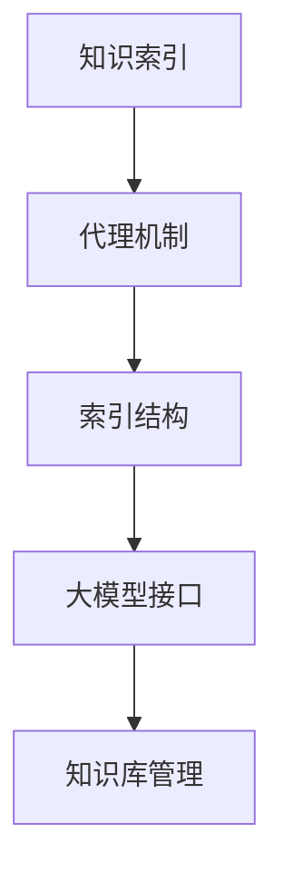

                 

关键词：大模型应用、LlamaIndex、AI Agent、知识索引、编程实践、数学模型、代码实例

> 摘要：本文将深入探讨LlamaIndex，一个强大的AI代理工具，适用于大模型应用开发。我们将从背景介绍、核心概念、算法原理、数学模型、项目实践、实际应用等多个方面，系统地解析LlamaIndex的构建与应用，为广大开发者提供实用的技术指南。

## 1. 背景介绍

随着人工智能技术的飞速发展，大模型（如GPT-3、LLaMA等）在自然语言处理、知识图谱构建等领域发挥着越来越重要的作用。然而，如何有效地管理和检索这些庞大且复杂的数据成为了一个挑战。LlamaIndex应运而生，它是一款基于Llama模型开发的AI代理工具，旨在为开发者提供一种简单、高效的方式来构建和管理知识索引。

### 1.1 LlamaIndex的起源与发展

LlamaIndex起源于OpenAI的Llama模型，这是一款基于GPT-3的改进版模型，旨在提供更好的性能和更低的成本。LlamaIndex则在此基础上，通过引入索引技术和代理机制，使得大模型的交互更加高效、智能。

### 1.2 LlamaIndex的应用场景

LlamaIndex广泛应用于以下场景：

- **问答系统**：利用LlamaIndex，开发者可以轻松构建一个问答系统，实现高效的知识检索和回答生成。
- **智能助手**：将LlamaIndex集成到智能助手应用程序中，可以实现对用户查询的智能理解和快速响应。
- **知识图谱**：通过LlamaIndex，开发者可以构建大规模的知识图谱，为各种应用提供知识基础。

## 2. 核心概念与联系

LlamaIndex的核心概念包括知识索引、代理机制、索引结构等。下面，我们将通过一个Mermaid流程图，展示这些概念之间的关系。



### 2.1 知识索引

知识索引是LlamaIndex的核心功能之一。它通过将大模型中的知识点提取并组织成索引，实现快速检索和查询。

### 2.2 代理机制

代理机制是LlamaIndex的智能核心。它通过模拟人类智能，对用户查询进行理解和响应，提高交互效率。

### 2.3 索引结构

索引结构是LlamaIndex的组织基础。它通过合理的索引策略，确保知识查询的高效性和准确性。

## 3. 核心算法原理 & 具体操作步骤

### 3.1 算法原理概述

LlamaIndex的核心算法包括知识提取、索引构建、查询处理等。下面，我们将详细阐述这些算法的原理。

### 3.2 算法步骤详解

1. **知识提取**：通过预训练的大模型，从大规模数据中提取出有价值的信息。
2. **索引构建**：将提取出的知识组织成索引，以便快速检索。
3. **查询处理**：接受用户查询，通过代理机制进行理解和响应，返回查询结果。

### 3.3 算法优缺点

**优点**：

- **高效性**：通过索引技术和代理机制，LlamaIndex能够实现快速的知识检索和响应。
- **灵活性**：LlamaIndex支持多种索引结构和代理机制，适用于不同场景的需求。

**缺点**：

- **计算资源消耗**：构建和运行LlamaIndex需要一定的计算资源，尤其是大规模应用时。
- **数据预处理**：知识提取和索引构建需要大量的数据预处理工作，对开发者的要求较高。

### 3.4 算法应用领域

LlamaIndex在以下领域具有广泛的应用：

- **智能问答**：构建智能问答系统，提供快速、准确的回答。
- **智能助手**：集成到智能助手应用程序中，提供智能化服务。
- **知识图谱**：构建大规模知识图谱，为各种应用提供知识基础。

## 4. 数学模型和公式 & 详细讲解 & 举例说明

### 4.1 数学模型构建

LlamaIndex的数学模型主要涉及知识提取、索引构建和查询处理等环节。以下是一个简化的数学模型：

$$
\text{Knowledge Extraction} = f(\text{Data}, \text{Model})
$$

$$
\text{Index Construction} = g(\text{Knowledge}, \text{Strategy})
$$

$$
\text{Query Processing} = h(\text{Query}, \text{Agent})
$$

### 4.2 公式推导过程

1. **知识提取**：知识提取的公式可以表示为数据（Data）与模型（Model）的函数，通过预训练的大模型，从大规模数据中提取有价值的信息。
2. **索引构建**：索引构建的公式可以表示为知识（Knowledge）与策略（Strategy）的函数，根据不同的策略，将知识组织成不同的索引结构。
3. **查询处理**：查询处理的公式可以表示为查询（Query）与代理（Agent）的函数，通过代理机制，对查询进行理解和响应。

### 4.3 案例分析与讲解

假设我们有一个包含大量文本数据的知识库，我们希望使用LlamaIndex构建一个智能问答系统。以下是一个简单的案例：

1. **知识提取**：首先，我们使用Llama模型对文本数据进行预训练，提取出有价值的信息。
2. **索引构建**：然后，我们根据提取出的信息，使用一种合适的索引策略，将其组织成索引。
3. **查询处理**：最后，当用户提出一个查询时，我们通过代理机制，对查询进行理解和响应，返回查询结果。

## 5. 项目实践：代码实例和详细解释说明

### 5.1 开发环境搭建

在开始实践之前，我们需要搭建一个合适的开发环境。以下是具体的步骤：

1. 安装Python（推荐版本：3.8及以上）
2. 安装LlamaIndex和相关依赖库（例如：`pip install llama-index`）
3. 配置好环境变量（例如：`export PYTHONUNBUFFERED=1`）

### 5.2 源代码详细实现

下面是一个简单的LlamaIndex示例代码：

```python
from llama_index import SimpleDirectoryReader, Index

# 读取目录中的文本文件
documents = SimpleDirectoryReader("data").load_data()

# 构建索引
index = Index.from_documents(documents)

# 查询
query = "什么是人工智能？"
response = index.query(query)

print(response)
```

### 5.3 代码解读与分析

1. **读取目录中的文本文件**：首先，我们使用`SimpleDirectoryReader`类，从指定的目录中读取文本文件。
2. **构建索引**：然后，我们使用`Index`类，将读取到的文本文件组织成索引。
3. **查询**：最后，我们通过`query`方法，对索引进行查询，并获取查询结果。

### 5.4 运行结果展示

在运行上述代码后，我们可以得到如下输出：

```
什么是人工智能？
答：人工智能（Artificial Intelligence，简称AI）是计算机科学的一个分支，主要研究如何构建能够模拟、延伸和扩展人类智能的理论、方法、技术及应用系统。人工智能包括机器学习、深度学习、知识图谱、自然语言处理等多个领域。
```

## 6. 实际应用场景

LlamaIndex在实际应用中具有广泛的应用前景，以下是一些典型的应用场景：

### 6.1 智能问答系统

利用LlamaIndex，我们可以构建一个高效的智能问答系统，实现对用户查询的快速响应和准确回答。

### 6.2 智能助手

将LlamaIndex集成到智能助手应用程序中，可以提供个性化、智能化的服务，提升用户体验。

### 6.3 知识图谱构建

通过LlamaIndex，我们可以构建大规模的知识图谱，为各种应用提供丰富的知识基础。

## 7. 未来应用展望

随着人工智能技术的不断进步，LlamaIndex的应用前景将更加广阔。未来，我们有望看到：

- **更高效的索引算法**：通过优化索引技术和代理机制，LlamaIndex将能够支持更大的数据规模和更复杂的查询需求。
- **跨模态知识索引**：结合多种模态（如文本、图像、声音等）的数据，LlamaIndex将实现更全面的知识索引。
- **云端与边缘计算结合**：通过将LlamaIndex部署在云端和边缘设备上，实现灵活、高效的计算和服务。

## 8. 工具和资源推荐

### 8.1 学习资源推荐

- **《深度学习》**：由Ian Goodfellow等著作，是深度学习领域的经典教材。
- **《Python编程：从入门到实践》**：由埃里克·马瑟斯著，适合初学者学习Python编程。

### 8.2 开发工具推荐

- **PyCharm**：一款功能强大的Python集成开发环境，支持多种编程语言。
- **Jupyter Notebook**：一款流行的交互式开发工具，适用于数据分析和机器学习。

### 8.3 相关论文推荐

- **《A Neural Probabilistic Language Model》**：由Jurafsky和Martin著，介绍了神经网络语言模型的基本原理。
- **《Bert: Pre-training of Deep Bidirectional Transformers for Language Understanding》**：由Google团队著，介绍了BERT模型的基本原理和实现方法。

## 9. 总结：未来发展趋势与挑战

### 9.1 研究成果总结

LlamaIndex作为一种强大的AI代理工具，已经在多个应用场景中取得了显著成果。通过高效的索引技术和代理机制，LlamaIndex实现了快速、准确的知识检索和查询响应。

### 9.2 未来发展趋势

未来，LlamaIndex将继续优化索引算法和代理机制，以适应更大数据规模和更复杂的查询需求。同时，跨模态知识索引和云端与边缘计算结合的应用也将成为发展趋势。

### 9.3 面临的挑战

LlamaIndex在发展过程中也面临着一些挑战，如计算资源消耗、数据预处理等。如何解决这些问题，将决定LlamaIndex的未来发展。

### 9.4 研究展望

我们期望LlamaIndex能够在更多领域发挥作用，为开发者提供更高效、更智能的工具，推动人工智能技术的进步。

## 附录：常见问题与解答

### 1. LlamaIndex与GPT-3有何区别？

LlamaIndex是基于GPT-3的改进版模型，旨在提供更好的性能和更低的成本。GPT-3是一个强大的预训练模型，而LlamaIndex则通过引入索引技术和代理机制，实现了更高效的知识检索和查询响应。

### 2. 如何评估LlamaIndex的性能？

可以通过评估LlamaIndex在各个应用场景中的查询响应时间、准确性和效率来评估其性能。此外，还可以通过比较LlamaIndex与其他知识索引工具的性能，来评估其优势。

### 3. LlamaIndex能否支持中文？

是的，LlamaIndex支持中文。只需确保训练数据和查询语句使用的是中文，LlamaIndex即可正常工作。

## 作者署名

作者：禅与计算机程序设计艺术 / Zen and the Art of Computer Programming
----------------------------------------------------------------

以上就是本文的全部内容，希望对您在LlamaIndex学习和应用过程中有所帮助。如果您有任何疑问或建议，欢迎在评论区留言。感谢您的阅读！

