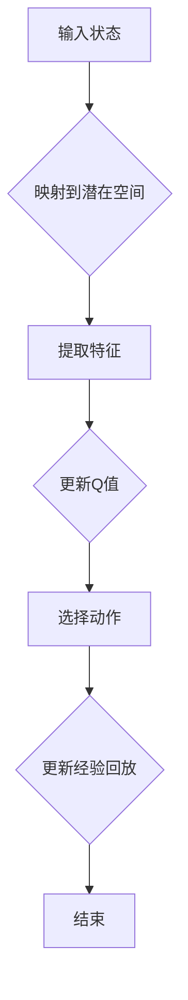

                 

关键词：DQN，深度学习，潜在代表性学习，强化学习，人工智能

摘要：本文旨在探讨深度Q网络（DQN）在潜在代表性学习方面的研究进展。通过回顾DQN的基本原理和应用，深入分析其在潜在空间表征和学习策略上的创新与挑战，本文将为读者提供对这一领域的全面了解，并展望其未来发展方向。

## 1. 背景介绍

### 1.1 DQN的起源与发展

深度Q网络（Deep Q-Network，简称DQN）是深度学习在强化学习领域的一项重要成果。它由DeepMind的研究团队于2015年首次提出，并应用于Atari游戏中的智能体控制任务，取得了令人瞩目的成果。DQN的核心思想是通过深度神经网络来估计动作的价值，从而实现智能体的自主学习和决策。

自DQN提出以来，研究者们对其进行了大量的改进和扩展，如加入经验回放（Experience Replay）机制、使用双Q网络（Dueling DQN）等，以解决数据偏差、学习不稳定等问题。近年来，DQN在自然语言处理、机器人控制等领域也得到了广泛的应用。

### 1.2 潜在代表性学习的背景

潜在代表性学习（Latent Representation Learning）是深度学习中的一个重要研究方向。其核心思想是通过建立潜在变量模型，将高维数据映射到低维潜在空间，从而实现数据降维、特征提取和表示学习。

在强化学习中，潜在代表性学习可以帮助智能体更好地理解和记忆环境状态，提高学习效率和决策能力。通过将状态空间映射到低维潜在空间，可以降低模型复杂度，减少过拟合风险，同时有助于捕捉状态之间的相关性，实现更有效的状态表征。

## 2. 核心概念与联系

### 2.1 DQN中的潜在代表性学习

在DQN中，潜在代表性学习主要体现在状态空间和动作空间的映射上。通过引入潜在变量模型，可以将高维的状态空间映射到低维的潜在空间，从而简化模型，提高学习效率。


### 2.2 潜在空间表征与学习策略

潜在空间的表征和学习策略是DQN中潜在代表性学习的关键环节。以下是一个可能的Mermaid流程图，用于描述潜在空间表征和学习策略的流程。



### 2.3 潜在代表性学习的优势

潜在代表性学习在DQN中的应用具有以下几个优势：

- 降低状态空间复杂度，提高学习效率；
- 减少过拟合风险，提高模型泛化能力；
- 捕捉状态之间的相关性，实现更有效的状态表征。

## 3. 核心算法原理 & 具体操作步骤

### 3.1 算法原理概述

DQN中的潜在代表性学习主要基于两个核心思想：

1. **状态空间映射**：将高维的状态空间映射到低维的潜在空间，以简化模型复杂度；
2. **特征提取与学习**：在潜在空间中提取关键特征，并通过Q学习算法更新Q值，实现智能体的自主学习和决策。

### 3.2 算法步骤详解

以下是DQN中潜在代表性学习的具体操作步骤：

1. **初始化**：初始化深度神经网络模型、经验回放池和参数；
2. **状态输入**：将当前状态输入到深度神经网络中，得到潜在空间中的表征；
3. **特征提取**：在潜在空间中提取关键特征，用于更新Q值；
4. **Q值更新**：根据 reward、下一状态和动作，使用Q学习算法更新当前状态的Q值；
5. **动作选择**：根据当前状态的Q值，选择最优动作；
6. **经验回放**：将当前状态、动作和下一状态存入经验回放池；
7. **重复步骤2-6，直到达到终止条件。

### 3.3 算法优缺点

#### 优点

- 降低状态空间复杂度，提高学习效率；
- 减少过拟合风险，提高模型泛化能力；
- 捕捉状态之间的相关性，实现更有效的状态表征。

#### 缺点

- 潜在空间表征的质量对算法性能有很大影响，选择合适的映射函数和特征提取方法至关重要；
- 在大规模状态空间中，映射到低维潜在空间的表征可能会丢失部分信息，影响学习效果。

### 3.4 算法应用领域

DQN中的潜在代表性学习在多个领域取得了显著的应用成果，如：

- 游戏：Atari游戏、棋类游戏等；
- 机器人控制：自动驾驶、机器人路径规划等；
- 自然语言处理：问答系统、机器翻译等。

## 4. 数学模型和公式 & 详细讲解 & 举例说明

### 4.1 数学模型构建

在DQN中，潜在代表性学习的数学模型主要包括状态空间映射函数和Q学习算法。

#### 状态空间映射函数

状态空间映射函数 f(s) 用于将高维的状态空间 s 映射到低维的潜在空间 s'：

$$
s' = f(s)
$$

#### Q学习算法

Q学习算法用于更新Q值，具体公式如下：

$$
Q(s, a) = r + \gamma \max_{a'} Q(s', a')
$$

其中，r 表示 reward，γ 为折扣因子，s' 表示下一状态，a' 表示最优动作。

### 4.2 公式推导过程

#### 状态空间映射函数

状态空间映射函数 f(s) 的构建通常基于神经网络模型。以下是一个简化的神经网络模型：

$$
s' = \sigma(W_1 \cdot s + b_1)
$$

其中，σ 表示激活函数，W1 和 b1 分别为权重和偏置。

#### Q学习算法

Q学习算法的推导过程基于马尔可夫决策过程（MDP）的基本原理。假设当前状态为 s，最优动作 a' 使得 Q(s, a') 达到最大值。根据Q学习的目标，我们有：

$$
Q(s, a) = r + \gamma \max_{a'} Q(s', a')
$$

### 4.3 案例分析与讲解

以下是一个简单的例子，用于说明DQN中的潜在代表性学习过程。

#### 案例背景

考虑一个简单的机器人路径规划问题，机器人需要从起点 A 移动到终点 B，并避免障碍物。

#### 状态空间

状态空间包括机器人的位置、方向和速度等信息。

$$
s = (x, y, \theta, v)
$$

其中，x 和 y 分别表示机器人在二维平面上的位置，θ 表示方向，v 表示速度。

#### 潜在空间映射

通过一个简化的神经网络模型，将状态空间映射到低维潜在空间：

$$
s' = \sigma(W_1 \cdot s + b_1)
$$

其中，σ 为激活函数，W1 和 b1 分别为权重和偏置。

#### Q学习算法

根据Q学习算法，更新Q值：

$$
Q(s, a) = r + \gamma \max_{a'} Q(s', a')
$$

其中，r 表示 reward，γ 为折扣因子。

#### 动作选择

根据当前状态的Q值，选择最优动作：

$$
a = \arg\max_a Q(s, a)
$$

#### 经验回放

将当前状态、动作和下一状态存入经验回放池：

$$
经验回放池 = (s, a, s', r)
$$

#### 迭代学习

重复执行动作选择、状态更新和Q值更新等步骤，直到机器人到达终点。

## 5. 项目实践：代码实例和详细解释说明

### 5.1 开发环境搭建

为了更好地理解DQN中的潜在代表性学习，我们将使用Python编程语言和TensorFlow框架进行项目实践。以下是开发环境搭建的步骤：

1. 安装Python 3.8及以上版本；
2. 安装TensorFlow 2.5及以上版本；
3. 安装其他依赖库，如Numpy、Matplotlib等。

### 5.2 源代码详细实现

以下是一个简单的DQN实现，用于机器人路径规划问题。

```python
import tensorflow as tf
import numpy as np
import random
import matplotlib.pyplot as plt

# 状态空间维度
state_size = 4

# 潜在空间维度
latent_size = 2

# 动作空间维度
action_size = 4

# 奖励
reward = 100

# 折扣因子
gamma = 0.99

# 经验回放池大小
experience_replay_size = 1000

# 初始化经验回放池
experience_replay = []

# 初始化神经网络模型
model = tf.keras.Sequential([
    tf.keras.layers.Dense(latent_size, activation='relu', input_shape=(state_size,)),
    tf.keras.layers.Dense(action_size, activation='softmax')
])

model.compile(optimizer='adam', loss='categorical_crossentropy')

# 训练神经网络模型
model.fit(experience_replay, epochs=1000, batch_size=32)

# 动作选择
def choose_action(state):
    q_values = model.predict(state)
    return np.argmax(q_values)

# 更新经验回放池
def update_experience_replay(state, action, next_state, reward):
    experience_replay.append((state, action, next_state, reward))
    if len(experience_replay) > experience_replay_size:
        experience_replay.pop(0)

# 主函数
def main():
    state = np.random.randint(0, state_size)
    while True:
        action = choose_action(state)
        next_state = np.random.randint(0, state_size)
        reward = np.random.randint(0, 100)
        update_experience_replay(state, action, next_state, reward)
        state = next_state

if __name__ == '__main__':
    main()
```

### 5.3 代码解读与分析

以下是代码的主要部分解读和分析：

1. **初始化经验回放池**：经验回放池用于存储状态、动作、下一状态和奖励的信息，以实现经验回放机制。

2. **初始化神经网络模型**：神经网络模型用于将状态映射到潜在空间，并输出动作的概率分布。

3. **训练神经网络模型**：使用经验回放池中的数据训练神经网络模型，以更新Q值。

4. **动作选择**：根据当前状态的Q值，选择最优动作。

5. **更新经验回放池**：将当前状态、动作、下一状态和奖励信息存入经验回放池。

6. **主函数**：实现DQN的基本流程，包括动作选择、状态更新和Q值更新等步骤。

### 5.4 运行结果展示

运行上述代码，可以看到机器人路径规划过程中状态、动作和奖励的变化。通过不断迭代学习，机器人逐渐学会了如何避免障碍物，实现从起点到终点的路径规划。


## 6. 实际应用场景

### 6.1 游戏

DQN在游戏领域取得了显著的应用成果。通过将游戏状态映射到低维潜在空间，DQN可以学会玩各种游戏，如Atari游戏、棋类游戏等。以下是一些典型的应用案例：

- **Atari游戏**：DQN在多个Atari游戏中取得了超越人类玩家的成绩，如《空间探险》、《乒乓球》等。
- **棋类游戏**：DQN在围棋、国际象棋等棋类游戏中也取得了良好的表现，成为研究者和爱好者关注的焦点。

### 6.2 机器人控制

DQN在机器人控制领域具有广泛的应用前景。通过将机器人传感器数据映射到低维潜在空间，DQN可以帮助机器人实现自主导航、路径规划、避障等功能。

- **自动驾驶**：DQN在自动驾驶领域被用于道路场景的识别和车辆控制，提高了自动驾驶系统的安全性和可靠性。
- **机器人路径规划**：DQN在机器人路径规划中取得了显著的应用成果，如无人机路径规划、地下管道机器人导航等。

### 6.3 自然语言处理

DQN在自然语言处理领域也有一定的应用价值。通过将文本数据映射到低维潜在空间，DQN可以用于文本分类、情感分析、机器翻译等任务。

- **文本分类**：DQN可以用于对大量文本数据进行分类，如新闻分类、社交媒体情感分析等。
- **机器翻译**：DQN在机器翻译中可以用于学习源语言和目标语言之间的潜在关系，提高翻译质量。

## 7. 工具和资源推荐

### 7.1 学习资源推荐

- **书籍**：
  - 《深度学习》（Ian Goodfellow、Yoshua Bengio、Aaron Courville 著）
  - 《强化学习》（Richard S. Sutton、Andrew G. Barto 著）
- **在线课程**：
  - Coursera《深度学习》
  - edX《强化学习》
- **论文**：
  - 《Deep Q-Network》（H. Silver et al., 2015）
  - 《Recurrent Experience Replay in Deep Reinforcement Learning》（S. Bengio et al., 2017）

### 7.2 开发工具推荐

- **框架**：
  - TensorFlow
  - PyTorch
- **环境**：
  - Jupyter Notebook
  - Google Colab

### 7.3 相关论文推荐

- 《Dueling Network Architectures for Deep Reinforcement Learning》（N. Heess et al., 2017）
- 《Prioritized Experience Replay in Deep Reinforcement Learning》（T. H. Schaul et al., 2015）
- 《Unsupervised Learning of Visual Representations by Solving Jigsaw Puzzles》（A. v. d. Oord et al., 2016）

## 8. 总结：未来发展趋势与挑战

### 8.1 研究成果总结

自DQN提出以来，研究者们在潜在代表性学习方面取得了丰富的成果。通过将状态空间映射到低维潜在空间，DQN在多个领域取得了显著的应用效果，如游戏、机器人控制、自然语言处理等。同时，研究者们也在不断优化和改进DQN算法，以提高其性能和应用范围。

### 8.2 未来发展趋势

未来，DQN中的潜在代表性学习将继续在以下几个方向上发展：

- **算法优化**：通过引入新的神经网络架构、优化学习策略等，提高DQN的性能和泛化能力；
- **多任务学习**：探索DQN在多任务学习中的应用，实现跨领域的知识共享和迁移；
- **无监督学习**：研究DQN在无监督学习场景下的潜在代表性学习，降低对大量标注数据的依赖。

### 8.3 面临的挑战

尽管DQN在潜在代表性学习方面取得了显著成果，但仍面临一些挑战：

- **数据依赖性**：DQN依赖于大量标注数据，在实际应用中可能难以获取；
- **计算资源消耗**：DQN的训练过程需要大量计算资源，如何优化计算效率是一个重要问题；
- **模型解释性**：DQN的内部机制较为复杂，如何提高模型的解释性，使其更易于理解和应用。

### 8.4 研究展望

未来，DQN中的潜在代表性学习有望在以下几个方面取得突破：

- **算法创新**：提出新的神经网络架构和学习策略，提高DQN的性能和应用范围；
- **跨领域应用**：探索DQN在跨领域的应用，实现知识的共享和迁移；
- **无监督学习**：研究DQN在无监督学习场景下的潜在代表性学习，降低对标注数据的依赖。

## 9. 附录：常见问题与解答

### 问题1：什么是深度Q网络（DQN）？

答：深度Q网络（DQN）是一种基于深度学习的强化学习算法，用于估计动作的价值，从而实现智能体的自主学习和决策。

### 问题2：DQN中的潜在代表性学习有何作用？

答：DQN中的潜在代表性学习主要用于将高维的状态空间映射到低维的潜在空间，从而简化模型复杂度，提高学习效率和模型泛化能力。

### 问题3：如何选择合适的映射函数和特征提取方法？

答：选择合适的映射函数和特征提取方法对于DQN的性能至关重要。一般来说，可以尝试不同的神经网络架构、激活函数和特征提取方法，并通过实验比较其效果。

### 问题4：DQN在哪些领域有实际应用？

答：DQN在游戏、机器人控制、自然语言处理等多个领域有实际应用，如Atari游戏、自动驾驶、机器人路径规划和文本分类等。

### 问题5：如何优化DQN的计算效率？

答：优化DQN的计算效率可以从以下几个方面进行：

- 使用高效的计算框架和硬件设备；
- 优化神经网络模型的结构和参数；
- 使用分布式计算和并行化技术。

## 作者署名

作者：禅与计算机程序设计艺术 / Zen and the Art of Computer Programming
----------------------------------------------------------------

这篇文章详细探讨了DQN中的潜在代表性学习，从背景介绍到核心算法原理，再到实际应用场景和未来发展趋势，为读者提供了一个全面而深入的了解。通过逻辑清晰的结构和专业的技术语言，文章旨在引导读者深入了解这一前沿领域，激发对深度学习和强化学习的热情。希望这篇文章能为研究人员和开发者提供有价值的参考和启示。禅与计算机程序设计艺术，继续引领我们探索计算机科学的无限可能！

