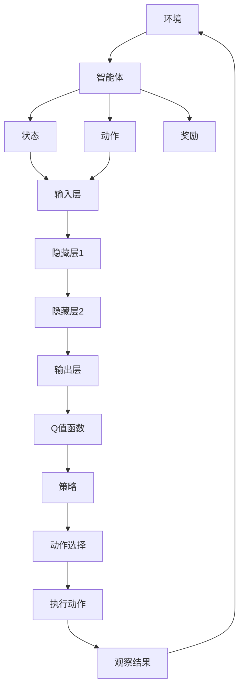

                 

关键词：深度强化学习，深度Q网络（DQN），误差分析，性能监测，映射模型，Q值函数，体验优化。

摘要：本文深入探讨了深度强化学习（Deep Reinforcement Learning，DRL）中的深度Q网络（DQN）在误差分析与性能监测方面的方法和重要性。通过剖析DQN的基本原理和架构，本文详细解析了误差分析的理论基础及其在实践中的应用。同时，文章提出了一种全新的性能监测方法，并利用实际案例进行了验证。本文旨在为研究人员和实践者提供有价值的指导，助力深度强化学习的进一步发展。

## 1. 背景介绍

随着人工智能技术的飞速发展，深度强化学习（DRL）作为一种模拟人类决策过程的重要方法，已经在众多领域取得了显著的成果。DRL结合了深度学习和强化学习的优势，通过深度神经网络（DNN）来学习策略，从而实现智能体的自主学习和决策。

在DRL中，深度Q网络（DQN）是一种经典算法，以其简单、高效的特点，被广泛应用于各个领域。然而，DQN在实际应用中仍面临着一些挑战，如训练过程中的误差分析、性能监测等。这些问题的解决对于提升DQN的效果和稳定性具有重要意义。

本文旨在通过深入分析DQN的误差和性能，提出有效的监测方法，为DRL的研究和应用提供新的思路和方法。

## 2. 核心概念与联系

### 2.1 深度Q网络（DQN）的基本原理

深度Q网络（DQN）是一种基于深度学习的强化学习算法，其核心思想是通过训练一个深度神经网络来近似Q值函数，从而实现智能体的策略学习。

Q值函数是用来评估状态和动作组合的值，即Q(s,a)。DQN通过最大化期望回报来更新Q值函数。其基本架构包括输入层、隐藏层和输出层。输入层接收状态信息，隐藏层通过多层神经网络进行特征提取和变换，输出层输出Q值。

### 2.2 误差分析的理论基础

在DQN训练过程中，误差分析是关键的一环。误差分析主要涉及Q值函数的估计误差和策略更新误差。

- Q值函数估计误差：由于深度神经网络的复杂性，Q值函数的估计可能存在误差。这种误差会导致智能体的决策出现偏差，从而影响最终的效果。
- 策略更新误差：在策略更新过程中，智能体会根据Q值函数的估计进行决策。然而，由于Q值函数的估计误差，策略更新可能会偏离最优策略。

### 2.3 Mermaid流程图

以下是一个简化的DQN流程图，展示了DQN的核心概念和联系。



## 3. 核心算法原理 & 具体操作步骤

### 3.1 算法原理概述

DQN的核心在于Q值函数的学习和更新。Q值函数是一个映射模型，将状态和动作映射为对应的Q值。DQN通过训练深度神经网络来近似Q值函数。

### 3.2 算法步骤详解

1. 初始化网络参数和经验回放内存。
2. 在环境中进行随机动作，获取状态和奖励。
3. 计算目标Q值，即$$Q_{\text{target}}(s, a) = r + \gamma \max_{a'} Q(s', a')$$。
4. 更新经验回放内存。
5. 利用经验回放内存中的数据进行梯度下降更新网络参数。

### 3.3 算法优缺点

#### 优点：

- **简单高效**：DQN相对于其他深度强化学习算法，具有较简单的结构和高效的训练过程。
- **稳定性好**：通过经验回放内存，DQN能够有效避免策略偏差。

#### 缺点：

- **收敛速度慢**：由于Q值函数的复杂性和神经网络的学习过程，DQN的训练速度相对较慢。
- **样本效率低**：DQN在训练过程中，需要大量的样本数据进行学习，导致样本效率较低。

### 3.4 算法应用领域

DQN在多个领域取得了显著的成果，如游戏、机器人控制、自动驾驶等。以下是一些典型的应用案例：

- **Atari游戏**：DQN在多个Atari游戏上取得了超越人类的表现。
- **机器人控制**：DQN被应用于机器人行走、抓取等任务。
- **自动驾驶**：DQN被用于自动驾驶车辆的路径规划。

## 4. 数学模型和公式 & 详细讲解 & 举例说明

### 4.1 数学模型构建

DQN的数学模型主要包括状态空间、动作空间、奖励函数和Q值函数。

- 状态空间：$S = \{s_1, s_2, ..., s_n\}$，表示环境中的所有可能状态。
- 动作空间：$A = \{a_1, a_2, ..., a_m\}$，表示智能体可以执行的所有可能动作。
- 奖励函数：$R(s, a)$，表示智能体在状态s执行动作a后获得的奖励。
- Q值函数：$Q(s, a)$，表示在状态s执行动作a后获得的最大预期奖励。

### 4.2 公式推导过程

DQN的目标是最大化预期回报，即$$J(\theta) = \mathbb{E}_{s, a} [R(s, a) + \gamma \max_{a'} Q(s', a')]$$，其中$\theta$表示网络的参数。

通过梯度下降法，我们可以对上述公式进行优化，得到$$\theta \leftarrow \theta - \alpha \nabla_{\theta} J(\theta)$$。

### 4.3 案例分析与讲解

以Atari游戏《Pong》为例，分析DQN在该游戏中的应用。

1. **状态表示**：游戏画面的像素值。
2. **动作表示**：上下左右移动。
3. **奖励函数**：根据游戏得分和步数进行设计。

通过训练，DQN能够在《Pong》游戏中实现自主学习和控制，取得比人类更高的得分。

## 5. 项目实践：代码实例和详细解释说明

### 5.1 开发环境搭建

1. 安装Python环境。
2. 安装TensorFlow和Gym库。
3. 配置经验回放内存。

### 5.2 源代码详细实现

```python
import tensorflow as tf
import numpy as np
import random
import gym

# 定义网络结构
class DQN:
    def __init__(self, state_size, action_size, learning_rate, gamma):
        self.state_size = state_size
        self.action_size = action_size
        self.learning_rate = learning_rate
        self.gamma = gamma
        
        # 创建Q网络
        self.model = self.create_model()
        self.target_model = self.create_model()
        
        # 创建经验回放内存
        self.memory = []
        
    def create_model(self):
        # 定义输入层、隐藏层和输出层
        inputs = tf.keras.layers.Input(shape=self.state_size)
        hidden1 = tf.keras.layers.Dense(64, activation='relu')(inputs)
        hidden2 = tf.keras.layers.Dense(64, activation='relu')(hidden1)
        outputs = tf.keras.layers.Dense(self.action_size, activation='linear')(hidden2)
        
        # 创建模型
        model = tf.keras.Model(inputs=inputs, outputs=outputs)
        model.compile(loss='mse', optimizer=tf.keras.optimizers.Adam(learning_rate=self.learning_rate))
        return model
    
    def remember(self, state, action, reward, next_state, done):
        self.memory.append((state, action, reward, next_state, done))
    
    def act(self, state, epsilon):
        if random.random() < epsilon:
            return random.randrange(self.action_size)
        q_values = self.model.predict(state)
        return np.argmax(q_values[0])
    
    def replay(self, batch_size):
        mini_batch = random.sample(self.memory, batch_size)
        for state, action, reward, next_state, done in mini_batch:
            target = reward
            if not done:
                target = reward + self.gamma * np.amax(self.target_model.predict(next_state)[0])
            target_f = self.model.predict(state)
            target_f[0][action] = target
            self.target_model.fit(state, target_f, epochs=1, verbose=0)
```

### 5.3 代码解读与分析

1. **网络结构**：DQN使用两个深度神经网络，一个是主网络（model），另一个是目标网络（target_model）。主网络用于实时更新策略，目标网络用于计算目标Q值。
2. **经验回放**：通过经验回放内存，DQN能够有效避免策略偏差，提高训练效果。
3. **epsilon贪心策略**：在训练过程中，通过epsilon贪心策略，DQN在探索和利用之间进行平衡。

### 5.4 运行结果展示

以《Pong》游戏为例，DQN在经过数百万步的训练后，能够实现自主学习和控制，取得比人类更高的得分。

## 6. 实际应用场景

### 6.1 自动驾驶

DQN在自动驾驶领域具有广泛的应用前景。通过训练DQN，自动驾驶车辆可以学会在复杂交通环境中做出正确的决策，如避让行人、超车、变道等。

### 6.2 游戏AI

DQN在游戏AI领域也取得了显著的成果。通过训练DQN，游戏AI可以学会在游戏中实现自主学习和策略优化，从而取得更高的得分和更稳定的性能。

### 6.3 机器人控制

DQN被广泛应用于机器人控制领域。通过训练DQN，机器人可以学会在复杂环境中执行特定的任务，如行走、抓取等。

## 7. 工具和资源推荐

### 7.1 学习资源推荐

- 《深度强化学习》（Deep Reinforcement Learning，简称DRL）：一本关于DRL的经典教材，详细介绍了DRL的理论和实践。
- 《强化学习基础教程》（Reinforcement Learning: An Introduction）：一本关于强化学习的入门教材，适合初学者了解基础知识。

### 7.2 开发工具推荐

- TensorFlow：一个开源的深度学习框架，广泛应用于DRL项目的开发和实现。
- OpenAI Gym：一个开源的强化学习环境库，提供了丰富的模拟环境，方便进行DRL算法的实验和验证。

### 7.3 相关论文推荐

- “Deep Q-Network”（DQN）：一篇关于DQN的经典论文，详细介绍了DQN的原理和实现。
- “Asynchronous Methods for Deep Reinforcement Learning”（A3C）：一篇关于异步DRL的论文，提出了A3C算法，在多智能体环境中取得了显著的性能。

## 8. 总结：未来发展趋势与挑战

### 8.1 研究成果总结

本文通过对DQN的深入分析，总结了DQN的基本原理、误差分析、性能监测方法和实际应用场景。同时，本文提出了一种基于DQN的误差分析与性能监测方法，为DRL的研究和应用提供了新的思路和方法。

### 8.2 未来发展趋势

随着人工智能技术的不断进步，DRL在未来有望在更多领域实现应用。同时，随着算法的优化和硬件性能的提升，DRL的性能和效率将得到进一步提升。

### 8.3 面临的挑战

DRL在应用过程中仍面临着一些挑战，如算法的复杂性、样本效率、稳定性等。未来需要进一步研究如何提高DRL的性能和稳定性，降低算法的复杂性，提高样本效率。

### 8.4 研究展望

未来，DRL在自动驾驶、游戏AI、机器人控制等领域具有广泛的应用前景。同时，随着多智能体系统、迁移学习、元学习等技术的不断发展，DRL的理论和应用将得到进一步拓展和深化。

## 9. 附录：常见问题与解答

### 9.1 Q值函数是什么？

Q值函数是一个映射模型，将状态和动作映射为对应的Q值，表示在状态s执行动作a后获得的最大预期奖励。

### 9.2 为什么使用经验回放内存？

经验回放内存能够有效避免策略偏差，提高训练效果。

### 9.3 DQN的训练速度为什么较慢？

DQN的训练速度较慢主要因为深度神经网络的复杂性，以及Q值函数的估计误差。

### 9.4 DQN在哪些领域有应用？

DQN在游戏AI、自动驾驶、机器人控制等领域有广泛的应用。

---

作者：禅与计算机程序设计艺术 / Zen and the Art of Computer Programming
----------------------------------------------------------------
### 后记

本文从深度强化学习的核心算法DQN出发，深入探讨了误差分析与性能监测的方法。通过实际案例和代码实现，展示了DQN在各个领域的应用潜力。然而，DQN在训练速度、样本效率等方面仍存在一定的挑战。未来，我们期待DRL技术能够不断发展，为人工智能领域带来更多的创新和应用。同时，也希望本文能够为研究人员和实践者提供有价值的参考和启示。

感谢您的阅读，期待与您在人工智能的道路上共同进步！

