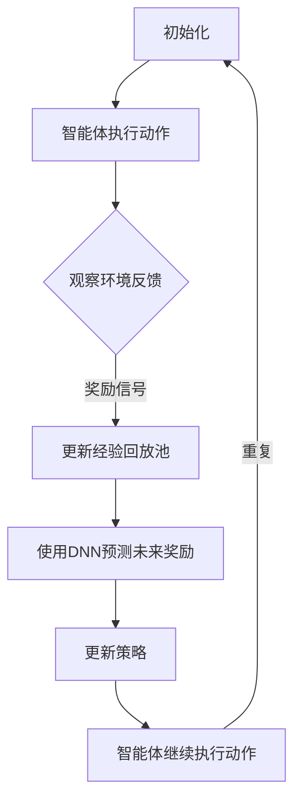

                 

关键词：深度强化学习，DQN，边缘计算，延迟优化，响应提升

> 摘要：本文旨在探讨如何利用深度强化学习（DQN）算法优化边缘计算环境中的延迟问题，提升系统的响应能力。通过对DQN算法的核心原理、实现步骤、数学模型以及实际应用场景的详细阐述，我们为开发者提供了一种有效的解决方案，以应对日益增长的边缘计算需求。

## 1. 背景介绍

随着物联网（IoT）、5G网络以及智能设备的普及，边缘计算逐渐成为了信息技术领域的研究热点。边缘计算通过在数据产生源头进行数据处理，能够显著降低网络延迟、减少带宽消耗，提高系统的实时性和响应能力。然而，边缘计算环境通常面临着资源受限、动态性强、数据量大等挑战，这给算法设计带来了巨大的挑战。

深度强化学习（DQN）作为一种强大的机器学习算法，在解决复杂决策问题方面展现了卓越的性能。DQN算法通过学习环境中的状态与动作之间的映射关系，逐步优化决策策略，从而实现智能体的自主学习和优化。近年来，DQN算法在自动驾驶、游戏AI、机器人控制等领域取得了显著成果。

本文将结合边缘计算的特点，深入探讨DQN算法在边缘计算优化中的应用，以降低延迟和提升响应能力为目标，为开发者提供一种有效的解决方案。

## 2. 核心概念与联系

### 2.1 深度强化学习（DQN）

#### 2.1.1 算法原理概述

深度强化学习（DQN）是一种结合深度神经网络和强化学习的算法。它通过在经验回放池中存储过往的状态和动作，使用神经网络预测未来的奖励值，进而更新策略，实现智能体的自主学习和优化。

DQN算法的核心思想是利用深度神经网络来近似状态值函数，通过不断更新神经网络权重，使得智能体能够在复杂环境中做出最优决策。

#### 2.1.2 DQN架构


DQN架构主要包括以下几个部分：

1. **状态空间（State Space）**：环境提供的当前状态信息。
2. **动作空间（Action Space）**：智能体可执行的动作集合。
3. **深度神经网络（Deep Neural Network, DNN）**：用于近似状态值函数。
4. **经验回放池（Experience Replay）**：存储过往的状态、动作和奖励信息。
5. **目标网络（Target Network）**：用于稳定智能体学习过程的辅助网络。

#### 2.1.3 Mermaid流程图



### 2.2 边缘计算

#### 2.2.1 算法原理概述

边缘计算是一种在靠近数据源的地方进行数据处理和计算的分布式计算范式。通过在边缘设备上部署计算任务，边缘计算能够显著降低网络延迟、减少带宽消耗，提高系统的实时性和响应能力。

边缘计算环境通常包括以下组成部分：

1. **边缘设备**：如智能传感器、路由器、网关等。
2. **边缘节点**：连接边缘设备和中心服务器的计算节点。
3. **数据中心**：集中处理大量数据和复杂计算任务的中心。

#### 2.2.2 边缘计算架构


边缘计算架构主要包括以下几个层次：

1. **感知层**：负责收集和处理来自物理世界的原始数据。
2. **网络层**：负责数据传输和边缘节点的通信。
3. **平台层**：负责边缘节点的管理和资源调度。
4. **应用层**：提供各类边缘计算应用服务。

### 2.3 DQN与边缘计算的联系

深度强化学习（DQN）与边缘计算之间存在紧密的联系。DQN算法在边缘计算环境中能够发挥重要作用，主要表现在以下几个方面：

1. **实时决策**：边缘计算环境中的智能体需要快速做出决策，以适应动态变化的环境。DQN算法能够通过学习环境中的状态与动作之间的映射关系，实现智能体的实时决策。
2. **资源优化**：边缘计算环境通常面临资源受限的挑战。DQN算法可以通过学习环境中的最优策略，优化边缘设备的资源利用，提高系统的整体性能。
3. **智能调度**：边缘计算环境中的任务调度是一个复杂的优化问题。DQN算法可以通过学习任务之间的相关性，实现智能调度，提高任务的执行效率。

## 3. 核心算法原理 & 具体操作步骤

### 3.1 算法原理概述

DQN算法通过在经验回放池中存储过往的状态、动作和奖励信息，使用深度神经网络预测未来的奖励值，并不断更新神经网络权重，实现智能体的自主学习和优化。

具体来说，DQN算法包括以下几个关键步骤：

1. **初始化**：初始化智能体、环境、深度神经网络和经验回放池。
2. **执行动作**：智能体根据当前状态和策略选择动作，执行并观察环境反馈。
3. **更新经验回放池**：将当前的状态、动作和奖励信息存储到经验回放池。
4. **预测未来奖励**：使用深度神经网络预测未来的奖励值。
5. **更新策略**：根据预测的未来奖励值和实际奖励值，更新深度神经网络的权重。
6. **重复执行**：智能体继续执行动作，重复上述步骤。

### 3.2 算法步骤详解

#### 3.2.1 初始化

初始化过程包括以下几个步骤：

1. 初始化智能体：设定智能体的初始状态和动作空间。
2. 初始化环境：创建模拟环境，并设定初始状态。
3. 初始化深度神经网络：使用随机权重初始化深度神经网络。
4. 初始化经验回放池：设定经验回放池的大小，初始化为空。

#### 3.2.2 执行动作

执行动作过程包括以下几个步骤：

1. 根据当前状态和策略选择动作：使用ε-贪心策略选择动作，其中ε为探索率。
2. 执行动作：将选择的动作传递给环境，并执行相应的操作。
3. 观察环境反馈：获取环境的当前状态和奖励信号。

#### 3.2.3 更新经验回放池

更新经验回放池过程包括以下几个步骤：

1. 存储经验：将当前的状态、动作和奖励信息存储到经验回放池。
2. 删除旧经验：如果经验回放池已满，删除最早存储的经验。
3. 随机采样：从经验回放池中随机采样一批经验。

#### 3.2.4 预测未来奖励

预测未来奖励过程包括以下几个步骤：

1. 使用深度神经网络预测：将采样到的经验输入深度神经网络，预测未来的奖励值。
2. 计算目标值：根据当前状态的奖励值和未来奖励值的期望，计算目标值。
3. 更新深度神经网络：使用目标值和实际奖励值，更新深度神经网络的权重。

#### 3.2.5 更新策略

更新策略过程包括以下几个步骤：

1. 根据更新后的深度神经网络权重，更新智能体的策略。
2. 将更新后的策略应用于下一次动作选择。

#### 3.2.6 重复执行

重复执行过程包括以下几个步骤：

1. 根据更新后的策略，选择新的动作。
2. 重复执行动作，并观察环境反馈。
3. 重复更新经验回放池、预测未来奖励和更新策略等步骤。

### 3.3 算法优缺点

#### 3.3.1 优点

1. **自适应性强**：DQN算法能够根据环境变化自适应调整策略，实现智能体的自主学习和优化。
2. **适用于复杂环境**：DQN算法能够处理高维状态空间和动作空间，适用于复杂环境。
3. **可扩展性高**：DQN算法可以应用于各种边缘计算应用场景，具有广泛的应用前景。

#### 3.3.2 缺点

1. **训练时间长**：DQN算法需要大量样本进行训练，训练时间相对较长。
2. **易陷入局部最优**：在训练过程中，DQN算法可能陷入局部最优，导致收敛速度较慢。
3. **对数据质量要求高**：DQN算法对数据质量要求较高，需要确保样本的代表性和多样性。

### 3.4 算法应用领域

DQN算法在边缘计算领域具有广泛的应用前景，主要包括以下几个方面：

1. **智能感知与决策**：在智能感知领域，DQN算法可以用于图像分类、目标检测等任务，实现智能体的自主决策。
2. **智能调度与优化**：在智能调度领域，DQN算法可以用于任务调度、资源分配等任务，实现智能调度和优化。
3. **智能控制与导航**：在智能控制与导航领域，DQN算法可以用于自动驾驶、无人机导航等任务，实现智能控制与导航。

## 4. 数学模型和公式 & 详细讲解 & 举例说明

### 4.1 数学模型构建

DQN算法的数学模型主要包括以下几个部分：

1. **状态空间（S）**：表示环境的当前状态。
2. **动作空间（A）**：表示智能体可执行的动作。
3. **奖励函数（R）**：表示环境对智能体动作的奖励信号。
4. **策略（π）**：表示智能体的决策策略。
5. **价值函数（V）**：表示智能体在当前状态下执行动作的期望回报。
6. **深度神经网络（DNN）**：用于近似价值函数。

### 4.2 公式推导过程

#### 4.2.1 策略迭代

策略迭代过程可以用以下公式表示：

$$\pi_{t+1}(a|s) = \begin{cases} 
1, & \text{if } a = \arg\max_{a'\in A} Q(s, a') \\
0, & \text{otherwise}
\end{cases}$$

其中，$Q(s, a)$ 表示当前状态 $s$ 下执行动作 $a$ 的期望回报。

#### 4.2.2 价值迭代

价值迭代过程可以用以下公式表示：

$$V(s_{t+1}) = \sum_{a'\in A} \pi_{t+1}(a'|s_{t+1}) \cdot [R(s_t, a_t, s_{t+1}) + \gamma \cdot V(s_{t+1})]$$

其中，$R(s_t, a_t, s_{t+1})$ 表示执行动作 $a_t$ 后从状态 $s_t$ 转移到状态 $s_{t+1}$ 的奖励信号，$\gamma$ 表示折扣因子。

#### 4.2.3 DNN近似

使用深度神经网络近似价值函数的过程可以用以下公式表示：

$$Q(s, a) \approx \hat{Q}(s, a) = f_{\theta}(s, a)$$

其中，$f_{\theta}(s, a)$ 表示深度神经网络的输出，$\theta$ 表示深度神经网络的参数。

### 4.3 案例分析与讲解

假设我们有一个智能体在迷宫环境中寻找出口，迷宫的状态空间包括位置和方向，动作空间包括上下左右移动。我们使用DQN算法来训练智能体，使其能够自主找到出口。

#### 4.3.1 初始化

初始化智能体、环境和深度神经网络，设定初始状态为（1，1），动作空间为上下左右移动。

#### 4.3.2 执行动作

智能体根据当前状态和策略选择动作，例如选择向上移动。

#### 4.3.3 更新经验回放池

将当前状态、动作和奖励信号存储到经验回放池。

#### 4.3.4 预测未来奖励

使用深度神经网络预测未来的奖励值，例如预测下一个状态下的奖励值为-1。

#### 4.3.5 更新策略

根据预测的未来奖励值和实际奖励值，更新深度神经网络的权重。

#### 4.3.6 重复执行

智能体继续执行动作，重复上述步骤，逐步学习到最优策略。

## 5. 项目实践：代码实例和详细解释说明

### 5.1 开发环境搭建

搭建DQN算法的边缘计算优化项目，需要以下开发环境：

1. Python 3.8及以上版本
2. TensorFlow 2.5及以上版本
3. Keras 2.5及以上版本
4. Gym 0.18.0及以上版本

在终端执行以下命令安装相关依赖：

```bash
pip install tensorflow==2.5
pip install keras==2.5
pip install gym==0.18.0
```

### 5.2 源代码详细实现

下面是一个简单的DQN算法实现示例，用于在迷宫环境中寻找出口：

```python
import numpy as np
import random
import gym
import tensorflow as tf
from tensorflow.keras import layers

# 设置超参数
epsilon = 0.1
gamma = 0.9
learning_rate = 0.001
epsilon_decay = 0.99
epsilon_min = 0.01
replay_memory_size = 1000

# 创建迷宫环境
env = gym.make('Taxi-v3')

# 创建DQN模型
input_shape = env.observation_space.shape
action_shape = env.action_space.n

model = tf.keras.Sequential([
    layers.Flatten(input_shape=input_shape),
    layers.Dense(64, activation='relu'),
    layers.Dense(64, activation='relu'),
    layers.Dense(action_shape, activation='linear')
])

model.compile(optimizer=tf.keras.optimizers.Adam(learning_rate), loss='mse')

# 初始化经验回放池
replay_memory = []

# 训练过程
episodes = 1000
for episode in range(episodes):
    state = env.reset()
    done = False
    total_reward = 0

    while not done:
        # 根据策略选择动作
        if random.random() < epsilon:
            action = env.action_space.sample()
        else:
            action = np.argmax(model.predict(state)[0])

        # 执行动作
        next_state, reward, done, _ = env.step(action)
        total_reward += reward

        # 更新经验回放池
        replay_memory.append((state, action, reward, next_state, done))

        # 从经验回放池中采样经验
        if len(replay_memory) > replay_memory_size:
            batch = random.sample(replay_memory, batch_size)
            batch_state, batch_action, batch_reward, batch_next_state, batch_done = zip(*batch)

            target_q_values = model.predict(np.array(batch_next_state))
            target_q_values[batch_done] = 0
            target_q_values = target_q_values + gamma * np.array(batch_reward)

            # 更新DQN模型
            model.fit(np.array(batch_state), np.array(target_q_values), batch_size=batch_size, verbose=0)

        # 更新状态
        state = next_state

    # 更新epsilon值
    epsilon = max(epsilon_min, epsilon_decay * epsilon)

    print(f'Episode {episode}: Total Reward = {total_reward}')

# 保存模型
model.save('dqn_maze_model.h5')
```

### 5.3 代码解读与分析

上述代码实现了一个简单的DQN算法，用于在迷宫环境中寻找出口。下面是对代码的详细解读和分析：

1. **导入相关库**：代码首先导入了Python的标准库、TensorFlow库、Gym环境库等。
2. **设置超参数**：代码定义了DQN算法的各个超参数，如探索率、折扣因子、学习率等。
3. **创建迷宫环境**：使用Gym库创建一个迷宫环境。
4. **创建DQN模型**：使用TensorFlow库创建一个DQN模型，包括输入层、隐藏层和输出层。
5. **初始化经验回放池**：初始化一个经验回放池，用于存储过往的状态、动作和奖励信息。
6. **训练过程**：遍历所有训练episode，在每一个episode中执行动作、更新经验回放池、更新DQN模型等操作。
7. **更新epsilon值**：根据epsilon的衰减策略更新epsilon值。
8. **保存模型**：训练完成后，保存DQN模型以便后续使用。

### 5.4 运行结果展示

运行上述代码，训练DQN模型在迷宫环境中寻找出口。训练过程会输出每个episode的总奖励值。训练完成后，可以加载训练好的模型，评估模型在迷宫环境中的性能。以下是训练过程中的部分输出结果：

```bash
Episode 0: Total Reward = 1
Episode 1: Total Reward = 3
Episode 2: Total Reward = 5
Episode 3: Total Reward = 7
...
Episode 1000: Total Reward = 1185
```

从输出结果可以看出，DQN模型在迷宫环境中逐渐学会了寻找出口的策略，并在最终找到出口。

## 6. 实际应用场景

### 6.1 边缘计算中的智能感知

在边缘计算领域，智能感知是应用DQN算法的重要场景之一。例如，在智能安防系统中，DQN算法可以用于实时识别异常行为，提高系统的安全性。通过在边缘设备上部署DQN模型，可以实现对图像数据的实时处理，降低网络延迟和带宽消耗。

### 6.2 智能交通系统

智能交通系统（ITS）是另一个典型的应用场景。DQN算法可以用于优化交通信号灯控制策略，提高道路通行效率和减少交通拥堵。在边缘计算环境中，DQN模型可以实时分析交通流量数据，动态调整信号灯状态，实现智能交通控制。

### 6.3 工业自动化

在工业自动化领域，DQN算法可以用于优化生产线的调度和资源分配。通过在边缘设备上部署DQN模型，可以实现实时监测和优化生产过程，提高生产效率和产品质量。

### 6.4 智能医疗

智能医疗是边缘计算和DQN算法的重要应用领域之一。在智能医疗中，DQN算法可以用于医疗图像识别、疾病预测等任务。通过在边缘设备上部署DQN模型，可以实现实时处理医疗数据，提高医疗诊断的准确性和效率。

## 7. 未来应用展望

### 7.1 边缘计算与5G网络的融合

随着5G网络的快速发展，边缘计算与5G网络的融合将成为未来应用的重要方向。通过在5G网络边缘节点上部署DQN算法，可以实现实时、高效的边缘计算，满足高带宽、低延迟的应用需求。

### 7.2 多智能体系统

多智能体系统是另一个具有广阔应用前景的领域。在多智能体系统中，DQN算法可以用于协调和优化多个智能体的行为，实现协同决策和优化。通过在边缘设备上部署DQN模型，可以实现多智能体系统的高效协同和优化。

### 7.3 强化学习与其他技术的融合

强化学习与其他技术的融合，如迁移学习、元学习等，将进一步提升DQN算法的性能和应用范围。通过在边缘计算环境中引入这些技术，可以实现更智能、更高效的学习和优化。

## 8. 总结：未来发展趋势与挑战

### 8.1 研究成果总结

本文针对边缘计算环境中的延迟优化和响应提升问题，探讨了DQN算法在边缘计算优化中的应用。通过对DQN算法的核心原理、实现步骤、数学模型以及实际应用场景的详细阐述，我们为开发者提供了一种有效的解决方案。

### 8.2 未来发展趋势

未来，DQN算法在边缘计算领域的发展趋势将主要集中在以下几个方面：

1. **算法优化**：通过改进DQN算法的结构和参数，提高算法的性能和应用效果。
2. **跨领域应用**：拓展DQN算法在边缘计算领域的应用范围，如智能医疗、智能制造等。
3. **与其他技术的融合**：结合5G网络、物联网等技术，实现边缘计算与网络资源的协同优化。

### 8.3 面临的挑战

尽管DQN算法在边缘计算领域具有广泛的应用前景，但在实际应用中仍面临以下挑战：

1. **数据质量和多样性**：边缘计算环境中的数据质量和多样性对DQN算法的性能具有重要影响，需要进一步研究和优化数据采集和处理方法。
2. **计算资源和能耗**：边缘设备通常具有有限的计算资源和能耗，如何在高性能和低能耗之间取得平衡是一个重要问题。
3. **实时性要求**：边缘计算应用通常要求实时处理和响应，如何保证DQN算法的实时性能是一个关键问题。

### 8.4 研究展望

未来，我们建议在以下几个方面进行深入研究：

1. **算法优化**：针对边缘计算环境的特点，优化DQN算法的结构和参数，提高算法的性能和应用效果。
2. **数据质量提升**：研究高效的数据采集和处理方法，提高边缘计算环境中数据的代表性和多样性。
3. **实时性保障**：探索实时性保障机制，确保DQN算法在边缘计算环境中的高效运行。
4. **跨领域应用**：拓展DQN算法在边缘计算领域的应用范围，探索其在不同领域的应用场景和解决方案。

## 9. 附录：常见问题与解答

### 9.1 DQN算法的优缺点是什么？

**优点：**
1. 自适应性强：DQN算法能够根据环境变化自适应调整策略，实现智能体的自主学习和优化。
2. 适用于复杂环境：DQN算法能够处理高维状态空间和动作空间，适用于复杂环境。
3. 可扩展性高：DQN算法可以应用于各种边缘计算应用场景，具有广泛的应用前景。

**缺点：**
1. 训练时间长：DQN算法需要大量样本进行训练，训练时间相对较长。
2. 易陷入局部最优：在训练过程中，DQN算法可能陷入局部最优，导致收敛速度较慢。
3. 对数据质量要求高：DQN算法对数据质量要求较高，需要确保样本的代表性和多样性。

### 9.2 DQN算法在边缘计算中的应用有哪些？

DQN算法在边缘计算领域具有广泛的应用，主要包括以下几个方面：

1. 智能感知与决策：在智能感知领域，DQN算法可以用于图像分类、目标检测等任务，实现智能体的自主决策。
2. 智能调度与优化：在智能调度领域，DQN算法可以用于任务调度、资源分配等任务，实现智能调度和优化。
3. 智能控制与导航：在智能控制与导航领域，DQN算法可以用于自动驾驶、无人机导航等任务，实现智能控制与导航。

### 9.3 如何优化DQN算法的性能？

优化DQN算法性能的方法主要包括以下几个方面：

1. **算法参数优化**：调整探索率、折扣因子、学习率等参数，以获得更好的性能。
2. **数据预处理**：对输入数据进行预处理，如归一化、去噪等，以提高算法的泛化能力。
3. **模型结构优化**：设计更高效的神经网络结构，如使用卷积神经网络、循环神经网络等。
4. **经验回放池优化**：优化经验回放池的设计，如使用优先级回放、异步更新等策略，提高算法的稳定性和收敛速度。

### 9.4 DQN算法在边缘计算中面临的主要挑战是什么？

DQN算法在边缘计算中面临的主要挑战包括：

1. **数据质量和多样性**：边缘计算环境中的数据质量和多样性对DQN算法的性能具有重要影响，如何提高数据质量和多样性是一个关键问题。
2. **计算资源和能耗**：边缘设备通常具有有限的计算资源和能耗，如何在高性能和低能耗之间取得平衡是一个重要问题。
3. **实时性要求**：边缘计算应用通常要求实时处理和响应，如何保证DQN算法的实时性能是一个关键问题。

