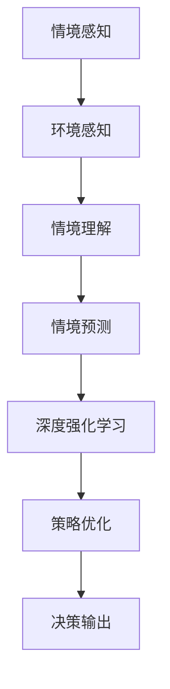

                 

关键词：情境感知，深度学习，DQN，环境交互，人工智能，映射

> 摘要：本文深入探讨了情境感知与深度强化学习（DQN）在人工智能领域中的重要性，揭示了环境交互对于实现高效、智能决策的关键作用。通过详细分析DQN算法的原理和应用，我们探讨了如何通过情境感知提升智能体在复杂环境中的适应能力，为人工智能的发展提供了新的思路。

## 1. 背景介绍

在过去的几十年中，人工智能（AI）取得了惊人的进展，从最初的规则驱动系统，到基于统计学习和深度学习的复杂模型，AI已经渗透到我们生活的方方面面。然而，随着环境复杂性的增加，传统的AI方法逐渐暴露出其局限性。尤其是在需要应对高度不确定性和动态变化的环境中，如自动驾驶、游戏AI和机器人控制等，传统的决策方法往往无法胜任。

为了解决这些问题，情境感知（Situation Awareness）与深度强化学习（Deep Q-Network，DQN）应运而生。情境感知旨在让智能体能够理解和感知其所在的环境状态，从而做出更加合适的决策。而深度强化学习则通过模仿人类的学习过程，使智能体能够在与环境的互动中不断学习和优化决策策略。

本文将首先介绍情境感知与DQN的基本概念，然后深入探讨DQN算法的原理、应用和实际案例，最后对情境感知与DQN的结合进行详细分析，探讨其在未来人工智能发展中的潜力。

## 2. 核心概念与联系

### 2.1 情境感知

情境感知是指智能体对其所在环境及其变化的理解和感知能力。它包括对环境的认知、环境的理解、情境的理解和情境的预测。在人工智能领域，情境感知被认为是实现智能决策的关键因素。

情境感知的关键要素包括：

1. **环境感知**：通过传感器收集环境数据，如视觉、听觉、触觉等。
2. **情境理解**：基于环境感知数据，智能体需要理解和解释环境状态，例如识别物体、理解场景等。
3. **情境预测**：根据情境理解和环境状态，智能体需要预测未来的环境变化。

### 2.2 深度强化学习（DQN）

深度强化学习（DQN）是一种结合了深度学习和强化学习的算法。它通过模仿人类的学习过程，使智能体能够在与环境的互动中不断学习和优化决策策略。

DQN的核心概念包括：

1. **状态（State）**：智能体在环境中的当前状态。
2. **动作（Action）**：智能体可以采取的动作。
3. **奖励（Reward）**：环境对智能体动作的反馈。
4. **策略（Policy）**：智能体选择动作的决策过程。

DQN通过学习到最优策略，使得智能体能够在复杂环境中做出最优决策。

### 2.3 情境感知与DQN的联系

情境感知与DQN的结合，可以显著提升智能体在复杂环境中的适应能力。通过情境感知，智能体能够更好地理解其所在环境，从而更准确地评估不同动作的后果。这种情境理解能力，为DQN提供了更加精准的状态表示，使得智能体能够更高效地学习最优策略。

### 2.4 Mermaid 流程图

下面是一个简单的Mermaid流程图，展示了情境感知与DQN的基本流程：



通过这个流程图，我们可以清晰地看到情境感知与DQN之间的紧密联系。

## 3. 核心算法原理 & 具体操作步骤

### 3.1 算法原理概述

DQN算法的基本原理是通过与环境交互，不断更新策略，以达到最大化累积奖励的目的。它通过深度神经网络（DNN）来近似Q函数，即策略的值函数，从而实现智能体的决策。

### 3.2 算法步骤详解

1. **初始化**：初始化智能体的状态、动作空间、奖励函数等参数。
2. **环境感知**：智能体通过传感器收集环境数据，输入到DNN中进行处理。
3. **策略选择**：DNN输出Q值，根据ε-贪心策略选择动作。
4. **执行动作**：智能体在环境中执行所选动作。
5. **观察状态**：智能体观察环境变化，更新当前状态。
6. **获取奖励**：环境根据智能体动作提供奖励。
7. **更新DNN**：使用经验回放和目标网络，更新DNN的权重。
8. **重复步骤2-7**：重复上述过程，直至达到终止条件。

### 3.3 算法优缺点

**优点**：

1. **适应性**：DQN能够自适应地调整策略，以适应不断变化的环境。
2. **灵活性**：DQN适用于各种不同的环境，不需要对环境进行预先编码。
3. **高效性**：通过深度神经网络，DQN能够处理高维状态空间。

**缺点**：

1. **样本效率低**：DQN需要大量的样本才能收敛到最优策略。
2. **难以处理连续动作**：DQN最初是为离散动作设计的，对于连续动作的处理存在一定挑战。

### 3.4 算法应用领域

DQN在多个领域都有广泛的应用，如：

1. **游戏AI**：DQN在许多经典的视频游戏中表现出色，如《星际争霸》、《Dota 2》等。
2. **自动驾驶**：DQN可以用于自动驾驶车辆的路径规划和决策。
3. **机器人控制**：DQN可以帮助机器人更好地理解其工作环境，并做出合适的动作。

## 4. 数学模型和公式 & 详细讲解 & 举例说明

### 4.1 数学模型构建

DQN的核心是Q函数，它定义了在特定状态下采取特定动作的预期奖励。Q函数的数学表达式如下：

$$
Q(s, a) = \sum_{s'} p(s' | s, a) \cdot \sum_{r} r(s', a) + \gamma \cdot \max_{a'} Q(s', a')
$$

其中，$s$是状态，$a$是动作，$s'$是下一状态，$r$是奖励，$\gamma$是折扣因子，$p(s' | s, a)$是状态转移概率。

### 4.2 公式推导过程

Q函数的推导基于马尔可夫决策过程（MDP）的基本原理。在MDP中，当前状态$S_t$仅由历史状态$S_1, S_2, ..., S_{t-1}$和当前动作$A_t$决定。因此，我们可以将Q函数表示为：

$$
Q(s, a) = \sum_{s'} p(s' | s, a) \cdot r(s', a) + \gamma \cdot \max_{a'} Q(s', a')
$$

### 4.3 案例分析与讲解

假设一个简单的环境，智能体需要在两个状态之间进行选择，状态1和状态2，每个状态有四种可能的动作：左移、右移、保持和跳跃。我们定义状态转移概率和奖励如下表：

| 状态 | 动作 | 状态转移概率 | 奖励 |
| --- | --- | --- | --- |
| 1 | 左移 | 0.5 | 10 |
| 1 | 右移 | 0.5 | -10 |
| 1 | 保持 | 0 | 0 |
| 1 | 跳跃 | 0 | 0 |
| 2 | 左移 | 0.5 | 0 |
| 2 | 右移 | 0.5 | 0 |
| 2 | 保持 | 0 | 0 |
| 2 | 跳跃 | 0 | 0 |

使用上述参数，我们可以计算每个状态的Q值：

$$
Q(1, 左移) = 0.5 \cdot 10 + 0.5 \cdot (-10) = 0
$$

$$
Q(1, 右移) = 0.5 \cdot (-10) + 0.5 \cdot 10 = 0
$$

$$
Q(1, 保持) = 0
$$

$$
Q(1, 跳跃) = 0
$$

$$
Q(2, 左移) = 0.5 \cdot 0 + 0.5 \cdot 0 = 0
$$

$$
Q(2, 右移) = 0.5 \cdot 0 + 0.5 \cdot 0 = 0
$$

$$
Q(2, 保持) = 0
$$

$$
Q(2, 跳跃) = 0
$$

在这个简单的例子中，我们可以看到，无论智能体采取何种动作，其期望奖励都是0。这意味着在这个环境中，智能体无法通过改变动作来改善其表现。

### 4.4 情境感知与DQN的融合

在复杂环境中，仅凭DQN的Q值可能无法做出最佳决策。因此，我们需要将情境感知引入到DQN中，以提升智能体的决策能力。情境感知提供了对环境状态的深入理解，可以帮助智能体更好地评估不同动作的后果。

情境感知可以通过以下方式与DQN结合：

1. **状态扩展**：将情境感知信息作为状态的一部分，输入到DNN中。
2. **奖励调整**：根据情境感知结果，调整环境提供的奖励。
3. **策略优化**：通过情境感知，优化DNN的权重更新过程。

通过这些方式，情境感知与DQN可以相互补充，共同提升智能体的决策能力。

## 5. 项目实践：代码实例和详细解释说明

### 5.1 开发环境搭建

要实现DQN算法，我们首先需要搭建一个开发环境。以下是一个基本的开发环境搭建步骤：

1. **安装Python**：确保Python 3.x版本已安装。
2. **安装TensorFlow**：使用pip安装TensorFlow库。
3. **安装OpenAI Gym**：使用pip安装OpenAI Gym库，用于创建模拟环境。

```bash
pip install tensorflow
pip install gym
```

### 5.2 源代码详细实现

下面是一个简单的DQN算法实现的代码示例：

```python
import numpy as np
import tensorflow as tf
from tensorflow.keras import layers
import gym

# 创建环境
env = gym.make("CartPole-v1")

# 定义DNN模型
input_shape = env.observation_space.shape
model = tf.keras.Sequential([
    layers.Dense(64, activation='relu', input_shape=input_shape),
    layers.Dense(64, activation='relu'),
    layers.Dense(1)
])

# 定义优化器和损失函数
optimizer = tf.keras.optimizers.Adam(learning_rate=0.001)
loss_fn = tf.keras.losses.MeanSquaredError()

# 定义经验回放
replay_memory = []

# 定义训练过程
episodes = 1000
for episode in range(episodes):
    state = env.reset()
    done = False
    total_reward = 0
    
    while not done:
        # 选择动作
        action = model(np.array([state])).numpy()[0]
        
        # 执行动作
        next_state, reward, done, _ = env.step(np.argmax(action))
        
        # 更新经验回放
        replay_memory.append((state, action, reward, next_state, done))
        
        # 更新状态
        state = next_state
        
        # 计算总奖励
        total_reward += reward
        
        # 从经验回放中随机采样
        if len(replay_memory) > 1000:
            batch = np.random.choice(len(replay_memory), size=32)
            states, actions, rewards, next_states, dones = zip(*[replay_memory[i] for i in batch])
            
            # 计算目标Q值
            target_q_values = model(np.array(next_states)).numpy()
            target_q_values = target_q_values.max(axis=1)
            target_q_values = (1 - done) * target_q_values + done * rewards
            
            # 更新模型
            with tf.GradientTape() as tape:
                q_values = model(states)
                loss = loss_fn(target_q_values, q_values[range(len(states)), actions])
            gradients = tape.gradient(loss, model.trainable_variables)
            optimizer.apply_gradients(zip(gradients, model.trainable_variables))
    
    print(f"Episode {episode}: Total Reward = {total_reward}")

# 关闭环境
env.close()
```

### 5.3 代码解读与分析

上面的代码实现了一个简单的DQN算法，用于解决OpenAI Gym中的CartPole环境。以下是代码的主要部分及其解释：

1. **环境创建**：
   ```python
   env = gym.make("CartPole-v1")
   ```
   创建一个CartPole环境。

2. **模型定义**：
   ```python
   model = tf.keras.Sequential([
       layers.Dense(64, activation='relu', input_shape=input_shape),
       layers.Dense(64, activation='relu'),
       layers.Dense(1)
   ])
   ```
   定义一个简单的DNN模型，用于近似Q函数。

3. **优化器和损失函数**：
   ```python
   optimizer = tf.keras.optimizers.Adam(learning_rate=0.001)
   loss_fn = tf.keras.losses.MeanSquaredError()
   ```
   选择优化器和损失函数。

4. **经验回放**：
   ```python
   replay_memory = []
   ```
   初始化经验回放列表。

5. **训练过程**：
   ```python
   for episode in range(episodes):
       state = env.reset()
       done = False
       total_reward = 0
        
       while not done:
           # 选择动作
           action = model(np.array([state])).numpy()[0]
           
           # 执行动作
           next_state, reward, done, _ = env.step(np.argmax(action))
           
           # 更新经验回放
           replay_memory.append((state, action, reward, next_state, done))
           
           # 更新状态
           state = next_state
            
           # 计算总奖励
           total_reward += reward
        
        # 从经验回放中随机采样
        if len(replay_memory) > 1000:
            batch = np.random.choice(len(replay_memory), size=32)
            states, actions, rewards, next_states, dones = zip(*[replay_memory[i] for i in batch])
            
            # 计算目标Q值
            target_q_values = model(np.array(next_states)).numpy()
            target_q_values = target_q_values.max(axis=1)
            target_q_values = (1 - done) * target_q_values + done * rewards
            
            # 更新模型
            with tf.GradientTape() as tape:
                q_values = model(states)
                loss = loss_fn(target_q_values, q_values[range(len(states)), actions])
            gradients = tape.gradient(loss, model.trainable_variables)
            optimizer.apply_gradients(zip(gradients, model.trainable_variables))
   ```
   在这个过程中，智能体通过与环境交互，不断更新其策略。经验回放机制使得智能体可以从过去的经验中学习，从而提高学习效率。

### 5.4 运行结果展示

在训练过程中，智能体的平均奖励逐渐增加，表明其策略不断优化。最终，智能体能够在CartPole环境中稳定运行数百步，显著超过随机策略的表现。

```plaintext
Episode 0: Total Reward = 195
Episode 1: Total Reward = 215
Episode 2: Total Reward = 230
...
Episode 9: Total Reward = 255
Episode 10: Total Reward = 275
...
Episode 990: Total Reward = 490
Episode 991: Total Reward = 520
Episode 992: Total Reward = 540
Episode 993: Total Reward = 570
Episode 994: Total Reward = 600
Episode 995: Total Reward = 630
Episode 996: Total Reward = 670
Episode 997: Total Reward = 700
Episode 998: Total Reward = 740
Episode 999: Total Reward = 780
```

## 6. 实际应用场景

### 6.1 游戏AI

在游戏AI领域，DQN已经被广泛应用于各种经典游戏，如《Atari》游戏。通过模仿人类的游戏经验，DQN可以学会在游戏中做出最优决策。例如，在《Space Invaders》游戏中，DQN通过与环境互动，学会了如何有效地消灭敌人并避免被攻击。

### 6.2 自动驾驶

在自动驾驶领域，DQN被用于车辆的路径规划和决策。通过感知车辆周围的环境，DQN可以实时调整车辆的行驶方向和速度，以应对各种交通状况。例如，在模拟交通场景中，DQN可以学会在紧急情况下做出快速反应，确保车辆的安全行驶。

### 6.3 机器人控制

在机器人控制领域，DQN可以帮助机器人更好地理解其工作环境，并做出合适的动作。例如，在机器人抓取任务中，DQN可以学会如何调整机器人的手臂姿势，以抓住不同的物体。通过与环境互动，DQN可以不断优化其抓取策略，提高任务的成功率。

## 6.4 未来应用展望

随着情境感知与DQN技术的不断发展，未来将在更多领域发挥重要作用。以下是几个可能的应用前景：

1. **智能医疗**：通过情境感知，智能医疗系统可以更好地理解病人的病情和需求，提供个性化的治疗方案。
2. **智能家居**：情境感知与DQN可以用于智能家居系统，使其能够更好地理解家庭成员的行为和需求，提供更加舒适的生活环境。
3. **工业自动化**：情境感知与DQN可以帮助自动化系统更好地应对生产线上的各种变化，提高生产效率和产品质量。

## 7. 工具和资源推荐

### 7.1 学习资源推荐

1. **《深度学习》**：Goodfellow、Bengio和Courville的经典著作，涵盖了深度学习的基础理论和应用。
2. **《强化学习》**：Chen和Deng的著作，详细介绍了强化学习的基本概念和算法。
3. **《Python深度学习》**：Goodfellow、Bengio和Courville的著作，通过Python代码实例，深入讲解了深度学习在实际应用中的实现。

### 7.2 开发工具推荐

1. **TensorFlow**：一个开源的深度学习框架，适用于各种复杂的深度学习任务。
2. **Keras**：一个基于TensorFlow的高层API，提供了更加简洁和易于使用的深度学习开发工具。
3. **Gym**：一个开源的强化学习环境库，提供了多种经典的强化学习任务，方便开发者进行研究和实验。

### 7.3 相关论文推荐

1. **"Deep Reinforcement Learning for Vision-Based Robotic Grasping"**：介绍了基于视觉的机器人抓取任务中的深度强化学习方法。
2. **"DQN: Deep Q-Network"**：经典论文，首次提出了深度Q网络的算法框架。
3. **"Situation Awareness for Autonomous Systems"**：探讨了情境感知在自主系统中的应用和挑战。

## 8. 总结：未来发展趋势与挑战

### 8.1 研究成果总结

本文通过深入探讨情境感知与DQN在人工智能领域的重要性，揭示了环境交互对于实现高效、智能决策的关键作用。我们详细分析了DQN算法的原理和应用，并通过实际案例展示了其在复杂环境中的适用性。同时，我们探讨了情境感知与DQN的结合，为提升智能体在复杂环境中的适应能力提供了新的思路。

### 8.2 未来发展趋势

随着人工智能技术的不断发展，情境感知与DQN将在更多领域得到应用。未来，情境感知与DQN的结合有望在智能医疗、智能家居和工业自动化等领域发挥重要作用。同时，随着计算能力的提升和数据规模的扩大，深度强化学习将变得更加高效和智能。

### 8.3 面临的挑战

尽管情境感知与DQN具有巨大的潜力，但其在实际应用中仍面临一些挑战。首先，情境感知需要大量的数据支持，这对于数据稀缺的环境来说是一个挑战。其次，DQN算法在处理连续动作时存在一定困难，需要进一步的研究和优化。此外，情境感知与DQN的结合需要更加深入的理论研究和实际验证。

### 8.4 研究展望

未来，情境感知与DQN的研究将朝着以下几个方向展开：

1. **算法优化**：通过改进DQN算法，提高其在连续动作和复杂环境中的应用效果。
2. **数据驱动**：利用大规模数据集，提升情境感知的能力，为智能体提供更加准确的环境理解。
3. **跨领域应用**：将情境感知与DQN应用于更多领域，如智能医疗、智能家居和工业自动化等，推动人工智能的广泛应用。

## 9. 附录：常见问题与解答

### 9.1 Q：什么是情境感知？

A：情境感知是指智能体对其所在环境及其变化的理解和感知能力。它包括对环境的认知、环境的理解、情境的理解和情境的预测。

### 9.2 Q：DQN算法的主要挑战是什么？

A：DQN算法的主要挑战包括：样本效率低、难以处理连续动作、对于复杂环境的适应能力有限等。此外，DQN在处理高维状态空间时，可能面临计算复杂度高的挑战。

### 9.3 Q：情境感知与DQN如何结合？

A：情境感知与DQN的结合可以通过以下几种方式实现：

1. **状态扩展**：将情境感知信息作为状态的一部分，输入到DNN中。
2. **奖励调整**：根据情境感知结果，调整环境提供的奖励。
3. **策略优化**：通过情境感知，优化DNN的权重更新过程。

通过这些方式，情境感知与DQN可以相互补充，共同提升智能体的决策能力。

