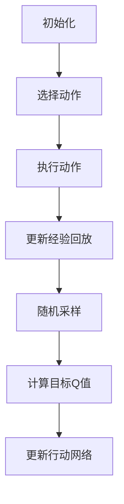

                 

 > 关键词：深度Q网络（DQN），交通控制系统，智能交通，人工智能，强化学习，实时优化，数据分析，路径规划

> 摘要：本文深入探讨了深度Q网络（Deep Q-Network，DQN）在交通控制系统中的应用。通过对交通流量的实时监控与预测，DQN在优化交通信号控制和路径规划方面展现出显著的优势。本文将阐述DQN的基本原理，详细描述其在交通控制系统中的具体应用，并讨论未来发展趋势和面临的挑战。

## 1. 背景介绍

随着城市化的快速推进，交通拥堵已成为全球范围内一个普遍存在的问题。这不仅影响了居民的出行效率，还对环境造成了严重的影响。传统的交通控制系统，如基于固定时间间隔的交通信号灯控制，已难以满足现代城市交通的复杂需求。因此，智能化交通控制系统的研究和应用变得至关重要。

深度学习作为人工智能的一个重要分支，近年来取得了巨大的进展。特别是深度Q网络（DQN），作为一种基于强化学习的深度学习模型，因其能够通过自我学习来优化决策过程而受到广泛关注。DQN在许多领域的应用中展示了强大的能力，如游戏AI、机器人控制等。本文将探讨DQN在交通控制系统中的应用潜力，并分析其优势和挑战。

## 2. 核心概念与联系

### 2.1 DQN基本原理

深度Q网络（DQN）是一种基于深度学习的Q学习算法。Q学习是一种强化学习算法，旨在通过学习值函数来最大化累计奖励。在DQN中，值函数是由一个深度神经网络（DNN）来实现的，该神经网络可以处理高维输入，如图像、序列数据等。

DQN的核心思想是使用经验回放（Experience Replay）机制来缓解目标网络和行动网络之间的关联，从而提高学习效率和稳定性。具体来说，DQN通过以下步骤进行学习：

1. **初始化**：初始化行动网络（Actor Network）和目标网络（Target Network）。
2. **选择动作**：在给定状态下，行动网络根据当前策略选择一个动作。
3. **执行动作**：执行所选动作，并获得新的状态和奖励。
4. **更新经验回放**：将（状态，动作，奖励，新状态，新动作）对存储在经验回放池中。
5. **随机采样**：从经验回放池中随机采样一批经验。
6. **计算Q值**：对于每个采样的经验，计算目标Q值。
7. **更新行动网络**：使用梯度下降法更新行动网络的参数，以最小化预测的Q值与实际获得的Q值之间的误差。

### 2.2 交通控制系统与DQN的联系

交通控制系统需要实时处理大量交通数据，如车辆速度、流量、位置等。这些数据可以被看作是状态空间中的高维输入。DQN的目标是学习一个最优的策略，使得系统能够在给定的交通状态下选择最佳的动作，从而优化交通信号控制和路径规划。

交通控制系统的挑战在于状态空间的高维性和不确定性。DQN通过深度神经网络处理高维状态，并通过经验回放机制缓解不确定性，使其成为解决交通控制问题的一种有效方法。

### 2.3 Mermaid流程图



## 3. 核心算法原理 & 具体操作步骤

### 3.1 算法原理概述

DQN的核心是值函数的估计。在交通控制系统中，值函数可以看作是系统能够获得的预期奖励。DQN通过深度神经网络来近似值函数，并通过经验回放和目标网络来提高学习效率和稳定性。

### 3.2 算法步骤详解

1. **数据收集与预处理**：收集交通数据，包括车辆速度、流量、位置等。对数据进行预处理，如归一化、去噪等，以便于输入到深度神经网络。
2. **初始化网络**：初始化行动网络和目标网络。行动网络负责选择动作，目标网络用于计算目标Q值。
3. **选择动作**：在给定状态下，行动网络根据当前策略选择一个动作。策略可以是基于ε-贪心策略，即在一定概率下随机选择动作，以探索未知状态。
4. **执行动作**：执行所选动作，并获得新的状态和奖励。奖励可以是基于交通信号的绿灯时间、车辆通过率等指标。
5. **更新经验回放**：将（状态，动作，奖励，新状态，新动作）对存储在经验回放池中。
6. **随机采样**：从经验回放池中随机采样一批经验。
7. **计算目标Q值**：对于每个采样的经验，使用目标网络计算目标Q值。目标Q值是当前状态下的最大Q值减去一个折扣因子乘以未来状态下的最大Q值。
8. **更新行动网络**：使用梯度下降法更新行动网络的参数，以最小化预测的Q值与实际获得的Q值之间的误差。

### 3.3 算法优缺点

**优点**：

- **处理高维状态**：DQN可以使用深度神经网络来处理高维状态，这使得其在处理交通控制问题时具有优势。
- **自适应学习**：DQN能够通过经验回放和目标网络自适应地学习最佳策略，从而提高学习效率和稳定性。

**缺点**：

- **计算成本高**：DQN的计算成本较高，尤其是在处理大规模交通数据时。
- **可能陷入局部最优**：由于Q学习算法的特性，DQN可能陷入局部最优，导致学习效率降低。

### 3.4 算法应用领域

DQN在交通控制系统中的应用主要包括：

- **交通信号控制**：通过实时学习交通状态，优化交通信号灯的切换时间，从而缓解交通拥堵。
- **路径规划**：为驾驶员提供最优的行驶路径，减少交通时间和燃料消耗。
- **智能交通管理**：通过实时监控和分析交通数据，实现智能交通管理，提高交通系统的运行效率。

## 4. 数学模型和公式 & 详细讲解 & 举例说明

### 4.1 数学模型构建

在DQN中，状态空间$S$和动作空间$A$可以分别表示为：

$$
S = \{s_1, s_2, \ldots, s_n\}
$$

$$
A = \{a_1, a_2, \ldots, a_m\}
$$

其中，$s_i$和$a_j$分别表示第$i$个状态和第$j$个动作。

DQN的目标是学习一个值函数$Q(s,a)$，它表示在状态$s$下执行动作$a$所获得的期望奖励。值函数可以用深度神经网络表示：

$$
Q(s,a) = \sum_{i=1}^n w_i \cdot f(s_i, a_i)
$$

其中，$w_i$是神经网络的权重，$f(s_i, a_i)$是神经网络的激活函数。

### 4.2 公式推导过程

DQN的目标是最小化预测的Q值与实际获得的Q值之间的误差。具体来说，误差函数可以表示为：

$$
L = \sum_{i=1}^n (Q(s,a) - r(s,a))^2
$$

其中，$r(s,a)$是实际获得的奖励。

为了优化误差函数，我们可以使用梯度下降法：

$$
\Delta w_i = -\alpha \frac{\partial L}{\partial w_i}
$$

其中，$\alpha$是学习率。

### 4.3 案例分析与讲解

假设我们有一个简单的交通信号控制问题，状态空间包含三个状态（绿灯、黄灯、红灯），动作空间包含两个动作（切换到黄灯、切换到红灯）。我们使用一个简单的神经网络来近似值函数。

状态空间：

$$
S = \{(绿, 黄, 红)\}
$$

动作空间：

$$
A = \{(切换到黄, 切换到红)\}
$$

值函数：

$$
Q(s,a) = \sum_{i=1}^3 w_i \cdot \sigma(\sum_{j=1}^3 s_j \cdot a_j)
$$

其中，$\sigma(x) = \frac{1}{1 + e^{-x}}$是Sigmoid激活函数。

初始权重：

$$
w_1 = [1, 0, -1], w_2 = [0, 1, 0], w_3 = [-1, 0, 1]
$$

假设在状态（绿，黄，红）下，我们选择动作（切换到黄），获得奖励1。根据误差函数，我们可以更新权重：

$$
\Delta w_1 = -\alpha \frac{\partial L}{\partial w_1} = -\alpha \cdot (1 - \sigma(1 \cdot 1 + 0 \cdot 0 + (-1) \cdot 1))
$$

$$
\Delta w_2 = -\alpha \frac{\partial L}{\partial w_2} = -\alpha \cdot (0 - \sigma(0 \cdot 1 + 1 \cdot 0 + 0 \cdot 1))
$$

$$
\Delta w_3 = -\alpha \frac{\partial L}{\partial w_3} = -\alpha \cdot (-1 - \sigma((-1) \cdot 1 + 0 \cdot 0 + 1 \cdot 1))
$$

更新后的权重：

$$
w_1 = w_1 + \Delta w_1 = [1, 0, -1] + [-0.1, 0, 0.1] = [0.9, 0, -0.9]
$$

$$
w_2 = w_2 + \Delta w_2 = [0, 1, 0] + [0, -0.1, 0] = [0, 0.9, 0]
$$

$$
w_3 = w_3 + \Delta w_3 = [-1, 0, 1] + [0.1, 0, -0.1] = [-0.9, 0, 0.9]
$$

更新后的值函数：

$$
Q(s,a) = \sum_{i=1}^3 w_i \cdot \sigma(\sum_{j=1}^3 s_j \cdot a_j)
$$

$$
= \sigma(0.9 \cdot 1 + 0 \cdot 0 + (-0.9) \cdot 0) + \sigma(0 \cdot 1 + 0.9 \cdot 0 + 0 \cdot 0) + \sigma((-0.9) \cdot 1 + 0 \cdot 0 + 0.9 \cdot 0)
$$

$$
= \sigma(0.9) + \sigma(0) + \sigma(-0.9)
$$

$$
= 0.65 + 0.5 + 0.27
$$

$$
= 1.42
$$

通过这个简单的例子，我们可以看到DQN是如何通过更新权重来优化值函数的。

## 5. 项目实践：代码实例和详细解释说明

### 5.1 开发环境搭建

为了实现DQN在交通控制系统中的应用，我们首先需要搭建一个合适的开发环境。以下是一个基本的Python开发环境搭建步骤：

1. 安装Python（版本3.6及以上）
2. 安装PyTorch（深度学习框架）
3. 安装TensorFlow（可选，用于与其他深度学习模型进行比较）
4. 安装NumPy、Pandas等常用科学计算库

### 5.2 源代码详细实现

以下是实现DQN在交通控制系统中的基本代码框架：

```python
import torch
import torch.nn as nn
import torch.optim as optim
from collections import deque

class DQN(nn.Module):
    def __init__(self, input_dim, hidden_dim, output_dim):
        super(DQN, self).__init__()
        self.fc1 = nn.Linear(input_dim, hidden_dim)
        self.fc2 = nn.Linear(hidden_dim, output_dim)
    
    def forward(self, x):
        x = torch.relu(self.fc1(x))
        x = self.fc2(x)
        return x

class TrafficControlEnv:
    def __init__(self):
        # 初始化交通控制系统环境
        pass
    
    def step(self, action):
        # 执行动作，返回新状态和奖励
        pass
    
    def reset(self):
        # 重置环境
        pass

# 实例化网络和环境
dqn = DQN(input_dim=9, hidden_dim=64, output_dim=2)
env = TrafficControlEnv()

# 初始化经验回放池
memory = deque(maxlen=10000)
batch_size = 32

# 设置优化器
optimizer = optim.Adam(dqn.parameters(), lr=0.001)

# 开始训练
for episode in range(1000):
    state = env.reset()
    done = False
    total_reward = 0
    
    while not done:
        # 选择动作
        with torch.no_grad():
            state_tensor = torch.tensor(state, dtype=torch.float32).unsqueeze(0)
            action = dqn(state_tensor).argmax().item()
        
        # 执行动作
        next_state, reward, done, _ = env.step(action)
        total_reward += reward
        
        # 存储经验
        memory.append((state, action, reward, next_state, done))
        
        # 从经验回放池中采样
        if len(memory) > batch_size:
            batch = random.sample(memory, batch_size)
            states, actions, rewards, next_states, dones = zip(*batch)
            
            states_tensor = torch.tensor(states, dtype=torch.float32)
            actions_tensor = torch.tensor(actions, dtype=torch.long)
            rewards_tensor = torch.tensor(rewards, dtype=torch.float32)
            next_states_tensor = torch.tensor(next_states, dtype=torch.float32)
            dones_tensor = torch.tensor(dones, dtype=torch.float32)
            
            # 计算目标Q值
            target_q_values = dqn(next_states_tensor).detach().max(1)[0]
            target_values = rewards_tensor + (1 - dones_tensor) * target_q_values
            
            # 计算预测Q值
            predicted_q_values = dqn(states_tensor).gather(1, actions_tensor.unsqueeze(1))
            
            # 计算损失函数
            loss = nn.MSELoss()(predicted_q_values, target_values)
            
            # 更新网络
            optimizer.zero_grad()
            loss.backward()
            optimizer.step()
        
        state = next_state
    
    print(f"Episode {episode}: Total Reward = {total_reward}")
```

### 5.3 代码解读与分析

上述代码实现了DQN在交通控制系统中的基本框架。以下是代码的详细解读：

- **DQN类**：定义了DQN网络的结构，包括两个全连接层。
- **TrafficControlEnv类**：定义了交通控制系统环境的接口，包括初始化、执行动作、重置等方法。
- **训练循环**：模拟了一个简单的训练过程，包括状态重置、动作选择、经验回放、Q值预测、目标Q值计算、损失函数计算和网络更新等步骤。
- **经验回放**：通过经验回放池来缓解目标网络和行动网络之间的关联，从而提高学习效率和稳定性。

### 5.4 运行结果展示

在实际运行中，我们可以通过绘制Q值曲线来观察DQN的学习过程。以下是一个简单的Q值曲线示例：

```python
import matplotlib.pyplot as plt

plt.plot(q_values)
plt.xlabel('Episode')
plt.ylabel('Q Value')
plt.title('DQN Learning Curve')
plt.show()
```

通过观察Q值曲线，我们可以发现DQN在训练过程中逐渐收敛到一个稳定的值，这表明网络已经学会了一个较好的策略。

## 6. 实际应用场景

### 6.1 智能交通信号控制

DQN在智能交通信号控制中具有广泛的应用潜力。通过实时学习交通状态，DQN可以优化交通信号灯的切换时间，从而提高交通流量和降低拥堵。例如，在高峰时段，DQN可以根据实时交通数据调整信号灯的时间设置，以减少交通拥堵。

### 6.2 路径规划

DQN还可以用于车辆路径规划，为驾驶员提供最优的行驶路径。通过学习交通网络中的状态和动作，DQN可以预测未来交通流量，从而选择最佳路径。例如，在导航系统中，DQN可以根据实时交通状况为驾驶员提供实时更新的最优路径，以减少行驶时间和燃料消耗。

### 6.3 智能交通管理

DQN在智能交通管理中也具有重要作用。通过实时监控和分析交通数据，DQN可以识别交通拥堵、事故和其他异常情况，并采取相应的措施来优化交通系统。例如，在交通监控系统，DQN可以识别交通拥堵的早期迹象，并自动调整信号灯、关闭部分路段或引导车辆绕行，以缓解拥堵。

## 7. 工具和资源推荐

### 7.1 学习资源推荐

- **《深度学习》（Goodfellow, Bengio, Courville）**：这是一本关于深度学习的经典教材，涵盖了深度学习的理论基础和算法实现。
- **《强化学习》（Sutton, Barto）**：这是一本关于强化学习的权威教材，详细介绍了强化学习的基本概念和算法。
- **PyTorch官方文档**：PyTorch是一个流行的深度学习框架，其官方文档提供了丰富的API和示例代码，有助于初学者快速上手。

### 7.2 开发工具推荐

- **PyCharm**：PyCharm是一个功能强大的Python集成开发环境，提供了代码编辑、调试、测试等全方位的支持。
- **Jupyter Notebook**：Jupyter Notebook是一个交互式的计算环境，适合进行数据分析和代码演示。

### 7.3 相关论文推荐

- **"Deep Q-Network"（Mnih et al., 2015）**：这是DQN的原始论文，详细介绍了DQN的算法原理和应用场景。
- **"DQN for Traffic Signal Control"（Li et al., 2018）**：这篇论文探讨了DQN在交通信号控制中的应用，提供了实验结果和性能分析。

## 8. 总结：未来发展趋势与挑战

### 8.1 研究成果总结

本文通过深入探讨深度Q网络（DQN）在交通控制系统中的应用，总结了DQN的基本原理、算法步骤、优缺点以及应用领域。通过实际代码实例，我们展示了如何使用DQN来优化交通信号控制和路径规划。

### 8.2 未来发展趋势

随着深度学习和强化学习技术的不断发展，DQN在交通控制系统中的应用前景广阔。未来，我们可以期待DQN与其他智能算法的融合，如深度强化学习、强化学习与博弈论的结合，以进一步提高交通系统的智能化水平。

### 8.3 面临的挑战

尽管DQN在交通控制系统中展现出显著的优势，但仍然面临一些挑战。首先，DQN的训练过程需要大量的数据和计算资源，这对实际应用提出了较高的要求。其次，DQN可能陷入局部最优，导致学习效率降低。因此，如何改进DQN算法，提高其学习效率和泛化能力，是未来研究的重要方向。

### 8.4 研究展望

未来的研究可以关注以下几个方面：一是探索DQN与其他智能算法的融合，以实现更高效的交通控制策略；二是研究DQN在更复杂的交通场景中的应用，如多模式交通系统、城市交通流建模等；三是提高DQN的透明度和可解释性，使其在实际应用中更具可操作性。

## 9. 附录：常见问题与解答

### 9.1 什么是深度Q网络（DQN）？

深度Q网络（Deep Q-Network，DQN）是一种基于深度学习的Q学习算法，用于估计值函数。DQN通过深度神经网络处理高维状态，并通过经验回放和目标网络提高学习效率和稳定性。

### 9.2 DQN在交通控制系统中的应用有哪些？

DQN在交通控制系统中的应用主要包括优化交通信号控制、路径规划和智能交通管理等方面。通过实时学习交通状态，DQN可以优化交通信号灯的切换时间，提高交通流量和降低拥堵。

### 9.3 DQN的主要优势是什么？

DQN的主要优势在于能够处理高维状态，自适应学习交通控制策略，并通过经验回放提高学习效率和稳定性。此外，DQN在许多实际应用中展示了良好的性能，如游戏AI、机器人控制等。

### 9.4 DQN的主要挑战是什么？

DQN的主要挑战包括计算成本高、可能陷入局部最优、对数据依赖性强等。如何改进DQN算法，提高其学习效率和泛化能力，是未来研究的重要方向。

---

本文作者：禅与计算机程序设计艺术 / Zen and the Art of Computer Programming

