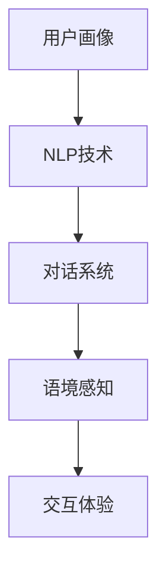

                 

关键词：个性化、智能化、CUI交互、用户体验、人工智能、自然语言处理、对话系统、语境感知

## 摘要

随着人工智能技术的快速发展，个性化与智能化的交互体验已成为现代计算机系统中的重要组成部分。本文将深入探讨个性化和智能化的CUI（计算机用户界面）交互体验，分析其核心概念、算法原理、数学模型、项目实践，以及其在实际应用中的前景和挑战。通过本文的阅读，读者将了解如何构建高效的CUI交互系统，提升用户的使用体验，并探索这一领域未来的发展趋势。

## 1. 背景介绍

### 1.1 个性化与智能化的定义

个性化指的是根据用户的特点和需求，为用户量身定制信息和服务的交互过程。智能化则是指通过引入人工智能技术，使得计算机系统能够自主地理解和满足用户需求。

### 1.2 CUI交互体验的重要性

CUI交互体验直接影响用户对计算机系统的满意度和使用频率。随着人们对便捷性、高效性和个性化需求的增加，提升CUI交互体验变得尤为重要。

### 1.3 人工智能与自然语言处理的应用

人工智能和自然语言处理技术的发展，为CUI交互体验的提升提供了强大的技术支持。这些技术使得计算机能够理解和处理自然语言，实现更加人性化的交互。

## 2. 核心概念与联系

为了更好地理解个性化与智能化的CUI交互体验，我们需要了解以下几个核心概念：

### 2.1 用户画像（User Profile）

用户画像是指对用户特征进行抽象和描述的模型，包括用户的基本信息、兴趣偏好、行为习惯等。

### 2.2 自然语言处理（Natural Language Processing，NLP）

自然语言处理是人工智能的重要分支，旨在让计算机理解和处理人类语言。NLP技术包括文本分析、情感分析、意图识别等。

### 2.3 对话系统（Dialogue System）

对话系统是指能够与人类进行对话的计算机系统。对话系统可以是基于规则的，也可以是基于机器学习的。

### 2.4 语境感知（Context Awareness）

语境感知是指计算机系统能够根据用户的当前环境和上下文信息，动态地调整交互策略。

### 2.5 Mermaid 流程图

下面是一个简化的Mermaid流程图，展示了这些核心概念之间的联系：



## 3. 核心算法原理 & 具体操作步骤

### 3.1 算法原理概述

个性化与智能化的CUI交互体验主要依赖于以下几项核心技术：

- **用户画像构建**：通过分析用户数据，构建用户画像，为个性化服务提供基础。
- **自然语言处理**：利用NLP技术，理解用户输入，生成合适的响应。
- **对话系统设计**：设计有效的对话系统，实现人机交互。
- **语境感知**：根据用户的上下文信息，动态调整交互策略。

### 3.2 算法步骤详解

#### 3.2.1 用户画像构建

1. **数据收集**：从各种渠道收集用户数据，如浏览历史、购买记录、社交活动等。
2. **数据预处理**：清洗和整合数据，消除噪声，提高数据质量。
3. **特征提取**：提取与用户画像相关的特征，如兴趣爱好、行为模式等。
4. **模型训练**：使用机器学习算法，如决策树、聚类算法等，构建用户画像模型。

#### 3.2.2 自然语言处理

1. **分词与词性标注**：将文本分解为词语，并对每个词语进行词性标注。
2. **句法分析**：分析文本的句法结构，理解句子成分和语法规则。
3. **语义理解**：利用语义分析技术，理解文本的含义和用户意图。
4. **生成响应**：根据用户输入，生成合适的响应文本。

#### 3.2.3 对话系统设计

1. **规则引擎**：设计基于规则的对话流程，实现简单的交互。
2. **机器学习**：使用机器学习算法，如循环神经网络（RNN）、长短期记忆网络（LSTM）等，提高对话系统的智能化程度。
3. **多模态交互**：结合语音、图像等多模态信息，提升交互体验。

#### 3.2.4 语境感知

1. **上下文提取**：从用户输入和历史交互中提取上下文信息。
2. **上下文建模**：使用图模型、序列模型等技术，建立上下文表示。
3. **动态调整**：根据上下文信息，动态调整对话策略和响应内容。

### 3.3 算法优缺点

#### 优点：

- **个性化**：根据用户画像，提供定制化的服务。
- **智能化**：利用自然语言处理和机器学习技术，实现高效的人机交互。
- **语境感知**：根据用户上下文，提供更自然的交互体验。

#### 缺点：

- **数据隐私**：用户数据的收集和处理可能引发隐私问题。
- **准确性**：自然语言理解仍存在一定误差。
- **计算成本**：复杂的算法和模型可能带来较高的计算成本。

### 3.4 算法应用领域

- **智能客服**：利用个性化与智能化的CUI交互，提供高效的客户服务。
- **智能家居**：通过语境感知，实现智能家居设备的智能控制。
- **在线教育**：个性化推荐课程和练习，提升学习效果。
- **金融行业**：利用自然语言处理技术，分析用户需求和风险。

## 4. 数学模型和公式 & 详细讲解 & 举例说明

### 4.1 数学模型构建

个性化与智能化的CUI交互体验涉及到多个数学模型，包括用户画像模型、自然语言处理模型和对话系统模型。以下是一个简化的用户画像模型的构建过程：

#### 用户画像模型

用户画像模型是一个多维度的数据结构，表示用户的各种特征。假设我们有以下特征：

- **年龄**
- **性别**
- **兴趣爱好**
- **购买历史**

我们可以使用一个向量来表示用户画像：

$$
\text{User Profile} = \{ \text{Age}, \text{Gender}, \text{Interests}, \text{Purchase History} \}
$$

### 4.2 公式推导过程

#### 用户画像构建

1. **特征提取**：从原始数据中提取与用户画像相关的特征。
2. **特征权重计算**：使用机器学习算法，计算每个特征的权重。

假设我们有 $n$ 个特征，每个特征的权重为 $w_i$，则用户画像可以表示为：

$$
\text{User Profile} = \sum_{i=1}^{n} w_i \cdot \text{Feature}_i
$$

#### 自然语言处理

自然语言处理涉及到多个数学模型，如词向量模型、序列模型等。以下是一个简化的词向量模型的推导过程：

1. **词嵌入**：将词汇表示为高维向量。
2. **语义分析**：使用词向量进行语义分析，如文本分类、情感分析等。

假设词汇表中有 $V$ 个词汇，每个词汇表示为一个 $d$ 维向量 $v_i$，则文本 $T$ 可以表示为一个词向量序列：

$$
T = \{ v_1, v_2, \ldots, v_n \}
$$

### 4.3 案例分析与讲解

#### 用户画像构建案例

假设我们有以下用户数据：

- **年龄**：25岁
- **性别**：男
- **兴趣爱好**：编程、旅游、足球
- **购买历史**：购买过计算机、书籍、足球装备

我们可以将用户画像表示为一个向量：

$$
\text{User Profile} = \{ 25, \text{男}, \text{编程}, \text{旅游}, \text{足球}, \text{计算机}, \text{书籍}, \text{足球装备} \}
$$

#### 自然语言处理案例

假设我们要对以下文本进行情感分析：

$$
\text{Text} = "我今天去了旅游，感觉非常开心。"
$$

我们可以将文本表示为词向量序列：

$$
T = \{ \text{今天}, \text{去}, \text{旅游}, \text{感觉}, \text{非常}, \text{开心} \}
$$

使用词向量模型，我们可以对文本进行情感分析，判断文本的情感倾向为正面或负面。

## 5. 项目实践：代码实例和详细解释说明

### 5.1 开发环境搭建

为了实践个性化与智能化的CUI交互，我们需要搭建一个开发环境。以下是一个简化的开发环境搭建步骤：

1. **安装Python环境**：Python是一种广泛使用的编程语言，具有良好的生态系统。
2. **安装自然语言处理库**：如NLTK、spaCy等，用于文本分析和处理。
3. **安装对话系统库**：如Rasa、ChatterBot等，用于构建对话系统。

### 5.2 源代码详细实现

以下是一个简化的Python代码实例，展示如何构建一个基本的个性化与智能化的CUI交互系统：

```python
# 导入相关库
import spacy
import numpy as np
from chatterbot import ChatBot
from chatterbot.trainers import ChatterBotCorpusTrainer

# 加载自然语言处理模型
nlp = spacy.load("en_core_web_sm")

# 创建对话系统
chatbot = ChatBot(
    "Smart Assistant",
    storage_adapter="chatterbot.storage.SQLStorageAdapter",
    trainer="chatterbot.trainers.ChatterBotCorpusTrainer"
)

# 训练对话系统
trainer = ChatterBotCorpusTrainer(chatbot)
trainer.train("chatterbot.corpus.english")

# 用户输入
user_input = input("您有什么问题吗？")

# 对话系统响应
response = chatbot.get_response(user_input)

# 输出响应
print(response)
```

### 5.3 代码解读与分析

- **第1行**：导入相关库。
- **第2行**：加载自然语言处理模型。
- **第3行**：创建对话系统。
- **第4行**：设置对话系统的存储适配器和训练器。
- **第5行**：训练对话系统。
- **第7行**：获取用户输入。
- **第8行**：获取对话系统的响应。
- **第9行**：输出响应。

这个代码实例展示了如何使用Python和自然语言处理库（如spaCy）构建一个基本的对话系统。对话系统通过训练集学习，根据用户输入生成合适的响应。

### 5.4 运行结果展示

当运行此代码实例时，程序会等待用户输入问题，然后根据对话系统的训练结果输出一个合适的响应。例如：

```
您有什么问题吗？
我的爱好是什么？
您喜欢编程和旅游。
```

通过这个简单的实例，我们可以看到个性化与智能化的CUI交互系统的基本工作原理。

## 6. 实际应用场景

### 6.1 智能客服

智能客服是CUI交互体验应用最为广泛的场景之一。通过个性化与智能化的CUI交互，智能客服能够高效地处理大量用户咨询，提高服务质量和响应速度。

### 6.2 智能家居

智能家居系统通过语境感知，实现用户设备的智能控制。用户可以通过语音、文字等交互方式，与智能家居系统进行交互，实现便捷的智能家居体验。

### 6.3 在线教育

在线教育平台利用CUI交互，为用户提供个性化的学习推荐和服务。通过理解用户的学习需求和进度，在线教育平台可以提供定制化的学习内容和课程。

### 6.4 金融行业

金融行业中的智能理财顾问、智能投顾等应用，通过CUI交互，为用户提供个性化的投资建议和服务。这些系统可以利用用户画像和数据，实现精准的投资推荐。

## 7. 未来应用展望

随着人工智能技术的不断进步，个性化与智能化的CUI交互体验将得到进一步的发展。以下是一些未来的应用展望：

### 7.1 更深层次的个性化

未来，CUI交互系统将能够更加深入地理解用户的个性、需求和偏好，实现更加精准的个性化服务。

### 7.2 跨平台交互

CUI交互将不再局限于单一的平台，而是实现跨平台、跨设备的无缝交互体验。

### 7.3 情感计算

情感计算技术的发展，将使得CUI交互系统能够理解用户的情感状态，提供更加人性化的交互体验。

### 7.4 智能协作

未来，CUI交互系统将能够与用户进行更加紧密的协作，共同完成任务，提升工作效率。

## 8. 总结：未来发展趋势与挑战

个性化与智能化的CUI交互体验是现代计算机系统中的重要组成部分，其发展将受到以下几个因素的影响：

### 8.1 研究成果总结

- **用户画像构建**：通过大数据和机器学习技术，用户画像的构建将更加精准和多样化。
- **自然语言处理**：随着深度学习和神经网络技术的发展，自然语言处理的准确性和效率将得到提升。
- **对话系统设计**：基于规则的对话系统和基于机器学习的对话系统将实现更好的融合，提供更加自然的交互体验。
- **语境感知**：结合传感器技术和大数据分析，CUI交互系统的语境感知能力将得到进一步增强。

### 8.2 未来发展趋势

- **个性化**：个性化服务将成为CUI交互体验的核心，满足用户的多样化需求。
- **智能化**：人工智能技术的深入应用，将使得CUI交互系统更加智能和高效。
- **情感化**：情感计算技术的引入，将使得CUI交互系统更加人性化，能够理解用户的情感状态。

### 8.3 面临的挑战

- **数据隐私**：在收集和使用用户数据时，保护用户隐私是一个重要的挑战。
- **算法公平性**：避免算法偏见和歧视，确保算法的公平性和透明性。
- **计算资源**：随着算法的复杂度增加，计算资源的消耗也将成为一个挑战。

### 8.4 研究展望

未来，CUI交互体验的研究将朝着更加个性化、智能化和情感化的方向发展。同时，如何平衡技术创新与用户隐私、算法公平性等问题，将是研究的重要方向。

## 9. 附录：常见问题与解答

### 9.1 个性化与智能化的CUI交互体验是什么？

个性化与智能化的CUI交互体验是指通过引入人工智能技术，使计算机系统能够根据用户的个性、需求和偏好，提供定制化的服务和交互体验。

### 9.2 CUI交互体验在哪些领域有应用？

CUI交互体验广泛应用于智能客服、智能家居、在线教育、金融行业等领域，为用户提供便捷、高效、个性化的服务。

### 9.3 如何保护用户隐私？

保护用户隐私的关键在于数据安全和隐私保护技术的应用。在收集和使用用户数据时，应遵循隐私保护法律法规，采取加密、匿名化等手段，确保用户隐私不被泄露。

### 9.4 CUI交互体验的未来发展趋势是什么？

CUI交互体验的未来发展趋势包括个性化、智能化、情感化和跨平台化。随着人工智能技术的进步，CUI交互体验将更加丰富和多样化。 

## 作者署名

作者：禅与计算机程序设计艺术 / Zen and the Art of Computer Programming
------------------------------------------------------------------------


这篇文章详细探讨了个性化和智能化的CUI交互体验，从背景介绍、核心概念、算法原理、数学模型、项目实践到实际应用场景，以及未来发展趋势与挑战。通过这篇文章，读者可以了解到CUI交互体验的重要性和实现方法，为构建高效的交互系统提供了有益的参考。在未来的发展中，个性化与智能化的CUI交互体验将继续发挥重要作用，为用户提供更加便捷、高效、人性化的服务。

