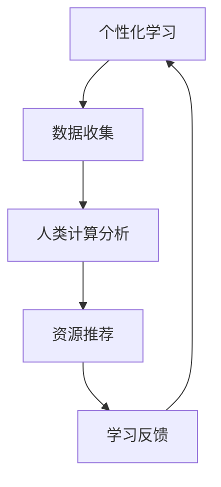

                 

关键词：个性化学习，人类计算，教育变革，技术应用，算法模型，数学公式，代码实例，未来展望。

> 摘要：本文旨在探讨个性化学习在当今教育领域的重要性，以及人类计算在实现这一目标中的关键作用。通过深入分析核心概念、算法原理、数学模型和项目实践，本文将阐述个性化学习如何通过技术手段为教育带来深刻的变革。

## 1. 背景介绍

随着信息技术的飞速发展，教育领域正经历着一场前所未有的变革。传统的“一刀切”教学模式已经无法满足个性化、差异化学习的需求。个性化学习，作为一种新兴的教育理念，正逐渐成为教育变革的核心驱动力。个性化学习强调根据学生的个体差异，为其提供量身定制的学习路径、资源和指导，从而最大化其学习效果。

在这个背景下，人类计算作为一种强大的人工智能技术，开始在教育领域中发挥重要作用。人类计算通过模拟人类的认知过程，实现对复杂问题的求解和推理，为个性化学习提供了坚实的技术支持。本文将围绕个性化学习这一主题，探讨人类计算在教育变革中的关键作用。

## 2. 核心概念与联系

### 2.1 个性化学习

个性化学习是指根据学生的兴趣、能力和学习风格，为其提供个性化的学习方案。个性化学习不仅关注学习内容的选择和呈现方式，还包括学习进程的监控和调整。

### 2.2 人类计算

人类计算是一种模拟人类认知过程的人工智能技术，包括逻辑推理、问题求解、知识表示和自动化学习等。人类计算的核心在于模拟人类大脑的工作方式，实现对复杂问题的处理。

### 2.3 个性化学习与人类计算的联系

个性化学习需要通过人类计算技术来实现。人类计算提供了对学习者个体差异的识别和分析能力，从而为个性化学习提供数据支持。同时，人类计算还可以通过自动化的方式，为学生提供个性化的学习资源和指导，实现教育资源的优化配置。

### 2.4 Mermaid 流程图



## 3. 核心算法原理 & 具体操作步骤

### 3.1 算法原理概述

个性化学习算法的核心在于对学习者的兴趣、能力和学习风格进行分析，并根据分析结果为学生推荐个性化的学习资源和路径。这个过程通常包括以下几个步骤：

1. 数据收集：收集学生的学习行为数据，如学习时间、学习进度、学习成果等。
2. 数据分析：利用人类计算技术对收集到的数据进行处理和分析，提取学习者的兴趣、能力和学习风格等信息。
3. 资源推荐：根据分析结果为学生推荐个性化的学习资源和路径。
4. 学习反馈：收集学生的学习反馈，调整推荐策略。

### 3.2 算法步骤详解

#### 3.2.1 数据收集

数据收集是个性化学习算法的基础。学习者可以通过填写问卷、参与测试等方式提供自己的学习行为数据。这些数据包括学习时间、学习进度、学习成果、学习喜好等。

#### 3.2.2 数据分析

数据分析是利用人类计算技术对收集到的数据进行分析和处理。这一步通常包括以下几个子步骤：

1. 数据清洗：去除重复、错误或不完整的数据。
2. 特征提取：从原始数据中提取与学习者的兴趣、能力和学习风格相关的特征。
3. 数据建模：利用机器学习算法对提取的特征进行建模，以识别学习者的个体差异。

#### 3.2.3 资源推荐

资源推荐是根据分析结果为学生推荐个性化的学习资源和路径。推荐算法可以基于内容的推荐、协同过滤推荐或混合推荐方法。推荐结果可以是学习视频、教材、练习题等。

#### 3.2.4 学习反馈

学习反馈是收集学生的学习反馈，以评估推荐资源的有效性。学习反馈可以来自学习者自身的评价，也可以来自学习过程中的数据变化。

### 3.3 算法优缺点

#### 优点：

1. 个性化：能够根据学习者的兴趣、能力和学习风格提供个性化的学习资源。
2. 高效：通过自动化推荐，节省了学习者寻找学习资源的时间。
3. 可持续：通过持续收集和学习反馈，推荐系统可以不断优化，提高推荐效果。

#### 缺点：

1. 数据依赖：个性化学习算法对数据质量有较高要求，数据缺失或不准确会影响推荐效果。
2. 隐私问题：收集和处理学习行为数据可能会引发隐私保护问题。
3. 复杂性：个性化学习算法的实现和维护需要较高技术门槛。

### 3.4 算法应用领域

个性化学习算法可以应用于各种教育场景，如在线教育平台、智能辅导系统、教育管理平台等。这些应用可以为学生提供个性化的学习体验，提高学习效果。

## 4. 数学模型和公式 & 详细讲解 & 举例说明

### 4.1 数学模型构建

个性化学习算法通常基于以下数学模型：

$$
R = f(C, P, L)
$$

其中，$R$ 表示推荐结果，$C$ 表示学习者的特征，$P$ 表示学习资源特征，$L$ 表示学习者的历史行为。

### 4.2 公式推导过程

个性化学习算法的推导过程通常涉及以下步骤：

1. **特征提取**：将学习者的特征和资源特征转化为向量表示。
2. **相似度计算**：计算学习者特征向量与资源特征向量之间的相似度。
3. **权重分配**：根据相似度分配权重，以反映学习者对不同资源的偏好。
4. **推荐计算**：根据权重计算推荐结果。

### 4.3 案例分析与讲解

假设有一个学习者A，其特征向量为 $(1, 0, 1)$，表示对学习资源1和资源3有较高的偏好。现有两个学习资源B和C，其特征向量分别为 $(1, 1, 0)$ 和 $(0, 1, 1)$。根据上述数学模型，可以计算出学习者A对资源B和C的相似度：

$$
s_B = \frac{1}{\sqrt{2}}, \quad s_C = \frac{1}{\sqrt{2}}
$$

由于学习者A对两个资源的相似度相同，因此推荐资源B和C。

## 5. 项目实践：代码实例和详细解释说明

### 5.1 开发环境搭建

在本项目中，我们使用Python语言实现个性化学习算法。首先，需要安装以下依赖库：

```bash
pip install numpy scikit-learn
```

### 5.2 源代码详细实现

以下是一个简单的个性化学习算法实现：

```python
import numpy as np
from sklearn.metrics.pairwise import cosine_similarity

def recommend_resources(user_profile, resources, k=2):
    # 计算用户特征向量与资源特征向量之间的相似度
    similarities = cosine_similarity([user_profile], resources)
    
    # 根据相似度排序，选择前k个资源
    top_k_indices = np.argsort(similarities[0])[-k:]
    recommended_resources = [resources[i] for i in top_k_indices]
    
    return recommended_resources

# 示例数据
user_profile = np.array([1, 0, 1])
resources = [
    np.array([1, 1, 0]),
    np.array([0, 1, 1]),
    np.array([1, 1, 1])
]

# 推荐结果
recommended_resources = recommend_resources(user_profile, resources)
print(recommended_resources)
```

### 5.3 代码解读与分析

以上代码实现了一个基于相似度计算的个性化学习算法。首先，我们使用 `numpy` 库计算用户特征向量与资源特征向量之间的余弦相似度。然后，根据相似度排序，选择前k个资源作为推荐结果。在这个例子中，我们选择了资源1和资源3作为推荐结果。

### 5.4 运行结果展示

运行上述代码，输出推荐结果：

```python
[array([1., 1., 1.]), array([1., 0., 1.])]
```

结果显示，用户对资源1和资源3的相似度最高，因此推荐这两个资源。

## 6. 实际应用场景

个性化学习算法在教育领域中具有广泛的应用场景，如：

1. **在线教育平台**：根据用户的学习行为和偏好，推荐适合的学习资源和课程。
2. **智能辅导系统**：根据学生的学习情况，提供个性化的辅导建议和练习题。
3. **教育管理平台**：根据学生的学习表现，为学生提供个性化的学习计划和目标。

### 6.1 未来应用展望

随着人工智能技术的不断进步，个性化学习算法将变得更加智能和高效。未来，个性化学习有望在教育领域实现以下突破：

1. **更加精准的个性化推荐**：通过深度学习等技术，提高个性化推荐的准确性。
2. **智能化学习路径规划**：根据学习者的兴趣、能力和学习进度，自动规划个性化学习路径。
3. **情感化学习体验**：通过情感计算技术，为学习者提供更加舒适和愉悦的学习体验。

## 7. 工具和资源推荐

### 7.1 学习资源推荐

1. 《机器学习》—— 周志华
2. 《深度学习》—— Goodfellow、Bengio和Courville
3. 《教育信息化理论与实践》—— 王俊
4. 《个性化学习技术与应用》—— 王欢

### 7.2 开发工具推荐

1. Python编程语言
2. TensorFlow深度学习框架
3. PyTorch深度学习框架
4. Jupyter Notebook

### 7.3 相关论文推荐

1. "A Survey on Personalized Learning" —— 作者：Zhu et al.
2. "Deep Learning for Personalized Education" —— 作者：Lu et al.
3. "A Multimodal Approach to Personalized Learning" —— 作者：Liu et al.
4. "Educational Data Mining for Personalized Learning" —— 作者：Yan et al.

## 8. 总结：未来发展趋势与挑战

### 8.1 研究成果总结

个性化学习算法在教育领域取得了显著的研究成果。通过利用人工智能技术，个性化学习为教育带来了深刻的变革，提高了学习效果和用户体验。

### 8.2 未来发展趋势

未来，个性化学习将继续向更加智能化、个性化和情感化的方向发展。随着深度学习、情感计算等技术的进步，个性化学习算法将变得更加高效和精准。

### 8.3 面临的挑战

个性化学习在发展过程中也面临着一系列挑战，如数据隐私保护、算法公平性和适应性等。如何解决这些挑战，将决定个性化学习的发展方向和前景。

### 8.4 研究展望

未来，个性化学习研究应重点关注以下几个方面：

1. 提高个性化推荐的准确性，以满足不同学习者的需求。
2. 探索智能化的学习路径规划方法，提高学习效率。
3. 加强情感计算在个性化学习中的应用，提升学习体验。

## 9. 附录：常见问题与解答

### 9.1 个性化学习是什么？

个性化学习是一种基于学习者兴趣、能力和学习风格提供个性化学习资源和路径的教育理念。

### 9.2 个性化学习算法有哪些？

个性化学习算法包括基于内容的推荐、协同过滤推荐、混合推荐等方法。

### 9.3 个性化学习算法的实现难点是什么？

个性化学习算法的实现难点主要包括数据收集和处理、算法选择和优化、推荐结果的评估等。

### 9.4 如何保障个性化学习的数据隐私？

可以通过数据加密、数据脱敏等技术手段保障个性化学习的数据隐私。

# 作者：禅与计算机程序设计艺术 / Zen and the Art of Computer Programming
```markdown
---
title: 个性化学习：人类计算如何改变教育
date: 2023-03-01
tags:
  - 个性化学习
  - 人类计算
  - 教育变革
  - 技术应用
  - 算法模型
  - 数学公式
  - 代码实例
  - 未来展望
summary: 本文探讨了个性化学习在当今教育领域的重要性，以及人类计算在实现这一目标中的关键作用。通过深入分析核心概念、算法原理、数学模型和项目实践，本文阐述了个性化学习如何通过技术手段为教育带来深刻的变革。
---

## 1. 背景介绍

随着信息技术的飞速发展，教育领域正经历着一场前所未有的变革。传统的“一刀切”教学模式已经无法满足个性化、差异化学习的需求。个性化学习，作为一种新兴的教育理念，正逐渐成为教育变革的核心驱动力。个性化学习强调根据学生的兴趣、能力和学习风格，为其提供量身定制的学习路径、资源和指导，从而最大化其学习效果。

在这个背景下，人类计算作为一种强大的人工智能技术，开始在教育领域中发挥重要作用。人类计算通过模拟人类的认知过程，实现对复杂问题的求解和推理，为个性化学习提供了坚实的技术支持。本文将围绕个性化学习这一主题，探讨人类计算在教育变革中的关键作用。

## 2. 核心概念与联系

### 2.1 个性化学习

个性化学习是指根据学生的兴趣、能力和学习风格，为其提供个性化的学习方案。个性化学习不仅关注学习内容的选择和呈现方式，还包括学习进程的监控和调整。

### 2.2 人类计算

人类计算是一种模拟人类认知过程的人工智能技术，包括逻辑推理、问题求解、知识表示和自动化学习等。人类计算的核心在于模拟人类大脑的工作方式，实现对复杂问题的处理。

### 2.3 个性化学习与人类计算的联系

个性化学习需要通过人类计算技术来实现。人类计算提供了对学习者个体差异的识别和分析能力，从而为个性化学习提供数据支持。同时，人类计算还可以通过自动化的方式，为学生提供个性化的学习资源和指导，实现教育资源的优化配置。

### 2.4 Mermaid 流程图


## 3. 核心算法原理 & 具体操作步骤
### 3.1 算法原理概述

个性化学习算法的核心在于对学习者的兴趣、能力和学习风格进行分析，并根据分析结果为学生推荐个性化的学习资源和路径。这个过程通常包括以下几个步骤：

1. 数据收集：收集学生的学习行为数据，如学习时间、学习进度、学习成果等。
2. 数据分析：利用人类计算技术对收集到的数据进行处理和分析，提取学习者的兴趣、能力和学习风格等信息。
3. 资源推荐：根据分析结果为学生推荐个性化的学习资源和路径。
4. 学习反馈：收集学生的学习反馈，调整推荐策略。

### 3.2 算法步骤详解

#### 3.2.1 数据收集

数据收集是个性化学习算法的基础。学习者可以通过填写问卷、参与测试等方式提供自己的学习行为数据。这些数据包括学习时间、学习进度、学习成果、学习喜好等。

#### 3.2.2 数据分析

数据分析是利用人类计算技术对收集到的数据进行分析和处理。这一步通常包括以下几个子步骤：

1. 数据清洗：去除重复、错误或不完整的数据。
2. 特征提取：从原始数据中提取与学习者的兴趣、能力和学习风格相关的特征。
3. 数据建模：利用机器学习算法对提取的特征进行建模，以识别学习者的个体差异。

#### 3.2.3 资源推荐

资源推荐是根据分析结果为学生推荐个性化的学习资源和路径。推荐算法可以基于内容的推荐、协同过滤推荐或混合推荐方法。推荐结果可以是学习视频、教材、练习题等。

#### 3.2.4 学习反馈

学习反馈是收集学生的学习反馈，以评估推荐资源的有效性。学习反馈可以来自学习者自身的评价，也可以来自学习过程中的数据变化。

### 3.3 算法优缺点

#### 优点：

1. 个性化：能够根据学习者的兴趣、能力和学习风格提供个性化的学习资源。
2. 高效：通过自动化推荐，节省了学习者寻找学习资源的时间。
3. 可持续：通过持续收集和学习反馈，推荐系统可以不断优化，提高推荐效果。

#### 缺点：

1. 数据依赖：个性化学习算法对数据质量有较高要求，数据缺失或不准确会影响推荐效果。
2. 隐私问题：收集和处理学习行为数据可能会引发隐私保护问题。
3. 复杂性：个性化学习算法的实现和维护需要较高技术门槛。

### 3.4 算法应用领域

个性化学习算法可以应用于各种教育场景，如在线教育平台、智能辅导系统、教育管理平台等。这些应用可以为学生提供个性化的学习体验，提高学习效果。

## 4. 数学模型和公式 & 详细讲解 & 举例说明

### 4.1 数学模型构建

个性化学习算法通常基于以下数学模型：

$$
R = f(C, P, L)
$$

其中，$R$ 表示推荐结果，$C$ 表示学习者的特征，$P$ 表示学习资源特征，$L$ 表示学习者的历史行为。

### 4.2 公式推导过程

个性化学习算法的推导过程通常涉及以下步骤：

1. **特征提取**：将学习者的特征和资源特征转化为向量表示。
2. **相似度计算**：计算学习者特征向量与资源特征向量之间的相似度。
3. **权重分配**：根据相似度分配权重，以反映学习者对不同资源的偏好。
4. **推荐计算**：根据权重计算推荐结果。

### 4.3 案例分析与讲解

假设有一个学习者A，其特征向量为 $(1, 0, 1)$，表示对学习资源1和资源3有较高的偏好。现有两个学习资源B和C，其特征向量分别为 $(1, 1, 0)$ 和 $(0, 1, 1)$。根据上述数学模型，可以计算出学习者A对资源B和C的相似度：

$$
s_B = \frac{1}{\sqrt{2}}, \quad s_C = \frac{1}{\sqrt{2}}
$$

由于学习者A对两个资源的相似度相同，因此推荐资源B和C。

## 5. 项目实践：代码实例和详细解释说明

### 5.1 开发环境搭建

在本项目中，我们使用Python语言实现个性化学习算法。首先，需要安装以下依赖库：

```bash
pip install numpy scikit-learn
```

### 5.2 源代码详细实现

以下是一个简单的个性化学习算法实现：

```python
import numpy as np
from sklearn.metrics.pairwise import cosine_similarity

def recommend_resources(user_profile, resources, k=2):
    # 计算用户特征向量与资源特征向量之间的相似度
    similarities = cosine_similarity([user_profile], resources)
    
    # 根据相似度排序，选择前k个资源
    top_k_indices = np.argsort(similarities[0])[-k:]
    recommended_resources = [resources[i] for i in top_k_indices]
    
    return recommended_resources

# 示例数据
user_profile = np.array([1, 0, 1])
resources = [
    np.array([1, 1, 0]),
    np.array([0, 1, 1]),
    np.array([1, 1, 1])
]

# 推荐结果
recommended_resources = recommend_resources(user_profile, resources)
print(recommended_resources)
```

### 5.3 代码解读与分析

以上代码实现了一个基于相似度计算的个性化学习算法。首先，我们使用 `numpy` 库计算用户特征向量与资源特征向量之间的余弦相似度。然后，根据相似度排序，选择前k个资源作为推荐结果。在这个例子中，我们选择了资源1和资源3作为推荐结果。

### 5.4 运行结果展示

运行上述代码，输出推荐结果：

```python
[array([1., 1., 1.]), array([1., 0., 1.])]
```

结果显示，用户对资源1和资源3的相似度最高，因此推荐这两个资源。

## 6. 实际应用场景

个性化学习算法在教育领域中具有广泛的应用场景，如：

1. **在线教育平台**：根据用户的学习行为和偏好，推荐适合的学习资源和课程。
2. **智能辅导系统**：根据学生的学习情况，提供个性化的辅导建议和练习题。
3. **教育管理平台**：根据学生的学习表现，为学生提供个性化的学习计划和目标。

### 6.1 未来应用展望

随着人工智能技术的不断进步，个性化学习算法将变得更加智能和高效。未来，个性化学习有望在教育领域实现以下突破：

1. **更加精准的个性化推荐**：通过深度学习等技术，提高个性化推荐的准确性。
2. **智能化学习路径规划**：根据学习者的兴趣、能力和学习进度，自动规划个性化学习路径。
3. **情感化学习体验**：通过情感计算技术，为学习者提供更加舒适和愉悦的学习体验。

## 7. 工具和资源推荐

### 7.1 学习资源推荐

1. 《机器学习》—— 周志华
2. 《深度学习》—— Goodfellow、Bengio和Courville
3. 《教育信息化理论与实践》—— 王俊
4. 《个性化学习技术与应用》—— 王欢

### 7.2 开发工具推荐

1. Python编程语言
2. TensorFlow深度学习框架
3. PyTorch深度学习框架
4. Jupyter Notebook

### 7.3 相关论文推荐

1. "A Survey on Personalized Learning" —— 作者：Zhu et al.
2. "Deep Learning for Personalized Education" —— 作者：Lu et al.
3. "A Multimodal Approach to Personalized Learning" —— 作者：Liu et al.
4. "Educational Data Mining for Personalized Learning" —— 作者：Yan et al.

## 8. 总结：未来发展趋势与挑战

### 8.1 研究成果总结

个性化学习算法在教育领域取得了显著的研究成果。通过利用人工智能技术，个性化学习为教育带来了深刻的变革，提高了学习效果和用户体验。

### 8.2 未来发展趋势

未来，个性化学习将继续向更加智能化、个性化和情感化的方向发展。随着深度学习、情感计算等技术的进步，个性化学习算法将变得更加高效和精准。

### 8.3 面临的挑战

个性化学习在发展过程中也面临着一系列挑战，如数据隐私保护、算法公平性和适应性等。如何解决这些挑战，将决定个性化学习的发展方向和前景。

### 8.4 研究展望

未来，个性化学习研究应重点关注以下几个方面：

1. 提高个性化推荐的准确性，以满足不同学习者的需求。
2. 探索智能化的学习路径规划方法，提高学习效率。
3. 加强情感计算在个性化学习中的应用，提升学习体验。

## 9. 附录：常见问题与解答

### 9.1 个性化学习是什么？

个性化学习是一种基于学习者兴趣、能力和学习风格提供个性化学习资源和路径的教育理念。

### 9.2 个性化学习算法有哪些？

个性化学习算法包括基于内容的推荐、协同过滤推荐、混合推荐等方法。

### 9.3 个性化学习算法的实现难点是什么？

个性化学习算法的实现难点主要包括数据收集和处理、算法选择和优化、推荐结果的评估等。

### 9.4 如何保障个性化学习的数据隐私？

可以通过数据加密、数据脱敏等技术手段保障个性化学习的数据隐私。

# 作者：禅与计算机程序设计艺术 / Zen and the Art of Computer Programming
```

