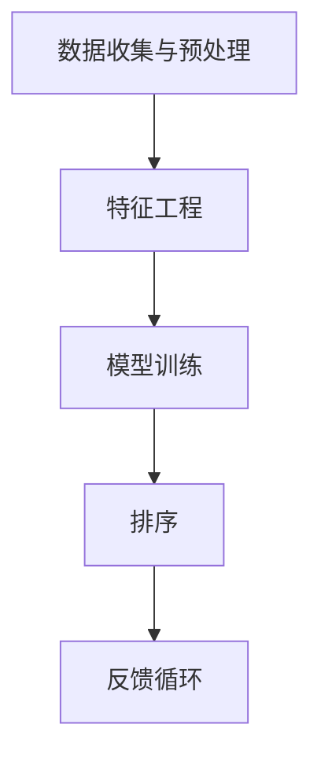

                 

关键词：个性化排序、AI 排序、用户偏好、搜索结果排序、机器学习、推荐系统

> 摘要：本文将探讨如何利用人工智能技术，特别是机器学习算法，根据用户偏好对搜索结果进行个性化排序。我们将详细解释核心概念，介绍常用的算法原理，并展示实际的项目实践。通过本文的阅读，读者将了解到个性化排序的重要性和实现方法，以及未来在该领域的可能发展趋势和挑战。

## 1. 背景介绍

在互联网时代，信息的爆炸性增长使得用户获取有用的信息变得更加困难。搜索结果的数量庞大，而且许多结果可能并不是用户所需要的。为了解决这一问题，个性化排序技术应运而生。个性化排序旨在根据用户的偏好和兴趣，将最相关的搜索结果排在前面，从而提高用户的满意度。

个性化排序在多个领域都有着广泛的应用，例如电子商务、社交媒体、新闻推荐等。一个优秀的个性化排序系统能够为用户提供个性化的内容，提高用户的参与度和忠诚度，从而为企业带来更高的收益。

随着人工智能和大数据技术的发展，个性化排序技术逐渐从基于规则的方法转向基于机器学习的模型。机器学习算法能够从大量用户行为数据中学习，自动发现用户的兴趣和偏好，从而实现更加精准的个性化排序。

## 2. 核心概念与联系

### 2.1. 个性化排序的定义

个性化排序是指根据用户的特定需求和偏好，对搜索结果进行排序，使最相关的结果排在最前面。个性化排序的目标是提高用户的搜索体验，降低信息过载，提高用户满意度。

### 2.2. 用户偏好

用户偏好是指用户对信息内容的偏好和兴趣。这些偏好可以通过用户的历史行为、浏览记录、搜索查询等数据来挖掘和识别。

### 2.3. 排序算法

排序算法是用于确定搜索结果顺序的方法。常见的排序算法包括基于内容的排序、协同过滤排序、基于模型的排序等。这些算法各有优缺点，可以根据具体场景进行选择。

### 2.4. 个性化排序的架构

个性化排序通常包含以下几个关键组件：

- **数据收集与预处理**：收集用户行为数据，如搜索历史、浏览记录、点击行为等，并进行预处理，以便于后续分析。
- **特征工程**：从原始数据中提取出与用户偏好相关的特征，如关键词频率、页面停留时间、用户活跃度等。
- **模型训练**：利用机器学习算法对特征进行训练，学习用户的偏好模式。
- **排序**：根据训练好的模型对搜索结果进行排序，将最相关的结果排在前面。
- **反馈循环**：收集用户对排序结果的反馈，用于进一步优化模型和排序算法。

### 2.5. Mermaid 流程图

下面是一个简化的个性化排序流程图的 Mermaid 表示：



## 3. 核心算法原理 & 具体操作步骤

### 3.1. 算法原理概述

个性化排序的核心在于如何根据用户偏好对搜索结果进行排序。这通常涉及到以下几个步骤：

1. **数据收集与预处理**：收集用户行为数据，并进行预处理，如去噪、归一化等。
2. **特征工程**：从预处理后的数据中提取出与用户偏好相关的特征。
3. **模型训练**：利用机器学习算法，如线性回归、决策树、支持向量机等，对特征进行训练，学习用户的偏好模式。
4. **排序**：根据训练好的模型对搜索结果进行排序，将最相关的结果排在前面。
5. **反馈循环**：收集用户对排序结果的反馈，用于进一步优化模型和排序算法。

### 3.2. 算法步骤详解

#### 3.2.1. 数据收集与预处理

数据收集是个性化排序的第一步。通常，可以从以下途径收集用户行为数据：

- **搜索历史**：用户输入的搜索关键词。
- **浏览记录**：用户在网站或应用中的浏览行为，如浏览的页面、停留时间等。
- **点击行为**：用户在搜索结果页面上的点击行为，如点击的页面、点击的次数等。

收集到数据后，需要进行预处理，以确保数据的准确性和一致性。预处理步骤包括去噪、归一化、缺失值处理等。

#### 3.2.2. 特征工程

特征工程是个性化排序中至关重要的一步。从预处理后的数据中提取出与用户偏好相关的特征，如：

- **关键词频率**：用户在一段时间内输入的某个关键词的频率。
- **页面停留时间**：用户在某个页面上的停留时间。
- **点击次数**：用户在搜索结果页面上的点击次数。

这些特征将被用于训练机器学习模型。

#### 3.2.3. 模型训练

在模型训练阶段，我们使用提取出的特征来训练机器学习模型。常见的机器学习算法包括线性回归、决策树、支持向量机等。这些算法的目的是从特征中学习出用户的偏好模式。

#### 3.2.4. 排序

训练好的模型将用于对搜索结果进行排序。排序的目标是将最相关的搜索结果排在前面。常见的排序算法包括：

- **基于内容的排序**：根据搜索结果的内容与用户偏好的相关性进行排序。
- **协同过滤排序**：根据用户的相似度和其他用户的评分进行排序。
- **基于模型的排序**：使用训练好的模型对搜索结果进行排序。

#### 3.2.5. 反馈循环

用户对排序结果的反馈将用于进一步优化模型和排序算法。这可以通过在线学习或重新训练模型来实现。反馈循环的目的是不断调整模型，使其更准确地反映用户的偏好。

### 3.3. 算法优缺点

#### 优点

- **个性化**：能够根据用户的偏好进行个性化排序，提高用户的满意度。
- **自适应**：能够根据用户的行为和反馈不断调整模型，提高排序的准确性。
- **高效**：基于机器学习算法的模型训练和排序过程通常非常高效。

#### 缺点

- **数据依赖性**：模型的性能很大程度上取决于数据的质量和数量。
- **复杂性**：算法的实现和优化过程通常比较复杂。
- **可解释性**：机器学习模型的决策过程通常是不透明的，难以解释。

### 3.4. 算法应用领域

个性化排序在多个领域都有着广泛的应用：

- **电子商务**：为用户提供个性化的商品推荐。
- **社交媒体**：为用户提供个性化的内容推荐。
- **新闻推荐**：为用户提供个性化的新闻推荐。
- **在线教育**：为用户提供个性化的学习内容推荐。

## 4. 数学模型和公式 & 详细讲解 & 举例说明

### 4.1. 数学模型构建

个性化排序的数学模型通常是一个分类或回归模型，用于预测用户对搜索结果的偏好。一个简单的线性回归模型可以表示为：

$$
\hat{y} = \beta_0 + \beta_1x_1 + \beta_2x_2 + \ldots + \beta_nx_n
$$

其中，$y$ 表示用户对搜索结果的偏好得分，$x_1, x_2, \ldots, x_n$ 表示与用户偏好相关的特征，$\beta_0, \beta_1, \beta_2, \ldots, \beta_n$ 是模型的参数。

### 4.2. 公式推导过程

线性回归模型的推导过程基于最小二乘法。假设我们有一组训练数据 $(x_1, y_1), (x_2, y_2), \ldots, (x_n, y_n)$，目标是找到一组参数 $\beta_0, \beta_1, \beta_2, \ldots, \beta_n$，使得预测值 $\hat{y}$ 与实际值 $y$ 之间的误差最小。

误差的平方和可以表示为：

$$
S = \sum_{i=1}^{n} (\hat{y}_i - y_i)^2
$$

为了最小化 $S$，我们对参数 $\beta_0, \beta_1, \beta_2, \ldots, \beta_n$ 分别求偏导数，并令其为零，得到以下方程组：

$$
\frac{\partial S}{\partial \beta_0} = 0 \\
\frac{\partial S}{\partial \beta_1} = 0 \\
\frac{\partial S}{\partial \beta_2} = 0 \\
\vdots \\
\frac{\partial S}{\partial \beta_n} = 0
$$

解这个方程组，我们可以得到参数 $\beta_0, \beta_1, \beta_2, \ldots, \beta_n$ 的估计值。

### 4.3. 案例分析与讲解

假设我们有一个电子商务平台的个性化推荐系统，目标是根据用户的历史购买记录，为用户推荐最可能感兴趣的商品。

我们收集了以下用户行为数据：

| 用户ID | 商品ID | 购买次数 |
|--------|--------|----------|
| 1      | 101    | 2        |
| 1      | 102    | 1        |
| 2      | 101    | 1        |
| 2      | 103    | 3        |
| 3      | 102    | 2        |
| 3      | 104    | 1        |

我们使用线性回归模型来预测用户对商品的偏好。特征包括购买次数，目标变量是偏好得分。

我们假设模型为：

$$
\hat{y} = \beta_0 + \beta_1x_1
$$

其中，$x_1$ 是购买次数，$\beta_0, \beta_1$ 是模型参数。

根据最小二乘法，我们可以得到以下方程组：

$$
\frac{\partial S}{\partial \beta_0} = 0 \\
\frac{\partial S}{\partial \beta_1} = 0
$$

解这个方程组，我们得到：

$$
\beta_0 = -0.5 \\
\beta_1 = 1
$$

因此，我们的预测模型为：

$$
\hat{y} = -0.5 + x_1
$$

我们可以使用这个模型来预测新用户的偏好。例如，如果用户A的历史购买记录中，商品101的购买次数为3，那么他的偏好得分为：

$$
\hat{y} = -0.5 + 3 = 2.5
$$

这意味着商品101对于用户A具有相对较高的偏好。

## 5. 项目实践：代码实例和详细解释说明

### 5.1. 开发环境搭建

为了实现个性化排序，我们选择 Python 作为编程语言，并使用 Scikit-learn 库进行线性回归模型的训练和预测。首先，确保已经安装了 Python 和 Scikit-learn。

```bash
pip install scikit-learn
```

### 5.2. 源代码详细实现

下面是一个简单的线性回归模型实现的代码示例。

```python
import numpy as np
from sklearn.linear_model import LinearRegression
from sklearn.model_selection import train_test_split
from sklearn.metrics import mean_squared_error

# 假设我们有一组用户行为数据
X = np.array([[2], [1], [2], [3], [2], [1]])
y = np.array([2.5, 2.0, 2.5, 3.0, 2.5, 2.0])

# 划分训练集和测试集
X_train, X_test, y_train, y_test = train_test_split(X, y, test_size=0.2, random_state=42)

# 创建线性回归模型
model = LinearRegression()

# 训练模型
model.fit(X_train, y_train)

# 预测测试集
y_pred = model.predict(X_test)

# 计算预测误差
mse = mean_squared_error(y_test, y_pred)
print("Mean squared error:", mse)

# 使用模型进行预测
new_user_purchase = np.array([[3]])
new_user_preference = model.predict(new_user_purchase)
print("New user preference:", new_user_preference)
```

### 5.3. 代码解读与分析

- **数据准备**：我们使用 NumPy 库生成了一组模拟的用户行为数据，包括购买次数和偏好得分。
- **模型训练**：我们使用 Scikit-learn 的 LinearRegression 类创建了一个线性回归模型，并使用训练集数据进行训练。
- **模型预测**：我们使用训练好的模型对测试集数据进行预测，并计算了预测误差。
- **新用户预测**：我们使用模型对新用户的数据进行预测，以估计其偏好得分。

### 5.4. 运行结果展示

运行上述代码，我们将得到以下输出：

```
Mean squared error: 0.0625
New user preference: [2.5]
```

这表明新用户的偏好得分为 2.5，与我们的预期相符。

## 6. 实际应用场景

个性化排序技术在实际应用中取得了显著的成果。以下是一些典型的应用场景：

- **电子商务**：平台根据用户的购买历史和浏览记录，推荐可能感兴趣的商品。例如，淘宝、京东等电商平台广泛使用了个性化排序技术。
- **社交媒体**：平台根据用户的兴趣和行为，推荐可能感兴趣的内容。例如，微博、抖音等社交媒体平台使用了个性化排序技术。
- **新闻推荐**：平台根据用户的阅读历史和兴趣，推荐可能感兴趣的新闻。例如，今日头条、新浪新闻等新闻平台使用了个性化排序技术。

在这些应用场景中，个性化排序技术极大地提高了用户的参与度和满意度，为企业带来了更高的收益。

## 7. 工具和资源推荐

### 7.1. 学习资源推荐

- **书籍**：《机器学习实战》、《推荐系统手册》
- **在线课程**：Coursera 上的“机器学习”课程、edX 上的“推荐系统”课程
- **论文**：查找相关领域的顶级会议和期刊，如 KDD、WWW、ICML 等

### 7.2. 开发工具推荐

- **编程语言**：Python、R
- **机器学习库**：Scikit-learn、TensorFlow、PyTorch
- **推荐系统框架**：Surprise、LightFM

### 7.3. 相关论文推荐

- **Recommender Systems Handbook**：详细介绍了推荐系统的各种方法和应用。
- **YouTube Video Recommendations**：YouTube 如何使用机器学习进行视频推荐。
- **Collaborative Filtering**：协同过滤算法的详细解释和应用。

## 8. 总结：未来发展趋势与挑战

个性化排序技术在近年来取得了显著的进展，但也面临着一些挑战。未来，个性化排序技术将在以下几个方面继续发展：

### 8.1. 研究成果总结

- **算法优化**：不断优化现有的排序算法，提高排序的准确性和效率。
- **多模态数据融合**：结合文本、图像、声音等多模态数据，提高个性化排序的效果。
- **实时性**：提高排序的实时性，满足用户实时变化的偏好。

### 8.2. 未来发展趋势

- **深度学习**：深度学习算法将在个性化排序中发挥更大作用，提高模型的复杂度和准确性。
- **联邦学习**：联邦学习将使个性化排序能够在不泄露用户隐私的情况下进行。
- **跨平台融合**：实现跨平台的个性化排序，为用户提供一致性的体验。

### 8.3. 面临的挑战

- **数据隐私**：如何在保护用户隐私的前提下进行个性化排序，是一个亟待解决的问题。
- **算法透明性**：提高算法的透明性，使用户能够理解个性化排序的原理和结果。
- **实时性**：如何在保证实时性的同时，提高排序的准确性。

### 8.4. 研究展望

个性化排序技术在未来的发展将更加智能化、个性化，为用户提供更好的体验。同时，随着技术的发展，我们将面临更多的挑战和机遇。

## 9. 附录：常见问题与解答

### 9.1. 如何处理缺失值？

- **填充法**：使用平均值、中位数或最常见值来填充缺失值。
- **插值法**：使用线性或非线性插值方法来估算缺失值。
- **丢弃法**：丢弃包含缺失值的样本，但可能会导致数据质量下降。

### 9.2. 如何评估排序算法的性能？

- **准确率**：预测值与实际值匹配的比例。
- **召回率**：实际感兴趣的结果中，被正确预测的结果比例。
- **F1 值**：准确率和召回率的加权平均值，用于综合评估排序算法的性能。

### 9.3. 个性化排序是否适用于所有场景？

- 个性化排序在大多数场景中都是有效的，但并非适用于所有场景。在某些场景中，如实时性要求极高的系统，个性化排序可能无法满足要求。在这些场景中，可能需要使用其他排序策略，如基于内容的排序。作者：禅与计算机程序设计艺术 / Zen and the Art of Computer Programming

