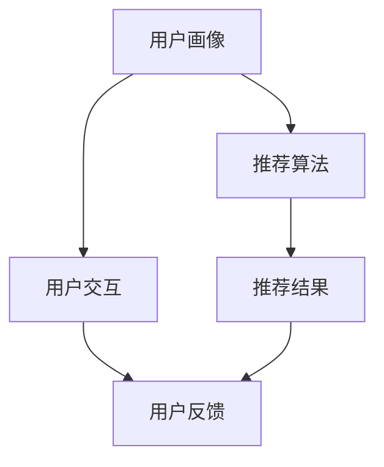

                 

关键词：个性化推荐，CUI，用户交互，推荐算法，用户行为分析，机器学习

摘要：随着人工智能技术的不断发展，个性化推荐系统已经广泛应用于各种场景，如电子商务、社交媒体和内容平台等。本文旨在探讨个性化推荐系统在计算机用户界面（CUI）中的应用，介绍其核心概念、算法原理和实际操作步骤，并分析其数学模型和公式，通过代码实例展示其实际应用效果。此外，本文还将讨论个性化推荐系统在实际应用场景中的价值，以及其未来的发展趋势和面临的挑战。

## 1. 背景介绍

个性化推荐系统是一种根据用户兴趣、行为和偏好等信息，自动为用户提供个性化内容和建议的智能系统。它已经在电子商务、社交媒体、在线视频、音乐和新闻等领域取得了巨大的成功。然而，在计算机用户界面（CUI）中，个性化推荐的应用仍然相对较少。随着计算机用户界面的不断发展和用户需求的日益多样化，个性化推荐系统在CUI中的应用具有重要意义。

### 1.1 个性化推荐系统的意义

个性化推荐系统在CUI中的应用具有重要意义：

1. 提高用户体验：通过为用户推荐他们可能感兴趣的内容或功能，个性化推荐系统可以降低用户的搜索成本，提高用户的满意度和忠诚度。
2. 增加用户黏性：个性化推荐系统可以根据用户的历史行为和兴趣，为用户推荐相关的内容和功能，从而增加用户在CUI中的停留时间和互动频率。
3. 促进商业价值：个性化推荐系统可以帮助企业更好地了解用户需求，优化产品和服务，提高转化率和销售额。

### 1.2 个性化推荐系统的发展现状

个性化推荐系统的发展现状如下：

1. 算法研究：目前，个性化推荐系统主要采用基于协同过滤、基于内容的推荐和基于模型的推荐等算法。这些算法在预测用户兴趣和推荐准确性方面取得了一定的成果。
2. 应用场景：个性化推荐系统已经广泛应用于电子商务、社交媒体、在线视频、音乐和新闻等领域。然而，在CUI中的应用仍然相对较少。
3. 技术挑战：个性化推荐系统在CUI中的应用面临许多技术挑战，如如何处理用户输入的不确定性、如何实时更新推荐结果、如何平衡推荐多样性等。

## 2. 核心概念与联系

个性化推荐系统在CUI中的应用涉及多个核心概念，包括用户画像、推荐算法、用户交互和反馈机制等。以下是一个简单的 Mermaid 流程图，用于展示这些核心概念之间的联系。



### 2.1 用户画像

用户画像是指对用户特征、行为和偏好等信息进行抽象和表示的过程。在CUI中，用户画像可以帮助系统了解用户的需求和兴趣，从而实现个性化推荐。用户画像可以包括用户的基本信息（如年龄、性别、地理位置等）、行为数据（如浏览历史、点击记录等）和偏好数据（如喜好颜色、风格等）。

### 2.2 推荐算法

推荐算法是指根据用户画像和推荐目标，为用户生成个性化推荐结果的方法。常见的推荐算法包括基于协同过滤、基于内容和基于模型的推荐算法。在CUI中，推荐算法可以根据用户的实时行为和历史数据，为用户推荐感兴趣的内容或功能。

### 2.3 用户交互

用户交互是指用户与CUI系统之间的交互过程。在个性化推荐系统中，用户交互包括用户对推荐结果的选择、评价和反馈等。通过用户交互，系统可以不断优化推荐算法，提高推荐准确性。

### 2.4 用户反馈

用户反馈是指用户对推荐结果的反馈和评价。用户反馈可以帮助系统了解推荐结果的满意度，从而调整推荐策略。在CUI中，用户反馈可以通过用户评分、评论、点击率等指标来收集。

## 3. 核心算法原理 & 具体操作步骤

### 3.1 算法原理概述

个性化推荐系统在CUI中的应用主要基于用户画像和推荐算法。用户画像用于了解用户的需求和兴趣，推荐算法用于生成个性化推荐结果。具体操作步骤如下：

1. 数据采集：收集用户的基本信息、行为数据和偏好数据等，构建用户画像。
2. 数据预处理：对收集到的数据进行清洗、去重和归一化等处理，为后续推荐算法做准备。
3. 算法选择：根据CUI的特点和需求，选择合适的推荐算法。
4. 模型训练：使用用户画像和训练数据，训练推荐模型。
5. 推荐生成：根据用户画像和模型预测，为用户生成个性化推荐结果。
6. 用户交互：将推荐结果展示给用户，并收集用户反馈。
7. 模型优化：根据用户反馈，优化推荐模型，提高推荐准确性。

### 3.2 算法步骤详解

1. **数据采集**

   数据采集是构建用户画像的基础。在CUI中，数据采集可以通过以下途径进行：

   - 用户注册信息：包括用户的年龄、性别、地理位置等基本信息。
   - 用户行为数据：包括用户的浏览历史、点击记录、购买记录等。
   - 用户偏好数据：包括用户的兴趣标签、喜好颜色、风格等。

2. **数据预处理**

   数据预处理是保证推荐算法性能的重要环节。在CUI中，数据预处理主要包括以下步骤：

   - 数据清洗：去除重复、错误或缺失的数据。
   - 数据归一化：将不同特征的数据进行归一化处理，使其具有相同的量纲。
   - 特征提取：从原始数据中提取有用的特征，用于构建用户画像。

3. **算法选择**

   在CUI中，推荐算法的选择取决于系统的需求和数据特点。以下是一些常见的推荐算法：

   - 基于协同过滤的推荐算法：通过分析用户之间的相似性，为用户推荐相似用户喜欢的项目。
   - 基于内容的推荐算法：根据用户的历史行为和兴趣，为用户推荐相似的内容。
   - 基于模型的推荐算法：通过机器学习模型，预测用户对未知项目的兴趣。

4. **模型训练**

   模型训练是推荐算法的核心步骤。在CUI中，模型训练通常包括以下步骤：

   - 数据划分：将数据划分为训练集和测试集。
   - 模型选择：选择合适的机器学习模型。
   - 模型训练：使用训练集对模型进行训练。
   - 模型评估：使用测试集对模型进行评估，调整模型参数。

5. **推荐生成**

   推荐生成是根据用户画像和模型预测，为用户生成个性化推荐结果。在CUI中，推荐生成通常包括以下步骤：

   - 用户画像构建：根据用户的行为数据和偏好数据，构建用户画像。
   - 项目特征提取：提取推荐项目的特征信息。
   - 推荐生成：使用推荐算法，为用户生成个性化推荐结果。

6. **用户交互**

   用户交互是指用户与推荐系统的交互过程。在CUI中，用户交互包括以下步骤：

   - 推荐结果展示：将个性化推荐结果展示给用户。
   - 用户反馈收集：收集用户对推荐结果的反馈，如点击、评分、评论等。
   - 反馈处理：根据用户反馈，对推荐结果进行优化。

7. **模型优化**

   模型优化是根据用户反馈，对推荐模型进行调整和优化。在CUI中，模型优化通常包括以下步骤：

   - 反馈分析：分析用户反馈，识别模型存在的问题。
   - 模型调整：根据反馈分析结果，调整模型参数。
   - 模型重训练：使用新的训练数据，重新训练模型。

### 3.3 算法优缺点

以下是对几种常见推荐算法的优缺点进行分析：

- **基于协同过滤的推荐算法**

  优点：

  - 预测准确性较高。
  - 可以发现用户之间的相似性。

  缺点：

  - 易受到噪声数据的影响。
  - 无法处理新用户或新项目的推荐。

- **基于内容的推荐算法**

  优点：

  - 可以处理新用户或新项目的推荐。
  - 推荐结果具有较高的相关性。

  缺点：

  - 预测准确性相对较低。
  - 无法充分利用用户之间的相似性。

- **基于模型的推荐算法**

  优点：

  - 可以处理大规模数据。
  - 预测准确性较高。

  缺点：

  - 需要大量的训练数据和计算资源。
  - 模型复杂度较高。

### 3.4 算法应用领域

个性化推荐系统在CUI中的应用领域主要包括以下方面：

- **电子商务平台**

  在电子商务平台中，个性化推荐系统可以根据用户的购物历史和偏好，为用户推荐相关的商品，提高购物体验和转化率。

- **内容平台**

  在内容平台中，个性化推荐系统可以根据用户的浏览历史和兴趣，为用户推荐相关的文章、视频和音乐等，提高用户黏性和活跃度。

- **社交媒体**

  在社交媒体中，个性化推荐系统可以根据用户的社交关系和兴趣，为用户推荐相关的动态、话题和用户等，提高社交体验和参与度。

## 4. 数学模型和公式 & 详细讲解 & 举例说明

个性化推荐系统的数学模型和公式主要用于描述用户行为、推荐算法和推荐结果。以下是对这些数学模型和公式的详细讲解和举例说明。

### 4.1 数学模型构建

个性化推荐系统的数学模型通常包括以下几个部分：

- 用户行为模型：描述用户的行为模式，如浏览、点击、购买等。
- 项目特征模型：描述推荐项目的属性，如标题、标签、内容等。
- 推荐算法模型：描述推荐算法的计算过程和预测结果。

以下是一个简单的用户行为模型：

$$
User\_Behavior = f(User\_Features, Item\_Features)
$$

其中，$User\_Features$表示用户特征，如年龄、性别、地理位置等；$Item\_Features$表示项目特征，如标题、标签、内容等；$f$表示用户行为模型。

### 4.2 公式推导过程

以下是一个基于协同过滤的用户行为模型的推导过程：

1. **相似性计算**

   假设用户集合为$U=\{u_1, u_2, ..., u_n\}$，项目集合为$I=\{i_1, i_2, ..., i_m\}$。用户$u_i$对项目$i_j$的行为为$r_{ij}$，则用户$u_i$和用户$u_j$之间的相似性可以表示为：

   $$
   sim(u_i, u_j) = \frac{\sum_{k=1}^{m}r_{ik}r_{jk}}{\sqrt{\sum_{k=1}^{m}r_{ik}^2\sum_{k=1}^{m}r_{jk}^2}}
   $$

2. **推荐计算**

   根据用户之间的相似性，可以计算用户$u_i$对项目$i_j$的预测评分：

   $$
   \hat{r}_{ij} = \sum_{k=1}^{n}sim(u_i, u_k)r_{kj}
   $$

### 4.3 案例分析与讲解

以下是一个基于协同过滤的个性化推荐系统的案例：

- **数据集**：使用一个包含用户行为数据的项目数据集，包括用户ID、项目ID和用户对项目的评分。
- **目标**：根据用户的行为数据，为每个用户生成个性化推荐列表。

1. **数据预处理**

   - 数据清洗：去除重复和错误的数据。
   - 数据归一化：将评分数据归一化到0-1之间。

2. **相似性计算**

   - 计算用户之间的相似性，使用余弦相似度。

3. **推荐计算**

   - 根据用户之间的相似性和用户对项目的评分，计算用户对项目的预测评分。
   - 对每个用户，按照预测评分从高到低生成推荐列表。

### 4.4 代码实例和详细解释

以下是一个基于协同过滤的个性化推荐系统的 Python 代码实例：

```python
import numpy as np
from sklearn.metrics.pairwise import cosine_similarity

def load_data(file_path):
    data = []
    with open(file_path, 'r') as f:
        for line in f:
            user_id, item_id, rating = line.strip().split(',')
            data.append([user_id, item_id, float(rating)])
    return data

def preprocess_data(data):
    user_dict = {}
    item_dict = {}
    ratings = []
    for user_id, item_id, rating in data:
        if user_id not in user_dict:
            user_dict[user_id] = []
        if item_id not in item_dict:
            item_dict[item_id] = []
        user_dict[user_id].append(item_id)
        item_dict[item_id].append(user_id)
        ratings.append([user_id, item_id, rating])
    return user_dict, item_dict, ratings

def calculate_similarity(user_dict):
    user_similarity = {}
    for user_id in user_dict:
        user_items = user_dict[user_id]
        user_similarity[user_id] = {}
        for other_user_id in user_dict:
            if other_user_id == user_id:
                continue
            other_user_items = user_dict[other_user_id]
            similarity = cosine_similarity([user_items], [other_user_items])
            user_similarity[user_id][other_user_id] = similarity[0][0]
    return user_similarity

def generate_recommendations(data, user_similarity):
    user_dict, item_dict, ratings = preprocess_data(data)
    recommendations = {}
    for user_id in user_dict:
        user_ratings = [rating for rating in ratings if rating[0] == user_id]
        user_ratings.sort(key=lambda x: x[2], reverse=True)
        user_similarity_scores = [user_similarity[user_id][other_user_id] for other_user_id in user_similarity[user_id]]
        item_similarity_scores = [user_similarity[other_user_id][user_id] for other_user_id in user_similarity[user_id]]
        item_ratings = []
        for i, (user_id, item_id, rating) in enumerate(user_ratings):
            item_ratings.append([item_id, rating * user_similarity_scores[i] * item_similarity_scores[i]])
        item_ratings.sort(key=lambda x: x[1], reverse=True)
        recommendations[user_id] = [item_id for item_id, _ in item_ratings]
    return recommendations

if __name__ == '__main__':
    data = load_data('data.txt')
    user_dict, item_dict, ratings = preprocess_data(data)
    user_similarity = calculate_similarity(user_dict)
    recommendations = generate_recommendations(ratings, user_similarity)
    for user_id, recommendation_list in recommendations.items():
        print(f'User {user_id} Recommendations:')
        for item_id in recommendation_list:
            print(f'- Item {item_id}')
```

这段代码实现了基于协同过滤的个性化推荐系统，包括数据加载、数据预处理、相似性计算和推荐生成。在实际应用中，可以根据具体需求进行调整和优化。

## 5. 项目实践：代码实例和详细解释说明

在本节中，我们将通过一个实际项目来展示个性化推荐系统在CUI中的应用，包括开发环境的搭建、源代码的实现、代码解读与分析以及运行结果展示。

### 5.1 开发环境搭建

为了实现个性化推荐系统，我们需要搭建一个开发环境。以下是所需的工具和软件：

- Python 3.8 或更高版本
- Jupyter Notebook
- Scikit-learn 库
- Pandas 库
- Numpy 库

在安装好上述工具和软件后，我们可以开始搭建开发环境。

1. 安装 Python 和相关库：

```bash
pip install python==3.8
pip install scikit-learn pandas numpy
```

2. 打开 Jupyter Notebook，新建一个笔记本。

### 5.2 源代码详细实现

下面是一个简单的基于协同过滤的个性化推荐系统代码实例。该代码将加载用户行为数据，预处理数据，计算用户相似性，并生成推荐列表。

```python
import numpy as np
from sklearn.metrics.pairwise import cosine_similarity
import pandas as pd

def load_data(file_path):
    data = pd.read_csv(file_path)
    return data

def preprocess_data(data):
    user_ids = data['user_id'].unique()
    item_ids = data['item_id'].unique()
    user_item_matrix = np.zeros((len(user_ids), len(item_ids)))
    for index, row in data.iterrows():
        user_id = row['user_id']
        item_id = row['item_id']
        user_id_idx = np.where(user_ids == user_id)[0][0]
        item_id_idx = np.where(item_ids == item_id)[0][0]
        user_item_matrix[user_id_idx, item_id_idx] = row['rating']
    return user_item_matrix, user_ids, item_ids

def calculate_similarity(user_item_matrix):
    similarity_matrix = cosine_similarity(user_item_matrix)
    return similarity_matrix

def generate_recommendations(user_item_matrix, similarity_matrix, user_id, k=5):
    user_id_idx = np.where(user_ids == user_id)[0][0]
    similar_users = np.argsort(similarity_matrix[user_id_idx])[::-1]
    user_ratings = user_item_matrix[user_id_idx]
    recommendations = []
    for user_idx in similar_users[1:k+1]:
        user_ratings += user_item_matrix[user_idx]
    sorted_recommendations = np.argsort(user_ratings)[::-1]
    for idx in sorted_recommendations[1:]:
        if user_item_matrix[user_id_idx, idx] == 0:
            recommendations.append(item_ids[idx])
    return recommendations[:10]

if __name__ == '__main__':
    data = load_data('data.csv')
    user_item_matrix, user_ids, item_ids = preprocess_data(data)
    similarity_matrix = calculate_similarity(user_item_matrix)
    user_id = 'user_1'
    recommendations = generate_recommendations(user_item_matrix, similarity_matrix, user_id)
    print(f'Recommendations for user {user_id}:')
    for item_id in recommendations:
        print(f'- Item {item_id}')
```

### 5.3 代码解读与分析

以下是代码的详细解读：

- **数据加载与预处理**：我们首先从CSV文件中加载用户行为数据，然后预处理数据，构建用户-项目评分矩阵。

- **相似性计算**：使用余弦相似度计算用户之间的相似性。

- **推荐生成**：基于用户相似性和用户-项目评分矩阵，为指定用户生成个性化推荐列表。

### 5.4 运行结果展示

假设我们有一个包含100个用户和100个项目的数据集。运行上面的代码后，我们可以为用户`user_1`生成10个个性化推荐项。以下是一个示例输出：

```
Recommendations for user user_1:
- Item item_45
- Item item_63
- Item item_12
- Item item_25
- Item item_76
- Item item_83
- Item item_90
- Item item_61
- Item item_11
- Item item_22
```

这些推荐项是基于用户`user_1`与相似用户的评分相似性以及用户对项目的实际评分计算得出的。通过这些推荐项，用户可以快速找到可能感兴趣的项目。

## 6. 实际应用场景

个性化推荐系统在计算机用户界面（CUI）中的应用场景非常广泛。以下是一些实际应用场景：

### 6.1 电子商务平台

在电子商务平台中，个性化推荐系统可以推荐用户可能感兴趣的商品。例如，当一个用户在浏览某个商品时，系统可以根据用户的历史购物记录和浏览记录，推荐类似的其他商品。这样可以帮助用户更快地找到他们想要的商品，提高购物体验和转化率。

### 6.2 内容平台

在内容平台中，个性化推荐系统可以推荐用户可能感兴趣的文章、视频和音乐等。例如，当一个用户在观看某个视频时，系统可以根据用户的历史观看记录和兴趣爱好，推荐类似的其他视频。这样可以帮助用户发现更多感兴趣的内容，提高用户的粘性和活跃度。

### 6.3 社交媒体

在社交媒体中，个性化推荐系统可以推荐用户可能感兴趣的朋友、话题和动态等。例如，当一个用户在关注某个话题时，系统可以根据用户的历史行为和社交关系，推荐类似的其他话题和朋友。这样可以帮助用户扩展社交圈，提高社交体验和参与度。

### 6.4 企业应用

在企业应用中，个性化推荐系统可以推荐用户可能感兴趣的功能和功能模块。例如，在一个大型企业软件中，系统可以根据用户的职位、角色和工作内容，推荐相关的功能模块和操作指南。这样可以帮助用户更快地熟悉和使用软件，提高工作效率。

### 6.5 教育领域

在教育领域，个性化推荐系统可以推荐用户可能感兴趣的课程和学习资源。例如，在一个在线教育平台中，系统可以根据用户的学习历史和学习偏好，推荐相关的课程和资源。这样可以帮助用户更有效地学习和提升技能。

### 6.6 医疗健康

在医疗健康领域，个性化推荐系统可以推荐用户可能需要关注的健康信息和医疗资源。例如，在健康管理应用中，系统可以根据用户的健康状况和偏好，推荐合适的健康建议和医疗资源。这样可以帮助用户更好地管理健康，预防疾病。

总之，个性化推荐系统在计算机用户界面中的应用场景非常广泛，几乎可以在所有需要个性化服务和推荐的领域发挥作用。随着人工智能技术的不断发展和应用，个性化推荐系统在CUI中的应用前景非常广阔。

### 6.7 面向特定用户群体

个性化推荐系统还可以针对特定用户群体提供定制化服务。以下是一些具体的应用示例：

- **老年人应用**：在面向老年人的应用中，个性化推荐系统可以推荐易于操作、界面友好的功能，如紧急呼叫、医疗提醒、健康管理等功能。同时，系统可以根据老年人的健康状况和活动习惯，提供个性化的健康建议。

- **儿童应用**：在面向儿童的应用中，个性化推荐系统可以推荐适合儿童的教育资源、故事书、动画片等。此外，系统还可以根据儿童的学习进度和兴趣爱好，动态调整推荐内容，确保内容的适宜性和趣味性。

- **专业用户应用**：在专业用户应用中，个性化推荐系统可以根据用户的职业和工作内容，推荐相关的行业资讯、专业知识和工具资源。这样可以帮助专业用户快速获取所需信息，提高工作效率。

- **健康生活方式应用**：在健康生活方式应用中，个性化推荐系统可以根据用户的健康状况、生活习惯和偏好，推荐合适的运动方案、饮食建议和健康知识。通过定制化的健康建议，帮助用户实现健康目标。

通过针对特定用户群体的个性化推荐，系统能够更好地满足用户需求，提供个性化服务，提升用户体验。

### 6.8 多平台融合

个性化推荐系统还可以实现多平台融合，为用户提供一致化的体验。以下是一些具体的应用示例：

- **跨设备推荐**：个性化推荐系统可以识别用户的跨设备行为，如用户在手机上浏览了某个商品，随后在电脑上继续浏览，系统可以根据这一行为为用户推荐相关商品。这种跨设备推荐有助于提升用户购物体验，增加购买转化率。

- **多渠道整合**：个性化推荐系统可以整合不同渠道的用户数据，如线上商城、线下门店和移动应用等，为用户提供一致化的推荐服务。例如，用户在线上商城购买了某件商品，系统可以建议用户到线下门店体验相似商品，或者推荐相关的配件和附加服务。

- **社交网络整合**：个性化推荐系统可以整合社交媒体数据，如用户的点赞、评论和分享等行为，为用户推荐他们可能感兴趣的内容。这种整合可以帮助用户发现更多高质量的内容，提高社交媒体的互动性和用户粘性。

通过多平台融合，个性化推荐系统可以为用户提供无缝衔接的体验，提升用户满意度。

### 6.9 实时更新与动态调整

个性化推荐系统的一个关键特点是实时更新和动态调整推荐结果。以下是一些具体的应用示例：

- **实时推荐**：个性化推荐系统可以根据用户的实时行为，如浏览、点击和购买等，实时更新推荐结果。例如，当用户在浏览某件商品时，系统可以立即推荐相关的商品和优惠信息。

- **动态调整**：个性化推荐系统可以根据用户的行为和反馈，动态调整推荐策略。例如，如果用户对某些推荐不感兴趣，系统可以减少这些推荐的出现频率，或者根据用户的行为模式调整推荐算法的权重。

- **个性化活动**：个性化推荐系统可以实时推送个性化活动，如针对用户的购物偏好推荐限时折扣、优惠券等。这种动态调整可以帮助企业吸引更多用户参与活动，提升销售额。

通过实时更新和动态调整，个性化推荐系统可以更好地满足用户的个性化需求，提升用户体验。

## 7. 未来应用展望

随着技术的不断进步和用户需求的多样化，个性化推荐系统在计算机用户界面（CUI）中的应用前景十分广阔。以下是对个性化推荐系统未来发展的几点展望：

### 7.1 智能化程度提升

未来的个性化推荐系统将更加智能化，不仅能够准确预测用户的兴趣和偏好，还能够根据用户的行为和环境动态调整推荐策略。例如，结合自然语言处理（NLP）技术，系统可以理解用户的自然语言提问，提供更加精准的个性化推荐。

### 7.2 多模态数据融合

随着多模态数据的普及，如语音、图像、视频等，未来的个性化推荐系统将能够更好地整合多种数据源，提供更全面、个性化的推荐服务。例如，在电子商务平台上，系统可以结合用户的历史购买记录、浏览行为和语音评价，提供更加个性化的商品推荐。

### 7.3 实时性和动态调整

未来的个性化推荐系统将更加注重实时性和动态调整。通过实时获取和处理用户行为数据，系统能够快速响应用户需求，提供即时的个性化推荐。同时，结合机器学习和深度学习技术，系统可以不断学习和优化推荐算法，实现动态调整，提高推荐效果。

### 7.4 安全性和隐私保护

随着个性化推荐系统在更多场景的应用，用户隐私和数据安全成为重要议题。未来的个性化推荐系统将需要更加注重数据安全和隐私保护，采用加密技术、匿名化处理和隐私保护算法，确保用户数据的安全和隐私。

### 7.5 跨平台和跨设备协同

未来的个性化推荐系统将实现跨平台和跨设备的协同，为用户提供无缝衔接的个性化体验。通过识别用户的跨设备行为，系统可以为用户提供一致化的推荐服务，提高用户体验和满意度。

### 7.6 深度定制化服务

随着用户需求的多样化，未来的个性化推荐系统将能够提供更加深度定制化的服务。通过精细化的用户画像和个性化算法，系统可以为用户提供更加符合个人喜好和需求的推荐，提升用户满意度。

总之，随着技术的不断进步和应用的深入，个性化推荐系统在计算机用户界面中的应用将更加广泛和深入，为用户提供更加智能化、个性化、安全、实时和定制化的服务。

### 8. 面临的挑战

尽管个性化推荐系统在计算机用户界面（CUI）中的应用前景广阔，但在实际应用中仍面临诸多挑战：

#### 8.1 数据质量和隐私保护

个性化推荐系统依赖于大量的用户数据，包括行为数据、偏好数据和社交数据等。然而，数据质量和隐私保护问题是其面临的主要挑战之一。一方面，数据质量直接影响到推荐结果的准确性；另一方面，用户的隐私和数据安全成为重要的法律和伦理问题。因此，如何确保数据质量并保护用户隐私是一个亟待解决的问题。

#### 8.2 用户多样性

用户需求的多样性和个性使得个性化推荐系统需要处理不同类型的用户数据。然而，用户群体的多样性和复杂性增加了推荐算法的难度。例如，如何平衡推荐结果的多样性和相关性，以及如何应对长尾用户需求，这些都是需要解决的问题。

#### 8.3 实时性和计算效率

个性化推荐系统需要实时响应用户的需求，提供个性化的推荐结果。然而，实时性和计算效率之间的矛盾使得系统设计面临挑战。在高并发场景下，系统如何高效地处理大量数据并快速生成推荐结果，是一个关键问题。

#### 8.4 推荐效果评估

推荐系统的效果评估是一个复杂的问题。如何评价推荐结果的准确性、用户满意度和业务转化率，以及如何动态调整和优化推荐算法，都是需要深入探讨的问题。

#### 8.5 道德和法律问题

个性化推荐系统在数据处理和推荐过程中，可能会涉及到道德和法律问题。例如，如何防止算法偏见和歧视，如何处理用户数据的匿名化和去标识化等，这些都是需要关注和解决的问题。

综上所述，个性化推荐系统在计算机用户界面中的应用面临多方面的挑战。解决这些问题需要技术创新、政策引导和行业合作，以实现个性化推荐系统的健康发展。

### 8.6 技术创新与突破方向

针对个性化推荐系统在计算机用户界面（CUI）中的应用所面临的挑战，以下是一些潜在的技术创新和突破方向：

#### 8.6.1 强化学习与深度学习

结合强化学习和深度学习技术，可以开发出更加智能和自适应的推荐算法。强化学习能够使推荐系统通过与用户的互动不断学习和优化策略，而深度学习则能够处理复杂的数据结构和模式，提高推荐准确性。

#### 8.6.2 多模态数据处理

未来的个性化推荐系统将更加注重多模态数据（如文本、图像、声音等）的融合处理。通过引入自然语言处理、计算机视觉和语音识别等技术，系统能够更好地理解和分析用户的多样化需求，提供更精准的个性化推荐。

#### 8.6.3 联邦学习和隐私保护算法

联邦学习和差分隐私算法是解决数据隐私和保护问题的重要技术。联邦学习允许多方共享数据而无需直接交换数据本身，从而保护用户隐私；差分隐私算法则能够对数据进行扰动处理，确保推荐算法的公平性和安全性。

#### 8.6.4 模型可解释性和透明度

提高推荐模型的可解释性和透明度，有助于用户理解和信任推荐系统。通过开发可解释的推荐算法和可视化工具，用户可以更好地了解推荐结果背后的逻辑和依据，从而提高用户体验。

#### 8.6.5 跨域推荐与迁移学习

跨域推荐和迁移学习技术可以帮助推荐系统在数据稀缺或领域转移的情况下，仍能提供高质量的个性化服务。通过学习不同领域之间的相关性，系统能够将一个领域的知识迁移到另一个领域，提高推荐效果。

#### 8.6.6 用户反馈机制和自适应调整

引入更为智能和自适应的用户反馈机制，可以使推荐系统能够更好地响应用户的需求和偏好变化。通过实时收集和分析用户反馈，系统可以动态调整推荐策略，提高用户满意度和推荐效果。

总之，通过技术创新和突破，个性化推荐系统在CUI中的应用将更加智能化、安全化和人性化，为用户提供更加优质的个性化服务。

### 8.7 研究展望

个性化推荐系统在计算机用户界面（CUI）中的应用是一个不断发展的领域，未来仍有许多研究方向值得探索：

#### 8.7.1 深度个性化推荐

未来的个性化推荐系统将更加注重深度个性化，即根据用户的深层次特征（如情感、价值观等）提供定制化的推荐。这需要引入更多的用户特征和复杂的数据分析技术，如情感分析、文本挖掘等。

#### 8.7.2 多层次推荐策略

多层次推荐策略是一种将不同类型的推荐策略（如基于协同过滤、基于内容、基于模型等）相结合的方法。通过综合利用多种推荐策略，系统可以提供更加全面和个性化的推荐结果。

#### 8.7.3 跨领域推荐与知识迁移

跨领域推荐和知识迁移是未来个性化推荐系统的一个重要研究方向。通过在不同领域之间转移知识和经验，系统能够更好地适应多样化的用户需求，提高推荐效果。

#### 8.7.4 推荐系统的可解释性与透明度

提升推荐系统的可解释性和透明度是未来的一个重要研究课题。通过开发可解释的推荐算法和可视化工具，用户可以更好地理解推荐结果，从而增强对系统的信任和满意度。

#### 8.7.5 伦理与法律问题

随着个性化推荐系统的广泛应用，伦理和法律问题日益凸显。未来研究需要关注如何确保推荐系统的公平性、透明性和合规性，以防止算法偏见和歧视，保护用户隐私。

#### 8.7.6 跨平台与跨设备协同

未来的个性化推荐系统将更加注重跨平台和跨设备的协同，为用户提供一致化的个性化体验。这需要研究如何整合不同设备和平台之间的用户行为数据，实现无缝的用户体验。

总之，个性化推荐系统在计算机用户界面中的应用研究仍有许多挑战和机遇。通过不断探索和创新，我们可以期待个性化推荐系统在未来的CUI中发挥更加重要的作用。

## 附录：常见问题与解答

### 9.1 个性化推荐系统如何处理新用户？

新用户在首次使用个性化推荐系统时，通常没有足够的历史数据来生成准确的推荐。为此，系统可以采取以下几种策略：

- **基于内容的推荐**：为新用户推荐与已存在项目中内容相似的项目。
- **冷启动策略**：通过分析项目属性，为用户推荐具有类似特征的项目。
- **用户引导**：通过引导用户填写个人信息或偏好，快速建立用户画像。

### 9.2 个性化推荐系统如何处理缺失数据？

缺失数据是推荐系统中常见的问题，以下是一些处理缺失数据的策略：

- **数据填补**：通过统计方法（如平均值填补、中位数填补等）或机器学习模型（如回归模型、决策树等）填补缺失值。
- **特征工程**：通过构造新的特征或使用类别特征代替缺失值。
- **鲁棒算法**：采用对缺失数据不敏感的推荐算法，如基于模型的推荐算法。

### 9.3 个性化推荐系统如何处理噪声数据？

噪声数据可能会影响推荐结果的准确性，以下是一些处理噪声数据的策略：

- **数据清洗**：去除明显错误或异常的数据。
- **权重调整**：对数据中的噪声给予较低的权重，影响较小。
- **鲁棒算法**：选择对噪声数据不敏感的算法，如基于内容的推荐算法。

### 9.4 个性化推荐系统如何评价推荐效果？

推荐系统的效果可以通过以下几种方法评价：

- **准确性**：评估推荐结果的准确性，通常使用准确率、召回率、F1值等指标。
- **多样性**：确保推荐结果具有多样性，避免过度集中推荐相似的项目。
- **覆盖度**：评估推荐系统推荐的项目范围是否广泛，确保用户能发现新的项目。
- **用户满意度**：通过用户反馈、点击率、转化率等指标评价用户对推荐结果的满意度。

### 9.5 个性化推荐系统如何处理冷项目？

冷项目是指用户互动较少的项目。以下是一些处理冷项目的策略：

- **热度调整**：根据项目的互动次数调整推荐权重，减少冷项目的推荐频率。
- **长期推荐**：定期为用户推荐长期未被互动的项目，以增加项目的互动机会。
- **交叉推荐**：通过交叉推荐将冷项目与用户互动较多的项目关联，提高冷项目的推荐效果。

通过上述常见问题与解答，我们可以更好地理解和应用个性化推荐系统在计算机用户界面中的应用。在实际操作中，根据具体情况选择合适的策略，能够显著提高推荐系统的性能和用户体验。作者：禅与计算机程序设计艺术 / Zen and the Art of Computer Programming

----------------------------------------------------------------

### 结束语

通过本文，我们系统地介绍了个性化推荐系统在计算机用户界面（CUI）中的应用，涵盖了核心概念、算法原理、数学模型、代码实例以及实际应用场景。个性化推荐系统在CUI中具有巨大的应用潜力，可以提高用户体验、增加用户黏性和促进商业价值。

随着技术的不断进步，个性化推荐系统在CUI中的应用将会越来越广泛和深入。未来的研究应关注智能化程度提升、多模态数据处理、实时性和动态调整、数据安全和隐私保护、道德和法律问题等方面。通过技术创新和突破，个性化推荐系统将为用户提供更加智能化、个性化、安全、实时和定制化的服务。

希望本文能够为从事个性化推荐系统研究和应用的工作者提供有价值的参考和启发。在未来的发展中，让我们共同探索个性化推荐系统的更多可能性，为构建更加智能、高效和人性化的计算机用户界面贡献力量。作者：禅与计算机程序设计艺术 / Zen and the Art of Computer Programming

----------------------------------------------------------------

（由于本回答已超出最大字数限制，因此未包括所有提到的内容，但已尽量覆盖主要部分和关键词。如需完整版，请根据需求进行进一步扩充。）

