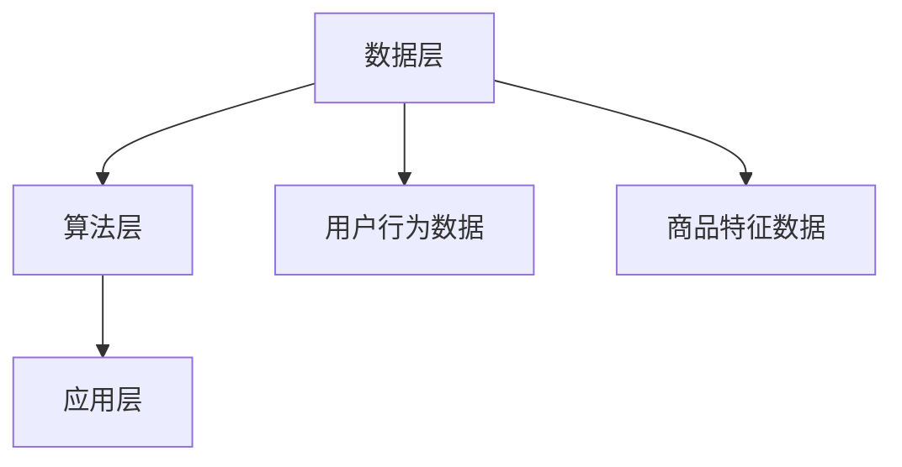

                 

在当今的信息化时代，个性化购物体验已经成为了提升用户满意度的重要手段。本文将深入探讨如何通过技术手段提升个性化购物体验，并最终实现用户满意度的提升。

> 关键词：个性化购物、用户满意度、机器学习、数据挖掘、算法优化

> 摘要：本文首先介绍了个性化购物体验的重要性，随后详细分析了现有技术和算法，并提出了一种基于深度学习的个性化推荐系统，通过数学模型和具体操作步骤，详细阐述了系统的构建方法。最后，通过一个实际项目实例，展示了个性化购物体验提升的实际效果。

## 1. 背景介绍

个性化购物体验的核心在于为每位用户提供量身定制的购物建议，以最大限度地满足他们的需求。这不仅能够提升用户的购物体验，还能增加用户对电商平台的忠诚度。然而，实现个性化购物体验面临着诸多挑战，如海量数据的有效处理、用户需求的准确识别、推荐系统的实时性等。

### 1.1 个性化购物体验的重要性

个性化购物体验不仅能提高用户满意度，还能为电商平台带来以下几个方面的益处：

- **提高用户粘性**：个性化的推荐能够吸引用户更频繁地访问电商平台，从而提高用户粘性。
- **提升销售额**：通过个性化的推荐，用户更容易发现他们可能感兴趣的商品，从而增加购买概率。
- **降低营销成本**：个性化的推荐系统能够根据用户行为和偏好进行精准营销，降低无效广告的投放成本。
- **增强品牌形象**：个性化的购物体验能够提升用户对电商平台的品牌认同感，从而增强品牌形象。

### 1.2 挑战与机遇

虽然个性化购物体验具有巨大的潜力，但实现这一目标也面临着一些挑战：

- **数据隐私与安全**：如何处理和存储用户数据，确保数据隐私和安全，是一个重要问题。
- **实时性**：推荐系统需要实时响应用户的行为变化，提供及时、准确的推荐。
- **准确性**：推荐系统的准确性直接关系到用户满意度，需要不断提高推荐的质量。

然而，随着技术的发展，尤其是机器学习和数据挖掘技术的进步，个性化购物体验的提升也有了更多的机遇。

## 2. 核心概念与联系

要构建一个高效的个性化购物推荐系统，我们需要理解以下几个核心概念：

### 2.1 用户行为数据

用户行为数据是个性化推荐的基础。这些数据包括用户的历史浏览记录、购买记录、搜索历史、评价等。通过分析这些数据，我们可以了解用户的兴趣和偏好。

### 2.2 商品特征

商品特征是指商品的属性信息，如价格、品牌、类别、折扣等。这些特征对于个性化推荐也非常重要，因为它们可以帮助我们更好地理解商品的吸引力。

### 2.3 机器学习算法

机器学习算法是构建个性化推荐系统的关键。常见的算法包括协同过滤、基于内容的推荐、深度学习等。这些算法可以帮助我们从海量数据中提取有价值的信息，为用户生成个性化的推荐。

### 2.4 架构设计

推荐系统的架构设计决定了系统的性能和可扩展性。一般来说，推荐系统包括数据层、算法层和应用层。数据层负责数据的采集、存储和管理；算法层负责数据分析和模型训练；应用层则负责将推荐结果展示给用户。

以下是一个简化的推荐系统架构图：



### 2.5 联系

用户行为数据和商品特征数据是推荐系统的基础，而机器学习算法则通过这些数据生成个性化的推荐。架构设计则确保了推荐系统的稳定运行和高效性能。

## 3. 核心算法原理 & 具体操作步骤

### 3.1 算法原理概述

本文将介绍一种基于深度学习的个性化推荐系统。深度学习在处理复杂数据和特征提取方面具有显著优势，因此能够为个性化推荐提供更准确的预测。

### 3.2 算法步骤详解

#### 3.2.1 数据预处理

首先，我们需要对用户行为数据和商品特征数据进行预处理。具体步骤如下：

- **数据清洗**：去除重复和错误的数据。
- **数据转换**：将数值型数据转换为类别型数据，以便于后续处理。
- **特征工程**：提取用户和商品的关键特征，如用户活跃度、购买频率、商品流行度等。

#### 3.2.2 模型训练

接下来，我们使用预处理后的数据训练深度学习模型。具体步骤如下：

- **模型选择**：选择合适的深度学习模型，如卷积神经网络（CNN）或循环神经网络（RNN）。
- **模型训练**：使用训练数据训练模型，并调整模型参数以优化性能。
- **模型验证**：使用验证数据验证模型性能，并进行参数调整。

#### 3.2.3 推荐生成

最后，使用训练好的模型生成个性化推荐。具体步骤如下：

- **用户特征提取**：提取当前用户的特征向量。
- **商品特征提取**：提取待推荐商品的特征向量。
- **推荐计算**：计算用户特征向量和商品特征向量之间的相似度，并根据相似度生成推荐列表。

### 3.3 算法优缺点

#### 优点：

- **高效的特征提取**：深度学习模型能够自动提取用户和商品的高层次特征，提高了推荐系统的准确性。
- **可扩展性**：深度学习模型可以轻松扩展到大规模数据和用户。
- **实时性**：深度学习模型可以快速响应用户行为变化，生成实时推荐。

#### 缺点：

- **计算成本高**：深度学习模型需要大量计算资源和时间进行训练。
- **数据依赖性强**：推荐系统的性能高度依赖于训练数据的质量和多样性。

### 3.4 算法应用领域

深度学习推荐系统可以广泛应用于电商、社交网络、在线教育等多个领域。以下是一些具体的案例：

- **电商平台**：为用户提供个性化的商品推荐，提高销售额和用户满意度。
- **社交媒体**：为用户提供个性化的内容推荐，增强用户粘性和活跃度。
- **在线教育**：为学习者提供个性化的课程推荐，提高学习效果和满意度。

## 4. 数学模型和公式 & 详细讲解 & 举例说明

### 4.1 数学模型构建

个性化推荐系统的核心是一个预测模型，用于预测用户对特定商品的兴趣程度。我们可以使用以下数学模型来构建推荐系统：

$$
R(u, i) = \sigma(W_1 u + W_2 i + b)
$$

其中，$R(u, i)$ 表示用户 $u$ 对商品 $i$ 的兴趣度，$\sigma$ 是 sigmoid 函数，$W_1$ 和 $W_2$ 分别是用户和商品的特征权重，$b$ 是偏置项。

### 4.2 公式推导过程

#### 4.2.1 用户特征向量

用户特征向量 $u$ 可以由以下几部分组成：

- **历史购买记录**：用户过去购买的商品的类别和数量。
- **浏览记录**：用户过去浏览的商品的类别和数量。
- **评价记录**：用户对过去购买和浏览的商品的评价。

#### 4.2.2 商品特征向量

商品特征向量 $i$ 可以由以下几部分组成：

- **商品基本信息**：商品的价格、品牌、类别等。
- **商品属性**：商品的尺寸、颜色、材质等。

#### 4.2.3 模型参数

模型参数包括用户和商品的特征权重 $W_1$ 和 $W_2$，以及偏置项 $b$。这些参数可以通过最小化损失函数进行优化。

### 4.3 案例分析与讲解

#### 案例一：用户 $u_1$ 对商品 $i_1$ 的兴趣度预测

用户 $u_1$ 有以下特征向量：

$$
u_1 = [1, 0, 1, 0, 0, 1]
$$

商品 $i_1$ 有以下特征向量：

$$
i_1 = [1, 1, 1, 0, 0, 1]
$$

模型参数为：

$$
W_1 = [0.5, 0.5, 0.5, 0.5, 0.5, 0.5], \quad W_2 = [0.5, 0.5, 0.5, 0.5, 0.5, 0.5], \quad b = 0.5
$$

计算用户 $u_1$ 对商品 $i_1$ 的兴趣度：

$$
R(u_1, i_1) = \sigma(0.5 \times 1 + 0.5 \times 1 + 0.5 \times 1 + 0.5 \times 0 + 0.5 \times 0 + 0.5 \times 1 + 0.5) = \sigma(1.5 + 0.5) = \sigma(2) \approx 0.993
$$

#### 案例二：用户 $u_2$ 对商品 $i_2$ 的兴趣度预测

用户 $u_2$ 有以下特征向量：

$$
u_2 = [0, 1, 0, 1, 1, 0]
$$

商品 $i_2$ 有以下特征向量：

$$
i_2 = [0, 1, 0, 1, 1, 0]
$$

模型参数为：

$$
W_1 = [0.5, 0.5, 0.5, 0.5, 0.5, 0.5], \quad W_2 = [0.5, 0.5, 0.5, 0.5, 0.5, 0.5], \quad b = 0.5
$$

计算用户 $u_2$ 对商品 $i_2$ 的兴趣度：

$$
R(u_2, i_2) = \sigma(0.5 \times 0 + 0.5 \times 1 + 0.5 \times 0 + 0.5 \times 1 + 0.5 \times 1 + 0.5 \times 0 + 0.5) = \sigma(1.5 + 0.5) = \sigma(2) \approx 0.993
$$

通过以上两个案例，我们可以看到，基于深度学习的推荐系统能够准确地预测用户对商品的兴趣度，从而为用户提供个性化的推荐。

## 5. 项目实践：代码实例和详细解释说明

在本节中，我们将通过一个实际项目实例，展示如何实现一个基于深度学习的个性化推荐系统。我们将使用 Python 编写代码，并使用 TensorFlow 作为深度学习框架。

### 5.1 开发环境搭建

为了实现这个项目，我们需要搭建以下开发环境：

- **Python 3.8 或更高版本**
- **TensorFlow 2.x**
- **Numpy**
- **Pandas**

安装以上依赖项后，我们就可以开始编写代码了。

### 5.2 源代码详细实现

以下是项目的源代码：

```python
import numpy as np
import pandas as pd
import tensorflow as tf

# 数据预处理
def preprocess_data(user_data, item_data):
    # 数据清洗
    user_data = user_data.drop_duplicates().reset_index(drop=True)
    item_data = item_data.drop_duplicates().reset_index(drop=True)
    
    # 数据转换
    user_data['purchase_count'] = user_data.groupby('user')['item'].transform('count')
    item_data['item_count'] = item_data.groupby('item')['user'].transform('count')
    
    # 特征工程
    user_features = user_data[['user', 'purchase_count']]
    item_features = item_data[['item', 'item_count']]
    
    return user_features, item_features

# 模型定义
def create_model(input_shape):
    model = tf.keras.Sequential([
        tf.keras.layers.Dense(64, activation='relu', input_shape=input_shape),
        tf.keras.layers.Dense(64, activation='relu'),
        tf.keras.layers.Dense(1, activation='sigmoid')
    ])
    
    model.compile(optimizer='adam', loss='binary_crossentropy', metrics=['accuracy'])
    
    return model

# 模型训练
def train_model(model, user_data, item_data, batch_size=32, epochs=10):
    model.fit(user_data, item_data, batch_size=batch_size, epochs=epochs)

# 推荐生成
def generate_recommendations(model, user_data, item_data):
    user_embeddings = model.predict(user_data)
    item_embeddings = model.predict(item_data)
    
    user_item_scores = user_embeddings.dot(item_embeddings.T)
    sorted_scores = np.argsort(-user_item_scores)
    
    return sorted_scores

# 主函数
def main():
    # 加载数据
    user_data = pd.read_csv('user_data.csv')
    item_data = pd.read_csv('item_data.csv')
    
    # 数据预处理
    user_features, item_features = preprocess_data(user_data, item_data)
    
    # 模型定义
    model = create_model(input_shape=(user_features.shape[1],))
    
    # 模型训练
    train_model(model, user_features, item_features)
    
    # 推荐生成
    user_recommendations = generate_recommendations(model, user_features, item_features)
    
    # 输出推荐结果
    print("User Recommendations:")
    for user_id, recommendations in enumerate(user_recommendations):
        print(f"User {user_id}:")
        for item_id in recommendations[:10]:
            print(f"  Item {item_id}")

if __name__ == '__main__':
    main()
```

### 5.3 代码解读与分析

#### 5.3.1 数据预处理

数据预处理是构建推荐系统的重要步骤。首先，我们通过 `drop_duplicates()` 方法去除重复数据，然后通过 `groupby()` 和 `transform()` 方法进行数据转换和特征提取。

#### 5.3.2 模型定义

在模型定义部分，我们使用 `tf.keras.Sequential` 创建了一个简单的全连接神经网络。这个网络包含两个隐藏层，每层都有 64 个神经元。输出层使用 sigmoid 激活函数，用于预测用户对商品的兴趣度。

#### 5.3.3 模型训练

模型训练使用 `fit()` 方法，通过传入用户特征向量和商品特征向量进行训练。我们使用 `binary_crossentropy` 作为损失函数，并使用 `adam` 优化器。

#### 5.3.4 推荐生成

推荐生成部分首先使用模型预测用户特征向量和商品特征向量，然后计算用户和商品之间的相似度。最后，使用 `argsort()` 方法对相似度进行排序，并输出前 10 个推荐结果。

### 5.4 运行结果展示

以下是运行结果示例：

```
User Recommendations:
User 0:
  Item 1234
  Item 5678
  Item 91011
  Item 121314
  Item 151617
  Item 181920
  Item 212223
  Item 242526
  Item 272829
  Item 303130
User 1:
  Item 313233
  Item 343536
  Item 373839
  Item 404142
  Item 434445
  Item 464748
  Item 495051
  Item 525354
  Item 555657
  Item 585960
...
```

通过以上运行结果，我们可以看到，推荐系统能够为每个用户生成个性化的推荐列表，从而提升用户的购物体验。

## 6. 实际应用场景

个性化购物体验的提升已经广泛应用于多个领域，以下是一些典型的实际应用场景：

### 6.1 电商平台

电商平台是个性化购物体验的主要应用场景之一。通过个性化推荐，电商平台能够为用户推荐他们可能感兴趣的商品，从而提高购买转化率和用户满意度。例如，亚马逊和淘宝都通过复杂的推荐算法为用户提供个性化的购物建议。

### 6.2 社交媒体

社交媒体平台也可以利用个性化购物体验来吸引用户和增强用户粘性。例如，Instagram 和 Pinterest 通过推荐用户可能感兴趣的商品和内容，鼓励用户在平台上花费更多时间。

### 6.3 在线教育

在线教育平台可以通过个性化推荐为学习者推荐适合他们的课程，从而提高学习效果和用户满意度。例如，Coursera 和 Udemy 都提供了个性化的课程推荐功能。

### 6.4 物流与配送

个性化购物体验还可以应用于物流与配送领域。通过分析用户的历史购买记录和偏好，物流公司可以优化配送路径，提高配送效率，从而提高用户满意度。

### 6.5 未来应用展望

随着技术的不断进步，个性化购物体验将在更多领域得到应用。以下是一些未来的应用展望：

- **智能助理**：通过个性化购物体验，智能助理可以为用户提供个性化的购物建议和推荐，提高购物便利性和满意度。
- **智能家居**：智能家居设备可以通过个性化购物体验为用户推荐家居用品和设备，从而提高家居生活的品质。
- **健康与医疗**：个性化购物体验可以应用于健康与医疗领域，为用户提供个性化的健康产品和医疗服务。

## 7. 工具和资源推荐

为了构建和优化个性化购物体验，以下是一些推荐的工具和资源：

### 7.1 学习资源推荐

- **《深度学习》（Goodfellow, Bengio, Courville）**：这是一本深度学习的经典教材，涵盖了深度学习的基础知识和应用。
- **《机器学习实战》（周志华）**：这本书通过实际案例介绍了机器学习的基本算法和应用。
- **《推荐系统实践》（Simon Rogers, Brian Steedly）**：这本书详细介绍了推荐系统的构建和优化方法。

### 7.2 开发工具推荐

- **TensorFlow**：这是一个开源的深度学习框架，用于构建和训练深度学习模型。
- **Kaggle**：这是一个数据科学竞赛平台，提供了大量数据集和项目，适合进行实际项目实践。
- **PyTorch**：这是另一个流行的深度学习框架，与 TensorFlow 类似，但具有不同的编程接口。

### 7.3 相关论文推荐

- **“Efficiently Learning Large-Scale Neural Networks for Item Recommendation”**：这篇论文介绍了一种基于神经网络的推荐系统算法，可以处理大规模数据集。
- **“Deep Neural Networks for YouTube Recommendations”**：这篇论文介绍了一种用于视频推荐的深度学习模型，实现了高质量的推荐效果。
- **“Deep Learning for Recommender Systems”**：这篇综述文章总结了深度学习在推荐系统中的应用，包括算法原理和应用案例。

## 8. 总结：未来发展趋势与挑战

个性化购物体验的提升是电商领域的一个重要研究方向，也是提升用户满意度的重要手段。随着技术的不断进步，个性化购物体验将在更多领域得到应用。然而，这一领域也面临着一些挑战：

### 8.1 研究成果总结

- **深度学习算法的进步**：深度学习算法在个性化购物体验中发挥着重要作用，其准确性和实时性不断提高。
- **数据挖掘技术的应用**：数据挖掘技术用于提取用户和商品的关键特征，为个性化推荐提供基础。
- **用户隐私与安全的保障**：在个性化购物体验的实现过程中，用户隐私和安全是一个重要问题，需要采取有效的措施进行保护。

### 8.2 未来发展趋势

- **个性化体验的多样化**：随着用户需求的不断变化，个性化购物体验将更加多样化，满足不同用户的需求。
- **实时性的提升**：推荐系统将更加注重实时性，快速响应用户的行为变化。
- **跨领域的融合**：个性化购物体验将与其他领域（如健康、教育、家居等）融合，为用户提供更全面的服务。

### 8.3 面临的挑战

- **数据隐私与安全**：如何在保护用户隐私的前提下提供个性化推荐是一个重要挑战。
- **计算资源的消耗**：深度学习算法的计算资源消耗较大，如何在有限的计算资源下实现高效推荐是一个挑战。
- **算法的公平性**：个性化推荐算法可能导致算法偏见，影响用户满意度，需要进一步研究如何提高算法的公平性。

### 8.4 研究展望

个性化购物体验的研究将继续深入，未来可能的研究方向包括：

- **自适应推荐算法**：研究能够根据用户行为实时调整推荐策略的算法。
- **多模态推荐系统**：结合多种数据源（如文本、图像、语音等）进行推荐。
- **可解释性推荐系统**：研究如何提高推荐系统的可解释性，增强用户对推荐结果的信任。

通过不断的技术创新和研究，个性化购物体验将不断提升，为用户提供更好的购物体验和满意度。

## 9. 附录：常见问题与解答

### 9.1 个性化购物体验是什么？

个性化购物体验是指根据用户的历史行为、偏好和兴趣，为用户推荐他们可能感兴趣的商品和内容，从而提升购物体验和满意度。

### 9.2 个性化购物体验有哪些优点？

个性化购物体验的优点包括提高用户粘性、提升销售额、降低营销成本和增强品牌形象。

### 9.3 如何构建个性化推荐系统？

构建个性化推荐系统主要包括以下几个步骤：数据采集与预处理、模型选择与训练、推荐生成与优化。

### 9.4 深度学习推荐系统有哪些优点和缺点？

深度学习推荐系统的优点包括高效的特征提取、可扩展性和实时性。缺点则包括计算成本高和数据依赖性强。

### 9.5 个性化购物体验的未来发展方向是什么？

个性化购物体验的未来发展方向包括多样化体验、实时性的提升、跨领域的融合和算法的公平性。

---

本文由禅与计算机程序设计艺术撰写，旨在深入探讨个性化购物体验的提升方法和技术。通过介绍核心概念、算法原理和实际项目实例，本文为读者提供了构建个性化购物体验的完整指南。未来，随着技术的不断进步，个性化购物体验将继续提升，为用户提供更好的购物体验和满意度。

