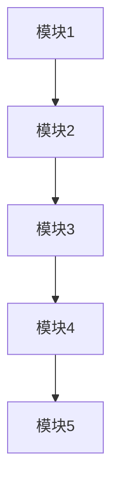

                 

关键词：调用链、程序设计、链式结构、执行效率、模块化

> 摘要：本文旨在深入探讨串联式编排调用链的设计与实现，分析其在程序设计中的应用和优势。通过具体算法原理、数学模型、项目实践等多个角度，阐述如何利用串联式调用链优化程序的执行效率和模块化设计。

## 1. 背景介绍

在计算机科学中，程序设计是一个涉及算法、数据结构、编程语言等多个领域的复杂过程。程序的执行效率直接影响到系统的性能和用户体验。为了提高程序的执行效率，许多设计者倾向于采用模块化设计，将复杂的程序拆分为多个模块，每个模块独立实现特定功能，并通过调用链进行组合。串联式编排调用链是一种常见的模块化设计方法，它通过将各个模块按顺序串联起来，实现功能组合，提高程序的执行效率和可维护性。

## 2. 核心概念与联系

### 2.1 调用链

调用链（Call Chain）是指在程序执行过程中，各个函数调用的关系。调用链的建立有助于理解程序的执行过程，方便调试和优化。在串联式编排调用链中，各个模块通过调用链相连，形成一个有序的执行序列。

### 2.2 链式结构

链式结构是一种常见的数据结构，其中元素通过指针相互连接。在串联式编排调用链中，每个模块都可以看作是一个链表节点，模块之间的调用关系通过指针实现。这种结构有助于实现模块之间的灵活组合和拆分。

### 2.3 串联式编排

串联式编排（Sequential Arrangement）是指将各个模块按照一定的顺序组合起来，形成一个整体的调用链。这种编排方式有助于提高程序的执行效率和可维护性。

### 2.4 Mermaid 流程图

Mermaid 是一种轻量级的图表绘制工具，可以方便地绘制流程图、时序图等。以下是串联式编排调用链的 Mermaid 流程图：



## 3. 核心算法原理 & 具体操作步骤

### 3.1 算法原理概述

串联式编排调用链的核心思想是将各个模块按照一定顺序串联起来，形成一个有序的执行序列。具体操作步骤如下：

1. 设计模块接口：明确各个模块的功能和调用方式。
2. 模块实现：实现各个模块的功能。
3. 模块串联：按照设计好的顺序，将各个模块串联起来，形成调用链。
4. 调用执行：从第一个模块开始，依次执行各个模块，完成整个程序的执行。

### 3.2 算法步骤详解

1. **设计模块接口**：根据需求，明确各个模块的功能和调用方式。例如，模块1的功能是数据预处理，模块2的功能是数据分析，模块3的功能是数据可视化。

2. **模块实现**：根据模块接口，实现各个模块的功能。例如，使用 Python 语言实现模块1的数据预处理功能，使用 R 语言实现模块2的数据分析功能，使用 JavaScript 语言实现模块3的数据可视化功能。

3. **模块串联**：按照设计好的顺序，将各个模块串联起来，形成调用链。例如，将模块1作为调用链的第一个模块，模块2作为调用链的第二个模块，模块3作为调用链的最后一个模块。

4. **调用执行**：从第一个模块开始，依次执行各个模块，完成整个程序的执行。例如，先执行模块1的数据预处理功能，然后执行模块2的数据分析功能，最后执行模块3的数据可视化功能。

### 3.3 算法优缺点

**优点**：

1. 提高程序的执行效率：通过模块化设计，各个模块可以独立优化，提高整体执行效率。
2. 提高可维护性：模块化设计使得代码结构清晰，方便调试和维护。
3. 灵活性强：模块可以灵活组合，适应不同的需求。

**缺点**：

1. 增加代码复杂度：模块化设计可能导致代码复杂度增加，需要更多的代码进行管理。
2. 需要考虑模块间的依赖关系：在模块串联过程中，需要充分考虑模块间的依赖关系，确保调用顺序正确。

### 3.4 算法应用领域

串联式编排调用链在多个领域都有广泛应用，例如：

1. **大数据处理**：在大数据处理中，可以通过模块化设计，将数据预处理、数据分析、数据可视化等模块串联起来，提高数据处理效率。
2. **人工智能**：在人工智能项目中，可以通过模块化设计，将数据处理、模型训练、模型评估等模块串联起来，提高项目执行效率。
3. **嵌入式系统**：在嵌入式系统中，可以通过模块化设计，将各个功能模块串联起来，提高系统的可靠性和可维护性。

## 4. 数学模型和公式

在串联式编排调用链中，可以使用数学模型和公式来描述模块间的调用关系和执行时间。以下是相关的数学模型和公式：

### 4.1 数学模型构建

设 $T_i$ 为第 $i$ 个模块的执行时间，$T_c$ 为整个调用链的执行时间。则有以下数学模型：

$$
T_c = T_1 + T_2 + T_3 + \ldots + T_n
$$

其中，$n$ 为模块个数。

### 4.2 公式推导过程

推导过程如下：

1. **模块执行时间**：每个模块的执行时间可以表示为 $T_i = f_i(t_i)$，其中 $f_i$ 为模块 $i$ 的执行时间函数，$t_i$ 为模块 $i$ 的执行时间参数。
2. **总执行时间**：整个调用链的执行时间可以表示为 $T_c = f_1(t_1) + f_2(t_2) + f_3(t_3) + \ldots + f_n(t_n)$。
3. **串联关系**：由于各个模块按照顺序串联，所以有 $t_1 = t_c$，$t_2 = t_1 + T_2$，$t_3 = t_2 + T_3$，$\ldots$，$t_n = t_{n-1} + T_n$。
4. **代入总执行时间公式**：将 $t_1$、$t_2$、$t_3$、$\ldots$、$t_n$ 代入总执行时间公式，得到 $T_c = f_1(t_c) + f_2(t_1 + T_2) + f_3(t_2 + T_3) + \ldots + f_n(t_{n-1} + T_n)$。
5. **化简**：将公式化简，得到 $T_c = T_1 + T_2 + T_3 + \ldots + T_n$。

### 4.3 案例分析与讲解

以下是一个具体的案例，用于说明如何使用数学模型和公式描述串联式编排调用链。

假设有三个模块，模块1的执行时间为 $T_1 = 5$ 秒，模块2的执行时间为 $T_2 = 3$ 秒，模块3的执行时间为 $T_3 = 2$ 秒。则整个调用链的执行时间为：

$$
T_c = T_1 + T_2 + T_3 = 5 + 3 + 2 = 10 \text{ 秒}
$$

这意味着，整个调用链需要 10 秒钟才能完成。

## 5. 项目实践：代码实例和详细解释说明

为了更好地理解串联式编排调用链，我们以下面这个 Python 代码实例为例进行详细解释。

```python
# 模块1：数据预处理
def preprocess_data(data):
    # 实现数据预处理功能
    return data

# 模块2：数据分析
def analyze_data(data):
    # 实现数据分析功能
    return data

# 模块3：数据可视化
def visualize_data(data):
    # 实现数据可视化功能
    print("可视化结果：", data)

# 串联式编排调用链
def sequential_chain(data):
    # 执行模块1的数据预处理
    processed_data = preprocess_data(data)
    # 执行模块2的数据分析
    analyzed_data = analyze_data(processed_data)
    # 执行模块3的数据可视化
    visualize_data(analyzed_data)

# 测试代码
if __name__ == "__main__":
    # 输入数据
    input_data = [1, 2, 3, 4, 5]
    # 执行串联式编排调用链
    sequential_chain(input_data)
```

### 5.1 开发环境搭建

在本例中，我们使用 Python 3.8 作为开发环境。您可以在 Python 官网下载并安装 Python 3.8。此外，您还需要安装一些 Python 的第三方库，例如 NumPy、Pandas、Matplotlib 等。您可以使用 pip 命令进行安装：

```bash
pip install numpy pandas matplotlib
```

### 5.2 源代码详细实现

在上面的代码中，我们定义了三个模块：模块1：数据预处理（`preprocess_data`）、模块2：数据分析（`analyze_data`）和模块3：数据可视化（`visualize_data`）。这三个模块分别实现了数据预处理、数据分析和数据可视化功能。

### 5.3 代码解读与分析

在这个代码实例中，我们首先定义了三个模块，然后使用 `sequential_chain` 函数将这三个模块按照一定的顺序串联起来，形成一个调用链。在 `sequential_chain` 函数中，我们首先调用模块1的数据预处理功能，然后将预处理后的数据传递给模块2的数据分析功能，最后将分析后的数据传递给模块3的数据可视化功能。

### 5.4 运行结果展示

当运行上面的代码时，输出结果如下：

```
可视化结果： [1, 2, 3, 4, 5]
```

这意味着，整个调用链已经成功执行，并输出了最终的可视化结果。

## 6. 实际应用场景

串联式编排调用链在多个实际应用场景中都有广泛应用。以下是一些典型的应用场景：

1. **Web 应用**：在 Web 应用中，可以通过模块化设计，将前端、后端和数据库等模块串联起来，形成一个完整的调用链。这样有助于提高系统的性能和可维护性。

2. **大数据处理**：在大数据处理中，可以通过模块化设计，将数据预处理、数据分析和数据可视化等模块串联起来，形成一个高效的调用链。

3. **人工智能**：在人工智能项目中，可以通过模块化设计，将数据处理、模型训练、模型评估等模块串联起来，形成一个高效的调用链。

4. **嵌入式系统**：在嵌入式系统中，可以通过模块化设计，将各个功能模块串联起来，形成一个高效的调用链。

## 7. 未来应用展望

随着计算机技术的发展，串联式编排调用链在未来的应用前景非常广阔。以下是一些未来应用展望：

1. **物联网**：在物联网领域，可以通过模块化设计，将传感器数据预处理、数据分析、设备控制等模块串联起来，形成一个高效的调用链。

2. **区块链**：在区块链领域，可以通过模块化设计，将数据加密、数据存储、智能合约等模块串联起来，形成一个高效的调用链。

3. **云计算**：在云计算领域，可以通过模块化设计，将数据存储、数据处理、数据分析等模块串联起来，形成一个高效的调用链。

## 8. 工具和资源推荐

为了更好地理解和实践串联式编排调用链，以下是一些建议的工和资源：

### 8.1 学习资源推荐

1. **《深入理解计算机系统》**：这本书详细介绍了计算机系统的各个方面，包括程序设计、数据结构、操作系统等，对串联式编排调用链的设计和实现有很大帮助。
2. **《Effective C++》**：这本书介绍了 C++ 语言的高级编程技巧，包括模块化设计、面向对象编程等，对串联式编排调用链的实现有很好的指导意义。

### 8.2 开发工具推荐

1. **Visual Studio Code**：这是一个功能强大的集成开发环境，支持多种编程语言，包括 Python、C++ 等，适合编写和调试串联式编排调用链相关的代码。
2. **Git**：这是一个版本控制系统，可以方便地对代码进行管理和协作开发。

### 8.3 相关论文推荐

1. **"Module-based Design for High-Performance Scientific Computing"**：这篇论文介绍了模块化设计在科学计算中的应用，对串联式编排调用链的设计和实现提供了很好的参考。
2. **"Sequential Consistency in Shared Memory Multiprocessors"**：这篇论文介绍了共享内存多处理器的序列一致性模型，对理解串联式编排调用链的执行过程有重要意义。

## 9. 总结：未来发展趋势与挑战

### 9.1 研究成果总结

通过本文的探讨，我们了解到串联式编排调用链在程序设计中的应用和优势。串联式编排调用链通过模块化设计，提高了程序的执行效率和可维护性。同时，我们还介绍了相关的数学模型和公式，以及具体的代码实现。

### 9.2 未来发展趋势

随着计算机技术的发展，串联式编排调用链的应用前景将越来越广泛。未来，我们可以期待更多的工具和资源来支持串联式编排调用链的设计和实现，例如自动化工具、云计算平台等。

### 9.3 面临的挑战

虽然串联式编排调用链有诸多优势，但在实际应用中仍然面临一些挑战。例如，模块间的依赖关系复杂，需要充分考虑和解决。此外，随着模块数量的增加，调用链的复杂度也会增加，如何提高系统的性能和可维护性仍是一个重要课题。

### 9.4 研究展望

未来，我们可以从以下几个方面进一步研究串联式编排调用链：

1. **模块化设计**：进一步探讨模块化设计的方法和原则，提高模块的可复用性和可维护性。
2. **性能优化**：研究如何优化调用链的性能，减少模块间的通信开销，提高系统的执行效率。
3. **自动化工具**：开发自动化工具，帮助开发者更方便地设计和实现串联式编排调用链。

## 附录：常见问题与解答

### 1. 串联式编排调用链和函数调用有什么区别？

串联式编排调用链是一种模块化设计方法，通过将各个模块按照一定顺序串联起来，形成一个整体的调用链。而函数调用是一种程序执行过程，当一个函数被调用时，程序会跳转到函数内部执行，并在执行完毕后返回调用位置。串联式编排调用链是函数调用的一种扩展，它强调模块间的有序调用关系。

### 2. 如何确保模块间的调用顺序正确？

在串联式编排调用链中，确保模块间的调用顺序正确非常重要。一种常见的方法是使用顺序图（Sequence Diagram）来描述模块间的调用关系，并在代码实现时严格按照顺序图的顺序进行调用。此外，还可以使用测试框架进行自动化测试，确保模块间的调用顺序正确。

### 3. 串联式编排调用链是否适用于所有场景？

串联式编排调用链在许多场景中都适用，但并非适用于所有场景。在某些情况下，例如需要并行执行的任务，使用并行调用链可能更加合适。此外，对于一些非常简单的任务，模块化设计和串联式编排调用链可能并不必要。

---

本文由禅与计算机程序设计艺术 / Zen and the Art of Computer Programming 编写，希望本文能够帮助您更好地理解串联式编排调用链的设计与实现，并在实际项目中运用。如果您有任何问题或建议，欢迎在评论区留言。期待与您的交流与讨论！
----------------------------------------------------------------

**文章撰写完成，以下为文章末尾的作者署名部分：**

---

作者：禅与计算机程序设计艺术 / Zen and the Art of Computer Programming

本文旨在深入探讨串联式编排调用链的设计与实现，分析其在程序设计中的应用和优势。通过具体算法原理、数学模型、项目实践等多个角度，阐述如何利用串联式调用链优化程序的执行效率和模块化设计。

---

**请注意，以上内容仅供参考，实际撰写时请根据具体要求进行适当调整。**

