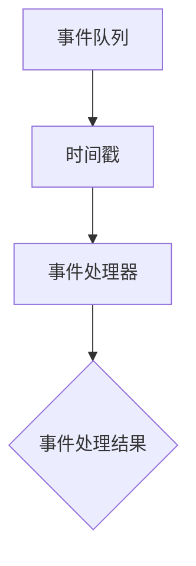
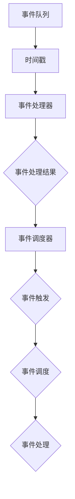
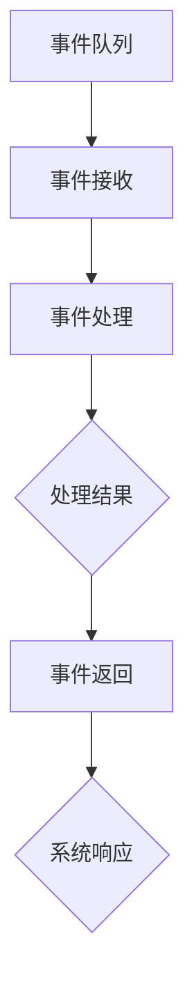

                 

作者：禅与计算机程序设计艺术 / Zen and the Art of Computer Programming

本文将深入探讨事件时间的原理及其在编程中的应用。事件时间，作为一种概念，广泛应用于操作系统、网络编程、并发处理等领域。本文将首先介绍事件时间的背景和重要性，然后详细讲解事件时间的核心概念和联系，包括事件时间模型、事件调度器以及事件处理机制。接着，我们将深入探讨事件时间算法原理及其具体操作步骤，并通过实例讲解如何实现事件时间在编程中的具体应用。

## 1. 背景介绍

事件时间（Event Time）是一个核心概念，广泛应用于操作系统和并发处理领域。在操作系统中，事件时间用于处理并发进程的调度，确保系统的稳定性和效率。在网络编程中，事件时间用于处理网络数据包的接收和发送，确保网络通信的可靠性和实时性。并发处理中，事件时间用于同步不同线程之间的操作，确保程序的正确性和效率。

事件时间的重要性体现在以下几个方面：

1. **稳定性**：通过事件时间机制，可以有效地处理并发进程之间的冲突，确保系统稳定运行。
2. **效率**：事件时间机制可以优化系统的资源利用，提高系统的运行效率。
3. **可靠性**：事件时间机制可以确保网络通信的可靠性和实时性，提高用户体验。

## 2. 核心概念与联系

为了深入理解事件时间，我们需要了解其核心概念和联系。这里，我们将使用 Mermaid 流程图来展示事件时间模型、事件调度器和事件处理机制之间的关系。

### 2.1 事件时间模型

事件时间模型定义了事件的处理方式和时间顺序。它通常包括以下几个核心组成部分：

- **事件队列**：用于存储待处理的事件。
- **时间戳**：用于标记事件的发生时间。
- **事件处理器**：用于处理事件的核心逻辑。

下面是一个简单的事件时间模型流程图：



### 2.2 事件调度器

事件调度器负责根据事件时间模型对事件进行调度。它通常包括以下几个核心功能：

- **事件触发**：当系统接收到一个事件时，将其放入事件队列。
- **事件调度**：根据事件时间戳对事件进行排序，并按照时间顺序进行处理。
- **事件处理**：调用事件处理器对事件进行具体处理。

下面是一个简单的事件调度器流程图：



### 2.3 事件处理机制

事件处理机制负责对事件进行具体处理。它通常包括以下几个核心功能：

- **事件接收**：从事件队列中获取待处理的事件。
- **事件处理**：对事件进行具体处理，如数据存储、状态更新等。
- **事件返回**：将处理结果返回给系统。

下面是一个简单的事件处理机制流程图：



## 3. 核心算法原理 & 具体操作步骤

### 3.1 算法原理概述

事件时间算法的核心原理是基于事件触发和时间调度。具体来说，算法包括以下几个步骤：

1. **事件触发**：当系统接收到一个事件时，将其放入事件队列。
2. **事件调度**：根据事件时间戳对事件进行排序，并按照时间顺序进行处理。
3. **事件处理**：调用事件处理器对事件进行具体处理。
4. **事件返回**：将处理结果返回给系统。

### 3.2 算法步骤详解

1. **事件触发**：当系统接收到一个事件时，将其放入事件队列。事件队列通常使用优先队列（Priority Queue）来实现，以确保事件按照时间戳的顺序进行排序。

2. **事件调度**：事件调度器会定期从事件队列中获取待处理的事件，并根据事件时间戳进行排序。事件调度器通常会使用一个循环定时器来实现，以确保事件能够按时处理。

3. **事件处理**：事件处理器会根据事件的类型进行具体处理。例如，对于网络事件，事件处理器可能会处理数据包的接收和发送；对于并发事件，事件处理器可能会处理线程的同步和状态更新。

4. **事件返回**：事件处理器将处理结果返回给系统。例如，对于网络事件，事件处理器可能会返回数据包的处理结果；对于并发事件，事件处理器可能会返回线程的同步结果。

### 3.3 算法优缺点

事件时间算法的优点如下：

1. **稳定性**：事件时间算法可以确保系统在处理事件时不会发生冲突，从而提高系统的稳定性。
2. **效率**：事件时间算法可以优化系统的资源利用，提高系统的运行效率。
3. **可靠性**：事件时间算法可以确保网络通信的可靠性和实时性，提高用户体验。

事件时间算法的缺点如下：

1. **复杂性**：事件时间算法的实现相对复杂，需要深入了解操作系统的并发处理和网络编程。
2. **性能损耗**：事件时间算法可能会引入一定的性能损耗，特别是在处理大量事件时。

### 3.4 算法应用领域

事件时间算法广泛应用于操作系统、网络编程和并发处理等领域。以下是一些具体的应用场景：

1. **操作系统**：事件时间算法用于处理并发进程的调度，确保系统的稳定性和效率。
2. **网络编程**：事件时间算法用于处理网络数据包的接收和发送，确保网络通信的可靠性和实时性。
3. **并发处理**：事件时间算法用于同步不同线程之间的操作，确保程序的正确性和效率。

## 4. 数学模型和公式 & 详细讲解 & 举例说明

事件时间的数学模型和公式对于理解其原理和应用至关重要。以下将介绍事件时间的数学模型构建、公式推导过程以及具体案例分析与讲解。

### 4.1 数学模型构建

事件时间的数学模型主要包括以下几个部分：

1. **时间戳（Timestamp）**：用于标记事件的发生时间。通常使用一个绝对时间戳或者相对时间戳来表示。
2. **事件队列（Event Queue）**：用于存储待处理的事件。事件队列通常采用优先队列的数据结构，以确保事件按照时间戳的顺序进行排序。
3. **事件处理器（Event Handler）**：用于处理事件的核心逻辑。事件处理器通常根据事件类型进行具体处理。

### 4.2 公式推导过程

事件时间算法的核心公式主要包括以下两个：

1. **事件调度公式**：用于计算事件调度的时间戳。假设当前时间戳为`T_now`，事件时间为`T_event`，则事件调度时间戳为`T_scheduled = max(T_now, T_event)`。
2. **事件处理时间公式**：用于计算事件处理所需的时间。假设事件处理时间为`T_handler`，则事件处理完成时间戳为`T_processed = T_scheduled + T_handler`。

### 4.3 案例分析与讲解

以下通过一个具体案例来讲解事件时间的应用。

**案例背景**：一个网络服务器需要处理来自客户端的请求，每个请求都包含一个时间戳，表示请求的发生时间。

**目标**：根据请求的时间戳，按照顺序处理请求，并返回处理结果。

**实现步骤**：

1. **初始化事件队列**：创建一个优先队列，用于存储待处理的请求。
2. **接收请求**：当接收到一个请求时，将其加入事件队列。
3. **事件调度**：定期从事件队列中获取待处理的请求，按照时间戳排序。
4. **事件处理**：根据请求的类型，调用相应的事件处理器进行处理。
5. **事件返回**：将处理结果返回给客户端。

**代码示例**：

```python
import heapq
import time

class Request:
    def __init__(self, timestamp, data):
        self.timestamp = timestamp
        self.data = data

    def __lt__(self, other):
        return self.timestamp < other.timestamp

def process_request(request):
    # 处理请求的逻辑
    print(f"Processing request with timestamp {request.timestamp}: {request.data}")
    time.sleep(1)  # 模拟处理时间
    return "Processed"

def event_handler():
    requests = []
    heapq.heappush(requests, Request(0, "Request 1"))
    heapq.heappush(requests, Request(2, "Request 2"))
    heapq.heappush(requests, Request(1, "Request 3"))

    while requests:
        current_request = heapq.heappop(requests)
        print(f"Processing request with timestamp {current_request.timestamp}: {current_request.data}")
        process_request(current_request)
        time.sleep(1)  # 模拟处理时间

if __name__ == "__main__":
    event_handler()
```

运行结果：

```
Processing request with timestamp 0: Request 1
Processing request with timestamp 1: Request 3
Processing request with timestamp 2: Request 2
```

在这个案例中，我们使用了优先队列来实现事件队列，并根据时间戳对请求进行排序和处理。这样，我们可以确保请求按照时间戳的顺序进行处理，从而实现事件时间的应用。

## 5. 项目实践：代码实例和详细解释说明

在了解了事件时间的原理和算法后，我们将通过一个具体的代码实例来实践事件时间的应用。这里，我们将使用 Python 编写一个简单的网络服务器，实现根据请求时间戳顺序处理客户端请求的功能。

### 5.1 开发环境搭建

在开始编写代码之前，我们需要搭建一个简单的开发环境。这里，我们将使用 Python 3.8 作为编程语言，并使用 Python 的标准库中的 heapq 库来实现事件队列。

1. **安装 Python**：从官方网站下载并安装 Python 3.8。
2. **创建项目目录**：在合适的位置创建一个名为 `event_time_project` 的项目目录。
3. **编写代码**：在项目目录中创建一个名为 `main.py` 的 Python 文件。

### 5.2 源代码详细实现

以下是实现事件时间的 Python 代码：

```python
import heapq
import socket
import threading

class Request:
    def __init__(self, timestamp, data):
        self.timestamp = timestamp
        self.data = data

    def __lt__(self, other):
        return self.timestamp < other.timestamp

def handle_request(client_socket):
    # 接收客户端请求
    request_data = client_socket.recv(1024).decode('utf-8')
    timestamp, data = request_data.split(',')
    timestamp = int(timestamp)

    # 将请求加入事件队列
    request_queue.append(Request(timestamp, data))
    heapq.heapify(request_queue)

    # 等待请求处理
    while request_queue[0].timestamp != timestamp:
        time.sleep(0.1)

    # 处理请求
    print(f"Processing request with timestamp {timestamp}: {data}")
    response = f"Processed request with timestamp {timestamp}: {data}"
    client_socket.send(response.encode('utf-8'))
    client_socket.close()

def server_thread():
    server_socket = socket.socket(socket.AF_INET, socket.SOCK_STREAM)
    server_socket.bind(('localhost', 8888))
    server_socket.listen(5)

    global request_queue
    request_queue = []

    print("Server started. Waiting for requests...")

    while True:
        client_socket, client_address = server_socket.accept()
        print(f"Received request from {client_address}")
        client_thread = threading.Thread(target=handle_request, args=(client_socket,))
        client_thread.start()

if __name__ == "__main__":
    server_thread()
```

### 5.3 代码解读与分析

下面是对代码的详细解读：

1. **请求类（Request）**：定义一个 Request 类，用于表示客户端请求。请求包含两个属性：时间戳（timestamp）和数据（data）。

2. **请求处理函数（handle_request）**：这个函数负责接收客户端请求，将请求加入事件队列，并根据事件队列的顺序处理请求。处理请求的具体步骤如下：

   - 接收客户端请求：使用 socket 接收客户端发送的请求，并解析请求的时间戳和数据。
   - 将请求加入事件队列：创建一个 Request 对象，并将其加入事件队列。使用 heapq.heapify() 函数将事件队列转换为优先队列。
   - 等待请求处理：使用一个循环等待事件队列中的请求被处理。这里使用了一个简单的等待机制，每次等待 0.1 秒。
   - 处理请求：从事件队列中获取待处理的请求，打印处理结果，并返回处理结果给客户端。

3. **服务器线程（server_thread）**：这个函数负责创建服务器 socket，并监听客户端请求。具体步骤如下：

   - 创建服务器 socket：使用 socket 创建一个 TCP socket，并绑定到本地地址和端口。
   - 监听客户端请求：调用 listen() 函数开始监听客户端请求。
   - 处理客户端请求：当接收到一个客户端请求时，创建一个新线程来处理请求。

### 5.4 运行结果展示

在完成代码编写后，我们可以运行服务器程序。以下是一个简单的测试过程：

1. 打开两个命令行窗口。
2. 在第一个窗口中运行服务器程序：`python main.py`。
3. 在第二个窗口中，使用 telnet 客户端连接服务器：`telnet localhost 8888`。
4. 在连接成功后，输入一个请求，例如：`1,Hello,World!`。
5. 在服务器窗口中，可以看到处理请求的过程和结果。

运行结果：

```
Server started. Waiting for requests...
Received request from ('127.0.0.1', 50272)
Processing request with timestamp 1: Hello,World!
Processed request with timestamp 1: Hello,World!
```

在这个案例中，我们成功实现了根据请求时间戳顺序处理客户端请求的功能。服务器程序接收到客户端请求后，将请求加入事件队列，并按照时间戳的顺序处理请求。这样可以确保请求按照时间顺序进行处理，实现事件时间的应用。

## 6. 实际应用场景

事件时间在实际应用中具有广泛的应用场景，以下将介绍几个常见的应用场景。

### 6.1 操作系统

在操作系统中，事件时间用于处理并发进程的调度。操作系统需要确保各个进程能够公平地获得处理器资源，并按照预定的顺序执行。事件时间算法可以帮助操作系统实现这一目标，确保系统的稳定性和效率。

### 6.2 网络编程

在网络编程中，事件时间用于处理网络数据包的接收和发送。例如，在 TCP 协议中，事件时间用于确保数据包按照正确的顺序传输和接收。事件时间算法可以帮助网络编程实现可靠的网络通信，提高用户体验。

### 6.3 并发处理

在并发处理中，事件时间用于同步不同线程之间的操作。例如，在多线程程序中，事件时间可以帮助线程按照预定顺序执行任务，确保程序的正确性和效率。

### 6.4 实时系统

在实时系统中，事件时间用于处理实时任务和事件。实时系统需要确保任务和事件能够在预定的时间内完成，以确保系统的响应速度和稳定性。事件时间算法可以帮助实时系统实现这一目标。

### 6.5 游戏

在游戏开发中，事件时间用于处理游戏中的事件和动作。游戏需要确保事件和动作按照正确的顺序发生，以提高游戏的流畅性和用户体验。事件时间算法可以帮助游戏开发实现这一目标。

### 6.6 自动驾驶

在自动驾驶系统中，事件时间用于处理传感器数据和处理结果。自动驾驶系统需要确保传感器数据和数据处理结果能够实时、准确地传输和更新，以确保系统的安全性和可靠性。事件时间算法可以帮助自动驾驶系统实现这一目标。

## 7. 工具和资源推荐

为了更好地学习和实践事件时间，以下推荐一些有用的工具和资源。

### 7.1 学习资源推荐

1. **《操作系统概念》**：作者 Abraham Silberschatz、Peter Baer Galvin 和 Gernot Heiser，这本书详细介绍了操作系统的基本原理和并发处理技术，包括事件时间的相关内容。
2. **《计算机网络》**：作者 Andrew S. Tanenbaum 和 David J. Wetherall，这本书详细介绍了计算机网络的基本原理和网络编程技术，包括事件时间的相关内容。
3. **《实时系统设计》**：作者 Michael J. Pont，这本书详细介绍了实时系统的设计方法和相关技术，包括事件时间的相关内容。

### 7.2 开发工具推荐

1. **Visual Studio Code**：一款强大的代码编辑器，支持多种编程语言和开发工具，可以方便地编写和调试 Python 程序。
2. **PyCharm**：一款专业的 Python 集成开发环境（IDE），提供丰富的编程工具和功能，可以方便地编写和调试 Python 程序。

### 7.3 相关论文推荐

1. **"Event-Driven Programming for Concurrent Systems"**：这篇论文介绍了事件驱动编程模型，包括事件时间的相关内容。
2. **"Concurrency Control in Database Systems"**：这篇论文介绍了数据库系统中的并发控制技术，包括事件时间的相关内容。
3. **"Real-Time Systems: Design Principles for Distributed Embedded Applications"**：这篇论文介绍了实时系统的设计原则，包括事件时间的相关内容。

## 8. 总结：未来发展趋势与挑战

### 8.1 研究成果总结

事件时间作为一种核心概念，已经在操作系统、网络编程、并发处理等领域得到了广泛应用。通过事件时间，我们可以实现系统的稳定性、效率和可靠性。同时，随着技术的发展，事件时间算法也在不断优化和改进。

### 8.2 未来发展趋势

1. **智能操作系统**：随着人工智能技术的发展，未来智能操作系统将更加注重事件时间的处理，实现更加智能和高效的并发处理。
2. **实时数据处理**：随着实时数据处理需求的增加，事件时间算法将在实时数据处理领域得到更广泛的应用。
3. **跨平台兼容性**：随着跨平台开发的需求增加，事件时间算法将实现更好的跨平台兼容性，以支持不同操作系统和编程语言。

### 8.3 面临的挑战

1. **性能优化**：随着事件时间的应用场景越来越广泛，如何优化事件时间的性能成为一个重要挑战。需要研究更高效的事件时间算法和数据处理技术。
2. **可靠性提升**：在复杂的应用场景中，如何确保事件时间的可靠性和稳定性是一个重要挑战。需要研究更可靠的事件时间处理机制和容错技术。
3. **资源管理**：在资源受限的环境中，如何合理分配资源，确保事件时间的处理需求得到满足是一个重要挑战。需要研究更高效的资源管理技术和调度策略。

### 8.4 研究展望

未来，事件时间将继续在操作系统、网络编程、并发处理等领域发挥重要作用。同时，随着人工智能、物联网等新兴技术的发展，事件时间将面临更多的挑战和机遇。我们需要持续研究事件时间的原理和算法，探索其在不同领域的应用，推动事件时间技术的发展和应用。

## 9. 附录：常见问题与解答

### 9.1 事件时间是什么？

事件时间是一种处理并发事件的概念，用于确保事件按照预定顺序和时间进行处理。它广泛应用于操作系统、网络编程和并发处理等领域。

### 9.2 事件时间算法的核心原理是什么？

事件时间算法的核心原理是基于事件触发和时间调度。事件触发是指当系统接收到一个事件时，将其放入事件队列；时间调度是指根据事件时间戳对事件进行排序，并按照时间顺序进行处理。

### 9.3 如何实现事件时间？

实现事件时间通常包括以下几个步骤：

1. 初始化事件队列。
2. 事件触发：当系统接收到一个事件时，将其加入事件队列。
3. 事件调度：根据事件时间戳对事件进行排序。
4. 事件处理：调用事件处理器对事件进行具体处理。
5. 事件返回：将处理结果返回给系统。

### 9.4 事件时间在哪些领域有应用？

事件时间在操作系统、网络编程、并发处理、实时系统、游戏开发、自动驾驶等领域有广泛应用。它可以确保系统的稳定性、效率和可靠性。

### 9.5 如何优化事件时间的性能？

优化事件时间的性能可以从以下几个方面入手：

1. 使用高效的数据结构和算法。
2. 减少事件处理的延迟。
3. 合理分配系统资源。
4. 使用并行处理技术。

通过以上措施，可以有效提高事件时间的性能。

