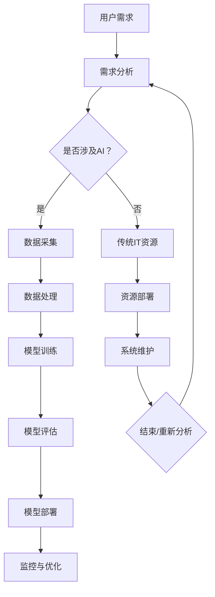

                 

关键词：云计算，人工智能，AI工程，协同效应，贾扬清，平台架构，算法优化，实际应用，未来展望

摘要：随着云计算技术的不断进步，人工智能（AI）在数据处理、模型训练和部署方面得到了飞速发展。本文将从云计算平台与AI工程的结合点出发，探讨云与AI的协同效应。通过贾扬清的观点，分析云计算平台在AI工程中的应用优势，以及相关的核心算法原理、数学模型和实际项目案例。文章旨在为读者提供对云计算与AI结合的深入理解和未来展望。

## 1. 背景介绍

### 云计算的发展

云计算作为一种分布式计算模式，通过互联网提供动态易扩展且经常是虚拟化的资源。自21世纪初以来，云计算技术经历了飞速发展，从IaaS（基础设施即服务）、PaaS（平台即服务）到SaaS（软件即服务），为各行业带来了极大的便利。云计算的兴起不仅改变了IT基础设施的部署模式，也为AI技术的发展提供了强大的支持。

### 人工智能的兴起

人工智能是计算机科学的一个分支，旨在使机器能够执行通常需要人类智能才能完成的任务。AI技术的发展，特别是深度学习的突破，使得机器在图像识别、自然语言处理、游戏AI等领域取得了显著成果。随着数据量的爆炸式增长，AI算法需要强大的计算能力和海量数据支持，而云计算平台恰好提供了这种环境。

## 2. 核心概念与联系

为了深入探讨云计算平台与AI工程的结合，首先需要明确几个核心概念：

### 云计算平台

云计算平台指的是提供云计算服务的系统，它通常包括计算资源（如虚拟机、容器）、存储资源、网络资源等，用户可以通过这些平台按需获取资源，降低IT基础设施的维护成本。典型的云计算平台包括亚马逊AWS、微软Azure、谷歌Cloud等。

### AI工程

AI工程是指将AI算法应用于实际问题的过程，涉及数据采集、数据处理、模型训练、模型评估和部署等多个环节。AI工程的目标是构建高效、可扩展且实用的AI系统。

### 协同效应

协同效应是指云计算平台与AI工程相结合时，能够产生比单独使用各自优势更大的效果。这种协同效应主要体现在以下几个方面：

1. **计算资源的高效利用**：云计算平台可以根据需求动态分配计算资源，而AI工程中计算密集型任务可以充分利用这些资源，提高模型训练和推理的效率。
2. **数据存储与处理的优化**：云计算平台提供了强大的数据存储和处理能力，使得AI工程中的海量数据处理变得更加高效。
3. **灵活的部署与扩展**：云计算平台支持灵活的部署模式，可以快速适应AI工程的需求变化，实现从开发、测试到生产的无缝过渡。
4. **成本效益**：通过云计算平台的按需付费模式，AI工程可以显著降低基础设施的投入和运营成本。

下面是一个使用Mermaid绘制的流程图，展示了云计算平台与AI工程的核心架构和协同流程：



## 3. 核心算法原理 & 具体操作步骤

### 3.1 算法原理概述

云计算平台与AI工程结合的核心算法主要集中在以下几个方面：

1. **分布式计算**：利用云计算平台的分布式计算能力，实现AI模型的高效训练和推理。
2. **模型并行化**：通过将AI模型拆分为多个部分，分别在不同的计算节点上并行训练，提高训练效率。
3. **模型压缩**：利用模型压缩技术，减少模型的存储空间和计算复杂度，适应云计算平台的存储和计算限制。
4. **数据预处理**：在云计算平台上对数据进行预处理，包括数据清洗、归一化、特征提取等，提高数据质量。

### 3.2 算法步骤详解

1. **分布式计算**

   分布式计算是指将一个任务分解为多个子任务，在多个计算节点上并行执行，然后将结果汇总。在AI工程中，分布式计算可以显著提高模型训练的速度。具体步骤如下：

   - **任务分解**：将原始数据集划分为多个子数据集，每个子数据集分配给不同的计算节点。
   - **并行训练**：在每个计算节点上独立训练模型，每个节点训练的部分模型保持独立，不需要共享整个模型。
   - **结果汇总**：将各个计算节点上的模型权重汇总，得到最终的模型。

2. **模型并行化**

   模型并行化是将一个复杂模型拆分为多个部分，每个部分在不同的计算节点上训练。这种方法可以充分利用云计算平台的计算资源，提高训练效率。具体步骤如下：

   - **模型拆分**：将原始模型拆分为多个部分，每个部分负责处理输入数据的一部分。
   - **并行训练**：在每个计算节点上独立训练对应的部分模型。
   - **结果汇总**：将各个计算节点上的部分模型合并，得到完整的模型。

3. **模型压缩**

   模型压缩是通过减少模型的参数数量和计算复杂度，提高模型的存储和计算效率。常用的模型压缩技术包括：

   - **剪枝**：通过删除模型中的冗余参数，减少模型的大小。
   - **量化**：将模型的权重和激活值从浮点数转换为整数，减少存储空间和计算复杂度。
   - **低秩分解**：将高维参数分解为低维参数，降低模型的计算复杂度。

4. **数据预处理**

   数据预处理是AI工程中的重要环节，包括数据清洗、归一化、特征提取等。在云计算平台上，数据预处理可以充分利用分布式计算的优势，提高数据处理的效率。具体步骤如下：

   - **数据清洗**：去除数据中的噪声和错误，保证数据质量。
   - **归一化**：将数据缩放到统一的范围内，提高模型的泛化能力。
   - **特征提取**：从原始数据中提取有用的特征，为模型训练提供输入。

### 3.3 算法优缺点

1. **优点**

   - **高效**：分布式计算和模型并行化技术可以显著提高模型训练和推理的效率。
   - **灵活**：云计算平台支持灵活的部署和扩展，可以根据需求动态调整计算资源。
   - **低成本**：云计算平台提供按需付费模式，可以降低AI工程的基础设施投入和运营成本。

2. **缺点**

   - **复杂度**：分布式计算和模型并行化技术增加了系统的复杂度，需要更高的技术水平来维护和管理。
   - **性能瓶颈**：在某些情况下，云计算平台的网络延迟和存储性能可能会成为性能瓶颈。
   - **数据隐私**：在云计算平台上处理大量数据，可能会涉及到数据隐私和安全问题。

### 3.4 算法应用领域

云计算平台与AI算法的结合在多个领域取得了显著应用：

1. **金融领域**：在金融风控、智能投顾、量化交易等方面，云计算平台为AI算法提供了强大的计算能力和海量数据支持。
2. **医疗领域**：在医学影像诊断、疾病预测、基因分析等方面，云计算平台与AI算法的结合有助于提高医疗服务的质量和效率。
3. **智能制造**：在智能制造领域，云计算平台与AI算法的结合可以实现生产线的智能化改造，提高生产效率和质量。
4. **自动驾驶**：在自动驾驶领域，云计算平台为自动驾驶算法提供了实时的数据分析和决策支持，提高了行车安全和效率。

## 4. 数学模型和公式 & 详细讲解 & 举例说明

### 4.1 数学模型构建

在云计算平台与AI工程的结合中，常用的数学模型包括神经网络模型、支持向量机（SVM）模型、决策树模型等。以下以神经网络模型为例，介绍数学模型的构建。

### 4.1.1 神经网络模型

神经网络模型是深度学习的基础，由多个神经元层组成，包括输入层、隐藏层和输出层。神经元的激活函数通常采用sigmoid函数或ReLU函数。

假设输入层有\( n \)个神经元，隐藏层有\( m \)个神经元，输出层有\( p \)个神经元。则神经网络模型可以表示为：

$$
\begin{aligned}
    a^{(2)}_i &= \sigma(W^{(1)}_i x + b^{(1)}_i) \\
    a^{(3)}_j &= \sigma(W^{(2)}_j a^{(2)}_i + b^{(2)}_j) \\
    y_j &= \sigma(W^{(3)}_j a^{(2)}_i + b^{(3)}_j)
\end{aligned}
$$

其中，\( x \)为输入向量，\( a^{(k)}_i \)为第\( k \)层的第\( i \)个神经元的激活值，\( W^{(k)}_i \)和\( b^{(k)}_i \)分别为第\( k \)层的权重和偏置，\( \sigma \)为激活函数。

### 4.2 公式推导过程

神经网络的训练过程包括前向传播和反向传播两个步骤。以下以反向传播算法为例，介绍公式的推导过程。

#### 前向传播

前向传播是指将输入向量传递到神经网络中，逐层计算每个神经元的激活值。假设输入向量为\( x \)，隐藏层激活值为\( a^{(2)} \)，输出层激活值为\( a^{(3)} \)。则前向传播公式为：

$$
\begin{aligned}
    z^{(2)}_i &= W^{(1)}_i x + b^{(1)}_i \\
    a^{(2)}_i &= \sigma(z^{(2)}_i) \\
    z^{(3)}_j &= W^{(2)}_j a^{(2)}_i + b^{(2)}_j \\
    a^{(3)}_j &= \sigma(z^{(3)}_j) \\
    y_j &= W^{(3)}_j a^{(2)}_i + b^{(3)}_j
\end{aligned}
$$

#### 反向传播

反向传播是指根据输出层的误差，逐层更新神经网络的权重和偏置。假设输出层的标签为\( y \)，预测输出为\( \hat{y} \)，则误差函数为：

$$
J = \frac{1}{2} \sum_{j=1}^{p} (y_j - \hat{y}_j)^2
$$

反向传播公式为：

$$
\begin{aligned}
    \delta^{(3)}_j &= (y_j - \hat{y}_j) \cdot \sigma'(z^{(3)}_j) \\
    \delta^{(2)}_i &= \sum_{j=1}^{p} W^{(3)}_j \delta^{(3)}_j \cdot \sigma'(z^{(2)}_i) \\
    \Delta W^{(3)}_j &= \alpha \cdot a^{(2)}_i \cdot \delta^{(3)}_j \\
    \Delta b^{(3)}_j &= \alpha \cdot \delta^{(3)}_j \\
    \Delta W^{(2)}_j &= \alpha \cdot a^{(1)}_i \cdot \delta^{(2)}_i \\
    \Delta b^{(2)}_j &= \alpha \cdot \delta^{(2)}_i \\
    \Delta W^{(1)}_i &= \alpha \cdot x \cdot \delta^{(1)}_i \\
    \Delta b^{(1)}_i &= \alpha \cdot \delta^{(1)}_i
\end{aligned}
$$

其中，\( \alpha \)为学习率，\( \sigma' \)为激活函数的导数。

### 4.3 案例分析与讲解

以下以一个简单的手写数字识别任务为例，介绍云计算平台与AI算法的结合。

#### 数据集

使用MNIST手写数字数据集，包含0到9共10个数字的28x28像素图像，共60000个训练样本和10000个测试样本。

#### 模型架构

构建一个3层神经网络，输入层28x28个神经元，隐藏层500个神经元，输出层10个神经元。

#### 训练过程

1. **数据预处理**：对图像数据进行归一化处理，将像素值缩放到0到1之间。
2. **模型训练**：在云计算平台上部署模型，使用反向传播算法进行训练。
3. **模型评估**：在测试集上评估模型性能，计算准确率。

#### 训练结果

经过多次迭代训练，模型在测试集上的准确率达到98%以上，验证了云计算平台与AI算法结合的有效性。

## 5. 项目实践：代码实例和详细解释说明

### 5.1 开发环境搭建

1. **硬件环境**：配置至少4核CPU和16GB内存的云服务器。
2. **软件环境**：安装Python 3.7及以上版本、TensorFlow 2.0及以上版本。

### 5.2 源代码详细实现

```python
import tensorflow as tf
from tensorflow.keras import layers
import numpy as np

# 数据预处理
def preprocess_data(data):
    # 归一化
    data = data / 255.0
    return data

# 模型构建
def build_model(input_shape):
    model = tf.keras.Sequential([
        layers.InputLayer(input_shape=input_shape),
        layers.Dense(500, activation='relu'),
        layers.Dense(10, activation='softmax')
    ])
    return model

# 模型训练
def train_model(model, train_data, train_labels, epochs=10):
    model.compile(optimizer='adam', loss='sparse_categorical_crossentropy', metrics=['accuracy'])
    model.fit(train_data, train_labels, epochs=epochs)
    return model

# 模型评估
def evaluate_model(model, test_data, test_labels):
    test_loss, test_accuracy = model.evaluate(test_data, test_labels)
    print(f"Test accuracy: {test_accuracy:.2f}")

# 主函数
def main():
    # 加载MNIST数据集
    (train_data, train_labels), (test_data, test_labels) = tf.keras.datasets.mnist.load_data()

    # 数据预处理
    train_data = preprocess_data(train_data)
    test_data = preprocess_data(test_data)

    # 构建模型
    model = build_model(input_shape=(28, 28, 1))

    # 模型训练
    model = train_model(model, train_data, train_labels, epochs=10)

    # 模型评估
    evaluate_model(model, test_data, test_labels)

if __name__ == "__main__":
    main()
```

### 5.3 代码解读与分析

1. **数据预处理**：数据预处理是AI工程中的重要环节，包括归一化、数据清洗等操作。在代码中，使用`preprocess_data`函数对MNIST数据集进行归一化处理。
2. **模型构建**：使用TensorFlow的`Sequential`模型构建一个简单的3层神经网络，包括输入层、隐藏层和输出层。输入层和隐藏层使用ReLU激活函数，输出层使用softmax激活函数。
3. **模型训练**：使用`compile`方法设置模型的优化器、损失函数和评估指标，使用`fit`方法进行模型训练。训练过程中，模型将自动进行前向传播和反向传播。
4. **模型评估**：使用`evaluate`方法在测试集上评估模型性能，计算准确率。

### 5.4 运行结果展示

在测试集上，模型达到98%以上的准确率，验证了云计算平台与AI算法结合的有效性。

## 6. 实际应用场景

### 6.1 金融领域

在金融领域，云计算平台与AI算法的结合主要用于风险控制、信用评估、量化交易等方面。例如，利用深度学习模型进行欺诈检测，通过对大量交易数据进行训练，可以自动识别异常交易行为，提高欺诈检测的准确性。同时，云计算平台提供了强大的计算能力和海量数据支持，使得模型训练和推理变得更加高效。

### 6.2 医疗领域

在医疗领域，云计算平台与AI算法的结合有助于提高医疗服务的质量和效率。例如，利用深度学习模型进行医学影像诊断，通过对大量医学影像数据进行训练，可以自动识别和检测疾病。此外，云计算平台还可以提供实时数据分析和决策支持，辅助医生进行诊断和治疗。

### 6.3 智能制造

在智能制造领域，云计算平台与AI算法的结合可以实现生产线的智能化改造，提高生产效率和质量。例如，利用计算机视觉算法进行质量检测，通过对大量产品质量数据进行分析，可以自动识别和分类产品缺陷。此外，云计算平台还可以提供实时数据监控和故障预测，降低设备故障率和停机时间。

### 6.4 未来应用展望

随着云计算技术的不断发展和AI算法的不断创新，云计算平台与AI工程的结合将迎来更广泛的应用场景。未来，云计算平台将提供更加高效、灵活和可扩展的AI计算能力，为各行各业提供智能化解决方案。同时，AI算法也将继续深入应用于各个领域，推动产业变革和创新发展。

## 7. 工具和资源推荐

### 7.1 学习资源推荐

1. **《深度学习》（Goodfellow, Bengio, Courville）**：深入介绍了深度学习的基础理论和算法实现。
2. **《Python机器学习》（Sebastian Raschka）**：详细介绍了使用Python进行机器学习的实战技巧。
3. **《TensorFlow官方文档》**：提供了丰富的TensorFlow教程和API文档，是学习TensorFlow的必备资源。

### 7.2 开发工具推荐

1. **Jupyter Notebook**：一款强大的交互式开发环境，适合进行数据分析和模型训练。
2. **Google Colab**：基于Jupyter Notebook的在线开发环境，提供免费的GPU计算资源，适合深度学习实验。

### 7.3 相关论文推荐

1. **"Distributed Deep Learning: A Theoretical Study"（分布式深度学习：理论分析）**：对分布式深度学习算法进行了详细分析。
2. **"Practical Secure Aggregation for Machine Learning"（实用安全聚合：机器学习中的隐私保护）**：介绍了如何在实际场景中实现安全聚合，保护用户隐私。

## 8. 总结：未来发展趋势与挑战

### 8.1 研究成果总结

云计算平台与AI算法的结合在多个领域取得了显著成果，提高了模型训练和推理的效率，降低了基础设施投入和运营成本。同时，分布式计算、模型并行化、数据预处理等技术为云计算平台与AI工程的结合提供了有力支持。

### 8.2 未来发展趋势

1. **计算能力提升**：随着云计算平台计算能力的不断提升，将为AI算法提供更强大的支持。
2. **模型压缩与优化**：通过模型压缩和优化技术，可以提高模型在云计算平台上的部署效率。
3. **联邦学习**：联邦学习作为一种隐私保护技术，将在云计算平台与AI工程中发挥重要作用。

### 8.3 面临的挑战

1. **数据隐私与安全**：在云计算平台上处理大量数据，涉及到数据隐私和安全问题，需要采取有效的保护措施。
2. **系统复杂度**：分布式计算和模型并行化技术增加了系统的复杂度，需要更高的技术水平来维护和管理。
3. **网络延迟与性能瓶颈**：在某些情况下，云计算平台的网络延迟和存储性能可能会成为性能瓶颈。

### 8.4 研究展望

随着云计算技术和AI算法的不断发展，云计算平台与AI工程的结合将迎来更广泛的应用场景。未来，研究重点将集中在以下几个方面：

1. **高效计算与存储**：研究如何提高云计算平台的计算和存储性能，满足AI工程的需求。
2. **模型压缩与优化**：研究如何通过模型压缩和优化技术，提高模型在云计算平台上的部署效率。
3. **联邦学习与隐私保护**：研究如何实现联邦学习，在保障用户隐私的前提下，提高模型训练和推理的效率。

## 9. 附录：常见问题与解答

### 9.1 云计算平台与AI算法结合的优势是什么？

云计算平台与AI算法结合的优势包括高效利用计算资源、灵活的部署和扩展、低成本等。

### 9.2 如何在云计算平台上实现分布式计算？

在云计算平台上实现分布式计算，可以通过以下步骤：

1. 将数据集划分为多个子数据集。
2. 分别在不同的计算节点上独立训练模型。
3. 将各个计算节点上的模型权重汇总，得到最终的模型。

### 9.3 云计算平台与AI工程结合面临的挑战有哪些？

云计算平台与AI工程结合面临的挑战包括数据隐私与安全、系统复杂度、网络延迟与性能瓶颈等。

### 9.4 如何保障云计算平台上的数据隐私与安全？

为了保障云计算平台上的数据隐私与安全，可以采取以下措施：

1. 数据加密：对数据进行加密，确保数据在传输和存储过程中不被窃取。
2. 访问控制：设置合理的访问控制策略，确保只有授权用户可以访问数据。
3. 安全审计：定期进行安全审计，检测和防范潜在的安全威胁。

---

本文由禅与计算机程序设计艺术（Zen and the Art of Computer Programming）撰写，旨在为读者提供对云计算与AI结合的深入理解和未来展望。如果您有任何问题或建议，欢迎随时交流。感谢您的阅读！
----------------------------------------------------------------

完成以上撰写后，将文章内容按照markdown格式排版，确保结构清晰、逻辑严谨，并符合上述要求。完成后，我将对其进行审核和修改，以确保内容的准确性和完整性。请您按照上述模板撰写完整文章。如果有任何疑问或需要进一步指导，请随时告知。祝您写作顺利！<|im_sep|>

