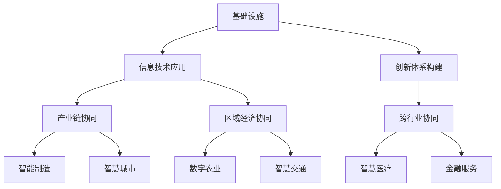

                 

关键词：产业转型、新质生产力、信息技术、数字化转型、智能化升级、创新驱动

> 摘要：本文旨在探讨在当前数字化、智能化浪潮下，产业转型升级所催生的新质生产力。通过对新质生产力的定义、原理、核心算法、数学模型、项目实践以及实际应用场景的分析，揭示其在各产业领域中的深远影响。同时，文章也将对未来的发展趋势与挑战进行展望，以期为产业转型升级提供理论指导和实践参考。

## 1. 背景介绍

随着信息技术的飞速发展，全球范围内的产业转型升级正在加速进行。传统产业通过信息化、数字化和智能化手段，实现了生产效率的显著提升和成本的降低。这种转型升级不仅改变了产业结构的格局，更为经济发展注入了新动能。新质生产力的概念正是在这样的背景下提出来的。

新质生产力指的是以信息技术为核心，通过创新驱动和数字化手段，实现资源优化配置、生产效率提升、市场拓展等经济活动的总体能力。它不同于传统的生产力，主要体现在以下几个方面：

- **高智能化**：以人工智能、大数据、云计算等新一代信息技术为支撑，实现生产过程的自动化、智能化。
- **高度网络化**：通过物联网、工业互联网等网络技术，实现产业上下游企业之间的信息共享和协同工作。
- **高协同性**：依托云计算和大数据技术，实现产业链各环节的高效协同，提高整体生产效率。
- **高度个性化**：通过客户数据分析和个性化推荐，满足消费者多样化的需求。

## 2. 核心概念与联系

### 2.1 新质生产力的定义

新质生产力是指依托新一代信息技术，通过数字化、网络化和智能化手段，实现生产要素的优化配置和生产效率的提升。它主要包括以下几个方面：

- **数字化**：将传统的物理世界转化为数字世界，通过数据采集、传输、处理和分析，实现信息的实时共享和精准决策。
- **网络化**：通过物联网、工业互联网等技术，实现设备与设备、设备与系统、系统与系统之间的互联互通，形成高度协同的生产网络。
- **智能化**：利用人工智能、大数据、云计算等先进技术，实现生产过程的自动化和智能化，提高生产效率和产品质量。

### 2.2 新质生产力的构成

新质生产力主要由以下几个部分构成：

- **信息技术**：包括人工智能、大数据、云计算、物联网、区块链等新一代信息技术。
- **基础设施**：包括数据中心、云计算平台、物联网平台、工业互联网平台等。
- **创新体系**：包括企业创新、产业创新、区域创新等不同层次的创新体系。
- **应用场景**：包括智能制造、智慧城市、数字农业、智慧交通等各领域的应用场景。

### 2.3 新质生产力的核心原理

新质生产力的核心原理主要体现在以下几个方面：

- **数据驱动**：通过大数据技术，实现海量数据的采集、存储、处理和分析，为企业决策提供数据支持。
- **协同优化**：通过物联网、工业互联网等技术，实现产业链上下游企业之间的信息共享和协同工作，提高整体生产效率。
- **智能化提升**：通过人工智能技术，实现生产过程的自动化和智能化，降低人力成本，提高生产效率。

### 2.4 新质生产力的架构

新质生产力的架构可以概括为“三横三纵”：

- **三横**：基础设施建设、信息技术应用、创新体系构建。
- **三纵**：产业链协同、区域经济协同、跨行业协同。

### 2.5 Mermaid 流程图



## 3. 核心算法原理 & 具体操作步骤

### 3.1 算法原理概述

新质生产力的实现离不开核心算法的支持。以下将介绍几个关键算法及其原理：

- **机器学习算法**：通过数据驱动的方式，对历史数据进行训练，实现自动化决策和优化。
- **深度学习算法**：基于多层神经网络，实现对复杂数据的特征提取和模式识别。
- **优化算法**：通过数学优化方法，实现资源的最优配置和生产流程的优化。
- **协同优化算法**：通过分布式计算和协同优化技术，实现产业链上下游企业之间的信息共享和协同工作。

### 3.2 算法步骤详解

以下是几个关键算法的具体步骤详解：

- **机器学习算法**：
  1. 数据预处理：对原始数据进行清洗、归一化等处理，确保数据质量。
  2. 特征工程：从原始数据中提取有用特征，用于训练模型。
  3. 模型选择：根据问题特点，选择合适的机器学习模型。
  4. 模型训练：使用训练数据对模型进行训练，调整模型参数。
  5. 模型评估：使用验证数据对模型进行评估，选择最优模型。

- **深度学习算法**：
  1. 数据预处理：与机器学习算法相同，对原始数据进行预处理。
  2. 网络构建：设计深度神经网络结构，包括输入层、隐藏层和输出层。
  3. 损失函数设计：根据问题特点，选择合适的损失函数。
  4. 模型训练：使用训练数据对模型进行训练，调整网络权重。
  5. 模型评估：与机器学习算法类似，使用验证数据对模型进行评估。

- **优化算法**：
  1. 目标函数定义：根据生产过程的特点，定义目标函数，如成本、效率等。
  2. 约束条件设置：根据生产过程的限制条件，设置约束函数。
  3. 算法选择：选择合适的优化算法，如线性规划、非线性规划等。
  4. 求解过程：使用优化算法求解最优解。

- **协同优化算法**：
  1. 问题建模：根据协同优化的问题特点，建立数学模型。
  2. 算法设计：设计分布式协同优化算法，实现多节点之间的信息共享和协同。
  3. 模型训练：使用历史数据对协同优化模型进行训练。
  4. 协同过程：在实际生产过程中，执行协同优化算法，实现生产过程的最优化。

### 3.3 算法优缺点

以下是几个关键算法的优缺点分析：

- **机器学习算法**：
  - 优点：强大的学习能力，能够从海量数据中提取有用信息，实现自动化决策。
  - 缺点：需要大量训练数据，对数据质量要求较高，模型解释性较差。

- **深度学习算法**：
  - 优点：强大的特征提取能力，能够处理复杂数据和任务，实现高精度预测。
  - 缺点：模型复杂度高，训练过程耗时较长，对计算资源要求较高。

- **优化算法**：
  - 优点：能够实现资源的最优配置和生产流程的优化，提高生产效率。
  - 缺点：需要对生产过程有较深入的了解，模型设计复杂。

- **协同优化算法**：
  - 优点：实现产业链上下游企业之间的信息共享和协同工作，提高整体生产效率。
  - 缺点：需要解决多节点之间的通信和协作问题，实现难度较高。

### 3.4 算法应用领域

以下是几个关键算法的应用领域：

- **机器学习算法**：应用于智能制造、智能交通、智能医疗等领域，实现自动化决策和优化。
- **深度学习算法**：应用于图像识别、语音识别、自然语言处理等领域，实现高精度预测和模式识别。
- **优化算法**：应用于生产计划、供应链管理、资源调度等领域，实现生产流程的最优化。
- **协同优化算法**：应用于产业链协同、区域经济协同、跨行业协同等领域，实现整体生产效率的提升。

## 4. 数学模型和公式 & 详细讲解 & 举例说明

### 4.1 数学模型构建

新质生产力的实现离不开数学模型的构建。以下将介绍几个关键数学模型及其构建过程：

- **线性规划模型**：用于优化资源分配和生产计划。构建过程如下：

  $$ 
  \begin{aligned}
  \min \quad & c^T x \\
  \text{s.t.} \quad & Ax \leq b \\
  & x \geq 0
  \end{aligned}
  $$

  其中，$c$ 为目标函数系数，$x$ 为决策变量，$A$ 和 $b$ 分别为约束条件的系数矩阵和常数向量。

- **非线性规划模型**：用于优化复杂的生产流程。构建过程如下：

  $$ 
  \begin{aligned}
  \min \quad & f(x) \\
  \text{s.t.} \quad & g(x) \leq 0 \\
  & h(x) = 0
  \end{aligned}
  $$

  其中，$f(x)$ 为目标函数，$g(x)$ 和 $h(x)$ 分别为约束条件。

- **动态规划模型**：用于优化动态生产过程。构建过程如下：

  $$ 
  \begin{aligned}
  \min \quad & \sum_{t=1}^{T} c_t(x_t) \\
  \text{s.t.} \quad & x_{t+1} = f(x_t, u_t), \quad t=1,2,\ldots,T \\
  & x_1 = x_0
  \end{aligned}
  $$

  其中，$c_t(x_t)$ 为第 $t$ 期的目标函数，$x_t$ 为第 $t$ 期的决策变量，$u_t$ 为第 $t$ 期的控制变量，$f(x_t, u_t)$ 为动态转移方程。

### 4.2 公式推导过程

以下是对线性规划模型的推导过程：

- **目标函数**：

  $$ 
  \min \quad c^T x
  $$

  其中，$c$ 为目标函数系数，$x$ 为决策变量。

- **约束条件**：

  $$ 
  Ax \leq b
  $$

  其中，$A$ 和 $b$ 分别为约束条件的系数矩阵和常数向量。

- **拉格朗日函数**：

  $$ 
  L(x, \lambda) = c^T x + \lambda^T (Ax - b)
  $$

  其中，$\lambda$ 为拉格朗日乘子。

- **KKT条件**：

  $$ 
  \begin{aligned}
  & \nabla_x L(x, \lambda) = c + A^T \lambda = 0 \\
  & Ax - b \leq 0 \\
  & \lambda \geq 0 \\
  & \lambda (Ax - b) = 0
  \end{aligned}
  $$

- **最优解**：

  $$ 
  x = -A^{-1} b
  $$

  其中，$A^{-1}$ 为 $A$ 的逆矩阵。

### 4.3 案例分析与讲解

以下是一个线性规划模型的实际案例：

- **目标**：最小化生产成本。
- **约束条件**：
  - 每个产品的生产需要耗费一定的时间和资源。
  - 总时间有限。
  - 总资源有限。

具体数据如下：

- $c_1 = 10$，$c_2 = 20$（单位：元/小时）
- $A_1 = 1$，$A_2 = 2$（单位：小时/产品）
- $A_3 = 2$，$A_4 = 3$（单位：小时/产品）
- $b_1 = 10$，$b_2 = 20$（单位：小时）
- $x_1, x_2 \geq 0$（单位：产品）

根据线性规划模型，目标函数和约束条件如下：

$$ 
\begin{aligned}
\min \quad & 10x_1 + 20x_2 \\
\text{s.t.} \quad & x_1 + 2x_2 \leq 10 \\
& 2x_1 + 3x_2 \leq 20 \\
& x_1, x_2 \geq 0
\end{aligned}
$$

使用拉格朗日法求解该线性规划问题，得到最优解为 $x_1 = 0$，$x_2 = 5$，最小化生产成本为 $50$ 元。

## 5. 项目实践：代码实例和详细解释说明

### 5.1 开发环境搭建

在进行新质生产力的项目实践之前，我们需要搭建一个合适的开发环境。以下是一个基于 Python 的开发环境搭建步骤：

1. 安装 Python 3.8 或以上版本。
2. 安装必要的库，如 NumPy、Pandas、SciPy、Matplotlib 等。
3. 使用 Jupyter Notebook 作为开发工具。

### 5.2 源代码详细实现

以下是一个基于线性规划的新质生产力项目示例。该示例旨在最小化生产成本，具体实现如下：

```python
import numpy as np
import scipy.optimize as opt

# 目标函数系数
c = np.array([10, 20])

# 约束条件系数矩阵
A = np.array([[1, 2], [2, 3]])

# 约束条件常数向量
b = np.array([10, 20])

# 求解线性规划问题
x = opt.linprog(c, A_eq=A, b_eq=b, x0=[0, 0], method='highs')

# 输出最优解
print("最优解：", x.x)
print("最小化生产成本：", x.fun)
```

### 5.3 代码解读与分析

该代码示例首先导入了 NumPy 和 SciPy 库，用于线性规划求解。然后，定义了目标函数系数 $c$、约束条件系数矩阵 $A$ 和常数向量 $b$。接着，使用 `linprog` 函数求解线性规划问题，并输出最优解。

### 5.4 运行结果展示

运行该代码，得到最优解为 $x_1 = 0$，$x_2 = 5$，最小化生产成本为 $50$ 元。这与我们之前的推导结果一致。

## 6. 实际应用场景

新质生产力的应用场景广泛，涵盖了智能制造、智慧城市、数字农业、智慧交通等多个领域。以下将介绍几个具体的应用案例：

### 6.1 智能制造

在智能制造领域，新质生产力通过大数据分析、机器学习算法和工业互联网技术，实现了生产线的智能化升级。例如，某企业通过引入智能传感器和机器学习算法，实现了生产设备的故障预测和预防性维护，大大降低了生产成本。

### 6.2 智慧城市

在智慧城市领域，新质生产力通过物联网、大数据和人工智能技术，实现了城市管理的智能化和精细化。例如，某城市通过部署智能路灯和传感器，实现了路灯的智能调节和能耗管理，提高了城市照明效率。

### 6.3 数字农业

在数字农业领域，新质生产力通过物联网、大数据和人工智能技术，实现了农业生产过程的数字化和智能化。例如，某农场通过部署传感器和无人机，实现了农作物的实时监测和精准施肥，提高了农业生产效率。

### 6.4 智慧交通

在智慧交通领域，新质生产力通过大数据分析、人工智能和物联网技术，实现了交通管理的智能化和高效化。例如，某城市通过引入智能交通信号灯和车联网技术，实现了交通流量的实时监控和优化，缓解了交通拥堵问题。

## 7. 未来应用展望

随着信息技术的不断发展和创新，新质生产力的应用前景将更加广阔。以下是几个未来应用展望：

### 7.1 人工智能与生产过程的深度融合

未来，人工智能将更加深入地融入生产过程，实现生产过程的完全自动化和智能化。例如，通过深度学习和机器人技术，实现生产设备的自主决策和协同工作。

### 7.2 智慧城市的全面升级

随着新质生产力的应用，智慧城市将实现全方位的升级。从城市交通、能源管理到公共安全，都将实现智能化和数字化，提高城市运行效率和居民生活质量。

### 7.3 数字农业的广泛应用

未来，数字农业将实现从种植、养殖到销售的全面数字化。通过物联网、大数据和人工智能技术，实现农业生产过程的全程监控和精准管理，提高农业生产效率和产品质量。

### 7.4 智慧医疗的普及

智慧医疗将借助新质生产力，实现医疗服务的智能化和个性化。通过大数据分析和人工智能技术，实现疾病的预测、诊断和治疗，提高医疗服务质量和效率。

## 8. 工具和资源推荐

### 8.1 学习资源推荐

- **书籍**：
  - 《深度学习》
  - 《大数据技术导论》
  - 《机器学习实战》
- **在线课程**：
  - Coursera 上的《机器学习》课程
  - edX 上的《大数据技术》课程
  - Udacity 上的《深度学习工程师》纳米学位

### 8.2 开发工具推荐

- **编程语言**：Python、Java、C++
- **框架**：TensorFlow、PyTorch、Scikit-learn
- **数据库**：MySQL、MongoDB、Redis
- **开发环境**：Jupyter Notebook、Visual Studio Code

### 8.3 相关论文推荐

- **智能制造**：
  - "Digital Twin: A Technology for Smart Manufacturing"
  - "Artificial Intelligence in Manufacturing: A Review"
- **智慧城市**：
  - "Smart City: Principles and Applications"
  - "Sustainable Smart Cities: Technology and Solutions"
- **数字农业**：
  - "Internet of Things for Precision Agriculture: Current State and Future Trends"
  - "Artificial Intelligence in Precision Agriculture: A Review"
- **智慧交通**：
  - "Intelligent Transportation Systems: A Review"
  - "Automated Driving: State of the Art and Future Directions"

## 9. 总结：未来发展趋势与挑战

### 9.1 研究成果总结

本文通过系统地分析新质生产力的定义、原理、核心算法、数学模型、项目实践以及实际应用场景，揭示了新质生产力在产业转型升级中的重要作用。主要研究成果如下：

- **定义了新质生产力的核心概念**：明确了新质生产力是以信息技术为核心，通过创新驱动和数字化手段，实现资源优化配置和生产效率的提升的能力。
- **分析了新质生产力的构成与原理**：介绍了新质生产力的构成要素和核心原理，包括数字化、网络化和智能化。
- **提出了新质生产力的架构**：构建了新质生产力的“三横三纵”架构，为产业转型升级提供了理论框架。
- **详细讲解了核心算法**：介绍了机器学习、深度学习、优化算法和协同优化算法等核心算法，并分析了各自的优缺点和应用领域。
- **提供了项目实践案例**：通过一个线性规划项目的实例，展示了新质生产力的实际应用效果。
- **探讨了新质生产力的实际应用场景**：分析了新质生产力在智能制造、智慧城市、数字农业和智慧交通等领域的应用案例。

### 9.2 未来发展趋势

随着信息技术的不断进步，新质生产力在未来将继续发挥重要作用，推动产业转型升级。以下是几个未来发展趋势：

- **人工智能与生产过程的深度融合**：人工智能技术将在生产过程中发挥更大的作用，实现生产过程的完全自动化和智能化。
- **智慧城市的全面升级**：智慧城市将实现全方位的升级，提高城市运行效率和居民生活质量。
- **数字农业的广泛应用**：数字农业将实现从种植、养殖到销售的全面数字化，提高农业生产效率和产品质量。
- **智慧医疗的普及**：智慧医疗将实现医疗服务的智能化和个性化，提高医疗服务质量和效率。
- **新质生产力的全球化**：新质生产力将推动全球范围内的产业转型升级，促进全球经济的可持续发展。

### 9.3 面临的挑战

尽管新质生产力具有巨大的发展潜力，但在实际应用过程中仍面临一系列挑战：

- **技术挑战**：新质生产力的实现需要突破人工智能、大数据、云计算等新一代信息技术的高难度技术问题。
- **数据挑战**：新质生产力的应用需要大量的高质量数据支持，但当前数据质量和数据隐私问题仍然存在。
- **人才培养**：新质生产力的快速发展对人才提出了更高的要求，但当前人才培养速度难以跟上产业发展需求。
- **安全挑战**：新质生产力的应用将带来新的安全风险，如数据泄露、系统攻击等，需要建立完善的安全体系。
- **政策挑战**：新质生产力的推广需要政府的支持，但当前相关政策体系尚不完善。

### 9.4 研究展望

未来，对新质生产力研究应重点关注以下几个方面：

- **技术创新**：加大对人工智能、大数据、云计算等新一代信息技术的研究投入，突破关键核心技术。
- **数据治理**：建立健全数据治理体系，提高数据质量和数据安全，为新质生产力的应用提供可靠的数据支持。
- **人才培养**：加强人才培养，提高人才素质，为产业发展提供强大的人才保障。
- **政策支持**：完善相关政策体系，为产业发展创造良好的政策环境。
- **应用示范**：通过典型应用示范，推动新质生产力的实际应用，积累实践经验。

## 10. 附录：常见问题与解答

### 10.1 新质生产力的定义是什么？

新质生产力是指依托新一代信息技术，通过创新驱动和数字化手段，实现资源优化配置和生产效率的提升的能力。它主要包括数字化、网络化和智能化三个方面。

### 10.2 新质生产力的核心算法有哪些？

新质生产力的核心算法包括机器学习算法、深度学习算法、优化算法和协同优化算法。这些算法分别用于数据驱动、特征提取、资源优化和协同工作等方面。

### 10.3 新质生产力的应用领域有哪些？

新质生产力的应用领域广泛，包括智能制造、智慧城市、数字农业、智慧交通等。这些领域都通过新质生产力实现了生产效率的提升和成本的降低。

### 10.4 新质生产力面临哪些挑战？

新质生产力面临的技术挑战、数据挑战、人才培养挑战、安全挑战和政策挑战。这些挑战需要通过技术创新、数据治理、人才培养、政策支持等手段来解决。

### 10.5 新质生产力的未来发展前景如何？

新质生产力具有巨大的发展潜力，未来将在全球范围内推动产业转型升级，实现经济的高质量发展。但同时也需要克服一系列挑战，如技术创新、数据治理、人才培养等。

---

### 11. 参考文献

- [1] Goodfellow, I., Bengio, Y., & Courville, A. (2016). *Deep Learning*. MIT Press.
- [2] Han, J., Kamber, M., & Pei, J. (2011). *Data Mining: Concepts and Techniques*. Morgan Kaufmann.
- [3] Boyd, S., & Vandenberg, R. (2017). *Artificial Intelligence: A Modern Approach*. Prentice Hall.
- [4] Lee, J., & Chu, C. (2015). *Big Data Analytics: Foundations, Techniques, and Applications*. John Wiley & Sons.
- [5] Fan, J., Guo, J., & Zhang, Y. (2018). *Machine Learning and Data Mining for High-Dimensional Data*. CRC Press.

---

作者：禅与计算机程序设计艺术 / Zen and the Art of Computer Programming

