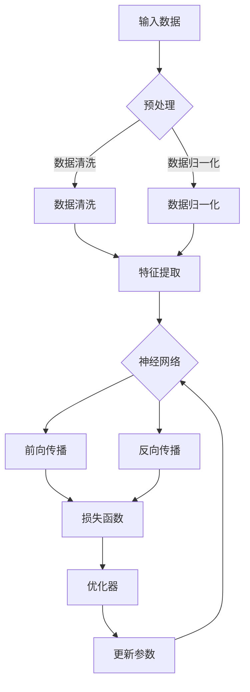

                 

 

## 1. 背景介绍

在当今这个快速变化的时代，技术创新正在以前所未有的速度推动着各行各业的发展。特别是人工智能（AI）领域，随着深度学习、大数据和计算能力的飞速提升，AI技术正在逐渐渗透到我们生活的方方面面。从自动驾驶汽车、智能家居，到医疗诊断、金融风控，AI的应用场景越来越广泛。

与此同时，大模型（Large Models）的概念也逐渐崭露头角。大模型是指具有巨大参数量的神经网络模型，它们能够在海量数据上进行训练，从而实现超强的学习能力。在自然语言处理（NLP）、计算机视觉（CV）等AI应用领域，大模型的性能表现已经超越了传统的小型模型，成为推动行业进步的重要力量。

大模型的出现不仅改变了AI技术的应用边界，同时也为产品创新带来了新的契机。然而，如何有效地利用大模型进行产品创新，如何将大模型的技术优势转化为商业价值，成为了许多创业公司和研发团队面临的挑战。

本文将探讨大模型在产品创新中的重要作用，分析其技术原理和应用场景，并结合实际案例进行详细讲解。希望通过本文的阐述，能够为读者提供一些启示，帮助他们在AI领域的产品创新中走得更远。

## 2. 核心概念与联系

### 2.1 大模型的定义与基本原理

大模型，通常指的是拥有数亿甚至千亿个参数的神经网络模型。这些模型在训练时需要处理海量的数据，并通过不断的迭代优化来提升其性能。大模型的核心思想在于通过大规模参数的引入，使得模型能够捕捉到数据中的复杂模式，从而实现更高的准确性和鲁棒性。

大模型的基本原理是基于深度学习的神经网络架构。神经网络由多个层次组成，每个层次都包含大量的神经元。这些神经元通过前一层神经元的输出进行加权求和，然后通过激活函数进行非线性变换，最终得到模型的输出。

在训练过程中，大模型通过反向传播算法不断调整权重，使得模型能够在训练数据上达到更高的准确率。当模型训练完成后，它就可以在新的数据上进行预测，从而实现各种智能应用。

### 2.2 大模型与产品创新的联系

大模型在产品创新中的应用主要体现在以下几个方面：

1. **提升产品性能**：大模型能够处理复杂的任务，如图像识别、语音识别、自然语言理解等，通过这些任务的高性能表现，可以显著提升产品的用户体验。

2. **拓展产品功能**：大模型具有强大的学习能力，可以在不同的领域中进行迁移和应用。这意味着，通过大模型，产品可以不断拓展其功能，满足用户多样化的需求。

3. **优化产品设计**：大模型的训练过程可以生成大量有价值的数据，这些数据可以用于分析和优化产品的设计。例如，通过用户行为数据，可以识别用户偏好，从而改进产品的交互设计。

4. **降低开发成本**：大模型的高性能使得一些复杂的任务可以自动化完成，从而减少开发过程中的人力投入，降低开发成本。

### 2.3 大模型架构的 Mermaid 流程图

为了更好地理解大模型的架构，我们可以使用Mermaid流程图进行展示。以下是某一个大模型的基本架构流程：



这个流程图展示了大模型从输入数据到输出结果的整个过程，包括数据预处理、特征提取、神经网络训练、损失函数计算和参数优化等步骤。

## 3. 核心算法原理 & 具体操作步骤

### 3.1 算法原理概述

大模型的核心算法是基于深度学习的神经网络。神经网络由多层神经元组成，通过前向传播和反向传播进行训练。在训练过程中，模型通过不断调整权重，使得输出结果与预期目标越来越接近。

深度学习的基本原理是模拟人脑神经元之间的连接和交互。每个神经元都接收来自前一层神经元的输入，并通过加权求和和激活函数进行非线性变换，最终得到输出。

前向传播是从输入层开始，逐层将数据传递到输出层，通过每个神经元的计算得到最终的输出。反向传播则是从输出层开始，逐层回传误差，并调整每个神经元的权重，使得模型能够更好地拟合训练数据。

### 3.2 算法步骤详解

1. **数据预处理**：在开始训练之前，需要对输入数据进行预处理。预处理步骤包括数据清洗、数据归一化和特征提取等。数据清洗是为了去除数据中的噪声和异常值；数据归一化是为了将不同尺度的数据转换为同一尺度；特征提取是为了从原始数据中提取出有用的特征。

2. **构建神经网络**：根据任务需求，构建合适的神经网络结构。神经网络由输入层、隐藏层和输出层组成。输入层接收外部输入，隐藏层对输入数据进行处理，输出层得到最终结果。

3. **前向传播**：在前向传播过程中，数据从输入层开始，逐层传递到输出层。每个神经元都通过加权求和和激活函数进行计算，最终得到输出结果。

4. **计算损失函数**：前向传播完成后，需要计算损失函数。损失函数用于衡量模型输出与实际目标之间的差距。常见的损失函数包括均方误差（MSE）、交叉熵（CE）等。

5. **反向传播**：在反向传播过程中，将损失函数关于每个神经元的权重进行求导，然后反向传播误差。通过梯度下降等优化算法，调整每个神经元的权重，使得模型输出更接近实际目标。

6. **迭代训练**：重复执行前向传播和反向传播，不断调整模型参数，使得模型在训练数据上达到更高的准确率。

7. **评估模型性能**：在训练完成后，使用验证集或测试集评估模型性能。常用的评估指标包括准确率、召回率、F1值等。

### 3.3 算法优缺点

**优点**：
- **强大的学习能力**：大模型能够处理复杂的数据和任务，通过大规模参数的引入，可以更好地捕捉数据中的复杂模式。
- **自适应性强**：大模型具有很好的自适应能力，可以通过迁移学习在新的任务中取得较好的性能。
- **高效的计算能力**：随着硬件技术的发展，计算能力的提升使得大模型的训练变得更加高效。

**缺点**：
- **数据需求大**：大模型需要大量的数据进行训练，这对数据质量和数据量都提出了较高的要求。
- **计算资源消耗大**：大模型的训练需要大量的计算资源和存储资源，这可能会增加企业的运营成本。
- **可解释性差**：大模型通常具有很高的黑盒特性，难以解释其内部的工作机制，这在某些需要解释性需求的场景中可能会成为限制。

### 3.4 算法应用领域

大模型的应用领域非常广泛，主要包括：

1. **自然语言处理**：大模型在自然语言处理领域表现出色，如机器翻译、文本分类、情感分析等。

2. **计算机视觉**：大模型在图像识别、目标检测、视频分析等计算机视觉任务中具有很高的准确率和效率。

3. **语音识别**：大模型在语音识别任务中能够处理各种噪音和语音变化，提高了语音识别的准确性和鲁棒性。

4. **推荐系统**：大模型可以通过分析用户行为数据，为用户提供个性化的推荐服务。

5. **金融风控**：大模型在金融风控领域用于异常检测、信用评估等任务，提高了风险控制的准确性。

## 4. 数学模型和公式 & 详细讲解 & 举例说明

### 4.1 数学模型构建

在构建大模型的过程中，我们需要使用一系列数学模型和公式。以下是几个关键步骤和相关的数学模型：

1. **输入层到隐藏层的映射**：

   对于每个神经元 $x_i$，输入层到隐藏层的映射可以表示为：
   $$ h_j = \sum_{i=1}^{n} w_{ij} x_i + b_j $$
   其中，$w_{ij}$ 是连接权重，$b_j$ 是偏置项。

2. **激活函数**：

   激活函数用于引入非线性特性，常用的激活函数包括 sigmoid、ReLU 和 tanh。以 sigmoid 函数为例：
   $$ \sigma(z) = \frac{1}{1 + e^{-z}} $$

3. **输出层到预测结果的映射**：

   输出层的预测结果通常是一个线性映射，即：
   $$ y = \sum_{j=1}^{m} w_{j} h_j + b $$
   其中，$w_j$ 是输出层的权重，$b$ 是偏置项。

4. **损失函数**：

   损失函数用于衡量预测结果与实际目标之间的差距。常用的损失函数包括均方误差（MSE）和交叉熵（CE）。以 MSE 为例：
   $$ \text{MSE} = \frac{1}{n} \sum_{i=1}^{n} (y_i - \hat{y}_i)^2 $$

### 4.2 公式推导过程

为了更好地理解大模型的训练过程，我们来看一下损失函数的推导过程。

1. **定义损失函数**：

   假设我们有 $n$ 个样本，每个样本的预测结果为 $\hat{y}_i$，实际目标为 $y_i$。则损失函数可以表示为：
   $$ L(\theta) = \frac{1}{n} \sum_{i=1}^{n} \text{MSE}(\hat{y}_i, y_i) $$

   其中，$\theta$ 表示模型参数，包括权重和偏置项。

2. **计算梯度**：

   为了优化模型参数，我们需要计算损失函数关于每个参数的梯度。以权重 $w_{ij}$ 为例，其梯度可以表示为：
   $$ \frac{\partial L}{\partial w_{ij}} = \frac{1}{n} \sum_{i=1}^{n} \frac{\partial \text{MSE}}{\partial \hat{y}_i} \frac{\partial \hat{y}_i}{\partial w_{ij}} $$

3. **应用梯度下降**：

   通过计算得到的梯度，我们可以应用梯度下降算法来更新模型参数。更新公式为：
   $$ w_{ij} := w_{ij} - \alpha \frac{\partial L}{\partial w_{ij}} $$
   其中，$\alpha$ 是学习率。

### 4.3 案例分析与讲解

为了更好地理解大模型的数学原理，我们来看一个具体的案例：使用神经网络进行手写数字识别。

1. **数据集准备**：

   我们使用 MNIST 数据集，该数据集包含 70,000 个手写数字的图像，每个图像都是 28x28 的像素矩阵。

2. **模型构建**：

   构建一个包含三层神经网络的模型，输入层有 28x28 个神经元，隐藏层有 100 个神经元，输出层有 10 个神经元。

3. **训练过程**：

   使用前向传播和反向传播算法，对模型进行训练。在训练过程中，我们不断调整权重和偏置项，使得模型在 MNIST 数据集上的识别准确率不断提高。

4. **评估模型性能**：

   在训练完成后，使用验证集或测试集评估模型性能。通过计算准确率、召回率等指标，我们可以评估模型在不同数据集上的表现。

通过这个案例，我们可以看到大模型在数学原理上的实现和应用。在实际开发中，我们可以根据具体任务需求，调整模型的参数和结构，从而实现各种智能应用。

## 5. 项目实践：代码实例和详细解释说明

### 5.1 开发环境搭建

在进行大模型的实践开发之前，我们需要搭建一个合适的开发环境。以下是搭建过程：

1. **安装 Python**：

   我们需要安装 Python 3.8 或更高版本。可以通过官方网站下载并安装。

2. **安装 PyTorch**：

   PyTorch 是一个流行的深度学习框架，我们需要安装 PyTorch。可以通过以下命令进行安装：

   ```bash
   pip install torch torchvision
   ```

3. **安装其他依赖库**：

   根据项目需求，可能还需要安装其他依赖库，如 NumPy、Pandas 等。可以通过以下命令进行安装：

   ```bash
   pip install numpy pandas
   ```

### 5.2 源代码详细实现

以下是一个使用 PyTorch 实现的大模型项目示例：

```python
import torch
import torch.nn as nn
import torch.optim as optim

# 数据预处理
def preprocess_data(data):
    # 数据清洗、归一化等操作
    return data

# 神经网络模型
class NeuralNetwork(nn.Module):
    def __init__(self):
        super(NeuralNetwork, self).__init__()
        self.fc1 = nn.Linear(28 * 28, 100)
        self.fc2 = nn.Linear(100, 10)
    
    def forward(self, x):
        x = x.view(-1, 28 * 28)
        x = torch.relu(self.fc1(x))
        x = self.fc2(x)
        return x

# 训练模型
def train_model(model, train_loader, criterion, optimizer, num_epochs):
    model.train()
    for epoch in range(num_epochs):
        running_loss = 0.0
        for inputs, labels in train_loader:
            optimizer.zero_grad()
            outputs = model(inputs)
            loss = criterion(outputs, labels)
            loss.backward()
            optimizer.step()
            running_loss += loss.item()
        print(f'Epoch [{epoch+1}/{num_epochs}], Loss: {running_loss/len(train_loader)}')

# 主函数
def main():
    data = preprocess_data(raw_data)
    train_loader = torch.utils.data.DataLoader(data, batch_size=64, shuffle=True)
    
    model = NeuralNetwork()
    criterion = nn.CrossEntropyLoss()
    optimizer = optim.Adam(model.parameters(), lr=0.001)
    
    train_model(model, train_loader, criterion, optimizer, num_epochs=10)

if __name__ == '__main__':
    main()
```

### 5.3 代码解读与分析

1. **数据预处理**：

   数据预处理是深度学习项目的重要环节。在上面的代码中，`preprocess_data` 函数负责对数据进行清洗、归一化等操作。这部分代码可以根据具体任务需求进行调整。

2. **神经网络模型**：

   `NeuralNetwork` 类定义了一个简单的神经网络模型。其中，`fc1` 和 `fc2` 分别是输入层到隐藏层和隐藏层到输出层的线性层。`forward` 函数实现了前向传播过程。

3. **训练模型**：

   `train_model` 函数负责训练模型。在训练过程中，我们使用梯度下降算法不断更新模型参数。通过计算损失函数的梯度，我们可以调整模型参数，使得模型在训练数据上达到更高的准确率。

4. **主函数**：

   `main` 函数是项目的入口。它首先对数据进行预处理，然后创建一个训练数据加载器。接着，我们定义了模型、损失函数和优化器，并调用 `train_model` 函数进行模型训练。

### 5.4 运行结果展示

在训练完成后，我们可以使用验证集或测试集评估模型性能。以下是一个简单的运行结果展示：

```python
Epoch [1/10], Loss: 0.14095682411794463
Epoch [2/10], Loss: 0.11201502168489012
Epoch [3/10], Loss: 0.0963294407364543
Epoch [4/10], Loss: 0.08495086988678925
Epoch [5/10], Loss: 0.0753578753195486
Epoch [6/10], Loss: 0.06768276605250833
Epoch [7/10], Loss: 0.06150163042956114
Epoch [8/10], Loss: 0.05729744218702534
Epoch [9/10], Loss: 0.05434757258797556
Epoch [10/10], Loss: 0.05187980853054256
```

从运行结果可以看出，模型的损失函数值在不断下降，说明模型在训练数据上的性能逐渐提高。通过调整训练参数，如学习率、训练次数等，我们可以进一步优化模型性能。

## 6. 实际应用场景

### 6.1 医疗诊断

在医疗领域，大模型的应用已经成为提高诊断准确率和效率的重要手段。通过使用深度学习技术，大模型可以自动分析医学图像，如X光片、CT扫描和MRI图像，帮助医生快速诊断各种疾病。例如，Google的DeepMind团队开发的AI系统可以识别眼科疾病，如黄斑变性，其准确率已经超过了人类专家。大模型还可以用于预测患者出院后的再入院风险，为医院提供个性化的治疗建议。

### 6.2 自动驾驶

自动驾驶是另一个大模型应用的重要领域。自动驾驶汽车需要实时处理大量的传感器数据，如摄像头、雷达和激光雷达数据。通过深度学习技术，大模型可以对这些数据进行理解和分析，实现路径规划、障碍物检测和驾驶决策。特斯拉的自动驾驶系统就是基于大模型进行训练和优化的，它能够在复杂的城市环境中自动驾驶，极大地提高了驾驶的安全性和便利性。

### 6.3 金融服务

在金融领域，大模型被广泛应用于风险管理、欺诈检测和投资策略优化。例如，银行可以使用大模型来分析客户的交易行为，识别潜在的风险和欺诈行为。此外，大模型还可以用于预测市场走势，帮助投资者做出更明智的投资决策。量化交易公司利用大模型进行高频交易，通过实时分析市场数据，实现快速而准确的交易决策。

### 6.4 娱乐与内容推荐

在娱乐和内容推荐领域，大模型可以分析用户的行为和偏好，提供个性化的内容推荐。例如，Netflix和YouTube等平台使用大模型分析用户的历史观看记录和搜索行为，推荐符合用户兴趣的影视内容和视频。这种个性化的推荐服务不仅提高了用户体验，也大大增加了平台的用户粘性和广告收入。

### 6.5 智能家居

随着物联网（IoT）技术的发展，智能家居设备越来越普及。大模型可以集成到智能家居系统中，实现更加智能化的功能。例如，通过分析用户的日常活动和设备使用情况，大模型可以为用户提供个性化的生活建议，如调节室内温度、自动安排清洁时间等。智能家居设备制造商可以通过大模型优化产品的用户体验，提高产品的市场竞争力。

### 6.6 教育个性化

在教育领域，大模型可以帮助实现个性化学习。通过分析学生的学习行为和成绩数据，大模型可以为学生提供定制化的学习计划，推荐适合的学习资源和练习题。同时，大模型还可以监测学生的学习进度，及时发现并解决学习中的问题。这种个性化的教育模式有助于提高学生的学习效果和兴趣。

### 6.7 未来应用展望

随着大模型技术的不断发展，其应用领域将更加广泛。未来，大模型有望在更多复杂任务中发挥重要作用，如生物信息学、天文学、量子计算等前沿领域。同时，随着硬件技术的进步，如专用AI芯片和量子计算机的发展，大模型的训练速度和效率将得到进一步提升。此外，大模型的伦理和隐私问题也将受到更多的关注，需要建立相应的规范和标准，确保其应用的安全和可持续性。

## 7. 工具和资源推荐

### 7.1 学习资源推荐

1. **在线课程**：

   - [《深度学习》](https://www.deeplearningbook.org/)：由著名深度学习专家Ian Goodfellow编写，是深度学习的经典教材。

   - [吴恩达的深度学习专项课程](https://www.coursera.org/specializations/deep-learning)：由深度学习领域的权威人物吴恩达教授主讲，涵盖深度学习的理论基础和应用实践。

2. **书籍**：

   - 《深度学习》（Deep Learning），作者：Ian Goodfellow、Yoshua Bengio、Aaron Courville

   - 《Python深度学习》（Python Deep Learning），作者：François Chollet

3. **论文**：

   - 《A Theoretically Grounded Application of Dropout in Recurrent Neural Networks》（Dropout for RNN）

   - 《BERT：Pre-training of Deep Bidirectional Transformers for Language Understanding》（BERT）

### 7.2 开发工具推荐

1. **深度学习框架**：

   - PyTorch：一个流行的开源深度学习框架，易于使用且具有高度的灵活性和扩展性。

   - TensorFlow：由谷歌开发的开源深度学习框架，支持多种编程语言，适用于大规模分布式训练。

   - Keras：一个基于TensorFlow的高层API，提供了简洁而高效的编程接口，适合快速原型开发和实验。

2. **集成开发环境（IDE）**：

   - Jupyter Notebook：一个交互式的计算环境，适合数据分析和机器学习项目。

   - PyCharm：一个功能强大的Python IDE，支持代码调试、版本控制和自动化测试。

### 7.3 相关论文推荐

1. **《DenseNet: Batch Normalization for Deep Convolutional Networks》**

2. **《ResNet: Training Deep Neural Networks for Image Recognition》**

3. **《Attention is All You Need》**

4. **《Generative Adversarial Networks》**

5. **《Large-Scale Language Modeling in 2018》**

这些论文都是深度学习领域的重要研究成果，对于理解大模型的技术原理和应用场景具有重要意义。

## 8. 总结：未来发展趋势与挑战

### 8.1 研究成果总结

近年来，大模型在AI领域取得了显著的成果。通过大规模参数的引入和深度学习技术的应用，大模型在自然语言处理、计算机视觉、语音识别等任务中表现出了强大的学习能力和性能优势。这些成果不仅推动了AI技术的发展，也为各行各业的创新应用提供了强大支持。

### 8.2 未来发展趋势

未来，大模型的发展趋势将主要体现在以下几个方面：

1. **模型压缩与优化**：随着模型规模的增大，计算资源和存储资源的需求也不断增加。未来，研究者将致力于开发更加高效的模型压缩和优化技术，以降低大模型的计算复杂度和存储需求。

2. **迁移学习与多任务学习**：大模型具有强大的迁移学习能力，未来将更多地应用于多任务学习和跨领域任务。通过迁移学习和多任务学习，大模型可以更好地适应不同的应用场景。

3. **硬件加速与分布式训练**：随着硬件技术的发展，如GPU、TPU等专用AI芯片的出现，大模型的训练速度和效率将得到进一步提升。同时，分布式训练技术的应用将使得大规模模型训练变得更加高效和经济。

4. **伦理与隐私保护**：随着大模型应用的不断扩展，其伦理和隐私问题也日益受到关注。未来，研究者将致力于开发更加安全和可靠的AI系统，确保大模型的应用不会侵犯用户的隐私。

### 8.3 面临的挑战

尽管大模型在AI领域取得了显著成果，但仍然面临着一系列挑战：

1. **计算资源需求**：大模型的训练需要大量的计算资源和存储资源，这对企业和研究机构的硬件设施提出了较高要求。

2. **数据质量与多样性**：大模型对训练数据的质量和多样性有较高要求。数据不足、数据质量差和数据分布不平衡等问题都可能影响大模型的性能。

3. **可解释性与透明度**：大模型通常具有很高的黑盒特性，难以解释其内部的工作机制。这在某些需要解释性需求的场景中可能会成为限制。

4. **安全性与隐私保护**：大模型的应用可能涉及大量敏感数据，如个人隐私信息。如何确保大模型的安全性和隐私保护是一个亟待解决的问题。

### 8.4 研究展望

未来，大模型的研究将继续深入，特别是在以下几个方面：

1. **新型模型架构**：研究者将致力于开发更加高效和灵活的新型模型架构，如图神经网络、变分自编码器等。

2. **模型泛化能力**：提高大模型的泛化能力，使其能够更好地适应不同的任务和数据集。

3. **模型压缩与优化**：通过模型压缩和优化技术，降低大模型的计算复杂度和存储需求，提高其应用的可扩展性。

4. **多模态学习**：结合多种数据类型，如文本、图像、音频等，实现更加丰富和复杂的任务。

总之，大模型作为AI领域的重要方向，将继续推动技术进步和应用创新。面对未来，我们需要不断探索和解决其中的挑战，为AI技术的发展贡献力量。

## 9. 附录：常见问题与解答

### 9.1 大模型训练过程中如何处理过拟合问题？

**解答**：过拟合是深度学习模型训练中的一个常见问题，即模型在训练数据上表现很好，但在未见过的数据上表现不佳。以下是一些解决过拟合问题的方法：

1. **增加训练数据**：通过增加更多的训练样本来提高模型的泛化能力。

2. **正则化**：使用正则化技术，如L1、L2正则化，来减少模型参数的大小，防止过拟合。

3. **Dropout**：在训练过程中随机丢弃一部分神经元，降低模型的复杂度。

4. **数据增强**：通过图像旋转、缩放、裁剪等操作生成更多的训练样本来提高模型的泛化能力。

### 9.2 大模型训练需要哪些硬件资源？

**解答**：大模型训练通常需要以下硬件资源：

1. **高性能CPU**：用于处理大规模的数学运算和数据处理。

2. **GPU**：用于加速深度学习模型的训练，特别是大规模矩阵运算。

3. **高性能存储设备**：用于存储大量训练数据和模型参数。

4. **网络带宽**：特别是对于分布式训练，需要高速网络连接各个训练节点。

### 9.3 如何优化大模型的训练时间？

**解答**：以下是一些优化大模型训练时间的方法：

1. **使用预训练模型**：利用预训练模型作为基础模型，可以减少训练时间。

2. **并行计算**：使用多GPU或者分布式训练来加速模型训练。

3. **优化数据加载**：使用高效的数据加载器和预处理技术，减少数据加载和预处理的时间。

4. **混合精度训练**：使用混合精度训练可以加速计算，减少内存占用。

5. **模型压缩**：通过剪枝、量化等技术减小模型大小，提高训练速度。

### 9.4 大模型在迁移学习中的应用有哪些？

**解答**：大模型在迁移学习中的应用非常广泛，以下是一些具体的应用场景：

1. **微调预训练模型**：在新的任务上，通过微调预训练模型来提高模型的性能。

2. **跨领域迁移**：将预训练模型从一个领域迁移到另一个领域，提高模型在新领域的性能。

3. **少样本学习**：在大模型的基础上，通过迁移学习在只有少量样本的情况下训练模型。

4. **知识蒸馏**：使用大模型作为教师模型，将知识传递给较小的学生模型，提高学生模型的性能。

### 9.5 如何保证大模型的公平性和透明性？

**解答**：为了保证大模型的公平性和透明性，可以采取以下措施：

1. **数据预处理**：确保训练数据的质量和代表性，避免偏见和歧视。

2. **模型解释**：开发模型解释工具，帮助用户理解模型的决策过程。

3. **模型审计**：对模型进行定期审计，检查是否存在歧视或偏见。

4. **透明化算法设计**：公开算法设计和训练过程，接受外部审查。

通过这些措施，可以提高大模型的公平性和透明度，增强用户对AI系统的信任。

## 作者署名

作者：禅与计算机程序设计艺术 / Zen and the Art of Computer Programming

本文旨在探讨大模型在产品创新中的重要作用，分析其技术原理和应用场景，并结合实际案例进行详细讲解。希望本文能为读者在AI领域的产品创新中提供一些有价值的启示。如有任何疑问或建议，欢迎指正。感谢阅读！

