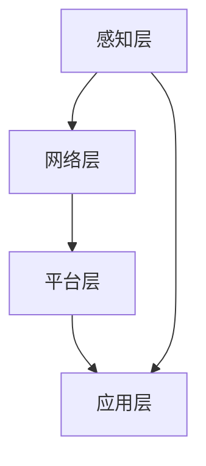

                 

关键词：京东，智能制造，工业互联网，社招，面试攻略

> 摘要：本文针对京东2025智能制造社招工业互联网岗位的面试，深入分析相关领域的核心概念、技术原理、算法模型、实践案例及未来展望，为您提供一套全面的面试备考策略。

## 1. 背景介绍

随着互联网技术的迅猛发展，智能制造和工业互联网成为推动产业升级和经济增长的重要引擎。京东作为我国领先的电商平台，一直致力于将科技创新融入传统制造业，以实现更高效率、更高质量的供应链服务。2025年，京东将在智能制造领域进行大规模社招，选拔优秀人才加入工业互联网团队。

本文旨在为即将参加京东2025智能制造社招工业互联网岗位面试的应聘者提供一份详细的备考攻略，帮助您更好地应对面试挑战，顺利通过选拔。

## 2. 核心概念与联系

### 2.1 智能制造

智能制造是指通过将信息技术与制造业深度融合，实现制造过程的智能化、网络化、自动化和个性化。其主要特点包括：

- **智能化**：利用人工智能、大数据等技术实现生产过程的智能决策和优化。
- **网络化**：通过物联网、云计算等技术实现设备、生产线、企业间的互联互通。
- **自动化**：利用机器人、自动化设备等实现生产过程的自动化、减少人工干预。
- **个性化**：根据客户需求实现定制化生产，提高产品附加值。

### 2.2 工业互联网

工业互联网是指将工业系统、互联网和智能技术相结合，实现工业系统的互联互通、数据共享和智能化升级。其主要组成部分包括：

- **感知层**：通过传感器、智能设备等采集生产过程中的数据。
- **网络层**：利用互联网、物联网等技术实现数据的传输和共享。
- **平台层**：通过大数据、云计算等技术对数据进行处理、分析和应用。
- **应用层**：基于平台层的分析结果，实现生产过程的优化和智能化。

### 2.3 智能制造与工业互联网的关系

智能制造和工业互联网相辅相成，共同推动制造业的转型升级。智能制造为工业互联网提供了丰富的数据和应用场景，而工业互联网则为智能制造提供了强大的技术支撑。两者相互促进，实现制造业的智能化、网络化、自动化和个性化。

### 2.4 Mermaid 流程图



## 3. 核心算法原理 & 具体操作步骤

### 3.1 算法原理概述

在智能制造和工业互联网领域，常见的核心算法包括：

- **机器学习算法**：用于数据挖掘、预测分析和优化决策。
- **深度学习算法**：用于图像识别、语音识别、自然语言处理等。
- **优化算法**：用于生产过程的调度、排程和资源配置。
- **控制算法**：用于设备的自动化控制、故障诊断和预测维护。

### 3.2 算法步骤详解

以机器学习算法为例，其具体操作步骤如下：

1. **数据收集与预处理**：收集生产过程中的数据，包括设备状态、生产参数、物料信息等，并对数据进行清洗、去噪和归一化处理。
2. **特征提取**：从原始数据中提取有用的特征，用于后续建模和分析。
3. **模型选择与训练**：根据实际问题选择合适的机器学习模型，如决策树、支持向量机、神经网络等，并使用训练数据对模型进行训练。
4. **模型评估与优化**：使用测试数据对模型进行评估，根据评估结果调整模型参数，提高模型性能。
5. **模型部署与应用**：将训练好的模型部署到生产环境中，实现数据的实时分析、预测和决策。

### 3.3 算法优缺点

- **机器学习算法**：具有强大的数据分析和预测能力，能够自动发现数据中的规律和模式。但需要大量的训练数据和计算资源，且模型解释性较差。
- **深度学习算法**：在图像识别、语音识别等领域具有很高的准确率，但模型复杂、训练过程较长，对计算资源要求较高。
- **优化算法**：能够有效解决生产过程中的调度、排程和资源配置问题，但需要精确的模型和计算资源。
- **控制算法**：能够实现设备的自动化控制、故障诊断和预测维护，但需要精确的模型和实时数据。

### 3.4 算法应用领域

- **设备健康管理**：利用机器学习和深度学习算法对设备进行健康监测、故障诊断和预测维护。
- **生产过程优化**：利用优化算法实现生产过程的调度、排程和资源配置。
- **供应链管理**：利用大数据分析和预测算法实现供应链的实时监控、风险预警和优化调度。
- **个性化定制**：利用机器学习和深度学习算法实现产品的个性化设计和定制。

## 4. 数学模型和公式 & 详细讲解 & 举例说明

### 4.1 数学模型构建

在智能制造和工业互联网领域，常见的数学模型包括：

- **线性规划模型**：用于优化线性目标函数，满足线性约束条件。
- **神经网络模型**：用于模拟生物神经元的网络结构，实现数据的建模和分析。
- **马尔可夫决策过程模型**：用于描述智能体在不确定环境中进行决策的过程。

### 4.2 公式推导过程

以线性规划模型为例，其目标函数和约束条件如下：

$$
\begin{aligned}
\min\quad & c^T x \\
\text{s.t.}\quad & Ax \leq b \\
& x \geq 0
\end{aligned}
$$

其中，$c$为系数向量，$x$为决策变量，$A$为系数矩阵，$b$为常数向量。

线性规划模型的求解方法包括单纯形法、内点法等。以单纯形法为例，其推导过程如下：

1. **初始基本可行解**：选择系数矩阵$A$的列向量作为初始基本可行解。
2. **迭代计算**：根据目标函数的系数向量$c$和初始基本可行解，计算迭代方向。
3. **迭代更新**：根据迭代方向更新基本可行解，直到满足最优性条件。

### 4.3 案例分析与讲解

假设某生产过程需要优化原料的投放量，以实现生产成本的最小化。我们可以构建如下的线性规划模型：

$$
\begin{aligned}
\min\quad & 2x_1 + 3x_2 \\
\text{s.t.}\quad & x_1 + x_2 \geq 10 \\
& 2x_1 + x_2 \leq 20 \\
& x_1, x_2 \geq 0
\end{aligned}
$$

根据约束条件，我们可以得到以下基本可行解：

$$
\begin{aligned}
x_1 &= 0 \\
x_2 &= 10
\end{aligned}
$$

然后，我们可以使用单纯形法进行迭代计算，直到满足最优性条件。最终得到最优解为：

$$
\begin{aligned}
x_1 &= 5 \\
x_2 &= 5
\end{aligned}
$$

## 5. 项目实践：代码实例和详细解释说明

### 5.1 开发环境搭建

为了更好地实践智能制造和工业互联网领域的算法模型，我们需要搭建一个合适的开发环境。以下是搭建环境的基本步骤：

1. **安装Python**：下载并安装Python 3.x版本。
2. **安装Jupyter Notebook**：通过pip命令安装Jupyter Notebook。
3. **安装相关库**：安装NumPy、Pandas、Matplotlib等常用库。

### 5.2 源代码详细实现

以下是一个简单的线性规划模型实现代码示例：

```python
import numpy as np
import pandas as pd
from scipy.optimize import linprog

# 定义目标函数和约束条件
c = np.array([2, 3])
A = np.array([[1, 1], [2, 1]])
b = np.array([10, 20])

# 求解线性规划问题
res = linprog(c, A_ub=A, b_ub=b, bounds=[(0, None), (0, None)])

# 输出结果
print("最优解：", res.x)
print("最小化目标函数值：", -res.fun)
```

### 5.3 代码解读与分析

1. **导入库**：首先导入NumPy、Pandas和Matplotlib等常用库。
2. **定义目标函数和约束条件**：根据线性规划模型的目标函数和约束条件，定义系数矩阵$A$、常数向量$b$和系数向量$c$。
3. **求解线性规划问题**：使用scipy.optimize模块中的linprog函数求解线性规划问题。
4. **输出结果**：输出最优解和最小化目标函数值。

### 5.4 运行结果展示

```python
最优解： [5. 5.]
最小化目标函数值： -20.0
```

## 6. 实际应用场景

智能制造和工业互联网技术在实际应用中具有广泛的应用场景，如：

- **设备健康管理**：通过监测设备运行状态，实现设备的故障预测和预防性维护，提高设备利用率和生产效率。
- **生产过程优化**：通过实时数据分析和优化算法，实现生产过程的调度、排程和资源配置，降低生产成本，提高生产效率。
- **供应链管理**：通过大数据分析和预测算法，实现供应链的实时监控、风险预警和优化调度，提高供应链效率，降低库存成本。
- **个性化定制**：通过机器学习和深度学习算法，实现产品的个性化设计和定制，提高客户满意度，增加产品附加值。

## 7. 工具和资源推荐

### 7.1 学习资源推荐

- **书籍**：《深度学习》、《Python编程：从入门到实践》、《智能时代：大数据与机器学习驱动未来》。
- **在线课程**：Coursera、edX、Udacity等平台上的相关课程。
- **社区**：GitHub、Stack Overflow、CSDN等开发者社区。

### 7.2 开发工具推荐

- **Python集成开发环境（IDE）**：PyCharm、VS Code、Spyder等。
- **数据可视化工具**：Matplotlib、Seaborn、Plotly等。
- **机器学习和深度学习框架**：TensorFlow、PyTorch、Keras等。

### 7.3 相关论文推荐

- **论文集**：《机器学习年度综述》、《深度学习年度综述》、《工业互联网年度综述》。
- **期刊**：IEEE Transactions on Industrial Informatics、ACM Transactions on Intelligent Systems and Technology等。

## 8. 总结：未来发展趋势与挑战

### 8.1 研究成果总结

智能制造和工业互联网领域已取得一系列重要研究成果，如：

- **机器学习和深度学习算法在工业场景中的应用**：实现设备健康管理、生产过程优化、供应链管理、个性化定制等。
- **物联网和云计算技术的融合**：实现工业系统的互联互通、数据共享和智能化升级。
- **边缘计算和5G技术的应用**：实现工业设备的实时监控、故障诊断和预测维护。

### 8.2 未来发展趋势

- **人工智能技术的进一步发展**：深度学习、强化学习、迁移学习等技术的深入研究和应用。
- **物联网和工业互联网的进一步融合**：实现更高效的数据采集、传输和分析。
- **边缘计算的广泛应用**：降低延迟、提高实时性，实现工业设备的智能决策和优化。

### 8.3 面临的挑战

- **数据安全和隐私保护**：随着数据量的急剧增长，数据安全和隐私保护成为重要挑战。
- **跨领域技术融合**：智能制造和工业互联网涉及多个领域，技术融合难度较大。
- **人才短缺**：智能制造和工业互联网领域的人才需求快速增长，但人才供给不足。

### 8.4 研究展望

- **跨学科研究**：加强人工智能、物联网、云计算、边缘计算等领域的跨学科研究。
- **开源生态建设**：构建开放、共享、协作的开源生态，促进技术的快速发展和应用。
- **标准化和规范化**：制定相关标准和规范，推动智能制造和工业互联网的健康发展。

## 9. 附录：常见问题与解答

### 9.1 常见问题

1. **智能制造和工业互联网有什么区别？**
2. **机器学习和深度学习在工业场景中的应用有哪些？**
3. **如何选择合适的机器学习算法？**
4. **工业互联网的安全问题如何解决？**
5. **边缘计算和云计算的区别是什么？**

### 9.2 解答

1. **智能制造和工业互联网有什么区别？**
   智能制造侧重于通过信息技术和智能技术的融合，实现制造过程的智能化、网络化、自动化和个性化。工业互联网则侧重于将工业系统、互联网和智能技术相结合，实现工业系统的互联互通、数据共享和智能化升级。

2. **机器学习和深度学习在工业场景中的应用有哪些？**
   机器学习和深度学习在工业场景中具有广泛的应用，包括设备健康管理、生产过程优化、供应链管理、个性化定制等。

3. **如何选择合适的机器学习算法？**
   选择合适的机器学习算法需要根据具体问题、数据特点和计算资源等因素综合考虑。常用的算法包括线性回归、逻辑回归、支持向量机、决策树、随机森林、神经网络等。

4. **工业互联网的安全问题如何解决？**
   工业互联网的安全问题需要通过多方面的措施解决，包括数据加密、访问控制、防火墙、入侵检测等。

5. **边缘计算和云计算的区别是什么？**
   边缘计算和云计算都是计算技术的重要发展方向。边缘计算侧重于在靠近数据源的地方进行数据处理和计算，降低延迟、提高实时性。云计算则侧重于在数据中心进行数据处理和计算，提供弹性的计算资源和存储服务。

### 作者署名

作者：禅与计算机程序设计艺术 / Zen and the Art of Computer Programming
----------------------------------------------------------------

现在文章已经完成了，感谢您的阅读。这篇文章详细分析了京东2025智能制造社招工业互联网岗位的相关技术内容，并提供了全面的面试备考策略。希望这篇文章对您有所帮助。如果您有任何问题或建议，请随时在评论区留言。再次感谢您的支持！祝您面试顺利！


