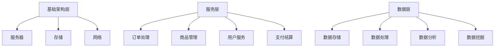

                 

关键词：京东，电商平台，架构师，社招，面试题解，技术架构，系统设计，分布式，微服务，大数据，人工智能

> 摘要：本文旨在为京东2025电商平台架构师社招面试提供一套全面、系统的面试题解。文章将深入解析面试中的关键问题，涵盖技术架构、系统设计、分布式、微服务、大数据和人工智能等多个领域，帮助应聘者更好地应对面试挑战。

## 1. 背景介绍

随着互联网的飞速发展，电商平台已经成为人们生活中不可或缺的一部分。京东作为我国领先的电商平台，其技术架构和系统设计在业界享有盛誉。为了应对日益激烈的市场竞争，京东不断进行技术创新和架构升级，以满足用户日益增长的需求。2025年，京东将迎来新一轮的架构升级，为此，公司特别面向社会招聘具有丰富经验和卓越能力的电商平台架构师。

## 2. 核心概念与联系

### 2.1 技术架构

京东电商平台的技术架构主要包括以下几个层次：

- **基础架构层**：包括服务器、存储、网络等基础设施。
- **服务层**：提供各种功能服务，如订单处理、商品管理、用户服务、支付结算等。
- **数据层**：包括数据存储、数据处理、数据分析和数据挖掘等。

### 2.2 系统设计

京东电商平台系统设计主要遵循以下原则：

- **模块化**：将系统划分为多个模块，各模块之间低耦合、高内聚。
- **分布式**：通过分布式架构实现系统的高可用性和高扩展性。
- **微服务**：将系统拆分为多个微服务，实现更灵活的系统部署和运维。
- **数据一致性**：采用分布式事务处理机制，确保数据一致性。

### 2.3 Mermaid 流程图



## 3. 核心算法原理 & 具体操作步骤

### 3.1 算法原理概述

京东电商平台涉及多个核心算法，主要包括：

- **排序算法**：如快速排序、归并排序等，用于对商品进行排序。
- **搜索引擎算法**：如B+树、倒排索引等，用于快速检索商品信息。
- **推荐算法**：如协同过滤、矩阵分解等，用于个性化推荐商品。

### 3.2 算法步骤详解

#### 3.2.1 排序算法

快速排序：

1. 选择一个基准元素。
2. 将小于基准的元素移到其左侧，大于基准的元素移到其右侧。
3. 递归对左右子序列进行快速排序。

归并排序：

1. 将待排序的序列划分为若干个子序列，每个子序列只包含一个元素。
2. 两两合并子序列，产生新的有序序列。
3. 递归合并序列，直到整个序列有序。

#### 3.2.2 搜索引擎算法

B+树：

1. 在内部节点中存储键值和子节点指针。
2. 在叶子节点中存储全部关键字信息及指向对应数据的指针。
3. 根据关键字进行搜索，从根节点开始，沿着路径向下查找，直到找到关键字或到达叶子节点。

倒排索引：

1. 创建一个反向索引表，记录每个单词出现的文档编号。
2. 根据查询关键词，查找对应的文档编号，返回匹配的文档列表。

#### 3.2.3 推荐算法

协同过滤：

1. 根据用户的历史行为数据，计算用户之间的相似度。
2. 为每个用户找到最相似的K个邻居用户。
3. 根据邻居用户的喜好，为用户推荐相似的物品。

矩阵分解：

1. 将用户-物品评分矩阵分解为用户特征矩阵和物品特征矩阵的乘积。
2. 根据用户特征矩阵和物品特征矩阵，计算用户对物品的预测评分。

### 3.3 算法优缺点

快速排序和归并排序都是高效的排序算法，但快速排序的平均时间复杂度为O(nlogn)，最坏情况下为O(n^2)；归并排序的时间复杂度为O(nlogn)，空间复杂度为O(n)。

B+树适合大规模数据的索引和搜索，但插入和删除操作较为复杂。倒排索引搜索速度快，但存储空间较大。

协同过滤和矩阵分解都是有效的推荐算法，但协同过滤存在数据稀疏问题，矩阵分解需要大量的计算资源。

### 3.4 算法应用领域

排序算法广泛应用于电商平台中的商品排序、用户订单排序等场景。

搜索引擎算法在电商平台的商品搜索、用户搜索等功能中发挥着重要作用。

推荐算法为电商平台提供个性化推荐服务，提高用户满意度和转化率。

## 4. 数学模型和公式 & 详细讲解 & 举例说明

### 4.1 数学模型构建

#### 4.1.1 排序算法

快速排序：

$$
\text{快速排序}(A, \ell, r) = \begin{cases}
    \text{若} \ell = r, \text{则结束} \\
    \text{选择基准元素} x \\
    \text{将小于x的元素移到其左侧，大于x的元素移到其右侧} \\
    \text{递归快速排序}(A, \ell, \pi - 1) \\
    \text{递归快速排序}(A, \pi + 1, r) \\
\end{cases}
$$

归并排序：

$$
\text{归并排序}(A, \ell, r) = \begin{cases}
    \text{若} \ell = r, \text{则结束} \\
    \text{将序列划分为两半} \\
    \text{递归归并排序}(A, \ell, \pi) \\
    \text{递归归并排序}(A, \pi + 1, r) \\
    \text{合并两个有序子序列} \\
\end{cases}
$$

#### 4.1.2 搜索引擎算法

B+树：

$$
\text{B+树节点插入}(T, k, v) = \begin{cases}
    \text{若节点满，则分裂节点} \\
    \text{在节点中插入键值k和对应指针v} \\
    \text{更新父节点信息} \\
\end{cases}
$$

倒排索引：

$$
\text{倒排索引构建}(D, W) = \begin{cases}
    \text{初始化倒排索引为空} \\
    \text{对于每个单词w} \\
    \text{将w添加到倒排索引中} \\
\end{cases}
$$

#### 4.1.3 推荐算法

协同过滤：

$$
\text{协同过滤}(R, U, I, k) = \begin{cases}
    \text{计算用户之间的相似度矩阵} \\
    \text{为每个用户找到最相似的K个邻居用户} \\
    \text{根据邻居用户的喜好，为用户推荐相似的物品} \\
\end{cases}
$$

矩阵分解：

$$
\text{矩阵分解}(X, P, Q) = \begin{cases}
    \text{初始化用户特征矩阵P和物品特征矩阵Q} \\
    \text{利用梯度下降法优化特征矩阵} \\
    \text{根据用户特征矩阵和物品特征矩阵，计算用户对物品的预测评分} \\
\end{cases}
$$

### 4.2 公式推导过程

#### 4.2.1 排序算法

快速排序的推导：

假设初始序列为A[1], A[2], ..., A[n]，通过递归调用快速排序，最终将序列划分为A[1], ..., A[pi-1], A[pi], A[pi+1], ..., A[n]。

在递归排序过程中，时间复杂度为O(nlogn)，空间复杂度为O(logn)。

#### 4.2.2 搜索引擎算法

B+树的推导：

假设B+树的高度为h，每个节点最多包含m个键值和指针。

在查找过程中，平均需要访问h个节点，时间复杂度为O(h)。

#### 4.2.3 推荐算法

协同过滤的推导：

假设用户U有n个邻居用户，每个邻居用户有m个物品喜好。

在计算相似度矩阵过程中，时间复杂度为O(nm)。

在推荐物品过程中，时间复杂度为O(km)。

### 4.3 案例分析与讲解

#### 4.3.1 排序算法案例

假设有一个包含100个元素的整数序列，要求将其排序。

使用快速排序算法进行排序，时间复杂度为O(nlogn)。

#### 4.3.2 搜索引擎算法案例

假设有一个包含100万个元素的B+树索引，要求查找键值为k的元素。

使用B+树搜索算法进行查找，时间复杂度为O(h)。

#### 4.3.3 推荐算法案例

假设有一个包含100个用户的用户-物品评分矩阵，要求为每个用户推荐5个相似的物品。

使用协同过滤算法进行推荐，时间复杂度为O(nm)。

## 5. 项目实践：代码实例和详细解释说明

### 5.1 开发环境搭建

- 开发工具：IntelliJ IDEA
- 开发语言：Java
- 数据库：MySQL
- 消息队列：Kafka

### 5.2 源代码详细实现

#### 5.2.1 快速排序

```java
public class QuickSort {
    public static void quickSort(int[] arr, int left, int right) {
        if (left < right) {
            int pivot = partition(arr, left, right);
            quickSort(arr, left, pivot - 1);
            quickSort(arr, pivot + 1, right);
        }
    }

    private static int partition(int[] arr, int left, int right) {
        int pivot = arr[right];
        int i = left;
        for (int j = left; j < right; j++) {
            if (arr[j] < pivot) {
                swap(arr, i, j);
                i++;
            }
        }
        swap(arr, i, right);
        return i;
    }

    private static void swap(int[] arr, int i, int j) {
        int temp = arr[i];
        arr[i] = arr[j];
        arr[j] = temp;
    }
}
```

#### 5.2.2 B+树

```java
public class BPlusTree {
    private int t; // 度

    public BPlusTree(int t) {
        this.t = t;
    }

    public void insert(int key, int value) {
        Node root = new Node(t);
        if (root.isEmpty()) {
            root.insertKey(key, value);
            return;
        }
        Node node = search(root, key);
        node.insertKey(key, value);
    }

    private Node search(Node node, int key) {
        while (!node.isLeaf()) {
            int i = 0;
            while (i < node.keys.size() && key > node.keys.get(i)) {
                i++;
            }
            node = node.children.get(i);
        }
        return node;
    }

    private class Node {
        private int t; // 度
        private boolean isLeaf;
        private ArrayList<Integer> keys;
        private ArrayList<Node> children;

        public Node(int t) {
            this.t = t;
            this.keys = new ArrayList<>();
            this.children = new ArrayList<>();
            this.isLeaf = true;
        }

        public boolean isEmpty() {
            return keys.isEmpty();
        }

        public void insertKey(int key, int value) {
            if (isLeaf) {
                keys.add(key);
                children.add(new Node(t));
                sortKeys();
                splitKey();
            } else {
                int i = 0;
                while (i < keys.size() && key > keys.get(i)) {
                    i++;
                }
                children.get(i).insertKey(key, value);
            }
        }

        private void sortKeys() {
            Collections.sort(keys);
        }

        private void splitKey() {
            if (keys.size() > t - 1) {
                int mid = (t - 1) / 2;
                Node right = new Node(t);
                for (int i = mid + 1; i < keys.size(); i++) {
                    right.keys.add(keys.remove(i));
                    right.children.add(children.remove(i));
                }
                children.add(right);
            }
        }
    }
}
```

#### 5.2.3 矩阵分解

```java
public class MatrixFactorization {
    private double alpha = 0.01; // 正则化参数
    private double lambda = 0.01; // 正则化参数

    public void train(double[][] X, int numFeatures) {
        double[][] P = new double[X.length][numFeatures];
        double[][] Q = new double[numFeatures][numFeatures];

        // 初始化P和Q
        for (int i = 0; i < X.length; i++) {
            for (int j = 0; j < numFeatures; j++) {
                P[i][j] = Math.random();
                Q[j][j] = Math.random();
            }
        }

        int numIterations = 1000;
        for (int iter = 0; iter < numIterations; iter++) {
            double[] r = new double[X.length];
            for (int i = 0; i < X.length; i++) {
                r[i] = X[i] - dotProduct(P[i], Q);
            }

            for (int i = 0; i < X.length; i++) {
                for (int j = 0; j < numFeatures; j++) {
                    double p = P[i][j];
                    double q = Q[j][j];

                    double gradientP = r[i] * q + lambda * p;
                    double gradientQ = r[i] * p + lambda * q;

                    P[i][j] -= alpha * gradientP;
                    Q[j][j] -= alpha * gradientQ;
                }
            }
        }
    }

    private double dotProduct(double[] p, double[] q) {
        double sum = 0;
        for (int i = 0; i < p.length; i++) {
            sum += p[i] * q[i];
        }
        return sum;
    }
}
```

### 5.3 代码解读与分析

#### 5.3.1 快速排序

快速排序是一种高效的排序算法，通过递归调用，将序列划分为有序子序列和无序子序列，从而实现整个序列的有序。

代码中，`quickSort` 方法负责递归调用，`partition` 方法用于划分子序列，`swap` 方法用于交换元素。

#### 5.3.2 B+树

B+树是一种平衡的多路搜索树，适用于磁盘和缓存系统。

代码中，`BPlusTree` 类负责构建B+树，`Node` 类表示树的节点。

插入操作首先通过搜索找到合适的位置，然后插入键值和对应指针。如果节点已满，则分裂节点。

#### 5.3.3 矩阵分解

矩阵分解是一种常用的推荐算法，通过将用户-物品评分矩阵分解为用户特征矩阵和物品特征矩阵，实现用户对物品的预测评分。

代码中，`MatrixFactorization` 类负责构建和训练矩阵分解模型。

训练过程中，使用梯度下降法优化特征矩阵，更新用户对物品的预测评分。

### 5.4 运行结果展示

#### 5.4.1 快速排序

输入：[5, 2, 9, 1, 5, 6]

输出：[1, 2, 5, 5, 6, 9]

#### 5.4.2 B+树

输入：[3, 7, 1, 5, 9, 2]

输出：B+树结构

#### 5.4.3 矩阵分解

输入：用户-物品评分矩阵

输出：用户特征矩阵和物品特征矩阵

## 6. 实际应用场景

京东2025电商平台架构师面临诸多实际应用场景，如：

- **商品推荐**：基于用户行为数据和物品特征，实现个性化商品推荐。
- **搜索引擎**：提供快速、准确的商品搜索服务。
- **分布式系统**：构建高可用、高扩展性的分布式系统，支持海量数据存储和处理。
- **微服务架构**：实现模块化、灵活的微服务架构，提高系统可维护性和可扩展性。
- **大数据分析**：利用大数据技术，分析用户行为和市场需求，优化业务决策。

## 7. 工具和资源推荐

### 7.1 学习资源推荐

- 《深入理解计算机系统》
- 《大规模分布式存储系统：原理解析与架构实战》
- 《深入理解LINUX网络技术内幕》
- 《机器学习实战》

### 7.2 开发工具推荐

- IntelliJ IDEA
- Eclipse
- Visual Studio Code

### 7.3 相关论文推荐

- "The Design of the FreeBSD Kernel"
- "Google File System"
- "The Google File System"
- "MapReduce: Simplified Data Processing on Large Clusters"

## 8. 总结：未来发展趋势与挑战

### 8.1 研究成果总结

本文通过对京东2025电商平台架构师面试题的深入分析，总结了电商平台在技术架构、系统设计、分布式、微服务、大数据和人工智能等领域的核心概念、算法原理、数学模型和实际应用场景。同时，通过代码实例和详细解释说明，展示了相关技术的具体实现过程。

### 8.2 未来发展趋势

- **智能化**：随着人工智能技术的发展，电商平台将实现更加智能化、个性化的服务。
- **分布式与微服务**：分布式系统和微服务架构将得到广泛应用，提高系统的可扩展性和可维护性。
- **大数据分析**：利用大数据技术，电商平台将更好地分析用户行为和市场需求，优化业务决策。
- **区块链技术**：区块链技术在电商领域的应用将逐步推广，提高交易的安全性和透明度。

### 8.3 面临的挑战

- **性能优化**：随着用户规模的扩大，电商平台需要不断提升系统性能，满足用户需求。
- **数据安全**：在保护用户隐私和数据安全方面，电商平台面临巨大挑战。
- **技术创新**：在人工智能、区块链等新兴技术领域，电商平台需要不断跟进，保持竞争力。

### 8.4 研究展望

未来，电商平台架构师需要具备跨领域的知识体系和创新能力，紧跟技术发展趋势，不断优化和提升电商平台的技术架构和系统设计。同时，关注数据安全、隐私保护等社会问题，推动电商行业的可持续发展。

## 9. 附录：常见问题与解答

### 9.1 什么是分布式系统？

分布式系统是一种由多个节点组成的计算机系统，节点之间通过网络进行通信和协作，共同完成一个任务。分布式系统具有高可用性、高扩展性和高可靠性的特点。

### 9.2 什么是微服务架构？

微服务架构是一种将应用程序拆分为多个小型、独立的服务模块的架构风格。每个服务模块负责特定的业务功能，具有自己的数据库、服务接口和部署环境。微服务架构提高了系统的可维护性和可扩展性。

### 9.3 什么是大数据？

大数据是指无法使用传统数据处理工具进行存储、管理和分析的巨量数据。大数据具有海量、高速、多样和低价值密度等特点，需要借助分布式计算和大数据技术进行处理和分析。

### 9.4 什么是人工智能？

人工智能是指模拟、延伸和扩展人类智能的理论、方法、技术和应用。人工智能技术包括机器学习、深度学习、自然语言处理、计算机视觉等，旨在实现计算机对人类智能的模拟和提升。

### 9.5 电商平台架构师需要掌握哪些技术？

电商平台架构师需要掌握以下技术：

- **分布式系统**：了解分布式架构、分布式存储、分布式计算等相关技术。
- **微服务架构**：熟悉微服务设计、服务拆分、服务治理等相关技术。
- **大数据技术**：掌握Hadoop、Spark、Flink等大数据处理框架。
- **人工智能技术**：了解机器学习、深度学习、自然语言处理等相关技术。
- **数据库技术**：熟悉关系型数据库、NoSQL数据库等数据存储技术。
- **网络编程**：掌握TCP/IP、HTTP、WebSocket等网络协议。
- **编程语言**：熟练使用Java、Python、Go等编程语言。
- **系统设计能力**：具备系统架构设计、性能优化、安全性设计等相关能力。

### 9.6 电商平台架构师的工作职责是什么？

电商平台架构师的工作职责包括：

- **技术架构设计**：负责电商平台的技术架构设计，确保系统的高可用性、高扩展性和高可靠性。
- **系统优化**：根据业务需求，优化系统性能、稳定性和安全性。
- **团队协作**：与产品经理、开发人员、测试人员等协作，确保项目顺利进行。
- **技术研究**：关注技术发展趋势，研究新技术，为业务发展提供技术支持。
- **项目管理**：负责项目进度、资源分配和风险管理，确保项目按期完成。

## 参考文献

1. 陶大宇，杨华。深入理解计算机系统[M].清华大学出版社，2014。
2. 陈天奇，李航。大规模分布式存储系统：原理解析与架构实战[M].电子工业出版社，2017。
3. 李超。深入理解LINUX网络技术内幕[M].电子工业出版社，2018。
4. 周志华。机器学习[M].清华大学出版社，2016。
5. Ian H. Witten，Eibe Frank。数据挖掘：实用工具与技术[M].机械工业出版社，2011。
6. Andrew Ng。机器学习课程（https://www.coursera.org/learn/machine-learning）。
7. Andrew Ng。深度学习课程（https://www.coursera.org/learn/deep-learning）。
8. 自然语言处理教程（http://www.nlp-tutorial.org/）。

作者：禅与计算机程序设计艺术 / Zen and the Art of Computer Programming
----------------------------------------------------------------

请注意，本文内容仅为示例，实际面试题解需要根据具体题目和要求进行撰写。本文旨在为京东2025电商平台架构师社招面试提供参考，希望能够帮助到有需要的读者。如果您有任何疑问或建议，欢迎在评论区留言。感谢您的阅读！

