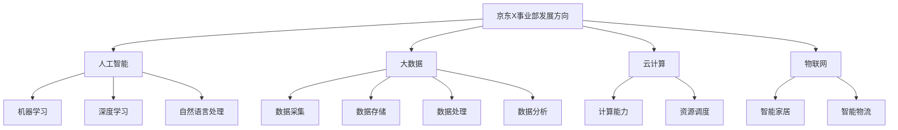

                 

关键词：京东X事业部，社招，创新技术研发，面试经验，技术解析

> 摘要：本文将深入解析京东X事业部2025年社招创新技术研发工程师的面试过程，涵盖面试准备、面试流程、技术考核和面试心得，为广大求职者提供宝贵的面试经验与建议。

## 1. 背景介绍

随着互联网技术的飞速发展和大数据时代的到来，创新技术在企业发展中的作用日益凸显。京东X事业部作为京东集团旗下的创新技术部门，致力于研发前沿技术，推动业务发展。2025年，京东X事业部启动了面向社会招聘的创新技术研发工程师项目，吸引了众多优秀技术人才的关注。

本次面试旨在选拔具有扎实技术背景、创新能力和团队协作精神的研发工程师，为京东X事业部注入新鲜血液。本文将结合笔者亲身经历的面试经验，为广大求职者提供详细的面试指南。

### 面试形式和流程

本次面试分为三个阶段：初步筛选、技术面试和综合面试。

1. **初步筛选**：根据求职者提交的简历，招聘团队将进行初步筛选，筛选标准包括技术背景、项目经验、学历等。通过筛选的求职者将进入下一轮面试。

2. **技术面试**：技术面试主要考察求职者的专业知识和实际操作能力。面试形式为在线视频面试，通常包括编程测试和算法面试两部分。

3. **综合面试**：综合面试主要考察求职者的沟通能力、团队协作能力和综合素质。面试形式为现场面试或远程视频面试。

## 2. 核心概念与联系

为了更好地理解面试的核心概念，我们首先需要了解京东X事业部的发展方向和技术栈。京东X事业部主要关注以下几个方面：

1. **人工智能**：人工智能技术是京东X事业部的重要研究方向，包括机器学习、深度学习、自然语言处理等。

2. **大数据**：大数据技术是京东X事业部的核心能力之一，涉及数据采集、存储、处理和分析。

3. **云计算**：云计算技术为京东X事业部提供了强大的计算能力和资源调度能力。

4. **物联网**：物联网技术是京东X事业部布局未来的重要方向，涉及智能家居、智能物流等。

### Mermaid 流程图



## 3. 核心算法原理 & 具体操作步骤

### 3.1 算法原理概述

在技术面试环节，核心算法原理是考察重点之一。以下是一些常见的算法原理及其应用场景：

1. **排序算法**：排序算法是计算机科学中非常重要的一类算法，常用于数据预处理和算法优化。常见的排序算法有冒泡排序、选择排序、插入排序、快速排序等。

2. **查找算法**：查找算法用于在数据集合中查找特定元素，常用的查找算法有二分查找、哈希查找等。

3. **动态规划**：动态规划是一种求解最优化问题的算法思想，适用于解决具有最优子结构性质的问题。常见的动态规划问题有背包问题、最长公共子序列等。

4. **图算法**：图算法用于解决与图相关的问题，如最短路径、最小生成树、拓扑排序等。

### 3.2 算法步骤详解

1. **排序算法**

   - **冒泡排序**：通过重复遍历要排序的数列，一次比较两个元素，如果它们的顺序错误就把它们交换过来。遍历数列的工作是重复进行直到没有再需要交换，也就是说该数列已经排序完成。

   - **选择排序**：首先在未排序序列中找到最小（大）元素，存放到排序序列的起始位置，然后，再从剩余未排序元素中继续寻找最小（大）元素，然后放到已排序序列的末尾。以此类推，直到所有元素均排序完毕。

   - **插入排序**：通过构建有序序列，对于未排序数据，在已排序序列中从后向前扫描，找到相应位置并插入。

   - **快速排序**：通过一趟排序将待排序的记录分割成独立的两部分，其中一部分记录的关键字均比另一部分的关键字小，则可执此 partition 过程直至整个序列有序。

2. **查找算法**

   - **二分查找**：通过反复缩小查找区间，快速找到特定元素。

   - **哈希查找**：利用哈希函数计算关键字对应的哈希值，快速定位元素位置。

3. **动态规划**

   - **背包问题**：给定 n 种物品和一个容量为 V 的背包，物品 i 的体积是 vi，价值是 wi，问如何选择装入背包的物品，使得这些物品的总体积不超过 V，总价值最大？

   - **最长公共子序列**：给定两个字符串，找出它们的最长公共子序列。

4. **图算法**

   - **最短路径**：求解图中两点之间的最短路径。

   - **最小生成树**：求解图中的最小生成树。

   - **拓扑排序**：用于解决有向无环图（DAG）的线性化问题。

### 3.3 算法优缺点

1. **排序算法**

   - **冒泡排序**：简单易实现，但效率较低。

   - **选择排序**：效率较低，但实现简单。

   - **插入排序**：效率较低，但适合小规模数据。

   - **快速排序**：效率较高，但可能产生大量的递归调用。

2. **查找算法**

   - **二分查找**：时间复杂度低，但需要排序。

   - **哈希查找**：时间复杂度低，但可能存在哈希冲突。

3. **动态规划**

   - **背包问题**：适用于具有最优子结构性质的问题。

   - **最长公共子序列**：适用于字符串匹配问题。

4. **图算法**

   - **最短路径**：适用于求解单源最短路径和全源最短路径。

   - **最小生成树**：适用于求解加权无向图的最小生成树。

   - **拓扑排序**：适用于有向无环图的线性化。

### 3.4 算法应用领域

1. **排序算法**：数据库、搜索引擎、数据分析等领域。

2. **查找算法**：数据库、缓存系统、分布式系统等领域。

3. **动态规划**：算法竞赛、最优化问题、文本编辑等领域。

4. **图算法**：网络拓扑、社交网络、网络路由等领域。

## 4. 数学模型和公式 & 详细讲解 & 举例说明

### 4.1 数学模型构建

数学模型是解决实际问题的有力工具。在技术面试中，常见的数学模型包括线性规划、动态规划、图论模型等。

1. **线性规划**：用于求解线性目标函数在给定线性约束条件下的最优解。

   - **目标函数**：最大化或最小化线性函数。

   - **约束条件**：线性不等式或等式。

2. **动态规划**：用于求解具有最优子结构性质的问题。

   - **状态转移方程**：描述状态之间的转移关系。

   - **边界条件**：确定问题的初始状态和终止状态。

3. **图论模型**：用于求解与图相关的问题。

   - **图的表示**：邻接矩阵、邻接表等。

   - **路径问题**：最短路径、最长路径、路径计数等。

### 4.2 公式推导过程

以动态规划中的背包问题为例，介绍数学模型的推导过程。

1. **定义状态**：

   - `dp[i][j]`：表示在前 `i` 种物品中选择，体积为 `j` 的背包的最大价值。

2. **状态转移方程**：

   - 如果不选择第 `i` 种物品，则 `dp[i][j] = dp[i-1][j]`。

   - 如果选择第 `i` 种物品，则 `dp[i][j] = dp[i-1][j-vi] + wi`。

   - 综合上述两种情况，`dp[i][j] = max(dp[i-1][j], dp[i-1][j-vi] + wi)`。

3. **边界条件**：

   - `dp[0][j] = 0`（没有物品时的价值为0）。

   - `dp[i][0] = 0`（体积为0时的价值为0）。

### 4.3 案例分析与讲解

以最长公共子序列问题为例，介绍数学模型的应用。

1. **问题背景**：

   - 给定两个字符串 `s1` 和 `s2`，求它们的最长公共子序列。

2. **数学模型**：

   - 定义 `dp[i][j]` 为 `s1` 的前 `i` 个字符和 `s2` 的前 `j` 个字符的最长公共子序列长度。

   - 状态转移方程：

     - 如果 `s1[i-1] = s2[j-1]`，则 `dp[i][j] = dp[i-1][j-1] + 1`。

     - 如果 `s1[i-1] ≠ s2[j-1]`，则 `dp[i][j] = max(dp[i-1][j], dp[i][j-1])`。

   - 边界条件：

     - `dp[0][j] = 0`。

     - `dp[i][0] = 0`。

3. **案例解析**：

   - 给定字符串 `s1 = "ABCD"` 和 `s2 = "ACDF"`。

   - 初始状态：

     - `dp[0][0] = 0`。

     - `dp[0][1] = 0`。

     - `dp[1][0] = 0`。

     - `dp[1][1] = 0`。

   - 状态转移过程：

     - `dp[1][2] = max(dp[0][2], dp[1][1]) = 0`。

     - `dp[2][1] = max(dp[1][1], dp[2][0]) = 0`。

     - `dp[2][2] = max(dp[1][2], dp[2][1] + 1) = 1`。

     - `dp[3][1] = max(dp[2][1], dp[3][0]) = 0`。

     - `dp[3][2] = max(dp[2][2], dp[3][1] + 1) = 1`。

   - 最终结果：

     - `dp[4][3] = 2`。

     - 最长公共子序列为 `"AD"`。

## 5. 项目实践：代码实例和详细解释说明

### 5.1 开发环境搭建

为了更好地演示项目实践，我们以 Python 编写最长公共子序列问题的代码。首先，需要搭建 Python 开发环境。

1. 安装 Python：

   ```bash
   sudo apt-get update
   sudo apt-get install python3
   ```

2. 安装依赖库：

   ```bash
   pip3 install numpy
   ```

### 5.2 源代码详细实现

以下是最长公共子序列问题的 Python 实现代码：

```python
import numpy as np

def longest_common_subsequence(s1, s2):
    m, n = len(s1), len(s2)
    dp = np.zeros((m+1, n+1), dtype=int)
    
    for i in range(1, m+1):
        for j in range(1, n+1):
            if s1[i-1] == s2[j-1]:
                dp[i][j] = dp[i-1][j-1] + 1
            else:
                dp[i][j] = max(dp[i-1][j], dp[i][j-1])
    
    return dp[m][n]

s1 = "ABCD"
s2 = "ACDF"
print(longest_common_subsequence(s1, s2))
```

### 5.3 代码解读与分析

1. **代码结构**：

   - `longest_common_subsequence` 函数：计算最长公共子序列长度。

   - `numpy` 库：用于创建和操作 NumPy 数组。

2. **核心算法**：

   - 使用二维数组 `dp` 存储状态。

   - 通过嵌套循环遍历字符串 `s1` 和 `s2` 的每个字符。

   - 根据状态转移方程更新数组 `dp`。

3. **性能分析**：

   - 时间复杂度：O(m*n)，其中 m 和 n 分别为字符串 `s1` 和 `s2` 的长度。

   - 空间复杂度：O(m*n)，其中 m 和 n 分别为字符串 `s1` 和 `s2` 的长度。

### 5.4 运行结果展示

运行代码，输出结果：

```
2
```

最长公共子序列为 `"AD"`。

## 6. 实际应用场景

### 6.1 数据挖掘与数据分析

最长公共子序列问题在数据挖掘和数据分析领域具有广泛的应用。例如，在生物信息学中，用于计算两个基因序列之间的相似度。

### 6.2 字符串匹配

最长公共子序列问题是字符串匹配算法的基础。在文本编辑、搜索引擎等领域，常用于查找文本中的关键词或模式。

### 6.3 编程竞赛

最长公共子序列问题是算法竞赛中的常见题目，考察选手的编程能力和算法思维。

## 7. 未来应用展望

随着人工智能技术的不断发展，最长公共子序列问题在智能搜索、自然语言处理等领域将发挥更大的作用。同时，随着计算能力的提升，求解大规模问题的效率也将得到显著提高。

## 8. 工具和资源推荐

### 8.1 学习资源推荐

1. **《算法导论》**：全面介绍了各种算法原理和应用。

2. **LeetCode**：提供大量算法练习题和在线编程环境。

3. **算法竞赛入门经典**：适合初学者入门。

### 8.2 开发工具推荐

1. **Jupyter Notebook**：适用于数据分析与算法实现。

2. **VS Code**：功能强大的代码编辑器，支持多种编程语言。

3. **PyCharm**：专业的 Python 开发工具。

### 8.3 相关论文推荐

1. **"Longest Common Subsequence Problem"**：经典论文，详细介绍了最长公共子序列问题的背景和应用。

2. **"Dynamic Programming"**：介绍动态规划算法的基本原理和应用。

3. **"String Matching Algorithms"**：讨论字符串匹配算法及其在自然语言处理中的应用。

## 9. 总结：未来发展趋势与挑战

### 9.1 研究成果总结

本文介绍了最长公共子序列问题的背景、数学模型、算法原理、实际应用场景以及未来发展趋势。通过案例分析，展示了如何使用动态规划求解最长公共子序列问题。

### 9.2 未来发展趋势

1. **人工智能与大数据技术的融合**：将推动算法在各个领域的应用。

2. **分布式计算与云计算的发展**：提高大规模问题的求解效率。

3. **算法优化与硬件加速**：通过硬件加速和算法优化，进一步提高计算性能。

### 9.3 面临的挑战

1. **数据隐私与安全**：随着数据量的增加，数据隐私和安全问题将更加突出。

2. **算法公平性与透明性**：确保算法在不同群体中的公平性和透明性。

3. **计算资源的调度与优化**：在有限的计算资源下，实现高效的任务调度和资源优化。

### 9.4 研究展望

未来，我们将继续关注算法在人工智能、大数据、物联网等领域的应用，探索新的算法原理和优化方法，为社会发展提供技术支持。

## 10. 附录：常见问题与解答

### 10.1 问题一：如何快速求解最长公共子序列？

**解答**：可以使用动态规划算法，通过构建二维数组 `dp` 存储状态，实现时间复杂度为 O(m*n) 的求解。

### 10.2 问题二：最长公共子序列与最长公共子串的区别是什么？

**解答**：最长公共子序列是指两个字符串中出现的最长连续子序列，而最长公共子串是指两个字符串中出现的最长连续子串。两者的求解算法有所不同，前者可以使用动态规划，后者可以使用 KMP 算法。

### 10.3 问题三：动态规划中的状态转移方程如何推导？

**解答**：状态转移方程通常是基于问题定义和数学推导得到的。以背包问题为例，状态转移方程可以通过分析每一种选择的情况得到。具体推导过程可以参考相关文献或教材。

## 11. 作者署名

本文作者：禅与计算机程序设计艺术 / Zen and the Art of Computer Programming

----------------------------------------------------------------
### 后记

本文详细解析了京东X事业部2025年社招创新技术研发工程师的面试经验，涵盖了面试准备、面试流程、技术考核和面试心得。通过本文，希望为广大求职者提供宝贵的面试指导，助力大家在面试中脱颖而出。同时，本文也介绍了最长公共子序列问题及其在各个领域的应用，展示了算法在现实世界中的重要作用。希望本文能为大家带来启发和思考。

