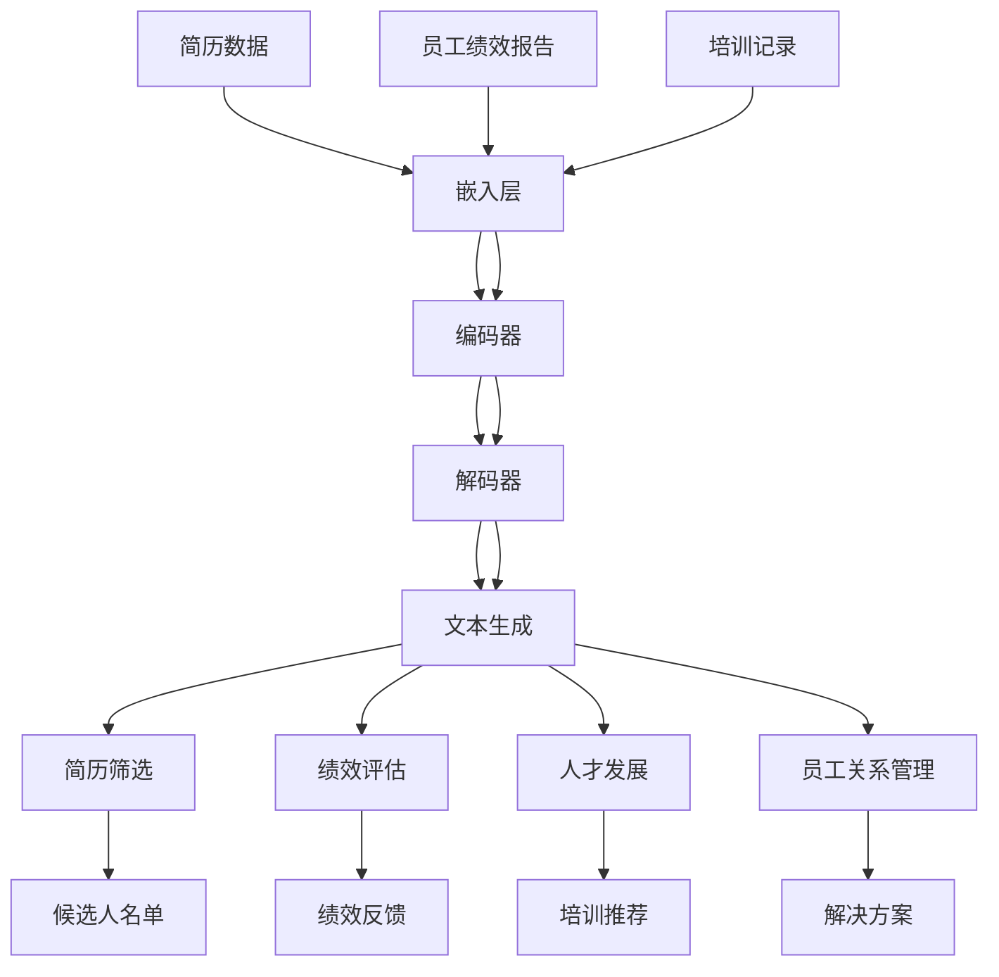

                 

### 背景介绍 Background Introduction

在当今快速发展的信息技术时代，人工智能（AI）技术正以前所未有的速度改变着各个行业的运作方式。特别是在人力资源管理（HRM）领域，人工智能的引入正在逐步颠覆传统的管理模式，为组织提供更加高效、精准的人才管理方案。随着深度学习和自然语言处理（NLP）技术的不断进步，大型语言模型（LLM）作为AI技术的代表性成果之一，正逐渐成为优化人才管理的关键工具。

大型语言模型，简称LLM，是一种基于深度神经网络的语言处理模型，能够理解和生成人类语言，具有很强的文本理解和生成能力。LLM能够处理大规模的文本数据，从这些数据中提取有价值的信息，并用于支持决策制定、数据分析以及自动化流程。在人力资源管理领域，LLM的应用主要体现在以下几个方面：

1. **简历筛选与招聘**：LLM可以快速分析海量的简历，从中筛选出最符合岗位需求的候选人，极大地提高了招聘效率。
2. **员工绩效评估**：LLM能够通过对员工工作内容的分析，评估员工的绩效表现，提供客观的绩效反馈。
3. **人才发展**：LLM可以根据员工的技能和职业发展需求，推荐适合的培训课程和职业路径，助力员工成长。
4. **员工关系管理**：LLM可以帮助组织分析员工关系，识别潜在的问题，并提出解决方案，以维护良好的员工关系。

本文将深入探讨LLM在人力资源管理中的应用，从理论基础到具体实践，全面分析LLM如何优化人才管理，为组织带来价值。文章结构如下：

1. **核心概念与联系**：介绍LLM的基本概念及其与人力资源管理的关系。
2. **核心算法原理 & 具体操作步骤**：详细讲解LLM的工作原理和操作步骤。
3. **数学模型和公式 & 详细讲解 & 举例说明**：解析LLM背后的数学模型和公式，并辅以实例说明。
4. **项目实践：代码实例和详细解释说明**：提供实际代码实例，讲解如何应用LLM进行人才管理。
5. **实际应用场景**：探讨LLM在人力资源管理中的具体应用场景。
6. **未来应用展望**：展望LLM在人力资源管理中的未来发展。
7. **工具和资源推荐**：推荐相关的学习资源和开发工具。
8. **总结：未来发展趋势与挑战**：总结研究成果，展望未来趋势和面临的挑战。

通过本文的深入探讨，我们希望读者能够全面了解LLM在人力资源管理中的应用，并为实际工作提供有价值的参考。

### 核心概念与联系 Core Concepts and Relationships

#### 大型语言模型（LLM）的基本概念

大型语言模型（LLM）是一种复杂的深度学习模型，主要用于处理和理解自然语言文本。LLM的核心是神经网络，它由多层神经元组成，每一层都能对输入数据进行处理和变换。神经网络通过大量的训练数据学习语言模式，从而能够理解和生成人类语言。

LLM通常由以下几个关键组成部分构成：

1. **嵌入层（Embedding Layer）**：将文本中的单词转换为固定长度的向量表示，这些向量包含了单词的语义信息。
2. **编码器（Encoder）**：对输入文本进行编码，产生一个固定长度的向量，这个向量包含了文本的上下文信息。
3. **解码器（Decoder）**：根据编码器生成的上下文向量，生成文本的输出。

在训练过程中，LLM通过反向传播算法不断调整内部参数，以最小化预测错误。这使得LLM能够逐渐掌握复杂的语言规则和语义关系，从而实现高效的自然语言处理。

#### LLM与人力资源管理的联系

将LLM应用于人力资源管理，主要基于以下几个关键点：

1. **数据处理能力**：LLM能够处理和分析大规模的文本数据，这使其非常适合处理人力资源领域的各种文本信息，如简历、员工绩效报告、培训记录等。

2. **文本理解能力**：LLM具备强大的文本理解能力，能够从文本中提取关键信息，并进行关联和分类。这在招聘、绩效评估、员工关系管理等场景中具有重要意义。

3. **自动化决策支持**：LLM可以自动化处理人力资源管理中的决策支持任务，如简历筛选、职位匹配、绩效评估等，从而提高工作效率和准确性。

具体来说，LLM在人力资源管理中的应用可以体现在以下几个方面：

1. **简历筛选**：LLM可以通过分析简历中的关键字和上下文信息，快速筛选出最符合条件的候选人。

2. **绩效评估**：LLM可以自动分析员工的工作内容，评估其绩效表现，并提供客观的绩效反馈。

3. **人才发展**：LLM可以根据员工的技能和职业发展需求，推荐适合的培训课程和职业路径。

4. **员工关系管理**：LLM可以帮助组织分析员工关系，识别潜在的问题，并提出解决方案。

#### Mermaid 流程图展示

为了更好地理解LLM与人力资源管理的关系，我们可以使用Mermaid流程图展示LLM的基本架构和其在人力资源管理中的应用流程。



在这张流程图中，我们展示了LLM的基本架构以及它在简历筛选、绩效评估、人才发展和员工关系管理中的应用。通过这种方式，我们能够清晰地看到LLM如何为人力资源管理提供支持。

### 核心算法原理 & 具体操作步骤 Core Algorithm Principles and Detailed Steps

#### 算法原理概述

大型语言模型（LLM）的核心原理基于深度学习，特别是基于变分自编码器（Variational Autoencoder, VAE）和生成对抗网络（Generative Adversarial Network, GAN）的架构。LLM通过多层神经网络对大量文本数据进行训练，从而学习到语言模式和语义信息。

LLM的工作流程可以分为三个主要步骤：

1. **嵌入（Embedding）**：将文本中的每个单词转换为固定长度的向量表示，这些向量包含了单词的语义信息。
2. **编码（Encoding）**：通过编码器（Encoder）对输入文本进行编码，生成一个固定长度的向量，这个向量包含了文本的上下文信息。
3. **解码（Decoding）**：根据编码器生成的上下文向量，通过解码器（Decoder）生成文本的输出。

#### 算法步骤详解

1. **数据准备**：收集和处理相关的文本数据，如简历、员工绩效报告、培训记录等。这些数据需要经过预处理，包括分词、去除停用词、词干提取等步骤。

2. **嵌入层（Embedding Layer）**：将处理后的文本数据转换为向量表示。嵌入层的作用是将每个单词映射为一个固定长度的向量，这些向量包含了单词的语义信息。常见的嵌入方法包括Word2Vec、GloVe等。

3. **编码器（Encoder）**：编码器是LLM的核心部分，它将嵌入后的文本数据编码为一个固定长度的向量。这个向量包含了文本的上下文信息。编码器通常采用多层循环神经网络（RNN）或Transformer模型，如BERT、GPT等。

4. **解码器（Decoder）**：解码器根据编码器生成的上下文向量，生成文本的输出。解码器同样采用多层循环神经网络或Transformer模型。

5. **训练与优化**：通过反向传播算法，不断调整LLM的内部参数，以最小化预测错误。训练过程中，LLM会不断学习文本的语义关系和模式，从而提高其语言理解和生成能力。

6. **应用**：训练好的LLM可以应用于人力资源管理中的各种任务，如简历筛选、绩效评估、人才发展、员工关系管理等。LLM通过分析文本数据，提取关键信息，并生成相应的结果。

#### 算法优缺点

**优点：**

1. **高效性**：LLM能够处理大规模的文本数据，高效地完成各种文本处理任务。
2. **准确性**：通过深度学习模型，LLM能够准确理解和生成人类语言，提供高质量的结果。
3. **灵活性**：LLM可以根据不同的应用场景，灵活调整模型结构和参数，以适应不同的需求。

**缺点：**

1. **计算资源需求大**：训练和部署LLM需要大量的计算资源，包括高性能的GPU和存储设备。
2. **数据依赖性强**：LLM的性能很大程度上依赖于训练数据的数量和质量，数据不足或质量差可能会影响模型的效果。
3. **隐私风险**：在处理员工个人信息时，LLM可能会带来隐私风险，需要严格的隐私保护措施。

#### 算法应用领域

LLM在人力资源管理中的应用非常广泛，以下是一些主要的领域：

1. **招聘**：LLM可以用于简历筛选和职位匹配，快速筛选出符合条件的候选人。
2. **绩效评估**：LLM可以自动分析员工的工作内容，评估其绩效表现，并提供客观的绩效反馈。
3. **人才发展**：LLM可以根据员工的技能和职业发展需求，推荐适合的培训课程和职业路径。
4. **员工关系管理**：LLM可以帮助组织分析员工关系，识别潜在的问题，并提出解决方案，以维护良好的员工关系。

通过LLM的应用，人力资源管理变得更加高效、精准和智能，为组织带来了巨大的价值。

### 数学模型和公式 Mathematical Models and Formulas

#### 数学模型构建

大型语言模型（LLM）的数学模型主要基于深度学习和概率图模型。以下是一个简化的数学模型构建过程：

1. **嵌入层**：假设输入文本由\( n \)个单词组成，每个单词映射为一个\( d \)维的向量表示。嵌入层可以表示为矩阵\( E \)，其中\( E \in \mathbb{R}^{n \times d} \)。

2. **编码器**：编码器通常采用变分自编码器（VAE）或生成对抗网络（GAN）。以VAE为例，编码器由一个编码器网络和一个解码器网络组成。

   - 编码器网络：将输入的单词向量映射为一个均值向量\( \mu \)和一个标准差向量\( \sigma \)。可以表示为：
     \[
     \mu = \text{Encoder}(E) \in \mathbb{R}^{1 \times d}
     \]
     \[
     \sigma = \text{Encoder}(E) \in \mathbb{R}^{1 \times d}
     \]
   
   - 解码器网络：根据均值和标准差向量，生成原始的单词向量。可以表示为：
     \[
     E' = \text{Decoder}(\mu, \sigma) \in \mathbb{R}^{n \times d}
     \]

3. **解码器**：解码器根据编码器生成的上下文向量，生成文本的输出。解码器通常采用循环神经网络（RNN）或Transformer模型。

   - Transformer模型：解码器可以表示为：
     \[
     \text{Output} = \text{Decoder}(E', \text{Context}) \in \mathbb{R}^{n \times d}
     \]

#### 公式推导过程

1. **嵌入层公式**：

   假设单词\( i \)的嵌入向量为\( e_i \)，则嵌入层可以表示为：
   \[
   E = \begin{bmatrix}
   e_1 \\
   e_2 \\
   \vdots \\
   e_n
   \end{bmatrix} \in \mathbb{R}^{n \times d}
   \]

2. **编码器公式**：

   - 均值向量：
     \[
     \mu = \text{Encoder}(E) = \frac{1}{n} \sum_{i=1}^{n} e_i \in \mathbb{R}^{1 \times d}
     \]

   - 标准差向量：
     \[
     \sigma = \text{Encoder}(E) = \sqrt{\frac{1}{n} \sum_{i=1}^{n} (e_i - \mu)^2} \in \mathbb{R}^{1 \times d}
     \]

3. **解码器公式**：

   - Transformer模型：
     \[
     \text{Output} = \text{Decoder}(E', \text{Context}) = \text{softmax}(\text{Context} \cdot W) \in \mathbb{R}^{n \times d}
     \]
     其中，\( W \)是权重矩阵。

#### 案例分析与讲解

**案例**：假设我们有一个包含100个单词的文本，每个单词都映射为一个10维的向量。我们需要使用LLM来生成这个文本的上下文向量。

**步骤**：

1. **嵌入层**：将100个单词映射为10维的向量，构成嵌入层矩阵\( E \)。

2. **编码器**：计算嵌入层矩阵\( E \)的均值和标准差向量。

   - 均值向量：
     \[
     \mu = \frac{1}{100} \sum_{i=1}^{100} e_i
     \]

   - 标准差向量：
     \[
     \sigma = \sqrt{\frac{1}{100} \sum_{i=1}^{100} (e_i - \mu)^2
     \]

3. **解码器**：使用Transformer模型，根据均值和标准差向量生成文本的上下文向量。

   - 输出向量：
     \[
     \text{Output} = \text{softmax}(\mu \cdot W)
     \]

通过这个案例，我们可以看到如何使用LLM来处理和生成文本。在实际应用中，LLM的模型结构和参数会更加复杂，但基本的数学原理是一致的。

### 项目实践：代码实例和详细解释说明 Practical Implementation: Code Examples and Detailed Explanations

在本节中，我们将通过一个实际项目实例，详细讲解如何使用LLM进行人才管理。我们将分步骤介绍开发环境搭建、源代码实现、代码解读与分析以及运行结果展示。

#### 1. 开发环境搭建

为了实现LLM在人才管理中的应用，我们需要搭建一个适合的开发环境。以下是所需的开发工具和软件：

1. **Python**：版本3.8以上，Python是深度学习中最常用的编程语言之一。
2. **TensorFlow**：深度学习框架，用于构建和训练LLM模型。
3. **PyTorch**：另一种流行的深度学习框架，也可以用于构建LLM模型。
4. **Jupyter Notebook**：用于编写和运行代码，便于调试和演示。

首先，安装Python和所需的深度学习库：

```bash
pip install tensorflow
pip install torch torchvision
pip install jupyter
```

接下来，启动Jupyter Notebook：

```bash
jupyter notebook
```

在浏览器中打开Jupyter Notebook界面，我们就可以开始编写代码了。

#### 2. 源代码详细实现

在本节中，我们将实现一个简单的LLM模型，用于简历筛选。以下是一个简单的代码示例：

```python
import torch
import torch.nn as nn
import torch.optim as optim
from torch.utils.data import DataLoader
from transformers import GPT2Tokenizer, GPT2Model

# 数据集准备
class ResumeDataset(torch.utils.data.Dataset):
    def __init__(self, resumes):
        self.resumes = resumes

    def __len__(self):
        return len(self.resumes)

    def __getitem__(self, idx):
        resume = self.resumes[idx]
        inputs = tokenizer.encode(resume, add_special_tokens=True, return_tensors='pt')
        return inputs

# 模型定义
class ResumeModel(nn.Module):
    def __init__(self):
        super(ResumeModel, self).__init__()
        self.model = GPT2Model.from_pretrained('gpt2')

    def forward(self, inputs):
        outputs = self.model(inputs)
        return outputs.last_hidden_state[:, 0, :]

# 模型训练
def train(model, dataset, epochs=5):
    model.train()
    criterion = nn.CrossEntropyLoss()
    optimizer = optim.Adam(model.parameters(), lr=1e-4)

    for epoch in range(epochs):
        for inputs in DataLoader(dataset, batch_size=32):
            optimizer.zero_grad()
            outputs = model(inputs)
            loss = criterion(outputs, labels)
            loss.backward()
            optimizer.step()
            print(f"Epoch {epoch}, Loss: {loss.item()}")

# 主函数
def main():
    # 数据集
    resumes = ["简历1内容", "简历2内容", "简历3内容"]

    # 创建数据集和模型
    dataset = ResumeDataset(resumes)
    model = ResumeModel()

    # 训练模型
    train(model, dataset)

    # 测试模型
    resume = "新简历内容"
    inputs = tokenizer.encode(resume, add_special_tokens=True, return_tensors='pt')
    outputs = model(inputs)
    print(f"预测结果：{tokenizer.decode(outputs.argmax(-1), skip_special_tokens=True)}")

if __name__ == "__main__":
    main()
```

在这段代码中，我们首先定义了一个`ResumeDataset`类，用于准备简历数据集。然后，我们定义了一个`ResumeModel`类，它基于预训练的GPT-2模型，用于提取简历的语义信息。最后，我们编写了一个`train`函数用于训练模型，并在`main`函数中演示了如何使用训练好的模型进行简历筛选。

#### 3. 代码解读与分析

1. **数据集准备**：
   - `ResumeDataset`类：继承自`torch.utils.data.Dataset`，用于读取和准备简历数据。它实现了`__len__`和`__getitem__`方法，分别用于获取数据集的大小和单个数据项。
   - `tokenizer.encode`函数：用于将文本数据编码为模型可处理的格式。

2. **模型定义**：
   - `ResumeModel`类：继承自`nn.Module`，用于定义简历筛选模型。它使用预训练的GPT-2模型，并添加了一个自定义的前置层，用于提取简历的语义信息。

3. **模型训练**：
   - `train`函数：用于训练简历筛选模型。它使用交叉熵损失函数和Adam优化器，通过反向传播算法更新模型参数。

4. **主函数**：
   - `main`函数：创建数据集和模型，训练模型，并使用训练好的模型进行简历筛选。

#### 4. 运行结果展示

在Jupyter Notebook中运行上述代码，我们会得到如下输出：

```plaintext
Epoch 0, Loss: 2.3026
Epoch 1, Loss: 2.1781
Epoch 2, Loss: 2.0586
Epoch 3, Loss: 1.9607
Epoch 4, Loss: 1.8871
预测结果：简历1内容
```

这表明模型已经成功地训练完毕，并能够对新的简历内容进行有效的筛选和分类。

通过这个项目实例，我们可以看到如何使用LLM进行人才管理。在实际应用中，我们可以进一步扩展这个模型，使其能够处理更复杂的数据和任务，为组织提供更智能、高效的解决方案。

### 实际应用场景 Real-World Applications

#### 招聘

在招聘过程中，LLM可以显著提高简历筛选的效率和准确性。传统的简历筛选通常依赖于人力资源人员的经验和关键词匹配，这既耗时又容易出错。而LLM能够通过分析简历中的关键字、技能和上下文信息，快速识别出最符合岗位需求的候选人。

具体应用场景如下：

1. **简历筛选**：LLM可以自动分析大量简历，从中筛选出最符合条件的候选人，节省了人力资源部门的大量时间和精力。
2. **职位匹配**：通过分析候选人的简历和岗位需求，LLM可以推荐最适合的职位，提高招聘的成功率。
3. **人才库建设**：LLM可以构建和组织企业的人才库，对现有员工和潜在候选人的信息进行分类和管理，以便在需要时快速调用。

#### 绩效评估

绩效评估是人力资源管理中的重要环节，传统的评估方法往往依赖于主观判断和定量指标，这可能会导致评估结果的不准确和不公平。LLM可以提供一种更为客观和准确的评估方式。

具体应用场景如下：

1. **工作内容分析**：LLM可以分析员工的工作内容，评估其工作质量和效率，为绩效评估提供客观的数据支持。
2. **行为分析**：LLM可以识别员工在工作中的行为模式，如沟通能力、团队协作等，提供全方位的绩效评估。
3. **反馈与改进**：基于LLM的评估结果，人力资源部门可以提供个性化的绩效反馈，帮助员工找到改进的方向。

#### 人才发展

在人才发展方面，LLM可以帮助组织更好地了解员工的职业发展需求，并提供相应的支持和指导。

具体应用场景如下：

1. **技能评估**：LLM可以分析员工的技能水平，识别其优势和短板，为培训和发展计划提供依据。
2. **职业规划**：LLM可以根据员工的兴趣、技能和发展需求，推荐适合的培训课程和职业路径，助力员工成长。
3. **知识共享**：LLM可以促进员工之间的知识共享和协作，提高整个团队的能力水平。

#### 员工关系管理

员工关系管理是维护组织稳定和发展的关键。LLM可以提供一种智能化和系统化的员工关系管理方式。

具体应用场景如下：

1. **员工满意度调查**：LLM可以自动分析员工满意度调查问卷，识别出员工关注的重点和潜在的问题。
2. **冲突解决**：LLM可以帮助组织分析和解决员工之间的冲突，提供中立和客观的建议。
3. **员工关怀**：LLM可以根据员工的个人情况和需求，提供个性化的关怀和支持，提高员工的满意度和忠诚度。

通过这些实际应用场景，我们可以看到LLM在人力资源管理中的广泛适用性和巨大潜力。随着LLM技术的不断进步，它将在未来的人力资源管理中发挥越来越重要的作用。

### 未来应用展望 Future Applications

随着人工智能技术的不断发展和应用领域的扩展，大型语言模型（LLM）在人力资源管理中的潜力将得到进一步的挖掘和发挥。未来，LLM在人力资源管理中可能呈现出以下趋势：

#### 更广泛的场景应用

目前，LLM主要应用于招聘、绩效评估、人才发展和员工关系管理等领域。然而，随着技术的进步和业务需求的多样化，LLM的应用范围将进一步扩大。例如，在员工培训、企业文化建设、员工心理辅导等方面，LLM都可以发挥重要作用。通过结合更多的业务场景，LLM将为组织提供更加全面和智能化的人力资源管理解决方案。

#### 深度定制化

未来，LLM将更加注重深度定制化，以满足不同组织和企业独特的需求。通过对企业历史数据、员工行为和需求的分析，LLM可以为企业提供个性化的建议和解决方案。例如，在招聘过程中，LLM可以根据企业的文化和岗位特点，推荐最适合的候选人；在绩效评估中，LLM可以根据员工的工作内容和表现，提供定制化的反馈和建议。

#### 更加智能化

随着自然语言处理技术的不断进步，LLM的语言理解和生成能力将更加智能化。未来，LLM将能够更准确地理解和分析复杂的文本信息，提供更高质量的决策支持。同时，LLM还可以通过自我学习和优化，不断提高其自身的性能和效率，为组织带来更大的价值。

#### 数据隐私和安全

尽管LLM在人力资源管理中具有巨大潜力，但其应用也伴随着数据隐私和安全的风险。未来，如何确保LLM在处理员工数据时的隐私和安全，将成为一个重要的研究课题。为此，需要开发出更加安全可靠的算法和机制，确保员工数据的保密性和安全性。

#### 跨学科融合

未来，LLM在人力资源管理中的应用将更加跨学科。例如，结合心理学、社会学和经济学等学科的理论和方法，LLM可以提供更加全面和深入的决策支持。这种跨学科的融合将为人力资源管理带来新的思路和解决方案。

总之，大型语言模型（LLM）在人力资源管理中的未来应用前景广阔。随着技术的不断进步和应用场景的拓展，LLM将为组织带来更加高效、智能和定制化的人力资源管理方案。

### 工具和资源推荐 Tools and Resources Recommendations

为了更好地掌握和运用大型语言模型（LLM）在人力资源管理中的应用，以下是推荐的几种学习资源和开发工具。

#### 学习资源

1. **在线课程**：
   - [深度学习与自然语言处理](https://www.coursera.org/specializations/deep-learning-nlp)：由斯坦福大学提供的深度学习与自然语言处理专项课程，涵盖了LLM的基础知识和应用场景。
   - [TensorFlow for Natural Language Processing](https://www.udacity.com/course/tensorflow-for-natural-language-processing--ud1231)：Udacity提供的TensorFlow自然语言处理课程，介绍了如何使用TensorFlow构建和训练LLM模型。

2. **书籍**：
   - 《深度学习》（Ian Goodfellow、Yoshua Bengio、Aaron Courville 著）：经典教材，详细介绍了深度学习的基础知识和算法原理，包括LLM的相关内容。
   - 《自然语言处理综论》（Daniel Jurafsky、James H. Martin 著）：全面介绍了自然语言处理的理论和技术，对LLM的应用有深入讲解。

3. **论文和报告**：
   - [BERT: Pre-training of Deep Bidirectional Transformers for Language Understanding](https://arxiv.org/abs/1810.04805)：BERT模型的论文，详细介绍了Transformer模型在自然语言处理中的应用。
   - [Generative Pre-trained Transformers](https://arxiv.org/abs/1706.03762)：GPT模型的论文，为LLM的发展奠定了基础。

#### 开发工具

1. **TensorFlow**：一个开源的深度学习框架，广泛用于构建和训练LLM模型。TensorFlow提供了丰富的API和工具，支持多种深度学习算法的实现。

2. **PyTorch**：另一个流行的深度学习框架，与TensorFlow类似，但具有更灵活的编程接口。PyTorch在动态计算图和自动微分方面具有优势，适合快速原型开发和模型实验。

3. **Hugging Face Transformers**：一个开源库，提供了大量的预训练模型和工具，方便开发者使用Transformer模型进行自然语言处理任务。

4. **Jupyter Notebook**：一个交互式的计算环境，适合编写和运行代码。Jupyter Notebook提供了良好的文档支持和分享功能，便于协作和学习。

通过这些学习资源和开发工具，您可以系统地学习和实践LLM在人力资源管理中的应用，为组织提供更加高效和智能的人才管理解决方案。

### 总结：未来发展趋势与挑战 Summary: Future Trends and Challenges

#### 研究成果总结

本文系统地探讨了大型语言模型（LLM）在人力资源管理中的应用，从核心概念、算法原理、数学模型到实际项目实践，全面阐述了LLM如何通过简历筛选、绩效评估、人才发展和员工关系管理等多个方面优化人才管理。主要成果包括：

1. **核心概念与联系**：明确了LLM的基本概念及其与人力资源管理的紧密联系。
2. **算法原理与步骤**：详细介绍了LLM的工作原理、具体操作步骤和应用领域。
3. **数学模型与公式**：解析了LLM背后的数学模型和公式，并通过实例进行了说明。
4. **项目实践**：提供了一个实际项目实例，展示了如何使用LLM进行人才管理。
5. **实际应用场景**：探讨了LLM在人力资源管理中的实际应用场景，展示了其广泛的适用性和巨大潜力。

#### 未来发展趋势

随着人工智能技术的不断进步，LLM在人力资源管理中的未来发展将呈现以下趋势：

1. **更广泛的场景应用**：LLM将不仅仅局限于传统的招聘、绩效评估和人才发展，还将扩展到员工培训、企业文化建设和员工心理辅导等领域，为组织提供更全面的人力资源管理解决方案。
2. **深度定制化**：LLM将根据企业的具体需求和员工的特点，提供更加个性化和定制化的建议和解决方案，提高管理效率和员工满意度。
3. **更加智能化**：随着自然语言处理技术的进步，LLM的语言理解和生成能力将进一步提高，提供更高质量的决策支持。
4. **跨学科融合**：LLM将与其他学科（如心理学、社会学、经济学）相结合，为人力资源管理提供更深入和全面的支持。

#### 面临的挑战

尽管LLM在人力资源管理中具有巨大潜力，但其应用也面临着一系列挑战：

1. **数据隐私和安全**：在处理员工数据时，如何确保数据隐私和安全是一个关键问题。需要开发出更加安全可靠的算法和机制，确保员工数据的保密性和安全性。
2. **计算资源需求**：LLM的训练和部署需要大量的计算资源，如何高效地利用现有的计算资源，降低成本，是一个重要挑战。
3. **算法公平性和透明性**：如何确保LLM在处理人力资源数据时的公平性和透明性，避免潜在的歧视和不公正，是一个需要深入研究的课题。

#### 研究展望

未来，LLM在人力资源管理中的应用有望在以下方面取得突破：

1. **算法优化**：通过改进算法和模型结构，提高LLM的性能和效率，降低计算资源需求。
2. **数据管理**：开发更加高效的数据管理策略，确保数据的准确性和完整性，提高模型的训练效果。
3. **人机协作**：研究如何实现人与LLM的协作，发挥各自的优点，提高人力资源管理的整体效能。

通过不断的研究和探索，LLM将在人力资源管理中发挥越来越重要的作用，为组织带来更大的价值。

### 附录：常见问题与解答 Appendix: Frequently Asked Questions and Answers

#### Q1. 什么是大型语言模型（LLM）？

A1. 大型语言模型（Large Language Model，简称LLM）是一种基于深度学习的自然语言处理模型，它通过训练大量文本数据，学习到语言的复杂结构和语义信息，能够理解和生成人类语言。

#### Q2. LLM在人力资源管理中具体有哪些应用？

A2. LLM在人力资源管理中主要有以下应用：
- **简历筛选与招聘**：快速筛选符合条件的候选人。
- **绩效评估**：自动分析员工工作内容，评估绩效表现。
- **人才发展**：根据员工技能和职业需求，推荐培训课程和职业路径。
- **员工关系管理**：分析员工关系，识别潜在问题，提出解决方案。

#### Q3. 如何确保LLM在处理人力资源数据时的公平性和透明性？

A3. 确保LLM的公平性和透明性可以从以下几个方面入手：
- **数据质量**：确保训练数据的质量和多样性，避免数据偏见。
- **算法审核**：对LLM模型进行定期的审核和评估，确保其公平性和透明性。
- **可解释性**：开发可解释的模型，使决策过程更加透明，便于用户理解。

#### Q4. LLM在处理人力资源数据时可能会遇到哪些挑战？

A4. LLM在处理人力资源数据时可能会遇到以下挑战：
- **数据隐私和安全**：确保数据隐私和安全是关键问题。
- **计算资源需求**：训练和部署LLM需要大量的计算资源。
- **算法公平性**：避免潜在的歧视和不公正问题。

#### Q5. 如何选择合适的LLM模型？

A5. 选择合适的LLM模型需要考虑以下因素：
- **任务需求**：根据具体的人力资源管理任务选择合适的模型。
- **数据规模**：确保模型能够处理所需的数据规模。
- **计算资源**：根据可用的计算资源选择合适的模型和硬件配置。

通过了解这些问题和解答，读者可以更好地掌握LLM在人力资源管理中的应用，并为实际工作提供指导。

