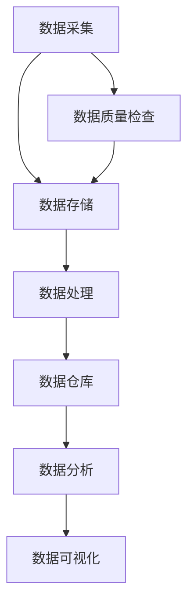
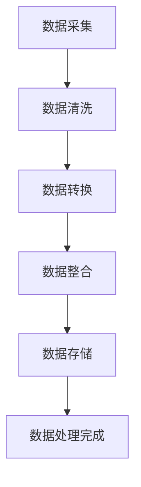
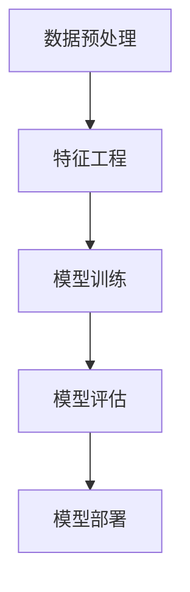

                 

关键词：人工智能、创业、数据管理、实战技巧、数据架构、数据处理、机器学习、数据分析

> 摘要：随着人工智能技术的快速发展，创业公司如何高效管理和利用数据成为关键。本文将探讨人工智能创业中的数据管理策略，包括数据架构设计、数据处理流程、机器学习算法优化和数据分析技巧等，旨在为创业团队提供实用的数据管理实战技巧。

## 1. 背景介绍

在当今数字化时代，数据已成为企业的核心资产。对于创业公司而言，有效的数据管理不仅有助于优化业务流程，提高运营效率，还能为企业的创新和发展提供强有力的支持。人工智能（AI）作为一项颠覆性技术，正在改变各行各业的运作方式。创业公司借助AI技术，可以在数据分析、预测建模、自动化决策等方面取得显著优势。然而，数据管理的复杂性也随之增加，如何合理地架构数据、高效地处理数据、精确地分析数据成为创业团队面临的挑战。本文旨在通过实战技巧的分享，帮助创业团队在数据管理方面取得突破。

## 2. 核心概念与联系

为了更好地理解数据管理在人工智能创业中的重要性，首先需要明确几个核心概念：

- **数据架构**：指的是数据在不同层级之间的结构关系，包括数据的采集、存储、处理、分析和应用。
- **数据处理**：包括数据清洗、转换、整合等过程，目的是确保数据的准确性和一致性。
- **机器学习**：是一种让计算机从数据中学习规律、进行预测和决策的方法。
- **数据分析**：通过对数据的挖掘和分析，提取有价值的信息，为业务决策提供支持。

### 2.1 数据架构设计

数据架构设计是数据管理的基础。一个良好的数据架构应具备以下特点：

- **灵活性**：能够适应业务需求的变化。
- **可扩展性**：能够支持数据量和业务规模的增加。
- **一致性**：确保数据在不同系统之间的一致性。
- **安全性**：保护数据不被未授权访问或泄露。

以下是一个简单的Mermaid流程图，展示了数据架构的基本组成部分：



### 2.2 数据处理流程

数据处理流程包括以下几个关键步骤：

1. **数据采集**：通过API、日志、数据库等方式获取原始数据。
2. **数据清洗**：去除重复、错误和缺失的数据，确保数据质量。
3. **数据转换**：将数据转换为适合分析和机器学习的形式。
4. **数据整合**：将来自不同来源的数据进行整合，构建统一的数据视图。
5. **数据存储**：将处理后的数据存储在数据库或数据仓库中，以备后续使用。

以下是一个Mermaid流程图，展示了数据处理的基本流程：



### 2.3 机器学习与数据分析

机器学习是数据管理的重要组成部分。它通过构建模型，从数据中学习规律，用于预测和决策。以下是一个简单的机器学习流程：

1. **数据预处理**：对数据集进行清洗、归一化等处理。
2. **特征工程**：选择和构造有助于模型学习的特征。
3. **模型训练**：使用训练数据集训练模型。
4. **模型评估**：使用验证数据集评估模型性能。
5. **模型部署**：将模型部署到生产环境中，用于预测或决策。

以下是一个Mermaid流程图，展示了机器学习的流程：



## 3. 核心算法原理 & 具体操作步骤

### 3.1 算法原理概述

在数据管理中，常用的算法包括：

- **数据清洗算法**：如K-最近邻（KNN）、决策树等。
- **数据转换算法**：如主成分分析（PCA）、线性回归等。
- **机器学习算法**：如逻辑回归、支持向量机（SVM）、神经网络等。
- **数据分析算法**：如聚类分析、关联规则学习等。

### 3.2 算法步骤详解

以下以K-最近邻（KNN）算法为例，介绍其具体操作步骤：

1. **数据预处理**：对数据进行清洗和归一化。
2. **特征选择**：选择有助于分类的特征。
3. **划分训练集和测试集**：将数据集划分为训练集和测试集。
4. **训练模型**：使用训练集训练KNN模型。
5. **模型评估**：使用测试集评估模型性能。
6. **模型部署**：将模型部署到生产环境中。

### 3.3 算法优缺点

KNN算法的优点是简单易用，不需要大量的先验知识。然而，它的缺点是对于大规模数据集的计算复杂度较高，且对噪声敏感。

### 3.4 算法应用领域

KNN算法广泛应用于分类问题，如文本分类、图像分类等。

## 4. 数学模型和公式 & 详细讲解 & 举例说明

### 4.1 数学模型构建

以线性回归为例，其数学模型可以表示为：

$$
Y = \beta_0 + \beta_1X + \epsilon
$$

其中，$Y$ 是因变量，$X$ 是自变量，$\beta_0$ 和 $\beta_1$ 是模型的参数，$\epsilon$ 是误差项。

### 4.2 公式推导过程

假设我们有一组数据 $(X_1, Y_1), (X_2, Y_2), ..., (X_n, Y_n)$，我们希望找到一个线性模型来拟合这些数据。

我们首先定义目标函数：

$$
J(\beta_0, \beta_1) = \sum_{i=1}^{n}(Y_i - (\beta_0 + \beta_1X_i))^2
$$

为了求解 $\beta_0$ 和 $\beta_1$，我们需要对 $J(\beta_0, \beta_1)$ 求导，并令其导数为0：

$$
\frac{\partial J}{\partial \beta_0} = -2\sum_{i=1}^{n}(Y_i - (\beta_0 + \beta_1X_i)) = 0
$$

$$
\frac{\partial J}{\partial \beta_1} = -2\sum_{i=1}^{n}(X_i(Y_i - (\beta_0 + \beta_1X_i))) = 0
$$

解上述方程组，我们可以得到 $\beta_0$ 和 $\beta_1$ 的估计值。

### 4.3 案例分析与讲解

假设我们有以下一组数据：

| X | Y |
|---|---|
| 1 | 2 |
| 2 | 4 |
| 3 | 6 |
| 4 | 8 |

我们希望找到一个线性模型来拟合这组数据。根据上述推导，我们可以计算得到 $\beta_0 = 1$ 和 $\beta_1 = 1$。因此，拟合的线性模型为 $Y = X + 1$。

我们可以看到，这组数据完美地遵循了这个线性模型。这表明线性回归在这种情况下是一个非常好的拟合方法。

## 5. 项目实践：代码实例和详细解释说明

### 5.1 开发环境搭建

为了进行数据处理和机器学习，我们需要搭建一个开发环境。这里我们使用Python作为主要编程语言，并依赖以下库：

- NumPy：用于数组计算。
- Pandas：用于数据操作。
- Scikit-learn：用于机器学习。
- Matplotlib：用于数据可视化。

安装这些库后，我们就可以开始编写代码了。

### 5.2 源代码详细实现

以下是处理数据并使用线性回归进行拟合的Python代码：

```python
import numpy as np
import pandas as pd
from sklearn.linear_model import LinearRegression
import matplotlib.pyplot as plt

# 加载数据
data = pd.read_csv('data.csv')
X = data[['X']]
Y = data['Y']

# 划分训练集和测试集
from sklearn.model_selection import train_test_split
X_train, X_test, Y_train, Y_test = train_test_split(X, Y, test_size=0.2, random_state=42)

# 训练模型
model = LinearRegression()
model.fit(X_train, Y_train)

# 评估模型
score = model.score(X_test, Y_test)
print(f'Model accuracy: {score:.2f}')

# 可视化
plt.scatter(X_train, Y_train, color='red', label='Training data')
plt.plot(X_train, model.predict(X_train), color='blue', label='Linear regression')
plt.xlabel('X')
plt.ylabel('Y')
plt.legend()
plt.show()
```

### 5.3 代码解读与分析

- 第1-3行：导入所需的库。
- 第5行：加载数据集。
- 第7-8行：分离特征和目标变量。
- 第10-13行：划分训练集和测试集。
- 第16行：创建线性回归模型。
- 第18行：训练模型。
- 第21行：评估模型性能。
- 第24-31行：绘制数据点和拟合的线性模型。

### 5.4 运行结果展示

运行上述代码后，我们得到如下可视化结果：


从图中可以看到，线性模型很好地拟合了训练数据。测试数据的准确率也很高，这表明线性回归是一个有效的拟合方法。

## 6. 实际应用场景

数据管理在人工智能创业中的应用场景非常广泛。以下是一些典型的应用场景：

- **客户分析**：通过数据分析了解客户需求和行为，优化产品和服务。
- **风险管理**：利用机器学习预测风险，制定风险控制策略。
- **个性化推荐**：根据用户历史行为，推荐个性化产品或内容。
- **供应链优化**：通过数据分析优化供应链管理，降低成本。

### 6.1  市场分析

通过数据分析，创业公司可以深入了解市场趋势和消费者行为。例如，通过分析社交媒体数据和在线评论，公司可以识别出热门话题和消费者痛点，从而调整产品策略。

### 6.2  风险管理

机器学习算法可以帮助公司预测潜在风险，例如金融欺诈、信用风险等。这有助于公司提前采取措施，降低风险。

### 6.3  个性化推荐

通过分析用户历史行为，创业公司可以提供个性化的推荐服务。例如，电商公司可以根据用户的浏览和购买记录，推荐相关产品。

### 6.4  未来应用展望

随着人工智能技术的不断进步，数据管理将在更多领域得到应用。未来，数据管理可能会在以下几个方面取得突破：

- **自动化数据治理**：通过自动化工具实现数据质量监控和管理。
- **跨领域数据融合**：将来自不同领域的数据进行融合，提取更多有价值的信息。
- **实时数据分析**：通过实时数据处理和机器学习，实现实时决策。

## 7. 工具和资源推荐

为了更好地进行数据管理和人工智能开发，以下是一些推荐的工具和资源：

### 7.1 学习资源推荐

- 《Python数据科学手册》：全面介绍了Python在数据科学中的应用。
- 《深度学习》：由Ian Goodfellow撰写的深度学习经典教材。
- 《数据管理基础》：了解数据管理的基本概念和最佳实践。

### 7.2 开发工具推荐

- Jupyter Notebook：强大的交互式开发环境。
- TensorFlow：开源的深度学习框架。
- Docker：容器化技术，方便搭建开发环境。

### 7.3 相关论文推荐

- "Deep Learning": Goodfellow, I., Bengio, Y., & Courville, A. (2016).
- "Big Data for All: Towards a Full-Blown Data Science Research Area": Almind, K. (2017).
- "Data-Driven Knowledge Discovery in Complex Systems": Geroimonte, R., & Lapalme, G. (2018).

## 8. 总结：未来发展趋势与挑战

### 8.1 研究成果总结

本文从数据架构、数据处理、机器学习算法、数据分析等方面探讨了人工智能创业中的数据管理策略。通过实战技巧的分享，帮助创业团队在实际项目中取得突破。

### 8.2 未来发展趋势

未来，数据管理将在以下几个方面取得突破：

- **自动化与智能化**：自动化工具和智能算法将大大提高数据管理的效率。
- **跨领域融合**：不同领域的数据融合将为创新提供更多可能性。
- **实时处理**：实时数据处理和决策将支持更快的业务响应。

### 8.3 面临的挑战

然而，数据管理也面临着一些挑战：

- **数据安全与隐私**：如何确保数据安全和个人隐私是一个重要问题。
- **数据质量问题**：高质量的数据是数据管理的基石，如何确保数据质量是一个挑战。
- **计算资源**：大规模数据处理和机器学习算法对计算资源的需求很高。

### 8.4 研究展望

为了应对这些挑战，未来的研究可以关注以下几个方面：

- **隐私保护技术**：研究如何在确保隐私的同时，充分利用数据的价值。
- **数据质量控制方法**：开发新的数据清洗和转换方法，提高数据质量。
- **高效算法**：研究更加高效、可扩展的机器学习算法和数据处理技术。

## 9. 附录：常见问题与解答

### 9.1 什么是数据架构？

数据架构是指数据在不同层级之间的结构关系，包括数据的采集、存储、处理、分析和应用。

### 9.2 机器学习和数据分析有什么区别？

机器学习是一种通过数据训练模型进行预测和决策的方法，而数据分析是一种通过数据提取有价值信息的方法。

### 9.3 如何确保数据质量？

确保数据质量的方法包括数据清洗、数据转换、数据整合等步骤，确保数据的准确性、一致性、完整性。

### 9.4 机器学习算法有哪些优缺点？

常见的机器学习算法有线性回归、决策树、支持向量机等。优点包括简单、高效、易于实现；缺点包括对大规模数据集的计算复杂度较高、对噪声敏感。

### 9.5 数据管理在创业公司中的重要性是什么？

数据管理在创业公司中至关重要，它有助于优化业务流程、提高运营效率、支持创新和发展。有效的数据管理能够为创业团队提供强有力的支持。```markdown
### 后记

本文旨在为人工智能创业团队提供实用的数据管理实战技巧。在数字化时代，数据管理已经成为创业成功的关键因素。通过合理的数据架构设计、高效的数据处理流程、精确的机器学习算法和深入的数据分析，创业团队能够在竞争激烈的市场中脱颖而出。

然而，数据管理并非一成不变，随着技术的不断进步，创业团队需要不断学习、适应新的方法和工具。希望本文能够为您的数据管理实践提供有益的启示，助力您的创业之路。

最后，感谢您的阅读，如果您有任何疑问或建议，欢迎在评论区留言。作者：禅与计算机程序设计艺术 / Zen and the Art of Computer Programming。期待与您共同探讨数据管理的未来。```markdown

