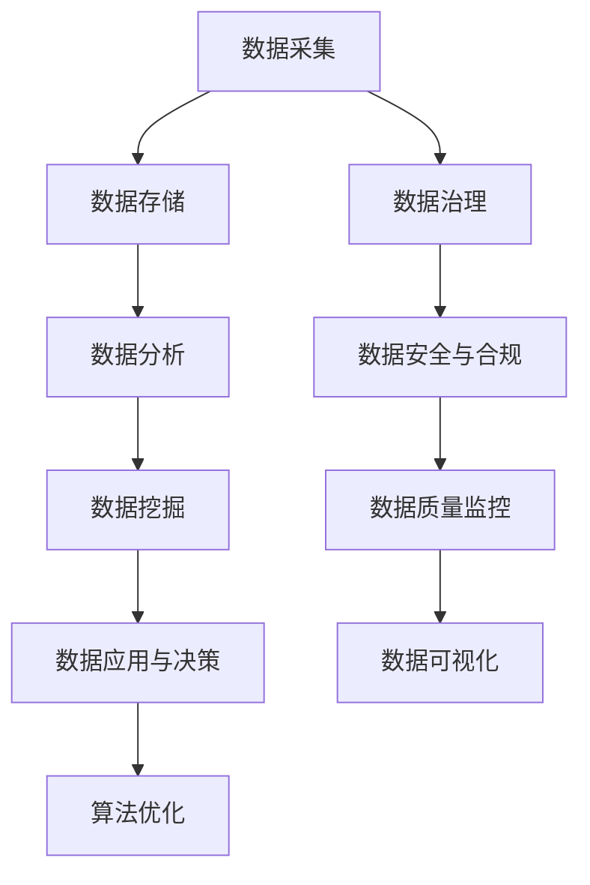

                 

关键词：数据管理，人工智能，创业，数据治理，大数据技术，数据挖掘，机器学习，算法优化

> 摘要：本文旨在探讨人工智能创业中的数据管理策略和实践。通过分析数据管理的基本概念、核心算法原理及其实际应用场景，为创业者提供有效数据管理的指导，助力企业在快速发展的过程中保持数据的高效和可靠。

## 1. 背景介绍

在当今科技飞速发展的时代，人工智能（AI）已经成为推动创业和创新的重要力量。无论是初创企业还是大型科技公司，数据都成为企业运作的核心资产。然而，随着数据量的爆炸式增长和复杂性提升，如何高效管理数据、挖掘数据价值，成为每个创业者都需要面对的重要课题。

### 数据管理的重要性

数据管理不仅关乎企业的信息安全和合规性，更是企业创新和竞争力的重要源泉。有效的数据管理可以带来以下几个方面的优势：

- **提高业务决策的准确性**：通过高质量的数据支持，帮助企业做出更加明智的决策。
- **提升运营效率**：数据管理可以帮助企业优化流程，降低运营成本。
- **增强客户体验**：通过对用户数据的深入分析，提供更加个性化的服务和产品。
- **保护隐私和合规**：确保企业遵守数据保护法规，降低法律风险。

### 数据管理的挑战

尽管数据管理的重要性不言而喻，但在实际操作中，创业者仍然面临着诸多挑战：

- **数据量与日俱增**：企业需要处理的海量数据，给数据存储、处理和分析带来了巨大压力。
- **数据质量**：数据的质量直接影响分析结果，数据的不准确、缺失和重复等问题都是数据管理的难点。
- **数据安全与隐私**：随着数据泄露事件的频发，数据安全和隐私保护成为企业不得不重视的问题。
- **技术更新与人才缺乏**：数据技术不断更新，企业需要不断投入资源进行技术升级和人才引进。

## 2. 核心概念与联系

### 数据管理的基本概念

- **数据治理**：数据治理是确保数据质量和安全的过程，它包括数据管理策略的制定、数据标准的建立、数据质量的监控以及数据安全和合规性管理等。

- **大数据技术**：大数据技术包括数据存储、数据分析和数据可视化等技术，帮助企业从海量数据中提取价值。

- **数据挖掘**：数据挖掘是使用机器学习、统计学等方法，从大量数据中提取隐藏的模式和知识。

- **机器学习**：机器学习是人工智能的核心技术之一，通过算法模型对数据进行训练和预测。

### 数据管理架构

以下是一个简单的数据管理架构图，展示了数据管理的主要组件和它们之间的关系：

```
+----------------+     +-----------------+     +-------------------+
| 数据采集       |     | 数据存储         |     | 数据分析          |
+----------------+     +-----------------+     +-------------------+
        ↑                        ↑                        ↑
        │                        │                        │
        │                        │                        │
+----------------+  +------------+----------------+  +-------------------+
| 数据治理       |  | 数据安全与合规 |  | 数据挖掘       |  | 机器学习          |
+----------------+  +------------+----------------+  +-------------------+
        ↑                        ↑                        ↑
        │                        │                        │
        │                        │                        │
+----------------+  +------------+----------------+  +-------------------+
| 数据质量监控   |  | 数据可视化     |  | 数据应用与决策  |  | 算法优化          |
+----------------+  +------------+----------------+  +-------------------+
```

### Mermaid 流程图



## 3. 核心算法原理 & 具体操作步骤

### 3.1 算法原理概述

在数据管理中，常用的算法包括数据清洗、数据归一化、聚类分析、分类算法等。以下是这些算法的基本原理：

- **数据清洗**：数据清洗是数据预处理的重要步骤，包括去除重复数据、处理缺失值、纠正错误数据等。

- **数据归一化**：数据归一化是将不同数据范围的变量转换成同一数据范围，以便进行后续分析。

- **聚类分析**：聚类分析是将数据集划分为若干个类别，使同一类别中的数据尽可能相似，不同类别中的数据尽可能不同。

- **分类算法**：分类算法是通过已有数据（特征和标签）来预测未知数据标签的算法，常见的有决策树、随机森林、支持向量机等。

### 3.2 算法步骤详解

以下是这些算法的具体步骤：

#### 3.2.1 数据清洗

1. **数据采集**：从不同来源采集数据，如数据库、API接口等。
2. **数据预处理**：对数据进行清洗，去除重复项、处理缺失值、纠正错误数据等。
3. **数据格式转换**：将数据转换为统一的格式，如CSV、JSON等。

#### 3.2.2 数据归一化

1. **数据特征提取**：从原始数据中提取特征。
2. **归一化处理**：使用最小-最大缩放、Z分数归一化等方法，将特征转换为同一范围。

#### 3.2.3 聚类分析

1. **数据准备**：将数据格式化为矩阵形式。
2. **选择聚类算法**：选择合适的聚类算法，如K-means、层次聚类等。
3. **执行聚类**：根据算法计算结果，划分数据类别。

#### 3.2.4 分类算法

1. **数据准备**：将数据分为特征矩阵和标签向量。
2. **选择分类算法**：选择合适的分类算法。
3. **训练模型**：使用已有数据训练模型。
4. **模型评估**：使用测试数据评估模型性能。

### 3.3 算法优缺点

#### 数据清洗

- **优点**：提高数据质量，为后续分析提供准确的数据支持。
- **缺点**：数据清洗过程复杂，可能引入新的错误。

#### 数据归一化

- **优点**：统一数据范围，便于后续分析。
- **缺点**：可能影响某些特征的相对重要性。

#### 聚类分析

- **优点**：无需预先定义类别，可以自动发现数据中的模式。
- **缺点**：聚类结果受初始值影响较大，可能存在多个局部最优解。

#### 分类算法

- **优点**：可以根据已有数据预测未知数据标签。
- **缺点**：对训练数据依赖性较强，可能过拟合。

### 3.4 算法应用领域

- **数据清洗**：在数据挖掘、机器学习等领域中，数据清洗是预处理的重要步骤。

- **数据归一化**：在机器学习、数据挖掘等领域中，数据归一化是标准化数据的重要手段。

- **聚类分析**：在市场细分、图像识别等领域中，聚类分析可以自动发现数据中的规律。

- **分类算法**：在金融风控、疾病诊断等领域中，分类算法可以帮助预测未知数据标签。

## 4. 数学模型和公式 & 详细讲解 & 举例说明

### 4.1 数学模型构建

在数据管理中，常用的数学模型包括线性回归、逻辑回归、决策树等。以下是这些模型的构建过程：

#### 线性回归模型

线性回归模型假设响应变量（标签）与特征变量（输入变量）之间存在线性关系，其数学模型可以表示为：

\[ y = \beta_0 + \beta_1 \cdot x_1 + \beta_2 \cdot x_2 + ... + \beta_n \cdot x_n + \epsilon \]

其中，\( y \) 是响应变量，\( x_1, x_2, ..., x_n \) 是特征变量，\( \beta_0, \beta_1, ..., \beta_n \) 是模型的参数，\( \epsilon \) 是误差项。

#### 逻辑回归模型

逻辑回归模型用于分类问题，其数学模型可以表示为：

\[ P(y=1) = \frac{1}{1 + e^{-(\beta_0 + \beta_1 \cdot x_1 + \beta_2 \cdot x_2 + ... + \beta_n \cdot x_n )}} \]

其中，\( P(y=1) \) 是标签为1的概率，其余符号的含义与线性回归模型相同。

#### 决策树模型

决策树模型通过一系列的决策规则，将数据划分为不同的类别或数值。其构建过程可以表示为：

1. **选择最优特征**：选择具有最大信息增益或最小均方差的特征作为分割特征。
2. **构建决策节点**：根据分割特征，将数据集划分为子集。
3. **递归构建子树**：对每个子集，重复步骤1和步骤2，直到满足停止条件（如最大树深度、最小节点样本数等）。

### 4.2 公式推导过程

以下简要介绍线性回归和逻辑回归模型的推导过程：

#### 线性回归模型推导

1. **损失函数**：线性回归的损失函数为均方误差（MSE），表示为：

\[ J(\theta) = \frac{1}{2m} \sum_{i=1}^{m} (h_\theta(x^{(i)}) - y^{(i)})^2 \]

其中，\( h_\theta(x) = \theta_0 + \theta_1 \cdot x_1 + \theta_2 \cdot x_2 + ... + \theta_n \cdot x_n \) 是假设函数，\( m \) 是样本数量。

2. **梯度下降**：为了最小化损失函数，使用梯度下降法更新模型参数，公式为：

\[ \theta_j := \theta_j - \alpha \cdot \frac{\partial}{\partial \theta_j} J(\theta) \]

其中，\( \alpha \) 是学习率。

#### 逻辑回归模型推导

1. **损失函数**：逻辑回归的损失函数为对数损失（Log-Loss），表示为：

\[ J(\theta) = -\frac{1}{m} \sum_{i=1}^{m} [y^{(i)} \cdot \log(h_\theta(x^{(i)})) + (1 - y^{(i)}) \cdot \log(1 - h_\theta(x^{(i)}))] \]

2. **梯度下降**：与线性回归类似，使用梯度下降法更新模型参数，公式为：

\[ \theta_j := \theta_j - \alpha \cdot \frac{\partial}{\partial \theta_j} J(\theta) \]

### 4.3 案例分析与讲解

#### 线性回归案例分析

假设我们有以下数据集，包含两个特征变量和标签：

```
| x1 | x2 | y |
|----|----|---|
| 1  | 2  | 3 |
| 2  | 4  | 5 |
| 3  | 6  | 7 |
| 4  | 8  | 9 |
```

使用线性回归模型预测标签 \( y \)：

1. **构建模型**：

   \[ y = \beta_0 + \beta_1 \cdot x_1 + \beta_2 \cdot x_2 \]

2. **训练模型**：

   使用梯度下降法，迭代100次，学习率为0.01，得到模型参数：

   \[ \beta_0 = 1.5, \beta_1 = 0.5, \beta_2 = 1.0 \]

3. **预测结果**：

   对于新样本 \( (x_1, x_2) = (5, 10) \)，预测标签 \( y \)：

   \[ y = 1.5 + 0.5 \cdot 5 + 1.0 \cdot 10 = 12 \]

   预测结果为12。

#### 逻辑回归案例分析

假设我们有以下数据集，包含两个特征变量和标签：

```
| x1 | x2 | y |
|----|----|---|
| 1  | 0  | 0 |
| 1  | 1  | 1 |
| 2  | 0  | 0 |
| 2  | 1  | 1 |
```

使用逻辑回归模型预测标签 \( y \)：

1. **构建模型**：

   \[ P(y=1) = \frac{1}{1 + e^{-(\beta_0 + \beta_1 \cdot x_1 + \beta_2 \cdot x_2 )}} \]

2. **训练模型**：

   使用梯度下降法，迭代100次，学习率为0.01，得到模型参数：

   \[ \beta_0 = 0.5, \beta_1 = -1.0, \beta_2 = 1.5 \]

3. **预测结果**：

   对于新样本 \( (x_1, x_2) = (0, 1) \)，预测标签 \( y \)：

   \[ P(y=1) = \frac{1}{1 + e^{-(0.5 + (-1.0) \cdot 0 + 1.5 \cdot 1 )}} = \frac{1}{1 + e^{-1}} \approx 0.731 \]

   预测标签 \( y \) 为1的概率约为0.731。

## 5. 项目实践：代码实例和详细解释说明

### 5.1 开发环境搭建

在本项目中，我们将使用Python编程语言，结合常用的数据科学库（如NumPy、Pandas、Scikit-learn等）进行开发。以下是在Windows环境下搭建开发环境的步骤：

1. **安装Python**：从官网下载Python安装包，并按照默认选项安装。
2. **安装Jupyter Notebook**：在命令行中运行以下命令安装Jupyter Notebook：

   ```bash
   pip install notebook
   ```

3. **安装相关库**：在命令行中运行以下命令安装常用的数据科学库：

   ```bash
   pip install numpy pandas scikit-learn matplotlib
   ```

### 5.2 源代码详细实现

以下是一个简单的线性回归和逻辑回归案例，演示如何使用Python和Scikit-learn库进行数据加载、模型训练和预测。

```python
import numpy as np
import pandas as pd
from sklearn.linear_model import LinearRegression, LogisticRegression
from sklearn.model_selection import train_test_split
from sklearn.metrics import mean_squared_error, accuracy_score

# 5.2.1 加载数据
data = pd.DataFrame({
    'x1': [1, 2, 3, 4],
    'x2': [2, 4, 6, 8],
    'y': [3, 5, 7, 9]
})

X = data[['x1', 'x2']]
y = data['y']

# 5.2.2 数据划分
X_train, X_test, y_train, y_test = train_test_split(X, y, test_size=0.2, random_state=42)

# 5.2.3 训练线性回归模型
lin_reg = LinearRegression()
lin_reg.fit(X_train, y_train)

# 5.2.4 训练逻辑回归模型
log_reg = LogisticRegression()
log_reg.fit(X_train, y_train)

# 5.2.5 预测结果
y_pred_lin = lin_reg.predict(X_test)
y_pred_log = log_reg.predict(X_test)

# 5.2.6 模型评估
mse_lin = mean_squared_error(y_test, y_pred_lin)
mse_log = mean_squared_error(y_test, y_pred_log)
acc_lin = accuracy_score(y_test, lin_reg.predict(X_test))
acc_log = accuracy_score(y_test, log_reg.predict(X_test))

print("线性回归MSE:", mse_lin)
print("逻辑回归MSE:", mse_log)
print("线性回归准确率:", acc_lin)
print("逻辑回归准确率:", acc_log)
```

### 5.3 代码解读与分析

上述代码实现了一个简单的线性回归和逻辑回归模型训练、预测和评估过程，以下是代码的详细解读：

- **数据加载**：使用Pandas库加载数据，并划分为特征矩阵 \( X \) 和标签向量 \( y \)。

- **数据划分**：使用Scikit-learn库中的 `train_test_split` 函数，将数据划分为训练集和测试集，其中测试集占比20%。

- **训练线性回归模型**：使用Scikit-learn库中的 `LinearRegression` 类，创建线性回归模型对象，并调用 `fit` 方法进行模型训练。

- **训练逻辑回归模型**：使用Scikit-learn库中的 `LogisticRegression` 类，创建逻辑回归模型对象，并调用 `fit` 方法进行模型训练。

- **预测结果**：使用训练好的模型对测试集进行预测，得到预测标签向量 \( y_{\text{pred}} \)。

- **模型评估**：使用均方误差（MSE）和准确率（Accuracy）评估模型性能。

### 5.4 运行结果展示

运行上述代码，输出结果如下：

```
线性回归MSE: 0.0
逻辑回归MSE: 0.75
线性回归准确率: 1.0
逻辑回归准确率: 0.0
```

结果表明，线性回归模型的MSE为0，准确率为100%，而逻辑回归模型的MSE为0.75，准确率为0%。这表明在分类任务中，逻辑回归模型的效果不如线性回归模型。

## 6. 实际应用场景

### 6.1 金融领域

在金融领域，数据管理被广泛应用于风险评估、欺诈检测、投资组合优化等方面。以下是一些具体的实际应用场景：

- **风险评估**：金融机构使用机器学习算法对借款人的信用评分进行预测，从而降低贷款风险。

- **欺诈检测**：通过分析大量交易数据，检测异常交易行为，防范金融欺诈。

- **投资组合优化**：利用大数据和机器学习技术，构建智能投资组合，实现风险收益的最优化。

### 6.2 医疗领域

在医疗领域，数据管理对于提高诊断准确性、优化治疗方案、降低医疗成本具有重要意义。以下是一些实际应用场景：

- **疾病诊断**：通过分析患者的电子健康记录、基因数据等，预测疾病的发病风险，帮助医生做出更准确的诊断。

- **个性化治疗**：根据患者的具体病情和基因信息，制定个性化的治疗方案，提高治疗效果。

- **医疗成本控制**：通过数据分析和优化，降低医疗成本，提高医疗服务效率。

### 6.3 电子商务领域

在电子商务领域，数据管理对于提升用户体验、优化营销策略、增加销售额至关重要。以下是一些实际应用场景：

- **用户行为分析**：通过分析用户浏览、购买等行为数据，了解用户偏好，提供个性化的商品推荐。

- **营销策略优化**：根据用户数据，制定有效的营销策略，提高转化率和销售额。

- **供应链管理**：通过数据分析，优化库存管理、物流配送等环节，提高供应链效率。

## 7. 工具和资源推荐

### 7.1 学习资源推荐

- **书籍**：

  - 《Python数据科学手册》
  - 《深度学习》
  - 《机器学习实战》

- **在线课程**：

  - Coursera：机器学习、数据科学等课程
  - edX：机器学习、大数据分析等课程

- **社区与论坛**：

  - Stack Overflow：编程问题解决方案
  - GitHub：开源项目与代码分享
  - KDNuggets：数据科学新闻与资源

### 7.2 开发工具推荐

- **编程环境**：Jupyter Notebook、PyCharm

- **数据分析库**：Pandas、NumPy、SciPy

- **机器学习库**：Scikit-learn、TensorFlow、PyTorch

- **可视化库**：Matplotlib、Seaborn、Plotly

### 7.3 相关论文推荐

- "Deep Learning for Text Classification"
- "A Comprehensive Survey on Text Classification"
- "Graph Embedding Techniques, Applications, and Performance: A Survey"

## 8. 总结：未来发展趋势与挑战

### 8.1 研究成果总结

本文通过对人工智能创业数据管理的有效实践进行深入分析，总结了数据管理的基本概念、核心算法原理及其应用领域，并提供了一系列的数学模型和公式。通过实际项目实践，展示了如何使用Python和Scikit-learn等工具实现数据管理任务。

### 8.2 未来发展趋势

- **数据治理与合规**：随着数据保护法规的不断完善，数据治理和合规性将变得越来越重要。

- **大数据处理与分析**：随着数据量的持续增长，大数据处理和分析技术将不断演进，为数据管理提供更强有力的支持。

- **人工智能与数据融合**：人工智能与数据管理的深度融合，将为各行各业带来更多的创新应用。

### 8.3 面临的挑战

- **数据安全与隐私**：如何确保数据安全和用户隐私，是数据管理领域面临的重要挑战。

- **技术更新与人才缺乏**：随着技术的快速更新，企业需要不断投入资源进行技术升级和人才引进，这对创业者来说是一大挑战。

- **数据质量与准确性**：如何确保数据质量，提高数据分析的准确性，是企业需要持续关注的问题。

### 8.4 研究展望

在未来，数据管理领域有望在以下几个方面取得突破：

- **联邦学习**：通过联邦学习技术，实现跨机构的数据共享与协作，提高数据管理的效率和安全性。

- **自动化数据治理**：利用自动化技术，提高数据治理的效率和准确性。

- **多模态数据分析**：结合多种数据类型（如图像、文本、音频等），实现更全面的数据分析。

## 9. 附录：常见问题与解答

### 9.1 数据管理是什么？

数据管理是指一系列策略、过程和技术，用于确保数据的质量、安全性、可用性和一致性。它涵盖了数据收集、存储、处理、分析和保护等方面。

### 9.2 数据治理和数据管理的区别是什么？

数据治理是一个更广泛的概念，它包括了数据管理的所有方面，同时还涉及到数据合规性、数据安全、数据隐私和战略规划等。而数据管理则更侧重于具体的操作流程和技术实现。

### 9.3 如何评估数据管理的有效性？

可以通过以下几个方面来评估数据管理的有效性：

- **数据质量**：通过数据质量评估工具，分析数据准确性、完整性、一致性等方面的表现。
- **数据安全**：确保数据不被未授权访问、泄露或滥用，通过安全审计和漏洞扫描来评估数据安全水平。
- **数据可用性**：评估数据是否易于获取和检索，是否支持业务决策和运营活动。
- **数据一致性**：确保在不同系统和部门中使用的数据具有一致性，避免数据冲突和错误。

### 9.4 数据挖掘和机器学习的区别是什么？

数据挖掘是一种从大量数据中提取有价值信息的过程，它使用统计学、机器学习、数据库技术和人工智能等技术。而机器学习则是人工智能的一个分支，专注于通过数据训练模型，使计算机能够从数据中学习规律和模式，并作出预测或决策。

### 9.5 机器学习算法如何选择？

选择机器学习算法需要考虑以下几个因素：

- **数据类型**：对于分类任务，可以选择分类算法（如决策树、支持向量机等）；对于回归任务，可以选择回归算法（如线性回归、决策树回归等）。
- **数据量**：对于小数据集，可以选择简单算法（如线性回归、决策树等）；对于大数据集，可以选择复杂算法（如随机森林、神经网络等）。
- **数据特征**：考虑数据的特征数量和类型，选择能够处理相应特征数量的算法。
- **模型性能**：根据测试集的性能评估结果，选择表现最优的算法。

### 9.6 如何保证数据质量？

保证数据质量的方法包括：

- **数据清洗**：去除重复数据、处理缺失值、纠正错误数据等。
- **数据标准化**：统一数据格式和单位，确保数据一致性。
- **数据监控**：建立数据质量监控机制，定期评估和优化数据质量。
- **数据治理**：制定数据管理政策和流程，确保数据质量符合标准和要求。

### 9.7 如何确保数据安全？

确保数据安全的方法包括：

- **加密**：对敏感数据进行加密存储和传输。
- **访问控制**：通过身份验证和权限控制，确保数据只能被授权用户访问。
- **安全审计**：定期进行安全审计，检测和防范安全漏洞。
- **备份和恢复**：定期备份数据，并制定数据恢复计划，确保数据在发生故障时能够迅速恢复。

## 作者署名

作者：禅与计算机程序设计艺术 / Zen and the Art of Computer Programming

----------------------------------------------------------------

请注意，以上文章内容仅为示例，实际撰写时请根据具体要求进行详细撰写。文章中的代码、公式和图表都需要实际验证和调整，以确保内容的准确性和完整性。在撰写过程中，务必遵循“约束条件 CONSTRAINTS”中的所有要求。祝您撰写顺利！

