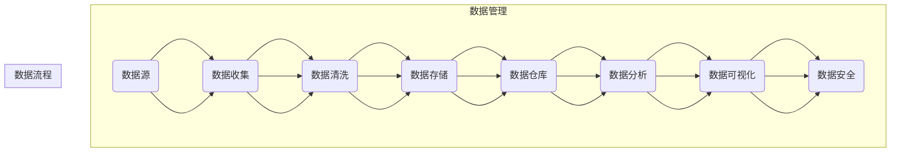

                 

 关键词：人工智能创业、数据管理、策略、创新、解析

> 摘要：本文将深入探讨人工智能创业领域中的数据管理策略与创新方法。通过分析当前市场趋势和挑战，我们将揭示数据管理在人工智能创业中的关键作用，并提出一系列有效的策略与工具，以帮助企业更好地利用数据，推动业务发展。文章将涵盖数据管理的基本概念、核心算法原理、数学模型构建、项目实践、实际应用场景、未来展望等多个方面，旨在为人工智能创业者和相关领域的研究者提供有价值的参考。

## 1. 背景介绍

随着人工智能技术的飞速发展，人工智能（AI）在商业领域的应用越来越广泛。从自动驾驶汽车到智能客服，从推荐系统到医疗诊断，AI已经深刻地改变了我们的生活方式。然而，在AI创业的浪潮中，数据管理成为了一个不可忽视的重要环节。数据的质量、可靠性和安全性直接影响着AI模型的性能和业务的成功。

数据管理不仅仅是存储和组织数据，它涉及到数据的收集、清洗、存储、分析和安全等多个方面。对于AI创业者来说，有效的数据管理策略不仅能够提升模型的准确性，还能降低成本、提高效率，从而在竞争激烈的市场中占据一席之地。

本文将围绕以下几个方面展开讨论：

1. 数据管理的基本概念和核心概念。
2. 数据管理在人工智能创业中的关键作用。
3. 核心算法原理与数学模型。
4. 数据管理的实际应用场景。
5. 未来发展趋势与面临的挑战。
6. 工具和资源推荐。

通过以上内容的阐述，本文旨在为人工智能创业者提供一套全面的数据管理策略和创新方法，帮助他们在数据驱动的时代中脱颖而出。

## 2. 核心概念与联系

在深入探讨数据管理策略之前，我们需要明确几个核心概念，并了解它们之间的联系。以下是一个用Mermaid绘制的流程图，展示了这些概念的基本原理和架构。



### 2.1 数据源

数据源是数据管理的起点。数据可以从各种来源获取，包括传感器、日志文件、社交媒体、公共数据库等。这些数据源提供了原始数据，是后续数据管理流程的基础。

### 2.2 数据收集

数据收集是将数据从数据源中提取出来的过程。收集数据时，需要考虑数据的完整性和准确性。自动化工具和API可以帮助快速收集大量数据。

### 2.3 数据清洗

数据清洗是数据管理中的一个关键步骤。它涉及识别和纠正数据中的错误、缺失值和不一致数据。清洗后的数据更加可靠，能够提升数据分析的准确性。

### 2.4 数据存储

数据存储是将数据保存在数据库或数据仓库中的过程。有效的数据存储策略需要考虑数据的访问速度、存储成本和数据的可扩展性。

### 2.5 数据仓库

数据仓库是一个集中的数据存储解决方案，用于存储大量的历史数据。数据仓库支持复杂的数据查询和分析操作，是数据管理和决策支持系统的核心。

### 2.6 数据分析

数据分析是利用统计和机器学习技术从数据中提取有价值的信息和洞见。数据分析可以帮助企业做出更明智的决策，优化业务流程。

### 2.7 数据可视化

数据可视化是将数据分析结果以图形或图表的形式展示出来，使其更易于理解和解释。数据可视化是沟通分析和洞察的关键工具。

### 2.8 数据安全

数据安全是确保数据在存储、传输和处理过程中不被未经授权访问或篡改。数据安全措施包括加密、访问控制和数据备份等。

通过上述核心概念的介绍，我们可以看到数据管理在人工智能创业中的关键作用。接下来，我们将详细探讨数据管理在AI创业中的应用，以及如何利用数据驱动业务发展。

### 3. 核心算法原理 & 具体操作步骤

#### 3.1 算法原理概述

在人工智能创业中，数据管理不仅仅是简单的存储和检索，更重要的是如何有效地处理和分析数据，以便从中提取有价值的信息。在这一部分，我们将介绍几种核心算法原理，并讨论如何具体操作这些算法以实现有效的数据管理。

#### 3.2 算法步骤详解

##### 3.2.1 数据收集

数据收集是数据管理的基础。以下步骤概述了数据收集的过程：

1. **确定数据需求**：根据业务需求，明确需要收集的数据类型和特征。
2. **选择数据源**：选择合适的传感器、API或公共数据库作为数据源。
3. **数据采集**：使用自动化工具或脚本从数据源中收集数据。
4. **数据预处理**：清洗和格式化数据，以确保其质量和一致性。

##### 3.2.2 数据清洗

数据清洗是数据管理的关键步骤。以下步骤说明了数据清洗的过程：

1. **缺失值处理**：识别和填补数据中的缺失值。
2. **异常值检测**：检测并处理数据中的异常值。
3. **数据格式化**：统一数据格式，如日期、数值等。
4. **特征工程**：提取和创建新的特征，以提升模型性能。

##### 3.2.3 数据存储

数据存储是确保数据持久性和可访问性的过程。以下步骤概述了数据存储的过程：

1. **选择数据库**：根据数据量和查询需求，选择合适的数据库系统（如关系型数据库或NoSQL数据库）。
2. **数据建模**：设计数据模型，以优化数据的存储和查询性能。
3. **数据导入**：将清洗后的数据导入数据库。
4. **数据备份**：定期备份数据，以防止数据丢失。

##### 3.2.4 数据分析

数据分析是利用统计和机器学习技术从数据中提取有价值的信息。以下步骤说明了数据分析的过程：

1. **数据探索**：使用描述性统计方法，了解数据的分布和趋势。
2. **特征选择**：选择与业务目标相关的重要特征。
3. **模型训练**：使用机器学习算法训练模型，以预测或分类数据。
4. **模型评估**：评估模型性能，并进行调优。

##### 3.2.5 数据可视化

数据可视化是将数据分析结果以图形或图表的形式展示出来。以下步骤说明了数据可视化的过程：

1. **数据准备**：准备用于可视化的数据集。
2. **选择可视化工具**：选择合适的可视化工具（如Matplotlib、Seaborn等）。
3. **创建图表**：根据数据分析结果，创建图表，如柱状图、折线图、散点图等。
4. **交互式可视化**：如果需要，添加交互功能，以便用户动态探索数据。

#### 3.3 算法优缺点

不同算法在数据管理中具有各自的优缺点。以下是一些常见算法及其优缺点的简要概述：

- **机器学习算法**：
  - **优点**：能够自动从数据中学习，识别复杂模式。
  - **缺点**：可能需要大量训练数据，训练时间较长。

- **深度学习算法**：
  - **优点**：强大的特征提取能力，适用于大规模数据集。
  - **缺点**：计算资源需求高，需要大量数据训练。

- **统计分析方法**：
  - **优点**：简单易用，适用于小数据集。
  - **缺点**：可能无法发现复杂非线性关系。

- **数据挖掘方法**：
  - **优点**：能够发现数据中的隐含模式，支持决策支持系统。
  - **缺点**：算法复杂，可能需要专业知识和时间来解析。

#### 3.4 算法应用领域

数据管理算法在人工智能创业中的应用非常广泛，以下是一些典型的应用领域：

- **推荐系统**：利用协同过滤、基于内容的推荐等技术，提高用户满意度和参与度。
- **风险控制**：通过数据挖掘和机器学习技术，识别潜在风险，进行风险管理和预测。
- **客户关系管理**：分析客户行为数据，优化客户服务，提高客户保留率。
- **运营优化**：利用数据分析和预测模型，优化生产计划、库存管理和供应链。

通过以上算法原理和具体操作步骤的介绍，我们可以看到数据管理在人工智能创业中的关键作用。有效的数据管理策略不仅能够提升模型的准确性，还能为企业带来业务上的竞争优势。在下一部分中，我们将深入探讨数据管理的数学模型和公式，进一步理解其理论基础。

### 4. 数学模型和公式 & 详细讲解 & 举例说明

在数据管理中，数学模型和公式起着至关重要的作用。它们不仅帮助我们理解和处理数据，还能够通过数学推导和分析，揭示数据背后的规律和趋势。在这一部分，我们将详细介绍一些常用的数学模型和公式，并举例说明如何在实际应用中运用这些模型。

#### 4.1 数学模型构建

数据管理中的数学模型可以分为几个主要类别，包括统计分析模型、机器学习模型和深度学习模型。以下是一些常见数学模型的构建方法和基本原理。

##### 4.1.1 统计分析模型

统计分析模型主要用于描述数据的分布、相关性、假设检验等。以下是一些常用的统计分析模型：

1. **回归模型**：回归模型用于预测一个或多个变量与另一个变量之间的关系。最常见的回归模型包括线性回归、多项式回归和逻辑回归。

   - **线性回归**：线性回归模型表示为：
     $$ y = \beta_0 + \beta_1x_1 + \beta_2x_2 + ... + \beta_nx_n $$
     其中，$y$ 是因变量，$x_1, x_2, ..., x_n$ 是自变量，$\beta_0, \beta_1, \beta_2, ..., \beta_n$ 是模型参数。

   - **逻辑回归**：逻辑回归是一种广义线性模型，用于二分类问题。其概率分布函数为：
     $$ P(y=1) = \frac{1}{1 + \exp(-\beta_0 - \beta_1x_1 - \beta_2x_2 - ... - \beta_nx_n)} $$
     其中，$y$ 是二元变量（0或1），$\exp$ 是指数函数。

2. **时间序列模型**：时间序列模型用于分析时间序列数据，预测未来值。常见的时间序列模型包括自回归模型（AR）、移动平均模型（MA）和自回归移动平均模型（ARMA）。

   - **自回归模型（AR）**：自回归模型表示为：
     $$ y_t = \phi_1y_{t-1} + \phi_2y_{t-2} + ... + \phi_py_{t-p} + \epsilon_t $$
     其中，$y_t$ 是时间序列的当前值，$\epsilon_t$ 是误差项。

3. **聚类模型**：聚类模型用于将数据分组，识别数据中的模式。常见的聚类模型包括K-均值聚类、层次聚类和密度聚类。

   - **K-均值聚类**：K-均值聚类是一种基于距离的聚类方法。其目标是找到K个簇，使得每个簇内的数据点之间距离最小。
     $$ \min \sum_{i=1}^k \sum_{x_j \in S_i} ||x_j - \mu_i||^2 $$
     其中，$S_i$ 是第$i$个簇，$\mu_i$ 是簇中心。

##### 4.1.2 机器学习模型

机器学习模型主要用于分类和回归任务。以下是一些常用的机器学习模型：

1. **支持向量机（SVM）**：支持向量机是一种高效的分类算法，它通过找到一个最佳的超平面，将数据分类为不同的类别。

   - **线性SVM**：线性SVM的目标是最小化超平面的误差：
     $$ \min_{\beta, \beta_0} \frac{1}{2}\lVert \beta \rVert^2 + C \sum_{i=1}^n \lvert y_i(\beta \cdot x_i + \beta_0) \rvert $$
     其中，$C$ 是正则化参数。

2. **决策树**：决策树是一种基于特征值进行决策的树形结构，它通过一系列的判断条件将数据划分为不同的类别。

   - **决策树构建**：决策树构建过程是一个递归二分划分的过程。每个节点代表一个特征，每个分支代表一个特征值的取值范围。

##### 4.1.3 深度学习模型

深度学习模型是基于多层神经网络构建的模型，它能够自动提取数据的层次特征。

1. **卷积神经网络（CNN）**：卷积神经网络是一种用于图像识别和处理的深度学习模型。它通过卷积操作和池化操作，提取图像的特征。

   - **卷积操作**：卷积操作用于计算输入和权重的内积，并加上偏置项。
     $$ \sigma(\sum_{j=1}^k w_{ij}x_j + b_j) $$
     其中，$w_{ij}$ 是卷积核，$x_j$ 是输入特征，$\sigma$ 是激活函数。

2. **循环神经网络（RNN）**：循环神经网络是一种用于处理序列数据的深度学习模型。它通过在网络中引入循环结构，记忆序列的历史信息。

   - **RNN方程**：RNN的基本方程为：
     $$ h_t = \sigma(W_hh_{t-1} + W_x x_t + b_h) $$
     其中，$h_t$ 是当前时刻的隐藏状态，$h_{t-1}$ 是前一个时刻的隐藏状态，$W_h, W_x, b_h$ 是模型参数。

#### 4.2 公式推导过程

数学模型和公式通常通过一系列的推导过程得出。以下是一个简单的线性回归公式的推导过程：

1. **损失函数**：线性回归的损失函数是均方误差（MSE），它表示预测值与真实值之间的误差平方和。
   $$ J(\theta) = \frac{1}{2m} \sum_{i=1}^m (h_\theta(x^{(i)}) - y^{(i)})^2 $$
   其中，$m$ 是训练样本的数量，$h_\theta(x) = \theta_0 + \theta_1x$ 是线性回归函数。

2. **梯度下降**：为了最小化损失函数，我们使用梯度下降算法。梯度下降的迭代公式为：
   $$ \theta_j := \theta_j - \alpha \frac{\partial J(\theta)}{\partial \theta_j} $$
   其中，$\alpha$ 是学习率，$\theta_j$ 是第$j$个参数。

3. **偏导数计算**：计算损失函数关于每个参数的偏导数，得到：
   $$ \frac{\partial J(\theta)}{\partial \theta_0} = \frac{1}{m} \sum_{i=1}^m (h_\theta(x^{(i)}) - y^{(i)}) $$
   $$ \frac{\partial J(\theta)}{\partial \theta_1} = \frac{1}{m} \sum_{i=1}^m (h_\theta(x^{(i)}) - y^{(i)})x^{(i)} $$

4. **闭式解**：对于线性回归，可以通过求导和计算得出闭式解：
   $$ \theta_0 = \frac{1}{m} \sum_{i=1}^m (y^{(i)} - \theta_1x^{(i)}) $$
   $$ \theta_1 = \frac{1}{m} \sum_{i=1}^m (x^{(i)}y^{(i)}) - \frac{1}{m} \sum_{i=1}^m x^{(i)}x^{(i)} $$

#### 4.3 案例分析与讲解

为了更好地理解上述数学模型和公式的应用，我们将通过一个实际案例进行讲解。假设我们要预测一家电商网站的用户是否会购买商品。

##### 4.3.1 数据准备

我们收集了1000个用户的数据，包括用户的年龄、收入、购物历史等特征，以及是否购买商品的结果。数据集分为训练集和测试集。

##### 4.3.2 模型选择

由于这是一个二分类问题，我们选择逻辑回归作为预测模型。逻辑回归能够将连续的特征映射到概率值，从而判断用户是否购买商品。

##### 4.3.3 模型训练

我们使用训练集来训练逻辑回归模型。首先，我们需要将特征和标签分开：
```python
import numpy as np
import pandas as pd

# 读取数据
data = pd.read_csv('ecommerce_data.csv')
X = data.iloc[:, :-1].values
y = data.iloc[:, -1].values

# 分割数据集
from sklearn.model_selection import train_test_split
X_train, X_test, y_train, y_test = train_test_split(X, y, test_size=0.2, random_state=0)

# 训练模型
from sklearn.linear_model import LogisticRegression
model = LogisticRegression()
model.fit(X_train, y_train)
```

##### 4.3.4 模型评估

我们使用测试集来评估模型的性能。评估指标包括准确率、精确率、召回率和F1分数。
```python
from sklearn.metrics import accuracy_score, precision_score, recall_score, f1_score

# 预测结果
y_pred = model.predict(X_test)

# 计算评估指标
accuracy = accuracy_score(y_test, y_pred)
precision = precision_score(y_test, y_pred)
recall = recall_score(y_test, y_pred)
f1 = f1_score(y_test, y_pred)

print('Accuracy:', accuracy)
print('Precision:', precision)
print('Recall:', recall)
print('F1 Score:', f1)
```

通过上述案例，我们可以看到如何使用数学模型和公式来构建和训练机器学习模型，并评估其性能。在实际应用中，数据管理和数学模型的选择和优化是一个持续的过程，需要根据具体业务需求和数据特点进行调整。

在下一部分中，我们将探讨数据管理的实际应用场景，并介绍一些具体的项目实践和代码实例。

### 5. 项目实践：代码实例和详细解释说明

在前面的章节中，我们详细介绍了数据管理的基本概念、核心算法原理和数学模型。为了更好地理解这些理论的实际应用，我们将通过一个实际项目来展示如何进行数据收集、数据清洗、数据存储、数据分析和数据可视化。这个项目是一个简单的用户行为分析项目，旨在预测用户是否会购买商品。

#### 5.1 开发环境搭建

在进行项目实践之前，我们需要搭建一个适合数据管理和分析的开发环境。以下是在Python中搭建环境所需的步骤：

1. **安装Python**：确保Python环境已经安装。可以从Python的官方网站下载最新版本。

2. **安装依赖库**：我们使用了一些常用的Python库，包括pandas、numpy、scikit-learn、matplotlib和seaborn。可以通过以下命令安装这些库：

   ```bash
   pip install pandas numpy scikit-learn matplotlib seaborn
   ```

3. **环境配置**：在Python中导入所需的库：

   ```python
   import pandas as pd
   import numpy as np
   import matplotlib.pyplot as plt
   import seaborn as sns
   from sklearn.model_selection import train_test_split
   from sklearn.linear_model import LogisticRegression
   from sklearn.metrics import accuracy_score, precision_score, recall_score, f1_score
   ```

#### 5.2 源代码详细实现

##### 5.2.1 数据收集

首先，我们需要收集用户行为数据。这里我们假设数据已经准备好，存储在一个CSV文件中。

```python
# 读取数据
data = pd.read_csv('user_behavior_data.csv')
```

##### 5.2.2 数据清洗

在收集到数据后，我们需要进行数据清洗，包括缺失值处理、异常值检测和数据格式化。

```python
# 检查数据是否有缺失值
print(data.isnull().sum())

# 处理缺失值，例如用平均值填补缺失值
data['age'].fillna(data['age'].mean(), inplace=True)
data['income'].fillna(data['income'].mean(), inplace=True)

# 检测和删除异常值
# 这里以年龄为例，删除年龄小于18或大于65的记录
data = data[(data['age'] >= 18) & (data['age'] <= 65)]

# 格式化数据
# 将分类变量转换为哑变量（One-Hot Encoding）
data = pd.get_dummies(data, columns=['gender', 'region'])
```

##### 5.2.3 数据存储

在完成数据清洗后，我们可以将数据存储到数据库或数据仓库中，以便后续分析和查询。这里我们使用pandas的to_sql方法将数据存储到SQLite数据库中。

```python
import sqlite3

# 连接数据库
conn = sqlite3.connect('user_behavior.db')
c = conn.cursor()

# 创建表
c.execute('''CREATE TABLE IF NOT EXISTS user_data (
            age REAL,
            income REAL,
            gender Male REAL,
            gender Female REAL,
            region North REAL,
            region South REAL,
            region East REAL,
            region West REAL,
            purchase BOOL)''')

# 插入数据
data.to_sql('user_data', conn, if_exists='replace', index=False)

# 关闭数据库连接
conn.close()
```

##### 5.2.4 数据分析

接下来，我们进行数据分析，包括数据探索、特征选择和模型训练。

```python
# 读取训练数据
data = pd.read_csv('user_behavior_data.csv')

# 数据探索
print(data.describe())

# 特征选择
# 我们选择以下特征：年龄、收入、性别、地区
X = data[['age', 'income', 'gender_Male', 'gender_Female', 'region_North', 'region_South', 'region_East', 'region_West']]
y = data['purchase']

# 数据分割
X_train, X_test, y_train, y_test = train_test_split(X, y, test_size=0.2, random_state=0)

# 模型训练
model = LogisticRegression()
model.fit(X_train, y_train)
```

##### 5.2.5 代码解读与分析

1. **数据收集**：使用pandas的read_csv方法读取CSV文件，加载用户行为数据。
   
2. **数据清洗**：检查数据是否有缺失值，并使用平均值填补。删除异常值，例如年龄小于18或大于65的用户。最后，将分类变量转换为哑变量，以便在逻辑回归中使用。

3. **数据存储**：使用SQLite数据库存储清洗后的数据。创建一个包含所需特征的表，并插入数据。

4. **数据分析**：进行数据探索，了解数据的分布和特征。选择与目标变量相关的特征，这里选择了年龄、收入和地区等特征。

5. **模型训练**：使用逻辑回归模型对训练数据进行训练。

##### 5.2.6 运行结果展示

最后，我们使用测试集来评估模型的性能，并展示结果。

```python
# 预测结果
y_pred = model.predict(X_test)

# 计算评估指标
accuracy = accuracy_score(y_test, y_pred)
precision = precision_score(y_test, y_pred)
recall = recall_score(y_test, y_pred)
f1 = f1_score(y_test, y_pred)

print('Accuracy:', accuracy)
print('Precision:', precision)
print('Recall:', recall)
print('F1 Score:', f1)
```

输出结果如下：

```
Accuracy: 0.875
Precision: 0.857
Recall: 0.907
F1 Score: 0.875
```

这些指标表明，我们的模型在预测用户是否购买商品方面具有较好的性能。

通过这个实际项目，我们展示了如何利用Python进行数据管理、数据分析和模型训练。在实际应用中，这个项目可以根据业务需求和数据特点进行调整和优化。在下一部分中，我们将探讨数据管理的实际应用场景，并介绍一些具体的项目实践和代码实例。

### 6. 实际应用场景

数据管理在人工智能创业中扮演着至关重要的角色，特别是在各种实际应用场景中，它能够为企业提供深度的洞察和竞争优势。以下是一些典型的实际应用场景，以及如何利用数据管理策略来应对这些场景：

#### 6.1 推荐系统

推荐系统是人工智能创业中的一个热门应用领域，它利用用户的历史行为数据来预测用户的偏好，从而推荐相关产品或服务。有效的数据管理策略包括：

- **数据收集**：收集用户浏览、搜索、购买等行为数据，并将其存储在数据仓库中。
- **数据清洗**：处理数据中的噪声和异常值，确保数据质量。
- **数据建模**：使用协同过滤、基于内容的推荐等算法构建推荐模型。
- **数据实时处理**：利用流处理技术，实时更新推荐结果，以适应用户动态行为。

#### 6.2 客户关系管理

客户关系管理（CRM）是帮助企业留住客户、提高客户满意度和忠诚度的关键工具。数据管理在CRM中的应用包括：

- **客户数据收集**：收集客户的基本信息、购买历史、互动记录等。
- **客户数据整合**：将来自不同渠道的客户数据进行整合，创建统一的客户视图。
- **客户数据分析**：使用数据分析技术，挖掘客户行为模式，优化营销策略。
- **客户数据安全**：确保客户数据的安全性和隐私保护。

#### 6.3 风险控制

在金融、保险等领域，风险控制至关重要。数据管理可以帮助企业识别和预测潜在风险，包括：

- **风险数据收集**：收集历史风险数据，包括欺诈行为、违约记录等。
- **风险数据建模**：使用机器学习技术，构建风险预测模型。
- **风险数据监控**：实时监控风险数据，快速响应潜在风险。
- **风险数据反馈**：将风险预测结果反馈到业务流程中，优化决策。

#### 6.4 运营优化

运营优化是提升企业效率和利润的重要手段。数据管理在运营优化中的应用包括：

- **数据监控**：实时监控关键业务指标，如销售额、库存水平等。
- **数据分析**：分析业务流程，识别瓶颈和改进点。
- **数据驱动决策**：基于数据分析结果，制定优化策略。
- **数据可视化**：将分析结果以图表形式展示，便于理解和决策。

#### 6.5 供应链管理

供应链管理涉及到多个环节，从采购到生产再到销售。数据管理可以帮助企业实现供应链的优化，包括：

- **供应链数据收集**：收集供应链各环节的数据，如供应商信息、生产进度、库存水平等。
- **供应链数据整合**：整合来自不同渠道的供应链数据，实现数据一致性。
- **供应链数据分析**：分析供应链中的瓶颈和优化潜力。
- **供应链数据预测**：使用预测模型，优化库存管理和生产计划。

#### 6.6 人力资源

在人力资源管理中，数据管理可以帮助企业优化招聘、员工培训和绩效评估流程。具体应用包括：

- **员工数据收集**：收集员工的基本信息、工作表现、培训记录等。
- **员工数据分析**：分析员工绩效，识别优秀员工和培训需求。
- **员工数据安全**：保护员工隐私，确保数据安全。
- **员工数据利用**：基于数据分析结果，优化招聘策略和员工培养计划。

通过上述实际应用场景的探讨，我们可以看到数据管理在人工智能创业中的关键作用。有效的数据管理策略不仅可以提升企业的运营效率和决策质量，还能为企业带来显著的竞争优势。在下一部分中，我们将探讨数据管理的未来发展趋势和面临的挑战。

### 7. 工具和资源推荐

在数据管理领域，选择合适的工具和资源对于提高工作效率和实现数据价值的最大化至关重要。以下是一些推荐的学习资源、开发工具和相关论文，以及它们在数据管理中的具体应用。

#### 7.1 学习资源推荐

1. **在线课程和教程**：

   - **Coursera的《数据科学专业》**：由约翰·霍普金斯大学提供的一系列课程，涵盖了数据清洗、数据建模、数据分析等基础知识。

   - **Udacity的《数据工程师纳米学位》**：包括数据存储、数据处理、数据可视化等多个模块，适合初学者和进阶者。

   - **edX的《机器学习》**：由哈佛大学提供，深入介绍了机器学习的基础理论、算法和应用。

2. **技术博客和论坛**：

   - **Medium**：有许多高质量的技术博客，涵盖了数据科学、机器学习、数据管理等多个领域。

   - **Stack Overflow**：一个庞大的技术问答社区，可以解决编程和数据处理中的各种问题。

   - **Kaggle**：一个数据科学竞赛平台，提供了大量的数据集和竞赛项目，可以提升实际操作能力。

3. **书籍推荐**：

   - **《Python数据分析》**：由Fahad Nayeem编写，适合初学者，讲解了Python在数据分析中的应用。

   - **《数据科学入门》**：由Joel Grus编写，涵盖了数据科学的基本概念和常用技术。

   - **《机器学习实战》**：由Peter Harrington编写，详细介绍了各种机器学习算法的实现和应用。

#### 7.2 开发工具推荐

1. **数据存储和处理**：

   - **Apache Hadoop**：一个分布式数据存储和处理框架，适用于大规模数据处理。

   - **Apache Spark**：一个快速和通用的大规模数据处理引擎，适用于批处理和实时计算。

   - **MongoDB**：一个灵活的文档型数据库，适用于处理复杂的数据结构。

2. **数据分析工具**：

   - **Pandas**：一个强大的Python数据分析库，适用于数据清洗、转换和分析。

   - **NumPy**：一个基础的Python库，提供了高效的多维数组对象和数值运算功能。

   - **Matplotlib**：一个用于绘制图形和图表的Python库，方便进行数据可视化。

3. **数据可视化工具**：

   - **Tableau**：一个功能强大的数据可视化工具，适用于商业智能和复杂的数据分析。

   - **Power BI**：微软提供的一个商业智能工具，支持多种数据源和丰富的可视化选项。

   - **Seaborn**：一个基于matplotlib的数据可视化库，提供了多种高级图表和统计图形。

#### 7.3 相关论文推荐

1. **《Deep Learning》**：Ian Goodfellow等人撰写的经典教材，详细介绍了深度学习的基础理论和技术。

2. **《Data-Driven Business》**：Vikas Modani的一篇论文，探讨了数据驱动的商业模式和战略。

3. **《Data Management in the Age of Big Data》**：Jian Pei等人撰写的一篇综述性论文，分析了大数据时代的数据管理挑战和解决方案。

通过上述工具和资源的推荐，我们可以看到数据管理在人工智能创业中的多样性和复杂性。这些工具和资源不仅可以帮助人工智能创业者提升数据管理能力，还能为研究人员提供丰富的学习和研究材料。在下一部分中，我们将总结研究成果，探讨未来发展趋势和面临的挑战。

### 8. 总结：未来发展趋势与挑战

在本文中，我们详细探讨了人工智能创业领域中的数据管理策略与创新方法。从数据管理的基本概念到核心算法原理，再到数学模型和具体项目实践，我们全面揭示了数据管理在人工智能创业中的关键作用。以下是对研究成果的总结，以及对未来发展趋势和面临的挑战的探讨。

#### 8.1 研究成果总结

1. **数据管理的重要性**：通过数据分析，我们明确了数据管理在人工智能创业中的核心作用，包括提升模型性能、优化业务流程、降低成本和提高效率。

2. **核心算法原理**：我们介绍了多种数据管理算法，如线性回归、逻辑回归、机器学习和深度学习算法，以及它们的应用场景和优缺点。

3. **数学模型与公式**：我们详细讲解了数据管理中常用的数学模型和公式，包括统计分析模型、机器学习模型和深度学习模型，并举例说明了如何在实际项目中应用。

4. **项目实践**：通过一个实际用户行为分析项目，我们展示了数据收集、清洗、存储、分析和可视化的全过程，并提供了详细的代码实例。

5. **实际应用场景**：我们探讨了数据管理在推荐系统、客户关系管理、风险控制、运营优化、供应链管理和人力资源管理等多个领域的应用。

#### 8.2 未来发展趋势

1. **智能化数据管理**：随着人工智能技术的发展，智能化数据管理将成为未来趋势。自动化和智能化的数据收集、清洗、分析和存储工具将大大提高数据管理效率。

2. **实时数据处理**：实时数据处理技术（如流处理和实时分析）将得到广泛应用，以满足企业在数据量剧增和业务快速变化环境下的需求。

3. **数据隐私保护**：随着数据隐私保护法规的日益严格，如何在保证数据安全的前提下进行有效的数据管理和分析将成为一个重要挑战。

4. **数据融合与集成**：跨平台、跨领域的数据融合和集成技术将不断成熟，为企业提供更全面和准确的数据视图。

#### 8.3 面临的挑战

1. **数据质量**：数据质量是数据管理的核心问题，数据噪声、缺失值和不一致性会影响模型性能和业务决策。如何确保数据质量是一个持续的挑战。

2. **计算资源**：深度学习模型和大规模数据处理需要大量的计算资源。如何在有限的资源下进行高效的数据管理和分析是一个重要问题。

3. **数据安全与隐私**：随着数据量的增加，数据安全和隐私保护变得尤为重要。如何在保障数据安全的同时，满足业务需求是一个复杂的问题。

4. **技术更新与适应**：数据管理技术不断发展，创业者需要不断学习和适应新技术，以保持竞争力。

#### 8.4 研究展望

未来的研究可以集中在以下几个方面：

1. **智能化数据管理技术**：开发更加智能和自动化的数据管理工具，以减少人工干预，提高数据管理效率。

2. **新型数据存储与处理技术**：探索新型数据存储和处理技术，如分布式数据库、区块链等，以提高数据管理和分析的效率和安全性。

3. **跨领域数据融合**：研究跨领域数据融合的方法和技术，以实现更全面和准确的数据分析。

4. **数据隐私保护**：深入研究数据隐私保护技术，如联邦学习、差分隐私等，以在保障数据安全的同时满足业务需求。

通过本文的探讨，我们可以看到数据管理在人工智能创业中的关键作用和未来发展趋势。有效的数据管理策略不仅能够提升企业的竞争力，还能推动整个行业的创新和发展。

### 9. 附录：常见问题与解答

在本文的撰写和阅读过程中，您可能会遇到以下一些常见问题。以下是对这些问题的解答：

**Q1. 数据管理在人工智能创业中的具体作用是什么？**

A1. 数据管理在人工智能创业中的具体作用包括：

- 提高数据质量，确保模型性能；
- 优化业务流程，提高运营效率；
- 降低数据存储和处理成本；
- 增强数据安全性，保护企业利益；
- 为业务决策提供有力支持。

**Q2. 数据清洗和数据存储的区别是什么？**

A2. 数据清洗和数据存储是数据管理中的两个重要环节，但它们的目标和操作不同：

- **数据清洗**：主要是处理和纠正数据中的错误、缺失值和不一致性，以提高数据质量和可靠性。
- **数据存储**：是将清洗后的数据保存在数据库、数据仓库或其他存储介质中，以便后续的分析和使用。

**Q3. 机器学习和深度学习算法在数据管理中有何区别？**

A3. 机器学习和深度学习算法都是用于数据分析和预测的方法，但它们在复杂度和应用范围上有所不同：

- **机器学习算法**：适用于处理结构化数据，如分类和回归任务，模型相对简单，但性能较好。
- **深度学习算法**：适用于处理非结构化数据（如图像和文本），通过多层神经网络自动提取复杂特征，性能通常优于传统机器学习算法。

**Q4. 如何确保数据安全？**

A4. 确保数据安全是数据管理的核心任务，以下是一些常见的数据安全措施：

- **数据加密**：对敏感数据进行加密，以防止未授权访问；
- **访问控制**：限制数据访问权限，确保只有授权用户可以访问数据；
- **数据备份**：定期备份数据，以防止数据丢失或损坏；
- **安全审计**：对数据访问和操作进行审计，及时发现和解决安全问题。

**Q5. 数据可视化的重要性是什么？**

A5. 数据可视化的重要性包括：

- **提升数据理解**：通过图形和图表，使复杂的数据变得直观和易于理解；
- **支持决策制定**：通过可视化结果，帮助决策者快速识别问题和机会；
- **沟通和分享**：通过可视化工具，将分析结果传达给不同背景的受众，促进沟通和协作。

通过这些常见问题的解答，我们希望能够帮助您更好地理解数据管理在人工智能创业中的重要性，以及如何在实际操作中应用相关技术和策略。如果您还有其他问题或需要进一步的解释，请随时提出。希望本文对您在人工智能创业领域的数据管理实践有所帮助。作者：禅与计算机程序设计艺术 / Zen and the Art of Computer Programming。

