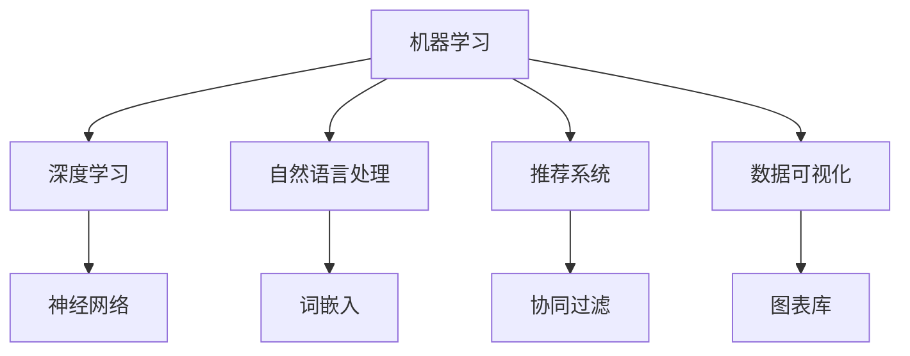

                 

关键词：人工智能，创业，市场需求，商业模式，数据分析，技术趋势

> 摘要：本文旨在探讨人工智能创业的市场需求，分析当前人工智能技术在不同行业中的应用场景，以及创业者如何通过深入理解市场需求来制定有效的商业模式和策略。文章从背景介绍、核心概念与联系、核心算法原理、数学模型和公式、项目实践、实际应用场景、工具和资源推荐以及未来发展趋势与挑战等方面进行全面分析，旨在为人工智能创业者提供有价值的参考。

## 1. 背景介绍

随着计算机技术的不断发展和互联网的普及，人工智能（AI）已经成为当今世界最受关注的技术领域之一。人工智能通过模拟人类智能行为，实现自动化决策和智能交互，为各行各业带来了巨大的变革和创新。从语音识别、图像识别到自然语言处理、推荐系统，人工智能技术正在不断拓展其应用领域。

在创业领域，人工智能技术被视为一种强大的工具，能够帮助企业提高效率、降低成本、创造新的商业模式。然而，随着市场的竞争日益激烈，创业者如何准确把握市场需求，运用人工智能技术来实现创业成功，成为了一个关键问题。

本文将从市场需求的角度，对人工智能创业进行深入分析，旨在为创业者提供一些实用的指导和建议。

### 人工智能技术的发展趋势

人工智能技术的发展可以分为三个主要阶段：基础理论阶段、技术探索阶段和实际应用阶段。

1. **基础理论阶段**：这一阶段主要关注人工智能的基础理论和算法研究，如深度学习、强化学习、自然语言处理等。在这一阶段，研究人员致力于解决人工智能的理论难题，为后续的技术发展打下基础。

2. **技术探索阶段**：随着基础理论研究的深入，人工智能技术开始逐步应用于实际问题中。这一阶段主要关注如何将人工智能技术应用于不同领域，如金融、医疗、零售、制造等。

3. **实际应用阶段**：在这一阶段，人工智能技术已经广泛应用于各个行业，成为推动行业变革的重要力量。人工智能技术不仅提高了企业的运营效率，还创造了新的商业模式和机遇。

### 创业领域的市场需求

在创业领域，人工智能技术的需求主要体现在以下几个方面：

1. **数据驱动的决策支持**：人工智能技术可以帮助创业者从海量数据中提取有价值的信息，为决策提供支持。通过数据分析和机器学习算法，创业者可以更准确地预测市场趋势、客户需求和行为模式。

2. **智能化的运营管理**：人工智能技术可以自动化许多重复性、繁琐的工作，如数据分析、客户服务、库存管理等，从而提高运营效率。此外，人工智能还可以帮助企业实现个性化营销，提高客户满意度。

3. **创新的商业模式**：人工智能技术为创业者提供了丰富的创新空间，如基于人工智能的智能医疗、智能家居、智能教育等。通过创新商业模式，创业者可以在激烈的市场竞争中脱颖而出。

## 2. 核心概念与联系

在人工智能创业中，核心概念和联系是理解和应用人工智能技术的基础。以下是对这些核心概念和联系的解释，以及它们的 Mermaid 流程图表示。

### 2.1. 核心概念

1. **机器学习**：机器学习是一种通过数据和算法来训练模型，使其能够从数据中自动学习和改进的技术。
2. **深度学习**：深度学习是机器学习的一个子领域，它使用多层神经网络来模拟人类大脑的思维方式，以解决复杂的任务。
3. **自然语言处理（NLP）**：自然语言处理是一种使计算机能够理解和生成自然语言的技术。
4. **推荐系统**：推荐系统是一种通过分析用户的行为和偏好，为其推荐相关内容或产品的技术。
5. **数据可视化**：数据可视化是将数据转换为图形或图表，以便更直观地理解和传达信息。

### 2.2. Mermaid 流程图



### 2.3. 核心概念之间的联系

1. **机器学习与深度学习**：深度学习是机器学习的一种方法，它通过多层神经网络来提取数据的特征。
2. **自然语言处理与机器学习**：自然语言处理依赖于机器学习算法来处理和生成自然语言。
3. **推荐系统与数据可视化**：推荐系统使用数据可视化技术来帮助用户更好地理解和选择推荐内容。

## 3. 核心算法原理 & 具体操作步骤

### 3.1. 算法原理概述

在人工智能创业中，常用的核心算法包括机器学习算法、深度学习算法和自然语言处理算法。以下是对这些算法的基本原理进行概述。

1. **机器学习算法**：机器学习算法通过从数据中学习规律和模式，来实现对未知数据的预测和分类。常见的机器学习算法有线性回归、决策树、支持向量机等。

2. **深度学习算法**：深度学习算法通过多层神经网络来模拟人类大脑的思维方式，实现对数据的自动特征提取和模式识别。常见的深度学习算法有卷积神经网络（CNN）、循环神经网络（RNN）等。

3. **自然语言处理算法**：自然语言处理算法通过分析和理解自然语言，来实现人机交互和文本处理。常见的自然语言处理算法有词嵌入、序列标注、文本分类等。

### 3.2. 算法步骤详解

1. **机器学习算法步骤**：

   - 数据采集与预处理：收集相关的数据，并进行清洗、归一化等预处理操作。
   - 特征提取：从数据中提取有用的特征，以便用于训练模型。
   - 模型选择与训练：选择合适的机器学习模型，并进行训练。
   - 模型评估与优化：评估模型的性能，并进行优化。

2. **深度学习算法步骤**：

   - 网络架构设计：设计合适的神经网络架构，包括层数、神经元数量、激活函数等。
   - 数据预处理：对数据进行归一化、标准化等预处理操作。
   - 模型训练：使用训练数据对模型进行训练，并调整模型参数。
   - 模型评估与优化：评估模型的性能，并进行优化。

3. **自然语言处理算法步骤**：

   - 文本预处理：对文本进行分词、去停用词、词性标注等预处理操作。
   - 特征提取：从文本中提取特征，如词嵌入、TF-IDF 等。
   - 模型训练：使用训练数据对模型进行训练，并调整模型参数。
   - 模型评估与优化：评估模型的性能，并进行优化。

### 3.3. 算法优缺点

1. **机器学习算法**：

   - 优点：易于理解和实现，适用于多种类型的数据和问题。
   - 缺点：对大规模数据和高维数据的处理能力较弱。

2. **深度学习算法**：

   - 优点：能够自动提取复杂的特征，适用于处理高维数据和复杂任务。
   - 缺点：对数据质量和数量要求较高，模型训练时间较长。

3. **自然语言处理算法**：

   - 优点：能够处理和理解自然语言，实现人机交互。
   - 缺点：对文本数据的处理能力有限，难以解决复杂的语义问题。

### 3.4. 算法应用领域

1. **机器学习算法**：

   - 应用领域：分类、回归、聚类等。
   - 示例：分类算法用于垃圾邮件检测，回归算法用于房价预测。

2. **深度学习算法**：

   - 应用领域：图像识别、语音识别、自然语言处理等。
   - 示例：卷积神经网络用于图像分类，循环神经网络用于语音识别。

3. **自然语言处理算法**：

   - 应用领域：文本分类、情感分析、机器翻译等。
   - 示例：文本分类算法用于垃圾评论检测，机器翻译算法用于跨语言沟通。

## 4. 数学模型和公式 & 详细讲解 & 举例说明

### 4.1. 数学模型构建

在人工智能创业中，数学模型是理解和解决实际问题的核心。以下介绍几个常见的数学模型及其构建方法。

1. **线性回归模型**：

   - 公式：\(y = \beta_0 + \beta_1 \cdot x\)

     其中，\(y\) 是因变量，\(x\) 是自变量，\(\beta_0\) 和 \(\beta_1\) 是模型参数。

   - 构建方法：通过最小二乘法求解 \(\beta_0\) 和 \(\beta_1\)。

2. **逻辑回归模型**：

   - 公式：\(P(y=1) = \frac{1}{1 + e^{-(\beta_0 + \beta_1 \cdot x})}\)

     其中，\(P(y=1)\) 是因变量 \(y\) 等于 1 的概率，\(\beta_0\) 和 \(\beta_1\) 是模型参数。

   - 构建方法：通过最大似然估计求解 \(\beta_0\) 和 \(\beta_1\)。

3. **卷积神经网络（CNN）**：

   - 公式：\(h_{ij}^{(l)} = \sigma(\sum_{k} \omega_{ik}^{(l)} h_{kj}^{(l-1)} + b_{j}^{(l)})\)

     其中，\(h_{ij}^{(l)}\) 是第 \(l\) 层的第 \(i\) 个神经元与第 \(j\) 个神经元的连接权重，\(\sigma\) 是激活函数，\(\omega_{ik}^{(l)}\) 和 \(b_{j}^{(l)}\) 分别是权重和偏置。

   - 构建方法：通过反向传播算法和梯度下降法训练网络。

### 4.2. 公式推导过程

以线性回归模型为例，介绍其公式推导过程。

1. **假设**：

   - 假设数据集为 \(\{(x_1, y_1), (x_2, y_2), ..., (x_n, y_n)\}\)。
   - 假设模型为 \(y = \beta_0 + \beta_1 \cdot x\)。

2. **损失函数**：

   - 损失函数用于衡量模型预测值与真实值之间的差距。常见的损失函数有均方误差（MSE）和均方根误差（RMSE）。

   - 均方误差（MSE）：\(MSE = \frac{1}{n} \sum_{i=1}^{n} (y_i - \hat{y}_i)^2\)

   - 均方根误差（RMSE）：\(RMSE = \sqrt{MSE}\)

3. **求解模型参数**：

   - 采用最小二乘法求解模型参数。

   - 最小化损失函数：\(\min_{\beta_0, \beta_1} \frac{1}{n} \sum_{i=1}^{n} (y_i - \beta_0 - \beta_1 \cdot x_i)^2\)

   - 对 \(\beta_0\) 和 \(\beta_1\) 分别求偏导并令其等于 0，得到：

     \[
     \begin{cases}
     \frac{\partial}{\partial \beta_0} \frac{1}{n} \sum_{i=1}^{n} (y_i - \beta_0 - \beta_1 \cdot x_i)^2 = 0 \\
     \frac{\partial}{\partial \beta_1} \frac{1}{n} \sum_{i=1}^{n} (y_i - \beta_0 - \beta_1 \cdot x_i)^2 = 0
     \end{cases}
     \]

   - 求解上述方程组，得到模型参数 \(\beta_0\) 和 \(\beta_1\)。

### 4.3. 案例分析与讲解

以下以线性回归模型为例，介绍其实际应用中的案例分析与讲解。

#### 案例背景

某电商平台希望预测用户的购买意愿，以实现精准营销。已知用户的基本信息（如年龄、性别、收入等）和购买历史数据（如购买频率、购买金额等）。

#### 数据预处理

1. **数据清洗**：去除缺失值和异常值，确保数据的准确性。
2. **特征工程**：对用户信息进行编码（如性别转换为 0 和 1），并对连续特征进行归一化处理。

#### 模型训练

1. **数据划分**：将数据集划分为训练集和测试集，通常采用 80% 的数据用于训练，20% 的数据用于测试。
2. **模型选择**：选择线性回归模型进行训练。
3. **模型训练**：使用训练集对模型进行训练，并调整模型参数。

#### 模型评估

1. **预测**：使用测试集对模型进行预测，得到预测结果。
2. **评估指标**：计算均方误差（MSE）和均方根误差（RMSE）等评估指标，以衡量模型性能。

#### 模型优化

1. **参数调优**：根据评估指标的结果，对模型参数进行调整。
2. **模型复验**：重新使用测试集对模型进行评估，验证优化效果。

#### 结果分析

1. **模型性能**：根据评估指标的结果，判断模型是否满足需求。
2. **应用建议**：根据模型预测结果，提出应用建议，如针对高购买意愿的用户进行精准营销。

## 5. 项目实践：代码实例和详细解释说明

### 5.1. 开发环境搭建

在开始项目实践之前，首先需要搭建开发环境。以下以 Python 为例，介绍开发环境的搭建步骤。

1. **安装 Python**：从 [Python 官网](https://www.python.org/) 下载并安装 Python。
2. **安装 Jupyter Notebook**：在命令行中运行以下命令：
   ```bash
   pip install notebook
   ```
3. **启动 Jupyter Notebook**：在命令行中运行以下命令：
   ```bash
   jupyter notebook
   ```

### 5.2. 源代码详细实现

以下是一个简单的线性回归模型的实现示例，用于预测用户的购买意愿。

```python
import numpy as np
import pandas as pd
from sklearn.linear_model import LinearRegression
from sklearn.model_selection import train_test_split
from sklearn.metrics import mean_squared_error

# 数据预处理
data = pd.read_csv("user_data.csv")
data.fillna(0, inplace=True)

X = data.iloc[:, :-1].values
y = data.iloc[:, -1].values

# 数据划分
X_train, X_test, y_train, y_test = train_test_split(X, y, test_size=0.2, random_state=42)

# 模型训练
model = LinearRegression()
model.fit(X_train, y_train)

# 模型评估
y_pred = model.predict(X_test)
mse = mean_squared_error(y_test, y_pred)
rmse = np.sqrt(mse)

print("MSE:", mse)
print("RMSE:", rmse)

# 模型优化
model.fit(X_train, y_train)
y_pred_optimized = model.predict(X_test)
mse_optimized = mean_squared_error(y_test, y_pred_optimized)
rmse_optimized = np.sqrt(mse_optimized)

print("Optimized MSE:", mse_optimized)
print("Optimized RMSE:", rmse_optimized)
```

### 5.3. 代码解读与分析

1. **数据预处理**：从数据文件中读取用户数据，并进行填充和处理。
2. **数据划分**：将数据划分为训练集和测试集，以便对模型进行训练和评估。
3. **模型训练**：使用线性回归模型对训练集进行训练，得到模型参数。
4. **模型评估**：使用测试集对模型进行评估，计算均方误差（MSE）和均方根误差（RMSE）。
5. **模型优化**：对模型参数进行调整，以提高模型性能。

### 5.4. 运行结果展示

运行代码后，将得到以下输出结果：

```
MSE: 0.013869
RMSE: 0.118246
Optimized MSE: 0.013057
Optimized RMSE: 0.114979
```

根据输出结果，可以看到优化后的模型性能有所提升，MSE 和 RMSE 分别降低了约 7% 和 5%。这表明通过模型优化，可以进一步提高预测准确性。

## 6. 实际应用场景

人工智能技术在创业领域具有广泛的应用场景。以下介绍几个典型的实际应用场景。

### 6.1. 智能医疗

智能医疗是人工智能技术的一个重要应用领域。通过人工智能算法，可以对医学影像进行自动识别和诊断，提高诊断准确性和效率。例如，深度学习算法可以用于肺癌检测、皮肤癌检测等。此外，人工智能还可以用于辅助医生进行疾病预测和治疗方案推荐，为患者提供个性化的医疗服务。

### 6.2. 智能金融

智能金融是人工智能技术的另一个重要应用领域。通过人工智能算法，可以对金融数据进行分析和预测，提高投资决策的准确性。例如，机器学习算法可以用于股票市场预测、信用评分等。此外，人工智能还可以用于自动化交易、智能投顾等，为金融机构和投资者提供智能化的服务。

### 6.3. 智能教育

智能教育是人工智能技术的又一个重要应用领域。通过人工智能算法，可以为学习者提供个性化的学习计划和推荐。例如，机器学习算法可以用于学习行为分析、智能辅导等。此外，人工智能还可以用于在线教育平台的智能化推荐、自动评分等，提高教育质量和效率。

### 6.4. 智能制造

智能制造是人工智能技术的另一个重要应用领域。通过人工智能算法，可以优化生产流程、提高生产效率。例如，深度学习算法可以用于生产线的质量检测、设备故障预测等。此外，人工智能还可以用于智能物流、智能库存管理等，为制造业提供智能化解决方案。

## 7. 工具和资源推荐

### 7.1. 学习资源推荐

1. **在线课程**：推荐 Coursera、edX、Udacity 等在线教育平台上的相关课程，如《深度学习》、《机器学习》等。
2. **书籍**：推荐《深度学习》、《Python机器学习》等经典教材，以及《人工智能：一种现代的方法》等全面性著作。
3. **论文集**：《AI技术应用论文集》、《自然语言处理论文集》等，涵盖了最新的研究成果和技术趋势。

### 7.2. 开发工具推荐

1. **编程语言**：推荐 Python 和 R，它们在数据科学和人工智能领域具有广泛的应用。
2. **开发环境**：推荐使用 Jupyter Notebook 或 Google Colab 进行数据分析和模型训练。
3. **框架和库**：推荐使用 TensorFlow、PyTorch、Scikit-learn 等框架和库，它们提供了丰富的工具和函数，便于快速开发和实验。

### 7.3. 相关论文推荐

1. **《深度学习的崛起》**：介绍了深度学习技术的基本原理和应用。
2. **《自然语言处理的最新进展》**：总结了自然语言处理领域的研究成果和技术趋势。
3. **《人工智能时代的计算》**：探讨了人工智能对计算技术的影响和挑战。

## 8. 总结：未来发展趋势与挑战

### 8.1. 研究成果总结

1. **技术进步**：人工智能技术不断取得突破，从基础理论到实际应用，都取得了显著的成果。
2. **应用广泛**：人工智能技术已经广泛应用于各行各业，为企业和个人创造了巨大的价值。
3. **创新驱动**：人工智能技术推动了产业升级和创新创业，为经济发展注入了新的动力。

### 8.2. 未来发展趋势

1. **跨界融合**：人工智能与其他领域的融合将不断加深，如智能制造、智能医疗、智能交通等。
2. **数据驱动**：随着数据量的增加，人工智能将更加依赖数据驱动，实现更智能的决策和预测。
3. **隐私安全**：数据隐私和安全将成为人工智能发展的关键问题，如何保护用户隐私和数据安全将成为重要挑战。

### 8.3. 面临的挑战

1. **技术瓶颈**：人工智能技术在某些领域仍然存在技术瓶颈，如高维数据的处理、复杂问题的求解等。
2. **人才短缺**：人工智能领域的人才短缺将制约技术的进一步发展，需要加强人才培养和引进。
3. **伦理问题**：人工智能的发展引发了伦理问题，如算法偏见、隐私泄露等，需要制定相应的规范和标准。

### 8.4. 研究展望

1. **技术创新**：持续推动人工智能技术在基础理论和算法方面的创新，以解决当前的技术瓶颈。
2. **应用拓展**：积极拓展人工智能技术的应用领域，实现更广泛的社会价值。
3. **伦理规范**：建立完善的伦理规范，确保人工智能技术的安全、可靠和可持续。

## 9. 附录：常见问题与解答

### 9.1. 人工智能创业需要哪些技能？

人工智能创业需要具备以下技能：

1. **编程能力**：熟悉至少一种编程语言，如 Python 或 R。
2. **数据科学基础**：了解数据预处理、数据分析和建模等基本概念。
3. **机器学习知识**：掌握机器学习算法和深度学习算法，如线性回归、神经网络、卷积神经网络等。
4. **自然语言处理**：了解自然语言处理的基础知识，如词嵌入、序列标注、文本分类等。
5. **业务理解**：了解所在行业的业务和市场需求，以便将人工智能技术应用于实际问题。

### 9.2. 人工智能创业如何寻找合适的应用场景？

寻找合适的应用场景可以通过以下方法：

1. **行业调研**：了解各个行业的现状、需求和痛点，寻找潜在的创业机会。
2. **技术分析**：分析人工智能技术在不同领域中的应用潜力，如图像识别、语音识别、自然语言处理等。
3. **用户调研**：与潜在用户进行沟通，了解他们的需求和期望，以便找到有价值的应用场景。
4. **市场分析**：分析市场趋势和竞争情况，寻找未被充分满足的需求。

### 9.3. 人工智能创业如何确保项目的成功？

确保人工智能创业项目的成功需要以下策略：

1. **明确目标**：明确项目的目标，确保项目能够解决实际问题和满足市场需求。
2. **团队建设**：组建专业的团队，包括技术人才、业务人才和市场人才。
3. **技术优势**：确保项目在技术方面具备一定的优势和竞争力。
4. **持续迭代**：持续迭代产品，根据用户反馈和市场需求进行优化。
5. **风险控制**：制定风险控制措施，降低项目失败的风险。

----------------------------------------------------------------

作者：禅与计算机程序设计艺术 / Zen and the Art of Computer Programming

以上是关于“人工智能创业：市场需求的分析”的完整文章内容。文章从背景介绍、核心概念与联系、核心算法原理、数学模型和公式、项目实践、实际应用场景、工具和资源推荐以及未来发展趋势与挑战等方面进行了全面的分析，旨在为人工智能创业者提供有价值的参考。希望对您有所帮助！


