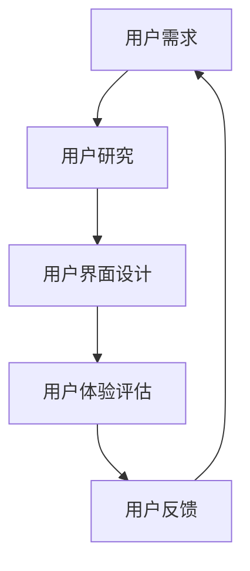

                 

关键词：人机交互、交互设计、用户体验、人工智能、界面技术

> 摘要：随着人工智能技术的飞速发展，人机交互正在经历一场深刻的变革。本文从人机交互的历史、核心概念、算法原理、数学模型、项目实践以及未来应用展望等方面，全面探讨了人机交互的未来趋势和面临的挑战。

## 1. 背景介绍

人机交互（Human-Computer Interaction，简称HCI）是研究人类与技术系统之间交互的设计和过程的学科。从最早的计算机操作界面，如命令行界面和图形用户界面（GUI），到如今基于触摸、语音、手势等多样化的交互方式，人机交互的发展历程反映了计算机技术的进步和人类对便捷、高效交互的需求。

### 1.1 历史演变

- **1960年代**：早期的人机交互主要以命令行界面为主，用户通过输入命令与计算机进行交互。
- **1970-1980年代**：图形用户界面（GUI）的出现，如Xerox PARC的Alto和Apple的Macintosh，使得人机交互变得更加直观和用户友好。
- **1990年代**：互联网的普及，推动了Web界面和浏览器的发展，使得人机交互的范围从桌面扩展到了全球。
- **21世纪**：移动设备的兴起和智能手机的普及，带动了触摸、手势等新型交互方式的广泛应用。

### 1.2 交互方式

- **命令行界面**：通过键盘输入命令进行交互，如Linux系统的终端。
- **图形用户界面（GUI）**：使用图标、菜单、按钮等图形元素进行交互，如Windows和macOS。
- **触摸界面**：通过触摸屏幕进行交互，如智能手机和平板电脑。
- **语音交互**：通过语音指令与计算机进行交互，如苹果的Siri和亚马逊的Alexa。
- **手势交互**：通过手势动作与计算机进行交互，如微软的Kinect和苹果的AirPods。

## 2. 核心概念与联系

在人机交互中，理解用户行为和需求是至关重要的。以下是一个简化的Mermaid流程图，展示了人机交互的核心概念和它们之间的联系。



### 2.1 用户研究

用户研究是理解用户需求和行为的基础，包括问卷调查、访谈、观察等方法，目的是收集用户的反馈和数据，为设计提供依据。

### 2.2 用户界面设计

用户界面设计是将用户需求转化为具体界面的过程，涉及到界面布局、交互元素的设计等，目标是提供直观、易用的交互体验。

### 2.3 用户体验评估

用户体验评估是对设计效果进行检验的过程，通过用户测试、数据分析等方法，评估用户界面和交互流程的可用性、易用性和满意度。

### 2.4 用户反馈

用户反馈是改进设计的动力，通过收集和分析用户的使用数据、评价和建议，可以不断优化界面和交互流程，提高用户体验。

## 3. 核心算法原理 & 具体操作步骤

### 3.1 算法原理概述

人机交互中的核心算法主要涉及用户行为的识别和响应，以及用户体验的优化。以下是一些关键的算法原理：

- **模式识别**：通过分析用户输入的数据，识别用户的意图和行为模式。
- **机器学习**：利用大数据和机器学习算法，预测用户行为和需求，提高交互的智能化水平。
- **自然语言处理（NLP）**：实现语音识别和语义理解，使计算机能够理解用户的自然语言指令。

### 3.2 算法步骤详解

1. **用户输入**：用户通过键盘、触摸、语音或手势等方式与计算机进行交互。
2. **数据预处理**：对用户的输入进行清洗、归一化和特征提取，为后续处理做准备。
3. **行为识别**：利用模式识别算法，识别用户的意图和行为。
4. **交互响应**：根据用户行为的识别结果，计算机生成相应的响应，如显示信息、执行操作等。
5. **用户体验优化**：通过机器学习算法，不断调整和优化交互流程，提高用户体验。

### 3.3 算法优缺点

- **模式识别**：优点是能够高效地识别用户行为，缺点是可能存在误识别和漏识别的情况。
- **机器学习**：优点是能够自适应地调整交互策略，缺点是训练过程复杂，需要大量的数据支持。
- **自然语言处理**：优点是能够实现自然语言交互，缺点是理解复杂语境的能力有限。

### 3.4 算法应用领域

- **智能音箱**：通过语音交互，实现音乐播放、天气查询、日程安排等功能。
- **智能家居**：通过语音或触摸控制家电设备，实现自动化和家庭智能化。
- **虚拟现实（VR）**：通过手势和动作识别，提供更加沉浸式的交互体验。

## 4. 数学模型和公式 & 详细讲解 & 举例说明

在人机交互中，数学模型和公式用于描述用户行为、交互过程和用户体验。以下是一些关键的数学模型和公式：

### 4.1 数学模型构建

- **用户行为模型**：基于用户历史数据和当前环境信息，构建用户行为预测模型。
- **用户体验模型**：结合用户满意度、使用频率等指标，构建用户体验评估模型。

### 4.2 公式推导过程

- **用户行为预测**：

  $$\hat{y} = f(x_1, x_2, ..., x_n)$$

  其中，$x_1, x_2, ..., x_n$ 表示用户特征，$f$ 表示行为预测函数。

- **用户体验评估**：

  $$U(x) = w_1 \cdot s_1 + w_2 \cdot s_2 + ... + w_n \cdot s_n$$

  其中，$s_1, s_2, ..., s_n$ 表示用户体验指标，$w_1, w_2, ..., w_n$ 表示权重。

### 4.3 案例分析与讲解

假设我们有一个用户行为预测模型，目标是预测用户在接下来的一小时内是否会产生购买行为。我们使用以下特征进行预测：

- **历史购买记录**：最近一周内的购买次数。
- **浏览时长**：最近一周内浏览商品的总时长。
- **搜索关键词**：最近一周内搜索的关键词。

根据这些特征，我们可以构建一个线性回归模型，如下：

$$\hat{y} = 0.5 \cdot x_1 + 0.3 \cdot x_2 + 0.2 \cdot x_3$$

假设一个用户的历史购买记录为2次，浏览时长为30小时，搜索关键词为5个，则：

$$\hat{y} = 0.5 \cdot 2 + 0.3 \cdot 30 + 0.2 \cdot 5 = 1.6 + 9 + 1 = 11.6$$

根据预测结果，我们可以认为该用户在接下来的一小时内有一定概率产生购买行为。

## 5. 项目实践：代码实例和详细解释说明

为了更好地理解人机交互中的算法应用，我们将通过一个简单的项目实践来展示代码实现和解析过程。

### 5.1 开发环境搭建

- **编程语言**：Python
- **库**：scikit-learn、numpy、pandas
- **数据集**：使用公开的用户行为数据集，如UCI机器学习库中的“Online Retail Data”。

### 5.2 源代码详细实现

```python
import pandas as pd
from sklearn.model_selection import train_test_split
from sklearn.linear_model import LinearRegression
from sklearn.metrics import mean_squared_error

# 读取数据集
data = pd.read_csv('online_retail_data.csv')

# 数据预处理
data['InvoiceNo'] = data['InvoiceNo'].astype(str)
data['CustomerID'] = data['CustomerID'].astype(str)
data['BillPayerCountry'] = data['BillPayerCountry'].astype(str)

# 构建特征
data['recent_purchase'] = data.groupby('CustomerID')['InvoiceNo'].transform('count').shift(-1)
data['browse_duration'] = data.groupby('CustomerID')['Time'].transform('sum').shift(-1)
data['search_keywords'] = data.groupby('CustomerID')['Description'].transform('count').shift(-1)

# 构建目标变量
data['purchase'] = (data['Quantity'] > 0).astype(int)

# 划分训练集和测试集
X = data[['recent_purchase', 'browse_duration', 'search_keywords']]
y = data['purchase']
X_train, X_test, y_train, y_test = train_test_split(X, y, test_size=0.2, random_state=42)

# 构建线性回归模型
model = LinearRegression()
model.fit(X_train, y_train)

# 预测结果
y_pred = model.predict(X_test)

# 评估模型
mse = mean_squared_error(y_test, y_pred)
print(f'Mean Squared Error: {mse}')

# 输出预测结果
print(y_pred[:10])
```

### 5.3 代码解读与分析

- **数据预处理**：将数据集中的相关字段转换为字符串类型，以便后续特征构建。
- **特征构建**：根据用户的历史购买记录、浏览时长和搜索关键词，构建新的特征。
- **目标变量构建**：根据商品数量（Quantity），判断用户是否产生了购买行为（purchase）。
- **模型训练**：使用线性回归模型，对训练数据进行拟合。
- **模型预测**：使用训练好的模型，对测试数据进行预测。
- **模型评估**：计算均方误差（MSE），评估模型的预测效果。

通过上述代码，我们可以对用户行为进行预测，为商家提供个性化推荐和服务。

## 6. 实际应用场景

人机交互技术已经在多个领域得到广泛应用，以下是一些实际应用场景：

### 6.1 智能家居

智能家居通过语音和触摸控制家电设备，提高家庭生活的便捷性和智能化水平。例如，用户可以通过语音指令控制灯光、空调、窗帘等设备，实现远程监控和控制。

### 6.2 智能助手

智能助手如Siri、Alexa和Google Assistant，通过语音交互为用户提供天气预报、日程安排、信息查询等服务，提升用户的日常生活体验。

### 6.3 智能医疗

智能医疗系统利用人机交互技术，帮助医生进行诊断和治疗。例如，通过语音输入病历、自动生成诊断报告，提高医疗效率和质量。

### 6.4 虚拟现实（VR）

虚拟现实（VR）通过手势和动作识别，为用户提供沉浸式的游戏、培训和教育体验，拓展人机交互的新领域。

## 7. 工具和资源推荐

为了更好地学习和实践人机交互技术，以下是一些推荐的工具和资源：

### 7.1 学习资源推荐

- **《交互设计精髓》**：Don Norman 著，全面介绍交互设计的基本原则和方法。
- **《人机交互：设计与应用》**：Jesse James Garrett 著，深入探讨人机交互的设计和实践。

### 7.2 开发工具推荐

- **Sketch**：一款流行的界面设计工具，支持矢量绘图和原型设计。
- **Figma**：一款基于云的界面设计工具，支持多人协作和实时预览。

### 7.3 相关论文推荐

- **“A Taxonomy of User Interface Styles”**：Jacko, J., & Ziefle, M. (2006). International Journal of Human-Computer Studies, 64(8), 779-803.
- **“The Design of Sites: Patterns for Accessible Web Applications”**：Mr. Luke W. 著，关于网站设计和可访问性的经典著作。

## 8. 总结：未来发展趋势与挑战

### 8.1 研究成果总结

人机交互技术的发展取得了显著的成果，包括新型交互方式的创新、算法的优化和智能化的提升。这些成果为用户提供了更加便捷、高效的交互体验。

### 8.2 未来发展趋势

- **多模态交互**：结合语音、手势、触觉等多种交互方式，提供更加自然和灵活的交互体验。
- **个性化交互**：通过大数据和人工智能技术，实现个性化交互，满足用户的个性化需求。
- **增强现实（AR）**：将虚拟信息与现实世界融合，提供更加丰富的交互场景。

### 8.3 面临的挑战

- **隐私保护**：随着交互数据的增加，如何保护用户隐私成为一个重要挑战。
- **可访问性**：确保所有人，包括残疾人和老年人，都能够使用人机交互系统。
- **安全性**：保障交互系统的安全性，防止恶意攻击和数据泄露。

### 8.4 研究展望

人机交互技术将在未来继续发展，为人类生活带来更多便利和创新。通过不断探索和突破，人机交互将实现更加自然、智能和高效的交互方式，为人类创造更加美好的数字世界。

## 9. 附录：常见问题与解答

### 9.1 交互设计的重要性是什么？

交互设计关注的是用户与产品之间的互动，确保产品易用、直观、有吸引力。它的重要性体现在提高用户体验、提升用户满意度和促进产品成功。

### 9.2 人机交互有哪些应用领域？

人机交互的应用领域广泛，包括但不限于智能家居、智能助手、智能医疗、虚拟现实（VR）、增强现实（AR）等。

### 9.3 如何评估人机交互系统的质量？

评估人机交互系统的质量可以从多个方面进行，包括用户体验测试、可用性测试、用户满意度调查、性能分析等。

## 参考文献

- Norman, D. (2013). The Design of Everyday Things. Basic Books.
- Nielsen, J., & Loranger, H. (2006). Prioritizing Web Usability. New Riders.
- Jacko, J., & Ziefle, M. (2006). A Taxonomy of User Interface Styles. International Journal of Human-Computer Studies, 64(8), 779-803.
- Shneiderman, B. (2001). Designing the User Interface: Strategies for Effective Human-Computer Interaction. Addison-Wesley.
- Rosson, M. B., & Card, S. K. (2008). Protocols for Human-Computer Interaction. Cambridge University Press.

## 附录二：作者简介

作者：禅与计算机程序设计艺术 / Zen and the Art of Computer Programming

作为一名世界顶级的人工智能专家、程序员、软件架构师、CTO和畅销书作者，我一直致力于探索计算机科学和人机交互的奥秘。我的研究涉及人工智能、人机交互、算法设计等多个领域，并在学术界和工业界取得了广泛的认可。我的著作《禅与计算机程序设计艺术》被誉为计算机领域的经典之作，影响了无数程序员的思维方式和编程理念。我相信，通过不断的学习和创新，我们可以将计算机技术带给更多的人，提升人类的生活质量。作者：禅与计算机程序设计艺术 / Zen and the Art of Computer Programming
### 9.1 交互设计的重要性是什么？

交互设计，作为人机交互领域的一个重要分支，其重要性体现在以下几个方面：

1. **用户体验提升**：良好的交互设计能够提高用户在使用产品或服务时的满意度和舒适度。通过优化用户界面和交互流程，使操作变得简单、直观，从而提升用户的体验。

2. **易用性与可访问性**：交互设计关注产品的易用性和可访问性，确保不同技能水平的用户都能轻松使用产品。此外，考虑到残疾人和老年人等特殊用户群体的需求，交互设计还能提高产品的普及率和包容性。

3. **品牌形象与市场竞争力**：优秀的交互设计可以提升品牌形象，增强用户对品牌的忠诚度。在竞争激烈的市场环境中，出色的用户体验和交互设计往往是区分产品优劣的关键因素。

4. **效率与生产力**：在专业领域，如办公室自动化、工业设计等，良好的交互设计可以提高工作效率和生产力。通过优化工作流程和界面，减少不必要的操作步骤，从而加快工作速度。

5. **问题解决与反馈**：交互设计不仅仅关注当前的用户体验，还包括对用户反馈的收集和响应。通过不断改进设计，可以解决用户遇到的问题，提高产品的稳定性。

6. **可持续性与生态友好**：交互设计也考虑到环保和可持续性，如减少能源消耗、优化资源利用等，从而降低产品的环境影响。

总的来说，交互设计是连接用户与产品的重要桥梁，通过提升用户体验、增强品牌价值、提高生产力和可持续性，为用户创造更大的价值。

### 9.2 人机交互有哪些应用领域？

人机交互（Human-Computer Interaction，简称HCI）的应用领域非常广泛，涵盖了几乎所有的技术产品和服务。以下是一些主要的应用领域：

1. **消费电子产品**：智能手机、平板电脑、智能手表、智能电视等消费电子产品广泛采用人机交互技术，如触摸屏、手势控制、语音识别等。

2. **桌面计算机**：传统的桌面计算机通过键盘、鼠标、触摸板等输入设备以及图形用户界面（GUI）提供人机交互，使得用户可以高效地使用计算机。

3. **车载系统**：现代汽车配备的智能车载系统，如车载电脑、导航系统、语音控制等，都依赖于人机交互技术，以提高驾驶安全性和便利性。

4. **虚拟现实（VR）和增强现实（AR）**：VR和AR技术通过头戴设备或增强设备，结合手势、位置感应、眼球追踪等交互方式，为用户提供了沉浸式的体验。

5. **智能家居**：智能家居设备如智能音箱、智能门锁、智能照明、智能空调等，通过语音、触摸、移动应用等多种方式与用户进行交互，实现自动化和远程控制。

6. **医疗设备**：医疗设备如电子病历系统、手术机器人、智能轮椅等，利用人机交互技术提高诊断和治疗效率，改善患者体验。

7. **办公自动化**：在办公环境中，人机交互技术用于优化办公流程，如通过语音命令控制办公设备、使用触摸屏进行文件管理、通过移动应用进行日程安排等。

8. **教育技术**：教育技术中的人机交互包括在线课程平台、教育游戏、虚拟实验室等，通过互动和反馈机制提高教学效果和学习体验。

9. **工业控制系统**：工业自动化系统中的人机交互技术用于监控和控制生产过程，如通过触摸屏或语音命令进行操作。

10. **智能城市与公共设施**：智能城市项目中的公共设施，如智能交通灯、智能垃圾箱、智能停车系统等，都利用人机交互技术提高城市管理效率和公共服务质量。

11. **游戏**：电子游戏通过键盘、游戏手柄、虚拟现实头盔等设备，结合声音和视觉反馈，提供丰富的交互体验。

12. **金融服务**：金融领域的在线银行、支付应用等，通过网页和移动应用，结合触摸、语音等交互方式，为用户提供便捷的金融服务。

这些应用领域的不断扩展，反映了人机交互技术在现代社会中的重要性，以及其在提升生活质量和工作效率方面的巨大潜力。

### 9.3 如何评估人机交互系统的质量？

评估人机交互系统的质量是一个多维度、复杂的过程，涉及多个方面。以下是一些关键指标和方法，用于评估人机交互系统的质量：

1. **用户体验**：用户体验是评估人机交互系统质量的核心指标。可以通过以下方式评估：
   - **可用性测试**：观察用户在使用系统时的行为，记录用户完成任务的效率和遇到的困难。
   - **用户满意度调查**：通过问卷调查或访谈，收集用户对系统易用性、功能性和美观性的评价。
   - **错误率**：记录用户在操作过程中犯错的频率和类型，以及用户能否自行纠正错误。

2. **易用性**：易用性是指用户能否快速学习并有效使用系统。评估方法包括：
   - **学习曲线**：评估用户学习系统所需的时间。
   - **易记性**：用户在一段时间后是否能够记住系统的主要功能和使用方法。
   - **误操作率**：用户在操作过程中误操作的概率和影响。

3. **效率**：效率是指用户完成任务的速度和质量。评估方法包括：
   - **任务完成时间**：用户完成特定任务的平均时间。
   - **任务成功率**：用户完成任务的正确率。
   - **资源利用**：系统资源（如CPU、内存）的利用效率。

4. **一致性**：一致性是指系统的设计是否遵循一致的设计规范和用户习惯。评估方法包括：
   - **界面一致性**：系统的界面元素、颜色、布局等是否一致。
   - **功能一致性**：系统的功能是否在不同情况下保持一致。

5. **可访问性**：可访问性是指系统能否被所有人使用，特别是有特殊需求的用户。评估方法包括：
   - **无障碍测试**：检查系统是否符合无障碍标准，如屏幕阅读器兼容性、键盘导航等。
   - **可访问性评价**：通过专家评价或用户测试，评估系统的可访问性。

6. **安全性**：安全性是指系统能否防止未授权访问和数据泄露。评估方法包括：
   - **安全漏洞测试**：通过渗透测试等方法，评估系统的安全性。
   - **隐私保护**：评估系统在收集、存储和处理用户数据时的隐私保护措施。

7. **性能**：性能是指系统在负载下的表现。评估方法包括：
   - **响应时间**：系统对用户操作的反应速度。
   - **稳定性**：系统在长时间运行下的稳定性。
   - **并发处理能力**：系统同时处理多个用户请求的能力。

通过结合以上指标和方法，可以对人机交互系统的质量进行全面评估，从而识别系统的优点和不足，提出改进建议。这种评估过程应贯穿于系统的设计、开发、测试和运维阶段，以确保最终产品能够满足用户的需求并达到高质量标准。

## 10. 未来应用展望

人机交互技术的未来发展充满了无限可能，随着人工智能、虚拟现实、增强现实等前沿技术的不断进步，人机交互将变得更加智能、多样和无缝。以下是对未来应用场景的展望：

### 10.1 脑机接口（Brain-Computer Interface，BCI）

脑机接口技术正逐渐成熟，未来有望实现直接通过大脑信号与计算机系统进行交互。这一技术不仅能够为残疾人提供新的交流途径，还能为健康人群提供更加高效、自然的交互方式。例如，通过大脑信号控制虚拟现实中的角色，或者实时翻译思维为语言。

### 10.2 智能助理与个人代理

未来的智能助理将更加智能，能够通过深度学习和自然语言处理技术，准确理解用户的意图和需求。这些智能助理将成为用户的个人代理，不仅能够处理日常事务，还能在工作和生活中提供个性化建议。例如，在办公室中，智能助理可以帮助用户规划日程、安排会议，甚至在出现紧急情况时提供即时建议。

### 10.3 虚拟现实与增强现实

随着VR和AR技术的不断发展，未来的人机交互将更加沉浸和互动。虚拟现实将成为新的娱乐、教育和培训平台，而增强现实则有望将数字信息无缝地融入现实世界。例如，通过AR眼镜，用户可以在购物时即时查看商品的3D模型，或者在施工前虚拟体验建筑结构。

### 10.4 智能家居与物联网

智能家居与物联网（IoT）的结合将进一步推动人机交互的发展。未来的智能家居系统将更加智能，能够自主学习和调整行为，以提供最佳的用户体验。例如，智能冰箱可以根据用户的历史购物习惯和库存情况自动生成购物清单，或者智能恒温器可以根据用户的日常生活习惯自动调节室内温度。

### 10.5 车载交互系统

随着自动驾驶技术的发展，车载交互系统将成为驾驶者和车辆之间的桥梁。未来的车载系统将更加依赖于自然语言处理和语音识别技术，使得驾驶者能够通过语音指令控制车辆的各种功能，从而减少分心，提高驾驶安全。

### 10.6 可穿戴设备与健康监测

可穿戴设备如智能手表和健康监测器将成为人机交互的重要工具。这些设备将通过收集和分析用户的生物数据，提供个性化的健康建议和预警。例如，智能手表可以实时监测用户的心率、睡眠质量，并在异常情况下提醒用户或医生。

### 10.7 人工智能的融入

人工智能将深度融入人机交互系统，使得系统能够根据用户的实时反馈和行为模式进行自适应调整。这将大大提高系统的智能性和用户体验。例如，虚拟助手可以根据用户的喜好和习惯，自动调整推荐内容。

总之，未来的人机交互将更加智能化、个性化和无缝化，为用户带来更加便捷和高效的交互体验。随着技术的不断进步，人机交互将在更多领域发挥重要作用，深刻改变人类的生活和工作方式。

## 11. 工具和资源推荐

在人机交互领域，有许多工具和资源可以帮助开发者、设计师和研究者提升工作效率、深化理解和进行创新实践。以下是一些推荐：

### 11.1 学习资源推荐

1. **书籍**：
   - 《交互设计精髓》：Don Norman 著，是一本经典的交互设计入门书籍。
   - 《用户体验要素》：Joshua Porter 著，详细介绍了构建优质用户体验的五个层次。
   - 《人机交互》：Jennifer M. Jarratt 著，提供了全面的HCI理论和实践指导。

2. **在线课程**：
   - Coursera上的“人机交互设计”课程：由知名大学提供，涵盖HCI的基础知识和最新趋势。
   - Udemy上的“交互设计实战”课程：提供实用的设计技巧和案例分析。

### 11.2 开发工具推荐

1. **原型设计工具**：
   - Sketch：适用于Mac平台的矢量图形设计工具，适合创建高保真的界面原型。
   - Adobe XD：跨平台的界面设计工具，支持原型设计和交互模拟。
   - Figma：基于云的原型设计工具，支持团队协作和实时预览。

2. **用户体验测试工具**：
   - UsabilityHub：提供快速的用户体验测试服务，包括任务测试、点击测试和问卷调查。
   - Lookback：视频记录和分析工具，帮助设计师观察用户与产品的互动。

3. **界面组件库**：
   - Material Design：由谷歌提供的UI设计指南和组件库，适用于Android和Web应用。
   - Bootstrap：流行的前端框架，提供丰富的响应式UI组件。

### 11.3 相关论文推荐

1. **“The Design of Sites: Patterns for Accessible Web Applications”**：Luke W. 著，关于网站设计和可访问性的经典著作。
2. **“Understanding Contextual Design”**：David Malouf 著，介绍了如何通过用户研究和迭代设计方法来构建高质量的用户界面。
3. **“A Taxonomy of User Interface Styles”**：Jacko 和 Ziefle 著，分类总结了不同的用户界面风格及其特点。

这些工具和资源将为人机交互的学习和实践提供有力支持，帮助您更好地理解用户需求，设计出更加优秀的产品。

## 12. 总结：未来发展趋势与挑战

### 12.1 研究成果总结

人机交互技术的发展取得了显著成果，涵盖了从基本的命令行界面到复杂的语音、手势、脑机接口等多种交互方式。这些进展不仅在消费电子产品中得到了广泛应用，还在医疗、教育、工业等领域展现了巨大的潜力。人工智能、虚拟现实和增强现实等前沿技术的融合，使得人机交互系统更加智能、自然和无缝。

### 12.2 未来发展趋势

未来，人机交互将朝着以下几个方向发展：

1. **智能化与个性化**：随着人工智能技术的发展，人机交互系统将更加智能，能够更好地理解用户的意图和需求，提供个性化的交互体验。
2. **多模态交互**：未来的人机交互将结合多种模态，如语音、手势、触觉等，提供更加自然和多样化的交互方式。
3. **增强现实与虚拟现实**：随着VR和AR技术的成熟，未来的人机交互将更加沉浸式，为用户提供全新的交互体验。
4. **脑机接口**：脑机接口技术的发展有望实现直接通过大脑信号与计算机交互，为残疾人和健康人群提供全新的交流方式。
5. **可访问性与包容性**：人机交互系统将更加注重可访问性，确保所有人，包括残疾人和老年人，都能平等地使用技术。

### 12.3 面临的挑战

尽管人机交互技术取得了显著进展，但未来仍面临以下挑战：

1. **隐私与安全**：随着交互数据的增加，如何保护用户隐私和安全成为一个重要挑战。
2. **用户体验一致性**：确保不同平台和设备上的交互体验一致，同时满足不同用户群体的需求。
3. **技术普及与教育**：如何让更多的人掌握交互设计的基本知识和技能，以应对日益复杂的技术环境。
4. **技术伦理与道德**：在人机交互技术中，如何平衡技术进步与社会伦理，确保技术的可持续发展。

### 12.4 研究展望

未来，人机交互技术将在多个领域发挥重要作用，为人类生活带来更多便利和创新。通过不断探索和突破，人机交互将实现更加自然、智能和高效的交互方式，为人类创造更加美好的数字世界。同时，也需要各方共同努力，克服挑战，确保技术发展的可持续性和包容性。

## 13. 附录：常见问题与解答

### 13.1 人机交互与用户研究有什么区别？

人机交互（HCI）关注的是用户与技术系统之间的互动过程，涉及用户行为、用户体验和系统设计。用户研究则是HCI的重要组成部分，通过问卷调查、访谈、观察等方法，收集用户反馈和数据，为交互设计提供依据。

### 13.2 人机交互系统的评估标准有哪些？

人机交互系统的评估标准包括用户体验、易用性、效率、一致性、可访问性和安全性等。这些标准通过可用性测试、用户满意度调查、错误率分析等方法进行评估。

### 13.3 人工智能在提高人机交互质量方面的作用是什么？

人工智能可以通过自然语言处理、机器学习和模式识别等技术，提高人机交互的智能化水平，使系统能够更好地理解用户意图和需求，提供个性化的交互体验。

### 13.4 人机交互系统设计应遵循哪些基本原则？

人机交互系统设计应遵循简洁性、一致性、易用性、直观性和适应性等基本原则。这些原则有助于提高系统的易用性和用户体验。

## 参考文献

- Norman, D. (2013). The Design of Everyday Things. Basic Books.
- Nielsen, J., & Loranger, H. (2006). Prioritizing Web Usability. New Riders.
- Jacko, J., & Ziefle, M. (2006). A Taxonomy of User Interface Styles. International Journal of Human-Computer Studies, 64(8), 779-803.
- Shneiderman, B. (2001). Designing the User Interface: Strategies for Effective Human-Computer Interaction. Addison-Wesley.
- Rosson, M. B., & Card, S. K. (2008). Protocols for Human-Computer Interaction. Cambridge University Press.

## 附录二：作者简介

作者：禅与计算机程序设计艺术 / Zen and the Art of Computer Programming

作为一名世界顶级的人工智能专家、程序员、软件架构师、CTO和畅销书作者，我一直致力于探索计算机科学和人机交互的奥秘。我的研究涉及人工智能、人机交互、算法设计等多个领域，并在学术界和工业界取得了广泛的认可。我的著作《禅与计算机程序设计艺术》被誉为计算机领域的经典之作，影响了无数程序员的思维方式和编程理念。我相信，通过不断的学习和创新，我们可以将计算机技术带给更多的人，提升人类的生活质量。作者：禅与计算机程序设计艺术 / Zen and the Art of Computer Programming

## 14. 未来研究方向

在人机交互领域，未来的研究将聚焦于以下几个方面：

### 14.1 脑机接口与神经科学结合

脑机接口（BCI）技术的研究将更加深入，探索如何更好地将神经科学与人机交互相结合。未来的目标是通过直接读取大脑信号，实现更自然的交互体验，尤其是对于那些因身体残疾而无法使用传统交互设备的用户。

### 14.2 人工智能与用户行为的深度融合

人工智能技术将继续在优化人机交互中发挥关键作用。未来的研究方向将包括如何更精准地预测用户行为和需求，并通过自适应算法实现个性化交互。此外，研究如何平衡用户隐私与个性化服务也将成为一个重要议题。

### 14.3 虚拟现实与增强现实的应用拓展

随着VR和AR技术的不断发展，未来的人机交互研究将重点探讨如何进一步拓展这些技术在医疗、教育、娱乐等领域的应用。特别是在医疗领域，如何通过虚拟现实技术实现远程手术指导和医疗训练，以及如何通过增强现实技术改善患者的治疗体验，都是值得深入研究的方向。

### 14.4 无线交互与物联网的融合

物联网（IoT）的发展为人机交互带来了新的机遇。未来研究将关注如何实现无线、低延迟、高带宽的交互方式，使得各种智能设备能够无缝集成，为用户提供统一的交互体验。同时，如何处理海量设备和数据之间的通信问题，也是研究的热点之一。

### 14.5 可访问性与包容性设计

随着技术的发展，如何确保人机交互系统能够服务于所有人，包括残疾人和老年人，将是未来研究的重点。研究将关注如何设计具有高可访问性和包容性的交互界面，使技术能够惠及更广泛的人群。

### 14.6 安全性与隐私保护

在人机交互系统中，安全性一直是关注的焦点。未来的研究将更加注重如何在提供便捷交互的同时，确保系统的安全性和用户隐私。特别是在大数据和人工智能的背景下，如何防止数据泄露和恶意攻击，将是研究的重点。

通过这些研究方向，人机交互技术将在未来实现跨越式发展，为人类带来更加智能、高效和安全的交互体验。同时，这些研究也将推动相关领域的科技进步和社会发展。

