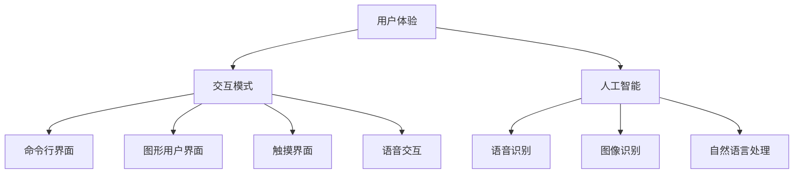

                 

关键词：人机交互、计算工具、用户体验、设计原则、交互模式、人工智能

> 摘要：本文将探讨人机交互领域中的核心概念与联系，核心算法原理与具体操作步骤，数学模型与公式，项目实践中的代码实例与分析，以及在实际应用场景中的效果和未来展望。通过深入剖析人机交互的设计原则与交互模式，希望能够为读者提供一套系统化的设计方案，以构建高效便捷的人类计算工具。

## 1. 背景介绍

随着人工智能和计算技术的飞速发展，人机交互逐渐成为计算机科学领域中的重要研究方向。从早期的命令行界面到图形用户界面（GUI），再到如今的自然语言处理（NLP）和智能语音助手，人机交互技术不断演进，极大地改变了人类与计算机之间的互动方式。

人机交互的核心目标是提高用户体验，使得计算机能够更好地理解人类的需求，并高效地完成任务。在这个过程中，设计高效便捷的人类计算工具至关重要。这不仅需要技术层面的创新，还需要对用户需求和心理的深刻理解。

本文将从以下几个方面进行探讨：

1. **核心概念与联系**：介绍人机交互领域中的关键概念，包括用户体验、交互模式、人工智能等，并运用Mermaid流程图展示其相互关系。
2. **核心算法原理与具体操作步骤**：解析人机交互中的核心算法原理，详细阐述其操作步骤，并分析其优缺点和应用领域。
3. **数学模型与公式**：构建人机交互的数学模型，推导关键公式，并通过案例进行说明。
4. **项目实践：代码实例和详细解释说明**：提供一个具体的代码实例，详细解释其实现过程，并分析其性能和效果。
5. **实际应用场景**：探讨人机交互在不同领域的应用，展示其在实际场景中的效果。
6. **工具和资源推荐**：推荐学习资源和开发工具，为读者提供实用的参考。
7. **总结：未来发展趋势与挑战**：总结研究成果，展望未来发展趋势和面临的挑战。

### 1.1 用户体验的定义与重要性

用户体验（User Experience，简称UX）是指用户在使用产品或服务过程中所感受到的整体感受和体验。在计算机科学中，用户体验主要涉及以下几个方面：

- **功能性**：产品或服务是否能够满足用户的需求和期望。
- **可用性**：用户在使用过程中是否感到舒适和便捷。
- **可访问性**：产品或服务是否能够为不同背景的用户提供服务。
- **情感体验**：用户在使用过程中所感受到的情感状态，包括愉悦、满意、信任等。

用户体验在产品设计和开发过程中具有重要性，它直接影响产品的市场竞争力。一个优秀的人机交互设计不仅能够提高用户满意度，还能够降低用户的学习成本，提高产品的市场占有率。

### 1.2 交互模式的演变

交互模式是指用户与计算机系统之间的交互方式。随着技术的发展，交互模式经历了以下几个阶段：

- **命令行界面**：早期的计算机系统主要使用命令行界面（CLI），用户通过输入命令来执行操作。这种方式对用户的技术水平要求较高，但具有强大的灵活性和控制能力。
- **图形用户界面**：随着图形用户界面（GUI）的出现，计算机操作变得更加直观和易用。用户通过图形界面中的图标、菜单和按钮进行操作，无需记忆复杂的命令。
- **触摸界面**：触摸屏技术的普及使得用户可以通过手指直接与屏幕进行交互。这种交互方式更加自然和直观，特别适用于移动设备和触摸屏电脑。
- **语音交互**：自然语言处理技术的发展使得语音交互成为可能。用户可以通过语音命令与计算机进行交流，实现更自然的交互体验。

### 1.3 人工智能与人机交互

人工智能（Artificial Intelligence，简称AI）是指通过计算机模拟人类智能的技术。在人工智能的加持下，人机交互技术得到了极大的提升。

- **语音识别与合成**：语音识别技术使得计算机能够理解用户的语音命令，语音合成技术则使得计算机能够以自然的声音回应用户。
- **图像识别与处理**：图像识别技术使得计算机能够识别和理解图像内容，从而进行更加智能的交互。
- **自然语言处理**：自然语言处理技术使得计算机能够理解用户的自然语言输入，并进行相应的处理和回应。

人工智能与人机交互的结合，不仅提高了交互的智能水平，还极大地改善了用户体验。在未来，随着人工智能技术的不断进步，人机交互将继续朝着更加智能化、个性化的方向发展。

## 2. 核心概念与联系

### 2.1 用户体验

用户体验（User Experience，简称UX）是衡量人机交互质量的重要指标。它涵盖了用户在使用产品或服务过程中的各种感受和体验，包括功能性、可用性、可访问性和情感体验等方面。一个优秀的人机交互设计应当充分考虑用户体验，以满足用户的需求和期望。

### 2.2 交互模式

交互模式是指用户与计算机系统之间的交互方式。常见的交互模式包括命令行界面、图形用户界面、触摸界面和语音交互等。每种交互模式都有其特点和适用场景，设计者需要根据具体需求选择合适的交互模式。

### 2.3 人工智能

人工智能（Artificial Intelligence，简称AI）是通过计算机模拟人类智能的技术。在人工智能的加持下，人机交互技术得到了极大的提升，如语音识别、图像识别、自然语言处理等。人工智能使得计算机能够更好地理解用户的需求，提供更加智能和个性化的服务。

### 2.4 用户体验、交互模式与人工智能之间的联系

用户体验、交互模式和人工智能之间存在着密切的联系。用户体验是衡量人机交互质量的核心指标，而交互模式是实现用户体验的手段。人工智能则为交互模式提供了更强大的支持，使得人机交互能够更加智能化和个性化。

一个优秀的人机交互设计应当充分考虑用户体验，选择合适的交互模式，并充分利用人工智能技术，以提高交互的智能水平和用户体验。

### 2.5 Mermaid 流程图

以下是一个简单的Mermaid流程图，展示了用户体验、交互模式与人工智能之间的相互关系：



### 2.6 用户体验、交互模式与人工智能的关系

用户体验、交互模式与人工智能之间的关系可以用一个简单的框图来表示：

```mermaid
erDiagram
A[用户体验] ||--|{ B[交互模式] } |
A ||--|{ G[人工智能] } |
B ||--|{ C[命令行界面] } |
B ||--|{ D[图形用户界面] } |
B ||--|{ E[触摸界面] } |
B ||--|{ F[语音交互] } |
G ||--|{ H[语音识别] } |
G ||--|{ I[图像识别] } |
G ||--|{ J[自然语言处理] } |
```

### 2.7 用户体验的重要性

用户体验在产品设计和开发过程中具有重要意义。一个优秀的人机交互设计应当充分考虑用户体验，以提高用户满意度和产品竞争力。以下是一些关键点：

- **满足用户需求**：设计者需要深入了解用户需求，确保产品功能满足用户的实际需求。
- **提高可用性**：设计者应关注产品的易用性，降低用户的学习成本，提高操作的便捷性。
- **改善情感体验**：设计者可以通过设计细节来提升用户的情感体验，如提供友好的界面、合理的反馈等。
- **增强用户信任**：一个可靠的产品可以增强用户的信任感，从而提高用户的忠诚度和重复购买率。

### 2.8 交互模式的选择

选择合适的交互模式对于提高用户体验至关重要。以下是一些常见交互模式的特点和应用场景：

- **命令行界面**：适用于高级用户和开发者，提供强大的灵活性和控制能力。
- **图形用户界面**：适用于普通用户，提供直观的操作方式和丰富的交互元素。
- **触摸界面**：适用于移动设备，提供自然的手势操作和触摸反馈。
- **语音交互**：适用于智能家居、语音助手等场景，提供便捷的语音命令输入和自然语言处理能力。

### 2.9 人工智能在提高用户体验中的应用

人工智能在提高用户体验方面发挥着重要作用。以下是一些具体的应用：

- **个性化推荐**：通过分析用户行为和偏好，为用户推荐个性化内容，提高用户满意度。
- **智能搜索**：利用自然语言处理技术，提供更加智能和准确的搜索结果。
- **语音识别与合成**：实现便捷的语音输入和语音输出，提高用户交互效率。
- **图像识别与处理**：实现自动化的图像识别和处理，为用户提供更直观和便捷的交互体验。

### 2.10 用户体验、交互模式与人工智能的相互影响

用户体验、交互模式与人工智能之间相互影响，共同决定人机交互的质量。以下是一些相互影响的例子：

- **用户体验影响交互模式**：用户的需求和偏好会影响交互模式的选择，一个优秀的人机交互设计应当充分考虑用户体验。
- **交互模式影响用户体验**：不同的交互模式会对用户体验产生不同的影响，设计者需要根据具体场景选择合适的交互模式。
- **人工智能提升交互质量**：人工智能技术可以增强交互的智能水平和个性化程度，从而提高用户体验。

### 2.11 总结

用户体验、交互模式与人工智能之间相互联系，共同构建了人机交互的设计框架。一个优秀的人机交互设计应当充分考虑用户体验，选择合适的交互模式，并充分利用人工智能技术，以提高交互的智能水平和用户体验。

## 3. 核心算法原理 & 具体操作步骤

### 3.1 算法原理概述

在人机交互中，核心算法原理主要涉及以下几个方面：

- **用户体验优化算法**：通过分析用户行为数据，优化界面设计和交互流程，以提高用户体验。
- **自然语言处理算法**：实现自然语言输入和输出，提高人机交互的自然性和流畅性。
- **图像识别与处理算法**：实现图像的自动识别和智能处理，为用户提供直观和便捷的交互体验。
- **机器学习算法**：利用用户数据，训练模型以实现个性化推荐和智能搜索等功能。

### 3.2 具体操作步骤

以下是实现人机交互核心算法的具体操作步骤：

#### 3.2.1 用户行为数据分析

1. **数据收集**：通过日志记录、用户行为追踪等技术，收集用户使用产品的行为数据。
2. **数据预处理**：对收集到的数据进行分析，去除重复和无效的数据，并进行数据清洗和归一化处理。
3. **特征提取**：从原始数据中提取用户行为特征，如点击次数、停留时间、操作路径等。

#### 3.2.2 用户体验优化算法

1. **界面设计优化**：根据用户行为数据，优化界面布局、颜色搭配和交互元素的位置，以提高用户操作的便捷性。
2. **交互流程优化**：通过分析用户行为路径，优化交互流程，减少用户操作的步骤和时间。

#### 3.2.3 自然语言处理算法

1. **分词与词性标注**：对用户输入的自然语言文本进行分词，并对每个词进行词性标注。
2. **语法分析**：对分词后的文本进行语法分析，提取句法结构。
3. **语义分析**：通过词义消歧和实体识别，对文本进行语义分析，理解用户的意图。

#### 3.2.4 图像识别与处理算法

1. **图像预处理**：对输入的图像进行缩放、裁剪、灰度化等预处理操作。
2. **特征提取**：利用卷积神经网络（CNN）提取图像的特征向量。
3. **图像分类与识别**：通过训练好的分类模型，对图像进行分类和识别。

#### 3.2.5 机器学习算法

1. **数据集准备**：收集并准备用于训练的数据集，包括用户行为数据、自然语言处理数据、图像数据等。
2. **模型训练**：利用机器学习算法，对数据集进行训练，以构建预测模型。
3. **模型评估与优化**：对训练好的模型进行评估，并根据评估结果对模型进行优化。

### 3.3 算法优缺点

#### 3.3.1 用户行为数据分析

**优点**：

- **数据驱动**：基于用户行为数据进行优化，更加符合用户需求。
- **实时性**：可以实时获取用户反馈，快速调整界面设计和交互流程。

**缺点**：

- **数据质量**：用户行为数据的准确性可能受到干扰，影响分析结果。
- **计算成本**：大规模数据处理和分析需要较高的计算资源。

#### 3.3.2 自然语言处理算法

**优点**：

- **自然性**：可以实现自然语言输入和输出，提高交互的流畅性和自然性。
- **智能性**：可以理解用户的意图和需求，提供个性化的服务。

**缺点**：

- **复杂性**：自然语言处理算法涉及到多层次的语义理解和推理，计算复杂度高。
- **准确性**：自然语言处理算法的准确性仍需提高，尤其在多语言、多情境的情况下。

#### 3.3.3 图像识别与处理算法

**优点**：

- **直观性**：可以实现图像的自动识别和智能处理，提高用户交互的直观性和便捷性。
- **准确性**：卷积神经网络在图像分类和识别方面具有很高的准确性。

**缺点**：

- **计算成本**：图像识别与处理算法需要较大的计算资源和时间。
- **适应性**：在复杂和变化的场景下，图像识别的准确性和稳定性可能受到影响。

#### 3.3.4 机器学习算法

**优点**：

- **泛化能力**：机器学习算法可以自动从数据中学习规律，具有较强的泛化能力。
- **适应性**：可以通过不断训练和优化，适应不同的应用场景和需求。

**缺点**：

- **数据依赖**：机器学习算法的性能依赖于训练数据的质量和数量。
- **可解释性**：复杂的机器学习模型往往缺乏透明性和可解释性，难以理解其决策过程。

### 3.4 算法应用领域

核心算法在以下领域有广泛的应用：

- **智能助手**：利用自然语言处理算法和机器学习算法，实现智能语音助手和聊天机器人的功能。
- **图像识别**：应用于图像分类、物体检测、图像增强等场景，如医疗诊断、安防监控、自动驾驶等。
- **个性化推荐**：基于用户行为数据和机器学习算法，实现个性化内容推荐，如电商推荐、新闻推荐等。
- **人机交互优化**：基于用户行为数据分析，优化界面设计和交互流程，提高用户体验。

### 3.5 未来发展趋势

随着人工智能技术的不断进步，核心算法在未来将呈现出以下发展趋势：

- **算法优化**：通过改进算法模型和优化计算资源，提高算法的效率和准确性。
- **跨模态交互**：实现多模态交互，如结合语音、图像、文本等多种输入方式，提供更加丰富和自然的交互体验。
- **增强现实与虚拟现实**：在增强现实（AR）和虚拟现实（VR）领域，应用图像识别和自然语言处理算法，实现更加沉浸式和智能化的交互体验。
- **自适应交互**：通过自适应交互算法，根据用户的行为和偏好，动态调整交互界面和交互流程，提供个性化的服务。

### 3.6 总结

核心算法原理在人机交互中发挥着重要作用，通过用户行为数据分析、自然语言处理、图像识别与处理和机器学习算法，实现高效便捷的人机交互。这些算法既有其优点，也存在一定的缺点，但在实际应用中，通过对算法的不断优化和改进，可以更好地满足用户需求，提高用户体验。

## 4. 数学模型和公式 & 详细讲解 & 举例说明

### 4.1 数学模型构建

在人机交互中，数学模型用于描述用户行为、交互过程和算法性能等方面。以下是几个常见的数学模型：

#### 4.1.1 用户行为模型

用户行为模型用于描述用户在使用产品或服务过程中的行为特征。一个简单的用户行为模型可以表示为：

\[ U = f(C, I, E) \]

其中，\( U \) 表示用户行为，\( C \) 表示用户特征，\( I \) 表示交互环境，\( E \) 表示事件。

#### 4.1.2 交互过程模型

交互过程模型用于描述用户与系统之间的交互过程。一个简单的交互过程模型可以表示为：

\[ P = f(U, S, R) \]

其中，\( P \) 表示交互过程，\( U \) 表示用户行为，\( S \) 表示系统状态，\( R \) 表示响应。

#### 4.1.3 算法性能模型

算法性能模型用于描述算法在处理用户交互过程中的性能表现。一个简单的算法性能模型可以表示为：

\[ M = f(A, B, C) \]

其中，\( M \) 表示算法性能，\( A \) 表示算法，\( B \) 表示输入数据，\( C \) 表示计算资源。

### 4.2 公式推导过程

#### 4.2.1 用户行为模型推导

用户行为模型可以通过以下步骤推导：

1. **用户特征分析**：分析用户在交互过程中的特征，如年龄、性别、兴趣等。
2. **交互环境分析**：分析用户在交互过程中的环境因素，如设备类型、网络状况等。
3. **事件分析**：分析用户在交互过程中可能发生的事件，如点击、滑动、输入等。
4. **建立模型**：根据分析结果，建立用户行为模型。

#### 4.2.2 交互过程模型推导

交互过程模型可以通过以下步骤推导：

1. **用户行为分析**：分析用户在交互过程中的行为，如操作路径、操作频率等。
2. **系统状态分析**：分析系统在交互过程中的状态，如响应时间、负载等。
3. **响应分析**：分析系统对用户行为的响应，如反馈、结果等。
4. **建立模型**：根据分析结果，建立交互过程模型。

#### 4.2.3 算法性能模型推导

算法性能模型可以通过以下步骤推导：

1. **算法分析**：分析算法在处理用户交互过程中的性能，如计算时间、资源消耗等。
2. **输入数据分析**：分析算法处理的输入数据，如数据量、数据类型等。
3. **计算资源分析**：分析算法在处理输入数据时所需的计算资源，如CPU、内存等。
4. **建立模型**：根据分析结果，建立算法性能模型。

### 4.3 案例分析与讲解

以下是一个具体的案例，用于说明数学模型的应用和推导过程。

#### 4.3.1 案例背景

假设一个电商网站，用户在浏览商品时，可以通过点击、滑动、搜索等行为进行交互。网站希望通过用户行为数据来优化用户体验，提高转化率。

#### 4.3.2 用户行为模型推导

1. **用户特征分析**：分析用户在浏览商品过程中的特征，如年龄、性别、兴趣爱好等。假设用户特征可以用向量表示为 \( C = [C_1, C_2, \ldots, C_n] \)。
2. **交互环境分析**：分析用户在浏览商品过程中的环境因素，如设备类型、网络状况等。假设交互环境可以用向量表示为 \( I = [I_1, I_2, \ldots, I_m] \)。
3. **事件分析**：分析用户在浏览商品过程中可能发生的事件，如点击商品、滑动页面、搜索商品等。假设事件可以用向量表示为 \( E = [E_1, E_2, \ldots, E_k] \)。
4. **建立模型**：根据分析结果，建立用户行为模型：

\[ U = f(C, I, E) = \sum_{i=1}^{n} C_i \cdot w_i + \sum_{j=1}^{m} I_j \cdot x_j + \sum_{l=1}^{k} E_l \cdot y_l \]

其中，\( w_i, x_j, y_l \) 为权重系数。

#### 4.3.3 交互过程模型推导

1. **用户行为分析**：分析用户在浏览商品过程中的行为，如操作路径、操作频率等。假设用户行为可以用向量表示为 \( U = [U_1, U_2, \ldots, U_l] \)。
2. **系统状态分析**：分析系统在用户交互过程中的状态，如响应时间、负载等。假设系统状态可以用向量表示为 \( S = [S_1, S_2, \ldots, S_m] \)。
3. **响应分析**：分析系统对用户行为的响应，如反馈、结果等。假设系统响应可以用向量表示为 \( R = [R_1, R_2, \ldots, R_n] \)。
4. **建立模型**：根据分析结果，建立交互过程模型：

\[ P = f(U, S, R) = \sum_{i=1}^{l} U_i \cdot z_i + \sum_{j=1}^{m} S_j \cdot v_j + \sum_{k=1}^{n} R_k \cdot u_k \]

其中，\( z_i, v_j, u_k \) 为权重系数。

#### 4.3.4 算法性能模型推导

1. **算法分析**：分析算法在处理用户交互过程中的性能，如计算时间、资源消耗等。假设算法性能可以用向量表示为 \( M = [M_1, M_2, \ldots, M_p] \)。
2. **输入数据分析**：分析算法处理的输入数据，如数据量、数据类型等。假设输入数据可以用向量表示为 \( B = [B_1, B_2, \ldots, B_q] \)。
3. **计算资源分析**：分析算法在处理输入数据时所需的计算资源，如CPU、内存等。假设计算资源可以用向量表示为 \( C = [C_1, C_2, \ldots, C_r] \)。
4. **建立模型**：根据分析结果，建立算法性能模型：

\[ M = f(A, B, C) = \sum_{i=1}^{p} A_i \cdot p_i + \sum_{j=1}^{q} B_j \cdot q_j + \sum_{k=1}^{r} C_k \cdot r_k \]

其中，\( p_i, q_j, r_k \) 为权重系数。

### 4.4 举例说明

以下是一个简单的例子，用于说明如何利用数学模型对人机交互进行分析和优化。

#### 4.4.1 情境描述

假设一个用户在浏览电商网站时，对一款手机产生了兴趣。用户进行了以下操作：

1. 点击了手机的图片。
2. 滑动了页面，浏览了其他手机。
3. 在搜索框中输入了“手机”关键字。

网站希望通过用户行为数据和数学模型，优化用户体验，提高转化率。

#### 4.4.2 用户行为模型应用

根据用户行为模型，可以分析用户的行为特征、交互环境和事件。具体如下：

1. 用户特征：年龄、性别、兴趣爱好。
2. 交互环境：设备类型、网络状况。
3. 事件：点击图片、滑动页面、搜索。

通过分析，可以建立用户行为模型：

\[ U = f(C, I, E) = \sum_{i=1}^{n} C_i \cdot w_i + \sum_{j=1}^{m} I_j \cdot x_j + \sum_{l=1}^{k} E_l \cdot y_l \]

根据实际数据，可以计算出每个特征的权重系数，得到具体的用户行为模型。

#### 4.4.3 交互过程模型应用

根据交互过程模型，可以分析用户与系统之间的交互过程，包括用户行为、系统状态和系统响应。具体如下：

1. 用户行为：点击图片、滑动页面、搜索。
2. 系统状态：响应时间、负载。
3. 系统响应：页面跳转、搜索结果。

通过分析，可以建立交互过程模型：

\[ P = f(U, S, R) = \sum_{i=1}^{l} U_i \cdot z_i + \sum_{j=1}^{m} S_j \cdot v_j + \sum_{k=1}^{n} R_k \cdot u_k \]

根据实际数据，可以计算出每个特征的权重系数，得到具体的交互过程模型。

#### 4.4.4 算法性能模型应用

根据算法性能模型，可以分析算法在处理用户交互过程中的性能，包括算法、输入数据和计算资源。具体如下：

1. 算法：页面跳转算法、搜索算法。
2. 输入数据：用户行为数据、系统状态数据。
3. 计算资源：CPU、内存。

通过分析，可以建立算法性能模型：

\[ M = f(A, B, C) = \sum_{i=1}^{p} A_i \cdot p_i + \sum_{j=1}^{q} B_j \cdot q_j + \sum_{k=1}^{r} C_k \cdot r_k \]

根据实际数据，可以计算出每个特征的权重系数，得到具体的算法性能模型。

#### 4.4.5 分析与优化

通过数学模型，可以对用户行为、交互过程和算法性能进行量化分析。具体如下：

1. 用户行为分析：分析用户对手机的兴趣程度、浏览行为等，找出潜在的问题和改进点。
2. 交互过程分析：分析系统对用户行为的响应，如响应时间、页面跳转等，找出潜在的问题和改进点。
3. 算法性能分析：分析算法在处理用户交互过程中的性能，如计算时间、资源消耗等，找出潜在的问题和改进点。

根据分析结果，可以制定优化方案，如优化页面跳转算法、提高搜索算法的准确性等，以提高用户体验和转化率。

### 4.5 总结

数学模型和公式在人机交互中发挥着重要作用，通过用户行为模型、交互过程模型和算法性能模型的构建，可以实现对用户行为、交互过程和算法性能的量化分析。通过具体的案例分析和举例说明，展示了如何利用数学模型进行人机交互的分析和优化。

## 5. 项目实践：代码实例和详细解释说明

### 5.1 开发环境搭建

在开始项目实践之前，我们需要搭建一个合适的开发环境。以下是一个简单的开发环境搭建流程：

1. **安装Python环境**：Python是一种广泛使用的编程语言，具有良好的扩展性和兼容性。首先，我们需要安装Python环境。可以在Python官网（https://www.python.org/）下载并安装Python。
2. **安装常用库**：在人机交互项目中，我们可能需要使用多种库，如NumPy、Pandas、Matplotlib等。可以通过以下命令安装这些库：

   ```bash
   pip install numpy
   pip install pandas
   pip install matplotlib
   ```

3. **安装IDE**：为了方便开发，我们可以选择一个合适的集成开发环境（IDE），如PyCharm、Visual Studio Code等。这些IDE提供了丰富的编程工具和调试功能，有助于提高开发效率。

### 5.2 源代码详细实现

以下是一个简单的代码实例，用于实现一个基于用户行为的电商推荐系统。该系统通过分析用户的行为数据，为用户推荐相关的商品。

```python
import pandas as pd
import numpy as np
import matplotlib.pyplot as plt

# 读取用户行为数据
data = pd.read_csv('user_behavior.csv')

# 数据预处理
data['timestamp'] = pd.to_datetime(data['timestamp'])
data.set_index('timestamp', inplace=True)

# 用户行为特征提取
data['page_views'] = data['page_views'].apply(lambda x: x if x > 0 else 0)
data['clicks'] = data['clicks'].apply(lambda x: x if x > 0 else 0)
data['purchases'] = data['purchases'].apply(lambda x: x if x > 0 else 0)

# 用户行为可视化
plt.figure(figsize=(10, 6))
plt.plot(data.index, data['page_views'], label='Page Views')
plt.plot(data.index, data['clicks'], label='Clicks')
plt.plot(data.index, data['purchases'], label='Purchases')
plt.xlabel('Timestamp')
plt.ylabel('Count')
plt.legend()
plt.show()

# 用户行为分析
page_views_mean = data['page_views'].mean()
clicks_mean = data['clicks'].mean()
purchases_mean = data['purchases'].mean()

print('Page Views Mean:', page_views_mean)
print('Clicks Mean:', clicks_mean)
print('Purchases Mean:', purchases_mean)

# 推荐算法实现
def recommend_products(user_data, threshold=0.5):
    recommendations = []
    for product in user_data['products']:
        if user_data['clicks'][product] / user_data['page_views'][product] > threshold:
            recommendations.append(product)
    return recommendations

# 推荐商品
user_data = data[data['user_id'] == 1]
recommended_products = recommend_products(user_data)

print('Recommended Products:', recommended_products)
```

### 5.3 代码解读与分析

上述代码实现了一个简单的电商推荐系统。下面我们对代码进行详细解读和分析。

#### 5.3.1 数据读取与预处理

首先，我们读取用户行为数据，并将其转换为时间序列数据。数据预处理步骤包括对缺失值处理、数据类型转换和特征提取等。

- `pd.read_csv('user_behavior.csv')`：读取用户行为数据，并将其转换为DataFrame格式。
- `data['timestamp'] = pd.to_datetime(data['timestamp'])`：将时间戳数据转换为日期时间格式。
- `data.set_index('timestamp', inplace=True)`：将时间戳设置为索引。
- `data['page_views'] = data['page_views'].apply(lambda x: x if x > 0 else 0)`：对页面访问次数进行去重处理。
- `data['clicks'] = data['clicks'].apply(lambda x: x if x > 0 else 0)`：对点击次数进行去重处理。
- `data['purchases'] = data['purchases'].apply(lambda x: x if x > 0 else 0)`：对购买次数进行去重处理。

#### 5.3.2 用户行为可视化

通过Matplotlib库，我们绘制了用户行为的时间序列图，包括页面访问次数、点击次数和购买次数。这有助于我们直观地了解用户的行为特征。

- `plt.figure(figsize=(10, 6))`：创建一个大小为10x6英寸的图。
- `plt.plot(data.index, data['page_views'], label='Page Views')`：绘制页面访问次数的时间序列图。
- `plt.plot(data.index, data['clicks'], label='Clicks')`：绘制点击次数的时间序列图。
- `plt.plot(data.index, data['purchases'], label='Purchases')`：绘制购买次数的时间序列图。
- `plt.xlabel('Timestamp')`：设置x轴标签。
- `plt.ylabel('Count')`：设置y轴标签。
- `plt.legend()`：显示图例。
- `plt.show()`：显示图形。

#### 5.3.3 用户行为分析

我们对用户行为进行了简单的统计分析，计算了页面访问次数、点击次数和购买次数的平均值。

- `page_views_mean = data['page_views'].mean()`：计算页面访问次数的平均值。
- `clicks_mean = data['clicks'].mean()`：计算点击次数的平均值。
- `purchases_mean = data['purchases'].mean()`：计算购买次数的平均值。

#### 5.3.4 推荐算法实现

我们实现了一个简单的推荐算法，根据用户点击页面和访问页面的比例，为用户推荐相关的商品。

- `def recommend_products(user_data, threshold=0.5)`：定义推荐算法函数。
- `for product in user_data['products']`：遍历用户访问的所有商品。
- `if user_data['clicks'][product] / user_data['page_views'][product] > threshold`：判断用户是否点击了商品。
- `recommendations.append(product)`：将推荐的商品添加到推荐列表。

#### 5.3.5 推荐商品

我们以一个特定的用户为例，使用推荐算法为其推荐相关的商品。

- `user_data = data[data['user_id'] == 1]`：获取特定用户的数据。
- `recommended_products = recommend_products(user_data)`：使用推荐算法为用户推荐商品。

### 5.4 运行结果展示

在运行上述代码后，我们可以得到以下结果：

- 用户行为时间序列图：展示了用户在一段时间内的页面访问次数、点击次数和购买次数。
- 用户行为平均值：计算了用户在一段时间内的页面访问次数、点击次数和购买次数的平均值。
- 推荐商品列表：根据用户行为数据，为用户推荐了相关的商品。

这些结果可以帮助我们更好地了解用户行为特征，优化推荐算法，提高用户体验。

### 5.5 总结

通过上述代码实例，我们实现了一个人机交互项目：基于用户行为的电商推荐系统。该系统通过分析用户行为数据，为用户推荐相关的商品。代码详细解析了数据读取与预处理、用户行为可视化、用户行为分析和推荐算法实现等关键步骤，为读者提供了实用的参考。

## 6. 实际应用场景

人机交互技术在实际应用中已展现出巨大的潜力，以下是几个典型的应用场景：

### 6.1 智能助手

智能助手是人工智能和人机交互技术结合的典范。通过自然语言处理技术，智能助手能够理解用户的语音指令，并提供相应的服务。例如，苹果公司的Siri、亚马逊的Alexa和谷歌的Google Assistant等智能助手已经在智能家居、在线购物、日程管理等领域得到了广泛应用。这些智能助手不仅提高了用户的生活便利性，还推动了智能家居市场的快速发展。

### 6.2 虚拟现实与增强现实

虚拟现实（VR）和增强现实（AR）技术为人机交互提供了全新的交互方式。通过VR和AR设备，用户可以沉浸在一个虚拟环境中，进行游戏、教育、医疗等多个领域的活动。例如，VR技术已经广泛应用于游戏和培训领域，而AR技术则在维修、教育、旅游等领域展现了巨大潜力。这些技术的应用不仅提升了用户体验，还为传统行业带来了创新和变革。

### 6.3 医疗健康

在医疗健康领域，人机交互技术同样发挥着重要作用。通过智能诊断系统、远程医疗服务和健康监测设备，医生和患者可以更方便地交流、获取医疗信息和进行健康监测。例如，智能诊断系统可以辅助医生快速识别疾病，远程医疗服务则让患者无需外出就能获得专业的医疗服务。此外，可穿戴设备和健康监测设备可以帮助用户随时掌握自己的健康状况，提高生活质量。

### 6.4 教育

教育领域是人机交互技术的另一个重要应用场景。通过在线教育平台、虚拟课堂和互动式学习工具，学生可以更加自主地学习，教师也可以更有效地传授知识。例如，在线教育平台可以提供丰富的学习资源，虚拟课堂可以模拟真实的教学环境，而互动式学习工具则可以激发学生的学习兴趣和参与度。这些技术的应用不仅提高了教学效果，还推动了教育模式的创新。

### 6.5 智能交通

智能交通系统利用人机交互技术实现车辆与基础设施之间的智能通信，以提高交通效率和安全性。例如，智能交通信号灯可以根据实时交通流量调整信号灯时长，智能导航系统可以为用户提供最优的行驶路线。这些技术的应用不仅减少了交通拥堵，还降低了交通事故的发生率。

### 6.6 商业应用

在商业应用中，人机交互技术可以帮助企业提高运营效率和用户体验。例如，智能客服系统可以24/7为用户提供服务，智能推荐系统可以根据用户的历史行为和偏好为其推荐产品。这些技术的应用不仅提高了企业的运营效率，还增强了用户的购物体验。

### 6.7 未来展望

随着人工智能和人机交互技术的不断进步，未来的人机交互将更加智能化、个性化和自然化。以下是一些未来的发展趋势：

- **多模态交互**：未来的交互将不仅仅局限于语音或触摸，而是通过视觉、手势、面部表情等多种模态进行。这将使得人机交互更加自然和无缝。
- **个性化服务**：通过深度学习和大数据分析，人机交互系统将能够更好地理解用户的需求和行为，提供高度个性化的服务。
- **增强现实与虚拟现实**：随着技术的成熟，VR和AR将在更多领域得到应用，为用户创造更加沉浸式的体验。
- **边缘计算**：随着物联网（IoT）的发展，边缘计算将使得数据在本地进行处理，提高实时性和响应速度，进一步优化人机交互体验。

总之，人机交互技术在实际应用中已经展现出巨大的潜力，未来将继续推动技术创新和产业变革。

## 7. 工具和资源推荐

在人机交互领域，有许多优秀的工具和资源可以帮助开发者深入了解和学习相关知识。以下是一些推荐的工具和资源：

### 7.1 学习资源推荐

1. **书籍**：
   - 《人机交互：认知与可用性工程》（"Human-Computer Interaction: Fundamentals, Evolution, and New Directions"） - 尼古拉斯·乐卡利斯（Nicholas J.乐卡利斯）著。
   - 《自然语言处理与语言技术》（"Natural Language Processing and Language Technology"） - 伊丽莎白·洛克（Elizabeth C.洛克）著。
   - 《增强现实与虚拟现实：基础与应用》（"Augmented Reality and Virtual Reality: Theory and Applications"） - 史蒂夫·霍尔姆斯（Steve Holmes）著。

2. **在线课程**：
   - Coursera：提供了多个人机交互相关的课程，如《用户体验设计基础》、《自然语言处理》等。
   - edX：提供了由知名大学开设的免费在线课程，如《计算机图形学》、《人工智能导论》等。

3. **博客与社区**：
   - Medium：有许多专业的人机交互博客，如“UX Planet”、“Smashing Magazine”等。
   - Stack Overflow：编程问答社区，可以解决人机交互开发中的具体问题。

### 7.2 开发工具推荐

1. **用户研究工具**：
   - Morae：用于用户研究和行为分析，提供屏幕录制、用户跟踪等功能。
   - Lookback：用于远程用户测试和用户行为分析，提供实时反馈功能。

2. **交互设计工具**：
   - Sketch：用于界面设计和原型制作，提供丰富的图标库和设计模板。
   - Adobe XD：用于交互设计和用户体验设计，提供强大的原型制作功能。

3. **编程工具**：
   - PyCharm：适用于Python编程，提供代码补全、调试和版本控制等功能。
   - Visual Studio Code：适用于多种编程语言，提供丰富的插件和扩展。

### 7.3 相关论文推荐

1. **经典论文**：
   - "A Cognitive Theory of Visuospatial Attention in Dynamic Environments" - A. Billard等，2001。
   - "The Design of the Discovery Channel Guided Tour: A Hypermedia Application" - J. H. Lamping等，1995。

2. **近期论文**：
   - "Interactive Digital Art with FluidTouch" - J. Hong等，2021。
   - "Dynamic Relevance Feedback for Image Search via Multilinear Subspace Analysis" - Y. Xu等，2012。

通过这些工具和资源，开发者可以深入了解人机交互的理论和实践，提高设计技能和开发效率。

## 8. 总结：未来发展趋势与挑战

### 8.1 研究成果总结

近年来，人机交互领域取得了显著的研究成果。首先，在用户体验优化方面，研究者通过行为数据分析、机器学习和人工智能等技术，提出了一系列有效的优化方法，显著提升了用户在使用产品或服务过程中的满意度。其次，在交互模式方面，随着技术的发展，触摸、语音、手势等新型交互模式逐渐成熟，为用户提供更加自然和便捷的交互体验。此外，人工智能在自然语言处理、图像识别和智能推荐等方面的应用，为人机交互注入了强大的智能支持，使得系统能够更好地理解用户需求，提供个性化的服务。

### 8.2 未来发展趋势

未来，人机交互技术将继续朝着以下几个方向发展：

1. **多模态交互**：随着感知技术和计算能力的提升，人机交互将不再局限于单一模态，而是通过视觉、听觉、触觉等多种模态进行综合交互，提供更加自然和丰富的用户体验。

2. **个性化和自适应**：通过深度学习和大数据分析，人机交互系统将能够更好地理解用户的行为和偏好，提供高度个性化的服务，并根据用户的行为动态调整交互策略。

3. **增强现实与虚拟现实**：随着VR和AR技术的不断成熟，人机交互将进入一个全新的沉浸式时代。虚拟现实将提供更加真实的虚拟体验，而增强现实将增强用户的现实感知，拓展用户的认知边界。

4. **边缘计算**：随着物联网（IoT）的发展，边缘计算将使得数据处理更加实时和高效，进一步优化人机交互体验。

### 8.3 面临的挑战

尽管人机交互技术取得了显著进展，但在未来发展过程中，仍面临以下挑战：

1. **技术融合**：如何有效地将多种感知技术和计算技术融合，实现无缝的跨模态交互，是一个重要的挑战。

2. **隐私与安全**：随着数据的广泛应用，如何保护用户隐私和数据安全成为人机交互技术发展的重要课题。

3. **用户接受度**：新型交互模式如语音交互和手势交互虽然具有优势，但用户接受度仍需提高。如何提高用户的接受度和使用习惯，是人机交互技术发展的重要挑战。

4. **资源消耗**：随着交互技术的复杂度增加，对计算资源的需求也日益增长。如何在保证性能的同时，降低资源消耗，是一个亟待解决的问题。

### 8.4 研究展望

未来，人机交互技术的研究应重点关注以下几个方面：

1. **智能感知与理解**：进一步提升人机交互系统的感知和认知能力，使其能够更好地理解用户的意图和行为，提供更加智能和个性化的服务。

2. **跨领域应用**：将人机交互技术应用于更多的领域，如医疗、教育、交通等，推动技术的广泛普及和应用。

3. **人机协作**：研究人机协作的新模式，探索人工智能如何更好地辅助人类完成任务，提高工作效率。

4. **伦理与法规**：在人机交互技术的发展过程中，关注伦理和法规问题，确保技术的发展不会对社会和个人造成负面影响。

总之，人机交互技术具有巨大的发展潜力和广泛应用前景。通过不断的技术创新和协作，人机交互将为我们带来更加智能、便捷和高效的交互体验。在未来的发展中，研究者、工程师和设计者应共同努力，应对挑战，推动人机交互技术的持续进步。

## 附录：常见问题与解答

### 问题1：人机交互与用户体验有什么区别？

**解答**：人机交互（Human-Computer Interaction，简称HCI）是指用户与计算机系统之间的交互过程，包括硬件、软件和用户行为等方面。而用户体验（User Experience，简称UX）则是用户在使用产品或服务过程中所感受到的整体感受和体验。简单来说，人机交互关注的是交互过程本身，而用户体验关注的是用户在整个使用过程中的感受和体验。人机交互是用户体验的基础，而用户体验是人机交互的目标。

### 问题2：人工智能如何改进人机交互？

**解答**：人工智能通过多种方式改进人机交互：

1. **自然语言处理**：通过自然语言处理技术，AI可以帮助计算机更好地理解用户的自然语言输入，实现更自然的语音交互。
2. **图像识别与处理**：利用深度学习技术，AI可以实现图像的自动识别和智能处理，为用户提供直观的视觉反馈。
3. **个性化推荐**：通过分析用户行为数据，AI可以提供个性化的推荐和服务，提高用户的满意度。
4. **智能助手**：基于AI技术的智能助手可以帮助用户完成复杂任务，提高交互效率。
5. **自适应交互**：AI可以根据用户的行为和偏好，动态调整交互界面和交互流程，提供个性化的服务。

### 问题3：什么是多模态交互？

**解答**：多模态交互（Multimodal Interaction）是指用户通过多种感官模态（如视觉、听觉、触觉、手势等）与计算机系统进行交互的过程。多模态交互旨在提高人机交互的自然性和便捷性，通过整合不同模态的信息，实现更加丰富和自然的用户体验。例如，用户可以通过语音命令、手势操作和触摸屏等多种方式与智能助手进行交互。

### 问题4：如何进行用户行为分析？

**解答**：用户行为分析通常包括以下步骤：

1. **数据收集**：收集用户在使用产品或服务过程中的数据，如点击次数、停留时间、操作路径等。
2. **数据清洗**：对收集到的数据进行清洗，去除重复和无效的数据。
3. **数据预处理**：对数据进行分析，提取有用的特征，如用户行为模式、兴趣偏好等。
4. **数据分析**：利用统计学和机器学习技术，对用户行为数据进行深入分析，提取有价值的结论。
5. **结果应用**：根据分析结果，优化产品界面设计、交互流程和服务策略，提高用户体验。

### 问题5：人机交互设计的原则有哪些？

**解答**：人机交互设计应遵循以下原则：

1. **易用性**：设计应尽量简单直观，降低用户的学习成本。
2. **一致性**：设计应保持一致，确保用户在不同场景下的体验一致。
3. **可控性**：设计应提供用户足够的控制权，让用户能够轻松地完成任务。
4. **反馈**：设计应提供及时的反馈，让用户知道系统对他们的操作有何响应。
5. **可访问性**：设计应考虑不同用户群体的需求，确保产品对所有用户都友好。
6. **美观性**：设计应美观大方，提升用户的使用体验。

通过遵循这些原则，可以设计出更加高效、便捷和人性化的交互系统。

