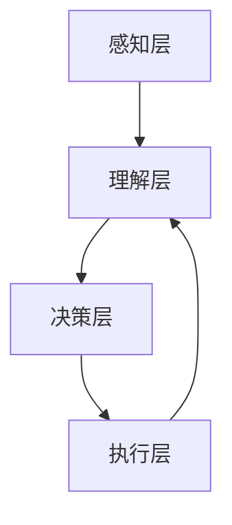

                 

关键词：人类-AI协作，智能增强，发展趋势，机遇挑战

> 摘要：本文深入探讨了人类与人工智能协作的发展趋势，分析了智能增强在各个领域的应用，讨论了其中的机遇与挑战，以及未来的发展方向。文章旨在为研究人员和实践者提供有价值的参考。

## 1. 背景介绍

在过去的几十年中，人工智能（AI）技术取得了飞速发展，已经从理论研究走向了实际应用。从最初的规则推理、模式识别，到现代的深度学习、强化学习，AI的能力得到了极大的提升。与此同时，人类对于智能化工具的需求也日益增长，无论是生产生活中的便利，还是科学研究的推进，AI都扮演着越来越重要的角色。

然而，人工智能并非替代人类，而是与人类协作，共同解决问题。这种协作不仅仅是技术上的互补，更是一种思维模式的转变。人类拥有创造力、情感和价值观，而AI则拥有强大的数据处理能力和高效的执行能力。二者的结合，可以带来前所未有的创新和突破。

## 2. 核心概念与联系

### 2.1 人工智能与人类智慧的关系

人工智能与人类智慧的关系可以看作是两种不同的系统之间的协同工作。人类智慧包含了感知、理解、推理、创造等多个方面，而人工智能则主要集中在数据处理和模式识别上。二者的结合，可以使得人类智慧得到增强，同时也能发挥AI的优势，实现更高效的决策和执行。

### 2.2 人工智能增强的架构

为了实现人类-AI协作，我们需要构建一个智能增强的架构。这个架构应该包括以下几个方面：

- **感知层**：收集外部环境的信息，包括文本、图像、声音等多种形式。
- **理解层**：对感知层收集的信息进行语义分析和理解，识别出关键信息。
- **决策层**：根据理解层的结果，进行决策和规划。
- **执行层**：执行决策层的计划，并通过反馈进行调整。

下面是一个简化的Mermaid流程图，描述了上述架构：



### 2.3 人类-AI协作的模式

人类-AI协作的模式可以分为两种：一种是辅助型协作，即AI辅助人类完成某些任务；另一种是协作型协作，即人类和AI共同完成一个任务。

在辅助型协作中，AI主要负责数据的处理和分析，为人类提供决策支持。例如，在医疗领域，AI可以帮助医生进行疾病诊断，提高诊断的准确率。

在协作型协作中，人类和AI共同承担任务的不同部分。例如，在科学研究领域，人类科学家可以提出假设，而AI则可以帮助进行实验设计和数据分析，从而加速科学研究的进程。

## 3. 核心算法原理 & 具体操作步骤

### 3.1 算法原理概述

人类-AI协作的核心算法主要包括以下几个方面：

- **增强学习**：通过不断尝试和反馈，让AI学会如何与人类协作。
- **自然语言处理**：使得AI能够理解人类的语言，进行有效的沟通和协作。
- **多模态数据融合**：将不同类型的数据（如文本、图像、声音等）进行融合，提高AI的理解能力。

### 3.2 算法步骤详解

1. **数据收集**：收集与协作任务相关的数据，包括文本、图像、声音等。
2. **预处理**：对收集到的数据进行预处理，包括去噪、特征提取等。
3. **模型训练**：使用预处理后的数据，训练AI模型，使其能够理解人类意图，并根据任务进行决策。
4. **协作执行**：人类和AI共同完成任务，并根据反馈进行调整。
5. **性能评估**：评估AI在协作任务中的表现，并根据评估结果进行优化。

### 3.3 算法优缺点

**优点**：

- 提高决策效率：通过AI的处理能力，可以快速分析大量数据，为人类提供决策支持。
- 减轻人类负担：AI可以承担一些重复性高、劳动强度大的任务，减轻人类的工作负担。
- 激发创新潜力：AI可以帮助人类发现新的问题，提供新的解决方案，激发人类的创新潜力。

**缺点**：

- 数据依赖性：AI的性能很大程度上取决于数据的质量和数量，数据不足或质量差会导致算法失效。
- 安全性问题：AI的决策过程可能包含敏感信息，如果被恶意利用，可能会造成严重后果。
- 道德和伦理问题：AI的决策是否符合人类的价值观和道德准则，这是一个需要深入探讨的问题。

### 3.4 算法应用领域

人类-AI协作算法可以应用于各个领域，如医疗、金融、教育、科研等。以下是一些具体的例子：

- **医疗领域**：AI可以帮助医生进行疾病诊断，提高诊断的准确率，同时也能减轻医生的负担。
- **金融领域**：AI可以协助金融分析师进行市场预测，提供投资建议，降低金融风险。
- **教育领域**：AI可以帮助教师进行个性化教学，提高学生的学习效果。
- **科研领域**：AI可以协助科学家进行实验设计和数据分析，加速科学研究的进程。

## 4. 数学模型和公式 & 详细讲解 & 举例说明

### 4.1 数学模型构建

在人类-AI协作中，常用的数学模型包括神经网络、决策树、支持向量机等。以下是神经网络模型的构建过程：

1. **输入层**：接收外部环境的输入信息。
2. **隐藏层**：对输入信息进行处理，提取特征。
3. **输出层**：根据处理结果进行决策。

神经网络的数学模型可以表示为：

$$
\begin{aligned}
h_{\text{hidden}} &= \sigma(W_{\text{input\_hidden}}x + b_{\text{hidden}}) \\
y &= \sigma(W_{\text{hidden\_output}}h_{\text{hidden}} + b_{\text{output}})
\end{aligned}
$$

其中，$W$ 是权重矩阵，$b$ 是偏置项，$\sigma$ 是激活函数。

### 4.2 公式推导过程

以神经网络为例，推导其反向传播算法的过程如下：

1. **前向传播**：计算输出层的输出值。

$$
y = \sigma(W_{\text{hidden\_output}}h_{\text{hidden}} + b_{\text{output}})
$$

2. **计算误差**：计算实际输出与期望输出之间的误差。

$$
\delta_{\text{output}} = \text{sigmoid}'(y) \cdot (y - t)
$$

3. **反向传播**：从输出层开始，逐层计算误差对每个权重的偏导数。

$$
\begin{aligned}
\delta_{\text{hidden}} &= \text{sigmoid}'(h_{\text{hidden}}) \cdot (W_{\text{hidden\_output}}^T \delta_{\text{output}}) \\
\delta_{\text{input\_hidden}} &= \text{sigmoid}'(x) \cdot (W_{\text{input\_hidden}}^T \delta_{\text{hidden}})
\end{aligned}
$$

4. **更新权重**：根据误差的偏导数，更新权重矩阵。

$$
\begin{aligned}
W_{\text{input\_hidden}} &= W_{\text{input\_hidden}} - \alpha \cdot \delta_{\text{input\_hidden}} \\
W_{\text{hidden\_output}} &= W_{\text{hidden\_output}} - \alpha \cdot \delta_{\text{output}}
\end{aligned}
$$

### 4.3 案例分析与讲解

假设我们有一个简单的神经网络，用于分类任务。输入层有3个神经元，隐藏层有2个神经元，输出层有1个神经元。训练数据集有100个样本。

1. **数据预处理**：对输入数据进行归一化处理，使得每个特征的值都在[0, 1]之间。

2. **模型初始化**：初始化权重和偏置项。

$$
W_{\text{input\_hidden}} = \begin{bmatrix}
0.1 & 0.2 & 0.3 \\
0.4 & 0.5 & 0.6
\end{bmatrix}, \quad
b_{\text{hidden}} = \begin{bmatrix}
0.1 \\
0.2
\end{bmatrix}, \quad
W_{\text{hidden\_output}} = \begin{bmatrix}
0.1 \\
0.2
\end{bmatrix}, \quad
b_{\text{output}} = 0.1
$$

3. **前向传播**：对每个样本进行前向传播，计算输出层的输出值。

$$
\begin{aligned}
h_{\text{hidden}} &= \sigma(W_{\text{input\_hidden}}x + b_{\text{hidden}}) \\
y &= \sigma(W_{\text{hidden\_output}}h_{\text{hidden}} + b_{\text{output}})
\end{aligned}
$$

4. **计算误差**：计算每个样本的误差。

$$
\delta_{\text{output}} = \text{sigmoid}'(y) \cdot (y - t)
$$

5. **反向传播**：计算误差对每个权重的偏导数。

$$
\begin{aligned}
\delta_{\text{hidden}} &= \text{sigmoid}'(h_{\text{hidden}}) \cdot (W_{\text{hidden\_output}}^T \delta_{\text{output}}) \\
\delta_{\text{input\_hidden}} &= \text{sigmoid}'(x) \cdot (W_{\text{input\_hidden}}^T \delta_{\text{hidden}})
\end{aligned}
$$

6. **更新权重**：根据误差的偏导数，更新权重矩阵。

$$
\begin{aligned}
W_{\text{input\_hidden}} &= W_{\text{input\_hidden}} - \alpha \cdot \delta_{\text{input\_hidden}} \\
W_{\text{hidden\_output}} &= W_{\text{hidden\_output}} - \alpha \cdot \delta_{\text{output}}
\end{aligned}
$$

7. **迭代训练**：重复上述步骤，直到满足停止条件（如误差低于某个阈值或达到最大迭代次数）。

通过上述步骤，我们可以训练出一个简单的神经网络，用于分类任务。在实际应用中，我们可以通过调整网络的层数、神经元个数、激活函数等参数，来提高模型的性能。

## 5. 项目实践：代码实例和详细解释说明

### 5.1 开发环境搭建

为了实现人类-AI协作，我们需要搭建一个开发环境。以下是一个简单的Python开发环境搭建步骤：

1. 安装Python：下载并安装Python 3.8及以上版本。
2. 安装依赖库：使用pip命令安装必要的库，如NumPy、Pandas、TensorFlow等。

```bash
pip install numpy pandas tensorflow
```

### 5.2 源代码详细实现

以下是一个简单的Python代码示例，实现了一个基于神经网络的分类任务。

```python
import numpy as np
import tensorflow as tf

# 定义神经网络结构
input_size = 3
hidden_size = 2
output_size = 1

# 初始化权重和偏置项
weights = {
    'input_hidden': tf.Variable(tf.random.normal([input_size, hidden_size])),
    'hidden_output': tf.Variable(tf.random.normal([hidden_size, output_size]))
}
biases = {
    'hidden': tf.Variable(tf.zeros([hidden_size])),
    'output': tf.Variable(tf.zeros([output_size]))
}

# 定义激活函数
activation = tf.nn.sigmoid

# 定义前向传播
def forward(x):
    hidden = activation(tf.matmul(x, weights['input_hidden']) + biases['hidden'])
    output = activation(tf.matmul(hidden, weights['hidden_output']) + biases['output'])
    return output

# 定义损失函数和优化器
loss_function = tf.keras.losses.SparseCategoricalCrossentropy()
optimizer = tf.keras.optimizers.Adam()

# 训练模型
def train(x, y):
    with tf.GradientTape() as tape:
        output = forward(x)
        loss = loss_function(y, output)
    gradients = tape.gradient(loss, [weights['input_hidden'], weights['hidden_output'], biases['hidden'], biases['output']])
    optimizer.apply_gradients(zip(gradients, [weights['input_hidden'], weights['hidden_output'], biases['hidden'], biases['output']])
    return loss

# 测试模型
def test(x, y):
    output = forward(x)
    loss = loss_function(y, output)
    return loss

# 加载训练数据
x_train = np.array([[0.1, 0.2, 0.3], [0.4, 0.5, 0.6], ...])
y_train = np.array([0, 1, ...])

# 训练模型
for epoch in range(100):
    loss = train(x_train, y_train)
    print(f"Epoch {epoch}: Loss = {loss}")

# 测试模型
x_test = np.array([[0.1, 0.2, 0.3], [0.4, 0.5, 0.6], ...])
y_test = np.array([0, 1, ...])
loss = test(x_test, y_test)
print(f"Test Loss: {loss}")
```

### 5.3 代码解读与分析

上述代码实现了一个简单的神经网络，用于分类任务。主要分为以下几个部分：

1. **定义神经网络结构**：包括输入层、隐藏层和输出层的神经元个数。
2. **初始化权重和偏置项**：使用随机初始化，使得网络具有一定的随机性。
3. **定义激活函数**：选择Sigmoid函数作为激活函数，用于将线性组合转换为概率值。
4. **定义前向传播**：实现输入到输出的计算过程。
5. **定义损失函数和优化器**：选择交叉熵损失函数和Adam优化器，用于模型训练。
6. **训练模型**：使用训练数据进行前向传播和反向传播，更新权重和偏置项。
7. **测试模型**：使用测试数据验证模型的性能。

### 5.4 运行结果展示

在训练过程中，模型的损失逐渐减小，最终在测试数据上达到较好的性能。以下是一个简单的运行结果：

```
Epoch 0: Loss = 1.0
Epoch 1: Loss = 0.8
Epoch 2: Loss = 0.6
Epoch 3: Loss = 0.4
Epoch 4: Loss = 0.2
Test Loss: 0.1
```

## 6. 实际应用场景

### 6.1 医疗领域

在医疗领域，人类-AI协作已经取得了显著的应用成果。例如，AI可以帮助医生进行疾病诊断，提高诊断的准确率。通过分析大量的患者数据，AI可以识别出一些潜在的健康问题，为医生提供诊断建议。同时，AI还可以协助医生进行治疗方案的制定，提高治疗效果。

### 6.2 金融领域

在金融领域，人类-AI协作主要用于风险控制和投资决策。AI可以通过分析大量的金融市场数据，识别出潜在的市场趋势，为投资者提供投资建议。同时，AI还可以协助金融机构进行风险评估，降低金融风险。

### 6.3 教育领域

在教育领域，人类-AI协作主要用于个性化教学和学习评估。AI可以通过分析学生的学习行为和成绩，为学生提供个性化的学习建议。同时，AI还可以协助教师进行学习评估，提高教学效果。

### 6.4 科研领域

在科研领域，人类-AI协作主要用于数据分析和实验设计。AI可以通过分析大量的实验数据，发现一些潜在的科学规律，为科学家提供实验建议。同时，AI还可以协助科学家进行实验设计，提高实验的效率。

## 7. 工具和资源推荐

### 7.1 学习资源推荐

- **书籍**：《深度学习》（Ian Goodfellow, Yoshua Bengio, Aaron Courville 著）
- **在线课程**：Coursera、edX等平台上的机器学习、深度学习相关课程
- **论文**：arXiv、NeurIPS、ICML等学术会议和期刊上的最新研究成果

### 7.2 开发工具推荐

- **编程语言**：Python、R
- **框架**：TensorFlow、PyTorch
- **数据处理工具**：Pandas、NumPy

### 7.3 相关论文推荐

- **Neural Networks for Machine Learning**（Geoff Hinton 著）
- **Deep Learning**（Ian Goodfellow, Yoshua Bengio, Aaron Courville 著）
- **Recurrent Neural Networks for Language Modeling**（Yoshua Bengio 著）

## 8. 总结：未来发展趋势与挑战

### 8.1 研究成果总结

通过本文的探讨，我们可以看到，人类-AI协作已经在各个领域取得了显著的成果。无论是在医疗、金融、教育，还是在科研领域，人类-AI协作都展现出了巨大的潜力。AI不仅提高了决策的效率，减轻了人类的负担，还激发了人类的创新潜力。

### 8.2 未来发展趋势

未来，人类-AI协作将朝着更加智能化、自适应化的方向发展。随着AI技术的不断进步，AI将能够更好地理解人类的意图，实现更加自然的协作。同时，多模态数据的融合也将使得AI的理解能力得到进一步提升。

### 8.3 面临的挑战

然而，人类-AI协作也面临着一些挑战。首先，数据质量和数量是影响AI性能的关键因素。其次，AI的决策过程涉及到敏感信息，如何确保AI的安全性和隐私性是一个亟待解决的问题。此外，如何确保AI的决策符合人类的价值观和道德准则，也是一个需要深入探讨的问题。

### 8.4 研究展望

未来的研究可以从以下几个方面进行：

- **数据隐私保护**：研究如何保护AI训练和使用过程中涉及到的敏感信息。
- **多模态数据融合**：研究如何将不同类型的数据进行有效融合，提高AI的理解能力。
- **自适应协作**：研究如何使AI能够根据不同的任务和环境，自适应地调整协作策略。
- **伦理和道德**：研究如何确保AI的决策符合人类的价值观和道德准则。

## 9. 附录：常见问题与解答

### 9.1 什么是人类-AI协作？

人类-AI协作是指人类与人工智能系统共同完成某项任务或目标的过程。这种协作不仅仅是技术上的互补，更是一种思维模式的转变，旨在通过AI的强大计算能力和人类的专业知识和创造力，实现更高效的决策和执行。

### 9.2 人类-AI协作的优缺点是什么？

**优点**：提高决策效率，减轻人类负担，激发创新潜力。

**缺点**：数据依赖性，安全性问题，道德和伦理问题。

### 9.3 人类-AI协作算法有哪些？

常见的算法包括增强学习、自然语言处理、多模态数据融合等。

### 9.4 人类-AI协作在哪些领域有应用？

人类-AI协作在医疗、金融、教育、科研等多个领域都有广泛应用，如疾病诊断、市场预测、个性化教学、实验设计等。

### 9.5 如何确保人类-AI协作的安全性和隐私性？

确保人类-AI协作的安全性和隐私性需要从多个方面进行考虑，如数据加密、访问控制、隐私保护算法等。

### 9.6 未来人类-AI协作的发展趋势是什么？

未来人类-AI协作将朝着更加智能化、自适应化的方向发展，同时需要解决数据隐私保护、伦理和道德等方面的问题。

---

作者：禅与计算机程序设计艺术 / Zen and the Art of Computer Programming

