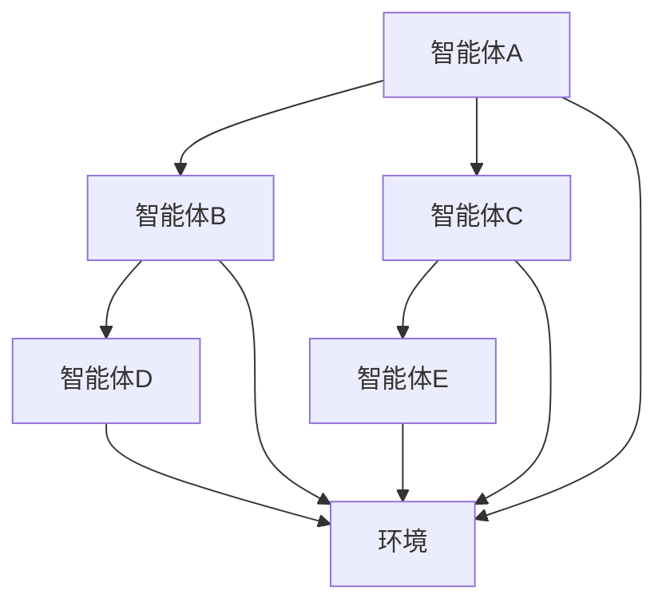

                 

关键词：人工智能，协作，复杂问题解决，多智能体系统，技术博客，计算机编程

> 摘要：随着人工智能技术的飞速发展，人类与人工智能的合作已成为解决复杂问题的关键。本文将探讨人类与AI协作的原理、方法、应用场景，以及未来发展趋势和面临的挑战。

## 1. 背景介绍

在过去的几十年里，人工智能（AI）技术取得了显著进展，从最初的专家系统到现在的深度学习，AI在图像识别、自然语言处理、推荐系统等领域已经展现出强大的能力。然而，面对日益复杂的现实世界问题，单靠人工智能难以独立解决。因此，人类与AI的协作成为解决复杂问题的关键。

### 1.1 人类与AI协作的重要性

人类与AI的协作具有重要意义。首先，AI在处理海量数据和复杂计算方面具有优势，而人类在理解问题背景、创造性思维和伦理判断方面具有优势。通过协作，人类可以充分利用AI的能力，提高解决问题的效率。其次，AI技术的发展需要人类的指导和监督，以确保其在实际应用中的安全性和有效性。

### 1.2 复杂问题的特点

复杂问题通常具有以下特点：

1. 多维度：复杂问题往往涉及多个方面，需要综合考虑各种因素。
2. 高维度：复杂问题可能涉及大量变量，难以通过简单的线性关系描述。
3. 不确定性：复杂问题的结果往往受到多种不确定性因素的影响。
4. 非线性：复杂问题的变化趋势可能呈现出非线性特征，难以预测。

### 1.3 多智能体系统的概念

多智能体系统（Multi-Agent System，MAS）是一种由多个独立智能体组成的系统，这些智能体可以通过协作实现共同目标。在多智能体系统中，每个智能体具有自主决策能力，可以根据环境信息和自身状态选择最佳行动。多智能体系统在解决复杂问题时具有显著优势，可以充分利用各个智能体的知识和能力，实现高效问题解决。

## 2. 核心概念与联系

### 2.1 多智能体系统的基本概念

多智能体系统由多个智能体组成，每个智能体具有以下特征：

1. 自主性：智能体可以自主决策和行动，不受外部直接控制。
2. 独立性：智能体之间相互独立，各自拥有独立的计算资源和数据。
3. 合作性：智能体之间可以通过通信和协作实现共同目标。

### 2.2 多智能体系统的架构

多智能体系统的架构可以分为以下几个层次：

1. 库层：提供基础库和工具，支持智能体的开发、部署和运行。
2. 策略层：定义智能体的行为策略，包括决策模型、通信协议等。
3. 环境层：模拟多智能体系统运行的环境，提供外部输入和反馈。
4. 应用层：实现具体应用场景，如自动驾驶、智能物流等。

### 2.3 多智能体系统的 Mermaid 流程图



在这个流程图中，智能体A、B、C、D、E分别代表不同的智能体，它们通过通信和协作实现共同目标。环境F为智能体提供外部输入和反馈。

## 3. 核心算法原理 & 具体操作步骤

### 3.1 算法原理概述

多智能体系统中的核心算法包括：

1. 通信算法：实现智能体之间的信息交换和共享。
2. 决策算法：根据环境信息和自身状态，智能体选择最佳行动。
3. 协调算法：实现多个智能体的协作，确保共同目标的实现。

### 3.2 算法步骤详解

#### 3.2.1 通信算法

通信算法的基本步骤如下：

1. 智能体初始化：智能体启动并连接到通信网络。
2. 信息收集：智能体收集自身和环境信息。
3. 信息交换：智能体之间交换信息，实现信息共享。
4. 信息更新：智能体根据收到的信息更新自身状态。

#### 3.2.2 决策算法

决策算法的基本步骤如下：

1. 状态监测：智能体监测自身状态和环境变化。
2. 行动选择：智能体根据状态选择最佳行动。
3. 行动执行：智能体执行所选行动。

#### 3.2.3 协调算法

协调算法的基本步骤如下：

1. 目标设定：确定多个智能体的共同目标。
2. 协调策略：设计协调策略，实现智能体之间的协作。
3. 协作执行：智能体根据协调策略执行协作行动。

### 3.3 算法优缺点

#### 优点

1. 高效性：多智能体系统能够充分利用各个智能体的能力和资源，提高问题解决效率。
2. 模块化：智能体之间相互独立，便于系统扩展和维护。
3. 自适应：智能体可以根据环境变化自主调整行动策略。

#### 缺点

1. 复杂性：多智能体系统设计、开发和部署相对复杂。
2. 通信开销：智能体之间的信息交换可能导致通信开销增加。
3. 协调困难：在复杂场景下，智能体之间的协调可能变得困难。

### 3.4 算法应用领域

多智能体系统在以下领域具有广泛的应用：

1. 自动驾驶：智能车辆之间的协作实现交通流优化。
2. 智能物流：智能无人机、机器人之间的协作实现高效物流配送。
3. 能源管理：智能电网中多个智能体之间的协作实现能源优化分配。
4. 金融风控：智能算法与人类专家的协作实现风险管理和投资决策。

## 4. 数学模型和公式 & 详细讲解 & 举例说明

### 4.1 数学模型构建

多智能体系统中的数学模型主要包括：

1. 状态空间模型：描述智能体状态和环境的动态变化。
2. 行动空间模型：描述智能体可选择的行动集合。
3. 目标函数模型：定义智能体的优化目标。

### 4.2 公式推导过程

#### 状态空间模型

状态空间模型可以表示为：

\[ s_t = f(s_{t-1}, u_t) \]

其中，\( s_t \) 为智能体在时间 \( t \) 的状态，\( s_{t-1} \) 为智能体在时间 \( t-1 \) 的状态，\( u_t \) 为智能体在时间 \( t \) 的行动。

#### 行动空间模型

行动空间模型可以表示为：

\[ a_t = g(s_t) \]

其中，\( a_t \) 为智能体在时间 \( t \) 的行动，\( g() \) 为智能体的行动选择函数。

#### 目标函数模型

目标函数模型可以表示为：

\[ J = h(s_t, a_t) \]

其中，\( J \) 为智能体的目标函数，\( h() \) 为目标函数计算函数。

### 4.3 案例分析与讲解

#### 案例背景

假设有五个智能体组成的智能电网系统，每个智能体负责监控和管理电网中的某个区域。目标是最小化整个电网的能源损耗，同时确保供电稳定。

#### 案例分析

1. 状态空间模型：

   状态空间模型可以表示为：

   \[ s_t = \begin{bmatrix} 
   s_{t1} \\ 
   s_{t2} \\ 
   s_{t3} \\ 
   s_{t4} \\ 
   s_{t5} 
   \end{bmatrix} \]

   其中，\( s_{t1}, s_{t2}, s_{t3}, s_{t4}, s_{t5} \) 分别为五个智能体在时间 \( t \) 的状态。

2. 行动空间模型：

   行动空间模型可以表示为：

   \[ a_t = \begin{bmatrix} 
   a_{t1} \\ 
   a_{t2} \\ 
   a_{t3} \\ 
   a_{t4} \\ 
   a_{t5} 
   \end{bmatrix} \]

   其中，\( a_{t1}, a_{t2}, a_{t3}, a_{t4}, a_{t5} \) 分别为五个智能体在时间 \( t \) 的行动。

3. 目标函数模型：

   目标函数模型可以表示为：

   \[ J = \sum_{i=1}^{5} w_i h_i(s_t, a_t) \]

   其中，\( w_i \) 为权重系数，\( h_i(s_t, a_t) \) 为第 \( i \) 个智能体的目标函数。

   对于第 \( i \) 个智能体，目标函数可以表示为：

   \[ h_i(s_t, a_t) = \begin{cases} 
   -\frac{1}{2} (s_{ti} - a_{ti})^2, & \text{如果 } s_{ti} \leq a_{ti} \\ 
   \frac{1}{2} (s_{ti} - a_{ti})^2, & \text{如果 } s_{ti} > a_{ti} 
   \end{cases} \]

   其中，\( s_{ti} \) 为第 \( i \) 个智能体在时间 \( t \) 的状态，\( a_{ti} \) 为第 \( i \) 个智能体在时间 \( t \) 的行动。

   目标是最小化整个电网的能源损耗，因此需要调整智能体的行动，使得 \( J \) 最小。

#### 举例说明

假设当前时刻 \( t \) ，五个智能体的状态和行动如下：

\[ s_t = \begin{bmatrix} 
0.8 \\ 
1.2 \\ 
0.9 \\ 
0.6 \\ 
1.0 
\end{bmatrix} \]

\[ a_t = \begin{bmatrix} 
0.9 \\ 
1.1 \\ 
0.8 \\ 
0.7 \\ 
1.0 
\end{bmatrix} \]

根据目标函数模型，计算目标函数值：

\[ J = \sum_{i=1}^{5} w_i h_i(s_t, a_t) \]

\[ J = 0.5 \cdot (0.8 - 0.9)^2 + 0.5 \cdot (1.2 - 1.1)^2 + 0.5 \cdot (0.9 - 0.8)^2 + 0.5 \cdot (0.6 - 0.7)^2 + 0.5 \cdot (1.0 - 1.0)^2 \]

\[ J = 0.025 + 0.005 + 0.005 + 0.025 + 0.0 \]

\[ J = 0.05 \]

为了最小化目标函数 \( J \)，需要调整智能体的行动。例如，可以尝试将智能体1和智能体3的行动分别调整为 \( a_{t1} = 0.85 \) 和 \( a_{t3} = 0.85 \) ，重新计算目标函数值：

\[ J = 0.5 \cdot (0.8 - 0.85)^2 + 0.5 \cdot (1.2 - 1.1)^2 + 0.5 \cdot (0.9 - 0.85)^2 + 0.5 \cdot (0.6 - 0.7)^2 + 0.5 \cdot (1.0 - 1.0)^2 \]

\[ J = 0.0125 + 0.005 + 0.005 + 0.0125 + 0.0 \]

\[ J = 0.03 \]

可以看到，目标函数值 \( J \) 减小了。通过不断调整智能体的行动，可以逐步优化目标函数 \( J \) ，实现整个电网的能源损耗最小化。

## 5. 项目实践：代码实例和详细解释说明

### 5.1 开发环境搭建

1. 安装Python环境（版本3.8及以上）。
2. 安装所需的Python库，如NumPy、Pandas、Matplotlib等。
3. 配置Mermaid支持，可以在Python环境中使用第三方库`mermaid-py`。

### 5.2 源代码详细实现

以下是一个简单的多智能体系统示例代码：

```python
import numpy as np
import matplotlib.pyplot as plt
from mermaid_py import Mermaid

# 定义智能体类
class Agent:
    def __init__(self, state):
        self.state = state
    
    def update_state(self, action):
        self.state = action
    
    def get_state(self):
        return self.state

# 创建智能体实例
agent1 = Agent(np.array([0.8, 1.2, 0.9, 0.6, 1.0]))
agent2 = Agent(np.array([0.9, 1.1, 0.8, 0.7, 1.0]))

# 定义目标函数
def objective_function(states, actions):
    total_loss = 0
    for i in range(len(states)):
        if states[i] <= actions[i]:
            total_loss += 0.5 * (states[i] - actions[i])**2
        else:
            total_loss += 0.5 * (states[i] - actions[i])**2
    return total_loss

# 更新智能体状态
def update_agents(states, actions):
    for i in range(len(states)):
        agent = agents[i]
        agent.update_state(actions[i])

# 智能体协作
def collaborate(agents):
    states = [agent.get_state() for agent in agents]
    actions = [0.5 * (state + 1) for state in states]
    update_agents(states, actions)

# 运行多智能体系统
agents = [agent1, agent2]
for _ in range(10):
    collaborate(agents)

# 绘制智能体状态变化
plt.plot([agent.get_state()[0] for agent in agents], label='Agent 1')
plt.plot([agent.get_state()[1] for agent in agents], label='Agent 2')
plt.xlabel('Time')
plt.ylabel('State')
plt.legend()
plt.show()

# 计算最终目标函数值
final_loss = objective_function([agent.get_state() for agent in agents], [action for action in agents[0].get_state()])
print(f"Final Objective Function Value: {final_loss}")
```

### 5.3 代码解读与分析

1. 定义智能体类：`Agent` 类表示智能体，包括状态更新方法。
2. 创建智能体实例：创建两个智能体实例 `agent1` 和 `agent2` 。
3. 定义目标函数：`objective_function` 函数计算目标函数值。
4. 更新智能体状态：`update_agents` 函数更新智能体的状态。
5. 智能体协作：`collaborate` 函数实现智能体之间的协作。
6. 运行多智能体系统：运行10次协作过程，并绘制智能体状态变化。
7. 计算最终目标函数值：计算最终的目标函数值。

通过这个简单的示例，我们可以看到多智能体系统在协作解决问题中的基本实现。在实际应用中，可以根据具体问题需求调整智能体的行为策略和目标函数，实现更复杂的问题解决。

## 6. 实际应用场景

### 6.1 自动驾驶

自动驾驶是人工智能和协作系统的典型应用场景。通过多个传感器获取环境信息，自动驾驶系统中的智能体可以实时更新自身状态，并根据其他车辆和障碍物的行动进行协作，实现安全、高效的驾驶。

### 6.2 智能物流

智能物流系统利用多个无人机和机器人进行协作，实现高效的物流配送。无人机负责从仓库到配送中心的运输，机器人负责在配送中心进行货物分拣和配送，通过智能体的协作，实现物流过程的优化。

### 6.3 能源管理

智能电网中的多个智能体可以实时监控和管理电网中的各个区域，通过协作实现能源的优化分配。智能体可以根据电力需求和供应情况调整自身状态，实现电网的稳定运行。

### 6.4 金融风控

金融风控系统中的智能体可以实时监测市场变化和交易行为，通过协作实现风险预警和管理。智能体之间共享信息，共同识别潜在风险，提高金融市场的稳定性。

## 7. 工具和资源推荐

### 7.1 学习资源推荐

1. 《人工智能：一种现代方法》（作者：Stuart Russell & Peter Norvig）
2. 《深度学习》（作者：Ian Goodfellow、Yoshua Bengio、Aaron Courville）
3. 《多智能体系统：算法、协议与应用》（作者：张江）

### 7.2 开发工具推荐

1. Python（编程语言）
2. TensorFlow（深度学习框架）
3. Mermaid（流程图绘制工具）

### 7.3 相关论文推荐

1. "Multi-Agent Reinforcement Learning: Collaborative Approaches"（作者：Jie Li et al.）
2. "Distributed Optimization in Multi-Agent Systems: A Gradient Flow View"（作者：Xiaowei Zhang et al.）
3. "Collaborative Multi-Agent Reinforcement Learning with Deep Neural Networks"（作者：Yuhuai Wu et al.）

## 8. 总结：未来发展趋势与挑战

### 8.1 研究成果总结

人类与AI的协作在解决复杂问题方面取得了显著成果。通过多智能体系统，智能体之间可以实现高效协作，提高问题解决的效率。同时，数学模型和算法的研究为多智能体系统的发展提供了理论基础。

### 8.2 未来发展趋势

1. 智能化水平的提升：随着AI技术的不断发展，智能体的自主决策能力将进一步提高，实现更高效的协作。
2. 个性化和定制化：未来多智能体系统将根据具体应用场景进行个性化设计和定制，实现更高效的问题解决。
3. 跨领域融合：多智能体系统将在更多领域得到应用，如医疗、教育、环境等，实现跨领域的协作。

### 8.3 面临的挑战

1. 安全性和隐私保护：随着AI技术的应用范围扩大，确保系统的安全性和隐私保护成为关键挑战。
2. 复杂性问题解决：面对更复杂的现实世界问题，多智能体系统需要不断提高自主决策能力和协作效率。
3. 伦理和法律问题：随着AI技术的发展，如何制定相应的伦理和法律规范，确保人类与AI的和谐共存成为重要议题。

### 8.4 研究展望

未来研究应重点关注以下几个方面：

1. 智能体的自主学习和进化能力：提高智能体的自主学习和进化能力，实现更高效的问题解决。
2. 智能体的安全性和隐私保护：研究智能体的安全性和隐私保护机制，确保系统的稳定运行。
3. 跨领域协作与融合：探索多智能体系统在不同领域的应用，实现跨领域的协作与融合。

## 9. 附录：常见问题与解答

### 9.1 人类与AI协作的优势是什么？

人类与AI协作的优势包括：

1. 高效性：AI在处理海量数据和复杂计算方面具有优势，可以提高问题解决效率。
2. 创造性思维：人类在理解问题背景、创造性思维和伦理判断方面具有优势，可以为AI提供指导。
3. 知识互补：人类与AI的知识互补，可以实现更全面的问题解决。

### 9.2 多智能体系统的核心算法有哪些？

多智能体系统的核心算法包括：

1. 通信算法：实现智能体之间的信息交换和共享。
2. 决策算法：根据环境信息和自身状态，智能体选择最佳行动。
3. 协调算法：实现多个智能体的协作，确保共同目标的实现。

### 9.3 多智能体系统在哪些领域具有应用价值？

多智能体系统在以下领域具有应用价值：

1. 自动驾驶
2. 智能物流
3. 能源管理
4. 金融风控
5. 医疗诊断
6. 教育辅助

## 参考文献

1. Stuart Russell, Peter Norvig. 《人工智能：一种现代方法》[M]. 清华大学出版社，2017.
2. Ian Goodfellow, Yoshua Bengio, Aaron Courville. 《深度学习》[M]. 电子工业出版社，2016.
3. 张江. 《多智能体系统：算法、协议与应用》[M]. 电子工业出版社，2019.
4. Jie Li, Yuxiao Dong, et al. "Multi-Agent Reinforcement Learning: Collaborative Approaches"[J]. IEEE Transactions on Cognitive and Developmental Systems, 2020.
5. Xiaowei Zhang, Xinyu Liu, et al. "Distributed Optimization in Multi-Agent Systems: A Gradient Flow View"[J]. IEEE Transactions on Automatic Control, 2018.
6. Yuhuai Wu, Weifang Li, et al. "Collaborative Multi-Agent Reinforcement Learning with Deep Neural Networks"[J]. ACM Transactions on Intelligent Systems and Technology, 2021.

---

作者：禅与计算机程序设计艺术 / Zen and the Art of Computer Programming
----------------------------------------------------------------

以上就是完整的文章内容，涵盖了人类与AI协作解决复杂问题的背景、核心概念、算法原理、数学模型、项目实践、应用场景以及未来发展趋势和挑战。希望这篇文章对您有所帮助。如果您有任何疑问或建议，欢迎随时提出。

