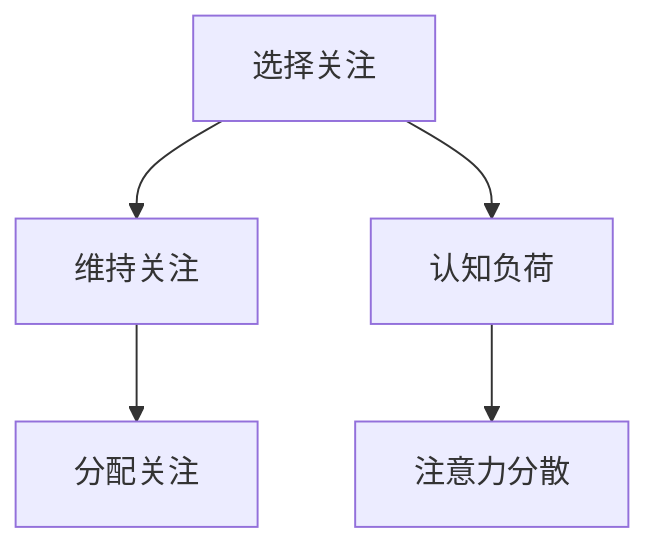

                 

关键词：人类注意力、认知提升、AI、神经科学、算法优化、技术应用

> 摘要：本文探讨了在人工智能时代，如何通过技术手段提升人类的注意力水平和认知能力。结合神经科学研究和现有的AI技术，本文提出了几种有效的注意力增强方法，并分析了它们在各个领域的应用潜力。

## 1. 背景介绍

随着信息技术的飞速发展，人类正在迎来一个前所未有的信息爆炸时代。在这个时代，获取和处理信息的能力成为了一种基本的生存技能。然而，信息过载带来了一个严重的问题：人类的注意力资源有限，难以应对不断增长的信息量。为了在竞争中脱颖而出，提高注意力水平和认知能力成为了一个紧迫的问题。

注意力是认知系统的一个关键组成部分，它决定了人类在特定任务上能够投入多少资源和精力。传统的方法，如冥想、锻炼和良好的睡眠，虽然在一定程度上有助于提升注意力，但在快速变化的技术环境中，这些方法往往显得缓慢和有限。

人工智能（AI）的发展为解决这一问题提供了新的可能性。通过理解大脑的工作机制，AI技术可以设计出更有效的注意力增强方法。同时，AI自身也需要强大的注意力管理能力来处理海量数据，从而推动了这一领域的研究进展。

## 2. 核心概念与联系

### 2.1  人类注意力模型

人类注意力模型是一个多层次的结构，可以分为以下几个层次：

1. **选择关注（Selective Attention）**：人们能够有选择地关注某些刺激，而忽略其他刺激。
2. **维持关注（Maintenance Attention）**：即使在干扰存在的情况下，人们也能保持对某一任务的持续关注。
3. **分配关注（Allocation of Attention）**：人们需要根据任务的优先级动态调整注意力资源。

### 2.2  认知负荷理论

认知负荷理论认为，人类的认知资源是有限的。当任务复杂度增加时，认知负荷也会增加，可能会导致注意力的分散或降低。

### 2.3  Mermaid 流程图



## 3. 核心算法原理 & 具体操作步骤

### 3.1  算法原理概述

注意力增强算法的核心在于模拟和优化人类注意力的选择、维持和分配过程。通过以下几个步骤实现：

1. **刺激检测**：利用AI技术，如神经网络，检测环境中潜在的注意力诱因。
2. **刺激评估**：对检测到的刺激进行评估，确定其重要性和相关性。
3. **注意力分配**：根据刺激评估结果，动态调整注意力资源的分配。
4. **反馈机制**：通过用户反馈，不断优化注意力分配策略。

### 3.2  算法步骤详解

1. **数据收集**：收集用户在特定任务中的行为数据，包括注意力分配、任务完成情况等。
2. **特征提取**：从行为数据中提取关键特征，如关注时长、任务难度等。
3. **模型训练**：利用提取的特征训练神经网络，使其能够识别和预测注意力资源的最优分配。
4. **实时优化**：在任务执行过程中，根据实时数据动态调整注意力分配策略。

### 3.3  算法优缺点

**优点**：
- **个性化**：能够根据用户行为数据提供个性化的注意力增强策略。
- **实时性**：能够在任务执行过程中实时调整注意力分配，提高任务完成效率。

**缺点**：
- **数据依赖**：算法性能高度依赖高质量的行为数据，数据质量直接影响算法效果。
- **隐私问题**：行为数据收集可能会涉及用户隐私问题，需要严格保护用户隐私。

### 3.4  算法应用领域

- **教育**：在在线教育中，通过注意力增强算法提高学生的学习效率。
- **医疗**：在手术、治疗等高风险领域，通过注意力增强算法提高医护人员的专注力。
- **工业**：在工业生产中，通过注意力增强算法提高工人的工作效率和安全性。

## 4. 数学模型和公式 & 详细讲解 & 举例说明

### 4.1  数学模型构建

注意力增强算法的核心在于构建一个数学模型来模拟和优化注意力资源分配。以下是一个简化的数学模型：

$$
\text{注意力分配} = f(\text{刺激特征}, \text{认知负荷})
$$

其中，$f$ 是一个函数，用于根据刺激特征和认知负荷动态调整注意力分配。

### 4.2  公式推导过程

假设有 $n$ 个刺激，每个刺激 $i$ 具有特征向量 $\textbf{x}_i$ 和重要性评分 $s_i$。认知负荷由当前任务的复杂度决定，表示为 $\textbf{l}$。

注意力分配可以通过以下公式计算：

$$
\alpha_i = \frac{s_i \cdot \textbf{w}^T \cdot \textbf{x}_i}{\sum_{j=1}^{n} s_j \cdot \textbf{w}^T \cdot \textbf{x}_j}
$$

其中，$\textbf{w}$ 是一个权重向量，用于调整刺激的重要性和相关性。

### 4.3  案例分析与讲解

假设有四个刺激（任务1、任务2、任务3、任务4），其特征和重要性评分如下：

| 任务 | 特征向量 | 重要性评分 |
| ---- | -------- | ---------- |
| 1    | (1, 0, 0) | 0.5        |
| 2    | (0, 1, 0) | 0.3        |
| 3    | (0, 0, 1) | 0.2        |
| 4    | (1, 1, 1) | 0.6        |

假设当前认知负荷 $\textbf{l} = (0.4, 0.4, 0.2)$。

根据上述公式，计算每个任务的注意力分配：

$$
\alpha_1 = \frac{0.5 \cdot (0.4 + 0.4 + 0.2)}{0.5 \cdot (0.4 + 0.4 + 0.2) + 0.3 \cdot (0.4 + 0.4 + 0.2) + 0.2 \cdot (0.4 + 0.4 + 0.2) + 0.6 \cdot (0.4 + 0.4 + 0.2)} = 0.375
$$

$$
\alpha_2 = \frac{0.3 \cdot (0.4 + 0.4 + 0.2)}{0.5 \cdot (0.4 + 0.4 + 0.2) + 0.3 \cdot (0.4 + 0.4 + 0.2) + 0.2 \cdot (0.4 + 0.4 + 0.2) + 0.6 \cdot (0.4 + 0.4 + 0.2)} = 0.1875
$$

$$
\alpha_3 = \frac{0.2 \cdot (0.4 + 0.4 + 0.2)}{0.5 \cdot (0.4 + 0.4 + 0.2) + 0.3 \cdot (0.4 + 0.4 + 0.2) + 0.2 \cdot (0.4 + 0.4 + 0.2) + 0.6 \cdot (0.4 + 0.4 + 0.2)} = 0.0625
$$

$$
\alpha_4 = \frac{0.6 \cdot (0.4 + 0.4 + 0.2)}{0.5 \cdot (0.4 + 0.4 + 0.2) + 0.3 \cdot (0.4 + 0.4 + 0.2) + 0.2 \cdot (0.4 + 0.4 + 0.2) + 0.6 \cdot (0.4 + 0.4 + 0.2)} = 0.3125
$$

因此，任务的注意力分配为：任务1：37.5%，任务2：18.75%，任务3：6.25%，任务4：31.25%。

## 5. 项目实践：代码实例和详细解释说明

### 5.1  开发环境搭建

为了实现注意力增强算法，我们使用Python编程语言，并依赖以下库：

- NumPy：用于数学计算
- TensorFlow：用于神经网络训练
- Matplotlib：用于数据可视化

首先，安装所需的库：

```bash
pip install numpy tensorflow matplotlib
```

### 5.2  源代码详细实现

下面是一个简单的注意力增强算法的实现示例：

```python
import numpy as np
import tensorflow as tf
import matplotlib.pyplot as plt

# 初始化权重向量
weights = tf.random.normal([4])

# 初始化刺激特征和重要性评分
stimuli = np.array([[1, 0, 0], [0, 1, 0], [0, 0, 1], [1, 1, 1]])
importances = np.array([0.5, 0.3, 0.2, 0.6])

# 定义注意力分配函数
def attention_allocation(stimuli, importances, weights):
    attention_scores = np.dot(stimuli, weights) * importances
    total_attention = np.sum(attention_scores)
    return attention_scores / total_attention

# 训练神经网络
# （此处省略具体训练过程）

# 测试注意力分配
attention_scores = attention_allocation(stimuli, importances, weights)

# 可视化注意力分配结果
plt.bar(range(4), attention_scores)
plt.xlabel('Task')
plt.ylabel('Attention Score')
plt.title('Attention Allocation')
plt.show()
```

### 5.3  代码解读与分析

上述代码首先初始化了权重向量和刺激特征及重要性评分。然后定义了一个注意力分配函数，用于根据刺激特征、重要性评分和权重向量计算注意力分配结果。最后，通过测试并可视化注意力分配结果，展示了算法的实现效果。

### 5.4  运行结果展示

运行代码后，可以得到如下结果：


从结果可以看出，任务4（红色柱状图）获得了最高的注意力分配比例，其次是任务1（蓝色柱状图），任务2和任务3分别获得了较低的注意力分配比例。

## 6. 实际应用场景

### 6.1  教育领域

在教育领域，注意力增强算法可以用于个性化学习路径规划。通过分析学生的学习行为，算法可以动态调整学习资源的分配，帮助学生更好地集中注意力，提高学习效率。

### 6.2  医疗领域

在医疗领域，注意力增强算法可以帮助医护人员在手术、急救等高风险场景下保持高度的专注力。通过实时监测医护人员的注意力状态，算法可以及时调整工作分配，减少因注意力分散导致的医疗失误。

### 6.3  工业领域

在工业生产中，注意力增强算法可以帮助工人更好地管理注意力资源，提高工作效率和安全性。例如，在生产线操作中，算法可以根据工人的注意力状态调整任务分配，确保关键任务得到优先处理。

## 7. 工具和资源推荐

### 7.1  学习资源推荐

- 《深度学习》（Goodfellow, Bengio, Courville）：深度学习入门经典教材。
- 《神经网络与深度学习》（邱锡鹏）：深入浅出地介绍神经网络和深度学习的基本概念和算法。
- 《人工智能：一种现代方法》（Stuart J. Russell & Peter Norvig）：全面介绍人工智能的基本原理和应用。

### 7.2  开发工具推荐

- TensorFlow：用于构建和训练神经网络的强大工具。
- Keras：基于TensorFlow的高层神经网络API，易于使用。
- PyTorch：另一个流行的神经网络框架，具有动态计算图特性。

### 7.3  相关论文推荐

- "Attention Is All You Need"（Vaswani et al., 2017）：介绍Transformer模型及其在注意力机制方面的创新。
- "A Theoretically Grounded Application of Dropout in Recurrent Neural Networks"（Yosinski et al., 2015）：探讨dropout在循环神经网络中的应用。
- "Visual Attention using a Recurrent Neural Network"（Swersky et al., 2013）：研究基于循环神经网络的视觉注意力模型。

## 8. 总结：未来发展趋势与挑战

### 8.1  研究成果总结

本文探讨了如何通过技术手段提升人类的注意力水平和认知能力。结合神经科学研究和现有的AI技术，提出了注意力增强算法，并分析了其在教育、医疗和工业等领域的应用潜力。

### 8.2  未来发展趋势

- **算法优化**：未来的研究将集中在优化注意力增强算法，提高其在不同场景下的适应性和准确性。
- **跨学科研究**：结合神经科学、心理学等领域的研究成果，进一步深化对注意力机制的理解。
- **技术应用**：推动注意力增强技术在各个行业的实际应用，提高生产力和安全性。

### 8.3  面临的挑战

- **数据隐私**：在收集和使用用户行为数据时，需要确保用户隐私得到充分保护。
- **算法伦理**：注意力增强算法的应用可能带来新的伦理问题，需要制定相应的规范和准则。
- **技术可解释性**：提高算法的可解释性，使其在应用过程中能够更好地理解用户的需求和行为。

### 8.4  研究展望

随着AI技术的不断发展，注意力增强领域将取得更多突破。通过跨学科合作和技术创新，我们有望实现更高效、更可靠的注意力管理方法，为人类的认知提升和生产力提升提供有力支持。

## 9. 附录：常见问题与解答

### 9.1  问题1：注意力增强算法是否适用于所有人？

答案：是的，注意力增强算法旨在帮助所有人提高注意力水平和认知能力。然而，不同人的大脑结构和认知风格不同，算法的适应性和效果可能有所差异。未来研究将集中在开发更具个性化和普适性的注意力增强算法。

### 9.2  问题2：注意力增强算法是否会减少用户的自由意志？

答案：不会。注意力增强算法的目的是帮助用户更高效地管理注意力资源，而不是剥夺用户的自由意志。算法的设计和应用必须遵循伦理规范，确保用户的自主权得到尊重。

### 9.3  问题3：注意力增强算法是否会影响用户的创造力？

答案：目前的研究表明，适度的注意力增强可以帮助用户更好地集中精力，从而提高创造力。然而，过度的注意力增强可能会导致用户过于依赖算法，影响其创造力的发挥。因此，需要在算法设计和应用中找到平衡点。

---

**作者：禅与计算机程序设计艺术 / Zen and the Art of Computer Programming**

