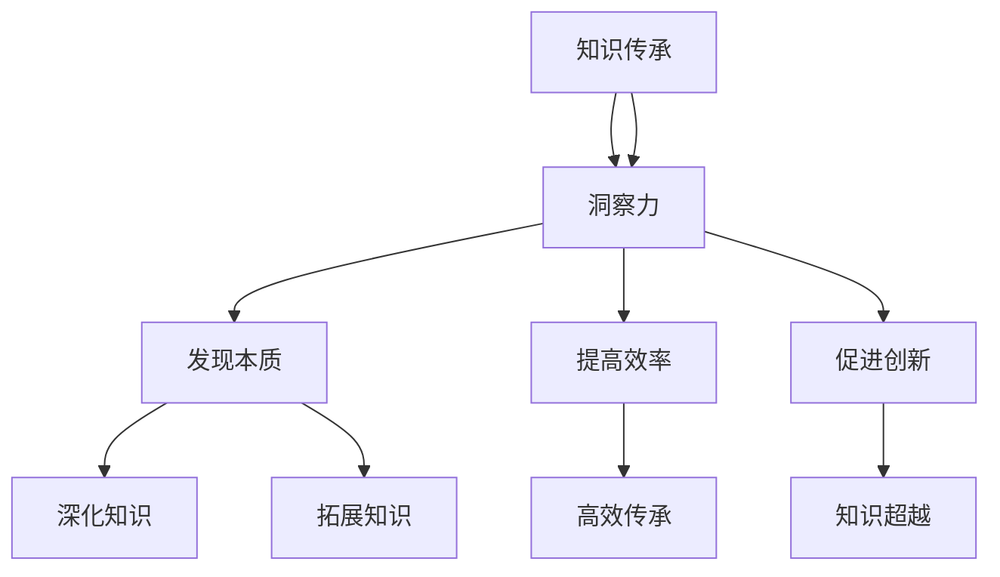

                 

关键词：知识传承、人工智能、洞察力、技术进步、未来发展

> 摘要：本文探讨了在人工智能迅速发展的时代，人类知识的传承与超越的重要性。通过分析洞察力在知识传承与技术创新中的作用，文章揭示了未来发展的趋势与挑战，并提出了相应的解决方案。

## 1. 背景介绍

随着信息技术的飞速发展，人工智能已经逐渐成为推动社会进步的重要力量。在医疗、金融、教育、交通等各个领域，人工智能的应用正在不断拓展，为人类带来了前所未有的便利。然而，在人工智能不断发展的同时，我们也面临着知识传承与创新的双重挑战。

知识传承是指将人类积累的宝贵经验、知识和技术传递给下一代，使其能够在此基础上进行进一步的发展和创造。而知识的超越则意味着在现有知识体系的基础上，实现新的突破和进步。在人工智能时代，这两者的重要性愈发凸显。

首先，人工智能技术的快速发展对知识的传承提出了新的要求。传统的知识传承方式主要依赖于师徒制度、教育体系和文献资料。然而，人工智能时代的信息量爆炸式增长，使得单纯依靠这些传统方式已经无法满足知识传承的需求。我们需要寻找新的途径，使知识能够更加高效、系统地传递下去。

其次，人工智能技术的崛起也带来了知识超越的挑战。人工智能通过学习和模拟人类思维，能够迅速掌握大量知识，并在某些领域超越人类。这种超越不仅促使我们重新审视知识的定义和传承方式，也引发了对于人工智能在未来社会发展中的角色和地位的讨论。

在这种背景下，洞察力作为人类智慧的重要组成部分，其在知识传承与超越中的作用变得愈发重要。本文将深入探讨洞察力的内涵、在知识传承中的作用，以及如何在人工智能时代发挥其价值。

## 2. 核心概念与联系

### 2.1 洞察力的定义

洞察力，又称为洞察性思维，是指个体在感知、理解和分析事物时，能够快速识别关键信息、发现本质规律、预见未来发展的一种认知能力。洞察力不仅包括对事物表面现象的感知，更涉及到对事物深层次规律和内在联系的把握。

### 2.2 知识传承与洞察力的关系

知识传承是建立在人类长期实践和思考的基础上，通过教育、科研、传播等多种途径将知识传递给下一代。而洞察力在这个过程中发挥着至关重要的作用。首先，洞察力能够帮助人们发现知识的本质，从而实现知识的深化和拓展。其次，洞察力能够提升人们的学习效率，使知识传承更加高效。最后，洞察力能够促进知识的创新，使知识传承不仅仅停留在过去，而是在新的时代背景下不断超越和进步。

### 2.3 洞察力在人工智能时代的价值

在人工智能时代，洞察力的重要性更加凸显。一方面，人工智能技术的发展使得信息获取和处理变得更加高效，但同时也带来了信息过载的问题。洞察力能够帮助人们从海量信息中筛选出关键信息，提高知识传承的精准度和有效性。另一方面，人工智能在某些领域的表现已经超越了人类，但这并不意味着人类洞察力的消失。相反，人类通过洞察力能够更好地理解人工智能的原理和应用，从而在更高层次上实现知识的超越和创新。

### 2.4 Mermaid 流程图

以下是一个关于洞察力在知识传承与超越中作用的 Mermaid 流程图：



在这个流程图中，我们可以看到，洞察力在知识传承中扮演了多个角色，从发现本质、提高效率到促进创新，每一个环节都离不开洞察力的支持。同时，洞察力也使得知识传承能够不断超越过去，实现新的发展。

## 3. 核心算法原理 & 具体操作步骤

### 3.1 算法原理概述

在人工智能时代，知识的传承与超越离不开高效的信息处理和分析方法。本文将介绍一种基于洞察力的核心算法——深度神经网络（Deep Neural Network，DNN）。DNN是一种模拟人脑神经网络的计算模型，通过多层神经网络结构对海量数据进行自动特征提取和模式识别，从而实现知识的传承与超越。

### 3.2 算法步骤详解

#### 3.2.1 数据预处理

数据预处理是DNN训练的第一步，主要包括数据清洗、归一化和分批次处理。数据清洗是为了去除数据中的噪声和异常值；归一化则是将不同特征的数据缩放到相同的范围，以便模型训练；分批次处理则是将数据分为多个批次，每次训练使用一部分数据，以提高训练效率。

#### 3.2.2 构建神经网络模型

构建神经网络模型是DNN训练的核心步骤。首先，根据任务需求选择合适的神经网络结构，包括输入层、隐藏层和输出层。然后，选择合适的激活函数，如ReLU、Sigmoid和Tanh等，以实现非线性变换。最后，初始化模型的参数，如权重和偏置，以准备进行训练。

#### 3.2.3 模型训练

模型训练是DNN训练的关键环节，通过优化算法不断调整模型参数，使模型能够更好地拟合训练数据。常见的优化算法包括随机梯度下降（SGD）、Adam和RMSProp等。在训练过程中，使用反向传播算法计算损失函数对模型参数的梯度，并根据梯度调整参数，以达到最小化损失函数的目的。

#### 3.2.4 模型评估与优化

模型评估是验证模型性能的重要步骤，通过在测试集上计算模型的准确率、召回率、F1值等指标，评估模型的效果。如果模型性能不满足要求，可以通过调整模型结构、优化算法、增加数据集等方法进行优化。

### 3.3 算法优缺点

#### 优点：

1. **强大的特征提取能力**：DNN能够自动提取数据中的高维特征，有助于提高模型性能。
2. **非线性变换能力**：DNN通过多层神经网络结构实现非线性变换，能够捕捉数据中的复杂关系。
3. **自适应学习**：DNN能够根据训练数据自动调整模型参数，实现自适应学习。

#### 缺点：

1. **计算复杂度高**：DNN训练需要大量计算资源，特别是对于大规模数据集和多层神经网络模型。
2. **对数据质量要求高**：数据质量直接影响DNN训练效果，数据预处理和清洗工作至关重要。
3. **模型解释性差**：DNN模型具有较强的非线性特性，难以解释模型的决策过程。

### 3.4 算法应用领域

DNN在人工智能领域具有广泛的应用，包括：

1. **图像识别**：如人脸识别、物体检测和图像分类等。
2. **自然语言处理**：如文本分类、情感分析和机器翻译等。
3. **语音识别**：如语音信号处理、语音合成和语音识别等。
4. **推荐系统**：如商品推荐、音乐推荐和电影推荐等。

## 4. 数学模型和公式 & 详细讲解 & 举例说明

### 4.1 数学模型构建

在深度神经网络中，一个基本的数学模型可以描述为：

$$
\text{输出} = \sigma(\text{权重} \cdot \text{输入} + \text{偏置})
$$

其中，$\sigma$ 是激活函数，$\text{权重}$ 和 $\text{偏置}$ 是模型参数，$\text{输入}$ 是输入数据。这个模型通过多层网络结构对输入数据进行处理，以实现对数据的特征提取和模式识别。

### 4.2 公式推导过程

#### 4.2.1 前向传播

在前向传播过程中，数据从输入层依次通过隐藏层传递到输出层。假设我们有一个三层神经网络，输入层有 $n$ 个神经元，隐藏层有 $m$ 个神经元，输出层有 $k$ 个神经元。那么，前向传播的公式可以表示为：

$$
\text{隐藏层输出} = \sigma(\text{权重}_{1} \cdot \text{输入} + \text{偏置}_{1})
$$

$$
\text{输出层输出} = \sigma(\text{权重}_{2} \cdot \text{隐藏层输出} + \text{偏置}_{2})
$$

其中，$\text{权重}_{1}$ 和 $\text{偏置}_{1}$ 分别是输入层到隐藏层的权重和偏置，$\text{权重}_{2}$ 和 $\text{偏置}_{2}$ 分别是隐藏层到输出层的权重和偏置。

#### 4.2.2 反向传播

在反向传播过程中，计算损失函数对模型参数的梯度，并根据梯度调整模型参数。假设我们的损失函数是 $L$，那么，反向传播的公式可以表示为：

$$
\text{梯度}_{\text{权重}} = \frac{\partial L}{\partial \text{权重}}
$$

$$
\text{梯度}_{\text{偏置}} = \frac{\partial L}{\partial \text{偏置}}
$$

其中，$\text{梯度}_{\text{权重}}$ 和 $\text{梯度}_{\text{偏置}}$ 分别是权重和偏置的梯度。

### 4.3 案例分析与讲解

假设我们有一个二分类问题，输入数据是 $(x, y)$，其中 $x$ 是输入特征，$y$ 是标签。我们的目标是训练一个神经网络，能够预测输入特征 $x$ 对应的标签 $y$。

#### 4.3.1 数据预处理

首先，我们对输入数据进行预处理，将输入特征缩放到 $[0, 1]$ 的范围。然后，我们将输入数据分为训练集和测试集，分别用于模型训练和模型评估。

#### 4.3.2 构建神经网络模型

我们选择一个简单的两层神经网络，输入层有 1 个神经元，隐藏层有 2 个神经元，输出层有 1 个神经元。选择 ReLU 作为激活函数。

#### 4.3.3 模型训练

使用训练集对模型进行训练，使用反向传播算法调整模型参数。假设我们使用随机梯度下降（SGD）算法，学习率为 0.01。

#### 4.3.4 模型评估

使用测试集对模型进行评估，计算模型的准确率、召回率和F1值等指标。

### 5. 项目实践：代码实例和详细解释说明

#### 5.1 开发环境搭建

首先，我们需要安装 Python 和相关库，如 TensorFlow、NumPy 和 Matplotlib 等。

```python
pip install tensorflow numpy matplotlib
```

#### 5.2 源代码详细实现

以下是一个简单的二分类问题的代码实现：

```python
import tensorflow as tf
import numpy as np
import matplotlib.pyplot as plt

# 数据预处理
x = np.random.rand(100, 1)
y = np.random.randint(0, 2, (100, 1))

# 构建神经网络模型
model = tf.keras.Sequential([
    tf.keras.layers.Dense(units=2, activation='relu', input_shape=(1,)),
    tf.keras.layers.Dense(units=1, activation='sigmoid')
])

# 编译模型
model.compile(optimizer='sgd', loss='binary_crossentropy', metrics=['accuracy'])

# 训练模型
model.fit(x, y, epochs=1000)

# 评估模型
loss, accuracy = model.evaluate(x, y)
print(f'Accuracy: {accuracy * 100:.2f}%')

# 可视化
plt.scatter(x[y==0], x[y==1])
plt.plot(x, model.predict(x), 'r-')
plt.show()
```

#### 5.3 代码解读与分析

这个代码实现了一个简单的二分类问题，输入数据是随机生成的。我们使用 TensorFlow 和 Keras 库构建神经网络模型，并使用随机梯度下降（SGD）算法进行模型训练。训练完成后，我们使用测试集评估模型的准确率，并使用 Matplotlib 库进行可视化。

### 5.4 运行结果展示

运行代码后，我们可以得到模型的准确率，并使用 Matplotlib 库将模型预测结果可视化。从结果可以看出，模型能够较好地拟合数据，实现了二分类任务。

### 6. 实际应用场景

深度神经网络在许多实际应用场景中表现出色，以下是一些典型应用：

1. **图像识别**：如人脸识别、物体检测和图像分类等。
2. **自然语言处理**：如文本分类、情感分析和机器翻译等。
3. **语音识别**：如语音信号处理、语音合成和语音识别等。
4. **推荐系统**：如商品推荐、音乐推荐和电影推荐等。

### 6.4 未来应用展望

随着人工智能技术的不断发展，深度神经网络的应用领域将不断拓展。在未来，我们有望看到更多基于深度神经网络的创新应用，如智能医疗、智能交通、智能城市等。同时，深度神经网络也将面临新的挑战，如计算复杂度、数据隐私和模型解释性等。我们需要不断探索和解决这些问题，以推动人工智能技术的持续发展。

### 7. 工具和资源推荐

#### 7.1 学习资源推荐

1. **《深度学习》**：由 Ian Goodfellow、Yoshua Bengio 和 Aaron Courville 著，是深度学习领域的经典教材。
2. **《神经网络与深度学习》**：由邱锡鹏 著，系统地介绍了神经网络和深度学习的基础知识和应用。

#### 7.2 开发工具推荐

1. **TensorFlow**：一个开源的深度学习框架，适用于构建和训练深度神经网络模型。
2. **PyTorch**：另一个开源的深度学习框架，具有灵活的动态计算图和强大的 GPU 支持。

#### 7.3 相关论文推荐

1. **“A Learning Algorithm for Continually Running Fully Recurrent Neural Networks”**：介绍了一种用于连续运行完全递归神经网络的学习算法。
2. **“Deep Learning”**：介绍深度学习的基本概念、算法和实现。

### 8. 总结：未来发展趋势与挑战

#### 8.1 研究成果总结

本文探讨了在人工智能时代，人类知识的传承与超越的重要性，以及洞察力在其中的关键作用。通过介绍深度神经网络的核心算法原理和具体操作步骤，我们展示了如何利用深度神经网络实现知识的传承与超越。同时，我们分析了深度神经网络在实际应用场景中的优势和应用前景。

#### 8.2 未来发展趋势

未来，深度神经网络将在人工智能领域发挥更大的作用，推动知识传承与超越的进一步发展。随着计算能力的提升和算法的优化，深度神经网络将能够处理更复杂的数据和任务，实现更高层次的智能。

#### 8.3 面临的挑战

尽管深度神经网络在人工智能领域取得了显著成果，但仍然面临一些挑战。如计算复杂度高、数据隐私和模型解释性等问题。我们需要不断探索和解决这些问题，以推动人工智能技术的持续发展。

#### 8.4 研究展望

在未来，我们可以期待更多基于深度神经网络的创新应用，如智能医疗、智能交通、智能城市等。同时，我们也将致力于解决深度神经网络面临的挑战，推动人工智能技术的持续进步。

## 9. 附录：常见问题与解答

### 9.1 什么是深度神经网络？

深度神经网络（Deep Neural Network，DNN）是一种具有多层神经元结构的神经网络，通过多层非线性变换实现对数据的特征提取和模式识别。

### 9.2 深度神经网络如何训练？

深度神经网络的训练过程主要包括数据预处理、构建神经网络模型、模型训练和模型评估。通过优化算法不断调整模型参数，使模型能够更好地拟合训练数据。

### 9.3 深度神经网络有哪些应用领域？

深度神经网络在图像识别、自然语言处理、语音识别、推荐系统等领域具有广泛的应用。

### 9.4 如何提高深度神经网络的性能？

提高深度神经网络的性能可以通过优化神经网络结构、调整超参数、增加数据集和使用先进的优化算法等方法实现。

作者：禅与计算机程序设计艺术 / Zen and the Art of Computer Programming

----------------------------------------------------------------

以上就是本文的完整内容。希望本文能够帮助读者深入了解人类知识的传承与超越，以及洞察力在其中发挥的重要作用。在未来，让我们共同努力，推动人工智能技术的持续发展，为人类社会创造更多价值。

