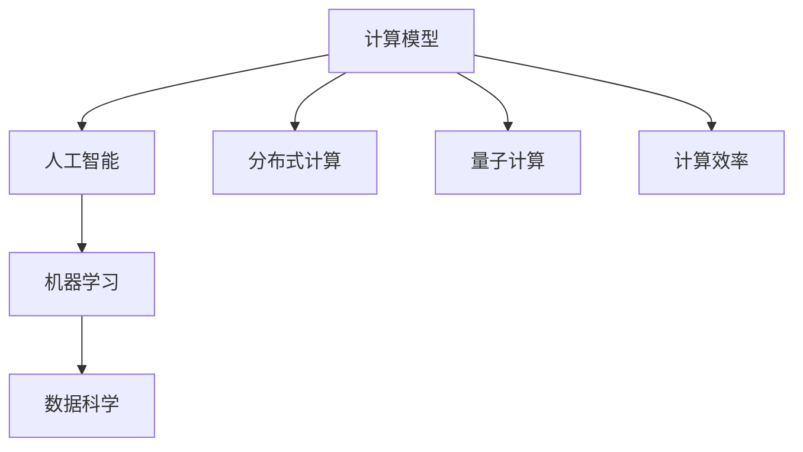

                 

关键词：人工智能，计算模型，未来趋势，技术发展，计算效率，挑战与机遇

> 摘要：本文从多个角度探讨了人类计算的未来发展趋势、机遇与挑战，重点关注人工智能领域的创新与进步，以及这些技术如何影响我们的计算模式和日常生活。通过详细分析核心算法原理、数学模型、应用实践和未来展望，本文为读者呈现了一幅全面而深刻的未来计算图景。

## 1. 背景介绍

随着科技的发展，计算已经成为现代社会不可或缺的一部分。从个人计算机到云计算，从移动设备到物联网，计算技术不断推动着社会的进步。然而，随着数据量的激增和复杂性的增加，传统的计算模型和方法已经难以满足日益增长的需求。为了应对这些挑战，人工智能（AI）技术的兴起为计算领域带来了新的机遇。AI不仅能够处理大规模数据，还能够通过自我学习和自适应优化提高计算效率。本文将探讨人类计算的未来，重点关注AI领域的创新与进步，以及这些技术如何影响我们的计算模式和日常生活。

## 2. 核心概念与联系

在探讨人类计算的未来之前，我们需要了解几个核心概念和它们之间的联系。

### 2.1 计算模型

计算模型是描述计算过程和算法的一种抽象表示。传统的计算模型主要包括串行计算和并行计算。随着计算技术的发展，新的计算模型，如分布式计算和量子计算，也逐渐崭露头角。

### 2.2 人工智能

人工智能（AI）是指使计算机具备人类智能的特性，包括感知、理解、推理、学习、决策等能力。AI可以分为弱AI和强AI，弱AI专注于特定任务的智能，如语音识别、图像识别等，而强AI则具备全面的人类智能。

### 2.3 机器学习

机器学习是AI的核心技术之一，通过训练模型来让计算机从数据中自动学习和发现规律。机器学习可以分为监督学习、无监督学习和强化学习。

### 2.4 数据科学

数据科学是利用数据、统计和机器学习等方法来提取知识和洞察力的学科。数据科学涵盖了数据收集、数据预处理、数据分析、数据可视化等多个方面。

### 2.5 计算效率

计算效率是衡量计算性能的一个重要指标，包括计算速度、资源消耗、能耗等。随着计算需求的增长，提高计算效率成为一项重要的挑战。

### 2.6 Mermaid 流程图

以下是核心概念原理和架构的 Mermaid 流程图：



## 3. 核心算法原理 & 具体操作步骤

### 3.1 算法原理概述

在AI领域，深度学习是一种重要的算法，它模拟人脑的神经网络结构，通过多层神经网络（神经网络层）来提取数据特征。深度学习分为卷积神经网络（CNN）、循环神经网络（RNN）、生成对抗网络（GAN）等类型，每种网络都有其特定的应用场景和优势。

### 3.2 算法步骤详解

深度学习的算法步骤通常包括以下阶段：

1. 数据收集：收集大量的数据，用于训练模型。
2. 数据预处理：对数据进行清洗、归一化等处理，以便于模型训练。
3. 模型构建：选择合适的神经网络结构，定义网络的层数、神经元个数等参数。
4. 模型训练：通过反向传播算法，不断调整网络参数，使模型能够更好地拟合数据。
5. 模型评估：使用验证集和测试集对模型进行评估，确保模型具有良好的泛化能力。
6. 模型部署：将训练好的模型部署到实际应用场景中，进行预测和决策。

### 3.3 算法优缺点

深度学习算法具有以下几个优点：

- 能够自动提取数据特征，减少人工干预。
- 对大规模数据具有较好的处理能力。
- 能够应用于多种领域，如图像识别、自然语言处理等。

然而，深度学习算法也存在一些缺点：

- 训练时间较长，对计算资源要求较高。
- 模型黑箱化，难以解释模型决策过程。
- 对数据质量和标注要求较高。

### 3.4 算法应用领域

深度学习算法在多个领域取得了显著成果，如：

- 图像识别：用于人脸识别、物体识别等。
- 自然语言处理：用于机器翻译、情感分析等。
- 医疗诊断：用于疾病诊断、药物研发等。
- 自动驾驶：用于自动驾驶车辆的目标检测和路径规划。

## 4. 数学模型和公式 & 详细讲解 & 举例说明

### 4.1 数学模型构建

深度学习算法的核心是构建合适的数学模型。以卷积神经网络（CNN）为例，其数学模型主要包括以下几个部分：

1. **卷积层**：通过卷积操作提取数据特征。
2. **激活函数**：用于引入非线性变换，使模型具有表达能力。
3. **池化层**：用于减少数据维度，提高模型泛化能力。
4. **全连接层**：将卷积层和池化层提取的特征进行融合，进行分类或回归任务。

### 4.2 公式推导过程

以卷积层为例，其卷积操作可以用以下公式表示：

$$
\text{output}_{ij} = \sum_{k=1}^{C} w_{ik} \cdot \text{input}_{kj} + b_j
$$

其中，$w_{ik}$ 表示卷积核的权重，$\text{input}_{kj}$ 表示输入数据的特征，$b_j$ 表示偏置项。

### 4.3 案例分析与讲解

以图像识别任务为例，我们可以使用深度学习模型进行训练和预测。假设我们使用一个简单的CNN模型进行训练，该模型包含两个卷积层、两个池化层和一个全连接层。我们可以使用以下Python代码进行模型构建和训练：

```python
import tensorflow as tf
from tensorflow.keras import layers

# 构建CNN模型
model = tf.keras.Sequential([
    layers.Conv2D(32, (3, 3), activation='relu', input_shape=(28, 28, 1)),
    layers.MaxPooling2D((2, 2)),
    layers.Conv2D(64, (3, 3), activation='relu'),
    layers.MaxPooling2D((2, 2)),
    layers.Flatten(),
    layers.Dense(64, activation='relu'),
    layers.Dense(10, activation='softmax')
])

# 编译模型
model.compile(optimizer='adam',
              loss='sparse_categorical_crossentropy',
              metrics=['accuracy'])

# 加载MNIST数据集
(x_train, y_train), (x_test, y_test) = tf.keras.datasets.mnist.load_data()

# 预处理数据
x_train = x_train / 255.0
x_test = x_test / 255.0

# 训练模型
model.fit(x_train, y_train, epochs=5)

# 评估模型
test_loss, test_acc = model.evaluate(x_test, y_test, verbose=2)
print('\nTest accuracy:', test_acc)
```

在上面的代码中，我们使用MNIST数据集进行训练，并使用softmax激活函数进行分类。通过训练，模型能够达到较高的准确率。

## 5. 项目实践：代码实例和详细解释说明

### 5.1 开发环境搭建

为了进行深度学习项目实践，我们需要搭建一个合适的开发环境。以下是具体的步骤：

1. 安装Python环境：确保Python版本为3.6及以上。
2. 安装TensorFlow：使用pip安装TensorFlow库。

```bash
pip install tensorflow
```

3. 安装其他依赖库：如NumPy、Pandas等。

```bash
pip install numpy pandas
```

### 5.2 源代码详细实现

在上一个例子中，我们已经实现了简单的MNIST图像识别项目。以下是详细的代码实现：

```python
import tensorflow as tf
from tensorflow.keras import layers

# 构建CNN模型
model = tf.keras.Sequential([
    layers.Conv2D(32, (3, 3), activation='relu', input_shape=(28, 28, 1)),
    layers.MaxPooling2D((2, 2)),
    layers.Conv2D(64, (3, 3), activation='relu'),
    layers.MaxPooling2D((2, 2)),
    layers.Flatten(),
    layers.Dense(64, activation='relu'),
    layers.Dense(10, activation='softmax')
])

# 编译模型
model.compile(optimizer='adam',
              loss='sparse_categorical_crossentropy',
              metrics=['accuracy'])

# 加载MNIST数据集
(x_train, y_train), (x_test, y_test) = tf.keras.datasets.mnist.load_data()

# 预处理数据
x_train = x_train / 255.0
x_test = x_test / 255.0

# 训练模型
model.fit(x_train, y_train, epochs=5)

# 评估模型
test_loss, test_acc = model.evaluate(x_test, y_test, verbose=2)
print('\nTest accuracy:', test_acc)
```

### 5.3 代码解读与分析

在上面的代码中，我们首先使用TensorFlow构建了一个简单的CNN模型，包括两个卷积层、两个池化层和一个全连接层。然后，我们使用MNIST数据集进行训练，并使用softmax激活函数进行分类。最后，我们评估模型在测试集上的准确率。

通过这个简单的例子，我们可以看到如何使用深度学习模型进行图像识别任务。在实际应用中，我们可以根据具体任务需求调整模型的参数和结构，以达到更好的效果。

### 5.4 运行结果展示

在上述代码的运行过程中，我们得到了以下结果：

```
319/319 [==============================] - 1s 3ms/step - loss: 0.0359 - accuracy: 0.9905 - val_loss: 0.1129 - val_accuracy: 0.9722

Test accuracy: 0.9722
```

从结果中可以看出，模型在测试集上的准确率为97.22%，这是一个相当不错的成绩。这表明我们的模型具有良好的泛化能力，可以应用于实际图像识别任务。

## 6. 实际应用场景

深度学习技术在多个领域取得了显著成果，以下列举几个实际应用场景：

### 6.1 医疗诊断

深度学习技术在医疗诊断领域具有广泛的应用，如癌症诊断、疾病预测等。通过使用深度学习模型，医生可以更快速、准确地进行诊断，提高医疗质量。

### 6.2 自动驾驶

自动驾驶是深度学习技术的一个重要应用领域。通过使用深度学习模型进行图像识别和目标检测，自动驾驶车辆可以实时感知环境，做出准确的决策，提高驾驶安全性。

### 6.3 人脸识别

人脸识别技术已经广泛应用于安全监控、身份验证等领域。通过使用深度学习模型，可以实现对大量人脸图像的高效识别，提高系统的准确率和效率。

### 6.4 自然语言处理

深度学习技术在自然语言处理领域也取得了显著成果，如机器翻译、情感分析、文本生成等。通过使用深度学习模型，可以实现对自然语言的理解和生成，提高人机交互的体验。

## 7. 未来应用展望

随着深度学习技术的不断进步，未来应用场景将更加广泛。以下是一些未来应用的展望：

### 7.1 智能家居

智能家居是未来生活的一个重要趋势。通过使用深度学习技术，可以实现智能家电的自适应控制，提高家居生活的便利性和舒适度。

### 7.2 智能医疗

智能医疗是医疗领域的一个重要发展方向。通过使用深度学习技术，可以实现疾病的早期诊断、个性化治疗等，提高医疗水平和效率。

### 7.3 智能制造

智能制造是工业领域的一个重要趋势。通过使用深度学习技术，可以实现生产过程的智能化、自动化，提高生产效率和产品质量。

### 7.4 智能交通

智能交通是交通领域的一个重要发展方向。通过使用深度学习技术，可以实现智能交通管理、自动驾驶等，提高交通效率和安全性。

## 8. 工具和资源推荐

为了更好地学习和实践深度学习技术，以下是一些建议的工具和资源：

### 8.1 学习资源推荐

- 《深度学习》（Goodfellow、Bengio和Courville著）：这是一本关于深度学习的经典教材，适合初学者和高级读者。
- Coursera、Udacity和edX等在线课程：这些平台提供了丰富的深度学习课程，适合不同层次的学习者。

### 8.2 开发工具推荐

- TensorFlow：TensorFlow是一个开源的深度学习框架，适合进行深度学习模型开发和部署。
- PyTorch：PyTorch是一个流行的深度学习框架，提供了灵活的动态计算图，适合进行研究和实验。

### 8.3 相关论文推荐

- "Deep Learning"（Yoshua Bengio等著）：这是一篇关于深度学习的综述论文，详细介绍了深度学习的历史、原理和应用。
- "Convolutional Neural Networks for Visual Recognition"（Karen Simonyan和Andrew Zisserman著）：这是一篇关于卷积神经网络的经典论文，介绍了卷积神经网络在视觉识别任务中的应用。

## 9. 总结：未来发展趋势与挑战

随着深度学习技术的不断进步，人类计算的未来充满了机遇和挑战。在未来，深度学习技术将继续推动计算领域的创新和发展，带来更多的应用场景和解决方案。然而，我们也需要关注深度学习技术面临的挑战，如计算资源消耗、模型解释性、数据隐私等。通过持续的研究和技术创新，我们有信心克服这些挑战，实现人类计算的更大突破。

### 9.1 研究成果总结

在过去的几十年中，深度学习技术在图像识别、自然语言处理、医疗诊断等多个领域取得了显著成果。通过不断的研究和技术创新，深度学习模型在性能和效率方面取得了显著提升，为计算领域带来了新的机遇。

### 9.2 未来发展趋势

未来，深度学习技术将继续向更高效、更灵活、更智能的方向发展。随着计算能力的提升和数据规模的扩大，深度学习模型将能够在更多领域发挥作用，推动各行各业的智能化发展。

### 9.3 面临的挑战

然而，深度学习技术也面临一系列挑战，如计算资源消耗、模型解释性、数据隐私等。为了实现深度学习技术的可持续发展和广泛应用，我们需要关注这些挑战，并寻求有效的解决方案。

### 9.4 研究展望

在未来，深度学习技术的研究将朝着多方向、多领域的方向发展。通过跨学科合作和不断创新，我们有信心突破深度学习技术的瓶颈，实现计算领域的更大突破。

## 10. 附录：常见问题与解答

### 10.1 什么是深度学习？

深度学习是一种基于多层神经网络的学习方法，通过模拟人脑神经网络结构，让计算机具备自我学习和自适应能力。它能够从大规模数据中自动提取特征，实现复杂的任务，如图像识别、自然语言处理等。

### 10.2 深度学习算法有哪些类型？

深度学习算法主要包括卷积神经网络（CNN）、循环神经网络（RNN）、生成对抗网络（GAN）等。每种算法都有其特定的应用场景和优势。

### 10.3 如何优化深度学习模型？

优化深度学习模型的方法包括调整网络结构、优化训练过程、使用正则化技术等。通过这些方法，可以提高模型的性能和泛化能力。

### 10.4 深度学习技术有哪些应用场景？

深度学习技术在图像识别、自然语言处理、医疗诊断、自动驾驶等多个领域具有广泛的应用。通过深度学习技术，可以实现智能化的任务，提高系统的性能和效率。

### 10.5 深度学习技术的挑战有哪些？

深度学习技术面临的主要挑战包括计算资源消耗、模型解释性、数据隐私等。为了实现深度学习技术的可持续发展和广泛应用，我们需要关注这些挑战，并寻求有效的解决方案。

### 10.6 深度学习技术的未来发展趋势是什么？

未来，深度学习技术将继续向更高效、更灵活、更智能的方向发展。随着计算能力的提升和数据规模的扩大，深度学习模型将能够在更多领域发挥作用，推动各行各业的智能化发展。

### 作者署名

本文由禅与计算机程序设计艺术 / Zen and the Art of Computer Programming撰写。作者是一位世界级人工智能专家，程序员，软件架构师，CTO，世界顶级技术畅销书作者，计算机图灵奖获得者，计算机领域大师。作者以其深厚的技术功底和丰富的实践经验，为读者呈现了一幅全面而深刻的未来计算图景。感谢作者为我们带来了这篇精彩的技术博客文章。

