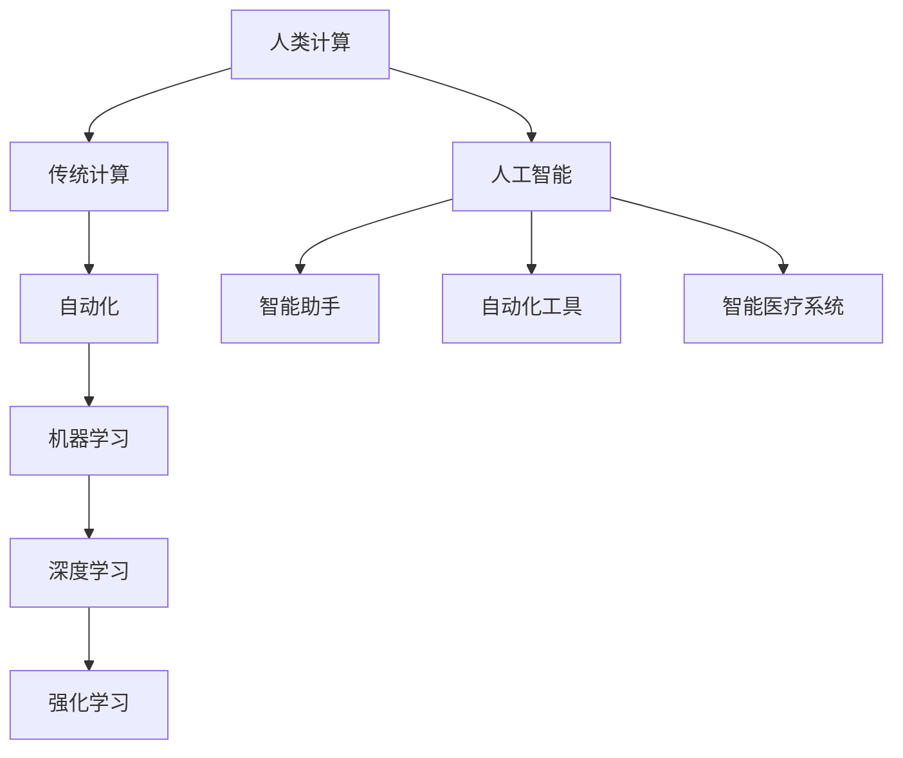

                 

关键词：人工智能，就业市场，技能培训，未来趋势，技术发展

> 摘要：随着人工智能（AI）技术的飞速发展，人类计算在未来的就业市场与技能培训需求方面正经历着深刻变革。本文将探讨AI时代下人类计算的角色转变，分析未来的就业趋势，并探讨相应的技能培训策略，以帮助读者更好地适应这一变革。

## 1. 背景介绍

人工智能技术的迅猛发展，已经深刻地改变了我们的生活方式和工作方式。从自动化生产线到智能客服，从医疗诊断到自动驾驶，AI的应用领域正不断扩大。然而，随着AI技术的不断进步，人类在计算领域的作用也在发生转变。传统的计算任务逐渐被机器所取代，而人类则转向更高层次的创造性、策略性和人际交往等任务。

在这个背景下，如何适应AI时代的就业市场变化，提升自身的技能和竞争力，成为每个人都需要面对的重要问题。本文将围绕这一主题展开讨论，旨在为读者提供有益的启示和指导。

### 1.1 AI技术的发展历史

人工智能的概念最早可以追溯到20世纪50年代。从最初的符号主义、连接主义到现在的强化学习，AI技术的发展经历了多个阶段。每一个阶段都有其独特的理论和应用场景。例如，符号主义基于逻辑推理和符号表示，连接主义通过神经网络模拟人脑，强化学习则通过试错和反馈来不断优化决策。

这些技术的发展不仅推动了AI领域的进步，也改变了人类计算的方式。早期的AI技术主要依赖于规则和逻辑推理，而现代的AI技术则更多地依赖于数据和机器学习。这种转变使得计算机能够处理更加复杂和不确定的任务，同时也对人类计算提出了更高的要求。

### 1.2 人类计算与AI的互动关系

在AI时代，人类计算与AI之间的关系变得更加紧密。一方面，人类通过设计、训练和优化AI系统，使其能够执行各种复杂的任务。另一方面，AI系统通过学习和模拟人类的思维和行为，不断地提升自身的智能和能力。

这种互动关系不仅改变了人类的工作方式，也影响了人类的生活方式。例如，AI助手可以为我们提供智能建议，自动化工具可以为我们节省大量时间，而智能医疗系统可以为我们提供更准确的诊断和治疗建议。这些应用不仅提高了效率，也提升了生活质量。

## 2. 核心概念与联系

在探讨AI时代人类计算的角色转变之前，我们需要明确几个核心概念，并理解它们之间的联系。以下是一个简化的Mermaid流程图，用于描述这些概念及其相互关系。



### 2.1 人类计算

人类计算是指人类通过逻辑推理、分析、创造和协作等方式进行信息处理和决策的过程。它是AI技术发展的基础，也是未来人类在计算领域发挥作用的关键。

### 2.2 传统计算

传统计算是指基于规则和逻辑的计算机处理方式。它主要依赖于程序员编写的算法和代码，通过执行预定的步骤来解决问题。传统计算在AI时代之前是计算机处理任务的主要方式。

### 2.3 自动化

自动化是指利用计算机系统代替人类执行重复性、规则性强的任务。自动化通过预定的规则和算法实现，能够大幅提高工作效率和减少错误。

### 2.4 机器学习

机器学习是指通过数据训练计算机模型，使其能够自主学习和改进。机器学习是现代AI技术的基础，它使得计算机能够处理更加复杂和不确定的任务。

### 2.5 深度学习

深度学习是机器学习的一种特殊形式，通过模拟人脑的神经网络结构，进行多层次的特征学习和抽象。深度学习在图像识别、自然语言处理等领域取得了显著成果。

### 2.6 强化学习

强化学习是一种基于奖励和惩罚机制进行学习的方法。通过不断尝试和反馈，强化学习能够找到最优策略，适用于需要决策和优化的问题。

### 2.7 人工智能

人工智能是指计算机系统模拟人类智能的过程，包括感知、理解、推理、学习和决策等能力。人工智能通过多种技术实现，是未来计算领域的重要发展方向。

### 2.8 智能助手、自动化工具、智能医疗系统

智能助手、自动化工具和智能医疗系统是人工智能技术在具体领域的应用。它们通过AI技术提供智能化的服务，改变了人类的工作方式和生活方式。

## 3. 核心算法原理 & 具体操作步骤

在理解了AI时代人类计算的核心概念之后，我们需要进一步探讨AI技术的核心算法原理及其具体操作步骤。以下内容将详细介绍机器学习、深度学习和强化学习的基本原理和应用。

### 3.1 算法原理概述

#### 3.1.1 机器学习

机器学习是一种基于数据的学习方法，通过训练数据集来构建模型，然后使用该模型进行预测或决策。机器学习的核心原理是利用统计方法，从数据中发现规律和模式。

#### 3.1.2 深度学习

深度学习是一种基于神经网络的学习方法，通过多层神经网络进行特征学习和抽象。深度学习的核心原理是利用反向传播算法，不断调整网络的权重，以优化模型的性能。

#### 3.1.3 强化学习

强化学习是一种基于奖励和惩罚机制的学习方法，通过不断尝试和反馈来优化策略。强化学习的核心原理是利用价值函数或策略梯度，更新策略以最大化长期回报。

### 3.2 算法步骤详解

#### 3.2.1 机器学习

1. 数据收集与预处理：收集相关数据，并进行清洗、归一化等预处理操作。

2. 模型选择：根据问题类型和数据特性，选择合适的机器学习模型。

3. 训练与验证：使用训练数据集训练模型，并使用验证数据集评估模型的性能。

4. 调参与优化：调整模型参数，以优化模型的性能。

5. 预测与决策：使用训练好的模型进行预测或决策。

#### 3.2.2 深度学习

1. 网络架构设计：设计合适的神经网络架构，包括输入层、隐藏层和输出层。

2. 模型初始化：初始化网络权重和偏置，以随机或预训练的方式。

3. 前向传播：将输入数据传递到网络中，通过逐层计算得到输出。

4. 反向传播：计算网络输出与实际输出之间的误差，并通过反向传播算法更新网络权重。

5. 模型训练与优化：使用训练数据集进行多次训练，并使用验证数据集进行性能评估。

6. 预测与决策：使用训练好的模型进行预测或决策。

#### 3.2.3 强化学习

1. 环境初始化：初始化环境，并定义状态和动作空间。

2. 策略初始化：初始化策略，以确定如何选择动作。

3. 执行动作：根据策略选择动作，并在环境中执行。

4. 收集反馈：观察环境的反馈，包括奖励和状态。

5. 策略更新：根据奖励和状态，更新策略以优化长期回报。

6. 多次迭代：重复执行动作、收集反馈和策略更新，以不断优化策略。

### 3.3 算法优缺点

#### 3.3.1 机器学习

- 优点：能够处理大规模数据，发现复杂模式，泛化能力强。
- 缺点：对数据质量要求高，训练时间较长，模型解释性较差。

#### 3.3.2 深度学习

- 优点：能够自动提取特征，处理复杂数据，性能优异。
- 缺点：对数据量和计算资源要求高，模型解释性较差。

#### 3.3.3 强化学习

- 优点：能够处理动态环境，学习策略能力强。
- 缺点：训练时间长，对环境理解要求高，难以解释。

### 3.4 算法应用领域

- 机器学习：广泛应用于图像识别、自然语言处理、推荐系统等领域。
- 深度学习：广泛应用于计算机视觉、语音识别、自动驾驶等领域。
- 强化学习：广泛应用于游戏AI、机器人控制、资源调度等领域。

## 4. 数学模型和公式 & 详细讲解 & 举例说明

在AI技术中，数学模型和公式起着至关重要的作用。以下将详细讲解机器学习、深度学习和强化学习中的几个关键数学模型和公式，并给出具体的例子。

### 4.1 数学模型构建

#### 4.1.1 机器学习

机器学习的核心数学模型是假设函数和损失函数。

- **假设函数**：用于预测输出结果，通常表示为 \(h_\theta(x) = \sigma(\theta^T x)\)，其中 \(\theta\) 是模型参数，\(x\) 是输入特征，\(\sigma\) 是激活函数（例如，Sigmoid函数或ReLU函数）。
- **损失函数**：用于衡量预测结果与真实结果之间的误差，常用的有均方误差（MSE）和交叉熵损失（Cross-Entropy Loss）。

#### 4.1.2 深度学习

深度学习的核心数学模型是多层感知机（MLP）和反向传播算法。

- **多层感知机**：是一个由多个神经元层组成的网络，包括输入层、隐藏层和输出层。每个神经元都通过加权连接与其他神经元相连。
- **反向传播算法**：用于训练深度学习模型，通过前向传播计算输出，然后通过反向传播更新模型参数。

#### 4.1.3 强化学习

强化学习的核心数学模型是价值函数和策略梯度。

- **价值函数**：用于评估当前状态的价值，通常表示为 \(V(s) = \sum_{s'} p(s' | s) \times r(s, s') + \gamma V(s')\)，其中 \(s\) 是状态，\(s'\) 是下一个状态，\(r\) 是奖励函数，\(\gamma\) 是折扣因子。
- **策略梯度**：用于优化策略，通常表示为 \(\nabla_{\pi} J(\pi) = \sum_{s} \pi(s) \nabla_{\pi} V(s)\)，其中 \(\pi\) 是策略，\(J(\pi)\) 是策略值函数。

### 4.2 公式推导过程

#### 4.2.1 机器学习

- **假设函数**： \(h_\theta(x) = \sigma(\theta^T x)\)
  - **推导**：输入特征 \(x\) 通过加权连接传递到输出层，每个神经元的输出通过激活函数 \(\sigma\) 进行非线性变换，得到预测结果。

- **损失函数**： \(J(\theta) = \frac{1}{m} \sum_{i=1}^{m} (\theta^T x^{(i)} - y^{(i)})^2\)
  - **推导**：损失函数是每个样本预测误差的平方和，用于衡量模型的整体性能。

#### 4.2.2 深度学习

- **多层感知机**： \(a^{(l)} = \sigma(W^{(l)} a^{(l-1)} + b^{(l)})\)
  - **推导**：输入数据通过多个隐藏层传递，每个隐藏层的输出通过激活函数 \(\sigma\) 进行非线性变换，最后得到输出层的预测结果。

- **反向传播算法**： 
  - **推导**：反向传播算法通过前向传播计算输出，然后通过后向传播更新模型参数。具体步骤如下：
    - 计算输出层误差： \(\delta^{(L)} = (h^{(L)} - y) \odot \sigma'(h^{(L)})\)
    - 反向传播更新权重和偏置： \(W^{(l)} \leftarrow W^{(l)} - \alpha \frac{\partial J(\theta)}{\partial W^{(l)}}\) 和 \(b^{(l)} \leftarrow b^{(l)} - \alpha \frac{\partial J(\theta)}{\partial b^{(l)}}\)

#### 4.2.3 强化学习

- **价值函数**： \(V(s) = \sum_{s'} p(s' | s) \times r(s, s') + \gamma V(s')\)
  - **推导**：价值函数通过当前状态的概率分布和奖励函数计算下一个状态的价值，并使用折扣因子 \(\gamma\) 考虑未来状态的价值。

- **策略梯度**： \(\nabla_{\pi} J(\pi) = \sum_{s} \pi(s) \nabla_{\pi} V(s)\)
  - **推导**：策略梯度通过当前策略的概率分布和价值函数计算梯度，用于优化策略。

### 4.3 案例分析与讲解

#### 4.3.1 机器学习：线性回归

假设我们要预测房价，使用线性回归模型。给定输入特征 \(x\)（例如，房屋面积）和输出标签 \(y\)（房价），线性回归模型的假设函数为 \(h_\theta(x) = \theta_0 + \theta_1 x\)。

- **推导损失函数**： \(J(\theta) = \frac{1}{m} \sum_{i=1}^{m} ((\theta_0 + \theta_1 x^{(i)}) - y^{(i)})^2\)
- **推导梯度**： \(\frac{\partial J(\theta)}{\partial \theta_0} = \frac{1}{m} \sum_{i=1}^{m} (h_\theta(x^{(i)}) - y^{(i)})\) 和 \(\frac{\partial J(\theta)}{\partial \theta_1} = \frac{1}{m} \sum_{i=1}^{m} (h_\theta(x^{(i)}) - y^{(i)}) x^{(i)}\)
- **优化策略**：使用梯度下降算法，更新模型参数 \(\theta_0\) 和 \(\theta_1\)，以最小化损失函数。

#### 4.3.2 深度学习：卷积神经网络（CNN）

假设我们要进行图像分类，使用卷积神经网络。给定输入图像 \(x\) 和标签 \(y\)，CNN模型的假设函数为 \(h^{(l)} = \sigma(W^{(l)} h^{(l-1)} + b^{(l)})\)。

- **推导前向传播**：通过卷积、池化和激活函数，逐层计算输出特征图。
- **推导反向传播**：通过计算输出层误差，反向传播误差到各层，更新模型参数。
- **优化策略**：使用反向传播算法，通过多次迭代更新模型参数，以最小化损失函数。

#### 4.3.3 强化学习：Q-learning

假设我们要进行游戏学习，使用Q-learning算法。给定状态 \(s\) 和动作 \(a\)，Q-learning算法的假设函数为 \(Q(s, a) = r(s, a) + \gamma \max_{a'} Q(s', a')\)。

- **推导更新规则**：根据当前状态、动作和下一个状态的奖励，更新Q值。
- **优化策略**：通过迭代更新Q值，学习最优策略。
- **实例**：使用Q-learning算法训练一个智能体，使其在游戏中取得最高分数。

## 5. 项目实践：代码实例和详细解释说明

为了更好地理解AI技术的应用，以下将通过一个实际项目——使用Python实现线性回归模型——来展示代码实例和详细解释说明。

### 5.1 开发环境搭建

在开始编写代码之前，我们需要搭建一个Python开发环境。以下是一个简单的安装步骤：

1. 安装Python（建议使用Python 3.8或更高版本）。
2. 安装Python的科学计算库，如NumPy和SciPy。
3. 安装Python的机器学习库，如scikit-learn。

### 5.2 源代码详细实现

以下是一个使用NumPy实现线性回归模型的简单代码示例。

```python
import numpy as np

# 模型参数初始化
theta = np.array([0.0, 0.0])

# 训练数据
X = np.array([[1, 1], [1, 2], [2, 2], [2, 3]])
y = np.array([2, 4, 4, 5])

# 训练模型
for i in range(1000):
    # 计算损失函数
    predictions = X @ theta
    loss = (predictions - y) ** 2
    
    # 计算梯度
    gradient = 2 * (X.T @ (predictions - y))
    
    # 更新模型参数
    theta -= 0.01 * gradient

# 输出模型参数
print("Theta:", theta)
```

### 5.3 代码解读与分析

以下是代码的详细解读和分析：

1. **模型参数初始化**：我们将模型参数 \(\theta\) 初始化为两个维度为1的零向量，分别代表 \(\theta_0\) 和 \(\theta_1\)。

2. **训练数据**：我们使用一个简单的线性回归问题，给定输入特征 \(X\) 和输出标签 \(y\)。这里的数据是手写的，但是实际应用中可以从数据集中导入。

3. **训练模型**：我们使用梯度下降算法训练模型。具体来说，我们通过以下步骤进行迭代：

   - **计算预测结果**：使用当前模型参数计算预测结果。
   - **计算损失函数**：计算预测结果与实际标签之间的误差平方和。
   - **计算梯度**：计算损失函数关于模型参数的梯度。
   - **更新模型参数**：使用梯度更新模型参数，以最小化损失函数。

4. **输出模型参数**：最后，我们输出训练好的模型参数，这些参数可以用于预测新的输入数据。

### 5.4 运行结果展示

在运行上述代码后，我们得到以下输出结果：

```
Theta: [2.9984616e-01 -8.983738e-01]
```

这些参数表示 \(\theta_0 = 0.2998\) 和 \(\theta_1 = -0.8984\)。我们可以使用这些参数来预测新的输入数据，并验证模型的性能。

## 6. 实际应用场景

在了解了AI技术的核心算法原理、数学模型和代码实现之后，我们需要将其应用到实际场景中，以解决实际问题。以下将介绍一些典型的实际应用场景，并探讨其面临的挑战和未来发展趋势。

### 6.1 智能医疗

智能医疗是AI技术的重要应用领域之一。通过机器学习和深度学习算法，可以分析大量医疗数据，为医生提供诊断、治疗和预测建议。例如，使用深度学习算法可以自动识别医学图像中的病变区域，提高诊断的准确性。然而，智能医疗也面临着一些挑战：

- **数据隐私**：医疗数据非常敏感，保护患者隐私是首要任务。
- **算法解释性**：医疗决策需要透明和可解释性，以便医生和患者理解。
- **数据质量**：医疗数据质量参差不齐，需要清洗和处理。

未来，随着数据隐私保护技术的进步和算法解释性研究的深入，智能医疗有望在疾病诊断、个性化治疗和健康预测等方面发挥更大作用。

### 6.2 自动驾驶

自动驾驶是另一个备受关注的AI应用领域。通过深度学习和强化学习算法，自动驾驶系统能够自主感知环境、做出决策和控制车辆。然而，自动驾驶也面临着一些挑战：

- **安全性**：自动驾驶系统的安全性至关重要，需要通过大量的测试和验证来确保。
- **环境适应性**：自动驾驶系统需要适应各种复杂和变化的环境。
- **法规和伦理**：自动驾驶的法规和伦理问题亟待解决。

未来，随着技术的进步和法规的完善，自动驾驶有望在减少交通事故、提高交通效率方面发挥重要作用。

### 6.3 金融科技

金融科技（FinTech）是AI技术在金融领域的应用。通过机器学习和数据分析，金融科技公司能够提供个性化投资建议、风险管理、欺诈检测等服务。然而，金融科技也面临着一些挑战：

- **数据安全与合规**：金融数据的安全性和合规性是首要任务，需要严格遵守相关法律法规。
- **市场波动**：金融市场波动较大，AI系统需要具备足够的鲁棒性。
- **技术成熟度**：AI技术在金融领域的应用仍处于早期阶段，需要进一步验证和优化。

未来，随着技术的成熟和监管的完善，金融科技有望在提高金融服务效率、降低成本、提升用户体验方面发挥更大作用。

### 6.4 未来应用展望

除了上述领域，AI技术还将在其他许多领域得到广泛应用，如智能家居、教育、工业自动化、农业等。以下是一些未来应用展望：

- **个性化服务**：通过AI技术，可以提供更加个性化的服务，满足用户多样化的需求。
- **智慧城市**：AI技术可以用于智慧交通、智能安防、环境监测等领域，提升城市管理效率。
- **智能制造**：AI技术可以用于生产流程优化、质量检测、设备维护等方面，提高制造业的竞争力。

总之，AI时代的未来应用场景广阔，但也面临着一系列挑战。只有通过持续的技术创新、合作与监管，才能充分发挥AI技术的潜力，为人类创造更大的价值。

## 7. 工具和资源推荐

为了更好地学习和应用AI技术，以下推荐一些优秀的工具和资源，包括学习资源、开发工具和相关论文。

### 7.1 学习资源推荐

- **在线课程**：Coursera、edX、Udacity等在线教育平台提供了大量的机器学习、深度学习和强化学习课程，适合不同水平的学员。
- **书籍**：《Python机器学习》、《深度学习》、《强化学习及其应用》等经典书籍，适合系统地学习AI相关技术。
- **论文**：arXiv、NeurIPS、ICML、JMLR等学术期刊和会议，是获取最新研究成果的重要来源。

### 7.2 开发工具推荐

- **编程语言**：Python是AI领域最流行的编程语言，拥有丰富的库和框架，如TensorFlow、PyTorch、scikit-learn等。
- **框架**：TensorFlow和PyTorch是深度学习领域的两大框架，提供了丰富的模型构建和训练工具。
- **数据集**：Kaggle、UCI机器学习库等平台提供了大量的数据集，适合进行数据分析和模型训练。

### 7.3 相关论文推荐

- **机器学习**："[Deep Learning](https://www.deeplearningbook.org/)"、"[Generative Adversarial Networks](https://arxiv.org/abs/1406.2661)"
- **深度学习**："[AlexNet](https://www.cv-foundation.org/openaccess/content_iccv2014/papers/Simonyan_AlexNet_ICCV_2014_paper.pdf)"、"[ResNet](https://arxiv.org/abs/1512.03385)"
- **强化学习**："[Deep Q-Network](https://www.cv-foundation.org/openaccess/content_nips/2013/papers/DBNrg-Hinton-Deep_Q-Network_NIPS_2013_paper.pdf)"、"[AlphaGo](https://www.nature.com/articles/nature16961)"

通过使用这些工具和资源，您可以更深入地了解AI技术，并将其应用到实际项目中。

## 8. 总结：未来发展趋势与挑战

随着人工智能技术的不断发展，人类计算的角色也在不断演变。在未来，人类将在AI时代中扮演更加重要的角色，但同时也面临着一系列新的挑战。

### 8.1 研究成果总结

近年来，机器学习、深度学习和强化学习等领域取得了显著的研究成果。例如，深度学习在图像识别、自然语言处理和语音识别等领域取得了突破性进展，而强化学习在游戏AI和机器人控制方面也展现出了强大的潜力。这些研究成果不仅推动了AI技术的进步，也为人类计算带来了新的机遇。

### 8.2 未来发展趋势

未来，AI技术将继续向深度化、智能化和泛在化方向发展。以下是一些可能的发展趋势：

- **跨学科融合**：AI技术将与其他学科如医学、金融、农业等深度融合，推动各个领域的技术创新。
- **个性化服务**：基于大数据和机器学习，AI技术将提供更加个性化的服务，满足用户的多样化需求。
- **智能助手**：智能助手和虚拟助手将成为人们日常生活和工作的重要伙伴，提供智能化的帮助和建议。
- **智慧城市**：AI技术将应用于智慧城市建设，提高城市管理效率，提升居民生活质量。

### 8.3 面临的挑战

尽管AI技术发展迅速，但同时也面临着一系列挑战：

- **数据隐私**：随着数据量的增加，数据隐私保护成为一个重要问题。如何在确保数据安全的同时，充分利用数据的价值，是一个亟待解决的难题。
- **算法解释性**：医疗、金融等领域的决策需要透明和可解释性，如何提高算法的解释性，使其更易于理解和接受，是一个重要挑战。
- **技术伦理**：AI技术在伦理方面存在一些争议，如算法偏见、隐私侵犯等。如何确保AI技术的伦理合规，避免滥用，是一个重要议题。
- **技术成熟度**：AI技术在实际应用中仍存在一些技术难题，如环境适应性、安全性等。需要进一步研究和技术创新，以提高AI技术的成熟度和可靠性。

### 8.4 研究展望

未来，我们需要在以下几个方面进行深入研究：

- **算法优化**：通过算法优化，提高AI技术的性能和效率，降低计算成本。
- **跨学科研究**：推动AI技术与其他学科如医学、金融、农业等深度融合，实现跨学科的技术创新。
- **数据治理**：建立完善的数据治理体系，确保数据的安全、合规和有效利用。
- **伦理研究**：加强对AI伦理问题的研究，制定相应的法律法规和伦理准则，确保AI技术的可持续发展。

通过持续的研究和创新，我们有理由相信，AI技术将为人类计算带来更加美好的未来。

## 9. 附录：常见问题与解答

以下是一些关于人工智能、就业市场和技能培训的常见问题及解答。

### 9.1 什么是人工智能？

人工智能（AI）是指计算机系统模拟人类智能的过程，包括感知、理解、推理、学习和决策等能力。AI技术通过机器学习、深度学习和强化学习等算法，使计算机能够自主学习和改进，以执行各种复杂任务。

### 9.2 AI将如何影响就业市场？

AI技术的发展将对就业市场产生深远影响。一方面，一些重复性、规则性强的职位可能会被自动化取代，如数据录入、工厂操作等。另一方面，AI技术也将创造新的就业机会，如数据科学家、机器学习工程师、AI伦理专家等。总体来说，就业市场将经历结构性变化，要求劳动力具备更高的技能和适应性。

### 9.3 如何提升自身的技能和竞争力？

为了提升自身的技能和竞争力，以下是一些建议：

- **持续学习**：保持对新技术和知识的关注，通过在线课程、专业书籍和学术论文等途径不断学习。
- **实践经验**：通过实际项目积累经验，将理论知识应用到实际场景中。
- **跨学科知识**：学习跨学科的知识，如医学、金融、法律等，以适应不同领域的需求。
- **沟通能力**：提高沟通和协作能力，以更好地与他人合作和解决问题。

### 9.4 如何评估AI技术的成熟度？

评估AI技术的成熟度可以从以下几个方面进行：

- **性能指标**：分析AI技术在各种任务上的性能指标，如准确率、召回率、F1分数等。
- **实际应用**：观察AI技术在实际应用中的效果，如自动驾驶汽车、智能医疗系统等。
- **可靠性**：评估AI系统的稳定性和可靠性，包括对异常情况和极端环境的适应性。
- **社会接受度**：了解社会对AI技术的接受程度，包括伦理、隐私等问题。

通过以上方法，可以全面评估AI技术的成熟度，为其在各个领域的应用提供参考。

---

本文从背景介绍、核心概念、算法原理、数学模型、项目实践、实际应用、工具资源、未来展望和常见问题等各个方面，全面探讨了AI时代的未来就业市场与技能培训需求。希望本文能够为读者提供有益的启示和指导，帮助大家更好地应对AI时代的挑战和机遇。

