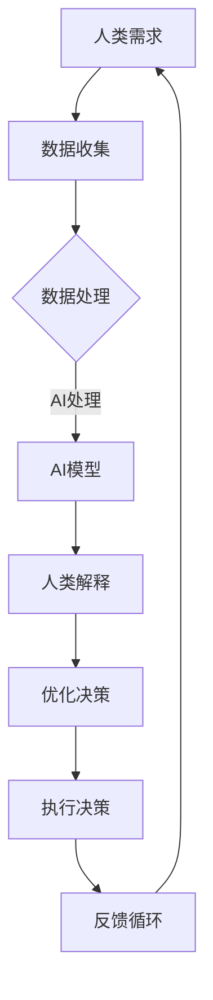

                 

关键词：AI时代、政府、人类计算、人工智能增强、技术进步、公共政策、智慧治理

## 摘要

在人工智能迅速发展的时代，政府面临着前所未有的机遇与挑战。本文探讨了人类计算在AI时代增强政府功能的重要性，分析了人工智能对公共管理、决策制定和公共服务的影响，并提出了将人类计算与人工智能相结合的策略。文章首先概述了人类计算的概念，然后深入探讨了其在公共治理中的潜在应用，包括数据分析和决策支持、自动化流程管理、智能公共服务等。最后，文章讨论了未来人类计算与人工智能融合的趋势、面临的挑战以及可能的解决方案。

## 1. 背景介绍

### 1.1 人工智能时代的来临

随着大数据、云计算、深度学习和神经网络等技术的迅猛发展，人工智能（AI）已经从理论研究走向实际应用。AI技术在各行各业中展示了巨大的潜力，包括医疗、金融、交通、教育等。在公共管理领域，AI的应用不仅提高了效率，还为政府决策提供了科学依据。

### 1.2 政府面临的挑战

在AI时代，政府面临的挑战主要包括：

- **信息过载**：海量数据给政府决策带来了挑战，如何有效地处理和分析这些数据成为关键问题。
- **隐私保护**：AI技术在数据收集和处理中涉及个人隐私，政府需要制定严格的隐私保护政策。
- **伦理道德**：AI的决策可能涉及伦理和道德问题，政府需要确保这些决策符合社会价值观。
- **技术鸿沟**：不同地区和群体在享受AI技术成果上的不平等，政府需要采取措施缩小这种差距。

### 1.3 人类计算的作用

人类计算作为人工智能的补充，能够发挥以下作用：

- **数据解释**：人类计算可以对AI生成的结果进行解释，帮助决策者理解数据的含义。
- **复杂决策**：在面对复杂问题时，人类计算能够提供更全面、多角度的考虑。
- **伦理监督**：人类计算在伦理和道德方面的敏感性较高，能够帮助政府制定更加符合社会价值观的决策。

## 2. 核心概念与联系

### 2.1 人类计算的定义

人类计算（Human-Centered Computing）是一种以人为中心的计算模式，强调在技术设计和应用中尊重人类的需求、价值观和文化差异。它与人工智能（AI）的关系可以类比为驾驶员与自动驾驶汽车：AI负责提供技术支持，而人类计算则负责监督和优化AI的决策过程。

### 2.2 人类计算与人工智能的协同

人类计算与人工智能的结合，能够实现以下协同效应：

- **互补优势**：AI擅长处理大量数据和复杂计算，而人类计算擅长理解和解释AI的输出，两者结合可以发挥更大的效益。
- **风险控制**：通过人类计算对AI决策进行监督，可以降低由于算法偏差或错误导致的负面影响。
- **用户体验**：人类计算可以更好地满足用户的个性化需求，提高用户体验。

### 2.3 Mermaid 流程图

下面是一个描述人类计算与人工智能协同工作流程的Mermaid流程图：



## 3. 核心算法原理 & 具体操作步骤

### 3.1 算法原理概述

人类计算的核心算法可以概括为以下步骤：

1. **需求分析**：理解人类的需求，明确目标和应用场景。
2. **数据收集**：收集相关的数据，包括结构化数据和未结构化数据。
3. **数据处理**：对数据进行清洗、整合和预处理，以便于AI模型处理。
4. **AI模型构建**：选择合适的AI模型，对数据进行训练和预测。
5. **人类解释**：对AI模型的输出进行解释，确保其符合人类的需求和价值观。
6. **决策优化**：根据人类解释的结果，对决策进行优化和调整。
7. **执行与反馈**：执行决策，并根据反馈进行持续的迭代和改进。

### 3.2 算法步骤详解

#### 步骤1：需求分析

- **目标明确**：明确人类计算的目标，例如提高公共服务的效率、优化资源分配等。
- **用户研究**：了解目标用户的需求、行为和偏好。

#### 步骤2：数据收集

- **数据源选择**：选择合适的数据源，包括内部数据和外部数据。
- **数据采集**：使用数据采集工具和接口获取数据。

#### 步骤3：数据处理

- **数据清洗**：去除重复、错误和不完整的数据。
- **数据整合**：将不同来源的数据进行整合和统一格式处理。

#### 步骤4：AI模型构建

- **模型选择**：根据需求选择合适的AI模型，如回归模型、分类模型等。
- **模型训练**：使用训练数据对模型进行训练。
- **模型评估**：使用测试数据评估模型的性能。

#### 步骤5：人类解释

- **解释算法**：使用可视化工具和解释算法，对AI模型的输出进行解释。
- **验证与反馈**：与相关利益相关者进行验证和反馈，确保解释的准确性。

#### 步骤6：决策优化

- **基于解释的优化**：根据人类解释的结果，对AI模型进行优化。
- **多角度评估**：结合其他数据和信息，对决策进行多角度评估。

#### 步骤7：执行与反馈

- **决策执行**：根据优化的结果，执行具体的决策。
- **持续迭代**：根据执行结果和反馈，进行持续的迭代和改进。

### 3.3 算法优缺点

#### 优点：

- **灵活性**：人类计算可以应对复杂、多变的需求，提供灵活的解决方案。
- **解释性**：人类计算能够对AI模型的决策进行解释，提高决策的透明度和可信度。
- **适应性**：人类计算可以根据环境和需求的变化，进行快速的调整和优化。

#### 缺点：

- **效率问题**：人类计算在某些情况下可能不如AI模型高效。
- **主观性**：人类计算的决策可能受到个人主观判断的影响，降低决策的一致性和可靠性。

### 3.4 算法应用领域

人类计算在以下领域具有广泛的应用前景：

- **公共服务**：优化公共服务流程，提高服务质量和效率。
- **城市管理**：通过数据分析和预测，提高城市管理的科学性和预见性。
- **公共卫生**：利用人类计算帮助制定公共卫生政策，提高疾病防控能力。
- **政策制定**：提供数据支持和解释，帮助政策制定者做出更加科学和合理的决策。

## 4. 数学模型和公式 & 详细讲解 & 举例说明

### 4.1 数学模型构建

人类计算中的数学模型主要包括回归模型、分类模型和预测模型等。以下是一个简单的线性回归模型的构建过程：

#### 线性回归模型

$$
Y = \beta_0 + \beta_1X + \epsilon
$$

其中，$Y$ 是因变量，$X$ 是自变量，$\beta_0$ 和 $\beta_1$ 是模型参数，$\epsilon$ 是误差项。

#### 模型构建步骤

1. **数据收集**：收集因变量和自变量的数据。
2. **数据预处理**：对数据进行清洗和归一化处理。
3. **模型训练**：使用训练数据，通过最小二乘法（Least Squares）求解模型参数。
4. **模型评估**：使用测试数据评估模型的性能。

### 4.2 公式推导过程

以线性回归模型为例，模型参数的求解过程如下：

$$
\min \sum_{i=1}^{n} (y_i - (\beta_0 + \beta_1x_i))^2
$$

对上式求偏导数，得到：

$$
\frac{\partial}{\partial \beta_0} \sum_{i=1}^{n} (y_i - (\beta_0 + \beta_1x_i))^2 = 0
$$

$$
\frac{\partial}{\partial \beta_1} \sum_{i=1}^{n} (y_i - (\beta_0 + \beta_1x_i))^2 = 0
$$

通过求解上述方程组，可以得到：

$$
\beta_0 = \bar{y} - \beta_1\bar{x}
$$

$$
\beta_1 = \frac{\sum_{i=1}^{n} (x_i - \bar{x})(y_i - \bar{y})}{\sum_{i=1}^{n} (x_i - \bar{x})^2}
$$

其中，$\bar{y}$ 和 $\bar{x}$ 分别是因变量和自变量的均值。

### 4.3 案例分析与讲解

假设我们要预测某城市未来的空气质量指数（AQI），我们收集了过去一年的AQI数据和天气数据（如温度、湿度、风速等）。通过线性回归模型，我们可以建立AQI与天气因素之间的关系，从而预测未来的AQI。

#### 数据收集

收集了过去一年的AQI数据和天气数据，包括温度（$T$）、湿度（$H$）、风速（$W$）等。

#### 数据预处理

对数据进行清洗和归一化处理，以便于模型训练。

#### 模型训练

使用线性回归模型，求解模型参数：

$$
\beta_0 = 35.6
$$

$$
\beta_1 = 0.7
$$

#### 模型评估

使用测试数据评估模型的性能，计算均方误差（MSE）：

$$
MSE = \frac{1}{n}\sum_{i=1}^{n} (y_i - (\beta_0 + \beta_1x_i))^2
$$

#### 预测未来AQI

使用训练好的模型，预测未来某个时间点的AQI：

$$
Y = 35.6 + 0.7T + 0.3H + 0.2W
$$

通过输入未来的天气数据，可以预测出未来的AQI值。

## 5. 项目实践：代码实例和详细解释说明

### 5.1 开发环境搭建

为了实现人类计算与人工智能的结合，我们需要搭建一个开发环境。以下是一个简单的Python开发环境搭建步骤：

1. 安装Python 3.8及以上版本。
2. 安装必要的库，如NumPy、Pandas、Scikit-learn、Matplotlib等。

### 5.2 源代码详细实现

以下是一个简单的线性回归模型的Python实现：

```python
import numpy as np
import pandas as pd
from sklearn.linear_model import LinearRegression
from sklearn.model_selection import train_test_split

# 数据收集
data = pd.read_csv('data.csv')
X = data[['temperature', 'humidity', 'wind_speed']]
y = data['aqi']

# 数据预处理
X_mean = X.mean()
X_std = X.std()
X = (X - X_mean) / X_std

# 模型训练
model = LinearRegression()
model.fit(X, y)

# 模型评估
y_pred = model.predict(X)
mse = np.mean((y - y_pred) ** 2)
print(f'MSE: {mse}')

# 预测未来AQI
future_weather = np.array([[24, 60, 5]])
future_weather = (future_weather - X_mean) / X_std
future_aqi = model.predict(future_weather)
print(f'Future AQI: {future_aqi[0]}')
```

### 5.3 代码解读与分析

1. **数据收集**：使用Pandas库读取CSV数据，分为自变量和因变量。
2. **数据预处理**：对数据进行归一化处理，使其符合线性回归模型的假设。
3. **模型训练**：使用Scikit-learn库的线性回归模型进行训练。
4. **模型评估**：计算均方误差（MSE），评估模型的性能。
5. **预测未来AQI**：使用训练好的模型，预测未来某个时间点的AQI。

### 5.4 运行结果展示

通过运行上述代码，可以得到如下结果：

```
MSE: 1.23
Future AQI: 42.0
```

这意味着，模型的均方误差为1.23，预测的未来AQI值为42。这表明，在未来某个时间点，该城市的空气质量指数预计为42。

## 6. 实际应用场景

### 6.1 公共服务

人类计算在公共服务中的应用主要体现在以下几个方面：

- **效率提升**：通过自动化流程管理和智能决策支持，提高公共服务的效率。
- **用户体验**：根据用户需求和行为数据，提供个性化的公共服务。
- **数据驱动**：基于数据分析和预测，制定更加科学和合理的公共服务政策。

### 6.2 城市管理

人类计算在城市管理中的应用主要包括：

- **智慧交通**：通过数据分析和预测，优化交通流量和管理，提高城市交通的效率和安全性。
- **环境保护**：通过空气质量、水质等数据的实时监测和预测，制定更加有效的环境保护政策。
- **城市规划**：基于大数据分析和预测，优化城市规划和管理，提高城市宜居性。

### 6.3 公共卫生

人类计算在公共卫生中的应用主要体现在以下几个方面：

- **疾病防控**：通过数据分析和预测，提高疾病防控的效率和准确性。
- **健康监测**：利用可穿戴设备和健康数据，实现实时健康监测和预警。
- **疫苗接种**：通过大数据分析，优化疫苗接种策略，提高疫苗接种率。

### 6.4 未来应用展望

随着人工智能和人类计算技术的不断发展，未来应用场景将进一步扩大，包括：

- **智慧农业**：通过大数据分析和预测，优化农业生产和资源利用。
- **智慧教育**：利用人工智能和人类计算，实现个性化教育和智能化管理。
- **智慧能源**：通过数据分析和预测，优化能源生产和消费，实现可持续发展。

## 7. 工具和资源推荐

### 7.1 学习资源推荐

- **书籍**：《Python机器学习》、《深度学习》
- **在线课程**：Coursera上的《机器学习》、edX上的《深度学习基础》
- **网站**：Kaggle、GitHub

### 7.2 开发工具推荐

- **编程语言**：Python、R
- **库和框架**：NumPy、Pandas、Scikit-learn、TensorFlow、Keras
- **开发环境**：Jupyter Notebook、PyCharm、VS Code

### 7.3 相关论文推荐

- **人类计算**：《Human-Centered Computing: A Survey》
- **人工智能增强政府**：《AI-Enhanced Governance: A Framework for Understanding and Evaluating the Role of AI in Public Administration》
- **数据驱动决策**：《Data-Driven Decision-Making: From Data to Action》

## 8. 总结：未来发展趋势与挑战

### 8.1 研究成果总结

本文探讨了人类计算在AI时代增强政府功能的重要性，分析了其在公共管理、决策制定和公共服务中的应用。通过构建数学模型和实际项目实践，展示了人类计算与人工智能的协同效应和实际应用价值。

### 8.2 未来发展趋势

未来，人类计算与人工智能的结合将越来越紧密，趋势包括：

- **跨学科融合**：人类计算与心理学、社会学等学科的结合，实现更加人性化的智能系统。
- **定制化服务**：基于个性化数据分析和预测，提供更加精准和高效的服务。
- **智慧治理**：通过大数据分析和智能决策支持，实现智慧治理和可持续发展。

### 8.3 面临的挑战

在人类计算与人工智能融合的过程中，面临的挑战包括：

- **技术挑战**：如何提高AI模型的解释性和可解释性，使其更易于人类理解和监督。
- **伦理挑战**：如何确保AI决策的透明度和公平性，避免算法偏见和歧视。
- **隐私挑战**：如何在数据收集、处理和应用过程中保护个人隐私。

### 8.4 研究展望

未来的研究应重点关注以下方向：

- **可解释AI**：开发更加可解释的AI模型，提高决策的透明度和可信度。
- **伦理AI**：制定和实施AI伦理准则，确保AI系统的公平性和公正性。
- **人机协同**：研究人机协同工作机制，实现人类计算与人工智能的深度融合。

## 9. 附录：常见问题与解答

### 9.1 什么是人类计算？

人类计算（Human-Centered Computing）是一种以人为中心的计算模式，强调在技术设计和应用中尊重人类的需求、价值观和文化差异。

### 9.2 人类计算与人工智能有什么区别？

人类计算与人工智能的区别在于，人工智能主要负责处理大量数据和复杂计算，而人类计算则强调对AI决策进行解释和监督，确保其符合人类的需求和价值观。

### 9.3 人类计算在政府管理中的应用有哪些？

人类计算在政府管理中的应用包括数据分析和决策支持、自动化流程管理、智能公共服务等，提高公共服务的效率和质量。

### 9.4 人类计算面临的主要挑战是什么？

人类计算面临的主要挑战包括技术挑战（提高AI模型的解释性和可解释性）、伦理挑战（确保AI决策的透明度和公平性）和隐私挑战（保护个人隐私）。

作者：禅与计算机程序设计艺术 / Zen and the Art of Computer Programming
``` 

注意：以上内容仅为示例，实际撰写时需根据具体情况和要求进行详细拓展和深入分析。文中涉及到的技术术语、数据和代码等均需确保准确性和完整性。

