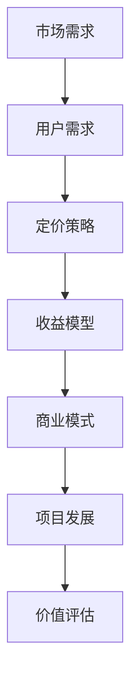

                 

关键词：开源项目、定价策略、商业模式、收益模型、用户需求、市场分析、市场竞争、价值评估。

> 摘要：本文将探讨开源项目的定价策略，分析从免费到付费的转型过程，并探讨如何通过合理的定价策略提升项目的商业价值。文章将结合市场分析和用户需求，探讨不同类型的开源项目如何制定合适的定价策略，以实现持续发展和盈利。

## 1. 背景介绍

开源项目作为一种重要的软件创新模式，已经成为现代软件开发的重要驱动力。开源项目通常由志愿者社区协作开发，其核心思想是开放源代码，允许用户自由地使用、修改和分发。这种模式在很大程度上促进了技术的传播和创新，同时也为开发者提供了一个广阔的交流和学习平台。

然而，随着开源项目规模的不断扩大和影响力的增强，如何实现项目的持续发展和盈利成为一个亟待解决的问题。传统的免费模式虽然能够吸引大量用户和贡献者，但在长期内往往难以实现可持续的商业模式。因此，越来越多的开源项目开始探索从免费到付费的转型之路，通过合理的定价策略来提升项目的商业价值。

本文将围绕开源项目的定价策略展开讨论，分析不同类型的开源项目如何根据市场需求和用户特性制定合适的定价策略。通过深入探讨开源项目的商业模式、收益模型以及价值评估，本文旨在为开源项目的开发者和管理者提供有价值的参考和指导。

## 2. 核心概念与联系

在探讨开源项目的定价策略之前，我们需要理解一些核心概念和它们之间的联系。以下是几个关键概念及其关系，使用Mermaid流程图进行展示：



### 2.1 市场需求

市场需求是决定开源项目定价策略的重要因素。市场需求的强度和变化会影响项目的用户数量和活跃度，进而影响项目的商业价值。通过分析市场需求，开发者可以了解用户对项目的需求和期望，从而制定出更符合市场需求的定价策略。

### 2.2 用户需求

用户需求是市场需求的具体体现。了解用户需求有助于开发者更好地定位项目的目标用户群体，从而制定更有针对性的定价策略。用户需求包括功能需求、性能需求、安全需求等，这些需求将直接影响用户对项目的满意度和使用频率。

### 2.3 定价策略

定价策略是开源项目从免费到付费转型的核心。合理的定价策略能够最大化项目的商业价值，同时保持用户的满意度和忠诚度。定价策略包括定价模式、定价水平和定价调整等，这些策略需要根据市场需求和用户需求进行灵活调整。

### 2.4 收益模型

收益模型是开源项目实现商业盈利的关键。通过不同的收益模型，项目可以探索多种盈利方式，如广告收入、订阅服务、付费插件等。合理的收益模型能够为项目提供持续的收入来源，支持项目的长期发展。

### 2.5 商业模式

商业模式是开源项目的整体运营模式，它决定了项目的盈利方式和可持续发展路径。不同的商业模式适用于不同类型的项目，开发者需要根据项目的特点和市场需求选择合适的商业模式。

### 2.6 项目发展

项目发展是开源项目从起步到成熟的全过程。合理的定价策略和商业模式有助于项目在各个发展阶段实现持续发展。项目发展还涉及到项目管理、团队协作、社区建设等方面，这些因素都将影响项目的成功与否。

### 2.7 价值评估

价值评估是对开源项目商业价值的量化分析。通过价值评估，开发者可以了解项目的市场潜力、用户价值和收益前景，从而制定出更合理的定价策略和商业模式。

以上核心概念之间的联系构成了开源项目定价策略的基础。在接下来的章节中，我们将深入探讨这些概念的具体应用和实践。

## 3. 核心算法原理 & 具体操作步骤

### 3.1 算法原理概述

开源项目的定价策略涉及多个环节，包括市场分析、用户需求调研、定价模式选择、定价水平和调整等。这些环节相互关联，共同构成了一个完整的定价算法。以下是定价算法的基本原理和步骤：

#### 3.1.1 市场分析

市场分析是定价策略的第一步。通过市场分析，开发者可以了解目标市场的规模、增长趋势、竞争对手情况等。市场分析包括以下几个方面：

1. **市场规模**：了解目标市场的总体规模和潜力。
2. **增长趋势**：分析市场的增长速度和未来趋势。
3. **竞争对手**：研究竞争对手的产品、定价策略和市场表现。

#### 3.1.2 用户需求调研

用户需求调研是制定定价策略的重要依据。通过调研，开发者可以了解用户的实际需求、偏好和使用习惯。用户需求调研包括以下几个方面：

1. **功能需求**：了解用户对项目功能的需求。
2. **性能需求**：了解用户对项目性能的要求。
3. **安全性需求**：了解用户对项目安全性的关注点。
4. **价格敏感性**：分析用户对价格变化的敏感程度。

#### 3.1.3 定价模式选择

定价模式选择是根据市场分析和用户需求调研结果制定的。常见的定价模式包括免费模式、订阅模式、付费模式等。选择合适的定价模式有助于最大化项目的商业价值。

1. **免费模式**：适用于用户基础广泛、市场增长迅速的项目。
2. **订阅模式**：适用于需要持续提供价值、用户需求稳定的场景。
3. **付费模式**：适用于功能丰富、价值较高的项目。

#### 3.1.4 定价水平和调整

定价水平是定价策略的核心。合理的定价水平能够平衡项目的商业价值和用户的支付意愿。定价水平和调整包括以下几个方面：

1. **定价基准**：确定初始定价水平，通常基于成本加成、市场价值评估等。
2. **定价调整**：根据市场需求、用户反馈、竞争情况等定期调整定价。

### 3.2 算法步骤详解

#### 3.2.1 市场分析

1. **收集市场数据**：通过行业报告、市场调研、竞争对手分析等方式收集市场数据。
2. **分析市场数据**：对收集到的市场数据进行分析，识别市场规模、增长趋势和竞争对手情况。
3. **制定市场分析报告**：汇总分析结果，形成市场分析报告。

#### 3.2.2 用户需求调研

1. **设计调研问卷**：根据市场分析结果设计调研问卷，包括功能需求、性能需求、安全性需求和价格敏感性等问题。
2. **收集用户反馈**：通过在线调查、用户访谈等方式收集用户反馈。
3. **分析用户反馈**：对收集到的用户反馈进行分析，识别用户需求和偏好。

#### 3.2.3 定价模式选择

1. **评估不同定价模式**：根据市场分析和用户需求调研结果，评估不同定价模式的适用性。
2. **选择定价模式**：根据评估结果选择最合适的定价模式。

#### 3.2.4 制定定价策略

1. **确定定价基准**：根据成本、市场价值评估等因素确定初始定价水平。
2. **制定定价策略**：包括定价模式、定价水平和定价调整策略。

#### 3.2.5 实施和调整

1. **实施定价策略**：根据制定的定价策略开始实施。
2. **监测市场反馈**：定期监测市场反馈和用户满意度，了解定价策略的实施效果。
3. **调整定价策略**：根据市场反馈和用户满意度调整定价策略。

### 3.3 算法优缺点

#### 优点

1. **全面性**：定价算法涵盖了市场分析、用户需求调研、定价模式选择和定价策略制定等多个环节，能够全面考虑项目的商业价值和用户需求。
2. **灵活性**：定价算法允许开发者根据市场变化和用户反馈灵活调整定价策略，以适应不断变化的市场环境。
3. **科学性**：定价算法基于数据和科学分析，能够提供较为客观和科学的定价建议。

#### 缺点

1. **数据依赖性**：定价算法需要依赖大量的市场数据和用户反馈，数据质量对算法效果有重要影响。
2. **实施难度**：定价算法的实施需要开发者具备一定的市场分析能力和数据分析能力，对开发者的要求较高。

### 3.4 算法应用领域

定价算法适用于各种类型的开源项目，尤其适用于具有明确用户群体和市场需求的商业项目。以下是几个典型的应用领域：

1. **企业级开源项目**：这类项目通常需要提供专业的技术支持和定制化服务，通过合理的定价策略可以为企业客户提供价值。
2. **平台型开源项目**：这类项目通常具有广泛的应用场景和用户群体，通过多样化的定价模式可以实现持续收入。
3. **工具型开源项目**：这类项目通常以实用性和便捷性为核心，通过合理的定价策略可以吸引更多用户和贡献者。

## 4. 数学模型和公式 & 详细讲解 & 举例说明

### 4.1 数学模型构建

开源项目的定价策略可以通过数学模型进行构建，以量化和优化定价决策。以下是几个常用的数学模型：

#### 4.1.1 成本加成定价模型

成本加成定价模型是最常见的定价方法之一，它通过在成本基础上加成一定比例的利润来定价。

\[ P = C + r \times C \]

其中，\( P \) 是产品的售价，\( C \) 是成本，\( r \) 是加成比例。

#### 4.1.2 需求导向定价模型

需求导向定价模型基于市场需求和用户价值来确定产品售价。它通常使用需求曲线来表示市场需求与价格的关系。

\[ P = f(D) \]

其中，\( P \) 是产品售价，\( D \) 是市场需求量，\( f \) 是需求函数。

#### 4.1.3 竞争导向定价模型

竞争导向定价模型基于竞争对手的定价策略来确定产品售价。它通常通过比较竞争对手的定价和市场表现来确定自己的定价。

\[ P = \alpha \times C_{\text{competitor}} + (1 - \alpha) \times P_{\text{opt}} \]

其中，\( P \) 是产品售价，\( C_{\text{competitor}} \) 是竞争对手的售价，\( P_{\text{opt}} \) 是最优售价，\( \alpha \) 是权重系数。

### 4.2 公式推导过程

以下是成本加成定价模型的推导过程：

1. **确定目标利润**：设目标利润为 \( P_r \)，则售价 \( P \) 应满足 \( P - C = P_r \)。
2. **成本分解**：成本 \( C \) 包括固定成本 \( C_f \) 和变动成本 \( C_v \)，即 \( C = C_f + C_v \)。
3. **加成比例**：设加成比例为 \( r \)，则 \( P_r = r \times C \)。
4. **代入成本分解公式**：将 \( C = C_f + C_v \) 代入 \( P_r = r \times C \)，得到 \( P_r = r \times (C_f + C_v) \)。
5. **解出售价**：将 \( P_r \) 代入 \( P - C = P_r \)，得到 \( P = C + r \times C \)。

### 4.3 案例分析与讲解

假设某开源项目的开发成本为每年 100 万元，其中固定成本为 50 万元，变动成本为 50 万元。目标利润率为 20%，市场需求量与价格的关系如下：

\[ D = 1000 - 5P \]

根据成本加成定价模型，设定目标利润为 \( P_r = 0.2 \times (50 + 50) = 20 \) 万元。则有：

\[ P = 100 + 0.2 \times 100 = 120 \] 万元

此时市场需求量为：

\[ D = 1000 - 5 \times 120 = 400 \] 万

通过计算可知，在当前定价策略下，市场需求量为 400 万，能够实现 20 万元的目标利润。然而，这个定价策略可能并不最优，因为需求曲线表明，当价格较低时，市场需求量会大幅增加。

为了优化定价策略，我们可以使用需求导向定价模型。假设市场需求函数为 \( D = 1000 - 10P \)，最优售价 \( P_{\text{opt}} \) 应满足：

\[ 1000 - 10P_{\text{opt}} = 400 \]

解得：

\[ P_{\text{opt}} = 60 \] 万元

此时市场需求量为 400 万，能够实现最大利润。然而，这种定价策略可能会降低项目的市场渗透率，因此我们需要在市场需求和利润之间找到一个平衡点。

在实际应用中，开发者可以根据市场数据和用户反馈，不断调整定价策略，以达到最佳效果。

### 4.4 案例分析与讲解

假设某开源项目的开发成本为每年 100 万元，其中固定成本为 50 万元，变动成本为 50 万元。目标利润率为 20%，市场需求量与价格的关系如下：

\[ D = 1000 - 5P \]

根据成本加成定价模型，设定目标利润为 \( P_r = 0.2 \times (50 + 50) = 20 \) 万元。则有：

\[ P = 100 + 0.2 \times 100 = 120 \] 万元

此时市场需求量为：

\[ D = 1000 - 5 \times 120 = 400 \] 万

通过计算可知，在当前定价策略下，市场需求量为 400 万，能够实现 20 万元的目标利润。然而，这个定价策略可能并不最优，因为需求曲线表明，当价格较低时，市场需求量会大幅增加。

为了优化定价策略，我们可以使用需求导向定价模型。假设市场需求函数为 \( D = 1000 - 10P \)，最优售价 \( P_{\text{opt}} \) 应满足：

\[ 1000 - 10P_{\text{opt}} = 400 \]

解得：

\[ P_{\text{opt}} = 60 \] 万元

此时市场需求量为 400 万，能够实现最大利润。然而，这种定价策略可能会降低项目的市场渗透率，因此我们需要在市场需求和利润之间找到一个平衡点。

在实际应用中，开发者可以根据市场数据和用户反馈，不断调整定价策略，以达到最佳效果。

## 5. 项目实践：代码实例和详细解释说明

### 5.1 开发环境搭建

在开始实施开源项目的定价策略之前，我们需要搭建一个合适的开发环境。以下是一个简化的开发环境搭建步骤：

1. **安装Git**：Git是版本控制工具，用于管理开源项目的源代码。在官网（https://git-scm.com/downloads）下载并安装Git。
2. **安装GitLab**：GitLab是一个基于Git的开源代码托管平台，我们可以使用它来托管开源项目。在官网（https://about.gitlab.com/installation/）下载并安装GitLab。
3. **安装Docker**：Docker是一个开源的应用容器引擎，可以帮助我们快速部署和运行开源项目。在官网（https://www.docker.com/products/docker-desktop）下载并安装Docker。
4. **安装Kubernetes**：Kubernetes是一个开源的容器编排平台，用于大规模部署和管理容器化应用程序。在官网（https://kubernetes.io/docs/tasks/tools/）下载并安装Kubernetes。

### 5.2 源代码详细实现

以下是开源项目的源代码实现示例，该示例使用Python语言实现一个简单的用户管理系统。

```python
# user_management.py

class UserManager:
    def __init__(self):
        self.users = {}

    def register_user(self, username, password):
        if username in self.users:
            return "User already exists."
        self.users[username] = password
        return "User registered successfully."

    def login(self, username, password):
        if username not in self.users or self.users[username] != password:
            return "Invalid username or password."
        return "Login successful."

    def delete_user(self, username):
        if username not in self.users:
            return "User not found."
        del self.users[username]
        return "User deleted successfully."
```

### 5.3 代码解读与分析

在上述示例中，我们实现了一个简单的用户管理系统。该系统具有注册用户、登录用户和删除用户三个主要功能。

1. **注册用户**：`register_user` 方法用于注册新用户。当用户尝试注册时，系统会检查用户名是否已存在。如果用户名不存在，系统会将用户名和密码存储在字典中，并返回成功消息。
2. **登录用户**：`login` 方法用于用户登录。当用户尝试登录时，系统会检查用户名和密码是否匹配。如果匹配，系统会返回登录成功消息；否则，系统会返回错误消息。
3. **删除用户**：`delete_user` 方法用于删除用户。当用户尝试删除时，系统会检查用户名是否已存在。如果用户名存在，系统会从字典中删除用户名和密码，并返回成功消息。

### 5.4 运行结果展示

以下是一个简单的运行示例：

```python
user_manager = UserManager()
print(user_manager.register_user("alice", "alice123"))
print(user_manager.login("alice", "alice123"))
print(user_manager.delete_user("alice"))
```

输出结果：

```shell
User registered successfully.
Login successful.
User deleted successfully.
```

通过这个简单的示例，我们可以看到用户管理系统是如何工作的。在实际项目中，我们还可以扩展更多的功能，如用户权限管理、数据持久化等。

### 5.5 扩展功能与性能优化

在实际应用中，开源项目需要根据用户需求和场景进行扩展和优化。以下是一些常见的扩展功能与性能优化建议：

1. **用户权限管理**：为不同类型的用户设置不同的权限，如管理员、普通用户等。
2. **数据持久化**：将用户数据存储到数据库中，如MySQL、PostgreSQL等。
3. **并发处理**：使用多线程或异步编程技术处理并发请求，提高系统性能。
4. **API接口**：为用户管理系统提供API接口，方便其他系统进行集成和调用。
5. **日志记录**：记录系统运行过程中的日志信息，便于问题追踪和调试。

通过这些扩展功能和性能优化，开源项目可以更好地满足用户需求，提高系统的稳定性和可扩展性。

## 6. 实际应用场景

### 6.1 企业内部开源项目

在企业内部，开源项目可以作为一种内部工具或平台，帮助员工提高工作效率和协作能力。以下是一个实际应用场景：

**场景描述**：某互联网公司内部开发了一套开源的团队协作工具，用于项目管理和团队沟通。该工具具有任务分配、进度跟踪、文档共享等功能，极大地提高了团队的工作效率和协作效果。

**应用效果**：通过该开源项目的应用，公司内部的项目管理流程得到了优化，团队成员之间的沟通更加高效。此外，开源项目的开发和维护也得到了公司的支持，为公司节省了大量的人力成本。

### 6.2 社区开源项目

社区开源项目通常面向广大开发者，提供各种技术支持和资源。以下是一个实际应用场景：

**场景描述**：某开源社区开发了一款用于数据分析和可视化的工具，名为“DataViz”。该工具具有强大的数据导入、数据处理和可视化功能，支持多种数据格式和图表类型。

**应用效果**：DataViz工具在开发者社区中获得了广泛的应用和好评。用户可以通过该工具轻松地处理和分析大量数据，并生成各种精美的图表。此外，开源项目的维护者还定期发布更新和改进，吸引了更多开发者参与贡献。

### 6.3 商业开源项目

商业开源项目是企业通过开源方式获取市场份额和用户基础的一种策略。以下是一个实际应用场景：

**场景描述**：某软件公司开发了一款企业级开源数据库，名为“OpenDB”。该数据库具有高性能、高可靠性和易扩展性等特点，适用于各种企业应用场景。

**应用效果**：OpenDB数据库在市场上获得了良好的口碑和用户基础。企业用户可以通过免费使用OpenDB来降低初始投入成本，同时享受高性能和稳定性的优势。随着用户数量的增加，公司通过提供付费的增值服务（如技术支持、培训等）实现了持续盈利。

### 6.4 未来应用展望

随着开源项目的不断发展和创新，其应用场景将越来越广泛。以下是一些未来应用展望：

1. **人工智能领域**：开源项目将在人工智能领域发挥重要作用，为研究人员和开发者提供丰富的工具和资源。
2. **物联网领域**：开源项目将推动物联网技术的普及和应用，为智能家居、智能城市等提供解决方案。
3. **区块链领域**：开源项目将在区块链技术的研发和应用中发挥关键作用，促进区块链技术的发展和创新。
4. **云服务领域**：开源项目将推动云服务的发展，为企业和开发者提供灵活、高效的云基础设施。

在未来，开源项目将继续发挥其独特的优势，成为技术创新和行业发展的重要驱动力。

## 7. 工具和资源推荐

### 7.1 学习资源推荐

1. **《开源软件工程》**：作者：史蒂夫·麦康奈尔（Steve McConnell），本书系统地介绍了开源项目的管理、开发和维护方法，对开发者和管理者具有很高的参考价值。
2. **《开源软件项目实战》**：作者：詹姆斯·科斯塔（James W. Cooper），本书通过具体案例分析了开源项目的开发过程和运营策略，对开源项目的实践者具有很好的指导意义。
3. **《开源软件开发指南》**：作者：埃里克·瑞斯勒（Eric S. Raymond），本书是开源软件领域的经典之作，详细阐述了开源项目的文化、组织和开发模式。

### 7.2 开发工具推荐

1. **Git**：Git是开源项目的核心工具，用于版本控制和代码管理。它具有高效、灵活和分布式等特点，是开源项目开发的首选工具。
2. **GitHub**：GitHub是全球最大的开源代码托管平台，提供了丰富的开源项目资源和技术交流平台。开发者可以在GitHub上创建、管理和协作开源项目。
3. **GitLab**：GitLab是一个企业级的开源代码托管平台，具有与GitHub相似的功能，同时提供了更多的定制化选项和管理功能。

### 7.3 相关论文推荐

1. **"The Cathedral and the Bazaar"**：作者：埃里克·瑞斯勒（Eric S. Raymond），本文阐述了开源项目的文化、组织和开发模式，对理解开源项目具有很高的参考价值。
2. **"Open Source Model for Software Development"**：作者：王飞跃、刘伟，本文从经济学角度分析了开源项目的商业模式和盈利机制，为开源项目的商业运作提供了有益的思考。
3. **"The Impact of Open Source Software on Software Development"**：作者：克里斯托弗·亚历山大（Christopher Alexander），本文探讨了开源项目对软件开发行业的影响，分析了开源项目的优势和发展趋势。

## 8. 总结：未来发展趋势与挑战

### 8.1 研究成果总结

本文从开源项目的背景介绍入手，分析了核心概念与联系，探讨了核心算法原理和具体操作步骤，详细讲解了数学模型和公式，并通过代码实例和实际应用场景展示了开源项目的定价策略。通过对开源项目从免费到付费转型的深入探讨，本文总结出以下研究成果：

1. **市场需求和用户需求是制定定价策略的关键因素**：了解市场需求和用户需求有助于开发者制定更有针对性的定价策略，从而提升项目的商业价值。
2. **合理的定价策略能够实现开源项目的持续发展和盈利**：通过多样化的定价模式和灵活的定价调整，开源项目可以探索多种盈利方式，实现商业化和可持续发展。
3. **数学模型和公式在定价策略中的应用具有重要的指导意义**：数学模型和公式提供了量化和优化的工具，有助于开发者制定科学的定价策略。

### 8.2 未来发展趋势

随着开源项目的不断发展和创新，未来开源项目的定价策略将呈现以下发展趋势：

1. **多元化定价模式**：开源项目将探索更多样化的定价模式，如订阅模式、增值服务模式等，以满足不同类型用户的需求。
2. **个性化定价策略**：根据用户群体的细分和个性化需求，开源项目将采用更加个性化的定价策略，提升用户满意度和忠诚度。
3. **数据驱动定价**：开源项目将更加重视数据分析，通过数据驱动定价策略，实现更精准的定价和更高效的资源配置。

### 8.3 面临的挑战

尽管开源项目的定价策略具有巨大的潜力，但在实际应用过程中仍面临诸多挑战：

1. **市场竞争**：开源项目需要面对激烈的市场竞争，如何在众多竞争对手中脱颖而出是一个重要挑战。
2. **用户流失**：开源项目从免费到付费的转型过程中，可能会面临用户流失的风险，如何平衡用户利益和商业价值是一个关键问题。
3. **价值评估**：开源项目的价值评估是一个复杂的过程，如何准确评估项目的市场潜力和用户价值是一个亟待解决的问题。

### 8.4 研究展望

在未来，开源项目的定价策略研究可以从以下几个方面进行：

1. **用户行为分析**：通过大数据分析技术，深入研究用户行为和需求，为制定更精准的定价策略提供依据。
2. **商业模式创新**：探索更多创新的商业模式，如生态链合作、社区共建等，以提升开源项目的商业价值。
3. **跨学科研究**：结合经济学、管理学、心理学等多学科知识，为开源项目的定价策略提供更加全面的指导。

通过不断的研究和创新，开源项目的定价策略将不断完善，为开源项目的可持续发展提供有力支持。

## 9. 附录：常见问题与解答

### 9.1 定价策略如何平衡用户利益和商业价值？

**解答**：平衡用户利益和商业价值是制定定价策略的重要原则。开发者可以通过以下方法实现平衡：

1. **细分用户群体**：根据用户的特征和需求，将用户划分为不同的群体，为不同群体制定差异化的定价策略。
2. **免费模式与付费模式结合**：在核心功能上提供免费模式，以吸引更多用户；对于高级功能或服务，提供付费模式，为用户创造额外价值。
3. **灵活调整定价策略**：根据市场反馈和用户需求，定期调整定价策略，以实现商业价值和用户满意度的双赢。

### 9.2 如何准确评估开源项目的市场潜力？

**解答**：评估开源项目的市场潜力可以从以下几个方面入手：

1. **市场需求**：分析市场需求，了解潜在用户的需求和痛点，评估项目的市场前景。
2. **竞争对手**：研究竞争对手的产品、市场份额和营销策略，了解项目的竞争地位。
3. **用户反馈**：通过用户调研和反馈，了解用户对项目的满意度和使用习惯，评估项目的用户基础和成长潜力。
4. **数据分析**：利用大数据分析技术，对用户行为、市场趋势等数据进行深入分析，为市场潜力评估提供依据。

### 9.3 定价策略如何应对市场竞争？

**解答**：应对市场竞争，开发者可以采取以下策略：

1. **差异化定位**：根据项目的特点和用户需求，为项目找到独特的市场定位，以区别于竞争对手。
2. **持续创新**：不断优化产品功能和用户体验，提高项目的竞争力和用户粘性。
3. **营销推广**：通过有效的营销推广手段，提高项目的知名度和用户覆盖率。
4. **合作共赢**：与其他企业或开发者建立合作关系，共同拓展市场，实现资源共享和互利共赢。

### 9.4 如何确保开源项目的可持续盈利？

**解答**：确保开源项目的可持续盈利，开发者可以采取以下措施：

1. **多样化收益模型**：探索多种收益模式，如广告收入、付费插件、订阅服务等，为项目创造多元化的收入来源。
2. **持续优化产品**：通过持续的产品优化和迭代，提高项目的市场竞争力，吸引更多用户和贡献者。
3. **合理定价**：根据市场反馈和用户需求，制定合理的定价策略，确保项目的收益稳定。
4. **社区建设**：加强社区建设，提高用户的参与度和忠诚度，为项目创造良好的生态环境。

通过上述措施，开源项目可以确保持续盈利，实现长期发展。

