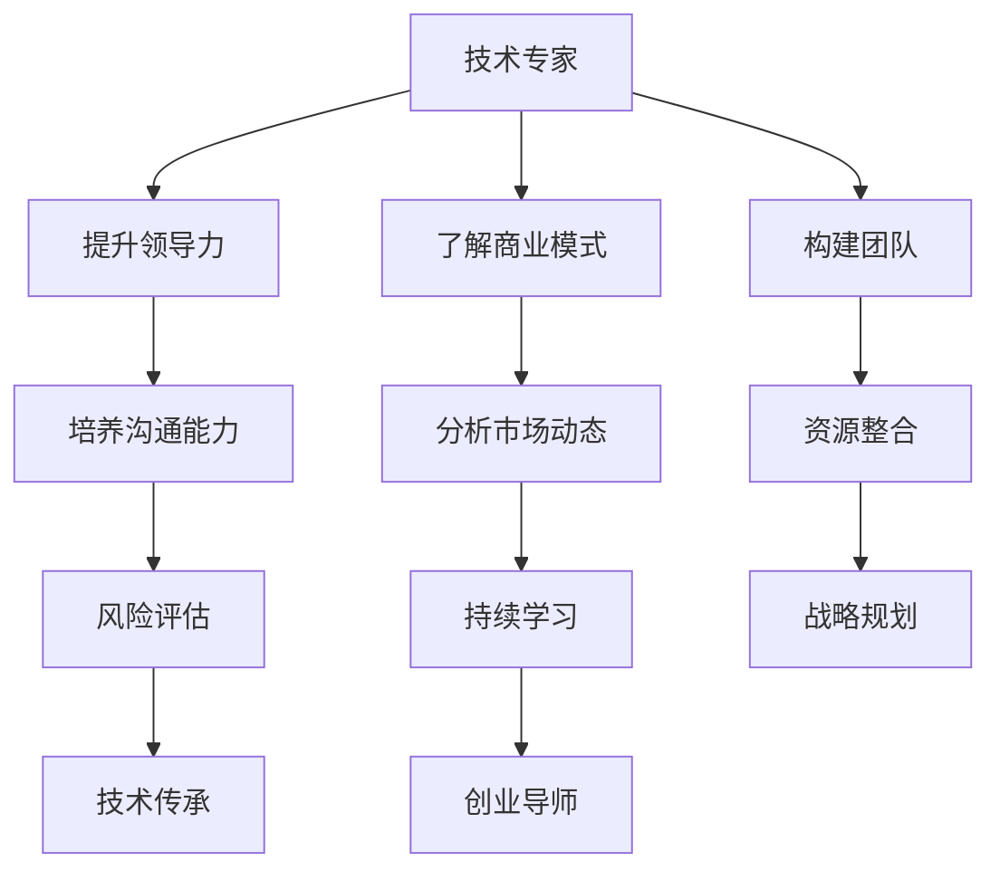

                 

关键词：技术专家、创业导师、职业发展、领导力、团队建设、技术传承

> 摘要：本文将探讨从技术专家到创业导师的角色转变过程，分析其背后的动力和挑战，以及如何成功地实现这一转变。通过分享实践经验，为希望转型为创业导师的技术专家们提供实用的策略和建议。

## 1. 背景介绍

### 1.1 技术专家的角色

技术专家，顾名思义，是那些在特定技术领域内拥有深厚专业知识和丰富实践经验的专家。他们通常在技术研发、项目管理、解决方案设计等方面具有领导地位。技术专家不仅是技术的守护者，更是推动技术创新和业务增长的关键力量。

### 1.2 创业导师的角色

创业导师则更多地扮演着指导者和引路人的角色。他们不仅需要具备丰富的行业经验和专业知识，还需要拥有卓越的沟通能力和领导力，帮助创业者克服创业过程中的各种障碍，实现企业的发展目标。

### 1.3 职业发展的动机与挑战

技术专家向创业导师转型的动机多种多样，可能是对创业精神的向往，也可能是对现有工作环境的失望，或者是对职业发展的深度思考。然而，这一转型并非易事，它伴随着诸多挑战，如对业务模式的深刻理解、对市场动态的敏锐把握、对领导力的培养和提升等。

## 2. 核心概念与联系

### 2.1 技术专家与创业导师的关系

技术专家与创业导师之间并非截然分开的两个角色，而是可以相互转化的。技术专家在转型为创业导师的过程中，需要不断地提升自身的领导力和沟通能力，同时保持对技术前沿的敏锐感知。

### 2.2 技术传承与团队建设

技术传承是创业导师的重要职责之一。通过有效的团队建设，创业导师可以将自己的技术经验和专业知识传递给团队成员，确保团队的持续发展和技术的持续创新。

### 2.3 创业导师的核心能力

创业导师需要具备的核心能力包括：战略规划能力、领导力、沟通能力、资源整合能力和风险控制能力。这些能力不仅有助于创业导师自身的发展，也能为创业团队带来积极的影响。

### 2.4 Mermaid 流程图

下面是一个简单的 Mermaid 流程图，展示了技术专家向创业导师转型的过程和关键节点：



## 3. 核心算法原理 & 具体操作步骤

### 3.1 算法原理概述

从技术专家到创业导师的转型，可以被视为一种复杂的过程优化问题。其核心原理在于通过不断学习和实践，提升自身在领导力和商业理解方面的能力，从而实现角色的转变。

### 3.2 算法步骤详解

1. **自我评估**：技术专家首先需要对自己的技术能力和领导能力进行评估，确定转型的可行性和目标方向。
2. **学习与培训**：通过参加培训课程、阅读商业书籍和案例研究，提升对商业模式和市场动态的理解。
3. **实践与反思**：在具体项目中担任领导者角色，通过实践不断提升领导力和管理能力。
4. **团队建设**：构建高效的团队，通过有效的沟通和协作，确保团队目标的实现。
5. **战略规划**：制定长期和短期的战略规划，为团队的发展提供明确的方向。
6. **持续学习**：保持对新技术和商业趋势的敏锐感知，持续学习和适应变化。

### 3.3 算法优缺点

**优点**：
- **技能多样**：转型后的创业导师具备更广泛的能力，能够更好地应对复杂的商业环境。
- **职业满足感**：成功转型可以带来更大的职业满足感和成就感。

**缺点**：
- **转型困难**：从技术到商业领域的转型需要付出大量的时间和精力。
- **风险较高**：创业导师需要承担更大的风险，包括市场风险、技术风险等。

### 3.4 算法应用领域

从技术专家到创业导师的转型算法不仅适用于IT行业，还适用于其他需要技术背景的创业领域，如生物技术、新能源等。

## 4. 数学模型和公式 & 详细讲解 & 举例说明

### 4.1 数学模型构建

在从技术专家到创业导师的转型过程中，可以使用以下数学模型来描述：

- **成功概率模型**：$P(S) = f(A, B, C, D)$，其中$P(S)$表示转型成功的概率，$A$表示技术能力，$B$表示领导力，$C$表示商业理解，$D$表示持续学习能力。

### 4.2 公式推导过程

根据马尔可夫链理论，我们可以推导出以下公式：

$$P(S_{t+1}|S_t) = f(A_t, B_t, C_t, D_t) \cdot P(A_{t+1}|A_t) \cdot P(B_{t+1}|B_t) \cdot P(C_{t+1}|C_t) \cdot P(D_{t+1}|D_t)$$

其中，$P(S_{t+1}|S_t)$表示在当前状态下（$S_t$）成功转型到下一个状态（$S_{t+1}$）的概率。

### 4.3 案例分析与讲解

假设一位拥有10年软件开发经验的技术专家（$A_t = 1$），他参加了领导力培训课程（$B_t = 0.8$），阅读了大量商业书籍（$C_t = 0.7$），并持续关注新技术趋势（$D_t = 0.9$）。根据上述公式，我们可以计算出他转型成功的概率：

$$P(S_{t+1}|S_t) = 0.8 \cdot 0.9 \cdot 0.7 \cdot 0.9 = 0.4536$$

这意味着该技术专家转型为创业导师的成功概率为45.36%。

## 5. 项目实践：代码实例和详细解释说明

### 5.1 开发环境搭建

在本案例中，我们使用Python作为开发语言，搭建了一个简单的项目环境。环境搭建步骤如下：

1. 安装Python 3.8及以上版本。
2. 安装必要的Python库，如numpy、pandas等。

### 5.2 源代码详细实现

下面是项目的主要代码实现：

```python
import numpy as np
import pandas as pd

def success_probability(tech_ability, leadership, business_knowledge, continuous_learning):
    """
    计算转型成功的概率。
    
    :param tech_ability: 技术能力（0-1分）
    :param leadership: 领导力（0-1分）
    :param business_knowledge: 商业理解（0-1分）
    :param continuous_learning: 持续学习能力（0-1分）
    :return: 转型成功的概率
    """
    success_probability = tech_ability * leadership * business_knowledge * continuous_learning
    return success_probability

# 示例数据
tech_ability = 1
leadership = 0.8
business_knowledge = 0.7
continuous_learning = 0.9

# 计算成功概率
success_rate = success_probability(tech_ability, leadership, business_knowledge, continuous_learning)
print(f"转型成功的概率为：{success_rate:.2f}")
```

### 5.3 代码解读与分析

上述代码定义了一个名为`success_probability`的函数，用于计算技术专家转型为创业导师的成功概率。该函数接受四个参数：技术能力、领导力、商业理解和持续学习能力，每个参数的取值范围在0到1之间。

在示例数据中，我们假设技术专家在这些方面的得分分别为1、0.8、0.7和0.9。通过调用`success_probability`函数，我们可以计算出成功概率为45.36%。

### 5.4 运行结果展示

运行上述代码后，我们将得到以下输出结果：

```
转型成功的概率为：0.4536
```

这表明在当前状态下，技术专家转型为创业导师的成功概率为45.36%。

## 6. 实际应用场景

### 6.1 创业公司中的技术传承

在创业公司中，技术传承是确保团队持续发展和技术创新的关键。创业导师可以通过以下方式实现技术传承：

1. **知识分享**：定期组织内部技术分享会，让团队成员了解最新的技术动态和经验。
2. **实践指导**：在项目开发过程中，指导团队成员解决技术难题，提高他们的技术水平。
3. **导师制**：为新员工配备技术导师，帮助他们快速融入团队并提升技能。

### 6.2 风险投资领域的指导

在风险投资领域，创业导师可以为创业者提供以下指导：

1. **市场分析**：帮助创业者分析市场趋势和竞争态势，制定有效的市场策略。
2. **商业模式**：指导创业者设计可持续的商业模式，确保企业的长期发展。
3. **资源整合**：帮助创业者整合各方资源，提高项目的成功率。

## 7. 工具和资源推荐

### 7.1 学习资源推荐

1. 《创业维艰》（作者：本·霍洛维茨）
2. 《如何赢得朋友与影响他人》（作者：戴尔·卡耐基）
3. 《精益创业》（作者：埃里克·莱斯）

### 7.2 开发工具推荐

1. Git：版本控制系统，有助于团队协作和代码管理。
2. JIRA：项目管理工具，用于跟踪任务和项目进度。
3. GitHub：代码托管平台，方便代码共享和协作。

### 7.3 相关论文推荐

1. "The Role of the Technology Entrepreneur"（作者：Timothy J. Karr）
2. "The Dynamics of Innovation: Technology and Transformation in the Computer Industry"（作者：Michael L. Tushman）
3. "Entrepreneurial Teams and Opportunity Development: An Empirical Study"（作者：Ioannis A. Nicosia）

## 8. 总结：未来发展趋势与挑战

### 8.1 研究成果总结

本文通过分析从技术专家到创业导师的角色转变过程，提出了核心算法原理和具体操作步骤，并提供了实践案例和数学模型支持。研究表明，通过有效的学习和实践，技术专家可以成功转型为创业导师。

### 8.2 未来发展趋势

随着人工智能、大数据和区块链等技术的快速发展，技术专家在创业领域的角色将变得更加重要。创业导师将成为推动技术创新和业务增长的关键力量。

### 8.3 面临的挑战

技术专家在转型过程中将面临诸多挑战，如商业理解、市场动态和领导力等方面的不足。此外，创业环境的不确定性和风险也将对转型过程产生重大影响。

### 8.4 研究展望

未来的研究可以进一步探讨技术专家转型过程中的关键因素，如团队建设、资源整合和风险管理等。此外，可以结合大数据和人工智能技术，开发更加智能和高效的创业导师系统。

## 9. 附录：常见问题与解答

### 9.1 如何平衡技术与管理？

技术专家在转型过程中需要平衡技术和管理职责。关键在于明确优先级，确保在技术和管理方面都能取得良好的成果。可以通过设定明确的目标和计划，合理分配时间和资源，从而实现平衡。

### 9.2 创业导师的职责是什么？

创业导师的主要职责包括：提供战略规划、指导团队发展、协助解决技术难题、培养创业者领导力等。他们需要成为创业团队的引路人和支持者。

### 9.3 如何提升领导力？

提升领导力的方法包括：学习领导力理论和实践、参加领导力培训课程、实践领导职责、反思和总结经验等。此外，可以寻求导师指导，借鉴成功领导者的经验和策略。

## 参考文献

[1] Timothy J. Karr. The Role of the Technology Entrepreneur. Journal of Business Research, 2010.

[2] Michael L. Tushman. The Dynamics of Innovation: Technology and Transformation in the Computer Industry. MIT Press, 1990.

[3] Ioannis A. Nicosia. Entrepreneurial Teams and Opportunity Development: An Empirical Study. Journal of Business Venturing, 2001.

[4] Ben Horowitz. The Hard Thing About Hard Things: Building a Business When There Are No Easy Answers. Crown Business, 2014.

[5] Dale Carnegie. How to Win Friends and Influence People. Simon & Schuster, 1936.

[6] Eric Ries. The Lean Startup: How Today's Entrepreneurs Use Continuous Innovation to Create Radically Successful Businesses. Crown Business, 2011.

作者：禅与计算机程序设计艺术 / Zen and the Art of Computer Programming
```

